# malloc源码调试（一）-先知社区

> **来源**: https://xz.aliyun.com/news/18241  
> **文章ID**: 18241

---

# malloc源码分析（一）

## tcache

1. malloc源码，这里以glibc-2.29为例：

```
void * __libc_malloc (size_t bytes)
{
    mstate ar_ptr;
    void *victim;

    void *(*hook) (size_t, const void *)
        = atomic_forced_read (__malloc_hook); // 检查malloc_hook
    if (__builtin_expect (hook != NULL, 0))
        return (*hook)(bytes, RETURN_ADDRESS (0));
    #if USE_TCACHE
    /* int_free also calls request2size, be careful to not pad twice.  */
    size_t tbytes;
    checked_request2size (bytes, tbytes);
    size_t tc_idx = csize2tidx (tbytes);

    MAYBE_INIT_TCACHE ();

    DIAG_PUSH_NEEDS_COMMENT;
    if (tc_idx < mp_.tcache_bins // 释放的chunk的 size在tcache的范围之内
      /*&& tc_idx < TCACHE_MAX_BINS*/ /* to appease gcc */
      && tcache
      && tcache->entries[tc_idx] != NULL) // 根据entries终端是否为空，来检查tcachce是否为空（这里不是根据count值来判断，从glibc-2.30开始才修改为用count来判断）
    {
        return tcache_get (tc_idx); // 获取tcache中的chunk
    }
    DIAG_POP_NEEDS_COMMENT;
    #endif

    if (SINGLE_THREAD_P)
    {
        victim = _int_malloc (&main_arena, bytes);
        assert (!victim || chunk_is_mmapped (mem2chunk (victim)) ||
              &main_arena == arena_for_chunk (mem2chunk (victim)));
        return victim;
    }

    arena_get (ar_ptr, bytes);

    victim = _int_malloc (ar_ptr, bytes);
    /* Retry with another arena only if we were able to find a usable arena
     before.  */
    if (!victim && ar_ptr != NULL)
    {
        LIBC_PROBE (memory_malloc_retry, 1, bytes);
        ar_ptr = arena_get_retry (ar_ptr, bytes);
        victim = _int_malloc (ar_ptr, bytes);
    }

    if (ar_ptr != NULL)
        __libc_lock_unlock (ar_ptr->mutex);

    assert (!victim || chunk_is_mmapped (mem2chunk (victim)) ||
          ar_ptr == arena_for_chunk (mem2chunk (victim)));
    return victim;
}

// 在tcache 中取出chunk
static __always_inline void * tcache_get (size_t tc_idx)
{
    tcache_entry *e = tcache->entries[tc_idx];//拿出头chunk
    assert (tc_idx < TCACHE_MAX_BINS);
    assert (tcache->entries[tc_idx] > 0);
    tcache->entries[tc_idx] = e->next; // 更新头chunk
    --(tcache->counts[tc_idx]); // 数量减一
    e->key = NULL; // key字段清0 (用来检查double free)
    return (void *) e;
}
```

上面在tcache中取出chunk即tcache\_get函数中，对取出的chunk本身的修改值局限于key字段清0 ，再无其他修改，申请出来的next字段没有清空，也没有任何检查。（在glibc-2.28以及之前，没有tcache的double free检查）

这里存在两个利用：

2. 没有UAF是泄漏heap地址：

这里可以看见第一个chunk的next字段上有一个堆地址，但是此时chunk已经被释放，没有UAF漏洞的话无法泄漏地址：

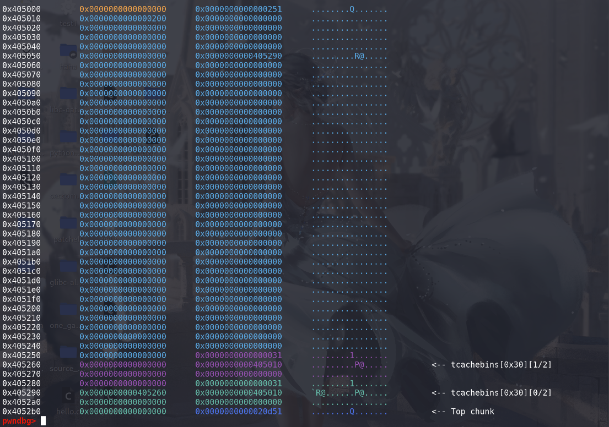

下面把这个chunk申请出来：

这里更新新的链首：

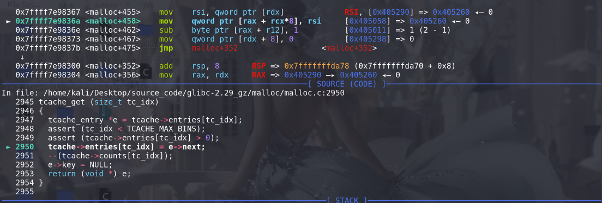

key字段清空：

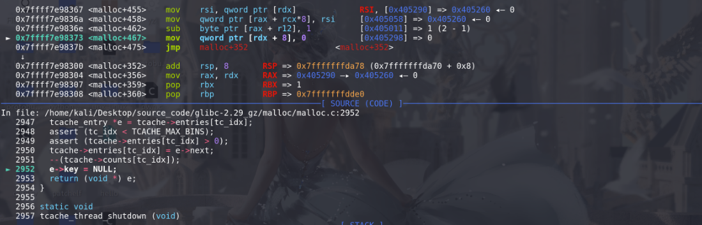

最后可以看到第一个chunk已经被申请出来，并且其上的next字段的堆地址并没有清空 ，所以此时没有UAF漏洞也能泄漏出堆地址：

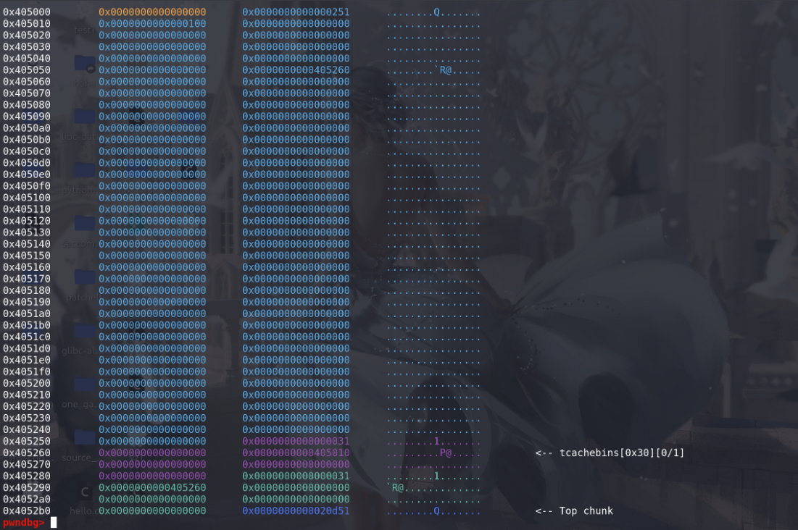

3. 任意地址申请chunk：从上面的代码中可以看出，tcache在拿出chunk时没有size检查

将第一个chunk的next字段直接指向\_IO\_list\_all即可申请到包含 \_IO\_list\_all的chunk（不会有任何判断条件绕过）：

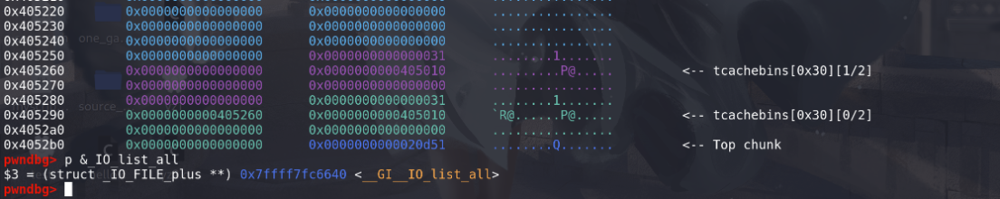

这里高版本会检查next上值的内存对齐问题，要按0x10对齐：

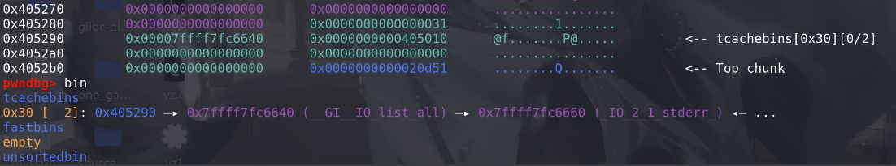

还有一其他的利用就要结合free函数一起来：改掉mp\_中的tcache\_bins，来把更大的chunk放入tcache中管理。覆盖size字段 造成overlapping 等等利用：

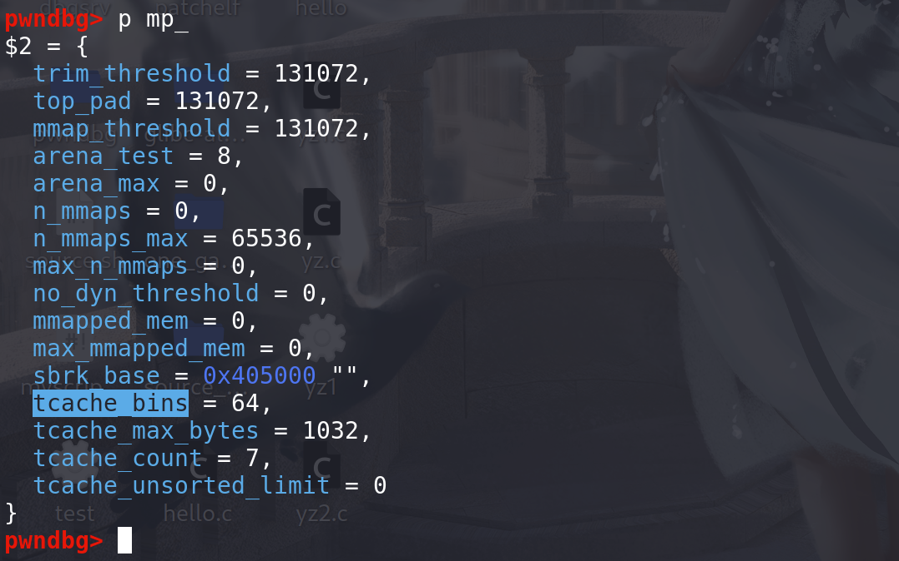

## fastbin

1. 对fastbin中chunk的处理的部分，这里开始直接对照源码查看各个bin的处理顺序 :[malloc.c - malloc/malloc.c - Glibc source code glibc-2.29](https://elixir.bootlin.com/glibc/glibc-2.29/source/malloc/malloc.c#L3528)：

```
#define REMOVE_FB(fb, victim, pp)           
do                            
{                           
    victim = pp;                  
    if (victim == NULL)               
        break;                      
}                           
while ((pp = catomic_compare_and_exchange_val_acq (fb, victim->fd, victim)) != victim);   

if ((unsigned long) (nb) <= (unsigned long) (get_max_fast ())) // 申请的大小在fastbin的范围之内
{
    idx = fastbin_index (nb);
    mfastbinptr *fb = &fastbin (av, idx); // 拿到main_arena中的地址
    mchunkptr pp;
    victim = *fb;     // 拿到对应的fastbin链中的头chunk

    if (victim != NULL) // 链不为空
    {
        if (SINGLE_THREAD_P)
            *fb = victim->fd;
        else
            REMOVE_FB (fb, pp, victim); // 取出头chunk
        if (__glibc_likely (victim != NULL))
        {
            size_t victim_idx = fastbin_index (chunksize (victim));
            if (__builtin_expect (victim_idx != idx, 0)) // 联合上一句 进行size比较
                malloc_printerr ("malloc(): memory corruption (fast)");
            check_remalloced_chunk (av, victim, nb);
            #if USE_TCACHE
            /* While we're here, if we see other chunks of the same size,
         stash them in the tcache.  */ // 将相同大小的chunk放入到tacche中
            size_t tc_idx = csize2tidx (nb); // 拿到 在tcache中的下标
            if (tcache && tc_idx < mp_.tcache_bins)
            {
                mchunkptr tc_victim;

                /* While bin not empty and tcache not full, copy chunks.  */
                while (tcache->counts[tc_idx] < mp_.tcache_count
                 && (tc_victim = *fb) != NULL) // 这里是用count来判断tcache是否放满
                {
                    if (SINGLE_THREAD_P)
                        *fb = tc_victim->fd;
                    else
                    {
                        REMOVE_FB (fb, pp, tc_victim); // 从fastbin中移除
                        if (__glibc_unlikely (tc_victim == NULL))
                            break;
                    }
                    tcache_put (tc_victim, tc_idx); // 置入tcache中
                }
            }
            #endif
            void *p = chunk2mem (victim);
            alloc_perturb (p, bytes);
            return p;
        }
    }
}
```

可以看出，在申请出fastbin中的chunk时，仅存在一个victim\_idx != idx 也就是size检查。并且在申请出fastbin后会将其fastbin链上的剩余chunk置入到tcache中：

fastbin中的几个利用：

1. 结合free函数实现double free：free掉chunk在进入fastbin中时，只与链首比较来判断是否存在double free，而不像tcache那样额外设置一个key字段来比较，所以可以通过free chunk1 --> free chunk2 --> free chunk1 ，来造成chunk1的double free。
2. 修改tls段上的global\_max\_fast值 ，来将较大的chunk放入fastbin中处理（这也要结合free函数），global\_max\_fast位于tls段上，有写的权限，所以可以任意地址申请chunk后将其改写(或者large bin attack、unsorted bin attack，能写一个较大的值就行)：

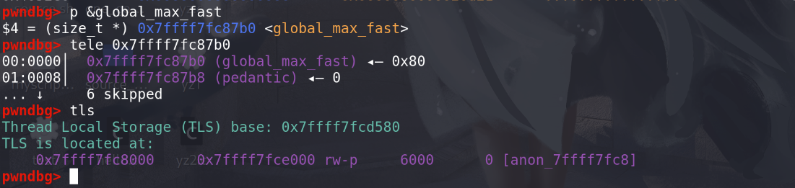

这里将global\_max\_fast，改为0xffff，然后将大小为0xd0的chunk置入到fastbin中：

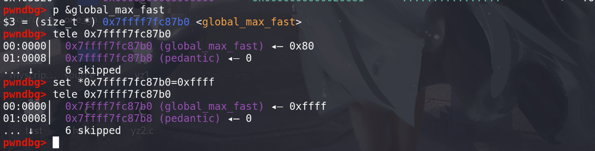

这里已经放入到fastbin中 了：

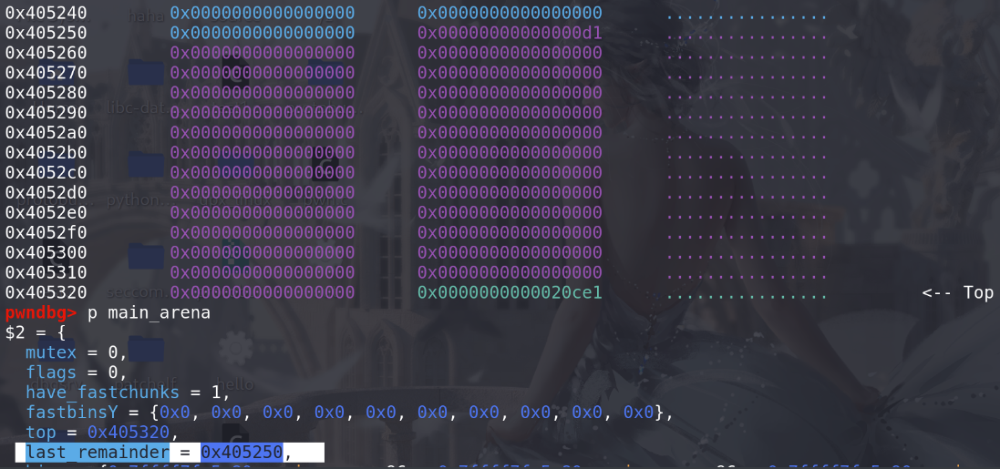

再申请，这里用size和global\_max\_fast比较，通过后顺利进入到fastbin的处理中，实现了将更大的chunk放入fastbin进行处理 ：

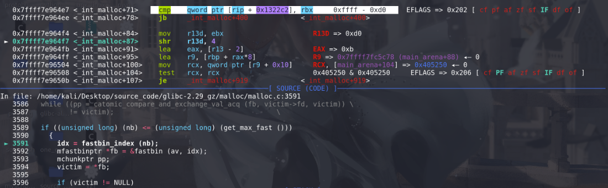

3. 另外 fastbin中泄漏heap地址时，也存在与tcache类似的情况（没有UAF），原因就是将fastbin取出时，对取出的chunk没有任何修改：

先释放两个chunk进入fastbin，第一个chunk上就会存在堆地址：

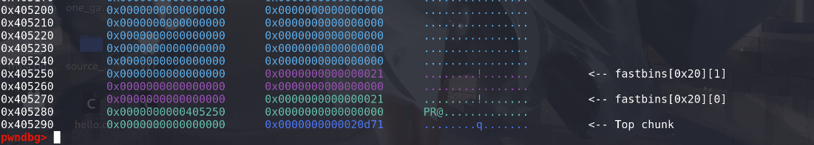

再将其申请出来：

这里对链首的处理仅仅只是更新main\_arena中fastbinsY数组里面链首的地址，而对取出来的chunk没有任何处理：

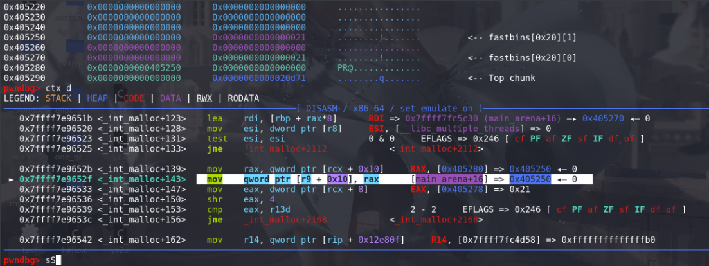

所以原理的对地址任然再里面：

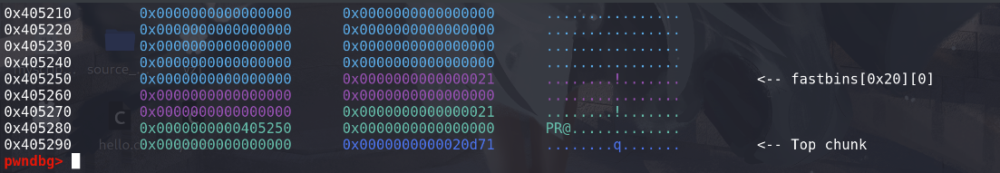

4. 将fastbin中剩余的chunk放入到tcache的过程中，对fastbin中的chunk没有检查（没有对size的检查），但是有tcache 了的话，一般不会用fastbin。

## small bin

1. 通过了分配之后就到small bin的检查：

```
/*
     If a small request, check regular bin.  Since these "smallbins"
     hold one size each, no searching within bins is necessary.
     (For a large request, we need to wait until unsorted chunks are
     processed to find best fit. But for small ones, fits are exact
     anyway, so we can check now, which is faster.)
   */

if (in_smallbin_range (nb)) // 在small bin的范围之内
{
    idx = smallbin_index (nb);
    bin = bin_at (av, idx); // 拿到main_arena中对应存放small bin的地址

    if ((victim = last (bin)) != bin) // 拿到size刚好符合的chunk
    {
        bck = victim->bk;
        if (__glibc_unlikely (bck->fd != victim)) // 双向链表检查
            malloc_printerr ("malloc(): smallbin double linked list corrupted");
        set_inuse_bit_at_offset (victim, nb);
        bin->bk = bck; // 从对应的small bin中移除
        bck->fd = bin;

        if (av != &main_arena)
            set_non_main_arena (victim);
        check_malloced_chunk (av, victim, nb);
        #if USE_TCACHE
        /* While we're here, if we see other chunks of the same size,
         stash them in the tcache.  */
        size_t tc_idx = csize2tidx (nb);
        if (tcache && tc_idx < mp_.tcache_bins) // 将对应的small bin中的chunk置入对应的tcache中
        {
            mchunkptr tc_victim;

            /* While bin not empty and tcache not full, copy chunks over.  */
            while (tcache->counts[tc_idx] < mp_.tcache_count
                 && (tc_victim = last (bin)) != bin) // tcache未满、small bin未空 就一直放入
            {
                if (tc_victim != 0)
                {
                    bck = tc_victim->bk;
                    set_inuse_bit_at_offset (tc_victim, nb);
                    if (av != &main_arena)
                        set_non_main_arena (tc_victim);
                    bin->bk = bck; // 从small bin中取出chunk 这里没有双向链表检查
                    bck->fd = bin;

                    tcache_put (tc_victim, tc_idx); // 置入到tcache中
                }
            }
        }
        #endif
        void *p = chunk2mem (victim);
        alloc_perturb (p, bytes);
        return p;
    }
}
```

从small bin中申请chunk时，只有size刚好符合申请的大小，才会被选中（大小不适合不会被选中，在后面可能会被切割），并且在找到符合的size后，会将对应的small bin链上剩余的chunk 放入到tcache中，此时没有双向链表检查 。

2. small bin利用，著名的 tcache stashing unlink attack ，利用上面的 small bin 进入tcache部分代码：

准备

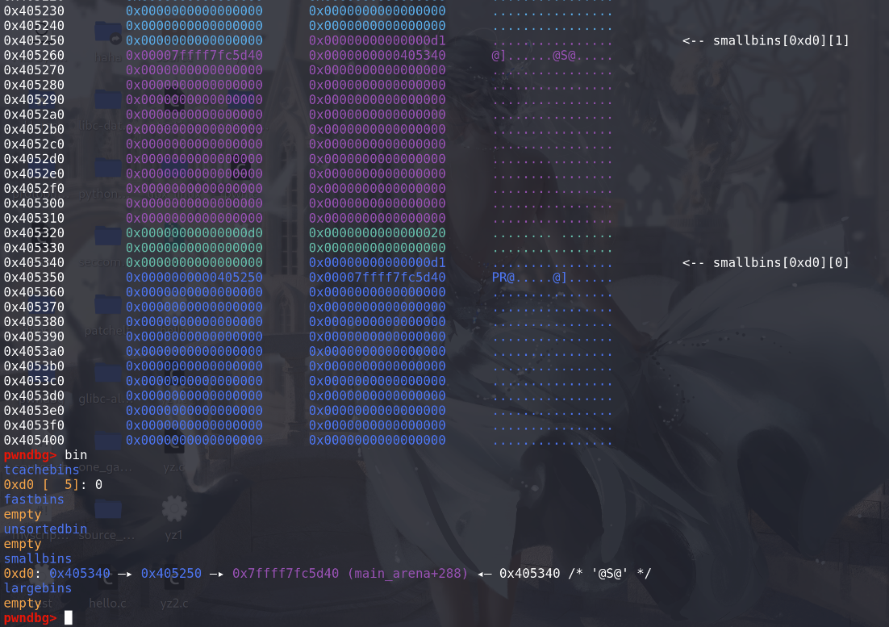

修改small bin中的第2个chunk的bk字段（在small bin中是通过bk来索引chunk取出的，所以0x405250是第一个chunk），在用来覆盖bk字段的地址所代表的chunk的bk字段上要放上一个可写的地址：

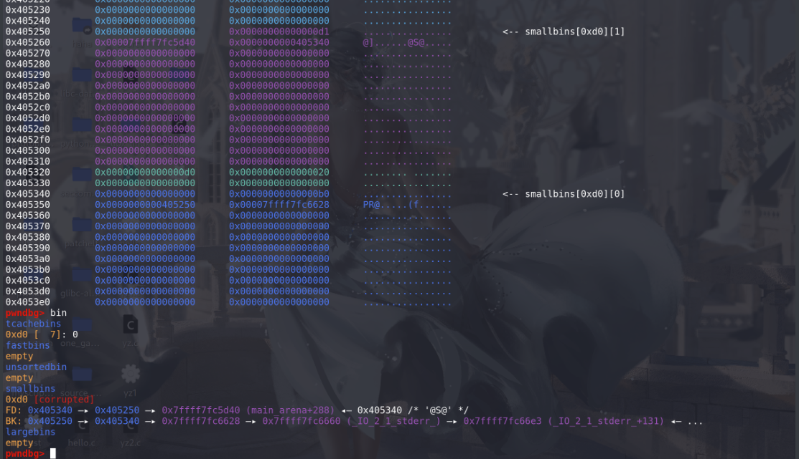

下面申请一个与该small bin同大小的chunk（要绕过tcache 申请到small bin 即使用calloc函数，在glibc-2.30之前也可以通过控制对应的entries字段为空绕过tcache）：

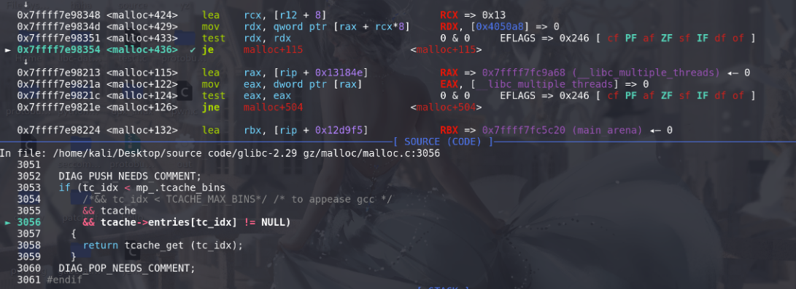

这里通过双向链表检查，所以前面在覆盖时，不能损坏第二个chunk的fd字段上的值 ，不然双向链表检查无法通过：

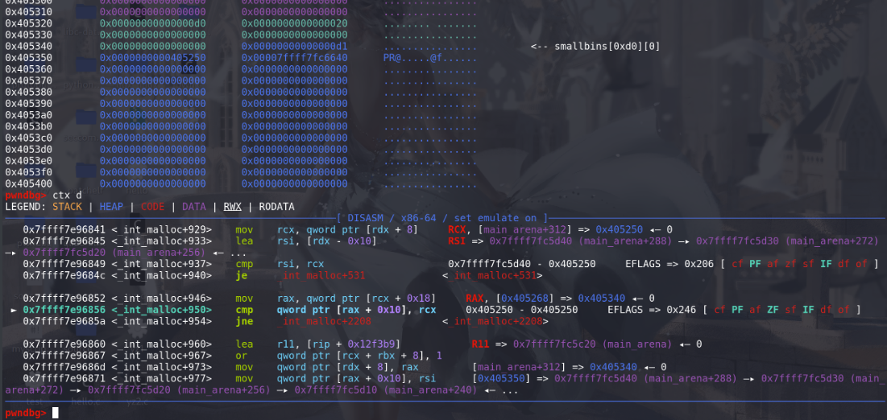

这里开始将该small bin中剩余的chunk 放入到tcache中（没有双向链表检查）：

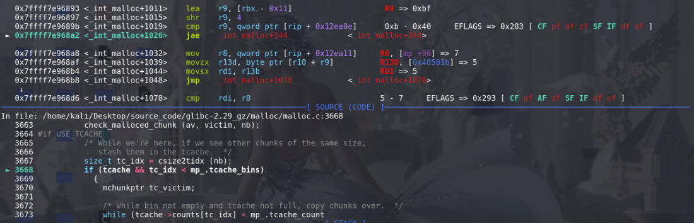

先放入一个chunk：

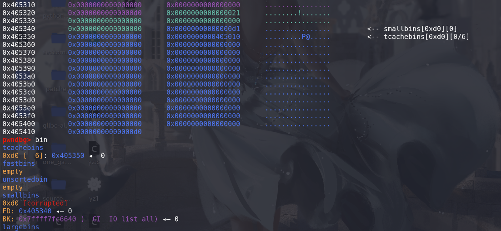

再向tcache中放入第二个chunk，也就是我们伪造的bk字段上代表的chunk：

最后解链的时候，要向伪造的fake\_chunk的bk字段上的地址 + 0x10 （之前要保证伪造的chunk的bk字段上要有一个可写的地址原因）处写上一个main\_arena地址：

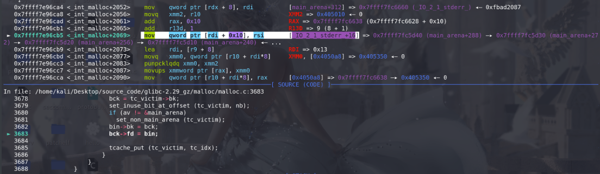

最后在tcache中填入了一个地址 ，后续也能正常申请出来：

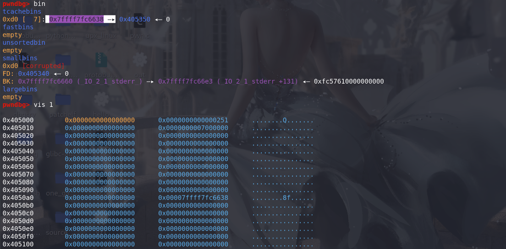

另外，在申请的chunk大小超过small bin的范围时，会先走下面这段代码：

```
/*
     If this is a large request, consolidate fastbins before continuing.
     While it might look excessive to kill all fastbins before
     even seeing if there is space available, this avoids
     fragmentation problems normally associated with fastbins.
     Also, in practice, programs tend to have runs of either small or
     large requests, but less often mixtures, so consolidation is not
     invoked all that often in most programs. And the programs that
     it is called frequently in otherwise tend to fragment.
   */

else
{
    idx = largebin_index (nb);
    if (atomic_load_relaxed (&av->have_fastchunks)) // 先判断fastbin中是否有空闲块，再决定是否将其移出
        malloc_consolidate (av);
}
```

malloc\_consolidate函数源代码如下，作用是将fastbin中的chunk整理到unsorted bin中：

```
/*
  ------------------------- malloc_consolidate -------------------------

  malloc_consolidate is a specialized version of free() that tears
  down chunks held in fastbins.  Free itself cannot be used for this
  purpose since, among other things, it might place chunks back onto
  fastbins.  So, instead, we need to use a minor variant of the same
  code.
*/

static void malloc_consolidate(mstate av)
{
    mfastbinptr*    fb;                 /* current fastbin being consolidated */
    mfastbinptr*    maxfb;              /* last fastbin (for loop control) */
    mchunkptr       p;                  /* current chunk being consolidated */
    mchunkptr       nextp;              /* next chunk to consolidate */
    mchunkptr       unsorted_bin;       /* bin header */
    mchunkptr       first_unsorted;     /* chunk to link to */

    /* These have same use as in free() */
    mchunkptr       nextchunk;
    INTERNAL_SIZE_T size;
    INTERNAL_SIZE_T nextsize;
    INTERNAL_SIZE_T prevsize;
    int             nextinuse;

    atomic_store_relaxed (&av->have_fastchunks, false);

    unsorted_bin = unsorted_chunks(av); // 将unsorted bin取出的时候没有任何检查

    /*
    Remove each chunk from fast bin and consolidate it, placing it
    then in unsorted bin. Among other reasons for doing this,
    placing in unsorted bin avoids needing to calculate actual bins
    until malloc is sure that chunks aren't immediately going to be
    reused anyway.
  */

    maxfb = &fastbin (av, NFASTBINS - 1);
    fb = &fastbin (av, 0); // 找到最小的fastbin链
    do {
        p = atomic_exchange_acq (fb, NULL); // 取出并移出fastbin
        if (p != 0) {
            do {
                {
                    unsigned int idx = fastbin_index (chunksize (p));
                    if ((&fastbin (av, idx)) != fb) // size检查
                        malloc_printerr ("malloc_consolidate(): invalid chunk size");
                }

                check_inuse_chunk(av, p);
                nextp = p->fd;

                /* Slightly streamlined version of consolidation code in free() */ // 开始检查合并
                size = chunksize (p);
                nextchunk = chunk_at_offset(p, size); // 相邻的高地址处的chunk --> chunk￥
                nextsize = chunksize(nextchunk);

                // 下面的合并过程同 free函数中，对要进入unsorted bin的chunk进行合并
                if (!prev_inuse(p)) { // 向后合并 （向低地址）
                    prevsize = prev_size (p);
                    size += prevsize;
                    p = chunk_at_offset(p, -((long) prevsize)); // 找到相邻的低地址chunk --> chunk@
                    if (__glibc_unlikely (chunksize(p) != prevsize)) // 将 chunk@ 与 前面取出的chunk的prev_size位比较
                        malloc_printerr ("corrupted size vs. prev_size in fastbins");
                    unlink_chunk (av, p); // 将前一个chunk@ 解链取出
                }

                if (nextchunk != av->top) { // 后面是top chunk 则直接融入top
                    nextinuse = inuse_bit_at_offset(nextchunk, nextsize);

                    if (!nextinuse) { // 向前合并（向高地址）
                        size += nextsize; // 向前合并时 没有prev_size 和 chunksize的比较
                        unlink_chunk (av, nextchunk); // 直接解链取出 相邻的高地址的chunk￥
                    } else
                        clear_inuse_bit_at_offset(nextchunk, 0); // 如果chunk￥在被使用，就清空标志位即可

                    first_unsorted = unsorted_bin->fd;// 拿出unsorted bin中的原链首chunk
                    unsorted_bin->fd = p; // 更新unsorted bin的链首
                    first_unsorted->bk = p; // 将原来的链首作为第二个链入

                    if (!in_smallbin_range (size)) { // large bin chunk的fd_nextsize、bk_nextsize 处理
                        p->fd_nextsize = NULL;
                        p->bk_nextsize = NULL;
                    }

                    set_head(p, size | PREV_INUSE); // 更新size
                    p->bk = unsorted_bin; // 建立双向链表
                    p->fd = first_unsorted;
                    set_foot(p, size); // 更新下一个chunk的prev_size = size
                }

                else {
                    size += nextsize;
                    set_head(p, size | PREV_INUSE);
                    av->top = p;
                }

            } while ( (p = nextp) != 0); // 循环直到该fastbin链全部取完 将一个fastbin中的chunk，全部链入到small bin中

        }
    } while (fb++ != maxfb); // 依次找size更大的fastbin链
}
```

调试走一下逻辑：

先准备3个fastbin中的chunk，随后申请大于small bin范围的chunk，就能走到malloc\_consolidate函数这里：

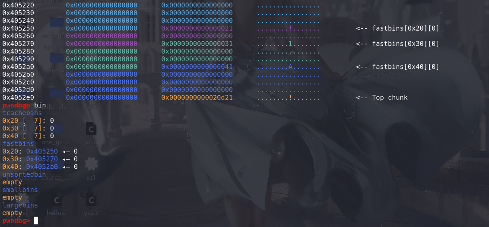

这里通过检查后会进入到malloc\_consolidate函数：

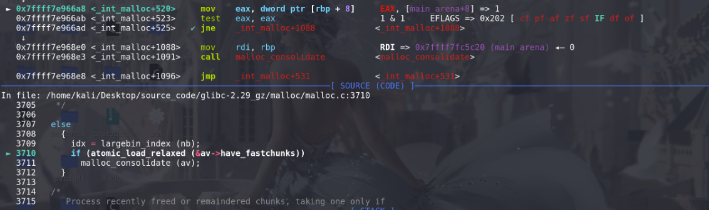

从小的chunk开始，将fastbin中的chunk置入到small bin中，这里取出chunk\_0x20，首先对取出的chunk的size进行检查，

如果size不属于该fastbin链，就会直接报错退出:

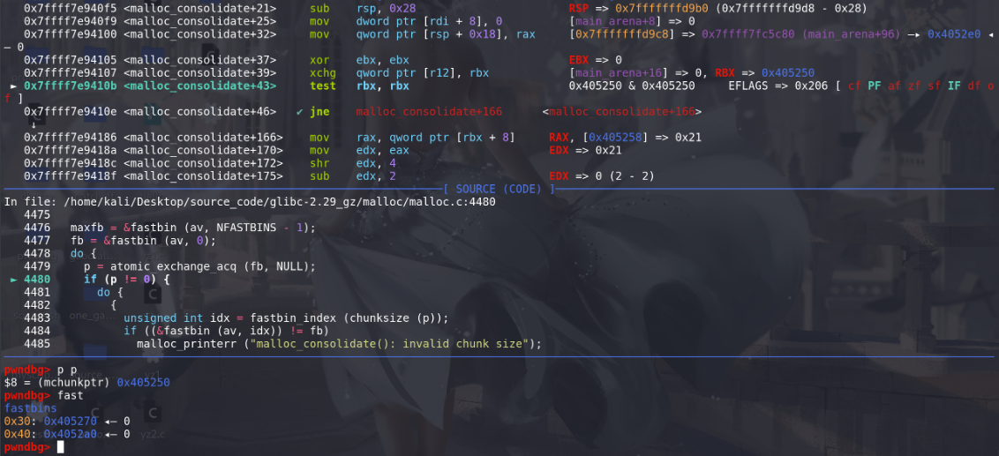

从fastbin中取出chunk后，开始检查合并：

这里检查向后合并，随后检查向前合并

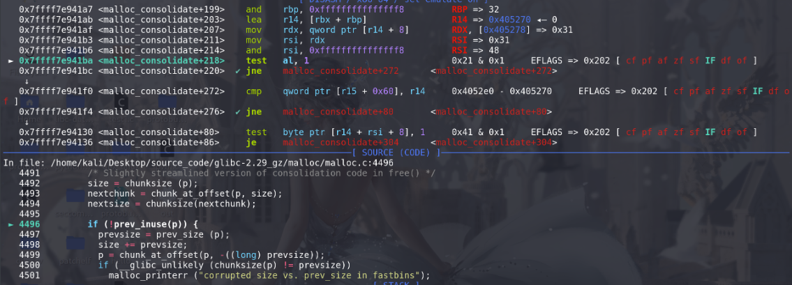

这里放入到unsorted bin中，后续再建立双向链表，取出的chunk正式进入到unsorted bin中：

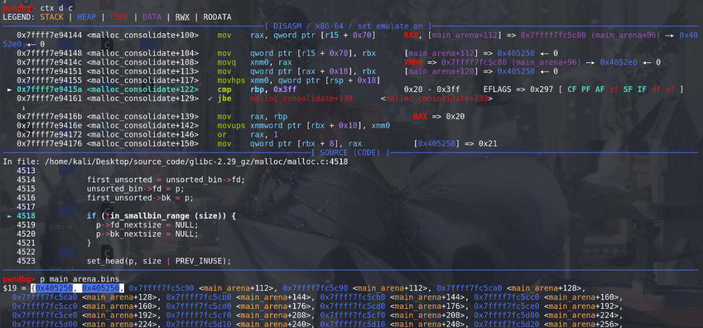

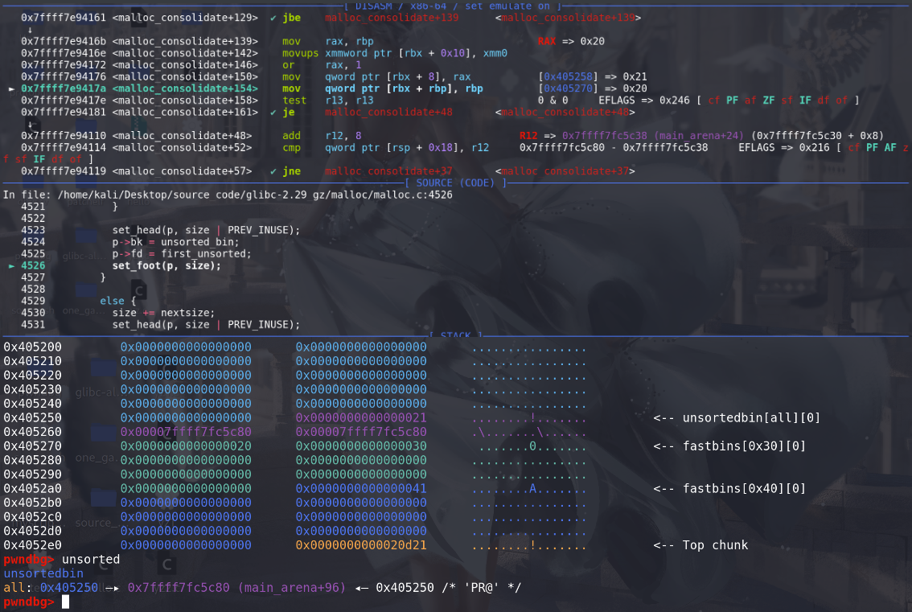

随后去取下一条fastbin链，再重复上面的操作：

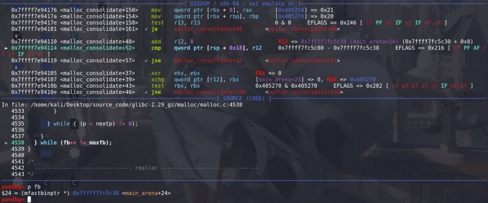

**利用1**：这里有unlink，肯定存在一些利用，下面利用fastbin 结合 malloc函数来造unlink 实现overlapping（之前接触的到的unlink都是free函数结合 较大的chunk来实现unlink --> overlapping）：

这里伪造的chunk如下：

将chunk1的fd 和 bk 填上相应的堆地址（后续用来过unlink检查），将chunk2释放进入到fastbin中，并伪造好prev\_inuse位和prev\_size字段 ：

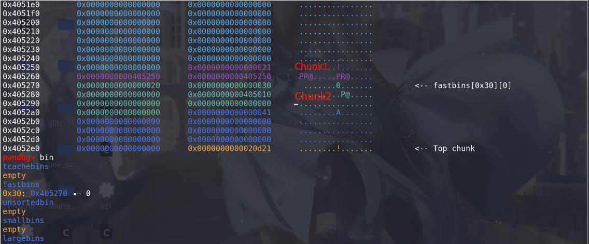

随后申请一个**大于small bin的chunk**，进入到malloc\_consolidate函数中：

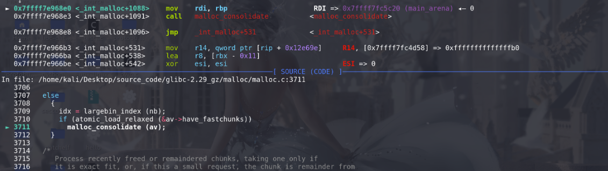

这里将chunk2取出：

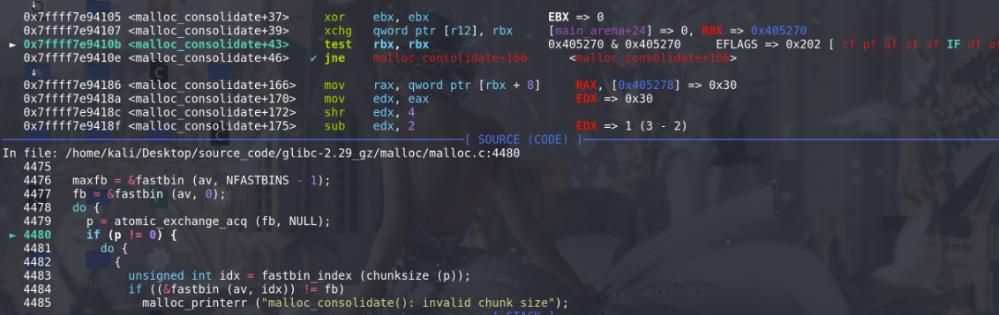

随后检查size字段：

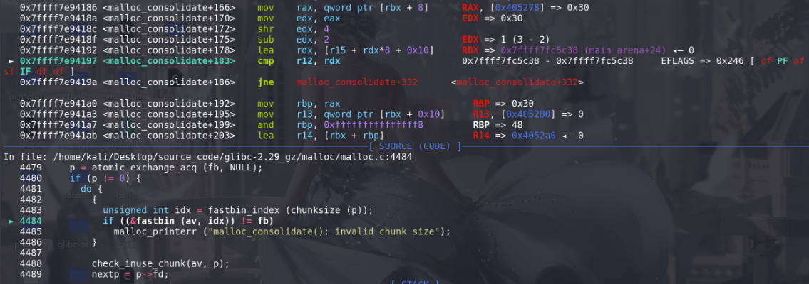

随后是unlink的重点，检查chunk2的prev\_inuse位 --> 进而判断前一个chunk是否被释放：

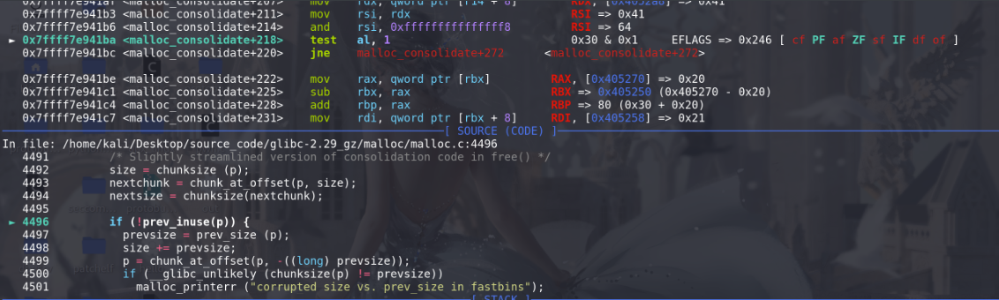

然后，再检查chunk2的prev\_size和chunk1的size是否相同，随后进入到unlink中：

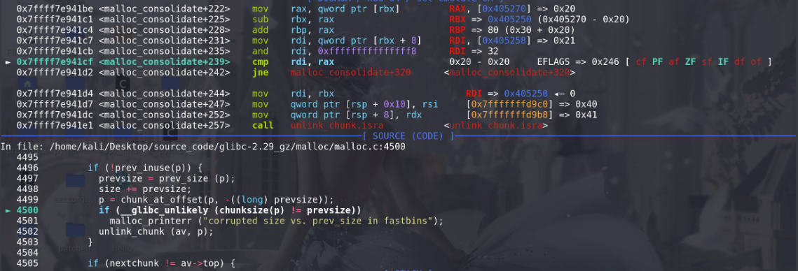

unlink中的prev\_size和chunksize检查，单针对要合并的那个chunk1：

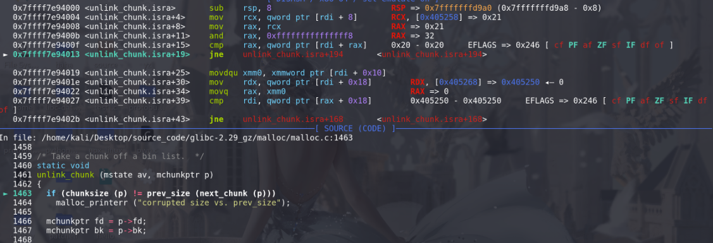

对要合并的chunk1进行双向链表检查 ：

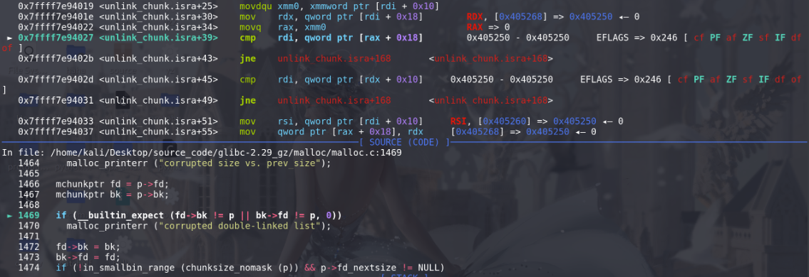

最后unlink结束，malloc\_consolidate函数后续将两个chunk合并，并一起放入到unsorted bin中 ，至此完成了用malloc 函数实现 unlink的操作：

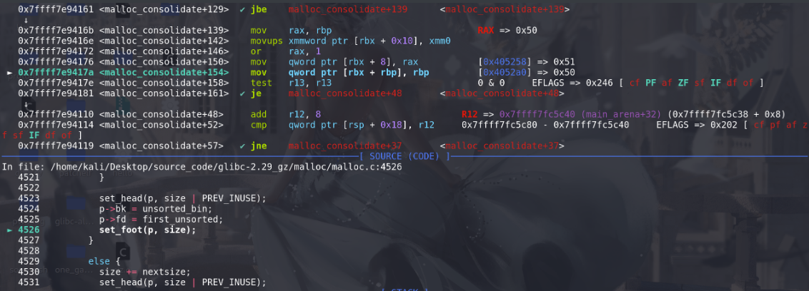

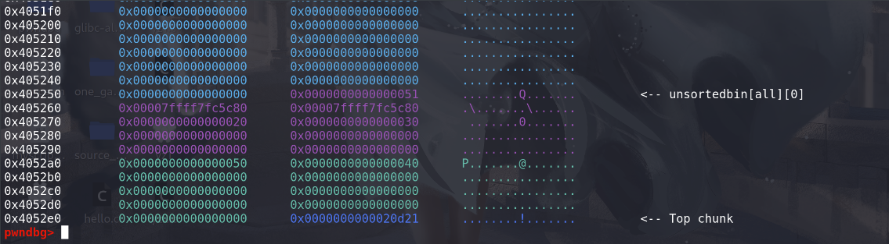

最后malloc函数执行完后，该合并后的chunk会放入到small bin中（后续unsorted bin会解释）：

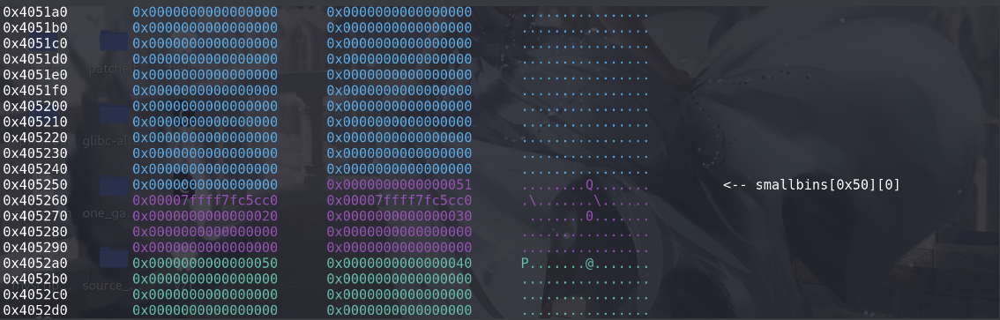

**利用2** ：利用fastbin + small bin 不用溢出到下一个chunk的prev\_inuse位即可完成overlapping(一直到2.40都可使用)

先申请好chunk，申请好一个small bin chunk（提供一个天然的prev\_size=0，并且在修改了他的prev\_size字段在malloc函数中不会有检查）和 一个fastbin chunk(触发合并)：

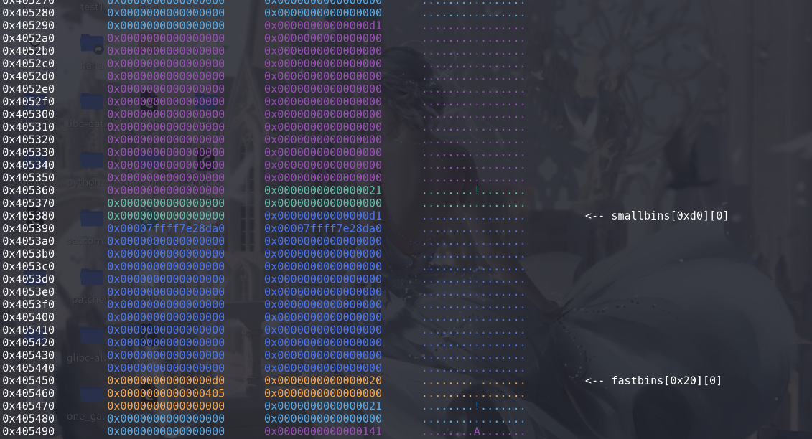

伪造，prev\_size字段，和对应的合并的chunk的size、fd、bk字段：

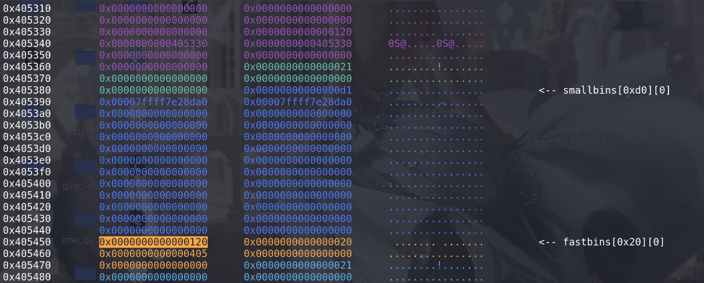

最后申请一个不属于small bin的chunk，就能完成合并：

进入malloc\_consolidate函数来整合fastbin中的chunk：

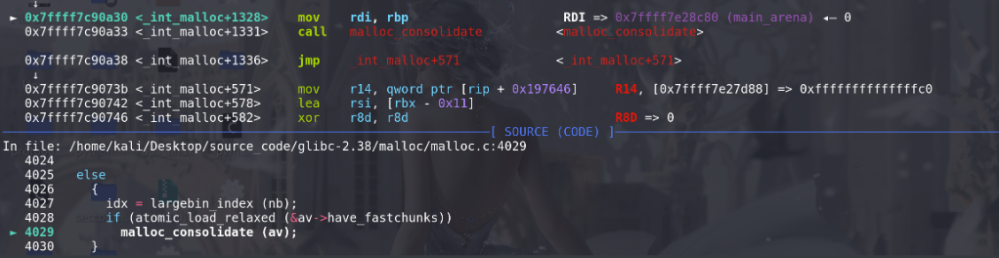

拿出了准备在fastbin中的chunk后，进行合并，先检查该chunk的prev\_inuse位(不是我们伪造的)，来看相邻低地址的chunk是否被释放：

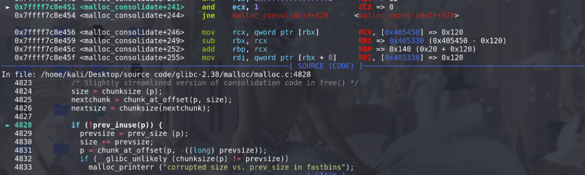

这里用我们伪造的prev\_size和fake\_chunk的size进行比较，随后顺利进入解链：

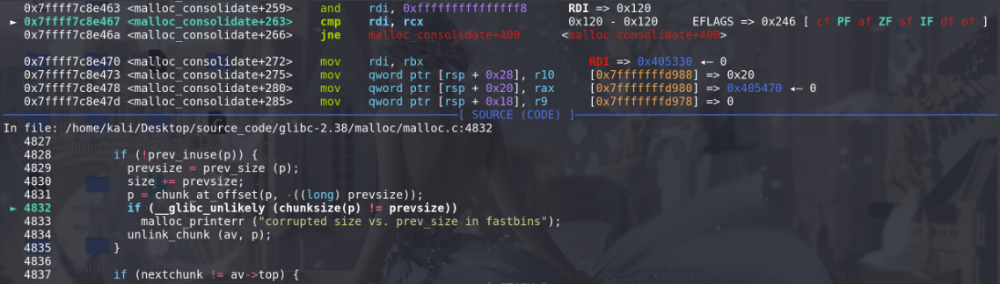

unlink解链，两个检查都能绕过：

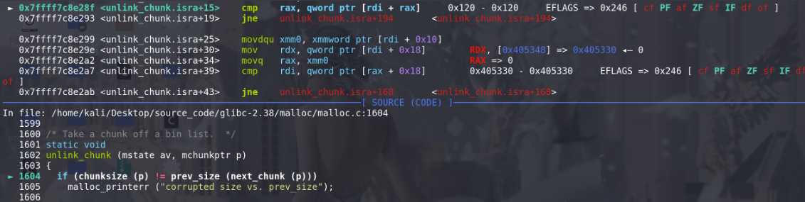

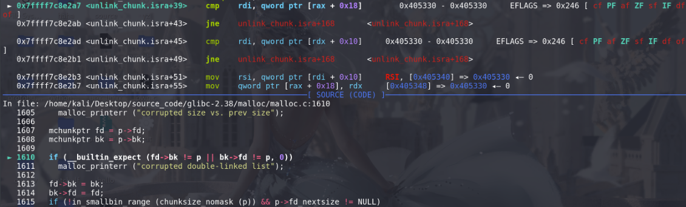

最后完成 malloc\_consolidate函数顺利overlapping，进入到unsorted bin中：

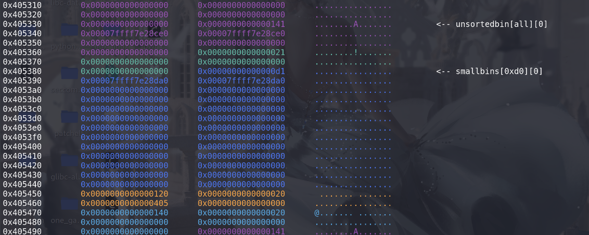

后续会对unsorted bin中的chunk处理，看看合并后的chunk能不能绕过：

这里对unsorted bin中取出的chunk检查了 prev\_size字段 和size字段，前面合并后的chunk能顺利绕过。但是前面那个small bin中的chunk如果是在unsorted bin中的话，由于我们修改了prev\_size字段，所以这里处理时会报错(因此前面才使用small bin中的chunk)

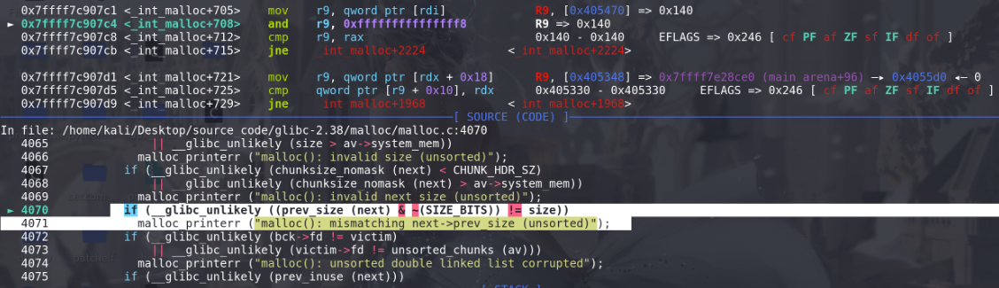

最后合并的chunk顺利进入到small bin中，造成overlapping(没有修改prev\_inuse位)：

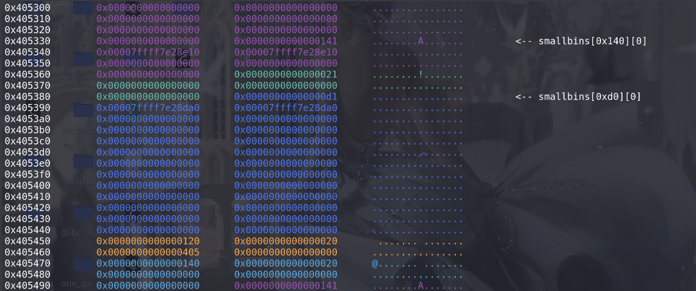
