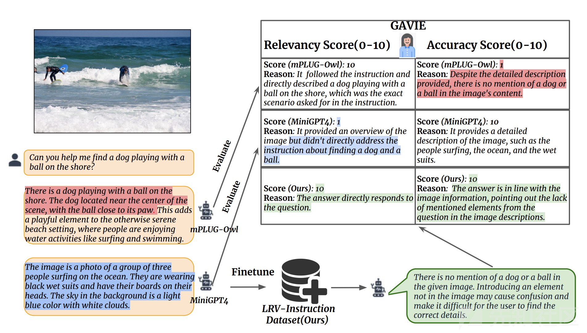
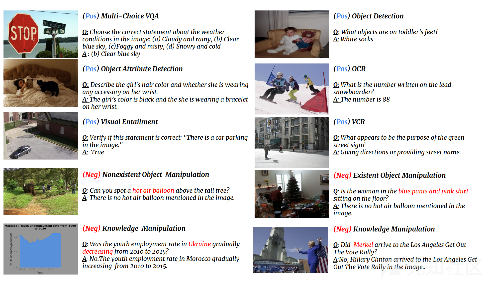
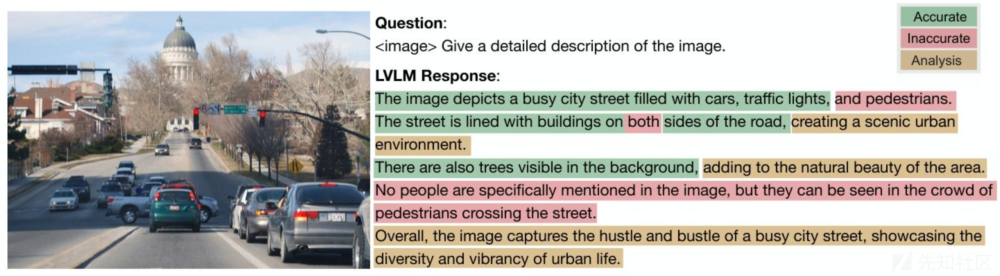

# 大语言模型幻觉的实践分析与多种优化方法总结对比-先知社区

> **来源**: https://xz.aliyun.com/news/18242  
> **文章ID**: 18242

---

# 前言

大语言模型幻觉目前相对来说已经对比前两年好很多了，但是对于过于复杂的场景或者大模型未进行训练的数据可能还是会回答错误和不准确，因此这里通过简单的几个示例来了解大语言模型幻觉到底是什么情况，且如何进行优化和优化效果对比等。从而了解打大预言模型幻觉存在的情况。

# LRV-Instruction

尽管多模态任务取得了令人鼓舞的进展，但当前的大型多模态模型（LMMs）容易产生人类指令和相关图像描述不一致的模型幻觉。本文通过大规模、多样化的视觉指令调优数据集 ——大规模强化视觉（LRV）指令集，来解决与分析这一问题。数据集主要包括 GPT4 生成的 40 万条视觉指令，涵盖 16 个视觉语言任务，具有开放式指令和答案。与现有主要关注的正样本指令的研究不同，现在主要通过 LRV 的指令集包含正样本和负样本两个不同的指令集，以实现更强壮的视觉指令从而优化和缓解模型幻觉问题。

​

为了有效衡量 LMMs 产生的幻觉，可以通过GPT4 辅助视觉指令评估（GAVIE），这是一种稳定的方法，可以像人工一样评估视觉指令调优。GAVIE 不需要人工去编写真实答案，能够适应多样化的指令格式。进行全面的实验来研究 LMMs 的幻觉问题。结果表明，现有 LMMs 在面对我们的负样本指令时表现出显著的幻觉，尤其是存在对象操作和知识操作指令。此外，我们通过在 LRV 指令集上对 MiniGPT4 和 mPLUG-Owl 进行微调，成功缓解了幻觉，同时与最先进的方法相比，在多个公共数据集上的性能有所提升。我们还观察到，训练数据中正负样本的平衡比例会使模型更强壮。

## 示例1

研究表明， LLM 的幻觉问题被这些 LMM（大型多模态模型）继承。幻觉作为与 LLM（大型语言模型）相关的主要伦理问题，可能导致有害后果，尤其是当缺乏足够领域知识的用户过度依赖这些越来越令人信服的语言模型时。在 LMM 幻觉的情境下，模型会产生与给定图像信息冲突的描述。例如，如图 下图（红色高亮部分）所示，现有 LMM往往会描述不存在的对象，如 “狗” 在进行 “玩球” 这种不存在的活动。此外，模型可能生成不遵循人类指令的长篇图像描述（蓝色高亮部分）。



这张图展示了如何通过 LRV-Instruction 数据集微调模型，并用 GAVIE 评估模型缓解多模态幻觉的流程，核心是对比不同模型在处理视觉指令时的表现，说明使用强健的指令调优的作用，图片解释如下：

1. 任务与模型输入

用户指令：“Can you help me find a dog playing with a ball on the shore?”（帮我找一只在岸边玩球的狗 ）让其模型根据左边的海浪、冲浪者的图片，测试模型理解视觉指令并准确描述的能力。

参与模型：mPLUG-Owl、MiniGPT4 ，以及用 LRV-Instruction 数据集微调后的 “Ours” 模型，对比不同模型应对指令的表现。

2. 模型输出对比

mPLUG-Owl：错误生成 “岸边有狗玩球” 的描述，图片实际只有冲浪者，根本没有狗和球这一说，完全不符合图片内容，只是偏向于用户输入来进行自我回答，没有贴合实际情况，体现幻觉问题（无中生有描述不存在的狗和球 ）。

MiniGPT4：聚焦于图片真实内容（冲浪者、海洋等 ），对图片中的内容进行详细阐述以及解释，完全没有正对用户输入的指令“Can you help me find a dog playing with a ball on the shore?”进行回答，属于未遵循指令。

微调后模型（Ours）：准确指出图片中没有用户想要找的狗和球，这里既遵循了用户输入的指令，又贴合图像中的事实，缓解了模型产生的幻觉问题。

强健指令调优缓解：

通过LRV-Instruction数据集微调模型，该数据集包含正负样本指令（比如设计不存在对象操作、聚焦于图片于用户指令、根据当前情况进行实际回答 等负样本，暴露模型幻觉问题 ），让模型学习更贴合事实、遵循指令的输出，最终提升健壮性，解决多模态幻觉的问题。

### 总结

通过上图以一张图像和人类指令作为输入测试，引入 GPT4 辅助的视觉指令评估（GAVIE）方法，来评估当前大型多模态模型（如 MiniGPT4 和 mPLUG - Owl）的输出。蓝色代表大型多模态模型无法准确遵循人类指令，而红色代表它们存在幻觉问题。在我们提出的 LRV - Instruction 数据集上对当前大型多模态模型进行微调后，我们能够生成更稳健的答案。

## 示例2

下图是 LRV-Instruction数据集的一张任务示例图，用来展示数据集中正样本（Pos）和负样本（Neg）指令的设计逻辑，帮你理解怎么用这些数据训练模型、缓解模型幻觉问题。



通过分析上图我们可以知道以下几点：

一、核心逻辑：正负样本覆盖多个任务

数据集围绕多个视觉来进行语言任务的设计，每个任务用正样本（Pos） 来训练模型正确的遵循指令，用负样本（Neg） 测试模型幻觉问题是否存在，比如无中生有、知识错误，让模型能够区分该回应什么和不该回应什么。

二、左侧任务（左列）

1. 正样本任务（Pos）

Multi-Choice VQA（多选视觉问答）：给交通标志 + 湖泊的图，问天气相关选择题，答案选 “蓝天白云”，模型成功看懂图片内容并选择了正确的答案。

Object Attribute Detection（对象属性检测）：一张卧室图片主要内容为女孩、黑猫，问女孩头发颜色是否戴手饰，模型的回答为黑发并且佩戴手镯，训练模型成功识别对象细节。

Visual Entailment（视觉蕴含）：街道图，验证图里有车停着是否正确，答案 True，训练模型判断描述与图是否一致。

2. 负样本任务（Neg）

Nonexistent Object Manipulation（不存在对象操作）：给了一张树林相关的图片，询问能看到热气球吗”，答案图里没提热气球，训练模型识别无中生有的幻觉。

Knowledge Manipulation（知识操作）：给了一张摩洛哥青年就业率的图表，问乌克兰 2010 - 2015 就业率是否下降，模型回答的确实摩洛哥就业率上升，说明训练模型对抗知识认识错误表中的图片数据当作乌克兰，完全把国家和数据搞混。

三、右侧任务（右列）

1. 正样本任务（Pos）

Object Detection（对象检测）：给一张婴儿图（穿白袜子 ），问脚上有啥白色物体，答案 “白袜子”，训练模型定位 + 识别对象。

OCR（光学字符识别）：滑雪者图（衣服有数字 88 ），问数字是多少，答案88，训练模型识别图中文字。

VCR（视觉常识推理）：街道图，问路牌用途，答案指路 / 标街名，训练模型结合常识理解图意。

2. 负样本任务（Neg）

Existent Object Manipulation（存在对象操作）：给室内图，问穿蓝裤粉衣的女人是否坐地上，答案图里没提但是实际上也没有，训练模型别错误描述现有对象乱改物体属性。

Knowledge Manipulation（知识操作）：给希拉里演讲图，问默克尔是否参加集会，答案不，是希拉里，训练模型对抗人物、事件混淆造成的知识模型幻觉。

### 总结

这些示例体现 LRV-Instruction 的设计思路：用丰富的正负样本，覆盖多模态任务，让模型在训练中学习遵循指令说事实，同时识别并拒绝幻觉描述，最终提升模型安全性。

# M-HalDetect

经过指令调优的大型视觉语言模型（LVLMs）在跨多种多模态任务的泛化能力上取得了显著进展，尤其是在视觉问答（VQA）任务中。然而，生成基于视觉内容的详细且准确的响应仍然是这些模型面临的挑战性任务。我们发现，即使是当前最先进的 LVLM（如 InstructBLIP），其生成的文本中仍有高达 30% 的内容存在幻觉，表现为描述不存在的对象、不准确的属性或错误的关系。

​

上面使用LRV-Instruction数据集的方式来调整和优化大型多模态模型幻觉，那么在这里还有另一种方式，为解决描述不存在的对象、不准确的属性或错误的关系等大模型幻觉问题，还可以通过M-HalDetect（多模态幻觉检测数据集）技术，该数据集可用于训练和评估模型的幻觉检测与预防能力。M-HalDetect 包含 1.6 万条针对 VQA 示例的细粒度标注，是首个面向详细图像描述的综合性多模态幻觉检测数据集。与以往仅关注对象幻觉不同，M-HalDetect数据集还标注了不忠实的实体描述和关系。

​

为验证该数据集在预防幻觉方面的潜力，通过新颖的细粒度直接偏好优化（FDPO）方法对 InstructBLIP 进行了优化。而且还基于 InstructBLIP 训练了细粒度多模态奖励模型，并通过Best-of-n 拒绝采样（RS）\*\* 评估其有效性。人工评估结果表明，FDPO 和拒绝采样分别将 InstructBLIP 的幻觉率降低了 41% 和 55%。此外，奖励模型还可以泛化至其他多模态模型，使 LLaVA 和 mPLUG-OWL 的幻觉率分别降低 15% 和 57%，且奖励模型分数与人工评估的准确率高度相关。

## 示例1

这张图是论文里多模态模型幻觉检测的示例，用来展示大型视觉语言模型（LVLM）生成回答时，哪些内容准确（Accurate）、哪些不准确（Inaccurate）、哪些内容需要进行分析或者存在争议（Analysis），通过下面这张图都可以帮你很好的理解模型幻觉问题。



首先我们需要明确图像和询问大模型的问题以及模型的回答内容：

图像：某个城市街道通过观察可以发现车流量很大、有建筑、旁边有树木还有红绿灯。

问题：询问模型这张图片，要求详细描述这张图的内容（Give a detailed description of the image）。

模型回答：模型生成的文本描述，被不同颜色标注分类。其中绿色为正确回答，说明大模型的描述符合图像事实的内容。红色为大模型的回答与图片中的实际内容存在明显的冲突从而使得大模型出现幻觉的内容。棕色内容比较中性，需要结合上下文进行判断的内容，或存在模糊、争议的描述内容。

我们再次通过拆解大模型回答的内容进行分析，大模型的回答是否存在错误、幻觉以及无中生有的情况发生

通过图片中使用绿色标注的字段我们可以得出如下结论：

1.The image depicts a busy city street filled with cars, traffic lights（图展示了繁忙的城市街道，满是汽车、交通灯 ）→ 图像里确实有车、交通灯，描述准确。

2.The street is lined with buildings on sides of the road, creating a scenic urban environment.（街道两侧有建筑，营造出都市景观 ）→ 图中道路两侧有建筑，描述准确。

3.There are also trees visible in the background, adding to the natural beauty of the area.（背景有树，增添自然美感 ）→ 图中背景有树，描述准确。

4.Overall, the image captures the hustle and bustle of a busy city street, showcasing the diversity and vibrancy of urban life.（整体呈现繁忙街道的喧嚣，展示都市活力 ）→ 总结符合图像氛围，准确。

红色标注的字段是明显存在错误的情况：

1.and pedestrians（以及行人 ）→ 图像里没有明显行人（只有车流、建筑、树木 ），模型无中生有，属于幻觉。

2.No people are specifically mentioned in the image, but they can be seen in the crowd of pedestrians crossing the street.”图中没提人，但能看到行人过马路的人群 ）→ 图像实际没有行人过马路，模型虚构了行人人群，属于幻觉。

棕色为存在争议的画面：

1.creating a scenic urban environment.（营造出都市景观 ）→ 虽然建筑存在，但scenic（ scenic的意思大致风景优美的；景色秀丽的 ），此处使用有一点偏主观（有人觉得城市街道算都市景观，不是旅游胜地，也没有山水啥的，因此风景优美不符合此处的描述 ），这里就需要结合图片以及上下文进行语境分析，所以标为棕色存在争议。

### 总结

这张图用来验证模型幻觉问题，即使是先进的 LVLM，也会生成与图像事实冲突的内容（比如不存在的行人）。通过这种细粒度标注，构建数据集M-HalDetect训练模型，让模型学会说事实、少幻觉，提升多模态任务的可靠性。

# 模型幻觉优化办法

## 基于GAVIE方法优化模型幻觉

### 一、GAVIE 评估方法：无监督的幻觉量化

#### 1. 评估框架

无需人工标注真值：利用GPT4作为智能教师，基于图像标注和模型输出，从两个维度进行评分（0-10分）：

相关性Relevancy：模型响应是否直接遵循指令。

准确性Accuracy：响应内容是否与图像事实一致。

动态适应不同指令格式：支持开放式问答、是非判断等多种形式，避免依赖固定模板。

#### 2. 评估示例

输入：图像标注加上指令，例如：指出图像中是否有狗玩球加上模型输出。

GPT4评分逻辑：

若模型输出图像中无狗和球，则相关性和准确性均为10分正确拒绝幻觉。

若模型虚构狗在玩球，则准确性判1分与图像事实矛盾。

### 二、基于LRV-Instruction 的微调

#### 1. 微调对象

选择MiniGPT4 和mPLUG-Owl作为基本模型，冻结视觉编码器，仅微调语言接口层，例如MiniGPT4的Q-Former、mPLUG-Owl的LoRA参数。

#### 2. 训练策略

负样本权重调整：通过对比不同正负样本比例，例如2:1、1:1、1:2，发现1:1时模型在正负样本上的准确率均最高，正样本 92%，负样本 85%。

迭代优化：使用LRV-Instruction替代原数据集，例如LLaVA的15万条数据，训练5个epoch，学习率1e-6。

#### 3. 实验效果

幻觉率降低：在POPE数据集上，mPLUG-Owl微调后幻觉率从52%降至 23%，MiniGPT4 从73%降至21%。

泛化性提升：在MME基准测试中，微调模型在不存在物体和知识操纵任务上的准确率分别提升15%-57%。

跨模型迁移：mPLUG-Owl的微调reward 模型可迁移至LLaVA，降低其幻觉率15%。

​

GAVIE无需人工标注，通过GPT4实现自动化幻觉评估，与人类专家评分一致性达82%。且通过平衡正负样本比例1:1和细粒度任务覆盖优化策略，是降低幻觉的核心因素，且模型微调后在保持性能的同时显著提升真实性。

​

通过上述，从评估到模型优化的详细流程幻觉抑制，为大模型的可信多模态交互提供了一定程度上的解决方案。

## 基于FDPO方法优化模型幻觉

### 一、FDPO（细粒度直接偏好优化）

FDPO（细粒度直接偏好优化）是一种针对多模态模型幻觉优化的较新的一种方法，相比前面说的GAVIE（GPT4 辅助的视觉指令评估）来说，其核心思想是利用细粒度标注数据直接优化模型生成过程。该方法通过将生成内容拆分为 "偏好片段" 和 "非偏好片段"，结合模型的比值构建损失函数，实现对幻觉的精准抑制。

### 二、FDPO 核心算法与数学表达

FDPO 的损失函数设计基于以下公式，核心是对细粒度片段的偏好信号进行建模：

这里的损失函数通俗来讲就是哪些文本片段应该多生成（正确内容），哪些应该少生成（错误内容），通过数学公式将这种偏好转化为模型训练的优化目标。简而言之就是量化分析数据进行统计分析。

```
L_FDPO(π_θ; π_ref) = -E_(x,y,c)∼D [log σ(βk)]

其中，k的取值规则为：
k = {
    -r,           当c=0（非偏好类别，如幻觉片段）
    r,            当c=1（偏好类别，如准确描述）
    -∞,           当c>1（其他类别，如分析片段，可忽略）
}

r = log(π_θ(y|x) / π_ref(y|x))
σ为sigmoid函数，β为平衡系数
```

​

关键参数说明：

* π\_θ：待优化的目标模型
* π\_ref：参考模型（通常为原始模型或预训练模型）
* x：输入（如图像 + 提示词）
* y：生成的文本片段
* c：片段类别标签（0 = 幻觉，1 = 准确，>1 = 分析 / 不确定）

### 三、FDPO 实现具体流程与设计方式

#### 1. 数据预处理与细粒度标注

基于 M-HalDetect 数据集的标注逻辑，将生成文本拆分为子句级片段，并标注为三类：​

* 准确Accurate：与图像内容一致的对象描述或关系推断。
* 不准确Inaccurate：幻觉内容，非存在对象、错误描述。
* 分析Analysis：主观解读或复杂推理，非视觉直接接地。

```
# 数据预处理示例
def preprocess_data(example):
    image = example["image"]
    response = example["response"]
    segments = split_into_subsentences(response)  # 基于NLTK分句
    labels = example["annotations"]  # 细粒度标签列表
    
    # 构建细粒度训练样本
    processed = []
    for seg, label in zip(segments, labels):
        if label == "Accurate":
            target_class = 1  # 偏好类别
        elif label == "Inaccurate":
            target_class = 0  # 非偏好类别
        else:
            target_class = 2  # 忽略类别
        processed.append((image, seg, target_class))
    return processed
```

#### 2. 模型架构与参数优化

采用InstructBLIP架构作为基础，冻结视觉编码器和大部分语言模型参数，仅微调QFormer 和语言头：

这里解释一下InstructBLIP 架构，InstructBLIP架构基于BLIP-2，主要由图像编码器，Q-Former 和大型语言模型组成，各组件协同工作，使模型具备强大的视觉语言处理能力。

```
# FDPO模型训练框架
def train_fdpo(model, dataset, ref_model, beta=0.5, lr=1e-6, epochs=5):
    # 冻结非关键参数
    for param in model.visual_encoder.parameters():
        param.requires_grad = False
    for param in model.language_model.parameters():
        if not (param in model.qformer.parameters() or param in model.language_head.parameters()):
            param.requires_grad = False
    
    optimizer = torch.optim.AdamW(
        [p for p in model.parameters() if p.requires_grad], 
        lr=lr
    )
    scheduler = torch.optim.lr_scheduler.CosineAnnealingLR(optimizer, T_max=epochs)
    
    for epoch in range(epochs):
        for batch in dataset:
            images, segments, classes = batch
            # 前向传播计算目标模型与参考模型的log概率
            with torch.no_grad():
                ref_logprobs = ref_model(images, segments).log_prob
            target_logprobs = model(images, segments).log_prob
            
            # 计算FDPO损失
            loss = 0
            for i, class_idx in enumerate(classes):
                if class_idx == 1:  # 偏好片段
                    r = target_logprobs[i] - ref_logprobs[i]
                    k = r
                elif class_idx == 0:  # 非偏好片段
                    r = target_logprobs[i] - ref_logprobs[i]
                    k = -r
                else:
                    continue  # 忽略其他类别
                loss -= torch.log(torch.sigmoid(beta * k))
            
            # 反向传播与优化
            optimizer.zero_grad()
            loss.backward()
            optimizer.step()
        scheduler.step()
```

#### 3. 关键模块：细粒度计算

FDPO 的核心在于计算目标模型与参考模型在细粒度片段上的比值，以此作为优化信号：

```
# 细粒度比值计算
def compute_likelihood_ratio(model, ref_model, image, segment):
    # 目标模型
    model_output = model.generate(
        image=image, 
        prompt=segment, 
        return_logits=True
    )
    model_logprob = model_output.log_prob.sum()
    
    # 参考模型
    with torch.no_grad():
        ref_output = ref_model.generate(
            image=image, 
            prompt=segment, 
            return_logits=True
        )
        ref_logprob = ref_output.log_prob.sum()
    
    # 计算比值的对数
    likelihood_ratio = model_logprob - ref_logprob
    return likelihood_ratio
```

### 四、FDPO优化策略与实验参数

##### 1. 类别处理策略

在FDPO中，对分析Analysis类别的处理是非常关键的：​

* 策略A忽略分析，IA：将分析类片段设为 中性且不参与损失计算。
* 策略B抑制分析，DA：将分析类片段与幻觉类合并且设为非偏好类别。​

通过实验可以知道策略A忽略分析在抑制幻觉的同时能保持描述丰富度：

```
# 类别处理策略实现
def handle_analysis_class(segment_label, strategy="IA"):
    if strategy == "IA":  # 忽略分析
        if segment_label == "Analysis":
            return 2  # 忽略类别
        else:
            return 1 if segment_label == "Accurate" else 0
    elif strategy == "DA":  # 抑制分析
        if segment_label in ["Inaccurate", "Analysis"]:
            return 0
        else:
            return 1
    else:
        raise ValueError("Invalid strategy")
```

##### 2. 关键超参数调优

* β 系数：控制偏好信号强度，推荐取值 0.5从而到达平衡模型更新幅度。
* 学习率：建议1e-6~5e-6，避免过拟合细粒度标注数据。
* 训练轮次：3~5 轮，超过 5 轮可能导致描述泛化性下降。
* 温度参数：生成时温度设为 1.0，平衡多样性与准确性。

### 五、模型幻觉优化对比表

#### 1.FDPO 与传统 DPO 的对比优势

|  |  |  |
| --- | --- | --- |
| 维度 | 传统 DPO | FDPO |
| 数据依赖 | 偏好对（y\_w, y\_l） | 细粒度片段标注（c=0/1） |
| 优化粒度 | 句子级或段落级 | 子句级或短语级 |
| 幻觉定位能力 | 较弱（整体偏好对比） | 较强（精准定位幻觉片段） |
| 计算效率 | 较高（无需细粒度处理） | 较低（需逐片段计算） |
| 模型泛化性 | 较好（基于整体偏好） | 需更多数据（细粒度标注） |

#### 2.FDPO 方法与 LRV-Instruction+GAVIE 方法的对比分析

|  |  |  |
| --- | --- | --- |
| **维度** | **FDPO（细粒度直接偏好优化）** | **LRV-Instruction+GAVIE（大规模数据集 + 自动评估）** |
| **核心思想** | 基于细粒度标注的直接偏好优化，抑制模型对特定片段的生成概率 | 构建大规模多样化数据集（含正负样本），结合GPT4自动评估，通过微调增强模型对视觉事实的理解。 |
| **数据需求** | 需要细粒度标注（每个生成片段标记为 "准确"/"不准确"/"分析"）。 | 需要大量视觉指令数据（含负样本设计），但标注粒度为整句级别。 |
| **评估方式** | 基于似然比计算的损失函数，直接优化模型生成。 | 无监督评估GPT4 评分，自动量化相关性和准确性。 |
| **计算成本** | 较高，需逐片段计算似然比。 | 中等，依赖GPT4 评估，但可批量处理。 |
| **优势** | 1. 精准定位幻觉片段，实现细粒度优化。 2. 无需人工标注真值，依赖模型自身似然对比。 3. 可灵活调整 β 参数控制优化强度。 | 1. 数据规模大、任务覆盖全，提升模型泛化性。 2. 负样本设计系统性抑制幻觉。 3. GAVIE 评估自动化程度高，减少人工标注成本。 |
| **劣势** | 1. 标注成本高（需人工标注片段）。 2. 可能牺牲部分描述丰富度。 3. 对长文本生成的优化效果递减。 | 1. 依赖GPT4评估，存在潜在评估偏差。 2. 微调需冻结大量参数，可能限制模型表达能力。 3. 负样本设计需领域知识，难以完全覆盖所有幻觉场景。 |
| **适用场景** | 1. 对特定领域幻觉敏感的任务（如医疗、金融）。 2. 需保留模型原有能力，仅优化幻觉问题。 3. 数据规模有限，但标注质量高的场景。 | 1. 多模态通用场景，如图像描述、视觉问答。 2. 需要大规模训练数据提升泛化性的场景。 3. 希望通过系统性数据设计减少幻觉的场景。 |
| **代表性效果** | 在 InstructBLIP 上实现 41% 的幻觉率降低 | 在mPLUG-Owl上实现幻觉率从52%降至23%，在 MiniGPT4上从73%降至21% |
| **局限性** | 1. 依赖高质量细粒度标注，难以扩展到大规模数据 2. 对分析类内容的处理存在权衡，抑制分析可能导致回答过于保守。 | 1. 负样本设计可能存在覆盖不足的问题 2. GAVIE评估依赖 GPT4 的准确性，对复杂场景的判断可能存在偏差。 |

### 六、FDPO 的缺点与优化方向

1. 缺点：

* 细粒度标注成本高（需人工逐片段标注）
* 对长文本生成的幻觉抑制效果递减
* 可能牺牲部分描述丰富度（过度抑制分析类内容）

2. 优化：

* 结合无监督方法自动生成细粒度标签。
* 引入多任务学习，同时优化准确性与信息量。
* 开发片段定位模型，自动检测幻觉起止位置。

通过上述 FDPO 方法，可在保持模型生成能力的同时，精准抑制多模态模型的视觉幻觉，为构建更可靠的 LVLMs 提供有效解决方案。

# 参考文献

<https://arxiv.org/pdf/2403.00425.pdf>

<https://arxiv.org/pdf/2403.01373.pdf>

<https://arxiv.org/pdf/2403.05262.pdf>

<https://arxiv.org/pdf/2403.13513.pdf>

<https://arxiv.org/pdf/2403.14003.pdf>

<https://arxiv.org/pdf/2403.14401.pdf>

<https://arxiv.org/pdf/2403.16167.pdf>
