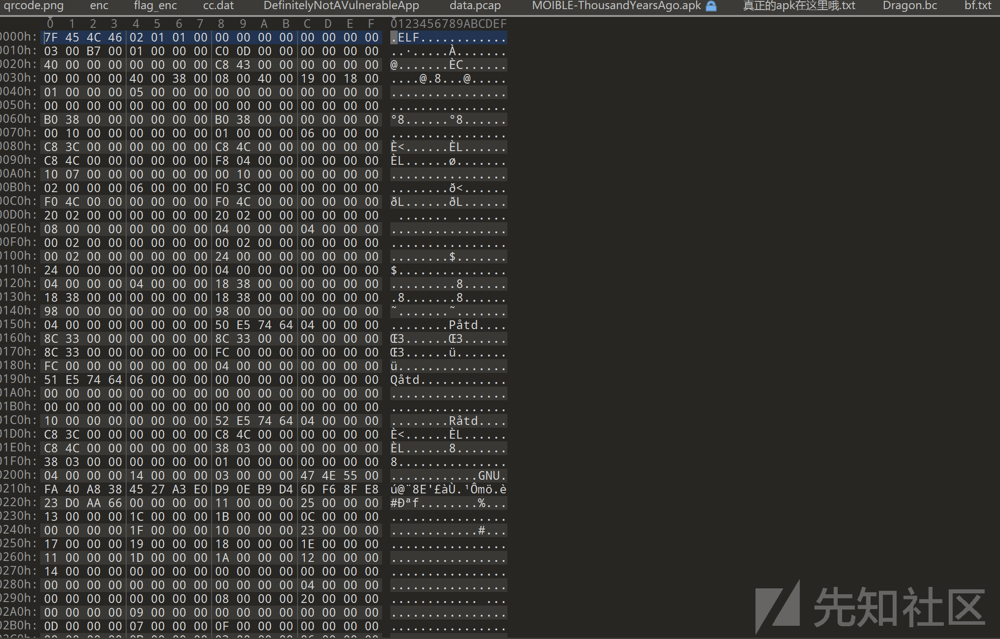
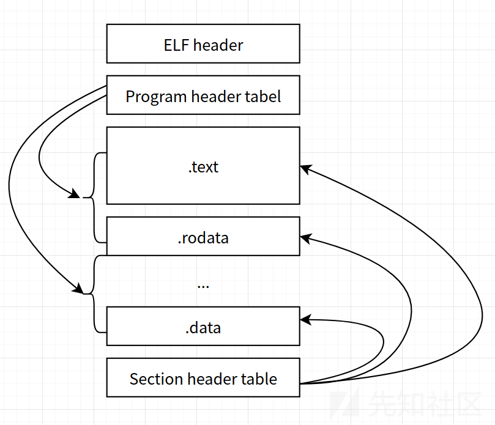
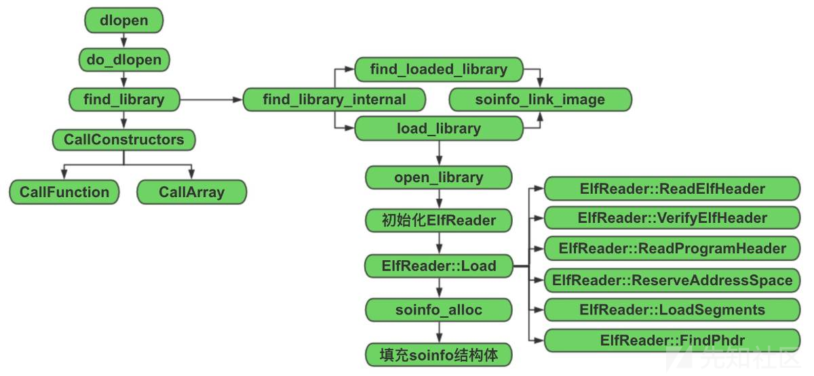
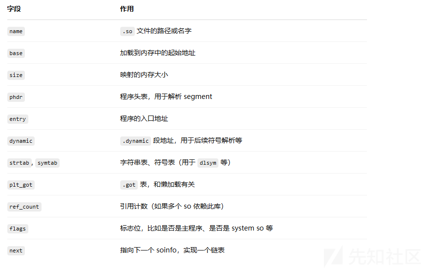
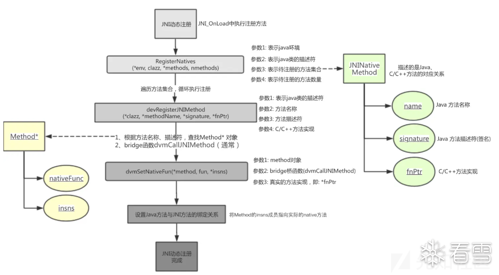
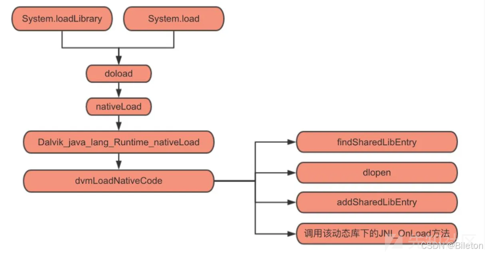

# so加载详细流程解析-先知社区

> **来源**: https://xz.aliyun.com/news/18243  
> **文章ID**: 18243

---

为了更好的理解so文件的加载，我觉得可以了解一下so文件的格式

### so文件生成

将C文件编译成SO文件的过程相对简单。首先，使用C编译器将C文件编译成目标文件（.o）。然后，使用gcc或ld命令将目标文件链接成SO文件（.so）。最后，将生成的SO文件与程序进行动态链接即可使用。



嗯？不是so文件吗，怎么是ELF

so 文件全称为 Shared Object（共享对象），它是一种动态共享库，存放了可以被多个程序共享并在运行时链接的代码和数据。相比静态库（.a 文件），so 文件可以在程序运行时加载和卸载，能够节省内存和磁盘空间，并且在库更新时无需重新编译依赖该库的所有程序。

**ELF 格式定义**  
ELF 是一种标准的文件格式，用于存储可执行文件、目标代码、共享库以及核心转储文件。它由 Unix System Laboratories 定义，并被所有现代的 Unix-like 系统（如 Linux、Solaris、BSD 等）采用

**​**

**so 文件与 ELF 的关系**  
so 文件是共享库文件，它采用 ELF 格式来组织和存储其内容。无论是可执行文件、共享对象还是目标文件，它们都依赖统一的 ELF 文件格式。这种设计保证了跨平台兼容性和工具链的统一性，简化了程序的加载和链接过程。

### ELF简介

ELF （Executable and Linkable Format）文件，也就是在 Linux 中的目标文件，主要有以下三种类型

* 可重定位文件（Relocatable File），包含由编译器生成的代码以及数据。链接器会将它与其它目标文件链接起来从而创建可执行文件或者共享目标文件。在 Linux 系统中，这种文件的后缀一般为 `.o` 。
* 可执行文件（Executable File），就是我们通常在 Linux 中执行的程序。
* 共享目标文件（Shared Object File），包含代码和数据，这种文件是我们所称的库文件，一般以 `.so` 结尾。一般情况下，它有以下两种使用情景：

* 链接器（Link eDitor, ld）可能会处理它和其它可重定位文件以及共享目标文件，生成另外一个目标文件。
* 动态链接器（Dynamic Linker）将它与可执行文件以及其它共享目标组合在一起生成进程镜像。 当程序运行时，动态链接器会根据可执行文件内部记录的依赖关系，将需要的 .so 文件加载到内存中，并解析其中的符号，生成完整的进程镜像（即程序在内存中的布局）。

​



<https://blog.csdn.net/pingxiaozhao/article/details/109239221>

<https://ctf-wiki.org/executable/elf/structure/basic-info/>

### 动态链接库

在 Linux 下，一般以 **.so** 结尾的文件就是动态链接库。所谓动态链接库，是一种含有可共享使用的代码和数据的目标文件格式。它允许多个程序在运行时共享同一份代码，而不用将所有代码静态地编译进每个可执行文件中，从而节省内存并便于程序更新。

## dlopen之内存装载

这个函数是打开一个动态链接库，将其装入内存之中



```
void* dlopen(const char* filename, int flags) {
  ScopedPthreadMutexLocker locker(&gDlMutex);
  soinfo* result = do_dlopen(filename, flags);
  if (result == NULL) {
    __bionic_format_dlerror("dlopen failed", linker_get_error_buffer());
    return NULL;
  }
  return result;
}

soinfo* do_dlopen(const char* name, int flags) {
  if ((flags & ~(RTLD_NOW|RTLD_LAZY|RTLD_LOCAL|RTLD_GLOBAL)) != 0) {
    DL_ERR("invalid flags to dlopen: %x", flags);
    return NULL;
  }
  set_soinfo_pool_protection(PROT_READ | PROT_WRITE);
  soinfo* si = find_library(name);
  if (si != NULL) {
    si->CallConstructors();
  }
  set_soinfo_pool_protection(PROT_READ);
  return si;
}
static soinfo *find_loaded_library(const char *name)
{
    soinfo *si;
    const char *bname;

    // TODO: don't use basename only for determining libraries
    // http://code.google.com/p/android/issues/detail?id=6670

    bname = strrchr(name, '/');
    bname = bname ? bname + 1 : name;

    for (si = solist; si != NULL; si = si->next) {
        if (!strcmp(bname, si->name)) {
            return si;
        }
    }
    return NULL;
}

static soinfo* find_library_internal(const char* name) {
  if (name == NULL) {
    return somain;
  }

  soinfo* si = find_loaded_library(name);
  if (si != NULL) {
    if (si->flags & FLAG_LINKED) {
      return si;
    }
    DL_ERR("OOPS: recursive link to "%s"", si->name);
    return NULL;
  }

  TRACE("[ '%s' has not been loaded yet.  Locating...]", name);
  si = load_library(name);
  if (si == NULL) {
    return NULL;
  }

  // At this point we know that whatever is loaded @ base is a valid ELF
  // shared library whose segments are properly mapped in.
  TRACE("[ init_library base=0x%08x sz=0x%08x name='%s' ]",
        si->base, si->size, si->name);

  if (!soinfo_link_image(si)) {
    munmap(reinterpret_cast<void*>(si->base), si->size);
    soinfo_free(si);
    return NULL;
  }

  return si;
}

static soinfo* find_library(const char* name) {
  soinfo* si = find_library_internal(name);
  if (si != NULL) {
    si->ref_count++;
  }
  return si;
}
```

具体的通过路径或文件名查找动态库这个过程，感觉就跟windows的查找dll并找函数一个道理

这里对前面三个函数进行一个分析

### do\_dlopen

do\_dlopen 调用了两个重要的函数，第一个是find\_library, 第二个是 soinfo 的成员函数 CallConstructors，find\_library 函数是 SO 装载链接的后续函数， 完成 SO 的装载链接后， 通过 CallConstructors 调用 SO 的初始化函数。

### find\_library\_internal

find\_library\_internal 首先通过 find\_loaded\_library\_by\_name 函数判断目标 SO 是否已经加载，如果已经加载则直接返回对应的soinfo指针，没有加载的话则调用 load\_library 继续加载流程，下面看 load\_library 函数。

### load\_library

```
static soinfo* load_library(const char* name, int dlflags, const Android_dlextinfo* extinfo) {
    int fd = -1;
    ...
    // Open the file.
    fd = open_library(name);                // 打开 SO 文件，获得文件描述符 fd
 
    ElfReader elf_reader(name, fd);         // 创建 ElfReader 对象
    ...
    // Read the ELF header and load the segments.
    if (!elf_reader.Load(extinfo)) {        // 使用 ElfReader 的 Load 方法，完成 SO 装载
        return NULL;
    }
 
    soinfo* si = soinfo_alloc(SEARCH_NAME(name), &file_stat);  // 为 SO 分配新的 soinfo 结构
    if (si == NULL) {
        return NULL;
    }
    si->base = elf_reader.load_start();  // 根据装载结果，更新 soinfo 的成员变量
    si->size = elf_reader.load_size();
    si->load_bias = elf_reader.load_bias();
    si->phnum = elf_reader.phdr_count();
    si->phdr = elf_reader.loaded_phdr();
    ...
    if (!soinfo_link_image(si, extinfo)) {  // 调用 soinfo_link_image 完成 SO 的链接过程
      soinfo_free(si);
      return NULL;
    }
    return si;
}
```

这个就是最主要的函数了

* 装载，通过ElfReader对象的load方法将SO文件装载到内存
* 分配soinfo，调用soinfo\_alloc函数为so分配新的soinfo结果，并且按照装载结果更新到成员变量
* 调用soinfo\_link\_image完成so的装载

​

**总的来说，步骤就是先检测so是否加载，再映射（根据elf格式）把so的各段映射到内存中，再创建soinfo实例，再加载依赖库，重定位和符号解析，最后就是初始化函数调用 （.init\_array / \_\_init）**

**​**

这个是加载so文件时非常重要的一个结构体，核心作用是描述并管理一个已加载的共享库（.so）的各种信息

下面是详细的信息

```
size_t plt_rela_count; //typedef struct soinfo
{
    soinfo* next; //指向下一个soinfo结构体的指针
    char* soname; //so文件的文件名
    char* filename; //共享库的路径
    void* base; //so文件加载到内存后的基地址
    size_t size; //so文件的大小
    ElfW(Sym)* symtab; //指向符号表的指针，符号表中包含了函数，变量的等
    const char* strtab; //指向字符串表的部分，储存符号名称
    size_t symtab_size; //符号表大小，linker用它来遍历符号表
    unitptr_t* plt_got; //指向全局偏移表（GOT）或者过程链接表（PLT）的指针
    ElfW(Rela)* plt_rela; //指向重定位表（或重定位表条目）的指针。
    size_t plt_rela_count; //PLT 重定位条目的数量
    unsigned int flags; //标记so库的状态，是否已经完成初始化，库是否可执行
    soinfo* linked_list; //指向另一个soinfo结构体的指针，可以连接多个库
    ElfW(Dyn)* dynamic; //指向elf文件的动态段，包含了so文件的动态信息，哈希表，字符串表，重定位表等
    uintptr_t load_bias; //so文件加载的偏移量，帮助linker确定so文件的实际位置
}
```



### CallConstructors

在编译 SO 时，可以通过链接选项`-init`或是给函数添加属性`__attribute__((constructor))`来指定 SO 的初始化函数，这些初始化函数在 SO 装载链接后便会被调用，再之后才会将 SO 的 soinfo 指针返回给 dl\_open 的调用者。SO 层面的保护手段，有两个介入点, 一个是 jni\_onload, 另一个就是初始化函数，比如反调试、脱壳等，逆向分析时经常需要动态调试分析这些初始化函数

**​**

**前面说了在完成so的装载之后，返回刚刚加载的so的info，在将soinfo返回到其他模块使用之前，最后还要调用soinfo的成员函数**CallConstructors

```
void soinfo::CallConstructors() {
  //如果已经调用过，则直接返回
  if (constructors_called) {
    return;
  }
  // 调用依赖 SO 的 Constructors 函数
  get_children().for_each([] (soinfo* si) {
    si->CallConstructors();
  });
  // 调用 init_func
  CallFunction("DT_INIT", init_func);
  // 调用 init_array 中的函数
  CallArray("DT_INIT_ARRAY", init_array, init_array_count, false);
}
```

### init 和 init\_array函数

这两个函数是so文件在被加载或者卸载时自动执行的函数，用于初始化的操作，其中init函数优先于init\_array函数。作为so层加载很早的函数，可以通过实现hook他来绕过一些关键的检测点



## **so加载流程**

**安卓9源码**

[**http://androidxref.com/9.0.0\_r3/xref/libcore/ojluni/src/main/native/Runtime.c**](http://androidxref.com/9.0.0_r3/xref/libcore/ojluni/src/main/native/Runtime.c)

### **引子**

> **在一次hook init初始化函数的过程中，我发现我怎么都hook不到这个函数，几番修改无果之后，我发现，init的初始化是非常早的，我如果按照传统的去hook地址的时机已经非常晚了，这个时候的init已经初始化完毕了，然后AI告诉我去hook android\_dlopen\_ext函数，这个是加载so的关键函数，奈何对so加载了解的浅薄，一直hook不到关键点，这里学习清楚，一劳永逸。**

### **System.loadLibrary**

**这里我介绍一下so加载的主要流程，以及一些重要的源码分析**

```
System.loadLibrary("native-lib")
```

**这里是JAVA中调用加载so的函数**

```
public static void loadLibrary(String libname) {
   Runtime.getRuntime().loadLibrary0(VMStack.getCallingClassLoader(), libname);
}
```

调用的是 Runtime 的 loadLibrary0() 函数，Runtime 是每个 Java 应用的一个运行时，并且getRutime() 获得Runtime 对象是个单例:

### loadLibrary0

```
synchronized void loadLibrary0(ClassLoader loader, String libname) {
//synchronized表示整个方法被同步化，多个线程调用时，不会发生竞争
    if (libname.indexOf((int)File.separatorChar) != -1) {//判断so名称是否包含文件分隔符，如果包含文件分隔符，则抛出异常
        throw new UnsatisfiedLinkError(
"Directory separator should not appear in library name: " + libname);
    }
//换句话说，这里一定要保证这个libname不是路径
    String libraryName = libname;
    if (loader != null) {
        String filename = loader.findLibrary(libraryName);//通过 ClassLoader 去 findLibrary()
      //这里相当于搜索这个库的绝对路径
        if (filename == null) {
            // It's not necessarily true that the ClassLoader used
            // System.mapLibraryName, but the default setup does, and it's
            // misleading to say we didn't find "libMyLibrary.so" when we
            // actually searched for "liblibMyLibrary.so.so".
            throw new UnsatisfiedLinkError(loader + " couldn't find "" +
                                           System.mapLibraryName(libraryName) + """);
        }
        String error = nativeLoad(filename, loader);//调用 jni 方法，nativeLoad() 方法
        if (error != null) {
            throw new UnsatisfiedLinkError(error);
        }
        return;
    }
//如果loader是null的话就按照系统默认的方式来查找库
    String filename = System.mapLibraryName(libraryName);//使用 mapLibraryName() 方法查找实际的 so 库的名称
    List<String> candidates = new ArrayList<String>();
    String lastError = null;
    for (String directory : getLibPaths()) {//遍历so 库目录，尝试加载 so
        String candidate = directory + filename;
        candidates.add(candidate);

        if (IoUtils.canOpenReadOnly(candidate)) {
            String error = nativeLoad(candidate, loader);
            if (error == null) {
                return; // We successfully loaded the library. Job done.
            }
            lastError = error;
        }
    }
//无论哪种方式，最终都会调用nativeload
    if (lastError != null) {
        throw new UnsatisfiedLinkError(lastError);
    }
    throw new UnsatisfiedLinkError("Library " + libraryName + " not found; tried " + candidates);
}
```

**1. 检查库名称是否合法**

```
if (libname.indexOf((int)File.separatorChar) != -1) {//判断so名称是否包含文件分隔符，如果包含文件分隔符，则抛出异常
    throw new UnsatisfiedLinkError(
        "Directory separator should not appear in library name: " + libname);
}
```

* **目的****：确保传入的库名（**`libname`**）中不含有目录分隔符（例如 "/" 或 ""），因为库名称应该只是一个名字，而不包含路径。**
* **原理****：如果调用** `libname.indexOf(File.separatorChar)` **返回的值不等于 -1，说明其中存在目录分隔符，则抛出 UnsatisfiedLinkError。**

```
String libraryName = libname;
if (loader != null) {
    String filename = loader.findLibrary(libraryName);//通过 ClassLoader 去 findLibrary()
    if (filename == null) {
        // 注释解释了：虽然不一定所有 ClassLoader 都用 System.mapLibraryName，
        // 但默认设置下会调用这个方法，防止出现库名重复的问题。
        throw new UnsatisfiedLinkError(loader + " couldn't find "" +
                                       System.mapLibraryName(libraryName) + """);
    }
    String error = nativeLoad(filename, loader);//调用 JNI 方法 nativeLoad() 进行加载
    if (error != null) {
        throw new UnsatisfiedLinkError(error);
    }
    return;
}
```

**这个****是loader非NULL的情况****，这个调用的ClassLoader的查找是根据它的查找规则，查找实际的文件路径，找到了之后就调用JNI的nativeLoad进行装载**

**​**

**loader为NULL的情况**

```
String filename = System.mapLibraryName(libraryName);//使用 mapLibraryName() 方法查找实际的 so 库名称
List<String> candidates = new ArrayList<String>();
String lastError = null;
for (String directory : getLibPaths()) {//遍历so 库目录，尝试加载 so
    String candidate = directory + filename;
    candidates.add(candidate);

    if (IoUtils.canOpenReadOnly(candidate)) {
        String error = nativeLoad(candidate, loader);
        if (error == null) {
            return; // 成功加载库，直接返回
        }
        lastError = error;
    }
}

if (lastError != null) {
    throw new UnsatisfiedLinkError(lastError);
}
throw new UnsatisfiedLinkError("Library " + libraryName + " not found; tried " + candidates);
```

* **当 ClassLoader 为 null 时（例如系统调用直接加载库），首先使用** `System.mapLibraryName(libraryName)` **将库名映射成实际的文件名称（例如 "libfirstndk.so"）。**
* **随后调用** `getLibPaths()` **获取系统预设的库搜索路径（比如** `/vendor/lib`**,** `/system/lib` **或其他路径）。**
* **对于每个目录，构造一个候选路径** `candidate`**，并检查这个 candidate 是否能以只读方式打开（**`IoUtils.canOpenReadOnly(candidate)`**）。**
* **如果能打开则调用** `nativeLoad(candidate, loader)` **尝试加载这个库。如果加载成功（返回 null 表示无错误），函数返回；否则将错误信息保存到** `lastError`**。**
* **如果遍历所有候选路径后都没有加载成功，则根据最后的错误信息抛出 UnsatisfiedLinkError。若连最后错误信息都为空，则抛出一个包含所有候选路径的错误提示。**



**主要流程解释**

* **输入检查****：确保库名中没有目录分隔符。**
* **分支处理****：**
* **使用指定 ClassLoader 的话，依赖 ClassLoader 的查找规则来获取库路径并加载。**
* **如果没有 ClassLoader，则遍历系统库路径尝试加载。**
* **加载过程****：使用 JNI 方法** `nativeLoad` **来实际加载库。加载成功返回，无错误则加载成功，否则抛出相应的 UnsatisfiedLinkError。**

**​**

### **ClassLoader ？**

**头一次看有点懵，classLoader不是加载Java字节码的吗，不是用来动态将类加载到JVM或ART/Dalivk中吗，**

**其实，它还可以定位Native库，去指定路径搜索相应的so文件**

### **Java加载so小结**

**前面的其实在调用JNI的NativeLoad之前，Java层主要是在查找****so文件的具体实际路径****而已，并且将这个so转换为平台标准的库名 （例如，将 "firstndk" 转换为 "libfirstndk.so"）**

### **nativeLoad**

java 层的 **nativeLoad** 对应的就是 c 层的 **Runtime\_nativeLoad** 方法。

​

### `Runtime_nativeLoad`

```
#define NATIVE_METHOD(className, functionName, signature) \
{ #functionName, signature, (void*)(className ## _ ## functionName) }


JNIEXPORT jstring JNICALL
Runtime_nativeLoad(JNIEnv* env, jclass ignored, jstring javaFilename,
                   jobject javaLoader)
{
    return JVM_NativeLoad(env, javaFilename, javaLoader);
}

static JNINativeMethod gMethods[] = {
    FAST_NATIVE_METHOD(Runtime, freeMemory, "()J"),
    FAST_NATIVE_METHOD(Runtime, totalMemory, "()J"),
    FAST_NATIVE_METHOD(Runtime, maxMemory, "()J"),
    NATIVE_METHOD(Runtime, gc, "()V"),
    NATIVE_METHOD(Runtime, nativeExit, "(I)V"),
    NATIVE_METHOD(Runtime, nativeLoad,
                "(Ljava/lang/String;Ljava/lang/ClassLoader;)"
                "Ljava/lang/String;"),
    //{"nativeLoad", "(Ljava/lang/String;Ljava/lang/ClassLoader;)"
    "Ljava/lang/String;", (void*)Runtime_nativeLoad}
};

void register_java_lang_Runtime(JNIEnv* env) {
    jniRegisterNativeMethods(env, "java/lang/Runtime", gMethods, NELEM(gMethods));
}

```

这里为了不搞懵，先整体介绍一下接下来的流程

Android 动态库加载由 **动态链接器（Linker）** 完成，其核心流程如下：

```
A[dlopen/dlsym/dlclose调用] --> B[动态链接器Linker处理]
    B --> C[库文件查找与加载]
    C --> D[ELF解析与内存映射]
    D --> E[符号重定位]
    E --> F[执行初始化函数.init/.init_array]
    F --> G[返回库句柄]
```

### **一：详细流程分解**

#### **1.**`dlopen`**系列函数的调用**

**核心函数**：

```
void* dlopen(const char* filename, int flags); // 加载库
void* dlsym(void* handle, const char* symbol); // 查找符号
int dlclose(void* handle);                     // 卸载库
```

**触发条件**：

显式调用 `dlopen`（动态加载）。

隐式依赖（静态链接时自动加载依赖库）。

#### **2. 动态链接器（Linker）介入**

**Linker 职责**：

解析库路径（如 `libnative.so`）。

加载库文件到内存。

处理符号重定位（Relocation）。

执行初始化代码（`.init`、`.init_array`）。

#### **3. 库文件查找与加载**

**搜索路径**：

* `/system/lib[64]`、`/vendor/lib[64]`、`/data/app/.../lib` 等。
* 通过 `LD_LIBRARY_PATH` 环境变量扩展。

* **加载步骤**：

1. 检查库是否已加载（避免重复加载）。
2. 读取 ELF 文件头（`ElfW(Ehdr)`）验证有效性。
3. 创建内存映射（`mmap`）将库载入进程地址空间。

#### **4. ELF 文件解析与内存映射**

* **关键ELF结构**：

* **Program Header Table**：描述段（Segment）信息（如代码段、数据段）。
* **Section Header Table**：描述节（Section）信息（如符号表、重定位表）。

* **内存映射策略**：

* **代码段（.text）**：映射为 `PROT_READ | PROT_EXEC`。
* **数据段（.data、.bss）**：映射为 `PROT_READ | PROT_WRITE`。

#### **5. 符号重定位（Relocation）**

* **目的**：解决跨库函数调用和数据引用的地址问题。
* **关键步骤**：

1. 解析 **动态符号表（.dynsym）** 和 **重定位表（.rel.dyn/.rel.plt）**。
2. 遍历所有需要重定位的项（`ElfW(Rela)`），修正地址。
3. **PLT/GOT 机制**：

* **PLT（Procedure Linkage Table）**：跳转桩代码。
* **GOT（Global Offset Table）**：存储函数实际地址。

#### **6. 初始化函数的执行**

动态库的初始化代码按以下顺序执行：

1. `.init`**段**：编译器生成的初始化函数（通常由 `_init` 函数实现）。
2. `.init_array`**段**：函数指针数组，按顺序执行每个初始化函数。
3. `JNI_OnLoad`（如果存在）：用于动态注册 JNI 方法。

​
