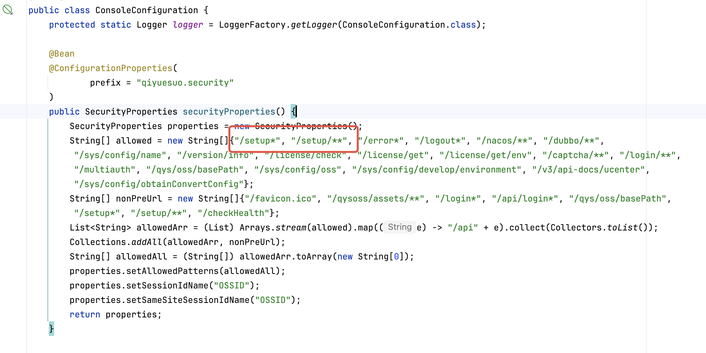
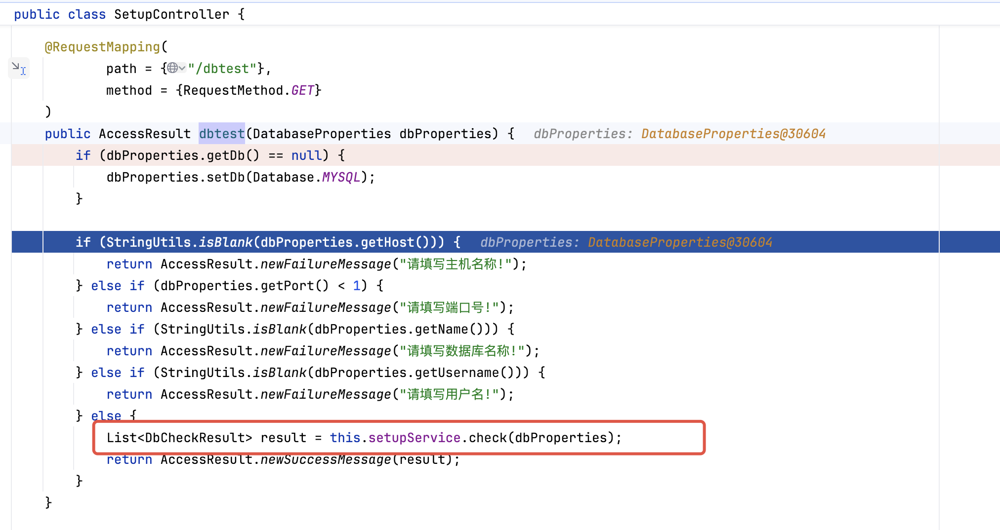
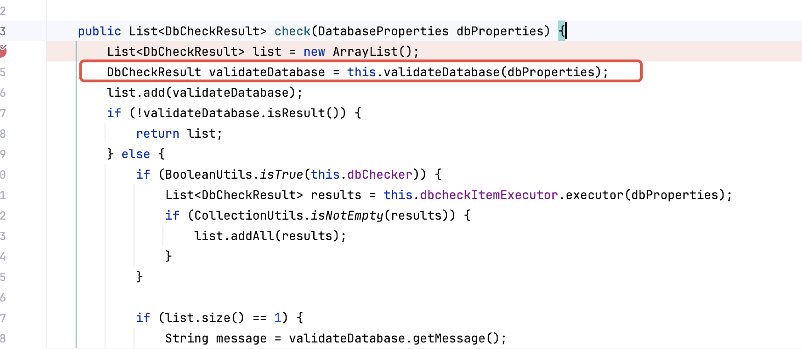
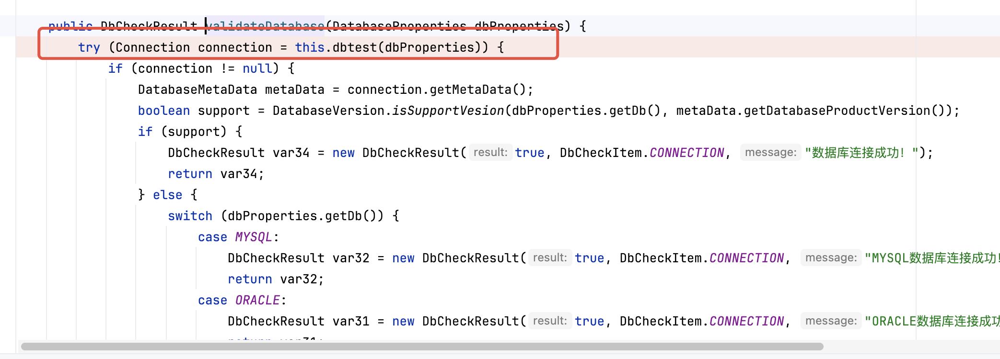
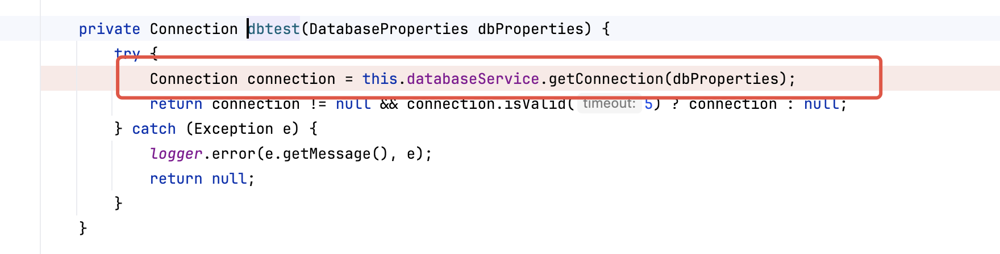
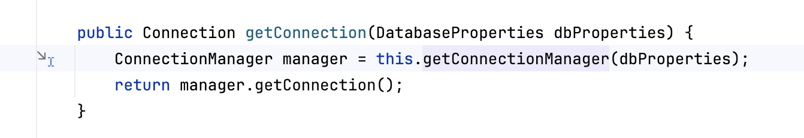
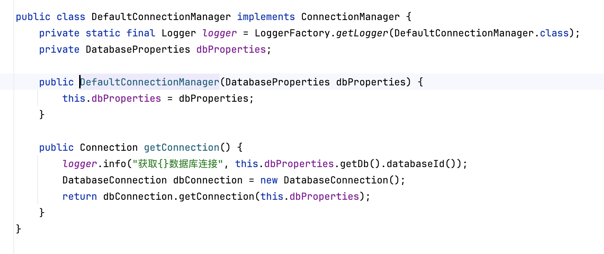
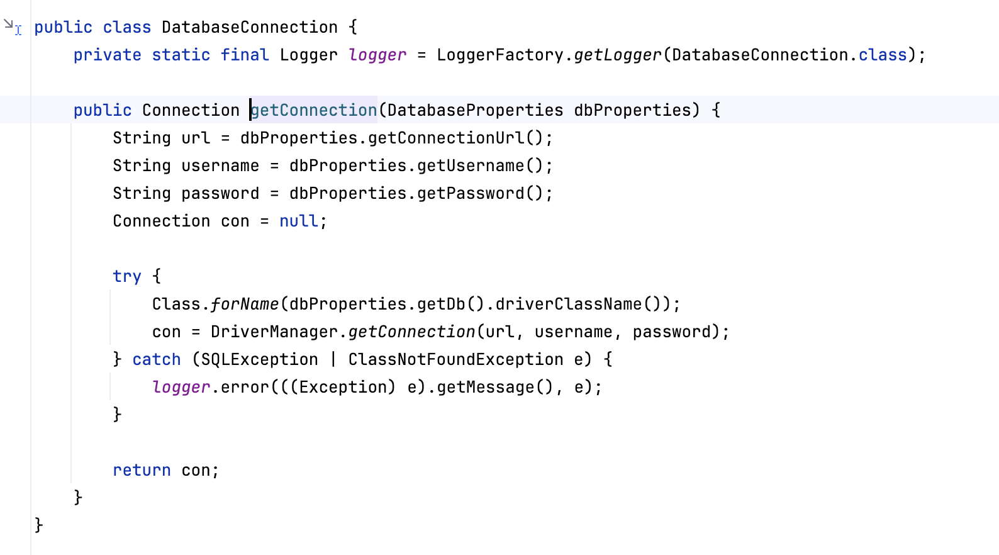
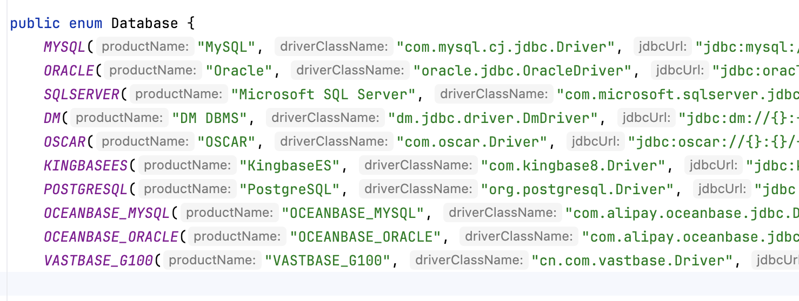

# 契约锁电子签章系统RCE简单分析-先知社区

> **来源**: https://xz.aliyun.com/news/18245  
> **文章ID**: 18245

---

# 契约锁电子签章系统远程代码执行漏洞

**Ha1ey@深蓝攻防实验室**

**本文章仅供学习交流使用，文中所涉及的技术、思路和工具仅供以安全为目的的学习交流使用，任何人不得将其用于非法用途以及盈利等目的，否则后果自行承担！**

## 前言

写一下近期契约锁修复的一个漏洞

## 分析

契约锁分为三块服务：电子签约签署平台、电子签约管理控制台、电子签约开放平台，下面分析的漏洞是来自于电子签约管理控制台。

`com.qiyuesuo.config.ConsoleConfiguration` 这个类有定义前台不需要鉴权的接口，其中就包含了此次漏洞的接口 `/setup/dbtest`



问题入口点`com.qiyuesuo.setup.SetupController#dbtest`

几个参数**db** 、 **host** 、**port**、**name**、**username**



`com.qiyuesuo.setup.SetupService#check` 方法



`com.qiyuesuo.setup.SetupService#validateDatabase` 方法



`com.qiyuesuo.setup.SetupService#dbtest` 方法



后面就是常见的JDBC调用了







内置了几个常见的数据库驱动，可以利用RCE



最后放一个poc

```
/api/setup/dbtest?db=POSTGRESQL&host=localhost&port=5511&username=root&name=jdbcurl
```
