# malloc源码调试（二）-先知社区

> **来源**: https://xz.aliyun.com/news/18253  
> **文章ID**: 18253

---

## unsorted bin

1. malloc后续进入到对unsorted bin的处理：

```
/*
     Process recently freed or remaindered chunks, taking one only if
     it is exact fit, or, if this a small request, the chunk is remainder from
     the most recent non-exact fit.  Place other traversed chunks in
     bins.  Note that this step is the only place in any routine where
     chunks are placed in bins.

     The outer loop here is needed because we might not realize until
     near the end of malloc that we should have consolidated, so must
     do so and retry. This happens at most once, and only when we would
     otherwise need to expand memory to service a "small" request.
   */

#if USE_TCACHE
INTERNAL_SIZE_T tcache_nb = 0;
size_t tc_idx = csize2tidx (nb);
if (tcache && tc_idx < mp_.tcache_bins) // 如果申请的大小在tcache的范围之内
    tcache_nb = nb; // 初始化tcache_nb
int return_cached = 0; // 初始化return_cached

tcache_unsorted_count = 0; // 在处理unsorted bin之前将 tcache_unsorted_count清0
#endif

for (;; ) // 这个for循环囊括了后续所有的处理
{
    int iters = 0;
    while ((victim = unsorted_chunks (av)->bk) != unsorted_chunks (av)) // 将unsorted bin遍历完
    {
        bck = victim->bk;
        size = chunksize (victim);
        mchunkptr next = chunk_at_offset (victim, size);

        if (__glibc_unlikely (size <= 2 * SIZE_SZ)
              || __glibc_unlikely (size > av->system_mem))
            malloc_printerr ("malloc(): invalid size (unsorted)");
        if (__glibc_unlikely (chunksize_nomask (next) < 2 * SIZE_SZ)
              || __glibc_unlikely (chunksize_nomask (next) > av->system_mem))
            malloc_printerr ("malloc(): invalid next size (unsorted)");
        if (__glibc_unlikely ((prev_size (next) & ~(SIZE_BITS)) != size))
            malloc_printerr ("malloc(): mismatching next->prev_size (unsorted)");
        if (__glibc_unlikely (bck->fd != victim) // 双向链表检查
              || __glibc_unlikely (victim->fd != unsorted_chunks (av)))
            malloc_printerr ("malloc(): unsorted double linked list corrupted");
        if (__glibc_unlikely (prev_inuse (next))) // 检查unsorted bin中的chunk是否真的被标记为free
            malloc_printerr ("malloc(): invalid next->prev_inuse (unsorted)");

        /*
             If a small request, try to use last remainder if it is the
             only chunk in unsorted bin.  This helps promote locality for
             runs of consecutive small requests. This is the only
             exception to best-fit, and applies only when there is
             no exact fit for a small chunk.
           */

        if (in_smallbin_range (nb) && // 申请的大小再small bin的范围之内
              bck == unsorted_chunks (av) && // unsorted bin中仅有这一个chunk
              victim == av->last_remainder && // 是上次切割之后剩下的chunk
              (unsigned long) (size) > (unsigned long) (nb + MINSIZE)) // size要足够大，切割后能剩下一个chunk0x20
        {
            /* split and reattach remainder */
            remainder_size = size - nb;
            remainder = chunk_at_offset (victim, nb);
            unsorted_chunks (av)->bk = unsorted_chunks (av)->fd = remainder; // 更新unsorted bin的链首
            av->last_remainder = remainder; // 给切割后剩下的chunk 标记
            remainder->bk = remainder->fd = unsorted_chunks (av); // 维护unsorted bin的双向链表
            if (!in_smallbin_range (remainder_size))
            {
                remainder->fd_nextsize = NULL;
                remainder->bk_nextsize = NULL;
            }

            set_head (victim, nb | PREV_INUSE |
                        (av != &main_arena ? NON_MAIN_ARENA : 0));
            set_head (remainder, remainder_size | PREV_INUSE); // 给切割后剩下的chunk 新的size
            set_foot (remainder, remainder_size); // 新的prev_size

            check_malloced_chunk (av, victim, nb);
            void *p = chunk2mem (victim); // 向用户类型转换
            alloc_perturb (p, bytes);
            return p; // 直接返回
        }

        /* remove from unsorted list */ // 移出unsorted bin
        if (__glibc_unlikely (bck->fd != victim)) // 移除之前 先做双向链表检查
            malloc_printerr ("malloc(): corrupted unsorted chunks 3");
        unsorted_chunks (av)->bk = bck; // 更新unsorted bin 的链首 为其中的第二个chunk
        bck->fd = unsorted_chunks (av);

        /* Take now instead of binning if exact fit */
        if (size == nb) // 如果 移出的chunk的size刚好完美符合申请的大小
        {
            set_inuse_bit_at_offset (victim, size); // 标记为 正在被使用 --> 相当于直接申请到了该chunk
            if (av != &main_arena)
                set_non_main_arena (victim);
            #if USE_TCACHE
            /* Fill cache first, return to user only if cache fills.
         We may return one of these chunks later.  */ // 首先用来填充tcache、如果tcache满了的话才返回给用户
            if (tcache_nb && tcache->counts[tc_idx] < mp_.tcache_count)
            {
                tcache_put (victim, tc_idx);
                return_cached = 1; // 标记一下tcache现在 可以返回的chunk 等这个while循环对unsorted bin处理完之后 直接用tcache来返回
                continue; // 结束这次处理
            }
            else
            {
                #endif
                check_malloced_chunk (av, victim, nb); // 如果没有使用tcache（即在glibc-2.26以前） 那么直接返回刚才移出unsorted bin的chunk
                void *p = chunk2mem (victim);
                alloc_perturb (p, bytes);
                return p;
                #if USE_TCACHE
            }
            #endif
        }

        /* place chunk in bin */

        if (in_smallbin_range (size)) // chunk的size 在small bin的范围内
        {
            victim_index = smallbin_index (size); // 通过size找到要置入的small bin链 在main_arena.bins数组中的下标
            bck = bin_at (av, victim_index); // 通过下标 找到对应的 small bin链
            fwd = bck->fd; // 拿到链首
        }
        else // chunk的size 在large bin的范围内
        {
            victim_index = largebin_index (size); // 找large bin链 在main_arena.bins数组中的下标
            bck = bin_at (av, victim_index); // 找到链首
            fwd = bck->fd;

            /* maintain large bins in sorted order */ // 要保证large bins中的chunk处于有序的状态下
            if (fwd != bck) // 找到的 large bin链非空
            {
                /* Or with inuse bit to speed comparisons */
                size |= PREV_INUSE;
                /* if smaller than smallest, bypass loop below */
                assert (chunk_main_arena (bck->bk));
                if ((unsigned long) (size) < (unsigned long) chunksize_nomask (bck->bk)) // 取出的chunk 小于当前large bin中最小的chunk时
                {
                    fwd = bck;
                    bck = bck->bk; // large bin中最小的chunk

                    // 将取出的chunk链入到 large bin中 (更新fd\bk_nextsize字段)保证large bin处于有序状态
                    victim->fd_nextsize = fwd->fd; // fwd->fd的值是该large bin链上最大的chunk地址 victim是新的最小chunk，最小的chunk的fd_nextsize字段 要指向size最大的chunk
                    victim->bk_nextsize = fwd->fd->bk_nextsize; // fwd->fd->bk_nextsize是原链中最小size的chunk，现在排在victim前面
                    fwd->fd->bk_nextsize = victim->bk_nextsize->fd_nextsize = victim; // 更新原来最小chunk前后(指size大小)chunk的fd\bk_nextsize
                }
                else // size不小于当前large bin中的最小chunk (这部分在glibc-2.31之后新增调表检查(对fd\bk_nextsize检查)，所以就不在利用)
                {
                    assert (chunk_main_arena (fwd));
                    while ((unsigned long) size < chunksize_nomask (fwd))
                    {
                        fwd = fwd->fd_nextsize;
                        assert (chunk_main_arena (fwd));
                    }

                    if ((unsigned long) size == (unsigned long) chunksize_nomask (fwd))
                        /* Always insert in the second position.  */
                        fwd = fwd->fd;
                    else
                    {
                        victim->fd_nextsize = fwd;
                        victim->bk_nextsize = fwd->bk_nextsize;
                        fwd->bk_nextsize = victim;
                        victim->bk_nextsize->fd_nextsize = victim;
                    }
                    bck = fwd->bk;
                }
            }
            else // 找到的 large bin链是空的 直接用chunk本身来填充fd\bk_nextsize字段
                victim->fd_nextsize = victim->bk_nextsize = victim;
        }

        // 最后无论是放入small bin 还是 large bin都会进行下面这段处理
        mark_bin (av, victim_index); // binmap标记一下 bin链上的情况（是否为空即没有一个空闲块），便于后续在main_arena.bins数组中快速寻找目标
        victim->bk = bck; // 插入 : 将取出的chunk置入对应的bin中
        victim->fd = fwd;
        fwd->bk = victim; // 更新 对应bin中的链首
        bck->fd = victim; 

        #define mark_bin(m, i)    ((m)->binmap[idx2block (i)] |= idx2bit (i))

        #if USE_TCACHE
        /* If we've processed as many chunks as we're allowed while
     filling the cache, return one of the cached ones.  */
        ++tcache_unsorted_count;
        if (return_cached
          && mp_.tcache_unsorted_limit > 0
          && tcache_unsorted_count > mp_.tcache_unsorted_limit)
        {
            return tcache_get (tc_idx);
        }
        #endif

        #define MAX_ITERS       10000
        if (++iters >= MAX_ITERS)
            break;
    } // 这里结束上面的while 循环 对unsorted bin的处理

    // 上面对unsorted bin的处理结束
    #if USE_TCACHE
    /* If all the small chunks we found ended up cached, return one now.  */
    if (return_cached) // 之前标记的 tcache现在 可以返回的chunk 这里退出循环了之后直接返回
    {
        return tcache_get (tc_idx);
    }
    #endif
    ......
```

2. 最开始时对last\_remainder的处理过程：

这里先构造一个 last\_remainder，与unsorted bin中的第一个chunk相同：

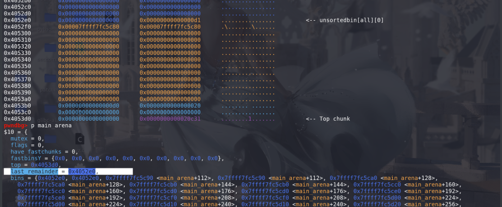

顺利通过四个条件判断，进入对last\_remainder的处理：

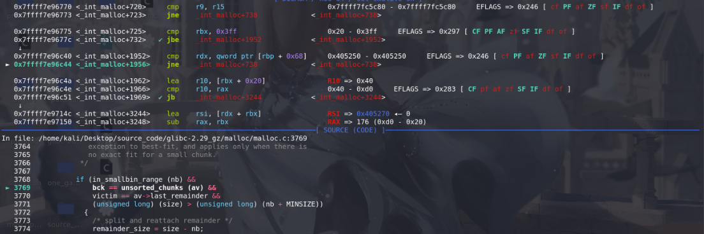

下面对last\_remainder chunk进行切割：

拿到新的remainder chunk的size、找到新的remainder chunk地址、更新unsorted bin的链首、为新的remainder chunk附上fd 和 bk

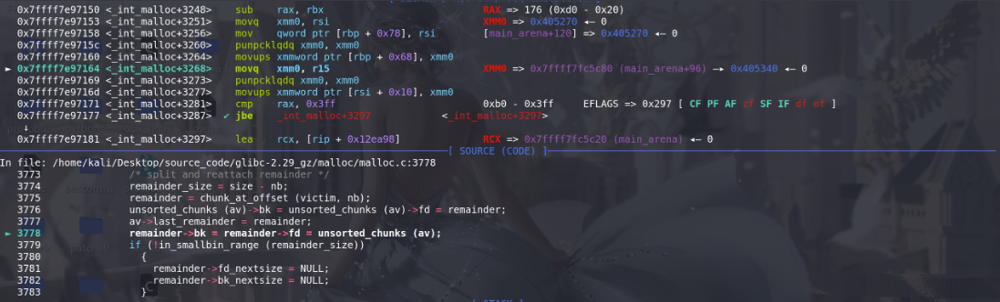

更新申请到的chunk的size，更细新的remainder chunk的size，最后更新相邻高地址处的chunk的prev\_size：

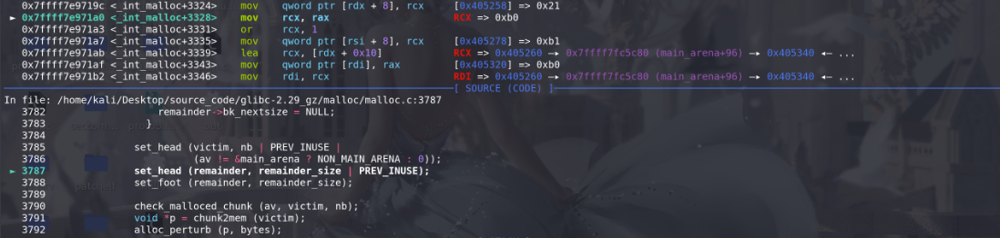

最后从原last\_remainder chunk中，切割出申请的chunk：

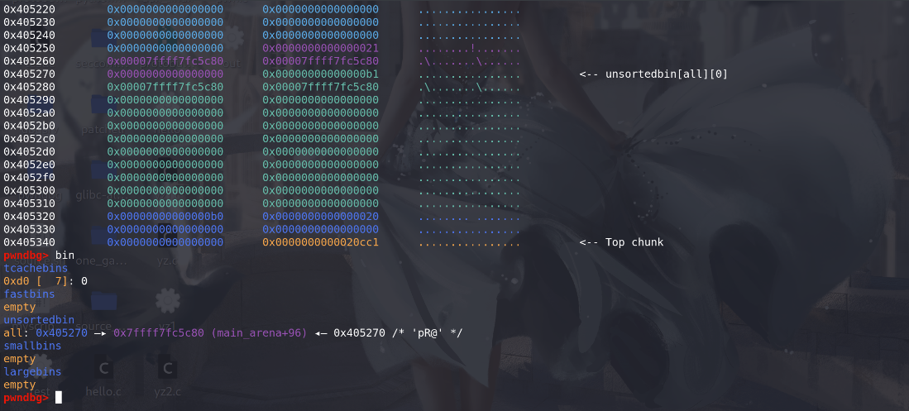

3. 存在的利用：

* 最后切割完成之后可以看到，在申请出来的chunk上存在main\_arena地址，可以用来泄漏libc地址（在没有UAF时） ==> 很常用

4. 下面对unsorted bin中的chunk处理：将其移出unsorted bin，置入到对应的bin（small 、large bin中）：

在将chunk置入到对应的bin里面之前，先对移出unsorted bin 的chunk进行下面的处理：

```
/* Take now instead of binning if exact fit */
if (size == nb) // 如果 移出的chunk的size刚好完美符合申请的大小
{
    set_inuse_bit_at_offset (victim, size); // 标记为 正在被使用 --> 相当于直接申请到了该chunk
    if (av != &main_arena)
        set_non_main_arena (victim);
    #if USE_TCACHE
    /* Fill cache first, return to user only if cache fills.
         We may return one of these chunks later.  */ // 首先用来填充tcache、如果tcache满了的话才返回给用户
    if (tcache_nb && tcache->counts[tc_idx] < mp_.tcache_count)
    {
        tcache_put (victim, tc_idx);
        return_cached = 1; // 标记一下tcache现在 可以返回的chunk 等这个while循环对unsorted bin处理完之后 直接用tcache来返回
        continue; // 结束这次处理
    }
    else
    {
        #endif
        check_malloced_chunk (av, victim, nb); // 如果没有使用tcache（即在glibc-2.26以前） 那么直接返回刚才移出unsorted bin的chunk
        void *p = chunk2mem (victim);
        alloc_perturb (p, bytes);
        return p;
        #if USE_TCACHE
    }
    #endif
}
```

存在的利用：

* 只需要能任意修改size值 即可完成overlapping。（off\_by\_one）

演示：

原始的堆分布，这里unsorted bin 中的chunk在main\_arena中的last\_remainder字段是要有标记的

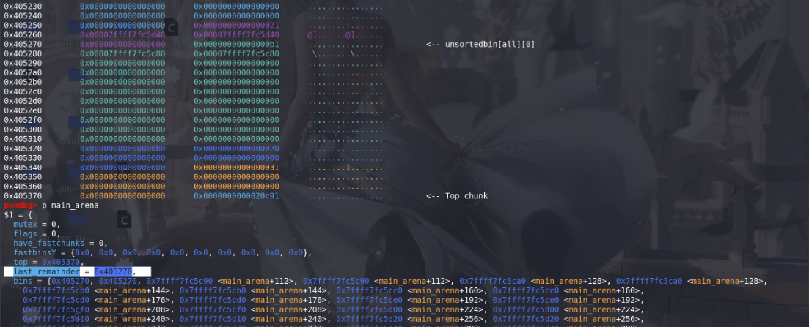

伪造，将size改大，在对应的位置放上适当的prev\_size 和 chunksize（过检查）：

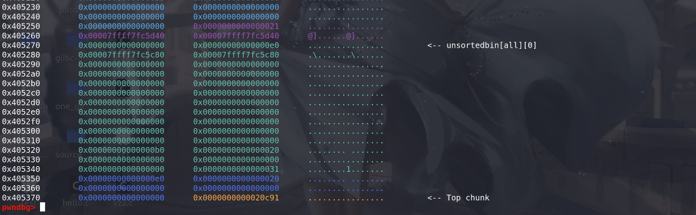

再申请size完全相同的chunk，就能申请到包含chunk0x20的chunk了，造成overlapping：

这里通过 对unsorted bin中的chunk的 prev\_size检查 ：

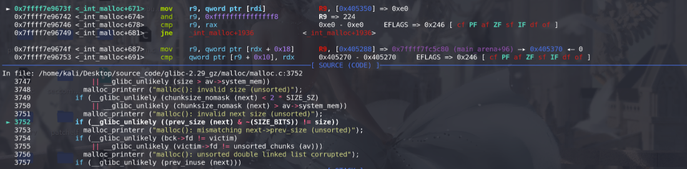

这里通过prev\_inuse检查 （上面伪造0xe0 和 0x20的原因就是通过这个检查）：

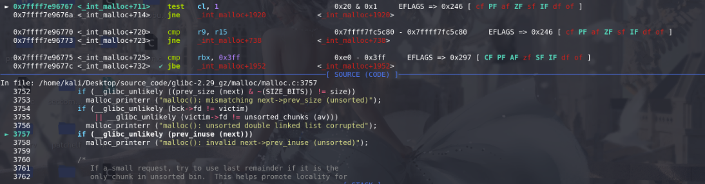

将chunk 移出 unsorted bin：

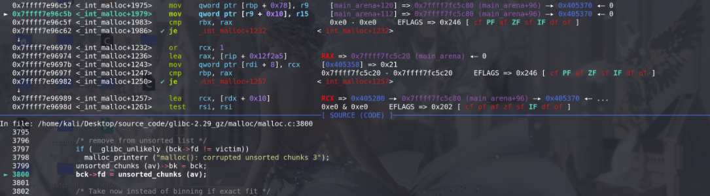

检查 chunk的size和 申请的大小是否完全相同：

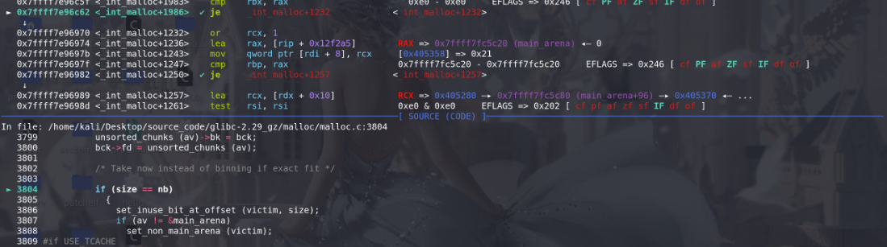

将取出的chunk 标记为已使用，即 相邻的高地址处的chunk的prev\_inuse位为1：

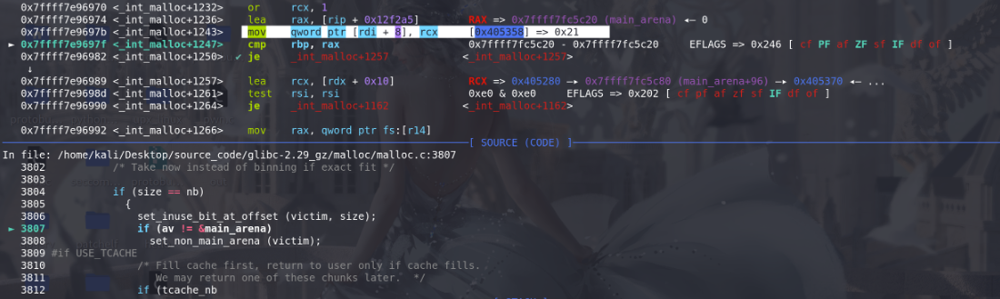

tcache\_nb不为0 且 tcache未满，就将取出的chunk放入到对应的tcache中，return\_cached置为1（后续直接用tcache来返回）：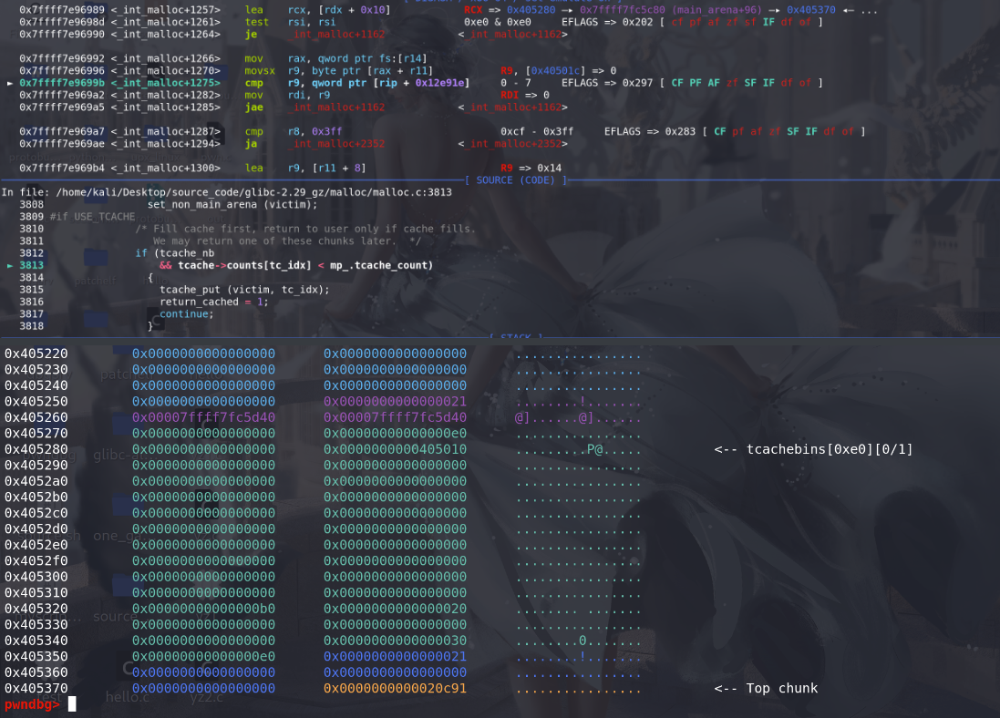

随后循环结束，该轮对unsorted bin的处理结束，再从tcache中取出：

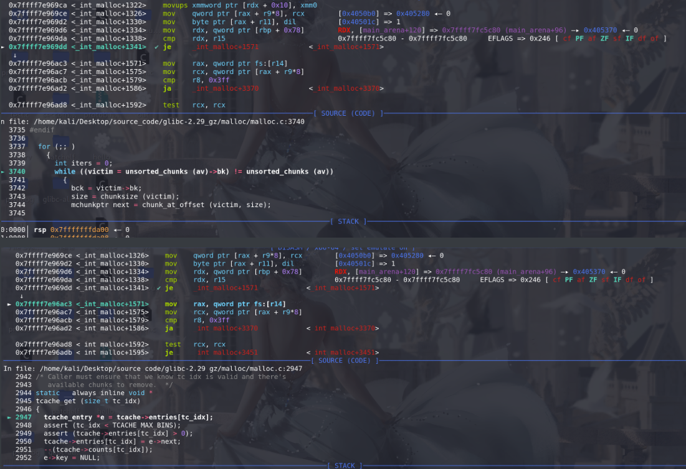

最后申请到伪造的chunk ，成功overlapping：

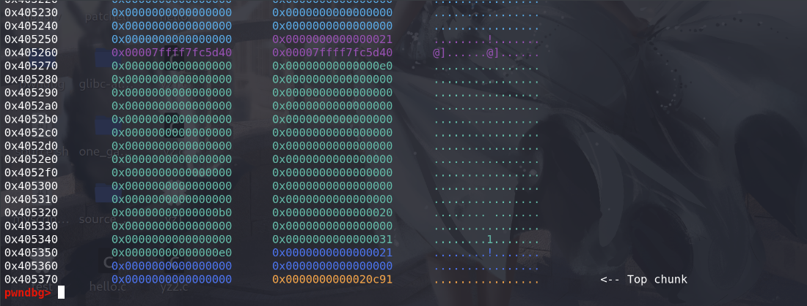

5. 当上面的size(unsorted bin 中取出的chunk的size) 和 申请的大小不完全相同时，会将移出的chunk 置入到对应的bin（small 、large bin中）：

```
/* place chunk in bin */

if (in_smallbin_range (size)) // chunk的size 在small bin的范围内
{
    victim_index = smallbin_index (size); // 通过size找到要置入的small bin链 在main_arena.bins数组中的下标
    bck = bin_at (av, victim_index); // 通过下标 找到对应的 small bin链
    fwd = bck->fd; // 拿到链首
}
else // chunk的size 在large bin的范围内
{
    victim_index = largebin_index (size); // 找large bin链 在main_arena.bins数组中的下标
    bck = bin_at (av, victim_index); // 找到链首
    fwd = bck->fd;

    /* maintain large bins in sorted order */ // 要保证large bins中的chunk处于有序的状态下
    if (fwd != bck) // 找到的 large bin链非空
    {
        /* Or with inuse bit to speed comparisons */
        size |= PREV_INUSE;
        /* if smaller than smallest, bypass loop below */
        assert (chunk_main_arena (bck->bk));
        if ((unsigned long) (size) < (unsigned long) chunksize_nomask (bck->bk)) // 取出的chunk 小于当前large bin中最小的chunk时
        {
            fwd = bck;
            bck = bck->bk; // large bin中最小的chunk

            // 将取出的chunk链入到 large bin中 (更新fd\bk_nextsize字段)保证large bin处于有序状态
            victim->fd_nextsize = fwd->fd; // fwd->fd的值是该large bin链上最大的chunk地址 victim是新的最小chunk，最小的chunk的fd_nextsize字段 要指向size最大的chunk地址
            victim->bk_nextsize = fwd->fd->bk_nextsize; // fwd->fd->bk_nextsize是原链中最小size的chunk，现在排在victim前面
            fwd->fd->bk_nextsize = victim->bk_nextsize->fd_nextsize = victim; // 更新原来最小chunk前后(指size大小)chunk的fd\bk_nextsize
        }
        else // size不小于当前large bin中的最小chunk (这部分在glibc-2.31之后新增调表检查(对fd\bk_nextsize检查)，所以就不在利用)
        {
            assert (chunk_main_arena (fwd));
            while ((unsigned long) size < chunksize_nomask (fwd))
            {
                fwd = fwd->fd_nextsize;
                assert (chunk_main_arena (fwd));
            }

            if ((unsigned long) size == (unsigned long) chunksize_nomask (fwd))
                /* Always insert in the second position.  */
                fwd = fwd->fd;
            else
            {
                victim->fd_nextsize = fwd;
                victim->bk_nextsize = fwd->bk_nextsize;
                fwd->bk_nextsize = victim;
                victim->bk_nextsize->fd_nextsize = victim;
            }
            bck = fwd->bk;
        }
    }
    else // 找到的 large bin链是空的 直接用chunk本身来填充fd\bk_nextsize字段
        victim->fd_nextsize = victim->bk_nextsize = victim;
}

// 最后无论是放入small bin 还是 large bin都会进行下面这段处理
mark_bin (av, victim_index); // 标记binmap字段 ==> 最后查找bin链时会使用到 ，整个glibc中 只有这个位置能更新binmap
victim->bk = bck; // 插入 : 将取出的chunk置入对应的bin中
victim->fd = fwd;
fwd->bk = victim; // 更新 对应bin中的链首
bck->fd = victim; 

#define mark_bin(m, i)    ((m)->binmap[idx2block (i)] |= idx2bit (i))
```

6. 先看置入small bin 的情况：

先准备一个unsorted bin chunk

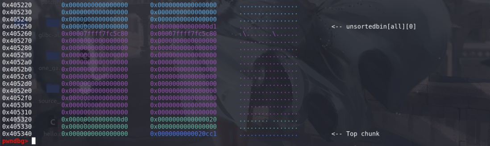

再任意申请一个chunk，开始拿到unsorted bin中chunk时会进行双向链表检查：

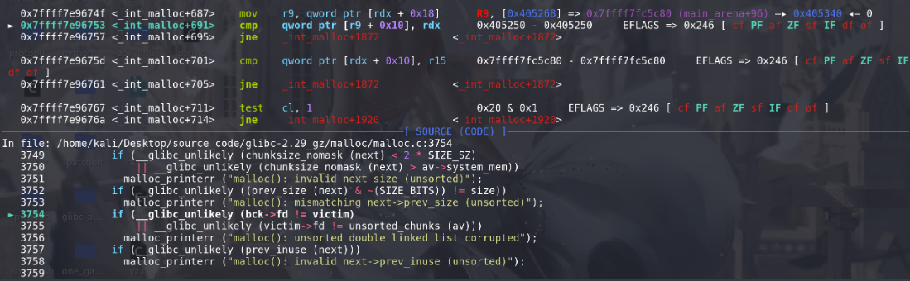

这里将拿到的chunk移出unsorted bin：

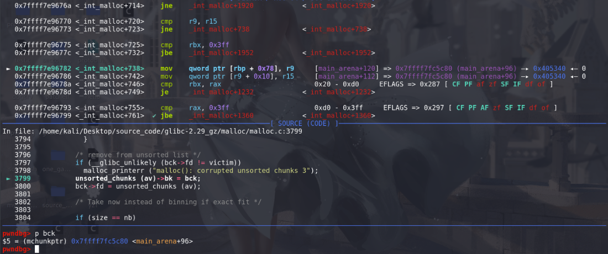

这里开始进入small bin 的处理：

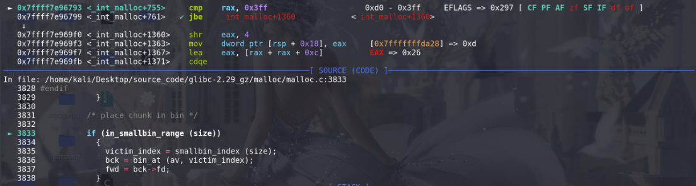

在main\_arena中找到与chunk size 对应的small bin链：

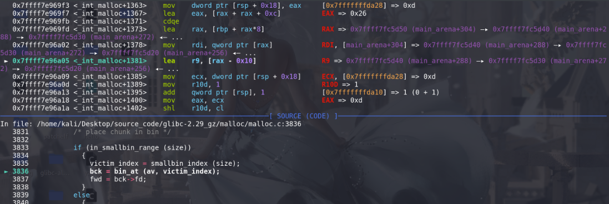

最后在这里将其放入到small bin链中，再继续进行循环：

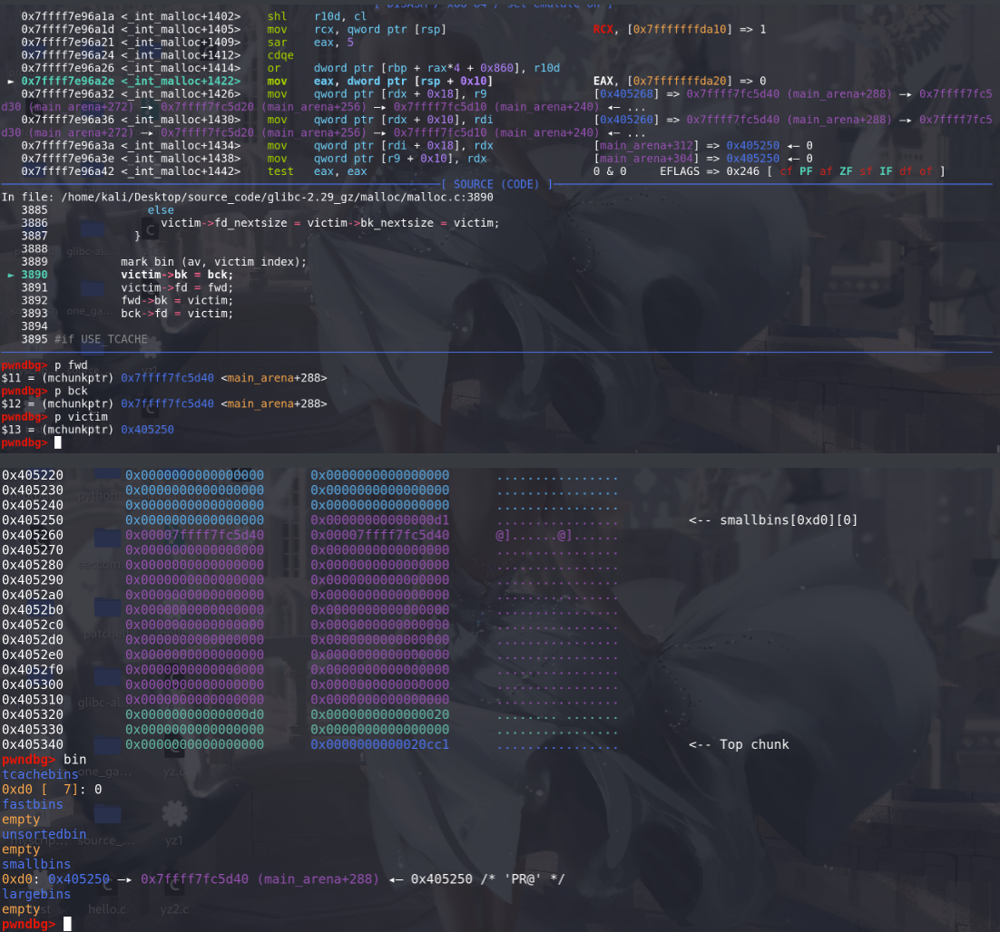

7. 再看置入large bin的情况（large bin attack 利用）：

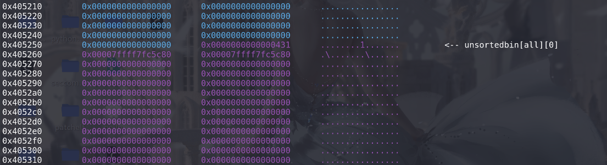

再申请一个chunk，将该unsorted bin中的chunk放入large bin中，这里根据large bin的特性有4种情况来更新fd\bk\_nextsize字段，来保证large bin处于有序 ：

* 找到的large bin是空链
* unsorted bin中的chunk 与 large bin中存在的chunk**大小相同**
* unsorted bin中的chunk size 小于 对应large bin中最小的chunk （高版本上普遍利用）
* unsorted bin中的chunk size 大于 对应large bin中最小的chunk 且 其中不存在size相同的chunk

主要看第三种情况，在glibc-2.30开始，对地四种情况的处理上会增加跳表检查，而对于第三种情况则没有检查：

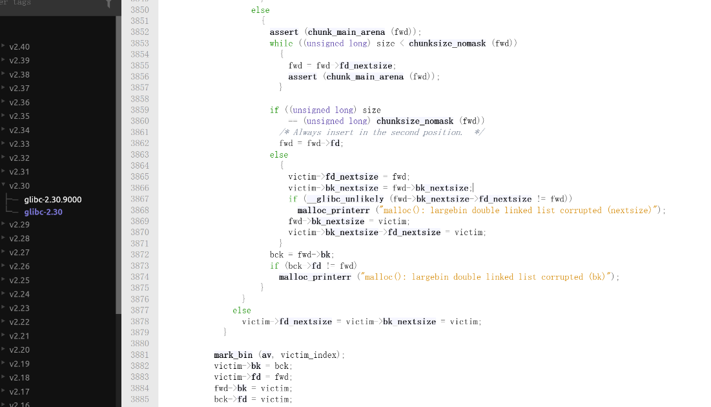

先将一个大chunk置入到large bin中，再安排一个相对小的chunk放入unsorted bin中 (两个chunk的size要在同一个large bin链的范围之内)，满足第三种情况的条件：

chunk\_0x440 和 chunk\_0x460 都在0x440-0x470范围之内

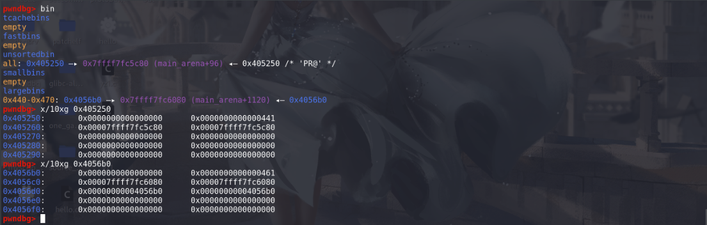

再申请一个更大的chunk，来将unsorted bin中的chunk 置入到该large bin中（不损坏上面两个chunk就行）：

unsorted bin 的双向链表检查

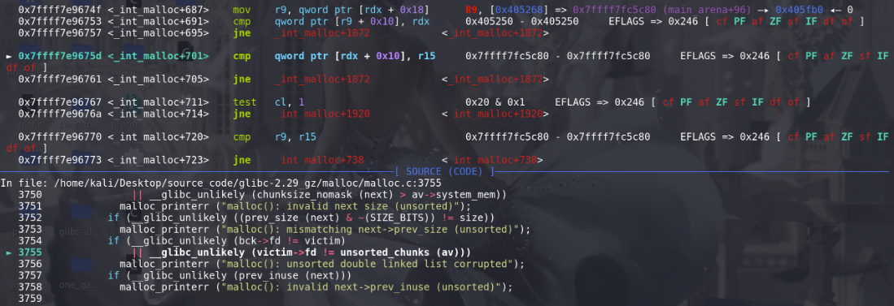

后续取出chunk，进入到large bin得到处理：

拿到main\_arena.bins数组中 对应large bin 的下标，并拿到对应链的头 bck

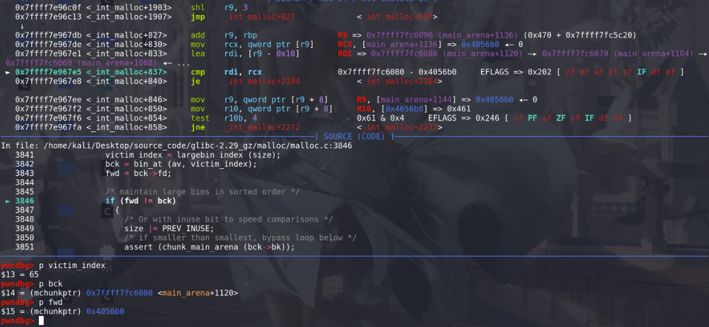

这里将取出的chunk的size与找到的large bin链中的最小chunk的size进行比较：

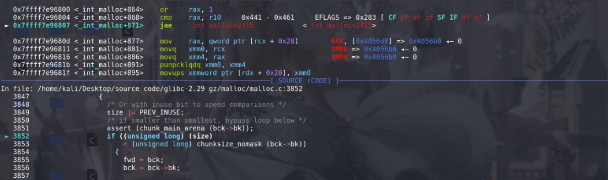

通过比较后进入fd\bk\_nextsize赋值，这里存在large bin attack 的利用：

通过前面的调试，可以看到，直到进入这里都没有对 large bin中本身的chunk(这里的fwd->fd的值) 的fd\bk\_nextsize字段进行检查，所以即使修改了上面的值 也不会影响程序

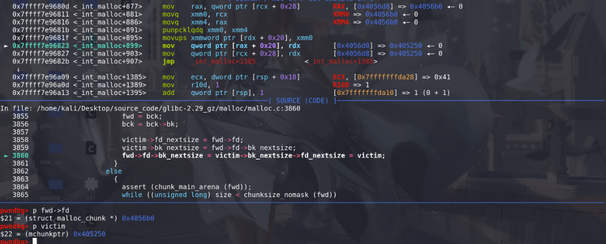

这里将fwd->fd->bk\_nextsize字段上的值 修改为 t arget\_addr ，那么在后面一句赋值的时候：

```
victim->bk_nextsize->fd_nextsize = victim
等于
target_addr->fd_nextsize = victim
```

就可以在 target\_addr + 0x20 的位置放上victim 即一个堆地址(unsorted bin中拿出的那个chunk地址)

如果要**多次利用large bin attack** ==> 只需要每次修改哪个large bin中最大的chunk的bk\_nextsize字段的值即可

最后去更新large bin链的fd\bk字段(这里也没有检查)，将chunk链入对应的large bin链：

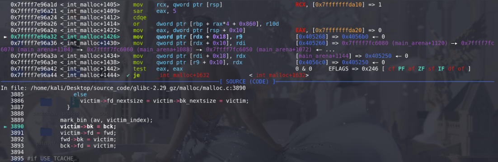

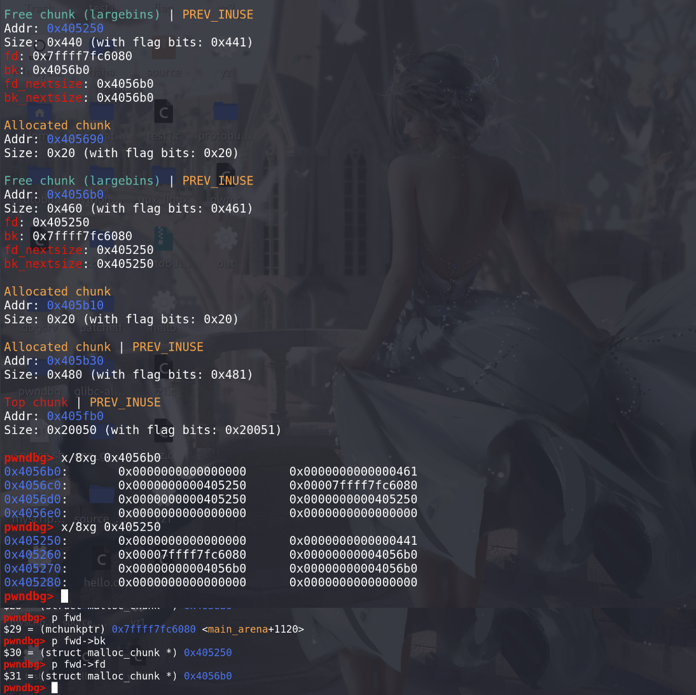

这里可以看到 fwd的bk指向最小的chunk地址 而 fd指向最大的chunk地址

## bin处理

1. 上面结束对unsorted bin的处理后，会进入到对large bin 的处理：

```
#define first(b)     ((b)->fd)    
#define last(b)      ((b)->bk)


/*
         If a large request, scan through the chunks of current bin in
         sorted order to find smallest that fits.  Use the skip list for this.
       */ // 如果申请的大小在large范围 用跳表从小开始 来查找最适合的size大小(large bin中找chunk，满足大小的chunk中，拿size最小的那个chunk)

if (!in_smallbin_range (nb))
{
    bin = bin_at (av, idx); // idx 是前面计算出来的large bin在main_arena.bins数组中的下标

    /* skip scan if empty or largest chunk is too small */ // 如果是空的，或者large bin中的chunk大小不满足 就直接跳过
    if ((victim = first (bin)) != bin
              && (unsigned long) chunksize_nomask (victim) // 最大的chunk的size值
              >= (unsigned long) (nb))
    {
        victim = victim->bk_nextsize; // 找到最小的chunk
        while (((unsigned long) (size = chunksize (victim)) < (unsigned long) (nb)))
            victim = victim->bk_nextsize; // 从小到大依次比较size，找到最适合的那个size

        /* Avoid removing the first entry for a size so that the skip
                 list does not have to be rerouted.  */ // 避免取出跳表的链首chunk
        if (victim != last (bin) // 检查是否为large bin中最后一个空闲块 (last(bin)找到最末尾的那个chunk) ==> 为了保证后面victim->fd 能取到另外一个chunk 而不是本chunk
                  && chunksize_nomask (victim) == chunksize_nomask (victim->fd)) // 如果相邻的下一个chunk的size 与找到的chunk大小如果相同
            victim = victim->fd; // 找到相同size的另外一个chunk(不是跳表的链首)，将其拿出来后续进行切割

        remainder_size = size - nb; // 准备切割
        unlink_chunk (av, victim); // 解链 移出该large bin链

        /* Exhaust */
        if (remainder_size < MINSIZE) // 不满足切割条件（切割后的大小 不能成为一个chunk）
        {
            set_inuse_bit_at_offset (victim, size); // 直接拿走
            if (av != &main_arena)
                set_non_main_arena (victim);
        }
        /* Split */ // 可以切割
        else
        {
            remainder = chunk_at_offset (victim, nb);
            /* We cannot assume the unsorted list is empty and therefore
                     have to perform a complete insert here.  */
            bck = unsorted_chunks (av);
            fwd = bck->fd;
            if (__glibc_unlikely (fwd->bk != bck)) // unsorted bin双向链表检查
                malloc_printerr ("malloc(): corrupted unsorted chunks");
            // 切割后剩下的置入到unsortd bin中 但是这里没有标记main_arena中的last_remainder字段
            remainder->bk = bck; 
            remainder->fd = fwd;
            bck->fd = remainder;
            fwd->bk = remainder;
            if (!in_smallbin_range (remainder_size))
            {
                remainder->fd_nextsize = NULL;
                remainder->bk_nextsize = NULL;
            }
            set_head (victim, nb | PREV_INUSE |
                            (av != &main_arena ? NON_MAIN_ARENA : 0));
            set_head (remainder, remainder_size | PREV_INUSE);
            set_foot (remainder, remainder_size);
        }
        check_malloced_chunk (av, victim, nb);
        void *p = chunk2mem (victim);
        alloc_perturb (p, bytes);
        return p;
    }
}
```

这里再重新看一下unlink函数：

```
/* Take a chunk off a bin list.  */
static void unlink_chunk (mstate av, mchunkptr p)
{
    if (chunksize (p) != prev_size (next_chunk (p)))
        malloc_printerr ("corrupted size vs. prev_size");

    mchunkptr fd = p->fd;
    mchunkptr bk = p->bk;

    if (__builtin_expect (fd->bk != p || bk->fd != p, 0)) // 双向链表检查
        malloc_printerr ("corrupted double-linked list");

    fd->bk = bk;
    bk->fd = fd;
    // 这里已经移出了 large bin 但是后续还要处理fd\bk_nextsize 来保证large bin的有序性

    // 对large bin中chunk的fd\bk_nextsize字段的处理
    if (!in_smallbin_range (chunksize_nomask (p)) && p->fd_nextsize != NULL) // 保证在large bin的范围内 并且 p->fd_nextsize不为空(即是跳表的链首才往下处理，如果不是就不用处理，因为不是跳表的链首的chunk 其fd\bk_nextsize字段都是空的)
    {
        if (p->fd_nextsize->bk_nextsize != p || p->bk_nextsize->fd_nextsize != p) // 跳表的双向链表检察
            malloc_printerr ("corrupted double-linked list (not small)");

        if (fd->fd_nextsize == NULL) // 如果fd 不是相邻的调表的链首
        {
            if (p->fd_nextsize == p) // 
                fd->fd_nextsize = fd->bk_nextsize = fd;
            else
            {
                fd->fd_nextsize = p->fd_nextsize;
                fd->bk_nextsize = p->bk_nextsize;
                p->fd_nextsize->bk_nextsize = fd;
                p->bk_nextsize->fd_nextsize = fd;
            }
        }
        else // 如果找到的 是相邻的调表的链首
        {
            p->fd_nextsize->bk_nextsize = p->bk_nextsize; // 更新前后的跳表即可
            p->bk_nextsize->fd_nextsize = p->fd_nextsize;
        }
    }
}
```

这里调试看一下对large bin的切割处理：

后续申请的chunk要在该large bin的size范围之内 （这里可以看出，如果不是跳表的链首，则fd\bk\_nextsize字段为空）

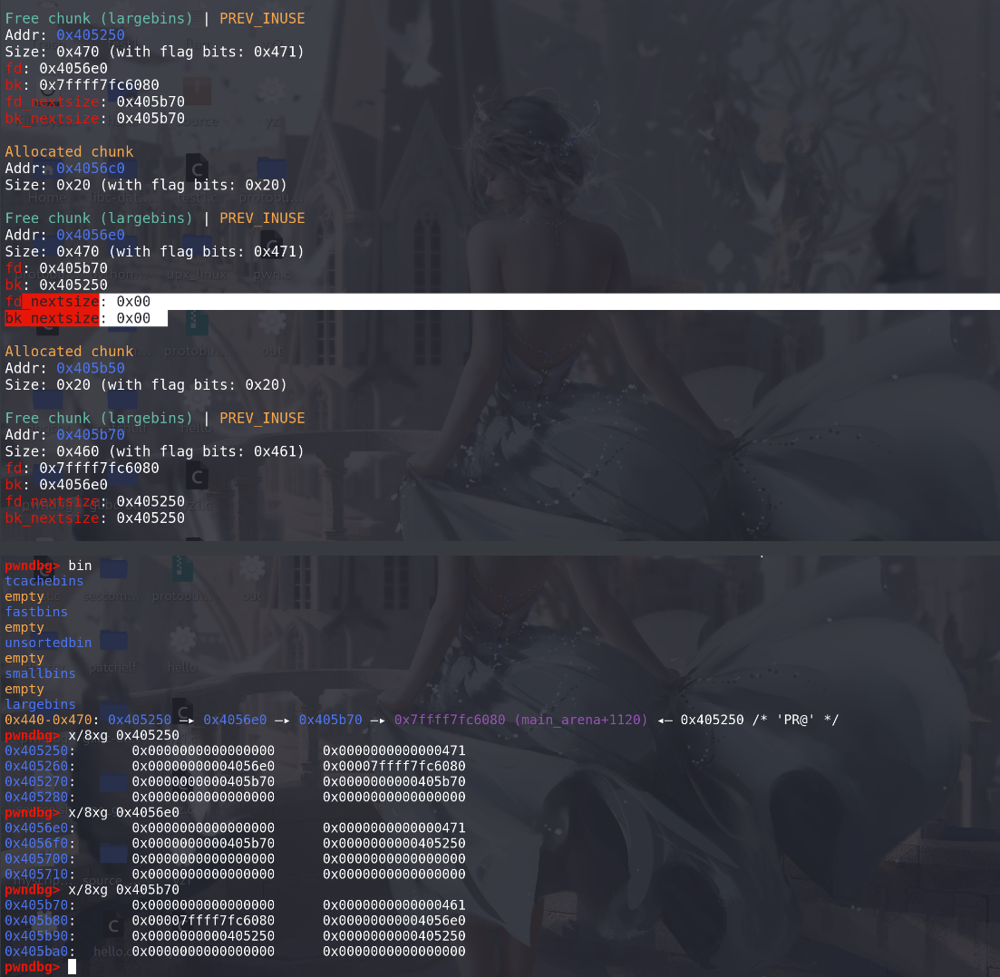

申请0x400的chunk，刚好在切割掉最后的chunk\_0x460后还能剩下0x20，从而保证一个chunk：

这里开始进入对large bin的处理

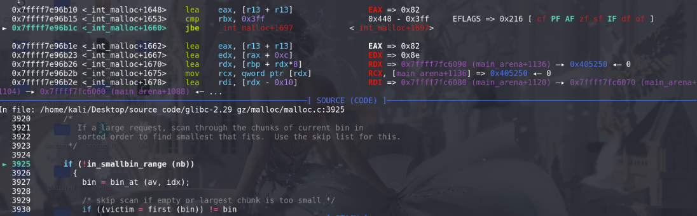

通过前面用 idx = largebin\_index (nb) 取得的下标idx， 拿到了该large bin链 ，这里检查该链是否为空、其中的chunk的size是否满足申请的大小：

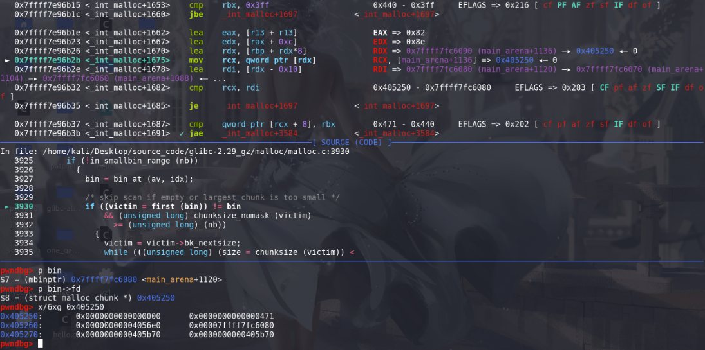

这里拿到了large bin链中size最小的chunk，开始从小到大寻找适合的chunk：

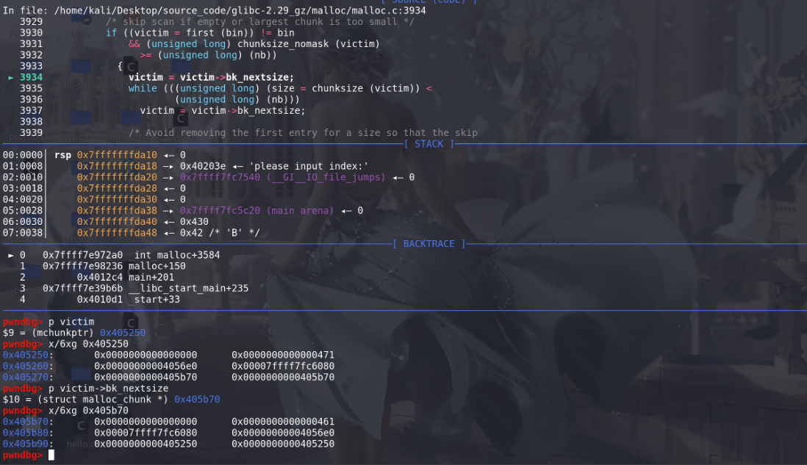

这里找到的最小chunk的size满足申请大小，所以直接退出循环：

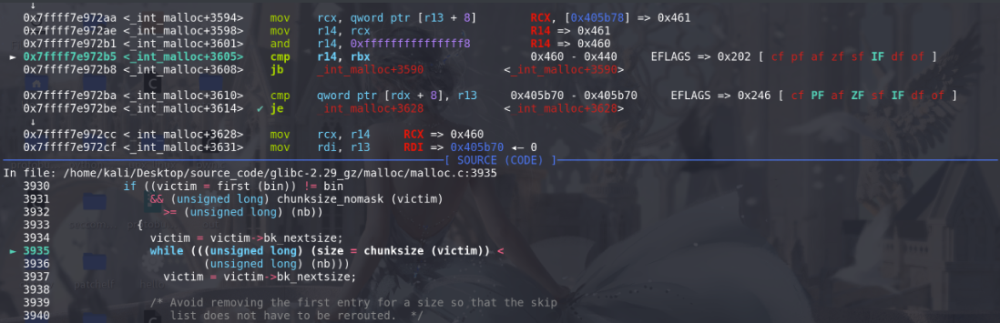

这里由于找到的chunk 是large bin链中的最末尾的chunk，所以肯定不存在后继的空闲块，所以只能使用跳表的链首来解链（这里如果不是large bin链的最末尾的chunk，再判断该chunk的后继的空闲块size与其是否相同，从而决定是否更新）：

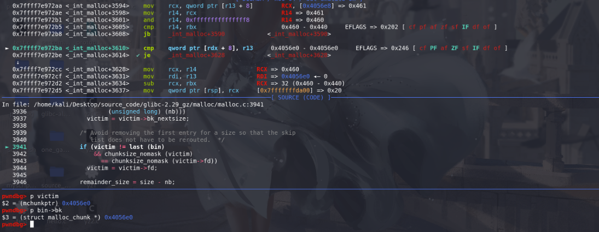

unlink中对large bin进行双向链表检查，随后从large bin中取出：

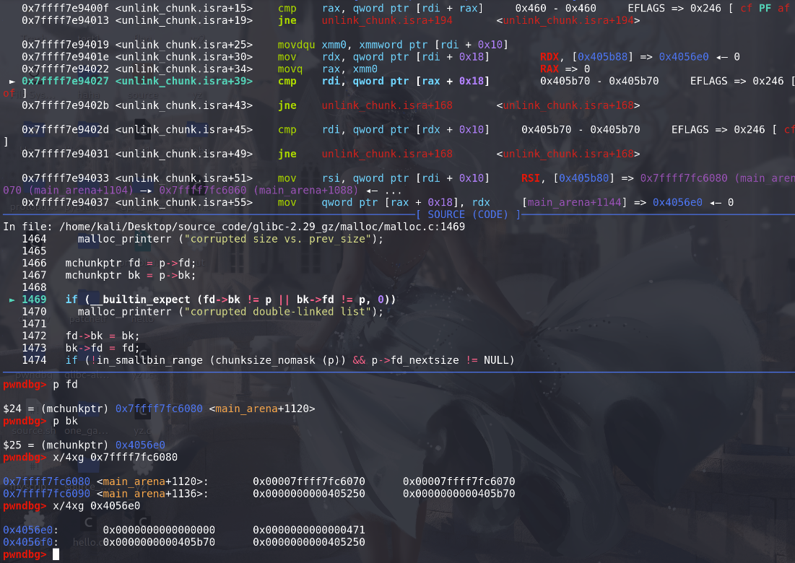

然后处理large bin中的fd\bk\_nextsize字段，其中 p->fd\_nextsize != NULL 保证 解链的是跳表的链首(不是链首不需要处理fd\bk\_nextsize字段)：

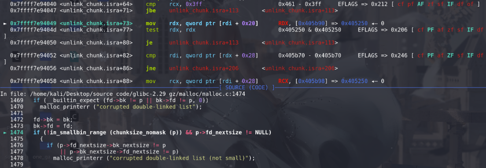

跳表的完整性检查：

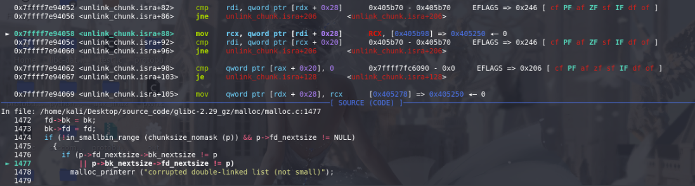

这里没有通过判断 所以进入else 处理：

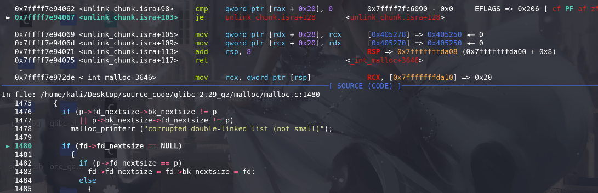

最后直接更新跳表前后的 fd\bk\_nextsize这字段：

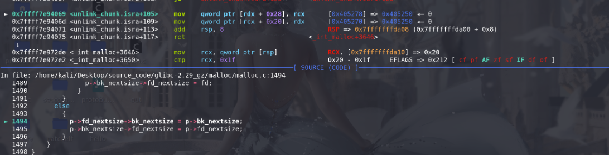

2. 再看一下 如果解链的chunk 不是跳表的链首：

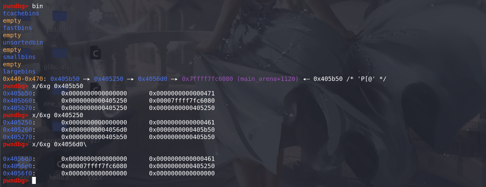

再申请 chunk\_0x440 :

这里经过判断后 确认victim 即跳表的链首 不是该large bin链的最末尾的chunk，即存在后继空闲块 ，且后续判断size与其相同，则更新待解链的chunk 为victim的后继空闲块(size相同) ，cmove指令是一个条件赋值指令条件:ZF=1 => 即相等，才赋值：

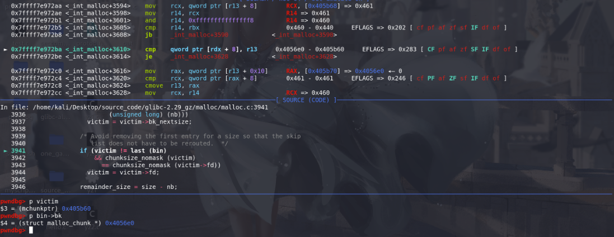

进入unlink，这里由于取的不是 跳表的链首 所以 p->fd\_nextsize != NULL 没通过，即不处理后续large bin的fd\bk\_nextsize字段直接ret（也能保证large bin有序）：

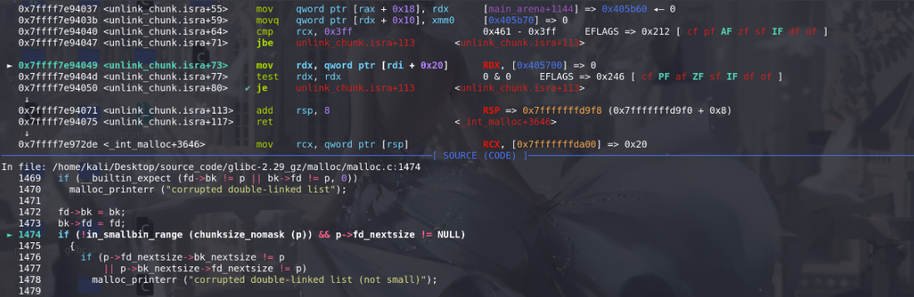

3. 最后进入切割：

比较切割后的大小 是否 保证能达到最小chunk

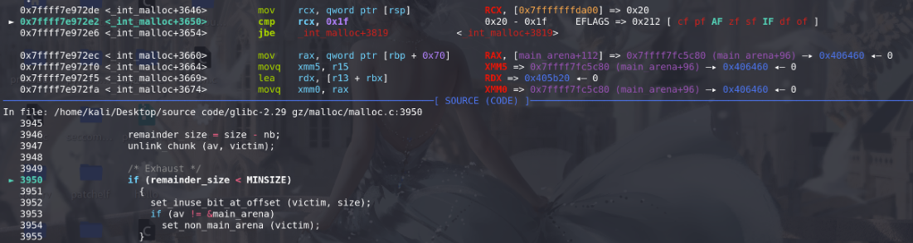

切割后将剩余的chunk放入到unsorted bin中：

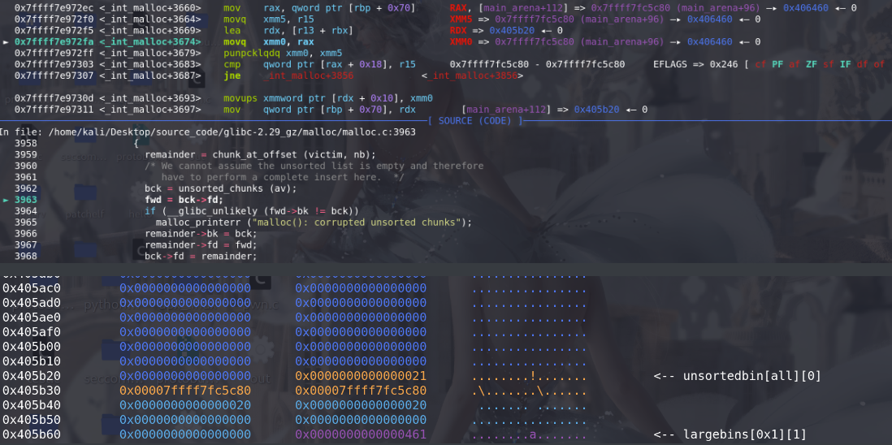

4. 如果没有进入到上面的large bin中，或者进入了但是对应的large bin链中没有满足申请大小的chunk，就会进入下面这段，在small bin 和 large bin中依次从小到大查找适合的bin链：

```
/*
         Search for a chunk by scanning bins, starting with next largest
         bin. This search is strictly by best-fit; i.e., the smallest
         (with ties going to approximately the least recently used) chunk
         that fits is selected.

         The bitmap avoids needing to check that most blocks are nonempty.
         The particular case of skipping all bins during warm-up phases
         when no chunks have been returned yet is faster than it might look.
       */ // 通过查看位图，分配器可以快速确定哪些块是空闲的，而不需要实际检查内存块本身。这种技术减少了分配器必须执行的检查次数，因为如果位图指示一个块是非空的（即已被占用），分配器就不必检查该块的实际内容。

++idx; // 从恰好大一点的 bin链开始搜索(因为前面已经按照idx 来寻找了符合条件的chunk，所以这里就可以直接跳过自身大小的bin，从下一个大小的bin开始搜索)
bin = bin_at (av, idx);
block = idx2block (idx); // 将bins中的下标 转化成 binmap中的下标 ==> 先大致确定范围
map = av->binmap[block]; // 使用了binmap，以1bit来标记不为空的 bin链，来实现快速查找
bit = idx2bit (idx); // bit的作用与map类似，但是idx转化过来的bit值是假定该bin链上有剩余chunk时的binmap中的值 

for (;; ) // 这里循环的作用是为了 更新binmap数组 使之更贴近真实的bin链（后面进入if (victim == bin) 后会开始下一次循环）
{
    /* Skip rest of block if there are no more set bits in this block.  */
    if (bit > map || bit == 0) // 如果按照下标转化过来的bit 比 对应真实的map要大，说明map 中标记的有空闲的bin 不满足申请条件(map标记的bin链中的chunk的size太小) 则可以直接跳过这个binmap，去一个
    {
        do
        {
            if (++block >= BINMAPSIZE) /* out of bins */// 超出了binmap数组的范围，就直接用top
                goto use_top;
        }
        while ((map = av->binmap[block]) == 0); // 直到取出的map不是0

        bin = bin_at (av, (block << BINMAPSHIFT)); // 从当前map能标记的最小bin链开始
        bit = 1;
    }

    /* Advance to bin with set bit. There must be one. */
    while ((bit & map) == 0) // 从小到大找到map标记的bin链 即从右往左map非0的那个bit位
    {
        bin = next_bin (bin);
        bit <<= 1;
        assert (bit != 0);
    }

    /* Inspect the bin. It is likely to be non-empty */
    victim = last (bin); // 找到了适合的最小bin链(size最小)

    /*  If a false alarm (empty bin), clear the bit. */ // 如果找到的bin链是空的，就更新binmap标志，将其标志为空（这里是因为binmap的标记与真实的bin可能不符合，因为后面再切割完成之后没有更新这个标志，或者是前面对于small bin的申请完成之后也没有更新这个标志）
    if (victim == bin) 
    {
        av->binmap[block] = map &= ~bit; /* Write through */
        bin = next_bin (bin);
        bit <<= 1;
    }

    else // 找到的bin链不是空的，就可以开始切割了
    {
        size = chunksize (victim);

        /*  We know the first chunk in this bin is big enough to use. */
        assert ((unsigned long) (size) >= (unsigned long) (nb));

        remainder_size = size - nb;

        /* unlink */
        unlink_chunk (av, victim); // 将链首解链出来

        /* Exhaust */
        if (remainder_size < MINSIZE) // 切割后是否能保持最小的chunk，不行就不用切割
        {
            set_inuse_bit_at_offset (victim, size);
            if (av != &main_arena)
                set_non_main_arena (victim);
        }

        /* Split */
        else // 切割
        {
            remainder = chunk_at_offset (victim, nb);

            /* We cannot assume the unsorted list is empty and therefore
                     have to perform a complete insert here.  */
            bck = unsorted_chunks (av);
            fwd = bck->fd;
            if (__glibc_unlikely (fwd->bk != bck)) // 剩下的置入到unsorted bin中
                malloc_printerr ("malloc(): corrupted unsorted chunks 2");
            remainder->bk = bck;
            remainder->fd = fwd;
            bck->fd = remainder;
            fwd->bk = remainder;

            /* advertise as last remainder */ 
            if (in_smallbin_range (nb))// 标志一些 该chunk是切割后剩余的chunk，后续可以在处理unsorted bin时第一步直接用来切割，只有申请大小的small bin的范围内才会被标记last_remainder
                av->last_remainder = remainder;
            if (!in_smallbin_range (remainder_size))
            {
                remainder->fd_nextsize = NULL;
                remainder->bk_nextsize = NULL;
            }
            set_head (victim, nb | PREV_INUSE |
                            (av != &main_arena ? NON_MAIN_ARENA : 0));
            set_head (remainder, remainder_size | PREV_INUSE);
            set_foot (remainder, remainder_size);
        }
        check_malloced_chunk (av, victim, nb);
        void *p = chunk2mem (victim);
        alloc_perturb (p, bytes);
        return p;
    }
}
```

首先看一下，main\_arena中bins数组和 binmap的结构：

* bin数组中前两个元素为unsorted (2)，后面的都是 small bin(62\*2) 和 large bin（63 \*2）。一共125个bin链
* binmap中有4个元素，每一个为无符号整型 ==> 4字节 ==> 4\*32= 128 位 （能标志128个bin链） ，可以标识所有的samll bin 和 large bin链 ==> 将125个bin链 分成4组，每一组里面都有1bit来标记一个bin 链

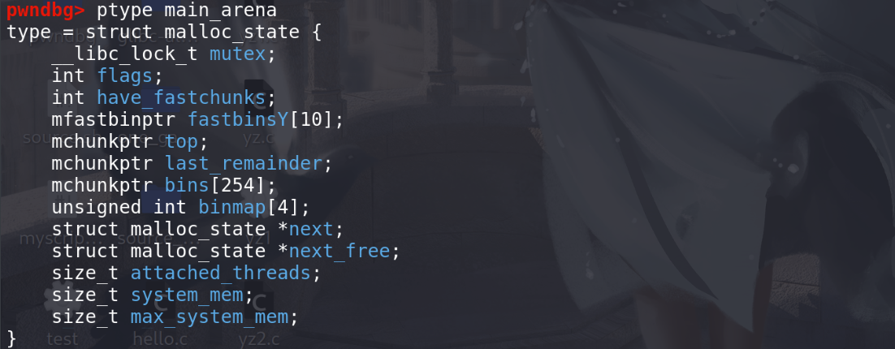

这里调试看一下，使用binmap寻找适合的bin链的过程，(binmap数组是在对unsorted bin处理，将chunk置入到small bin和large bin时进行维护的)：

5. 维护过程：

先准备一个属于small bin 的chunk在unsorted bin中

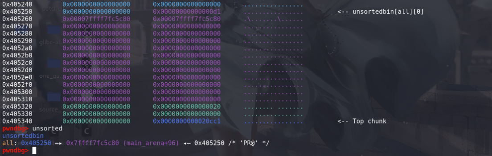

再置入到small bin中：

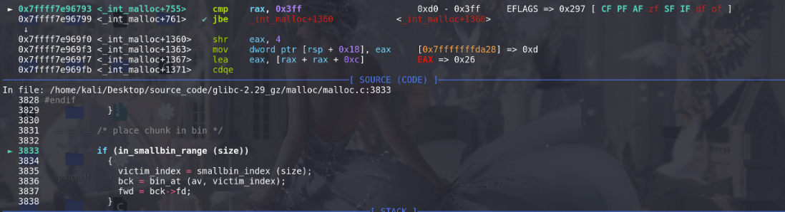

开始更新binmap：

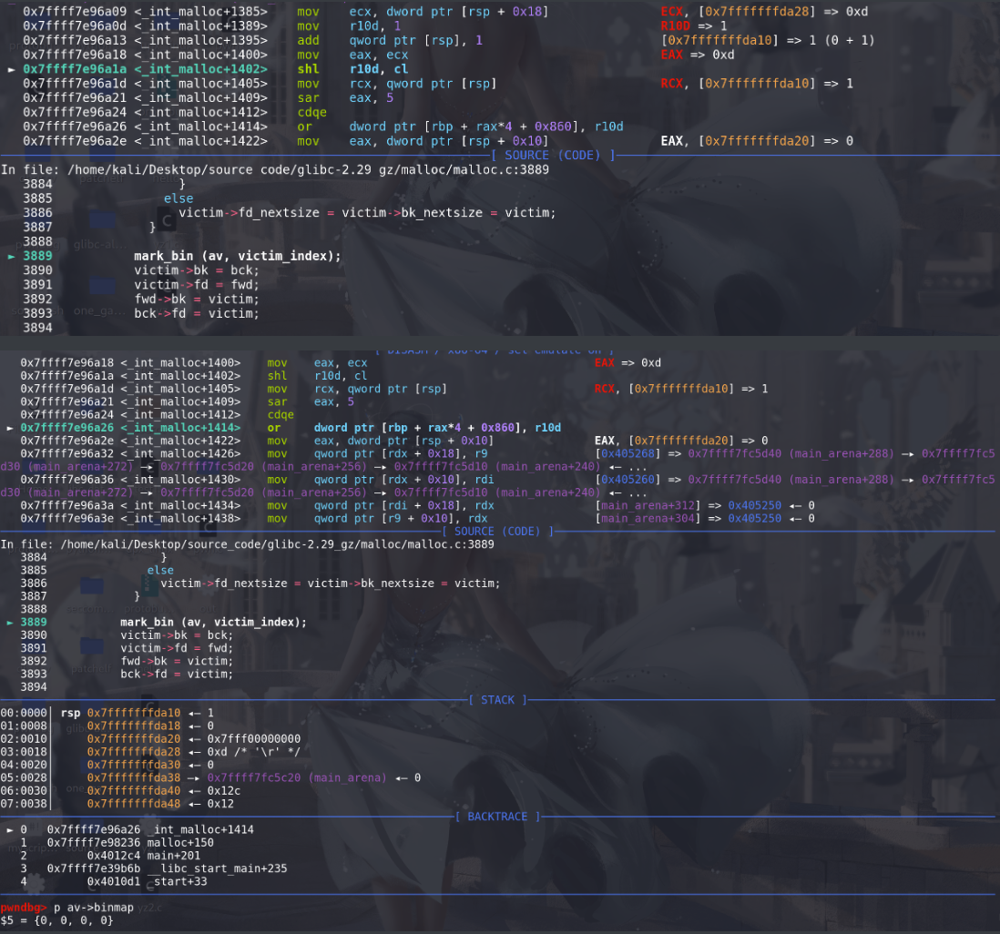

更新完成，大小位0xb0的smnall bin就会被binmap标记 表示该bin链不为空：

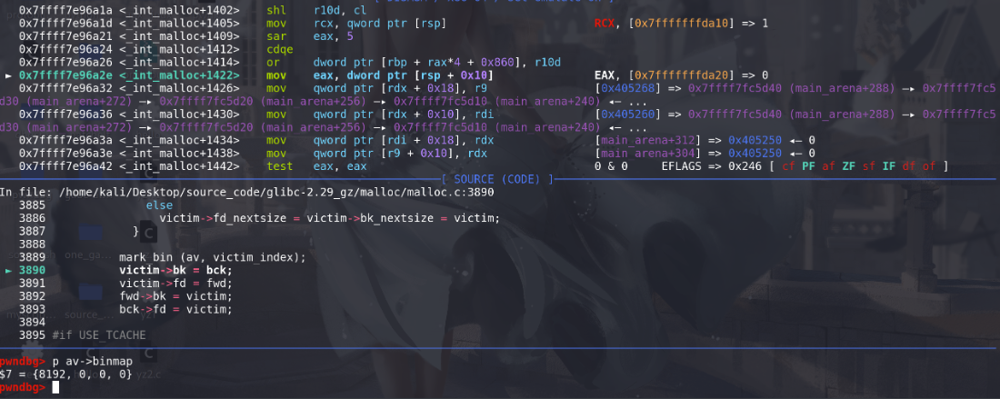

如果将0x20的chunk放入到small bin中，binmap会不会用最小的那个bit位来标记这个bin链：

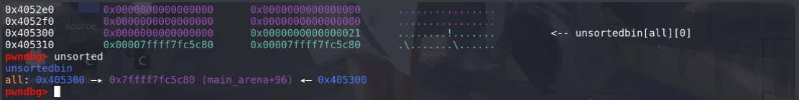

最小的chunk\_0x20，是用0b100 即第3位来标记的 ，后面的chunk依次类推：

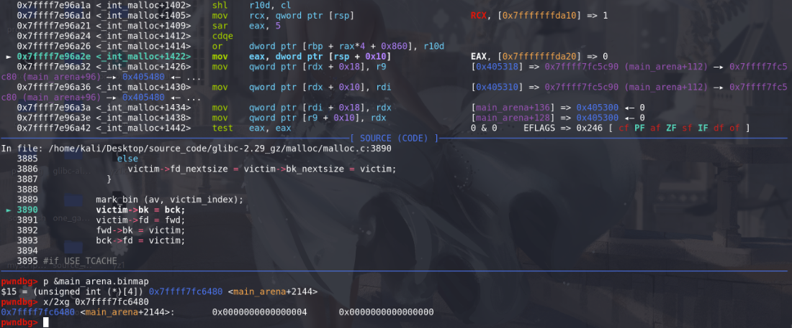

6. 看一下寻找bin链的过程，将chunk\_0xb0置入到small bin中，再申请chunk\_0x20：

small bin中的chunk成功被binmap标记 (这里不放入到small bin中也可以，因为没有被last\_remainder标记，所以开始处理unsorted bin时不会被切割，还是会被先放入到small bin中)

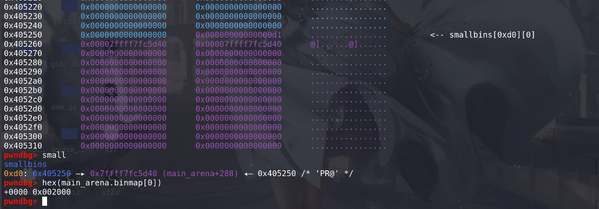

再申请0x20的chunk：

这里bin跳过0x20，直接检查0x30的bin 链，被标记再bimmap[0]中，所以从binmap[0]中拿map，bit ==> 0x8 =>0b1000，说明chunk\_0x30在map中的标记位是第4位 。

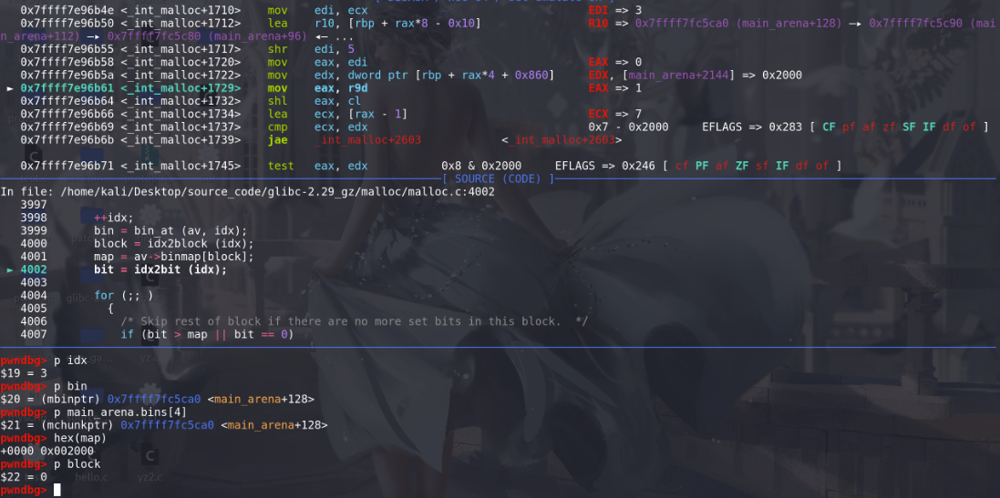

这里bit比map小，说明map标记的bin链中，有满足申请大小的空闲chunk

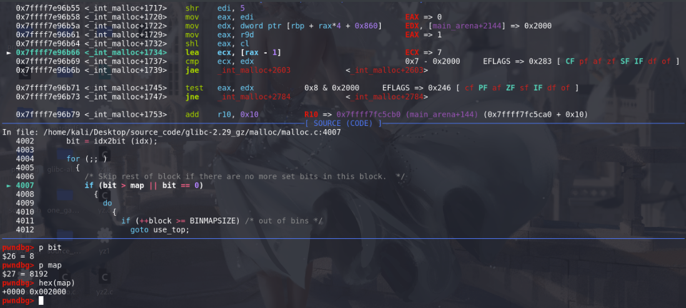

这里开始逐位寻找被标记的bin链(从小到大)，bit左移1位，将相当于寻找的chunk的size大0x10：

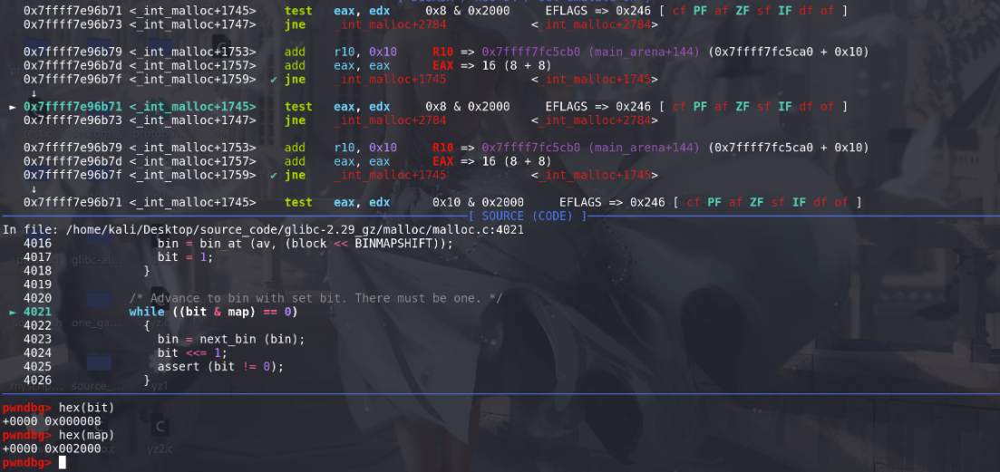

最后找到了被map标记的bin链，代表0xd0大小的空闲块：

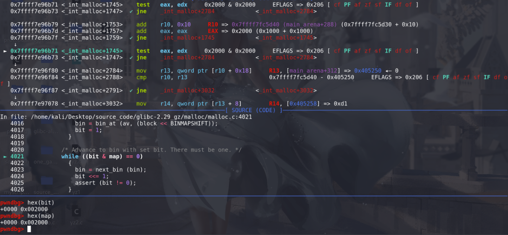

检查找到的bin链是否为空：

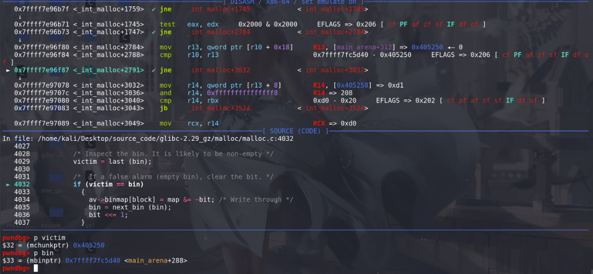

最后unlink从bin链中取出 chunk，开始切割：

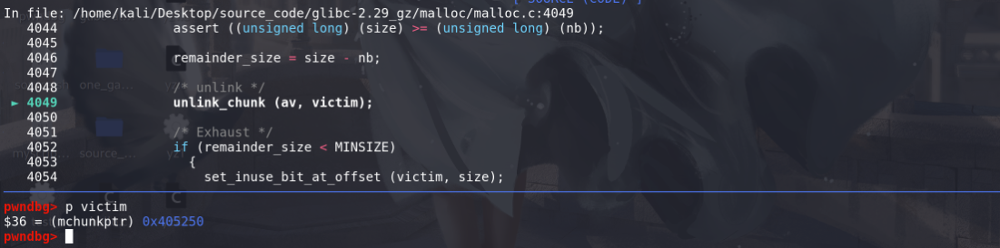

切割后剩下的chunk，放入unsorted bin中：

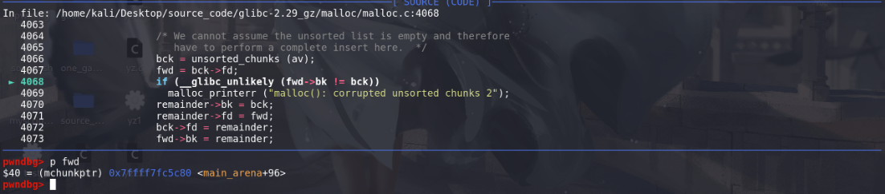

如果申请的大小在small bin范围内，还要标记一下main\_arena中的last\_remainder字段：

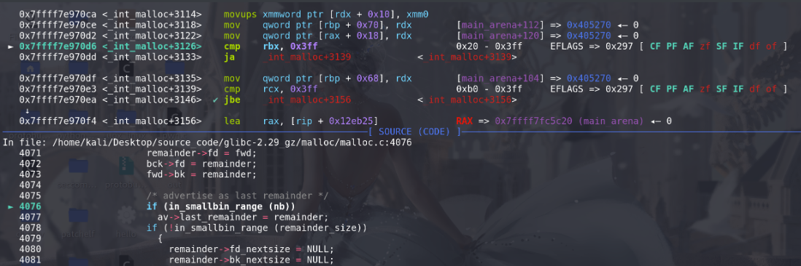

完成申请，剩余的chunk：

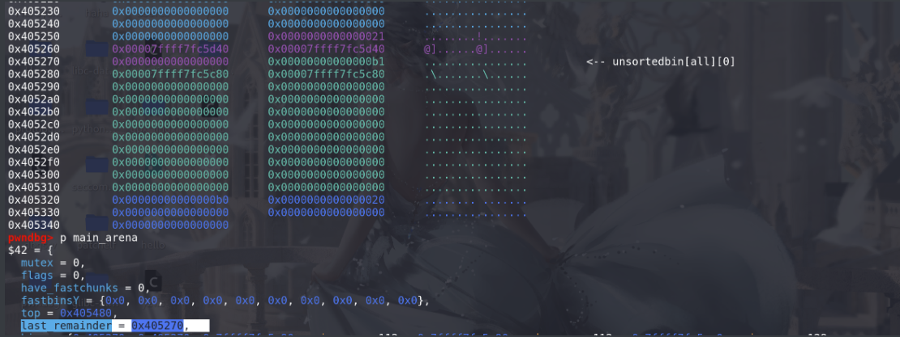

## top

1. 当上面的情况都无法满足时，会启用top 直接从top chunk中拿堆：

```
use_top:
/*
         If large enough, split off the chunk bordering the end of memory
         (held in av->top). Note that this is in accord with the best-fit
         search rule.  In effect, av->top is treated as larger (and thus
         less well fitting) than any other available chunk since it can
         be extended to be as large as necessary (up to system
         limitations).

         We require that av->top always exists (i.e., has size >=
         MINSIZE) after initialization, so if it would otherwise be
         exhausted by current request, it is replenished. (The main
         reason for ensuring it exists is that we may need MINSIZE space
         to put in fenceposts in sysmalloc.)
       */

victim = av->top; // 从main_arena中拿到top chunk地址
size = chunksize (victim); // 拿到top chunk的size

if (__glibc_unlikely (size > av->system_mem)) // 限制了top chunk的最大size值 0x21000（这个检查是glibc-2.29新增的）
    malloc_printerr ("malloc(): corrupted top size");

if ((unsigned long) (size) >= (unsigned long) (nb + MINSIZE)) // top chunk的size满足，切割后还能剩下一个最小的chunk_0x20
{
    remainder_size = size - nb; // 剩余chunk的大小
    remainder = chunk_at_offset (victim, nb); // 剩余chunk的地址
    av->top = remainder; // 更新top chunk地址
    set_head (victim, nb | PREV_INUSE |
                    (av != &main_arena ? NON_MAIN_ARENA : 0));
    set_head (remainder, remainder_size | PREV_INUSE);

    check_malloced_chunk (av, victim, nb);
    void *p = chunk2mem (victim);
    alloc_perturb (p, bytes);
    return p;
}

/* When we are using atomic ops to free fast chunks we can get
         here for all block sizes.  */
else if (atomic_load_relaxed (&av->have_fastchunks)) // have_fastchunks中标记了fastbin中有没有剩余chunk 
{
    malloc_consolidate (av); // 将fastbin中的chunk转移 (当top chunk的size不足且fastbin中有chunk时，会调用malloc_consolidate)
    /* restore original bin index */
    if (in_smallbin_range (nb)) // 重新计算申请的chunk的size在small bin\large bin中对应的idx（前面使用binmap寻找时 idx被修改过了）
        idx = smallbin_index (nb);
    else
        idx = largebin_index (nb);
}

/*
         Otherwise, relay to handle system-dependent cases
       */
else
{
    void *p = sysmalloc (nb, av); // free掉原来的top chunk进入unsorted bin，再将其扩充
    if (p != NULL)
        alloc_perturb (p, bytes);
    return p;
}
}
}
```

**利用1：**

1. 在glibc-2.29之前 没有新增这个检查之前 \_\_glibc\_unlikely (size > av->system\_mem) ，通过将top chunk的size改大，存在一个house of force的利用，可以将top chunk延申到任意位置，从而任意地址申请chunk：
2. 用glibc-2.25演示：

将top chunk的size改大，并计算出，top chunk到 目标地址的距离，这里我申请到\_IO\_list\_all：

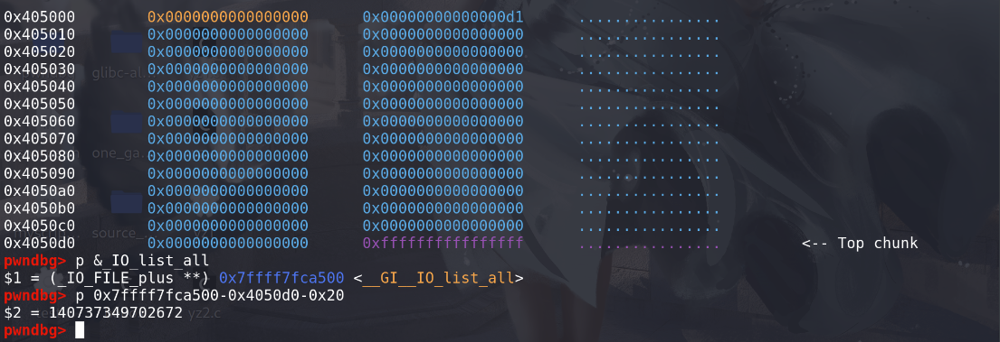

往高地址申请chunk，申请的大小就是刚才计算出来的值：

这里从main\_arena中，取出原本的top chunk地址，并用申请的size和原先的top chunk的size比较

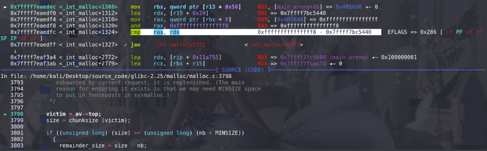

通过检查后计算新的top chunk地址，并将其放入到main\_arena的top字段中：

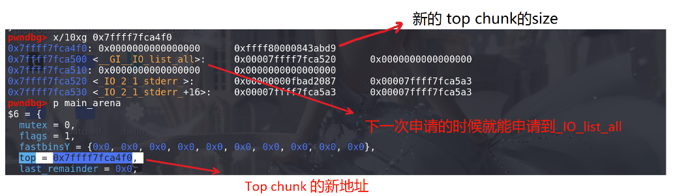

在glibc-2.29之后，house of force就不适用了：

可以看到这里由于伪造的top chunk的size比main\_arena中的system\_mem限制的要大，所以会报错退出，所以不是适用：

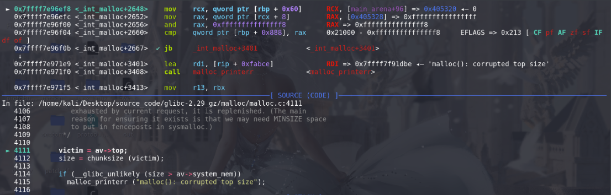

**利用2：** 当空间不足时，会适用syamalloc进行扩容

1. 如果top chunk的size 不能满足申请的大小，且fastbin中没有空闲块，即进入到最后的else中：

这里直接把top chunk的size改小：

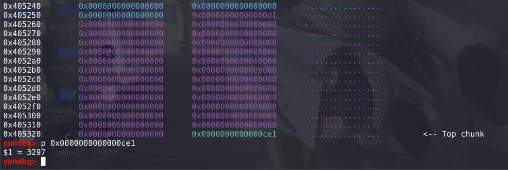

再申请一个大于top chunk sizede 堆，在use\_top 这个标签之前，对top chunk的size没有任何检查的：

我们是将top chunk的size该小，所以这里的system\_mem检查能通过

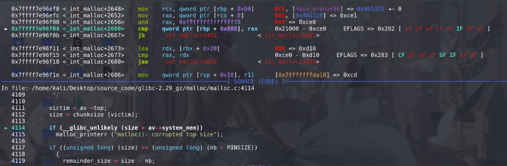

这里由于申请的大小大于top chunk剩余的size，所以不会进入切割，后面fastbin中没有空闲块所以else if也不会进入：

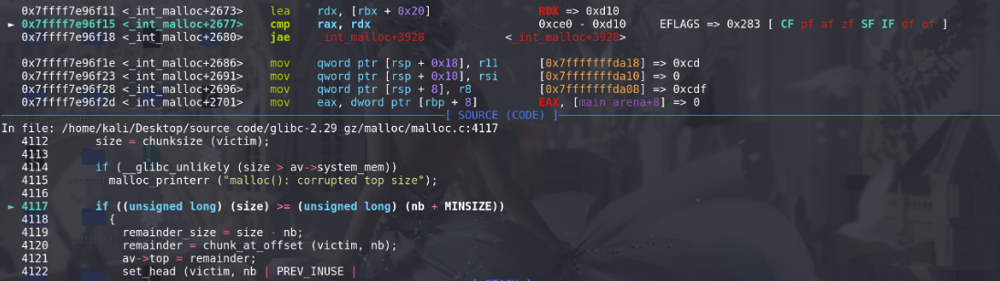

这里最后调用sysmalloc函数，传入的参数是申请的大小 和 main\_arena地址，接收一个指针p作为返回值：

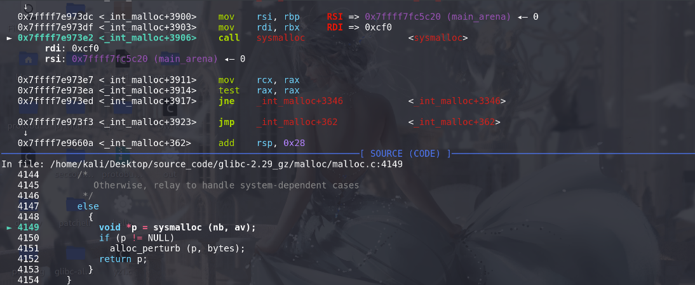

进入sysmalloc函数：

这里如果申请的大小 nb > 0x2000（mmap的阈值）并且 mmap分配的堆的数量n\_mmap 要小于 最大值n\_mmap\_max，那么就会以mmap的形式进行扩容。

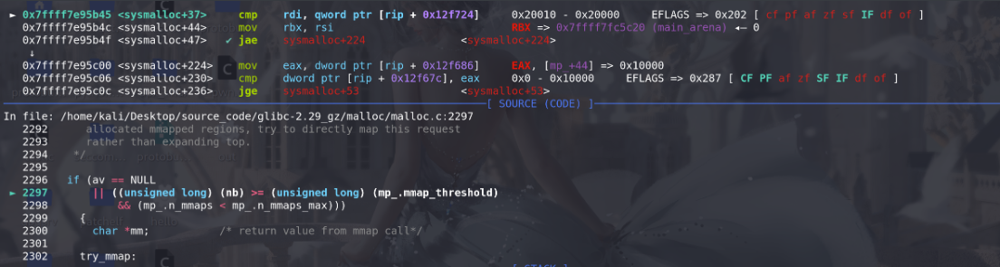

最后扩容出来的效果，和使用main\_arena管理的堆不在一个段上面：

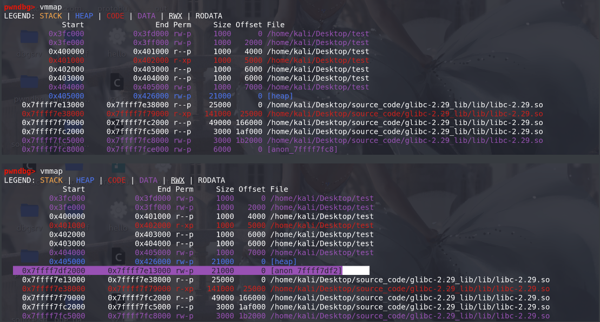

2. 这里看另外一种，对主内存区的分配中使用brk方式扩容：

这里检查了top chunk，根据old\_top的地址(main\_arena中取出) 和 old\_size 计算出top chunk的顶地址(即将top chunk申请完时的地址)。

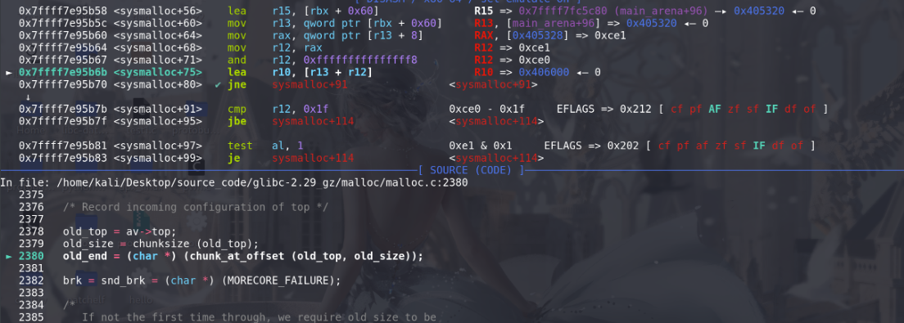

**old\_size至少要大于最小的chunk**，**prev\_inuse位必须为1**，old\_end & (pagesize - 1) ==> **要保证top按0x1000页对齐**：

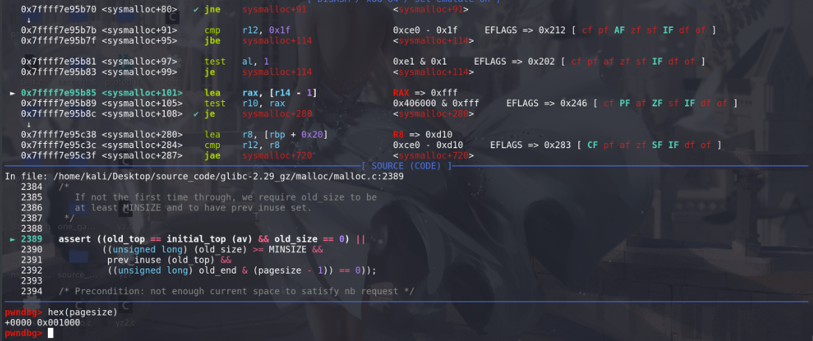

这里再次检查，top chunk的size是否真的不够申请，如果条件为假，则报错退出：

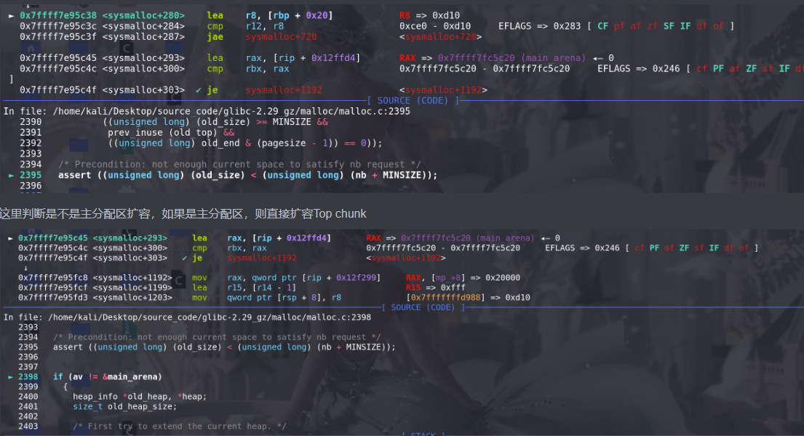

这里判断是不是主分配区扩容，如果是主分配区，则直接扩容Top chunk

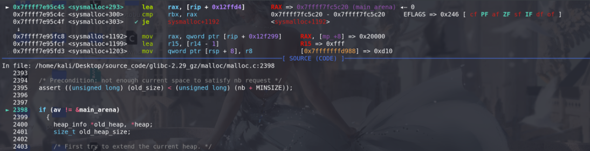

扩容的size 等于 nb(此次分配的容量) + top\_pad(每次分配扩展值128K = 0x020000)+ MINSIZE对齐字节，最后得出size大小。是连续性分配的(contiguous (av))，可以减去老的Top chunk剩余的old\_size值，:

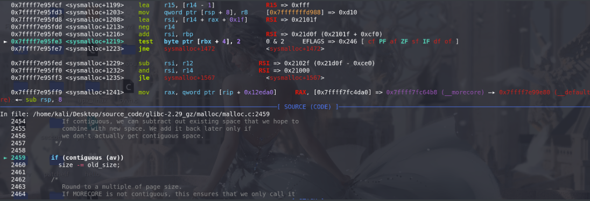

然后使用系统调用(sbrk)分配size大小的内存，可以看到在原有的堆的基础上又增加了0x21000的空间，而且和之前的空间时连续的（这里如果分配失败的话，会从新计算size大小，并采用mmap的方式分配内存）：

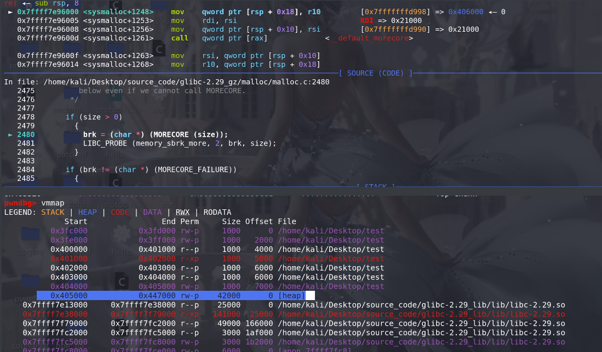

调整main\_arena中系统内存大小（整个top chunk的大小）：

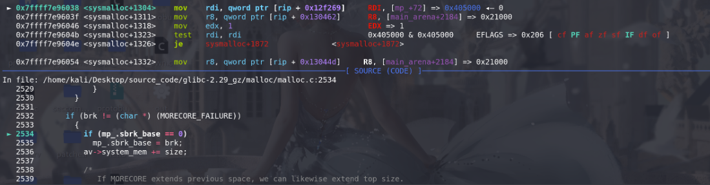

如果通过brk扩容的空间是连续的(想对上次的top chunk顶地址)，则直接更新原来top chunk的size即可。但是我们修改了top chunk的size，所以导致了计算出来的old\_end 和 新扩展的堆的起始地址brk不相等，即地址不连续：

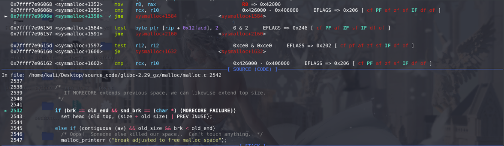

这里进行第二次扩容，correction = brk前置的对齐字节 + 老的top的size + 新的brk尾部的对齐字节，可以看到从新增加 了0x1000大小。如果这里不阔容，而是直接使用第一次扩容的起始地址，可能：

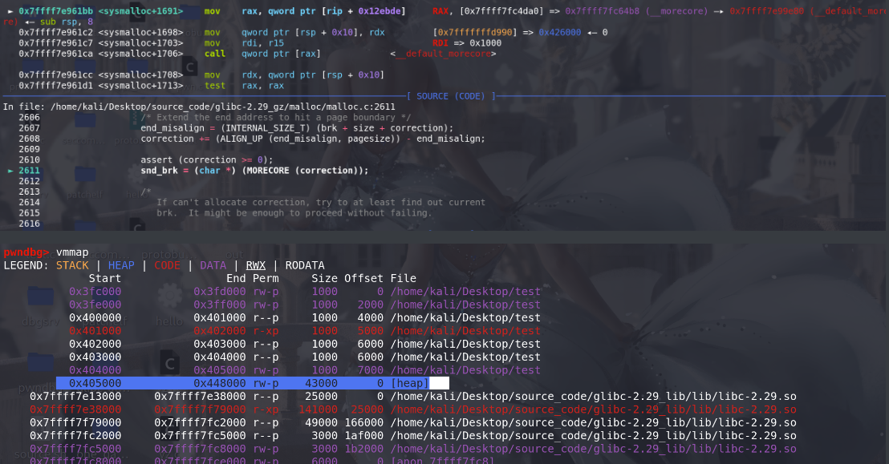

第二次扩容完成后，调整top chunk，top指向调整过的aligned\_brk地址，后续释放掉原来的top chunk：

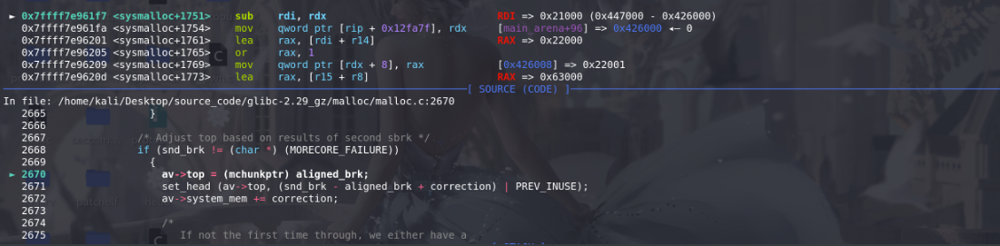

这里，减小top chunk的size来释放，是为了在新的top和原来的top 之间插入一个栅栏，保证原来的top chunk能被正常释放 (不会报错),：

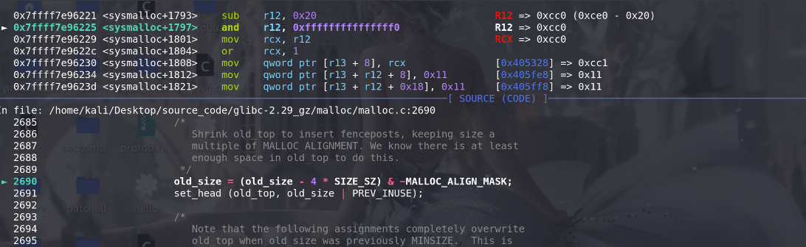

设置栅栏，这么设置的原有和free函数中的实现有关(为了防止原来的top chunk向前合并(向高地址))，导致free top时出错，这里在这篇文章中有解释 [伪造unsortedbin释放时 top chunk的衔接问题](https://blog.csdn.net/yjh_fnu_ltn/article/details/140830566?spm=1001.2014.3001.5501) ，这里采用的就是类似的方法来防止伪造的fake\_chunk向高地址合并：

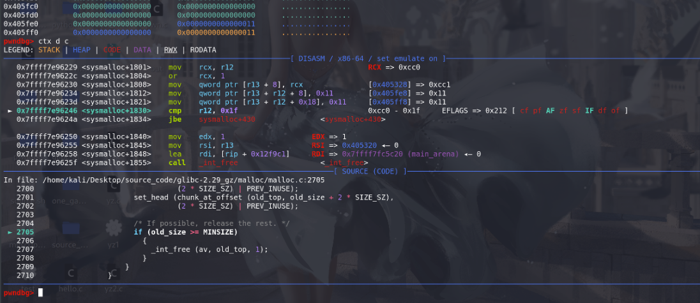

最后释放掉原来的top chunk。进入到unsorted bin中：

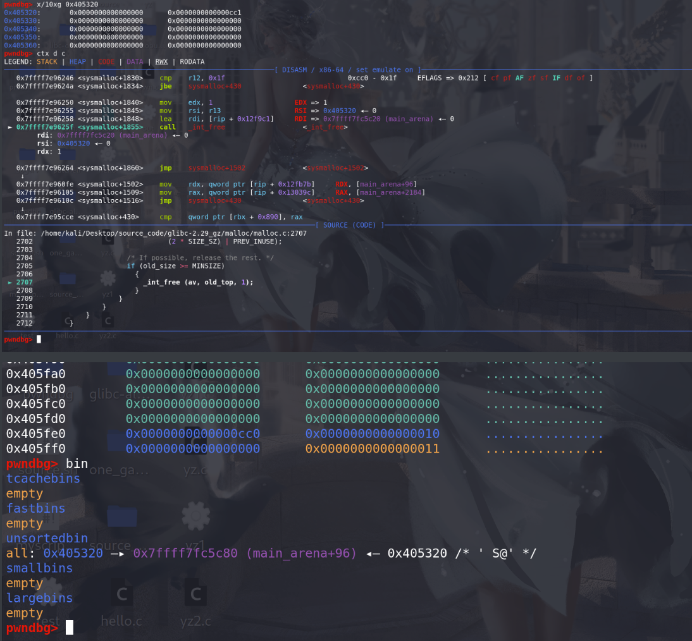

最后，直接从新的top 中切割出了我们申请的chunk（和前面切割top的操作一样）：

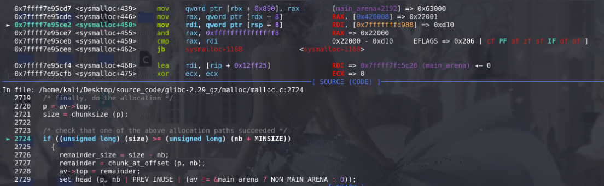

3. 最后在pwngdb中使用vis 命令时，不会显示新的top，新的top要在main\_arena中查看：

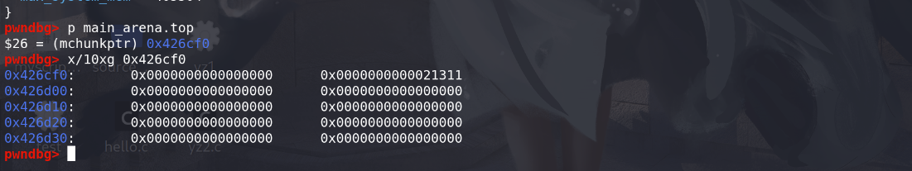
