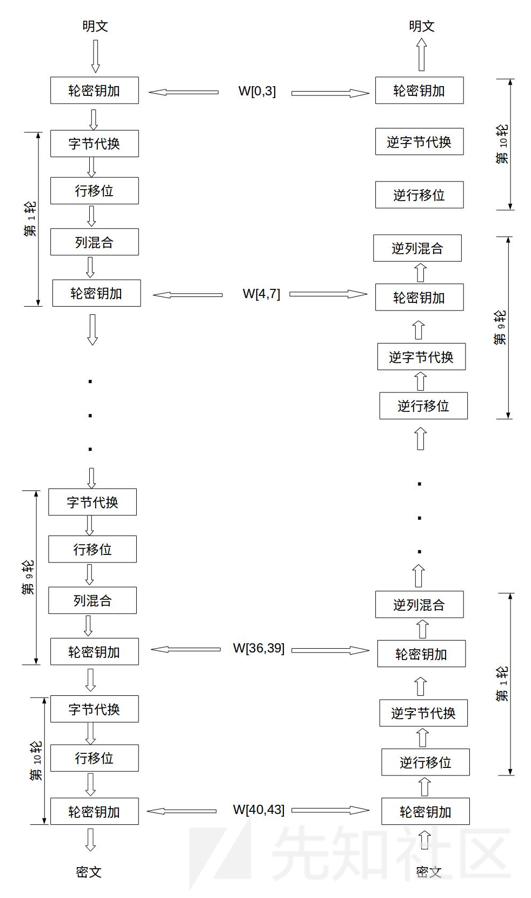
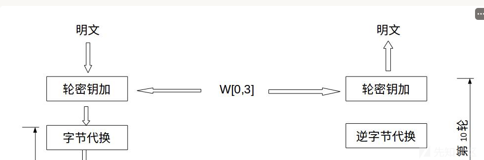

# GoogleCTF2024 - encrypted runner：一种C语言自实现AES-ECB算法的缺陷以及利用分析-先知社区

> **来源**: https://xz.aliyun.com/news/18254  
> **文章ID**: 18254

---

## 前言

该问题源于AES算法自实现过程中类型误用导致密钥泄露，解决此问题需要熟悉AES算法的实现过程，能够发现异常点加以利用

感觉这个问题类型可以同时属于crypto，re，pwn

## 运行情况

题目描述：You won't be able to run anything but ls, echo or date, hahahaha!

附件：

```
pwn-encrypted runner ➤ ls
aes  chal.py
```

nc连接：encrypted-runner.2024.ctfcompetition.com 1337

```
pwn-encrypted runner ➤ nc encrypted-runner.2024.ctfcompetition.com 1337
== proof-of-work: disabled ==
Welcome to encrypted command runner.
What do you want to do?
- encrypt command (e.g. 'encrypt echo test')
- run command (e.g. 'run fefed6ce5359d0e886090575b2f1e0c7')
- exit
```

两个选项：

1. 加密一个命令
2. 执行命令（应该是解密然后执行）

## 题目文件 chal.py：

```
import re
import subprocess
import os


def menu():
    print("What do you want to do?")
    print("- encrypt command (e.g. 'encrypt echo test')")
    print("- run command (e.g. 'run fefed6ce5359d0e886090575b2f1e0c7')")
    print("- exit")

print("Welcome to encrypted command runner.")

whitelist = {
    "date": None,
    "echo": "[\w. ]+",
    "ls": "[/\w]+",
}

whiteset = set(cmd.encode() for cmd in whitelist)

def helper(cmd, data):
    if cmd == "encrypt":
        data = [ord(c) for c in data]
    else:
        data = list(bytes.fromhex(data))

    while len(data) < 16:
        data.append(0)

    # 16 bytes should be enough for everybody...
    inp = cmd + " " + " ".join("%02x" % c for c in data[:16])
    res = subprocess.check_output("./aes", input = inp.encode())
    return bytes.fromhex(res.decode())

counter = 0
while True:
    counter += 1
    if counter > 100:
        print("All right, I think that's enough for now.")
        break

    menu()
    line = input()
    if line.strip() == "exit":
        print("Bye.")
        break

    what, rest = line.split(" ", 1)
    if what == "encrypt":
        cmd = rest.split(" ")[0]
        if cmd not in whitelist:
            print("I won't encrypt that. ('%s' not in whitelist)" % cmd)
            continue
        regex = [cmd]
        if whitelist[cmd]:
            regex.append(whitelist[cmd])
        regex = " ".join(regex)
        match = re.fullmatch(regex, rest)
        if not match:
            print("I won't encrypt that. ('%s' does not match '%s')" % (rest, regex))
            continue
        res = helper("encrypt", rest)
        print("Encrypted command:", res.hex())
    elif what == "run":
        command = helper("decrypt", rest).rstrip(b"\x00")
        cmd = command.split(b" ")[0]
        if cmd not in whiteset:
            print("I won't run that. (%s not in whitelist)" % cmd)
            continue
        res = subprocess.run(command, shell = True, stdout = subprocess.PIPE,
                             stderr = subprocess.STDOUT, check = False)
        print("Output:", res.stdout.decode())
    else:
        print("What?")
```

对于输入encrypt命令时候的处理如下：

```
if what == "encrypt":
    cmd = rest.split(" ")[0]
    if cmd not in whitelist:
        print("I won't encrypt that. ('%s' not in whitelist)" % cmd)
        continue
    regex = [cmd]
    if whitelist[cmd]:
        regex.append(whitelist[cmd])
    regex = " ".join(regex)
    match = re.fullmatch(regex, rest)
    if not match:
        print("I won't encrypt that. ('%s' does not match '%s')" % (rest, regex))
        continue
    res = helper("encrypt", rest)
    print("Encrypted command:", res.hex())
```

通过空格提取出命令，命令必须是白名单中的：

```
whitelist = {
    "date": None,
    "echo": "[\w. ]+",
    "ls": "[/\w]+",
}
```

然后拼接命令和命令对应的正则对输入进行过滤，满足要求就调用aes程序加密，然后输出加密的结果

对于输入run命令时候的处理如下：

```
elif what == "run":
command = helper("decrypt", rest).rstrip(b"\x00")
cmd = command.split(b" ")[0]
if cmd not in whiteset:
    print("I won't run that. (%s not in whitelist)" % cmd)
    continue
res = subprocess.run(command, shell = True, stdout = subprocess.PIPE,
                     stderr = subprocess.STDOUT, check = False)
print("Output:", res.stdout.decode())
```

直接调用aes程序进行解密，对于解密的结果，只校验是否是白名单的命令，对于后面的部分没有校验，**这里存在命令注入的可能，如果我们能得到密钥，自己加密存在命令注入的数据，然后发送过去，就可以完成命令执行**

然后调用命令执行返回结果

## 题目文件 aes

```
int __fastcall main(int argc, const char **argv, const char **envp)
{
    char v4[176]; // [rsp+0h] [rbp-180h] BYREF
    int input[16]; // [rsp+B0h] [rbp-D0h] BYREF
    char opt[112]; // [rsp+F0h] [rbp-90h] BYREF
    __int8 key[16]; // [rsp+160h] [rbp-20h] BYREF
    FILE *stream; // [rsp+170h] [rbp-10h]
    int j; // [rsp+178h] [rbp-8h]
    int i; // [rsp+17Ch] [rbp-4h]

    memset(key, 0, sizeof(key));
    stream = fopen("key", "rb");
    if ( stream )
    {
        if ( fread(key, 1uLL, 0x10uLL, stream) == 16 )// 读取key 128位
        {
            fclose(stream);
            __isoc99_scanf("%s", opt);                // 输入选择
            for ( i = 0; i <= 15; ++i )
                __isoc99_scanf("%x", &input[i]);        // 输入16字节十六进制数
            AES_init_ctx((__int64)v4, (__int64)key);  // aes初始化
            if ( !strcmp(opt, "encrypt") )
            {
                AES_ECB_encrypt(v4, input);             // 加密
            }
            else if ( !strcmp(opt, "decrypt") )
            {
                AES_ECB_decrypt(v4, input);             // 解密
            }
            for ( j = 0; j <= 15; ++j )
                printf("%02x ", (unsigned int)input[j]);// 打印结果
            putchar('
');
            return 0;
        }
        else
        {
            fwrite("Could not read key file.
", 1uLL, 0x19uLL, _bss_start);
            return 1;
        }
    }
    else
    {
        fwrite("Could not open key file.
", 1uLL, 0x19uLL, _bss_start);
        return 1;
    }
}
```

aes二进制文件是自实现的 aes-ecb-128 算法，密钥从本地读取

输入encrypt或者decrypt来进行选择加密还是解密，输入16字节数据用于加密和解密

**这里奇怪的地方，程序用int类型来接受输入，意味着可以输入256以上的值（正常aes算法一般使用单字节类型保存输入）**

这里个地方可能会导致出现异常，跟随代码往下走，下一次调用input的地方是AES\_ECB\_encrypt函数

## AES\_ECB\_encrypt 缺陷

```
__int64 __fastcall Cipher(__int64 input, __int64 keyexpansion)
{
    unsigned __int8 i; // [rsp+1Fh] [rbp-1h]

    AddRoundKey(0, input, keyexpansion);          // 解密过程中，最后一次轮密钥加的时候，
    // 用的是对全0块的state做完rsbox替换之后与初始密钥进行异或
    for ( i = 1; ; ++i )
    {
        SubBytes(input);                            // 超过256的输入都会变成00
        // 意味着这里的每一轮，都是在用00进行计算，因为sbox只有256个数
        ShiftRows(input);
        if ( i == 10 )
            break;
        MixColumns(input);
        AddRoundKey(i, input, keyexpansion);
    }
    return AddRoundKey(0xAu, input, keyexpansion);// 和密钥进行逐字节异或
}
```

这是标准的aes加密过程，在轮密钥加的过程中：

```
__int64 __fastcall AddRoundKey(unsigned int a1, __int64 a2, __int64 a3)
{
    __int64 result; // rax
    unsigned __int8 j; // [rsp+26h] [rbp-2h]
    unsigned __int8 i; // [rsp+27h] [rbp-1h]

    result = a1;
    for ( i = 0; i <= 3u; ++i )
    {
        for ( j = 0; j <= 3u; ++j )
        {
            result = a2;
            *(_DWORD *)(a2 + 4 * (4LL * i + j)) ^= *(unsigned __int8 *)(4 * (4 * (unsigned __int8)a1 + i) + j + a3);
        }
    }
    return result;
}
```

轮密钥加只是单纯使用input的值做异或，然后取得结果，第一次轮密钥加是和原始密钥做异或

然后进入下一轮，在字节代换过程中：

```
__int64 __fastcall SubBytes(__int64 a1)
{
    __int64 result; // rax
    unsigned __int8 j; // [rsp+16h] [rbp-2h]
    unsigned __int8 i; // [rsp+17h] [rbp-1h]

    for ( i = 0; i <= 3u; ++i )
    {
        for ( j = 0; j <= 3u; ++j )
        {
            result = a1;
            *(_DWORD *)(a1 + 4 * (4LL * j + i)) = (unsigned __int8)sbox[*(unsigned int *)(a1 + 4 * (4LL * j + i))];
        }
    }
    return result;
}
```

可以看到，这里sbox索引使用的不是单字节，而可以是超过256的数字

而sbox的大小只有256，通过gdb调试可以看到：

```
pwndbg> p &sbox
$1 = (<data variable, no debug info> *) 0x555555559078 <sbox>   
pwndbg> db 00007ffff6d82100 512
00007ffff6d82100     63 7c 77 7b f2 6b 6f c5 30 01 67 2b fe d7 ab 76
00007ffff6d82110     ca 82 c9 7d fa 59 47 f0 ad d4 a2 af 9c a4 72 c0
00007ffff6d82120     b7 fd 93 26 36 3f f7 cc 34 a5 e5 f1 71 d8 31 15
00007ffff6d82130     04 c7 23 c3 18 96 05 9a 07 12 80 e2 eb 27 b2 75
00007ffff6d82140     09 83 2c 1a 1b 6e 5a a0 52 3b d6 b3 29 e3 2f 84
00007ffff6d82150     53 d1 00 ed 20 fc b1 5b 6a cb be 39 4a 4c 58 cf
00007ffff6d82160     d0 ef aa fb 43 4d 33 85 45 f9 02 7f 50 3c 9f a8
00007ffff6d82170     51 a3 40 8f 92 9d 38 f5 bc b6 da 21 10 ff f3 d2
00007ffff6d82180     cd 0c 13 ec 5f 97 44 17 c4 a7 7e 3d 64 5d 19 73
00007ffff6d82190     60 81 4f dc 22 2a 90 88 46 ee b8 14 de 5e 0b db
00007ffff6d821a0     e0 32 3a 0a 49 06 24 5c c2 d3 ac 62 91 95 e4 79
00007ffff6d821b0     e7 c8 37 6d 8d d5 4e a9 6c 56 f4 ea 65 7a ae 08
00007ffff6d821c0     ba 78 25 2e 1c a6 b4 c6 e8 dd 74 1f 4b bd 8b 8a
00007ffff6d821d0     70 3e b5 66 48 03 f6 0e 61 35 57 b9 86 c1 1d 9e
00007ffff6d821e0     e1 f8 98 11 69 d9 8e 94 9b 1e 87 e9 ce 55 28 df
00007ffff6d821f0     8c a1 89 0d bf e6 42 68 41 99 2d 0f b0 54 bb 16
00007ffff6d82200     00 00 00 00 00 00 00 00 00 00 00 00 00 00 00 00
00007ffff6d82210     00 00 00 00 00 00 00 00 00 00 00 00 00 00 00 00
00007ffff6d82220     00 00 00 00 00 00 00 00 00 00 00 00 00 00 00 00
00007ffff6d82230     00 00 00 00 00 00 00 00 00 00 00 00 00 00 00 00
00007ffff6d82240     00 00 00 00 00 00 00 00 00 00 00 00 00 00 00 00
00007ffff6d82250     00 00 00 00 00 00 00 00 00 00 00 00 00 00 00 00
00007ffff6d82260     00 00 00 00 00 00 00 00 00 00 00 00 00 00 00 00
00007ffff6d82270     00 00 00 00 00 00 00 00 00 00 00 00 00 00 00 00
00007ffff6d82280     00 00 00 00 00 00 00 00 00 00 00 00 00 00 00 00
00007ffff6d82290     00 00 00 00 00 00 00 00 00 00 00 00 00 00 00 00
00007ffff6d822a0     00 00 00 00 00 00 00 00 00 00 00 00 00 00 00 00
00007ffff6d822b0     00 00 00 00 00 00 00 00 00 00 00 00 00 00 00 00
00007ffff6d822c0     00 00 00 00 00 00 00 00 00 00 00 00 00 00 00 00
00007ffff6d822d0     00 00 00 00 00 00 00 00 00 00 00 00 00 00 00 00
00007ffff6d822e0     00 00 00 00 00 00 00 00 00 00 00 00 00 00 00 00
00007ffff6d822f0     00 00 00 00 00 00 00 00 00 00 00 00 00 00 00 00
```

当这里出现超过256的字符，例如汉字，就会索引到00的值

## 实现缺陷分析

回顾一下AES加密解密的过程



当我们输入ls 啊啊啊啊啊啊啊啊啊啊啊啊啊

从第一轮的字节代换开始，后13个字符会变成00

然后使用13个00进行后面的步骤

由于加密过程和解密过程是相互抵消的，整体过程我们只需要关注这一部分：



在解密环节，解密到最后一轮的时候，进行逆字节代换之前依然是13个00

对于逆字节代换，会从sbox找到00所在的索引，这个索引就是代换的结果：

```
00007ffff6d82100     63 7c 77 7b f2 6b 6f c5 30 01 67 2b fe d7 ab 76
00007ffff6d82110     ca 82 c9 7d fa 59 47 f0 ad d4 a2 af 9c a4 72 c0
00007ffff6d82120     b7 fd 93 26 36 3f f7 cc 34 a5 e5 f1 71 d8 31 15
00007ffff6d82130     04 c7 23 c3 18 96 05 9a 07 12 80 e2 eb 27 b2 75
00007ffff6d82140     09 83 2c 1a 1b 6e 5a a0 52 3b d6 b3 29 e3 2f 84
00007ffff6d82150     53 d1 00 ed 20 fc b1 5b 6a cb be 39 4a 4c 58 cf
00007ffff6d82160     d0 ef aa fb 43 4d 33 85 45 f9 02 7f 50 3c 9f a8
00007ffff6d82170     51 a3 40 8f 92 9d 38 f5 bc b6 da 21 10 ff f3 d2
00007ffff6d82180     cd 0c 13 ec 5f 97 44 17 c4 a7 7e 3d 64 5d 19 73
00007ffff6d82190     60 81 4f dc 22 2a 90 88 46 ee b8 14 de 5e 0b db
00007ffff6d821a0     e0 32 3a 0a 49 06 24 5c c2 d3 ac 62 91 95 e4 79
00007ffff6d821b0     e7 c8 37 6d 8d d5 4e a9 6c 56 f4 ea 65 7a ae 08
00007ffff6d821c0     ba 78 25 2e 1c a6 b4 c6 e8 dd 74 1f 4b bd 8b 8a
00007ffff6d821d0     70 3e b5 66 48 03 f6 0e 61 35 57 b9 86 c1 1d 9e
00007ffff6d821e0     e1 f8 98 11 69 d9 8e 94 9b 1e 87 e9 ce 55 28 df
00007ffff6d821f0     8c a1 89 0d bf e6 42 68 41 99 2d 0f b0 54 bb 16
```

00所在的位置是0x52处

逆字节代换的结果就是，3个字节 + 13个0x52

最后进行的轮密钥加运算，会和真正的密钥进行逐字节异或

最后的结果理论上是ls +真正密钥的后13位与0x52异或的结果

## 利用缺陷，泄露密钥

实际测试：

```
What do you want to do?
- encrypt command (e.g. 'encrypt echo test')
- run command (e.g. 'run fefed6ce5359d0e886090575b2f1e0c7')
- exit
encrypt ls 啊啊啊啊啊啊啊啊啊啊啊啊啊
Encrypted command: a75d08c42ca08d8151c5485855c4ed13
What do you want to do?
- encrypt command (e.g. 'encrypt echo test')
- run command (e.g. 'run fefed6ce5359d0e886090575b2f1e0c7')
- exit
run a75d08c42ca08d8151c5485855c4ed13
Output: ls: cannot access ''$'\017''['$'\034\203'':Q'$'\031''z'$'\a\035\252\370\373': No such file or directory
```

得到的结果是：ls ''$'\017''['$'\034\203'':Q'$'\031''z'$'\a\035\252\370\373'

这里的$''不是原始数据的一部分，是shell在屏幕上打印非可见字符时使用的特殊标记

例如$'\017'是\017，这是个8进制

如此分析，最终解密的结果应该是：

out = b'ls \017[\034\203:Q\031z\a\035\252\370\373'

对于后13字节，解密的结果应该就是真正密钥异或0x52的值

```
out = b'ls \017[\034\203:Q\031z\a\035\252\370\373'
key = bytes(out)
key = [o^0x52 for o in key]
key = bytes(key)
print(key[3:].hex())
# 5d094ed168034b28554ff8aaa9
```

前3字节的密钥未知，可以通过爆破得到

## 爆破剩余3字节

加密一个正常数据：

```
pwn-encrypted runner ➤ nc encrypted-runner.2024.ctfcompetition.com 1337
== proof-of-work: disabled ==
Welcome to encrypted command runner.
What do you want to do?
- encrypt command (e.g. 'encrypt echo test')
- run command (e.g. 'run fefed6ce5359d0e886090575b2f1e0c7')
- exit
encrypt ls 0123456789abc
Encrypted command: 33f7eca2f2d35e7ed18900b952b27bcf
```

得到密文：33f7eca2f2d35e7ed18900b952b27bcf

然后自己爆破3字节的密钥进行加密数据：

```
text = "ls 0123456789abc"
encrypted = "33f7eca2f2d35e7ed18900b952b27bcf"

for i in range(256):
    for j in range(256):
        for k in range(256):
            key_0 = bytes([i, j, k]) + key[3:]
            aes = AES.new(key_0, AES.MODE_ECB)
            enc = aes.encrypt(text.encode())
            if enc.hex() == encrypted:
                print(f"Found key: {key_0.hex()}")
                break
# Found key: 4ea3935d094ed168034b28554ff8aaa9
```

得到key：4ea3935d094ed168034b28554ff8aaa9

## 完成命令注入

利用key加密命令注入的数据：

```
from Crypto.Cipher import AES

key = "4ea3935d094ed168034b28554ff8aaa9"
key = bytes.fromhex(key)

text = b"ls .  ;cat /flag"

aes = AES.new(key, AES.MODE_ECB)
enc = aes.encrypt(text)
print(enc.hex())  # Output the encrypted text in hex format
# 4411c07136a38c501609edae77d28f2a
```

直接拿去nc运行：

```
pwn-encrypted runner ➤ nc encrypted-runner.2024.ctfcompetition.com 1337
== proof-of-work: disabled ==
Welcome to encrypted command runner.
What do you want to do?
- encrypt command (e.g. 'encrypt echo test')
- run command (e.g. 'run fefed6ce5359d0e886090575b2f1e0c7')
- exit
run 4411c07136a38c501609edae77d28f2a
Output: aes
chal.py
key
CTF{hmac_w0uld_h4ve_b33n_bett3r}
```

## 总结

**sbox越界访问导致的密钥泄露**

该问题原于AES自实现过程中误使用int类型存储待加密数据，而非使用unsigned char类型

导致输入特殊字符的时候，保存的数据超过了256大小，以至于sbox索引出现问题，第一次字节代换出现00

从而使得解密过程中，使用00异或反字节代换的结果异或真正密钥，而反字节代换结果是相同的，最终泄露出原始密钥

## 参考资料

* [[0](#)] ([https://www.bilibili.com/video/BV1i341187fK/?spm\_id\_from=333.337.search-card.all.click&amp;vd\_source=9fd1028a80c00dfb9726baf219d007b9](https://www.bilibili.com/video/BV1i341187fK/?spm_id_from=333.337.search-card.all.click&vd_source=9fd1028a80c00dfb9726baf219d007b9))
* [1] [Google CTF 2024 - Pwn Encrypted Runner Writeup | Laggy's Blog](https://alaggydev.github.io/posts/writeup-pwn-encrypted-runner/)
* [2] [google-ctf/2024/quals/pwn-encrypted-runner/challenge/solve.py at main · google/google-ctf](https://github.com/google/google-ctf/blob/main/2024/quals/pwn-encrypted-runner/challenge/solve.py)
* [3] [Writeup：GoogleCTF quals 2024 加密运行器 |由 HHHKB |中等](https://medium.com/@harryfyx/googlectf-quals-2024-encrypted-runner-30c277765154)
* [4] [AES加密解密理论到源码-逆向强网拟态2024babyre和2024网鼎杯re2-先知社区](https://xz.aliyun.com/news/15584)
* [5] [详解白盒AES以及C代码实现（以CTF赛题讲解白盒AES）-先知社区](https://xz.aliyun.com/news/16176)
