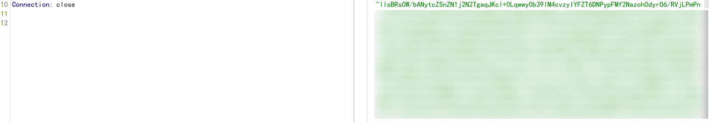
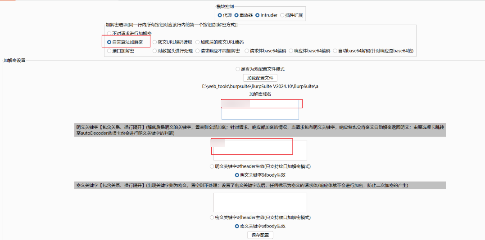
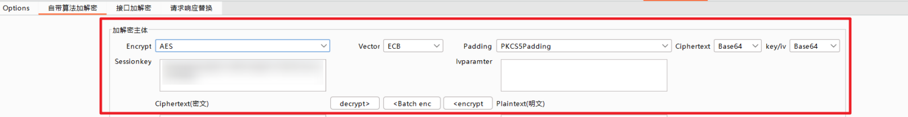
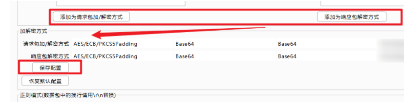
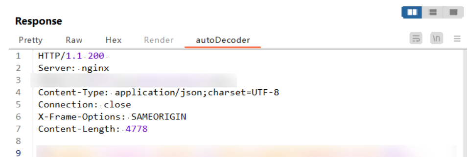

# 记录burp插件autoDecoder的一次数据解密实战-先知社区

> **来源**: https://xz.aliyun.com/news/18255  
> **文章ID**: 18255

---

## 0x01 网站加密算法分析

bp抓包，发现请求和响应包里的数据都被加密了，从密文的特点分析应该用的是AES，下一步思路是找关键加密函数及参数，看是否可以进行解密



## 0x02 参数及函数定位

通过搜索AES关键字，在js文件中翻找加密算法，如果加密算法很多，无法判断是哪个在起作用，可以通过调试，定位了解密的函数关键函数。这里通过调试，定位了解密的关键函数m。密钥是n，偏移量是t，ECB模式，PKcs7padding

> 这里有一个关键点，由于采用了ECB模式，不知道iv也可以解密

```
function m(e, n) {
  var t = arguments.length > 2 && void 0 !== arguments[2] ? arguments[2] : "";
  n = l.enc.Base64.parse(n),
  t = l.enc.Base64.parse(t);
  var c = l.AES.decrypt(e, n, {
      iv: t,
      mode: l.mode.ECB,
      padding: l.pad.Pkcs7
  })
  , r = c.toString(l.enc.Utf8);
    return r.toString()
}
```

## 0x03 数据解密

找到关键加解密函数以及对应的算法参数后，下一步的思路就是尝试进行解密了，这里用了两种方法，一种是借助bp的插件autoDecoder，第二种方法是将js加密函数转译成python，还原了加解密的过程。

### 利用bp插件autoDecoder

bp插件autoDecoder可以对请求和响应数据包进行加解密，里面自带了加解密算法，也提供了自定义算法加解密框架，但是工具并非无脑使用，加解密算法还是需要自己去逆出来的，只是相对于数据包里的密文来说，是半自动。

前面经过分析和调试，我们可以获得密钥key，且在ECB模式下，偏移量iv不起作用，同时PKcs7可以使用PKcs5代替，因此这里选择使用插件中自带的算法进行解密

#### 加密算法配置

第一个选项卡里，将域名填入，其他暂时不做配置



填入算法、key、padding、iv等算法参数，将密文传入框中，可以解密出对应明文



算法配置基本完成，接下来就可以通过配置自带加密算法加解密实现对数据包中的加密数据进行自动处理了

#### 插件配置保存

在对算法配置完成后，需要按照对请求和响应包保存配置，以使其生效，插件会将当前配置参数保存在文件中



#### 数据包自动化解密

上述算法信息配置完毕后，应用插件实现数据包自动化加解密的时候却遇到了问题，经过分析，发现关键点在于没有给出加密数据的准确匹配方式，导致传入的待解密数据并非全部为原始密文，算法报错。autoDecoder中提供了**正则模式**，能够实现关键内容的匹配。

对传输的数据包进行观察，发现响应数据都是以某一特定字符串开头。因此，将正则匹配的规则写为："**xxxxxx":"(.\*?)**"

全部配置完成后，重新保存应用配置，再次应用插件，才实现了数据的解密。



### 逆js代码，还原函数进行解密

通过调试，了解了网站加密的流程，将js代码翻译成python，将加解密过程进行还原，实现了对单次密文的加解密

```
#!/usr/bin/env python
# -*- coding: UTF-8 -*-

import base64
from Crypto.Cipher import AES
from Crypto.Util.Padding import pad, unpad

def base64_encode(data):
    """将字节数据进行 Base64 编码"""
    return base64.b64encode(data).decode('utf-8')

def base64_decode(encoded_data):
    """将 Base64 编码的字符串解码为字节数据"""
    return base64.b64decode(encoded_data)

def aes_encrypt(data, key, iv=None, mode=AES.MODE_ECB):
    """AES 加密"""
    key = base64.b64decode(key)  # 解码 Base64 格式的密钥
    if iv:
        iv = base64.b64decode(iv)
    cipher = AES.new(key, mode)
    encrypted_data = cipher.encrypt(pad(data.encode('utf-8'), AES.block_size))
    return base64.b64encode(encrypted_data).decode('utf-8')

def aes_decrypt(encrypted_data, key, iv=None, mode=AES.MODE_ECB):
    """AES 解密"""
    encrypted_data = base64.b64decode(encrypted_data)  # 解码 Base64 格式的加密数据
    key = base64.b64decode(key)  # 解码 Base64 格式的密钥
    if iv:
        iv = base64.b64decode(iv)
    cipher = AES.new(key, mode)
    decrypted_data = unpad(cipher.decrypt(encrypted_data), AES.block_size)
    return decrypted_data.decode('utf-8')


if __name__ == "__main__":
    # 示例密钥和数据
    key = ""  # Base64 编码的密钥
    data = ""
    # iv = ""  # Base64 编码的初始化向量（IV），如果使用 ECB 模式则不需要

    # 加密
    encrypted_data = aes_encrypt(data, key, iv=None)
    print(f"加密后的数据: {encrypted_data}")

    # 解密
    decrypted_data = aes_decrypt(data, key, iv=None)
    print(f"解密后的数据: {decrypted_data}")
```

## 参考资料

[GitHub - f0ng/autoDecoder: Burp插件，根据自定义来达到对数据包的处理（适用于加解密、爆破等），类似mitmproxy，不同点在于经过了burp中转，在自动加解密的基础上，不影响APP、网站加解密正常逻辑等。](https://github.com/f0ng/autoDecoder)

[burpsuite数据包自动加解密插件，autoDecoder详细安装+使用-CSDN博客](https://blog.csdn.net/2202_75361164/article/details/144360050)
