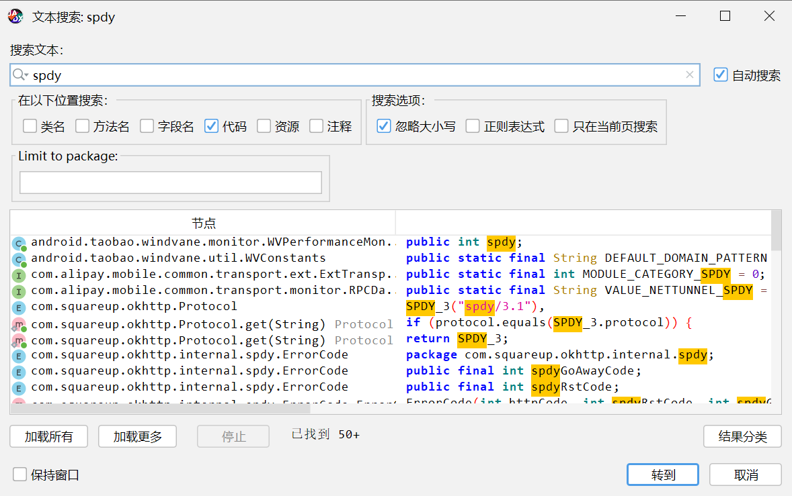
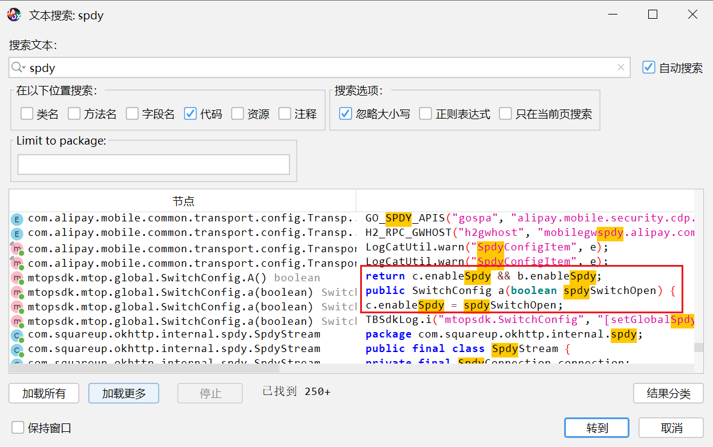
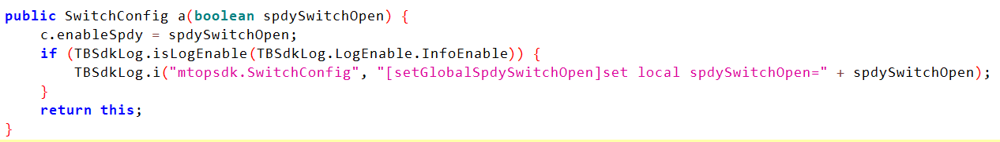
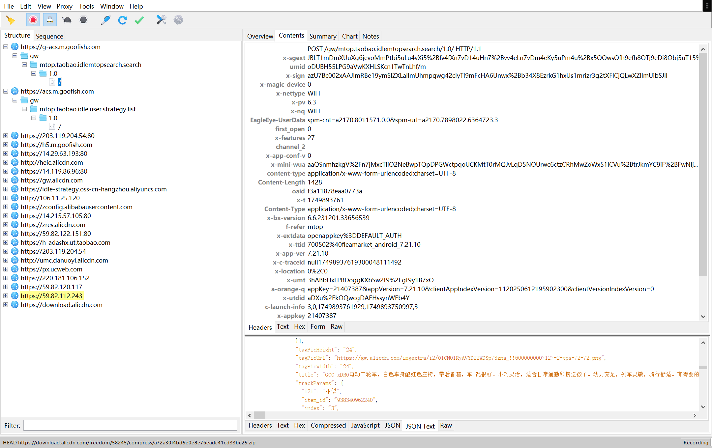
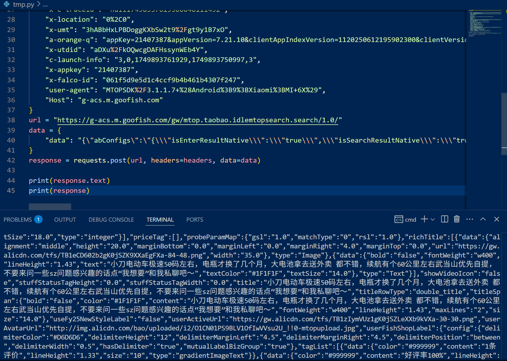
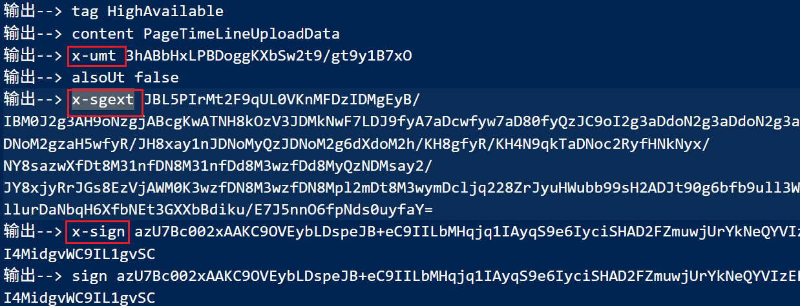
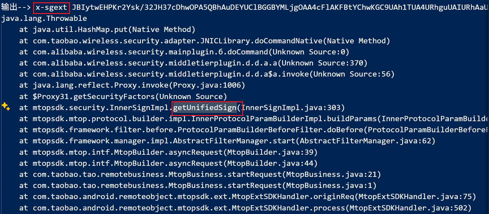
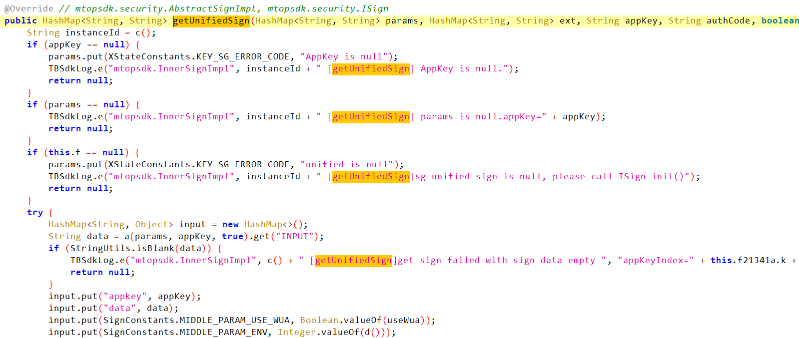
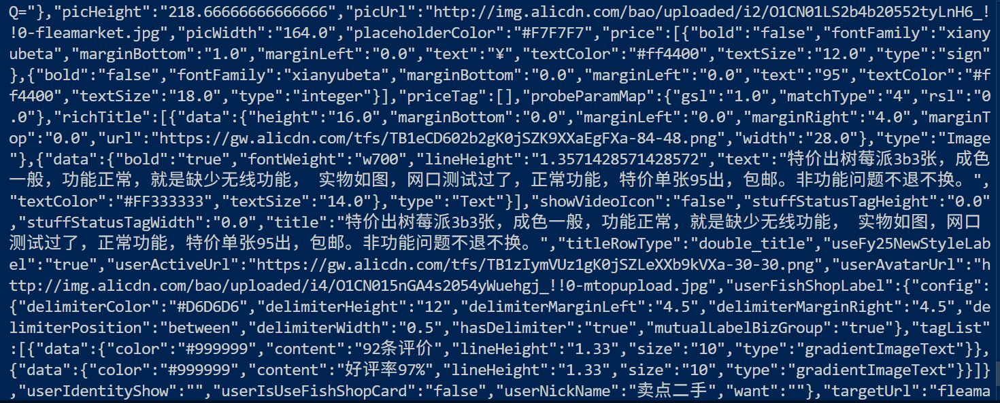

# 某鱼自定义协议请求抓包＋加密参数分析-先知社区

> **来源**: https://xz.aliyun.com/news/18258  
> **文章ID**: 18258

---

某些淘系APP使用私有协议（如SPDY）进行网络通信，导致传统抓包工具（如Charles、Fiddler）无法直接抓取数据包。本文将介绍如何绕过该私有协议，并分析其请求参数的生成过程。

### APP分析

使用jadx打开apk，搜索spdy，可以找到多个与私有协议相关的类和方法



可以看到确实搜索到许多私有协议相关的代码

通过查看搜索结果，可以看到有关开启spdy的代码



选择其中传入布尔值的函数



很明显这个函数的作用是根据传入参数决定是否开启spdy协议，因此要绕过该协议，可以hook这个函数，每次调用这个函数时修改传入其中的参数值为false

### Hook

#### Frida Hook

```
Java.perform(function () {
    var SwitchConfig = Java.use('mtopsdk.mtop.global.SwitchConfig');
    SwitchConfig.A.overload().implementation = function () {
        return false;
    }
});
```

#### Xposed Hook

```
package com.example.spdy_xposed;

import android.util.Log;
import de.robv.android.xposed.XC_MethodHook;
import de.robv.android.xposed.XposedHelpers;
import de.robv.android.xposed.IXposedHookLoadPackage;
import de.robv.android.xposed.callbacks.XC_LoadPackage.LoadPackageParam;

public class Hook implements IXposedHookLoadPackage {
    public void handleLoadPackage(final LoadPackageParam lpparam) throws Throwable {
        if (lpparam.packageName.equals("com.taobao.idlefish")) {
            Class<?> clazz = XposedHelpers.findClass("mtopsdk.mtop.global.SwitchConfig", lpparam.classLoader);
            XposedHelpers.findAndHookMethod(clazz, "A", new XC_MethodHook() {
                public void beforeHookedMethod(MethodHookParam param) throws Throwable {
                    param.setResult((Object) false);
                }
            });
        }
        ;
    }
}
```

### 参数分析

启动hook脚本之后，打开应用的搜索页面，搜索任意商品后查看Charles抓包的结果



可以看到应用已经使用了HTTP协议进行通信，可以正常抓取响应内容。

​

**分析请求中携带的参数**

为了分析请求中携带的参数，首先使用Python复现Charles中的请求，验证抓包结果的有效性。

```
import requests


headers = {
    "x-sgext": "JBLT1mDmXUuXg6jevoMmPtbi5uLu4vXi5%2Bfv4fXn7vD14uHn7%2Bvv4eLn7vDm4eKy5uPm4u%2Bx5OOwsOfh9efh8OTj9eDi8Obj5uT15%2FXi9eL14vXi9eL14vXi9ef14PXj9eP14%2FXj9eP14%2FXj9fCz8Obw5vCy4O6w5%2Bb14%2Bbj5uP14%2FXhsrL14%2FXw5fDh8Obw5fCskoWr9eP18%2FbhtPP24bDw4ozk9eDq8OHw5e7nsufk5O%2F15Orw4%2FDj8OHv9eb15vXm9eb1ieaJ4%2FDj8OXu57Ln5OTv9eb15vXm9eb15vXmjLeM5PXm9eSM",
    "umid": "oDUBH55LPG9aVwKXHLSKcn1TwTnLhf/m",
    "x-sign": "azU7Bc002xAAJImRBe19ymSlZXLalImUhmpqwg42clyTl9mFcHA6Unwx%2Bb34X8EzrkG1hxUs1mrizr3g2tXFICjQLwXZlImUibSJlI",
    "x-magic_device": "0",
    "x-nettype": "WIFI",
    "x-pv": "6.3",
    "x-nq": "WIFI",
    "EagleEye-UserData": "spm-cnt=a2170.8011571.0.0&spm-url=a2170.7898022.6364723.3",
    "first_open": "0",
    "x-features": "27",
    "channel_2": "",
    "x-app-conf-v": "0",
    "x-mini-wua": "aaQSnmhzkgV%2Fn7jMxcTIiO2NeBwpTQpDPGWctpqoUCKMtT0rMQJvLqD5NOUrwc6ctzCRhMwZoWx51ICVu%2BtrJkmYC9iF%2BFwNIjMj1kiQaOBwICiczC7BJOE477uYwSHwF3rE0K%2FIP1poYkSNg8Ec3waGHZqP1ZvL%2Fd3t%2F5rOkO6Q2pGGWClBaxnTZ%2FulwNUdxB7k%3D",
    "content-type": "application/x-www-form-urlencoded;charset=UTF-8",
    "oaid": "f3a11878eaa0773a",
    "x-t": "1749893761",
    "Content-Type": "application/x-www-form-urlencoded;charset=UTF-8",
    "x-bx-version": "6.6.231201.33656539",
    "f-refer": "mtop",
    "x-extdata": "openappkey%3DDEFAULT_AUTH",
    "x-ttid": "700502%40fleamarket_android_7.21.10",
    "x-app-ver": "7.21.10",
    "x-c-traceid": "null17498937619300048111492",
    "x-location": "0%2C0",
    "x-umt": "3hABbHxLPBDoggKXbSw2t9%2Fgt9y1B7xO",
    "a-orange-q": "appKey=21407387&appVersion=7.21.10&clientAppIndexVersion=1120250612195902300&clientVersionIndexVersion=0",
    "x-utdid": "aDXu%2FkOQwcgDAFHssynWEb4Y",
    "c-launch-info": "3,0,1749893761929,1749893750997,3",
    "x-appkey": "21407387",
    "x-falco-id": "061f5d9e5d1c4ccf9b4b461b4307f247",
    "user-agent": "MTOPSDK%2F3.1.1.7+%28Android%3B9%3BXiaomi%3BMI+6X%29",
    "Host": "g-acs.m.goofish.com"
}
url = "https://g-acs.m.goofish.com/gw/mtop.taobao.idlemtopsearch.search/1.0/"
data = {
    "data": "{"abConfigs":"{\"isEnterResultNative\":\"true\",\"isSearchResultNative\":\"true\"}","activeSearch":false,"apiName":"com.taobao.idlefish.search_implement.protocol.SearchResultReq","bizFrom":"home","disableHierarchicalSort":0,"extraFilterValue":"{\"divisionList\":[],\"excludeMultiPlacesSellers\":\"0\"}","forceUseInputKeyword":false,"forceUseTppRepair":false,"fromFilter":false,"fromKits":false,"fromLeaf":false,"fromShade":false,"fromSuggest":false,"keyword":"电动车","mainTab":true,"originJson":false,"page":1,"pageNumber":1,"passThroughForSearch":"{\"bucket_id\":\"21\",\"entire_scene_bucket_id\":\"21\",\"intelligent_bucket_id\":\"21\",\"rn\":\"e8d2be24a6a01b654990f4c2f35d0213\",\"user_id\":\"0\"}","relateResultListLastIndex":0,"relateResultPageNumber":1,"resultListLastIndex":0,"rowsPerPage":10,"searchReqFromActivatePagePart":"recommendItem","searchReqFromPage":"xyHome","searchTabType":"SEARCH_TAB_MAIN","smartUIFilter":true,"supportFlexFilter":true}"
}
response = requests.post(url, headers=headers, data=data)

print(response.text)
print(response)
```



然后对于header中的内容逐个进行分析，会发现除了几个和时间戳相关的项（`x-t`，`x-c-traceid`）之外，主要是以下的参数

* `x-sign`
* `x-sgext`
* `x\_mini\_wua
* `x_umt`  
  有关如何定位请求需要分析的参数，方法有很多，比如每次修改或者去掉某个参数，然后重新请求，或者重复请求（不同的关键词），然后比较两次请求中不同的参数

为了定位这些参数的生成代码，可以使用搜索关键词或Hook特定函数的方法。这里选择Hook `HashMap`的`put`方法，因为Header参数通常会通过HashMap进行构造。

```
function main() {
    Java.perform(function () {
        var hashMap = Java.use("java.util.HashMap");
        hashMap.put.implementation = function (a, b) {
            console.log('输出-->', a, b)
            return this.put(a, b)
        }
    })
}

setImmediate(main);
// frida -UF -l tmp.js -o xy.txt
```



从Frida的输出结果可以看出，Header的参数确实是通过HashMap的put方法构造的。

下一步是匹配关键词，然后匹配到`x-sgext`等关键词时输出堆栈，方便分析生成header参数的位置

```
function main() {
    Java.perform(function () {
        function showStacks() {
            Java.perform(function () {
                console.log(Java.use("android.util.Log").getStackTraceString(
                    Java.use("java.lang.Throwable").$new()
                ));
            })
        }
        var hashMap = Java.use("java.util.HashMap");
        hashMap.put.implementation = function (a, b) {
            if (a == "x-sgext") {
                console.log('输出-->', a, b);
                showStacks();
            }
            return this.put(a, b);
        }
    })
}

setImmediate(main);
// frida -UF -l tmp.js -o xy.txt
```



分析输出的堆栈，可以发现其中存在可疑函数`getUnifiedSign`，接下来将Hook这个函数进行进一步分析。

要hook这个函数，需要知道这个函数的入参返回值等信息，因此使用jadx打开apk，搜索该函数



jadx提供了很方便的功能，可以右键目标函数的名称直接选择`复制为frida片段`，减少了很多编写重复代码的工作

```
Java.perform(function () {
    let InnerSignImpl = Java.use("mtopsdk.security.InnerSignImpl");
    InnerSignImpl["getUnifiedSign"].implementation = function (params, ext, appKey, authCode, useWua, requestId) {
        console.log(`InnerSignImpl.getUnifiedSign is called: params=${params}, ext=${ext}, appKey=${appKey}, authCode=${authCode}, useWua=${useWua}, requestId=${requestId}`);
        let result = this["getUnifiedSign"](params, ext, appKey, authCode, useWua, requestId);
        console.log(`InnerSignImpl.getUnifiedSign result=${result}`);
        return result;
    };
})
```

部分输出如下：

```
InnerSignImpl.getUnifiedSign is called: params={data={"apiName":"mtop.taobao.idle.user.strategy.list","apiVersioin":"1.0","args":"{"listPreFilter":{"_channel":"700502"}}","originJson":false,"pageId":"Page_xySearchResult","ruleName":"luxury_Page_xySearchResult"}, deviceId=null, sid=null, uid=null, x-features=27, appKey=21407387, api=mtop.taobao.idle.user.strategy.list, lat=0, lng=0, mtopBusiness=true, utdid=aDXu/kOQwcgDAFHssynWEb4Y, extdata=openappkey=DEFAULT_AUTH, ttid=700502@fleamarket_android_7.21.10, t=1749917947, v=1.0}, ext={pageId=, pageName=}, appKey=21407387, authCode=null, useWua=true, requestId=r_26
InnerSignImpl.getUnifiedSign is called: params={data={"abConfigs":"{"isEnterResultNative":"true","isSearchResultNative":"true"}","activeSearch":false,"apiName":"com.taobao.idlefish.search_implement.protocol.SearchResultReq","bizFrom":"home","disableHierarchicalSort":0,"extraFilterValue":"{"divisionList":[],"excludeMultiPlacesSellers":"0"}","forceUseInputKeyword":false,"forceUseTppRepair":false,"fromFilter":false,"fromKits":false,"fromLeaf":false,"fromShade":false,"fromSuggest":false,"keyword":"树莓派","mainTab":true,"originJson":false,"page":1,"pageNumber":1,"relateResultListLastIndex":0,"relateResultPageNumber":1,"resultListLastIndex":0,"rowsPerPage":10,"searchReqFromActivatePagePart":"historyItem","searchReqFromPage":"xyHome","searchTabType":"SEARCH_TAB_MAIN","shadeBucketNum":"-1","smartUIFilter":true,"suggestBucketNum":"21","supportFlexFilter":true}, deviceId=null, sid=null, uid=null, x-features=27, appKey=21407387, api=mtop.taobao.idlemtopsearch.search, lat=0, lng=0, mtopBusiness=true, utdid=aDXu/kOQwcgDAFHssynWEb4Y, extdata=openappkey=DEFAULT_AUTH, ttid=700502@fleamarket_android_7.21.10, t=1749917947, v=1.0}, ext={pageId=, pageName=}, appKey=21407387, authCode=null, useWua=false, requestId=r_25

InnerSignImpl.getUnifiedSign result={x-sgext=JBIeugwrMYb7TsQT0k5K87ovii+CL5ktiSeOPYgrmT2LKY4ngy+NL4opmS6IKtsuii6LJ9gsinjZL4g9iCuZLIg9iSqZLooujT2OPYs9iz2LPYs9iz2LPYs9jD2IPYo9ij2KPYo9ij2KPYo9mXuZLpkumXqJJtku3z2KLoouij2KPYh62z2KPZktmS+ZLpktmWT7TcI9ij2aPospmj6LJpkq5SycKIM4iDiKONk4ijiKONk4jziKOIo4jziKLosniimcSfl95SvlLpwunCiCKt5/inuKOIo4ijiKOIo4ijiKQdtBiDiKOIpBiy7lTOtb4FX0X+tV61j7e/tninz7NYh8+1bScds101b5avtMi0TVSfhG+0TSSvdw7Vfbbc1QlVX/ed1d/XTTVN1V+0E=, wua=gLpH_KeFXZ7FE0rtKynT2zyhQP39Zy/uinRsCkhx21AP2p/SvMqFTskCUhMuN07cKUiyCxvB2e1sj4YDpRHAkRWd4QBLboiReRXfzBwiUzzA+ylAcoucpuVilxiDfnsFPiSM/CbNyKlR92bz7Q+0mfQ+QItFljb/oDUG9BxGsHA++7gh4GcKbtleML3imnb8gSQ1pmL/Q+jfjssR5SIK9uuRHYr4YIhZwideXfP+3icH7c5zmsfEz8HnH/dl9mGnlOCCwIvgH/ID3nx56e3wzjYLCuMshRfm19HC0DSYh3JPCsaK2bRc5qGHChi+kT3f8bwqGyHGuJP15YSSXyuvItFs5W5aO2FGzbGpdzwFDJtoi8R6zduIdQoJ6vWoXjZsha85T, x-umt=3hABbHxLPBDoggKXbSw2t9/gt9y1B7xO, x-mini-wua=aMQQT99Tc8Q9FSP4vqsVs0l2meYUCrSlGvlneEkwkkCExiusU+klT3tZviWuBDu/MrLEUsGG7lNRP/9ZspngVRQPZof1H1Ccye/V+BbL/tmKwRVZCjsMivSdlD3f+aUGvPd5vMkgyF7E7kkaBdYF1gXWB7VwPC4u9gQzd1Q4lBlWOkXTXZFXLBBgwgUWer/kuKEI=, x-sign=azU7Bc002xAALVzLxm04+7TGNdq9XVzNUzO/m9tvpwVBLFzbmwnvDFJFfOQqH5+mITNXsJedJwm3l2i5D4wQef2J+l38zVzNXO1czV}
```

通过Hook `getUnifiedSign`函数，可以看到函数的输入为包含header和data的数据，返回结果是各个加密参数的结果，也就是说这些加密参数是通过header和data构造出来的

为了得到每次请求的加密参数值（`x-sign`、`x-sgext`、`x_mini_wua`、`x_umt`），有两种方法：

1. 分析代码，逆向出加密参数的计算过程
2. 通过RPC的方式，每次请求时直接调用原本的函数来计算加密参数的值，无需分析具体的加密逻辑  
   这里使用第二种方式 RPC是Frida提供的一个非常强大的功能，允许用户在宿主程序中定义可被调用的函数，并在Frida的外部（如Python脚本或其他程序）远程调用这些函数。它为用户提供了在运行时与目标程序交互的便捷方式，使得用户可以动态地获取目标程序的运行状态、修改程序的行为，或者执行一些复杂的逻辑操作。

要通过RPC的方式计算加密参数，就需要在调用内部函数之前构造好需要的输入参数，然后通过Frida建立Python环境与应用程序之间的通信，使得Python代码可以通过Frida调用应用程序内的Java函数  
脚本如下

```
import re
import urllib.parse
import requests as sess
import time
import frida
session = sess.session()

st = str(int(time.time()))
def on_message(message, data):
    if message['type'] == 'send':
        print("[*] {}".format(message['payload']))
    else:
        print(message)

def get_sign(datas):
    jscode = '''
    rpc.exports = {
        sign: function (data, times) {
            var ret = null;
            Java.perform(function () {
                Java.choose("mtopsdk.security.InnerSignImpl", {
                    onMatch: function (instance) {
                        var HashMap1 = Java.use("java.util.HashMap").$new();
                        HashMap1.put("data", data);

                        HashMap1.put("deviceId", "Ap2xlstz9Q-Xqp90jq16YWjUopNFAYEEhFHSXXqIucQC");
                        HashMap1.put("sid", "");
                        HashMap1.put("uid", "");
                        HashMap1.put("x-features", "27");
                        HashMap1.put("appKey", "21407387");

                        HashMap1.put("api", "mtop.taobao.idlemtopsearch.search");

                        HashMap1.put("lat", "0");
                        HashMap1.put("lng", "0");
                        HashMap1.put("utdid", "ZUDUSVa6rmsDAOvsGCex7UWC");
                        HashMap1.put("extdata", "openappkey=DEFAULT_AUTH");
                        HashMap1.put("ttid", "270200@fleamarket_android_7.8.80");
                        HashMap1.put("t", times);
                        HashMap1.put("v", "1.0");

                        var jExt = Java.use("java.util.HashMap").$new();
                        jExt.put("pageId", "");
                        jExt.put("pageName", "");

                        ret = instance.getUnifiedSign(HashMap1, jExt, "21407387", "", false, "r_38").toString();
                        //console.log('getUnifiedSign ret value is ' + res);
                        // ret["result"] = res;
                    },
                    onComplete: function () { }
                })
            })
            return ret;
        }
    };
    '''
    process = frida.get_usb_device().attach("com.taobao.idlefish")
    script = process.create_script(jscode)
    script.on('message', on_message)
    script.load()
    return script.exports.sign(datas["data"], st)

def get_data(key):
    url = "https://g-acs.m.goofish.com/gw/mtop.taobao.idlemtopsearch.search/1.0/"
    headers = {
    # 'x-sgext': 'JAygFKKVnzhV8GqtfPDkTRSRJJEskTeRJpkmmDeUIYM3kSOULJQmkSyRJoMkk3fBJJAkkSKVJMYkwibFN5QmgyWZN5MggySQJJc3lDeSN5E3kTeRN5E3kjeRN5U3kTeSN5E3kDeQN5A3kDeQN4NxgzeVcpJxkCCDJJAkkCSDJIMmxHWDJIM3kjeQN5A351fITQ%3D%3D',
    'umid': 'fCIBXopLPB+i2wKXFkwsK1URDWHN8r4w',
    # 'x-sign': 'azU7Bc002xAAJXbxSg4zkUl6jB00JXb1eQuVo%2FFXjT1hN1bgnlHFNIzYxtwHkbQ3w6RmI2oqXRZ1%2F7KBJsQy8dex1GXGpXb1dqV29X',
    'x-nettype': 'WIFI',
    'x-pv': '6.3',
    'x-nq': 'WIFI',
    'EagleEye-UserData': 'spm-cnt=a2170.8011571.0.0&spm-url=a2170.unknown.0.0',
    'first_open': '0',
    'x-features': '27',
    'x-app-conf-v': '0',
    # 'x-mini-wua': 'a0ATxYQIeA6uEYRRt7SKxyB%2B1z5cUcu8q5%2FVbswzmZyQ2%2B1vaV3oqdyyd2vKFatsUoIL92if0sD8oI5xFJ%2BgBHFDV9IN6U02RhqZGYnWuKJZZOafVgufWjKbVEsyG%2FuZkCDfqMauTZINvfYBJ0fie3hwVNhLVmcy9p%2FFch0sw4H6sAQ%3D%3D',
    'content-type': 'application/x-www-form-urlencoded;charset=UTF-8; application/x-www-form-urlencoded;charset=UTF-8',
    # 'oaid': 'f3a11878eaa0773a',
    # 'x-t': '1748422509',
    'x-bx-version': '6.5.88',
    'f-refer': 'mtop',
    'x-extdata': 'openappkey%3DDEFAULT_AUTH',
    'x-ttid': '270200%40fleamarket_android_7.8.80',
    'x-app-ver': '7.8.80',
    # 'x-c-traceid': 'aDXu%2FkOQwcgDAFHssynWEb4Y17484225098120043112928',
    'x-location': '0%2C0',
    'x-umt': 'C%2BMBQ0BLPGuUkgKXFkGBJV7gD6lqlhiD',
    'a-orange-q': 'appKey=21407387&appVersion=7.8.80&clientAppIndexVersion=1120250527144606380&clientVersionIndexVersion=0',
    "x-utdid": "ZUDUSVa6rmsDAOvsGCex7UWC",
        'x-appkey': '21407387',
    "x-devid": "Ap2xlstz9Q-Xqp90jq16YWjUopNFAYEEhFHSXXqIucQC",
        'user-agent': 'MTOPSDK%2F3.1.1.7+%28Android%3B9%3BXiaomi%3BMI+6X%29',
    'Host': 'g-acs.m.goofish.com',
    "Accept-Encoding": "gzip",
    }
    jsonString = "{"activeSearch":false,"bizFrom":"home","disableHierarchicalSort":0,"forceUseInputKeyword":false,"forceUseTppRepair":false,"fromFilter":false,"fromKits":false,"fromLeaf":false,"fromShade":false,"fromSuggest":false,"keyword":""+ key +"","pageNumber":1,"relateResultListLastIndex":0,"relateResultPageNumber":1,"resultListLastIndex":0,"rowsPerPage":10,"searchReqFromActivatePagePart":"historyItem","searchReqFromPage":"xyHome","searchTabType":"SEARCH_TAB_MAIN","shadeBucketNum":-1,"suggestBucketNum":28,"supportFlexFilter":true}"
    datas  = {
        'data':jsonString
    }
    result = get_sign(datas)
    headers['x-t'] = st
    headers['x-sign'] = urllib.parse.quote_plus(re.findall("x-sign=(.*?)}", result,re.S)[0])
    headers['x-mini-wua'] = urllib.parse.quote_plus(re.findall("x-mini-wua=(.*?),", result)[0])
    headers['x-sgext'] = urllib.parse.quote_plus(re.findall("x-sgext=(.*?),", result)[0])
    headers['x-c-traceid'] = f"ZUDUSVa6rmsDAOvsGCex7UWC{st}967005712507"

    response = session.post(url, headers=headers, data=datas)
    print(response.text)

if __name__ == '__main__':
    key = input("输入需要搜索的商品: ")
    get_data(key)
```

jsCode的内容是要执行的js脚本，为了和应用程序保持一致，js代码内通过使用Java中HashMap类来构造传入的参数，然后将构造sign的函数导出到python脚本，使得python脚本可以调用js中的函数，最后再在python脚本中构造好header和data，将data传入js中的函数构造sign，然后将返回的加密参数添加到header中发起请求。


