# pdd搜索请求分析+加密参数部分分析-先知社区

> **来源**: https://xz.aliyun.com/news/18259  
> **文章ID**: 18259

---

文章记录了对PDD App搜索请求中加密参数anti-token的逆向分析过程。通过抓包、Hook、RPC等技术，成功定位并获取了anti-token，实现了搜索请求的复现。主要内容包括请求分析、加密参数定位、RPC调用以及Native层初步分析。

​

工具：jadx、Charles、frida

### 请求分析

首先打开pdd，用charles抓包

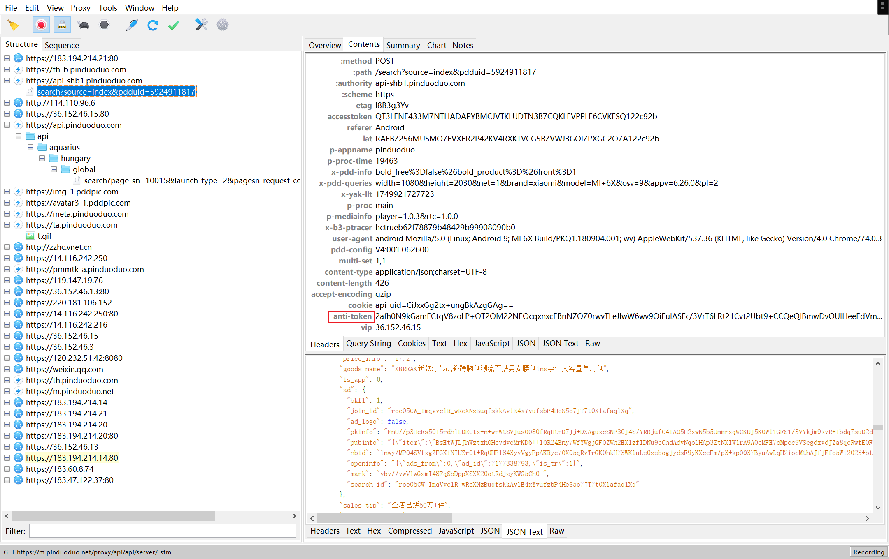

其中存在加密参数`anti-token`

使用python复现charles中的请求

```
import requests
import json


headers = {
    "Host": "api-shb1.pinduoduo.com",
    "etag": "l8B3g3Yv",
    "accesstoken": "QT3LFNF433M7NTHADAPYBMCJVTKLUDTN3B7CQKLFVPPLF6CVKFSQ122c92b",
    "referer": "Android",
    "lat": "RAEBZ256MUSMO7FVXFR2P42KV4RXKTVCG5BZVWJ3GOIZPXGC2O7A122c92b",
    "p-appname": "pinduoduo",
    "p-proc-time": "19463",
    "x-pdd-info": "bold_free%3Dfalse%26bold_product%3D%26front%3D1",
    "x-pdd-queries": "width=1080&height=2030&net=1&brand=xiaomi&model=MI+6X&osv=9&appv=6.26.0&pl=2",
    "x-yak-llt": "1749921727723",
    "p-proc": "main",
    "p-mediainfo": "player=1.0.3&rtc=1.0.0",
    "x-b3-ptracer": "hctrueb62f78879b48429b99908090b0",
    "user-agent": "android Mozilla/5.0 (Linux; Android 9; MI 6X Build/PKQ1.180904.001; wv) AppleWebKit/537.36 (KHTML, like Gecko) Version/4.0 Chrome/74.0.3729.136 Mobile Safari/537.36  phh_android_version/6.26.0 phh_android_build/43953171301671e3b3baf01f859eed5581323a9e phh_android_channel/hw pversion/0",
    "pdd-config": "V4:001.062600",
    "multi-set": "1,1",
    "content-type": "application/json;charset=UTF-8",
    "anti-token": "2afh0N9kGamECtqV8zoLP+OT2OM22NFOcqxnxcEBnNZOZ0rwvTLeJlwW6wv9OiFuIASEc/3VrT6LRt21Cvt2Ubt9+CCQeQIBmwDvOUIHeeFdVmmkspgTUnK+Q9DQ9wNTKAz2TLUM1oAZfS6HtL71VD406rZ4sCO8VUERDeCUIJeziZ3LMTOoCDYiM14JpYSZIyTXbw6xrjLbYfZBiP8XKhhw1jQfLZoeunC+PEsTu5ZH14Znias6GH5QuXS9e99P6AUOwavZ97jzDLNgU6Wdowm1r1CMHDRE/l1LFc+ZHhX6FAgvUF3D4KsBF7UJpf/+aGW+ZZzOeRGwxcwlxzQaBCZa49n8XxDUWhA7P/ArbHRvl/i6CgdYjjjC7pYm6MEgvAW0GGi0MJoZPuEhFwa3Ql6RQrjIn2j8A5c89g9tE/HvW/yH7s2FakTTO26xfflGcnn",
    "vip": "36.152.46.15"
}
cookies = {
    "api_uid": "CiJxxGg2tx+ungBkAzgGAg=="
}
url = "https://api-shb1.pinduoduo.com/search"
params = {
    "source": "index",
    "pdduid": "5924911817"
}
data = {
    "install_token": "8e4dbb47-c29b-4d04-8e83-abef8aa0a39e",
    "item_ver": "lzqq",
    "list_id": "3z3x567A",
    "track_data": "refer_page_id,10002_1749965283059_0751495763;refer_search_met_pos,0",
    "search_met": "history",
    "sort": "default",
    "source": "index",
    "is_page_init": "1",
    "q": "男士斜挎包",
    "page_sn": "10015",
    "page_id": "search_result.html",
    "size": "20",
    "requery": "0",
    "page": "1",
    "engine_version": "2.0",
    "is_new_query": "1",
    "back_search": "false"
}
data = json.dumps(data, separators=(',', ':'))
response = requests.post(url, headers=headers, cookies=cookies, params=params, data=data)

print(response.text)
print(response)
```

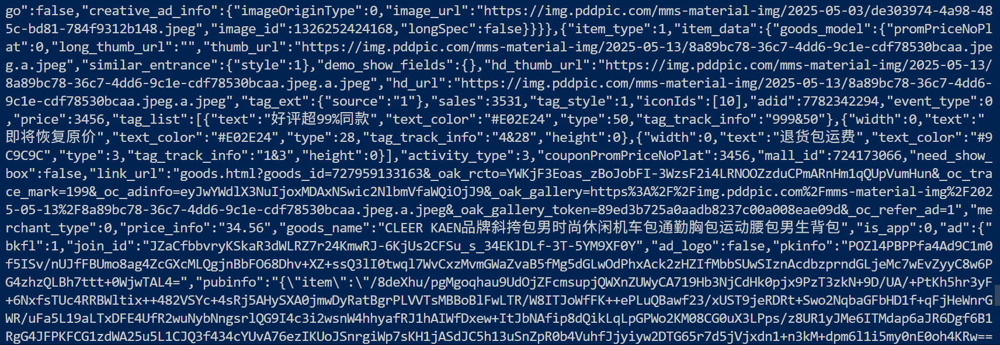

可以看到需要搜索的商品名称以明文的形式通过data传递，使用python复现的结果也没问题

### 加密参数分析

经测试确认，在缺失参数`anti-token`的情况下，无法得到正确响应。由于在`java`中`header`的构造大多使用`hashmap`，因此可以hook `hashmap`的`put`方法，当传入的参数为`anti-token`时输出调用堆栈

```
function main() {
    Java.perform(function () {
        function showStacks() {
            Java.perform(function () {
                console.log(Java.use("android.util.Log").getStackTraceString(
                    Java.use("java.lang.Throwable").$new()
                ));
            })
        }
        var hashMap = Java.use("java.util.HashMap");
        hashMap.put.implementation = function (a, b) {
            if (a == "anti-token") {
                console.log('输出-->', a, b)
                showStacks()
            }
            return this.put(a, b)
        }
    })
}

setImmediate(main);
```

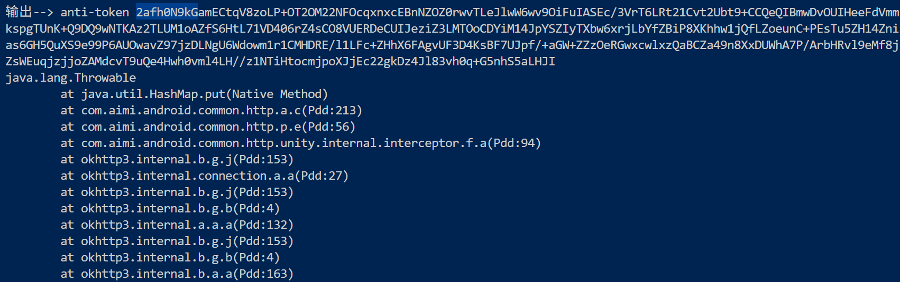

通过对比Charles的抓包结果可以定位到对应的调用堆栈  
使用jadx打开apk，搜索`anti-token`相关信息  
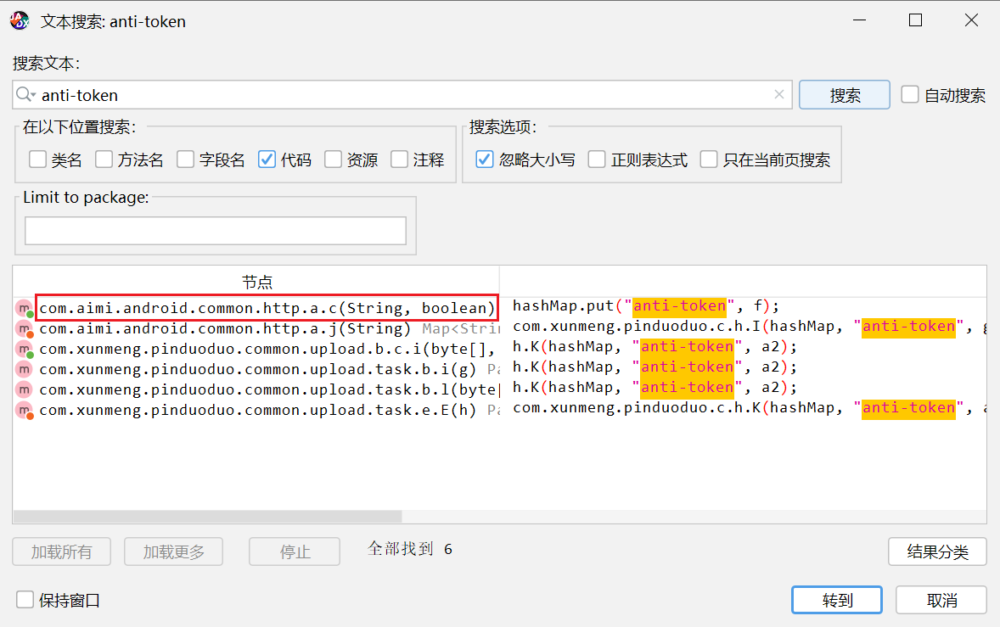  
其中存在先前打印的堆栈中的方法  
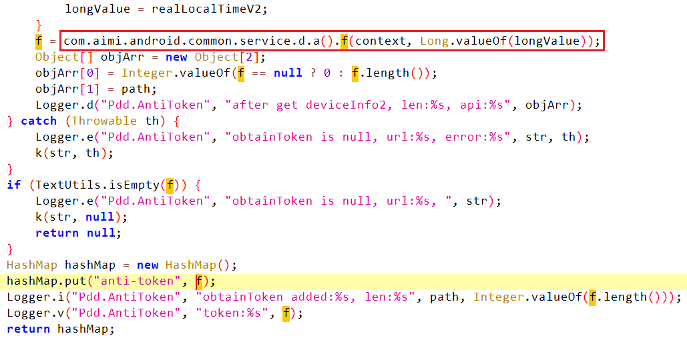  
hook该方法

```
Java.perform(function () {
    let a = Java.use("com.aimi.android.common.http.a");
    a["c"].implementation = function (str, z) {
        console.log(`a.c is called: str=${str}, z=${z}`);
        let result = this["c"](str, z);
        var it = result.keySet().iterator();
        let results = "";
        while(it.hasNext()){
            var keystr = it.next().toString();
            var valuestr = result.get(keystr).toString();
            results += keystr + ":" + valuestr + "        ";
        }
        console.log(`a.c result=${results}`);
        return result;
    };
});
```

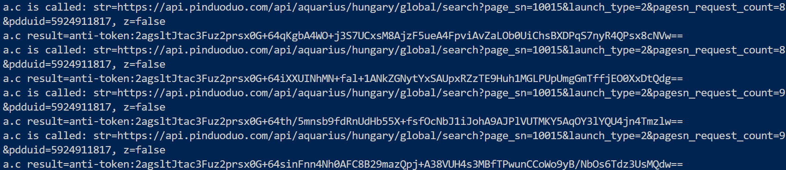

输出验证了猜想的正确性  
查看代码可知，`anti-token`的值来自于另一个方法返回的结果，但是这时如果直接双击跟进的话会发现跳转到接口的定义  
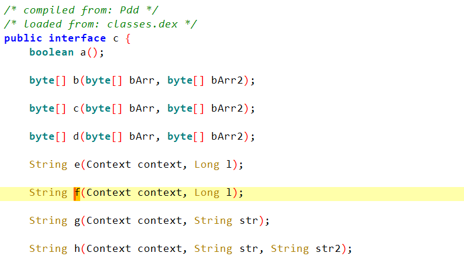  
但是我们想要的是实现该接口的类，因此直接搜索函数名称  
但是由于函数名称为`f`，会搜索到很多无关的代码，因此可以先重命名目标函数，然后再搜索

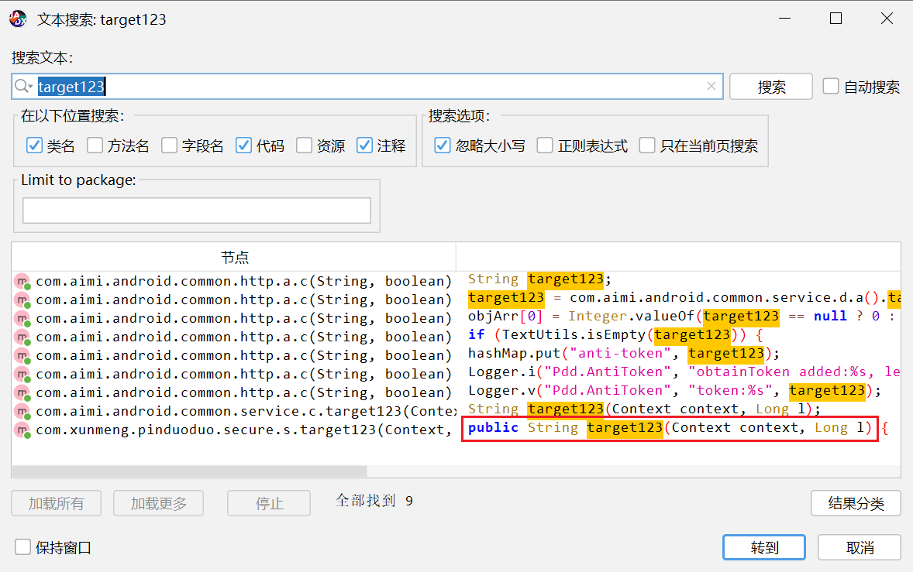

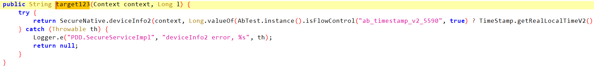

这样就找到了目标函数  
由于正常情况下只会执行`try`语句块内的代码，因此关键就在于`deviceInfo2`  
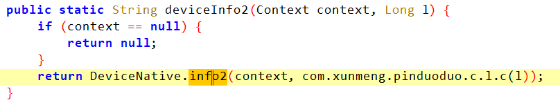  
继续跟进，发现到了native层

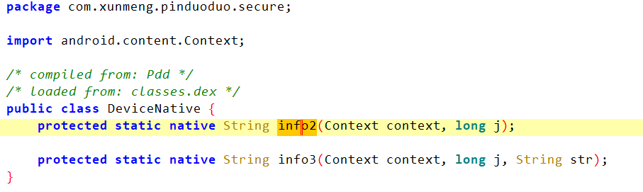

如果是以爬取数据为目的，那么可以通过RPC的方式，无需知道具体的生成逻辑，每次动态调用内部函数，然后获取返回结果，将结果作为header的参数进行请求即可；  
如果是为了分析具体的加密逻辑，那么需要先知道动态加载的so文件名称（从代码可知该so文件是动态加载的，否则so文件的名称会直接体现在代码上），然后使用IDA之类的工具分析伪C代码（或者直接看汇编）

#### RPC

以下的RPC代码是主动调用了`deviceInfo2`函数，由于该函数需要两个参数，上下文以及时间戳，为了保持一致性，代码使用Java内部的类来生成对应的参数，再将参数传递给`deviceInfo2`函数。  
通过`exports`将函数导出后，就可以在python环境中直接调用函数得到`anti-token`了

```
function hook_anti_token(){
    var result = null;
    Java.perform(function (){
            let SecureNative = Java.use("com.xunmeng.pinduoduo.secure.SecureNative");
            let BaseApplication = Java.use("com.xunmeng.pinduoduo.basekit.BaseApplication")
            var context = BaseApplication.getContext()
            let time = Java.use("com.xunmeng.pinduoduo.basekit.util.TimeStamp")
            let _ts = time.getRealLocalTime().longValue();
            let Long = Java.use("java.lang.Long");
            result = SecureNative.deviceInfo2(context, Long.valueOf(_ts));
    })
    return result
}

rpc.exports = {
    anti:hook_anti_token
}
```

```
import requests
import json

import frida


def on_message(message, data):
    print("message", message)
    print("data", data)

device = frida.get_usb_device().attach("com.xunmeng.pinduoduo")
with open('zxc.js',encoding='utf-8') as f1:
    js_code = f1.read()

script = device.create_script(js_code)
script.on("message", on_message)
script.load()

anti_token = script.exports.anti()

headers = {
    "Host": "api-shb1.pinduoduo.com",
    "etag": "l8B3g3Yv",
    "accesstoken": "QT3LFNF433M7NTHADAPYBMCJVTKLUDTN3B7CQKLFVPPLF6CVKFSQ122c92b",
    "referer": "Android",
    "lat": "RAEBZ256MUSMO7FVXFR2P42KV4RXKTVCG5BZVWJ3GOIZPXGC2O7A122c92b",
    "p-appname": "pinduoduo",
    "p-proc-time": "19463",
    "x-pdd-info": "bold_free%3Dfalse%26bold_product%3D%26front%3D1",
    "x-pdd-queries": "width=1080&height=2030&net=1&brand=xiaomi&model=MI+6X&osv=9&appv=6.26.0&pl=2",
    "x-yak-llt": "1749921727723",
    "p-proc": "main",
    "p-mediainfo": "player=1.0.3&rtc=1.0.0",
    "x-b3-ptracer": "hctrueb62f78879b48429b99908090b0",
    "user-agent": "android Mozilla/5.0 (Linux; Android 9; MI 6X Build/PKQ1.180904.001; wv) AppleWebKit/537.36 (KHTML, like Gecko) Version/4.0 Chrome/74.0.3729.136 Mobile Safari/537.36  phh_android_version/6.26.0 phh_android_build/43953171301671e3b3baf01f859eed5581323a9e phh_android_channel/hw pversion/0",
    "pdd-config": "V4:001.062600",
    "multi-set": "1,1",
    "content-type": "application/json;charset=UTF-8",
    # "anti-token": "2afh0N9kGamECtqV8zoLP+OT2OM22NFOcqxnxcEBnNZOZ0rwvTLeJlwW6wv9OiFuIASEc/3VrT6LRt21Cvt2Ubt9+CCQeQIBmwDvOUIHeeFdVmmkspgTUnK+Q9DQ9wNTKAz2TLUM1oAZfS6HtL71VD406rZ4sCO8VUERDeCUIJeziZ3LMTOoCDYiM14JpYSZIyTXbw6xrjLbYfZBiP8XKhhw1jQfLZoeunC+PEsTu5ZH14Znias6GH5QuXS9e99P6AUOwavZ97jzDLNgU6Wdowm1r1CMHDRE/l1LFc+ZHhX6FAgvUF3D4KsBF7UJpf/+aGW+ZZzOeRGwxcwlxzQaBCZa49n8XxDUWhA7P/ArbHRvl/i6CgdYjjjC7pYm6MEgvAW0GGi0MJoZPuEhFwa3Ql6RQrjIn2j8A5c89g9tE/HvW/yH7s2FakTTO26xfflGcnn",
    "anti-token": anti_token,
    "vip": "36.152.46.15"
}
cookies = {
    "api_uid": "CiJxxGg2tx+ungBkAzgGAg=="
}
url = "https://api-shb1.pinduoduo.com/search"
params = {
    "source": "index",
    "pdduid": "5924911817"
}
data = {
    "install_token": "8e4dbb47-c29b-4d04-8e83-abef8aa0a39e",
    "item_ver": "lzqq",
    "list_id": "3z3x567A",
    "track_data": "refer_page_id,10002_1749965283059_0751495763;refer_search_met_pos,0",
    "search_met": "history",
    "sort": "default",
    "source": "index",
    "is_page_init": "1",
    "q": "男士斜挎包",
    "page_sn": "10015",
    "page_id": "search_result.html",
    "size": "20",
    "requery": "0",
    "page": "1",
    "engine_version": "2.0",
    "is_new_query": "1",
    "back_search": "false"
}
data = json.dumps(data, separators=(',', ':'))
response = requests.post(url, headers=headers, cookies=cookies, params=params, data=data)

print(response.text)
print(response)
```

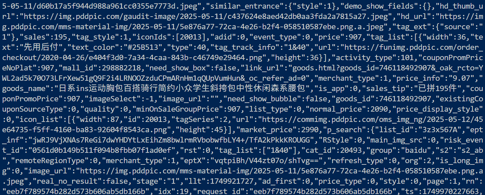

这样就实现了利用RPC发起请求

#### native

如果要分析native层代码，首先要知道动态加载so文件的名称  
为了得到so文件的名称，可以使用frida hook art层的API，在加载so文件后，调用native函数之前，在注册JNI函数时获取so文件名称

```
var addrRegisterNatives = null;
var symbols = Module.enumerateSymbolsSync("libart.so");
for (var i = 0; i < symbols.length; i++) {
    var symbol = symbols[i];
    if (symbol.name.indexOf("art") >= 0 &&
        symbol.name.indexOf("JNI") >= 0 &&
        symbol.name.indexOf("RegisterNatives") >= 0 &&
        symbol.name.indexOf("CheckJNI") < 0) {

        addrRegisterNatives = symbol.address;
        console.log("RegisterNatives is at ", symbol.address, symbol.name);
        break
    }
}

if (addrRegisterNatives) {
    Interceptor.attach(addrRegisterNatives, {
        onEnter: function (args) {
            var env = args[0];
            var java_class = args[1];
            var class_name = Java.vm.tryGetEnv().getClassName(java_class);
            var taget_class = "com.xunmeng.pinduoduo.secure.DeviceNative";
            if (class_name === taget_class) {
                //只找我们自己想要类中的动态注册关系
                console.log("
[RegisterNatives] method_count:", args[3]);
                var methods_ptr = ptr(args[2]);
                var method_count = parseInt(args[3]);
                for (var i = 0; i < method_count; i++) {
                    var name_ptr = Memory.readPointer(methods_ptr.add(i * Process.pointerSize * 3));
                    var sig_ptr = Memory.readPointer(methods_ptr.add(i * Process.pointerSize * 3 + Process.pointerSize));
                    var fnPtr_ptr = Memory.readPointer(methods_ptr.add(i * Process.pointerSize * 3 + Process.pointerSize * 2));
                    var name = Memory.readCString(name_ptr);
                    var sig = Memory.readCString(sig_ptr);
                    var find_module = Process.findModuleByAddress(fnPtr_ptr);
                    var offset = ptr(fnPtr_ptr).sub(find_module.base);
                    console.log("name:", name, "sig:", sig,'module_name:',find_module.name ,"offset:", offset);
                }
            }
        }
    });
}
```

我们分析一下这段Frida hook代码获取动态加载so文件的原理。

首先，这段代码的核心目标是拦截JNI动态注册的过程，从而获取到动态注册的native方法所在的so模块信息。其原理基于Android的JNI机制：当Java层通过System.loadLibrary加载一个so文件后，如果该so实现了JNI\_OnLoad函数，那么在这个函数中，通常会调用RegisterNatives来注册native方法（将Java中的native方法与so中的函数进行关联）。

具体步骤如下：

1. **定位RegisterNatives函数地址**：  
   代码首先遍历libart.so（Android运行时库）中的符号，寻找包含"art"、"JNI"和"RegisterNatives"但不包含"CheckJNI"的符号。这是因为在ART虚拟机中，JNI函数RegisterNatives的实现位于libart.so中，而可能有多个版本（例如CheckJNI是用于调试的版本）。找到正确的RegisterNatives函数地址后，将其保存在addrRegisterNatives变量中。
2. **拦截RegisterNatives调用**：  
   使用Frida的Interceptor.attach方法，对找到的RegisterNatives函数地址进行拦截。这意味着每当应用程序调用RegisterNatives注册native方法时，就会触发我们设置的回调函数。
3. **在回调函数中分析注册信息**：  
   当RegisterNatives被调用时，回调函数onEnter会被执行。该函数的参数args是一个数组，对应RegisterNatives函数的参数。根据JNI文档，RegisterNatives的原型为：

```

jint RegisterNatives(JNIEnv *env, jclass clazz, const JNINativeMethod *methods, jint nMethods);

```

因此，`args[0]`是JNIEnv指针，`args[1]`是目标Java类的jclass对象，`args[2]`是一个指向JNINativeMethod结构数组的指针（每个结构包含Java方法名、方法签名和对应的native函数指针），`args[3]`是注册的方法个数。

1. **获取并过滤目标类**：  
   通过`Java.vm.tryGetEnv().getClassName(java_class)`获取当前正在注册的Java类的类名。代码中设定了一个目标类名（例如"`com.xunmeng.pinduoduo.secure.DeviceNative`"），只有当当前注册的类名与目标类名匹配时，才进行后续分析。
2. **解析注册的native方法**：  
   对于目标类，代码遍历JNINativeMethod数组（长度为method\_count）。对于每个JNINativeMethod结构体，它包含三个指针大小的成员（在32位系统中每个成员4字节，64位系统中8字节）：

* 第一个成员：指向方法名字符串的指针（const char\*）
* 第二个成员：指向方法签名字符串的指针（const char\*）
* 第三个成员：指向native函数的函数指针（void\*）  
  通过Memory.readPointer依次读取这三个指针的值。然后，通过Memory.readCString读取方法名和签名字符串。

1. **定位native函数所在的so模块**：  
   关键点在于获取到native函数的地址（fnPtr\_ptr）后，使用`Process.findModuleByAddress(fnPtr_ptr)`来查找该地址所属的so模块。这个函数会遍历当前进程加载的所有模块（包括主程序和所有动态加载的so），检查给定的地址是否落在某个模块的内存范围内（即基地址到基地址+模块大小之间）。如果找到，则返回该模块的信息（包括模块名称、基地址、大小等）。
2. **计算函数在so中的偏移**：  
   由于so在内存中的加载基址每次可能不同（ASLR），但是函数在so文件中的偏移是固定的。因此，用函数的绝对地址减去模块的基地址，就得到了该函数在so文件中的偏移量。这个偏移量可以用于在IDA等静态分析工具中定位函数。

通过以上步骤，当目标类的native方法被动态注册时，我们就可以捕获到这些方法对应的native函数所在的so模块以及它们在so中的偏移量。由于动态注册发生在so被加载之后（通常在JNI\_OnLoad函数中或稍后由Java代码触发），因此即使so是动态加载的，也能在注册的时刻捕获到它。

运行结果：

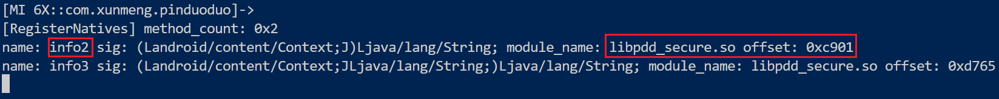

使用IDA打开该so文件，在导出函数部分找到`deviceInfo2`函数  
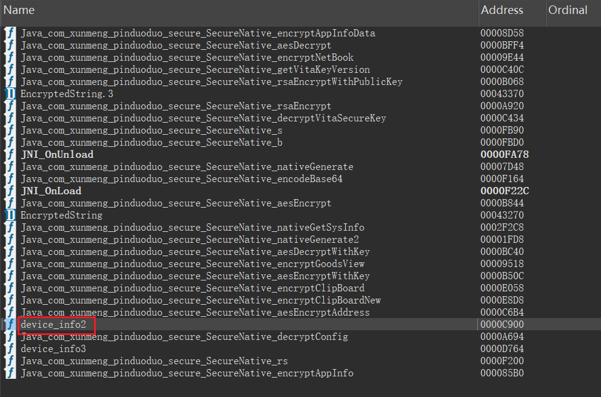  
查看代码

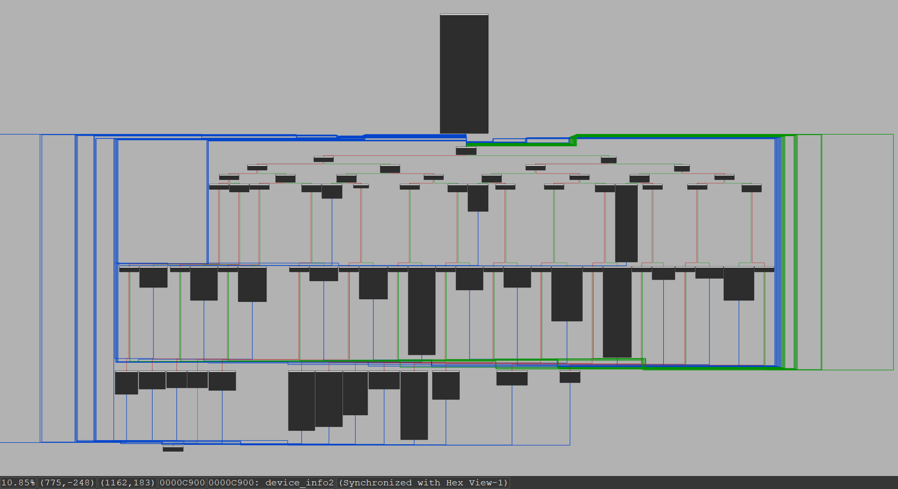  
看到了来自大厂的OLLVM，反混淆难度可想而知  
初步分析的结果是这个函数会读取设备的许多信息，然后依据这些信息和传入的时间戳生成一个不仅和时间相关也和设备信息相关的值，然后用这个值作为参数请求，但是细抠具体的逻辑的话不太现实。  
~~结束了~~
