# 某管家公章管理系统审计记录-先知社区

> **来源**: https://xz.aliyun.com/news/18260  
> **文章ID**: 18260

---

之前这套系统存在认证绕过，后面又重新看了这套代码，发现还存在另一个接口的认证绕过，首先看到有userCreate的路由，请求参数是json解析

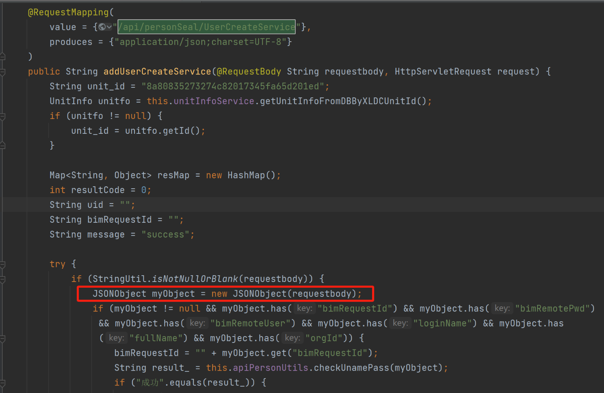

首先进入checkUnamePass方法中，这里需要bimRemoteUser为ZGJ，bimRemotePwd为123456

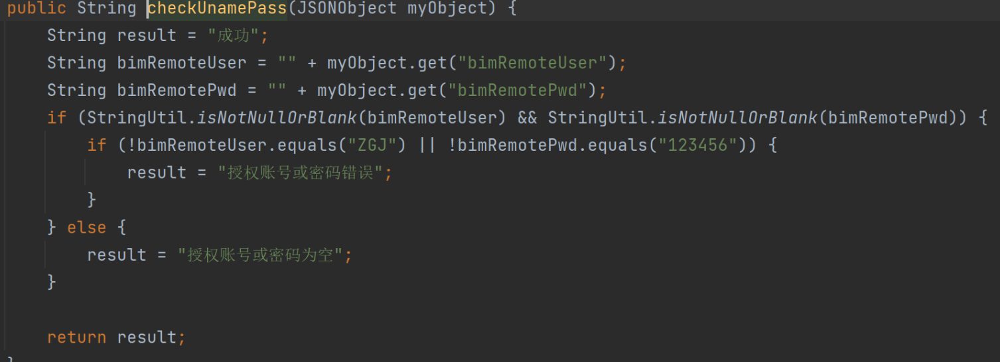

这里会将请求的参数orgId带入sql语句进行查询，必须是存在的orgId使departmentList不为空

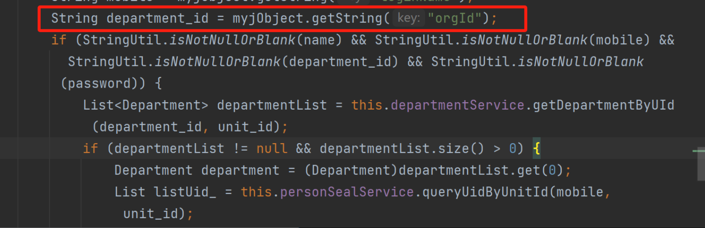

后续就是增加用户了，因此目前需要获取到存在的orgId才可以增加用户

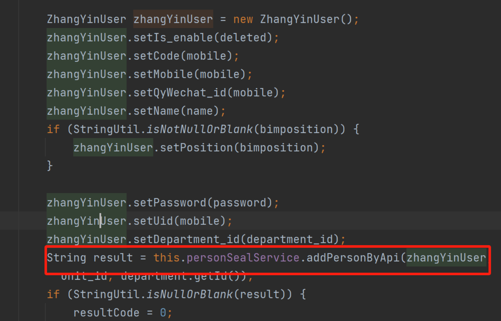

正好发现到一个接口，会返回orgId

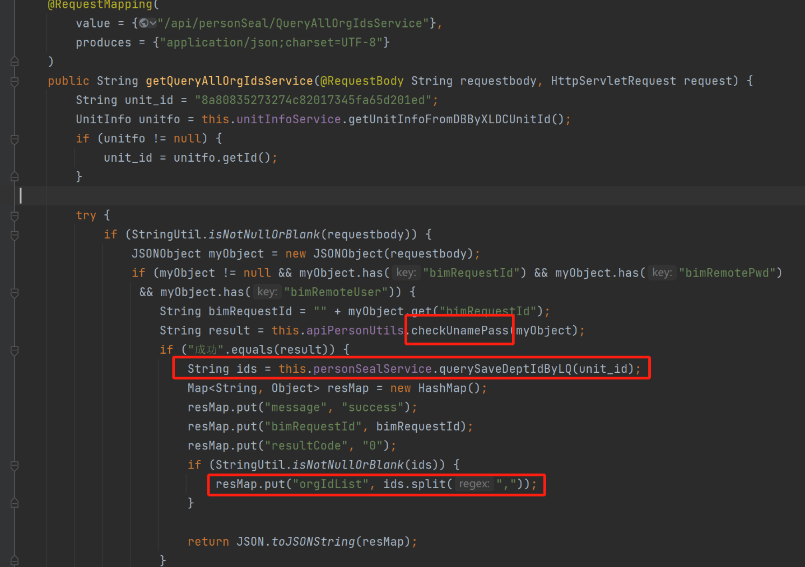

具体复现过程如下：

先发送获取orgId的请求包：

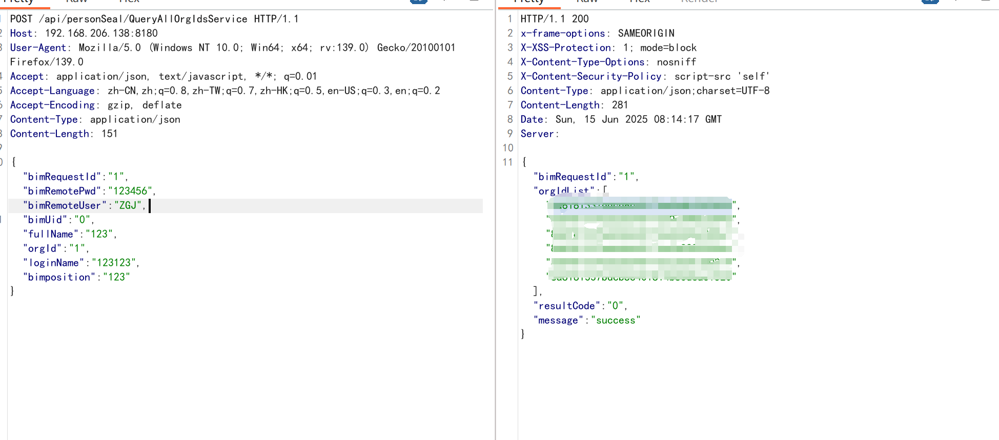

通过获取到的orgId注册新用户

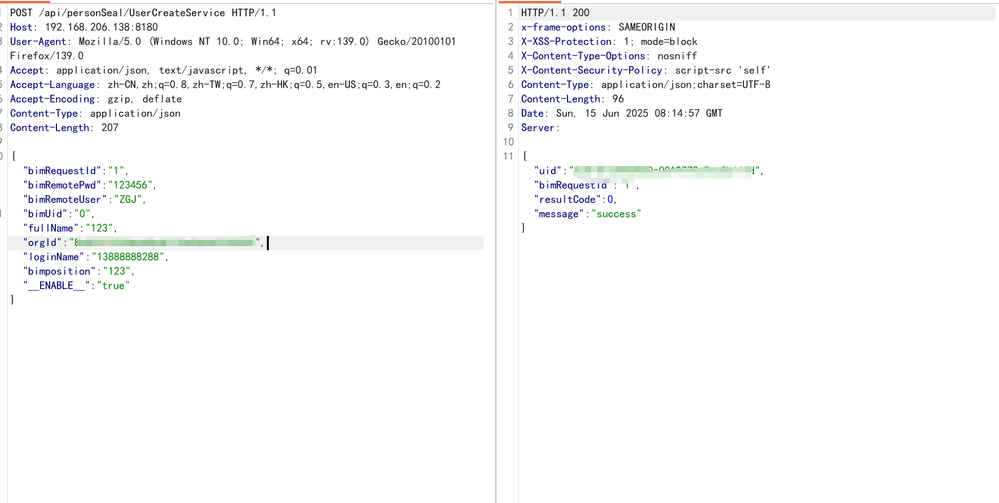

后续使用注册的用户登录系统

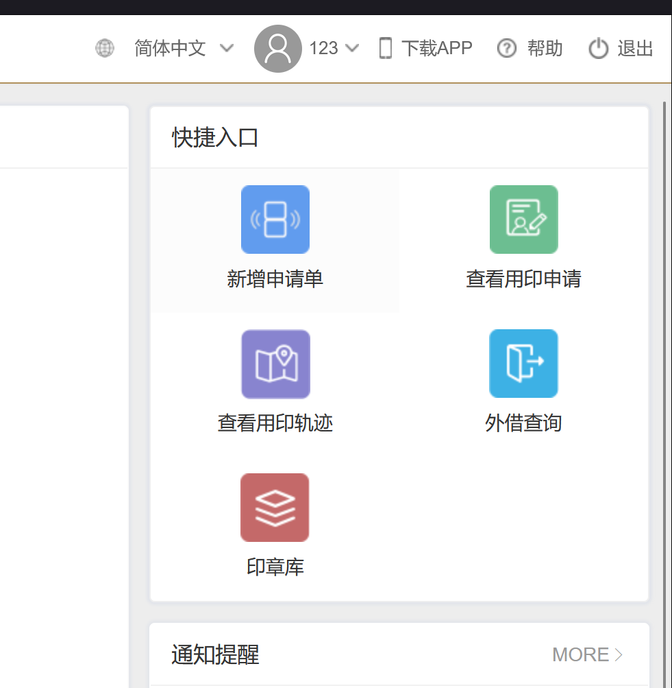

接下来就是找getshell接口了，后台的文件上传挺多的，这里找两个进行举例：

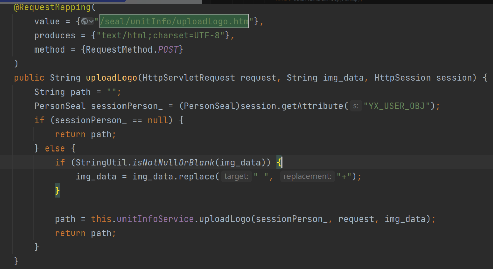

跟进uploadLogo方法中：

可以看到这里调用了Base64StrToImage.base64MutipartFile，将Base64 编码的图像字符串 转换为一个 MultipartFile 类型的对象

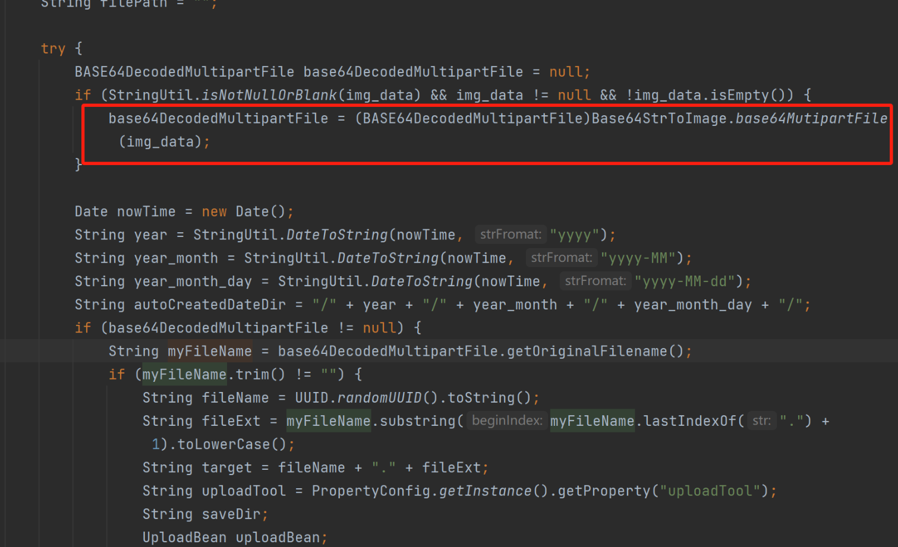

上传内容格式为：

data:image/png;base64,iVBORw0KGgoAAAANSUhEUgAA...

并且上传文件后还会放回文件具体路径：

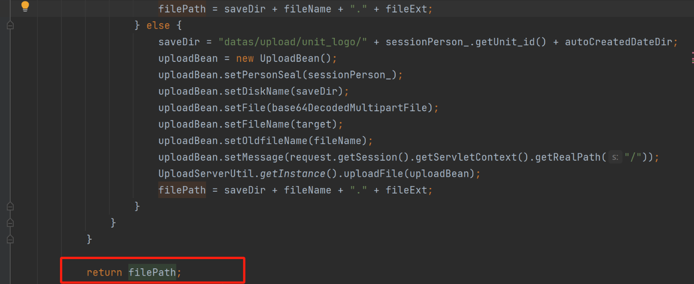

复现过程:

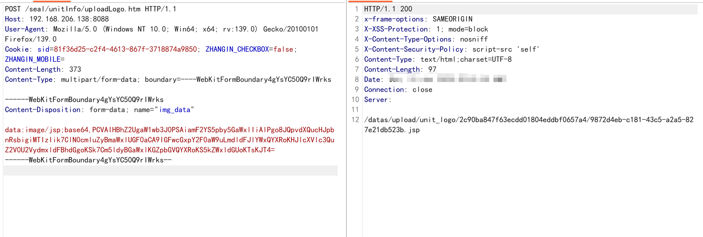

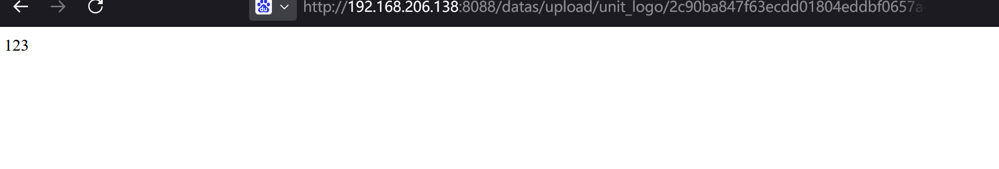

另一个上传点：

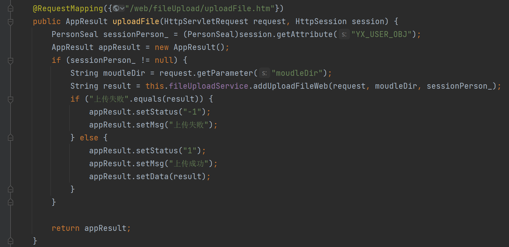

moudleDir 可以控制要上传到哪个文件夹，跟进addUploadFileWeb方法中，这里文件保存目录是moudleDir和年份月份进行拼接的，这里我传入的moudleDir为/data/upload/因此上传目录地址为：/data/upload/2022/2022-01/2022-01-11/

​

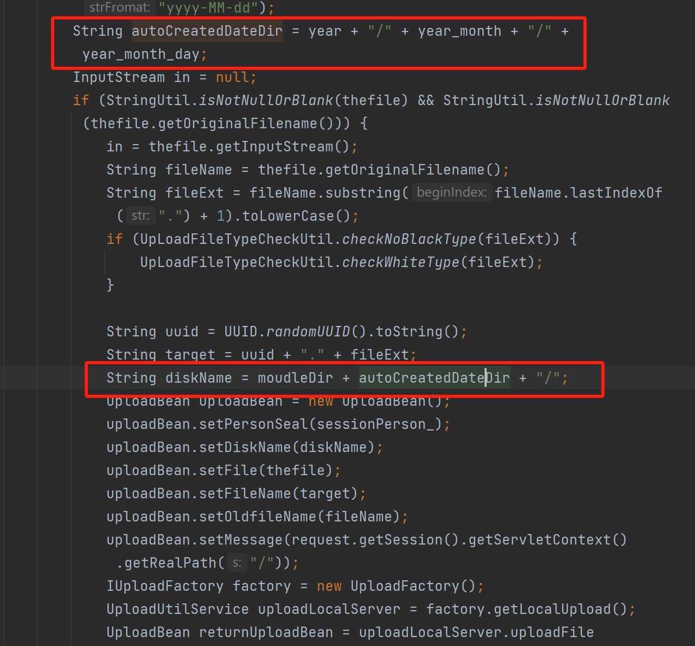

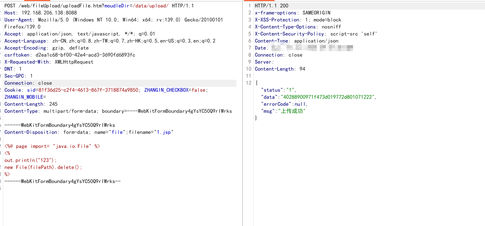

但是文件名命名为：

因此这里需要爆破文件名，UUID都为eca21ae6-61c3-4fd7-9903-93d7a0eb2166这种格式

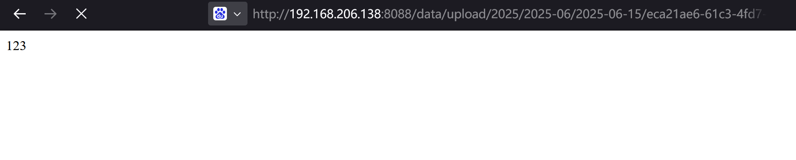
