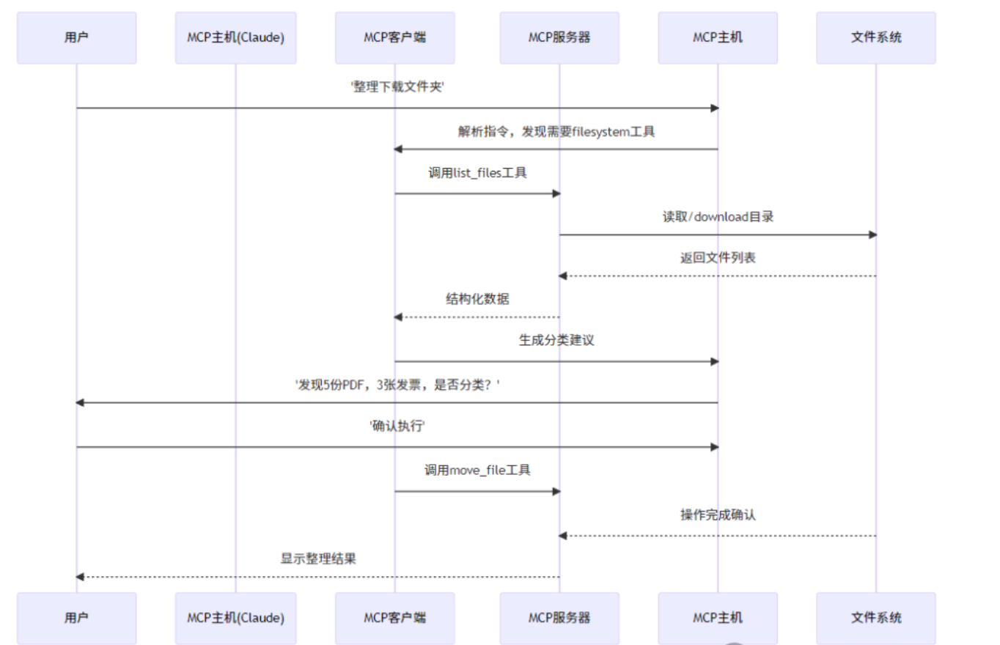
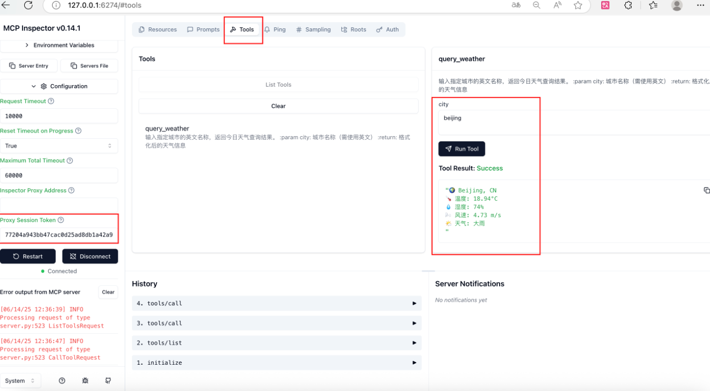
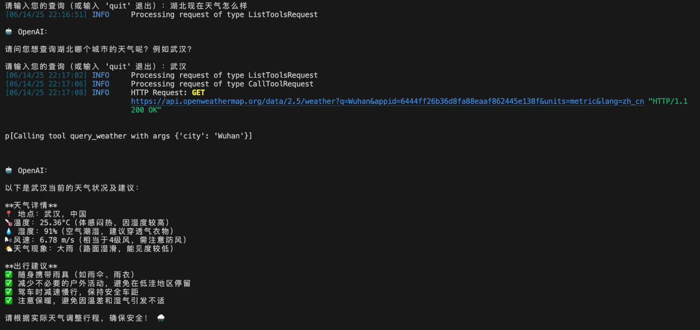
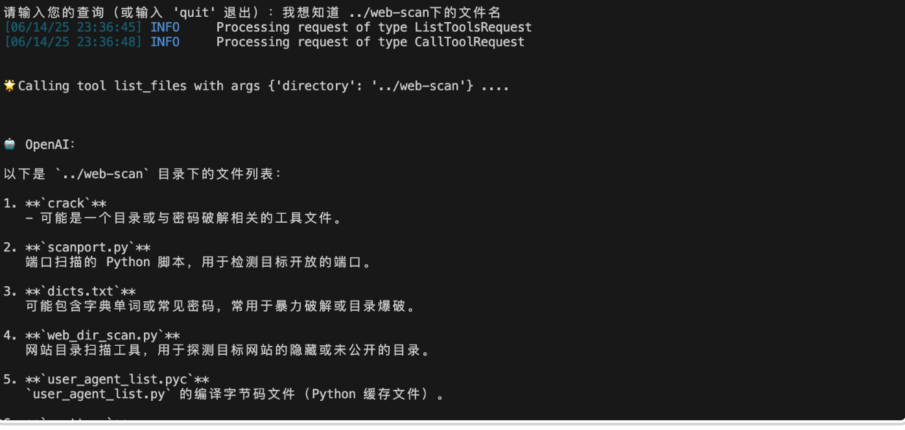
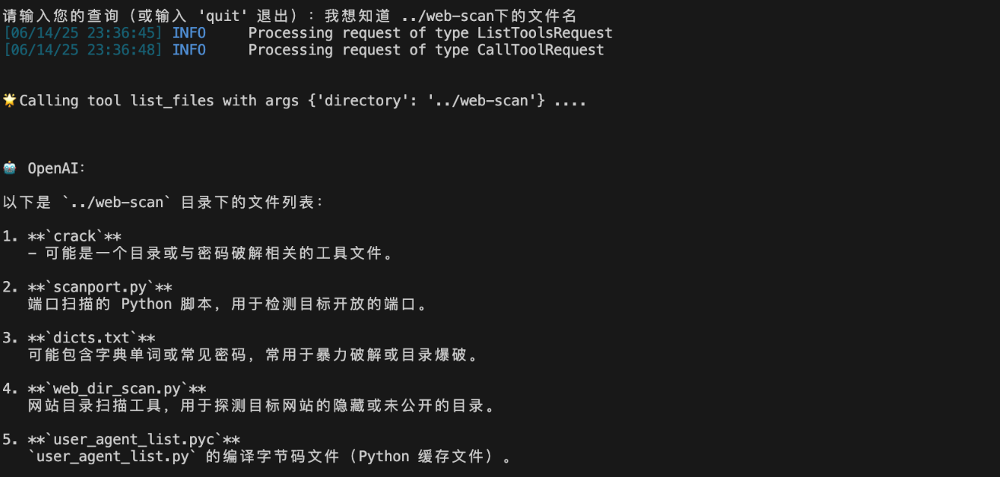
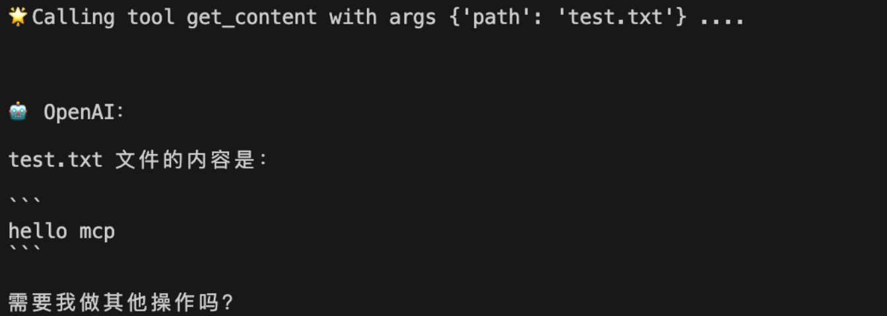

# 从0开始研究MCP应用与安全篇（一）-先知社区

> **来源**: https://xz.aliyun.com/news/18261  
> **文章ID**: 18261

---

# 引言

在互联网大厂工作中接触学习了MCP与安全的应用以及MCP本身的安全，本文为MCP应用与安全开篇，先带读者从0开始学习研究MCP底层逻辑原理，并实操开发两个MCP Server服务，从基础架构入手，探讨MCP的核心机制及安全挑战。

# MCP介绍

## MCP是什么？

MCP（Model Context Protocol）是一种开放标准协议，旨在让大型语言模型（LLM）与外部工具和数据源无缝通信。用个简单的比喻，MCP 就像是 AI 的“通用翻译器”，让它能安全、可控地访问你的文件、应用或网络服务，并执行具体任务。

## MCP 的三大核心组件

•MCP 主机：你与 AI 互动的应用程序，比如 Claude Desktop，相当于 AI 的“大本营”。

•MCP 服务器：专门的小程序，提供特定功能（如访问文件或调用 API），就像为 AI 服务的“专业导游”。

•MCP 客户端：连接主机和服务器的桥梁，确保通信顺畅，通常无需用户直接操作。

通过这种设计，MCP 让 AI 助手从单纯的对话工具，进化成能操作现实世界的强大助手。  


## CS架构

MCP 遵循客户端-服务器模型：

•宿主：启动连接的 LLM 应用程序，如 Claude Desktop 或 AI IDE。

•客户端：在宿主内部与服务器保持 1:1 连接，负责通信协调。

•服务器：为客户端提供上下文、工具和提示，执行具体任务。

## stdio和SSE通信

|  |  |  |
| --- | --- | --- |
| 特性 | stdio | SSE |
| **通信方向** | 双向（但必须轮流） | 单向（服务器→客户端） |
| **实时性** | 低（同步阻塞） | 高（异步推送） |
| **连接方式** | 进程管道 | HTTP长连接 |
| **多请求处理** | 不支持并行 | 支持多个事件流 |
| **典型场景** | 命令行工具、批处理 | Web进度更新、实时监控 |

* 需要 **简单本地调用**？ → 用 `stdio`（比如运行一个Python脚本处理数据）
* 需要 **实时状态推送**？ → 用 `sse`（比如在网页上显示训练进度）

## 消息类型

MCP 定义了四种主要消息类型：

•请求（Request）：期望响应的消息，如:`{ method: "getWeather", params: { city: "Beijing" } }`  
•通知（Notification）：单向消息，无需回应，如 `{ method: "logEvent", params: { event: "start" } }`

•结果（Result）：请求的成功响应，如 `{ temperature: 25 }`

•错误（Error）：请求失败的反馈，如 `{ code: -32602, message: "Invalid params" }`

# 为什么 MCP 有用？

•统一接口：LLM 只需理解 MCP，无需学习各种 API。

•可插拔架构：新功能只需添加 MCP 服务器。

•工作流自动化：多个服务器可串联成复杂流程。

# MCP开发

### FastMCP 天气服务项目

这个系统采用了分层架构：

* **通信层**：处理与MCP服务器的stdio通信
* **工具管理层**：管理可用的工具调用
* **AI处理层**：使用OpenAI API进行自然语言处理
* **用户交互层**：提供命令行界面

#### 环境配置

安装 uv:Python 包管理器和环境管理工具

```
curl -LsSf https://astral.sh/uv/install.sh | sh
```

创建项目目录

```
uv init mcp_server_test

cd mcp_server_test
```

创建虚拟环境并激活

```
uv venv
source .venv/bin/activate
```

安装依赖包

```
uv add "mcp[cli]" httpx requests
```

#### MCP WeatherServer编写

```
import json
import httpx
from typing import Any
from mcp.server.fastmcp import FastMCP


#OpenWeather API配置
OPENWEATHER_API="https://api.openweathermap.org/data/2.5/weather"
API_KEY=""
USER_AGENT="weather-app/1.0"
#初始化MCP服务器
mcp=FastMCP()


async def get_weather(city:str)->dict[str,Any]|None:
    """
    获取指定城市的天气信息
    :param city: 城市名称(需要英文)
    :return: 天气信息字典或None
    """
    params = {
        "q": city,
        "appid": API_KEY,
        "units": "metric",  # 使用摄氏度
        "lang": "zh_cn"  # 中文
    }
    headers={"User-Agent": USER_AGENT}

    async with httpx.AsyncClient() as client:
        try:
            response=await client.get(OPENWEATHER_API,params=params,
            headers=headers,timeout=30.0)
            response.raise_for_status()  # 检查请求是否成功
            # 解析JSON响应
            return response.json()
        except httpx.HTTPStatusError as e:
            
            return {"error":f"请求失败：{e.response.status_code} {e.response.reason_phrase}"}
        except Exception as e:
            return {"error":f"请求失败：{str(e)}"}

def format_weather(data:dict[str,Any]|str)->str:
    """
    格式化天气信息
    :param data: 天气信息字典或错误信息字符串
    :return: 格式化后的天气信息字符串
    """
    if isinstance(data, str):
        try:
            data=json.loads(data)
        except Exception as e:
            return f"数据解析错误：{str(e)}"
        
    if "error" in data:
        return f"错误：{data['error']}"

     # 提取数据时做容错处理
    city = data.get("name", "未知")
    country = data.get("sys", {}).get("country", "未知")
    temp = data.get("main", {}).get("temp", "N/A")
    humidity = data.get("main", {}).get("humidity", "N/A")
    wind_speed = data.get("wind", {}).get("speed", "N/A")
    # weather 可能为空列表，因此用 [0] 前先提供默认字典
    weather_list = data.get("weather", [{}])
    description = weather_list[0].get("description", "未知")
 
    return (
        f"🌍 {city}, {country}
"
        f"🌡 温度: {temp}°C
"
        f"💧 湿度: {humidity}%
"
        f"🌬 风速: {wind_speed} m/s
"
        f"🌤 天气: {description}
"
    )
    

@mcp.tool()
async def query_weather(city:str)->str:
    """
    查询指定城市的天气信息
    :param city: 城市名称(英文)
    :return: 格式化后的天气信息字符串
    """
    data=await get_weather(city)
    return format_weather(data)

if __name__ == "__main__":
    # 启动I/O MCP服务器
    mcp.run(transport='stdio')
```

#### MCP Inspector调试开发

`mcp dev main.py` 启动 **MCP Inspector**（Model Context Protocol Inspector），用于调试、监控或管理某种模型/协议交互的开发工具

sessiontoken填入后就可以在Tools中list tools选择server然后传参即可  


#### MCP Client开发

##### 环境配置

先安装venv的pip

```
curl https://bootstrap.pypa.io/get-pip.py -o get-pip.py
```

venv里面安装openai

```
m pip install openai
```

##### Client编写

此client连接了QWEN AI，也就相当于Ai agengt内包含一个MCP Client，运行时指定 MCP Server脚本即可启动MCP Server建立通信。当用户对话ai，然后MCP Client调用list\_tools请求MCP服务器的工具列表，根据对话内容理解调用tool，最后将tool的结果返回给大模型生成对话结果  
通过mcp，挂DeepSeek在线模型，调用服务端天气查询智能体。

完整代码如下

```
import asyncio
from typing import Optional
from contextlib import AsyncExitStack

from openai import OpenAI

from mcp import ClientSession,StdioServerParameters
from mcp.client.stdio import stdio_client
import sys


class MCPClient:
    def __init__(self):
        '''Initialize the MCPClient'''
        
        self.openai_api_key="sk-blvnnivvsysypkenyyywxaxjtageyowdviqcdzgyzgrqxarx"
        self.base_url="https://api.siliconflow.cn/v1/" 
        self.model="Qwen/Qwen3-8B"
        if not self.openai_api_key:
            raise ValueError("OpenAI API key is not set in the environment variables.")
        #创建 OpenAI 客户端实例
        self.client=OpenAI(api_key=self.openai_api_key, base_url=self.base_url) #OpenAI 类: 这是 OpenAI 官方 Python 客户端库的主要类，用于与 OpenAI 的 API 进行交互
        self.session: Optional[ClientSession]=None
        self.exit_stack=AsyncExitStack()

    
    async def connect_to_server(self,server_script_path:str):

        
        '''连接到MCP服务器并列出可用的工具'''
        is_python=server_script_path.endswith('.py')
        if_js=server_script_path.endswith('.js')
        if not (is_python or if_js):
            raise ValueError("Server script must be a Python (.py) or JavaScript (.js) file.")
        
        #确定执行命令python or node
        command="python" if is_python else "node"
        server_params=StdioServerParameters(
            command=command, 
            args=[server_script_path],
            env=None
        )

        #启动MCP服务器并建立通信
        stdio_transport=await self.exit_stack.enter_async_context(
            stdio_client(server_params)#用于创建一个标准输入/输出（stdio）的客户端传输层
        )
        self.stdio,self.write=stdio_transport
        self.session=await self.exit_stack.enter_async_context(
            ClientSession(
                self.stdio,
                self.write,
            )
        )

        await self.session.initialize()

        # 获取可用工具列表
        response=await self.session.list_tools()
        tools=response.tools
        print("
已连接到服务器，支持以下工具：",[tool.name for tool in tools])

    async def process_query(self,query:str)->str:
        '''
        使用大模型处理查询并调用可用的MCP工具（Function）
        '''
        messages=[{"role":"user","content":query}]
        response=await self.session.list_tools()

        available_tools=[{
            "type":"function",
            "function":{
                "name":tool.name,
                "description":tool.description,
                "input_schema":tool.inputSchema
            }
        }for tool in response.tools]

        response=self.client.chat.completions.create(
            model=self.model,
            messages=messages,
            tools=available_tools
        )

        #处理返回内容
        content=response.choices[0]
        if content.finish_reason=="tool_calls":
            #如果是需要使用工具，就解析工具
            tool_call=content.message.tool_calls[0]
            tool_name=tool_call.function.name
            tool_args=json.loads(tool_call.function.arguments)
        
            #执行工具
            result=await self.session.call_tool(tool_name,tool_args)
            print(f"

🌟Calling tool {tool_name} with args {tool_args} ....

")

            #将模型返回的调用的tool和tool执行后的数据存入
            messages.append(content.message.model_dump())
            messages.append({
                "role":"tool",
                "content":result.content[0].text,
                "tool_call_id":tool_call.id
            })

            #将上面结果返回给大模型用于生产最终的结果
            response=self.client.chat.completions.create(
                model=self.model,
                messages=messages
            )
            return response.choices[0].message.content
        return content.message.content

    async def chat_loop(self):
        ''''运行交互式聊天循环'''
        print("
🤖 MCP客户端已启动！输入 'quit' 退出")

        while True:
            try:
                query= input("
请输入您的查询（或输入 'quit' 退出）：")
                if query.lower() == 'quit':
                    print("退出聊天...")
                    break
                response=await self.process_query(query)
                print(f"
🤖 OpenAI：{response}")
            except Exception as e:
                print(f"发生错误：{str(e)}")

    async def close(self):
        '''关闭MCP客户端'''
        await self.exit_stack.aclose()
        print("MCP客户端已关闭。")
    
async def main():
    if len(sys.argv) < 2:
        print("🌟 Usage: python client.py <path_to_server_srcipt>")
        sys.exit(1)
    client=MCPClient()
    try:
        await client.connect_to_server(sys.argv[1])
        await client.chat_loop()
    finally:
        await client.close()
if __name__ == "__main__":
    import sys
    asyncio.run(main())
```

OpenAI 类是 OpenAI 官方 Python 客户端库的主要类，用于与 OpenAI 的 API 进行交互

```
self.client=OpenAI(api_key=self.openai_api_key, base_url=self.base_url)
```

声明可选的 ClientSession

```
self.session: Optional[ClientSession] = None
```

* `ClientSession`: 来自 `aiohttp` 库的类，用于管理 HTTP 客户端会话，通常在异步编程中使用。
* `Optional`: 表示这个变量可以是 `ClientSession` 类型，也可以是 `None`。

```
self.exit_stack = AsyncExitStack()
```

* `AsyncExitStack`: 来自 `contextlib` 模块，用于管理异步上下文管理器的工具。它可以帮助你在一个地方集中管理多个需要异步清理的资源。

这段代码向 AI发送请求，并允许模型选择是否调用外部工具（Tools）。返回的 `response` 包含模型的回复，可能包含

```
response = self.client.chat.completions.create(
    model=self.model,
    messages=messages,
    tools=available_tools
)
```

* **普通文本回复**（如果模型决定直接回答）。
* **工具调用请求**（如果模型决定调用某个工具，如查询天气、执行计算等）。

messages作用：提供对话历史，让模型理解上下文。

* `role` 可以是：

* `"system"`（系统提示，设定 AI 的行为）
* `"user"`（用户消息）
* `"assistant"`（AI 的回复）
* `"tool"`（工具调用的返回结果）

tools作用：定义可用的工具（函数），让模型决定是否调用它们。

* **格式**：

```
    available_tools = [
        {
            "type": "function",
            "function": {
                "name": "get_weather",
                "description": "获取某个城市的天气",
                "input_schema":tool.inputSchema
            }
        }
    ]
```

```
- `name`：工具名称（模型调用时使用）。
- `description`：工具描述（帮助模型决定是否调用）。
- `input_schema`：定义工具需要的参数（JSON Schema 格式）。
```

获取模型返回的 `choices[0]`

```
content = response.choices[0]
```

* `response` 是 OpenAI API 返回的响应对象。
* `response.choices[0]` 是模型生成的主要回复（通常只有一个 `choice`，除非指定 `n > 1`）。
* `content` 现在包含：

* `"stop"`：模型正常结束，返回了文本回复。
* `"tool_calls"`：模型决定调用外部工具（需要解析工具信息）。
* `"length"`：因达到 `max_tokens` 限制而停止。
* `"content_filter"`：因内容过滤被拦截。

tool\_call 是第一个工具调用的详细信息，结构如下：

```
    {
        "id": "call_123",  # 工具调用的唯一 ID
        "type": "function",
        "function": {
            "name": "get_weather",  # 工具名称
            "arguments": "{"location": "北京"}"  # 工具参数的 JSON 字符串
        }
    }
```

#### 运行测试

能够循环对话，将用户要求转换为MCP Server的参数，拿到天气数据再喂给AI成果输出自然语言  


## MCP文件系统

MCP Server有读取、写入、列目录功能

```
from typing import Any
from mcp.server.fastmcp import FastMCP
from openai import OpenAI
import os


#初始化MCP服务器
mcp=FastMCP()

@mcp.tool("get_content")
async def get_content(path:str)->dict[str,Any]|None:
    """
    获取指定路径的内容
    :param path: 文件路径
    :return: 文件内容字典或None
    """
    try:
        with open(path, 'r', encoding='utf-8') as file:
            content = file.read()
        return {"content": content}
    except FileNotFoundError:
        return {"error": "文件未找到"}
    except Exception as e:
        return {"error": f"读取文件失败：{str(e)}"}

@mcp.tool("write_content")
async def write_content(path:str, content:str)->dict[str,Any]|None:
    """
    写入内容到指定路径的文件
    :param path: 文件路径
    :param content: 要写入的内容
    :return: 成功或错误信息字典
    """
    try:
        with open(path, 'w', encoding='utf-8') as file:
            file.write(content)
        return {"message": "内容写入成功"}
    except Exception as e:
        return {"error": f"写入文件失败：{str(e)}"}

@mcp.tool("list_files")
async def list_files(directory:str)->dict[str,Any]|None:
    """
    列出指定目录下的所有文件
    :param directory: 目录路径
    :return: 文件列表字典或错误信息字典
    """
    try:
        files = os.listdir(directory)
        return {"files": files}
    except FileNotFoundError:
        return {"error": "目录未找到"}
    except Exception as e:
        return {"error": f"列出文件失败：{str(e)}"}

if __name__ == "__main__":
    mcp.run(transport='stdio')
```

### 测试结果

列出项目文件并解释  
  
将文件内容写入文件  
  
查看文件内容  


# 安全问题

MCP（Model Context Protocol作为连接AI与外部系统的开放协议，其应用潜力巨大，但同时也面临安全风险。

MCP的核心架构采用客户端-服务器模型，通过标准化的JSON消息实现AI与工具间的通信。例如，当用户请求“查询北京天气”时，MCP客户端将结构化请求转发至天气服务器，返回数据经AI处理后生成自然语言回复。这一流程依赖**stdio（同步）**和**SSE（异步）**两种通信模式，分别适用于本地脚本调用和实时数据推送。然而，这种开放性也带来安全隐患：

1. **输入验证风险**

* 恶意构造的请求（如路径遍历**../../../etc/passwd**）可能使文件操作类服务器泄露敏感数据。

2. **权限管控缺失**

* 默认情况下，MCP服务器可能以当前用户权限运行，若AI被诱导调用危险命令（如**rm -rf**），将导致系统破坏。

3. **数据泄露与滥用**

* 第三方工具服务器若未加密通信，可能被中间人攻击窃取API密钥或用户隐私。

实验表明，一个未经验证的MCP文件服务器可被利用读取系统文件，而天气查询服务若未限制请求频率，可能成为DDoS攻击的跳板。后续研究将深入探讨**沙箱隔离**、**OAuth2.0集成**等防护方案，为构建安全可靠的MCP生态奠定基础。
