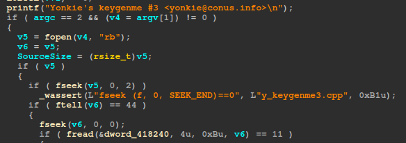
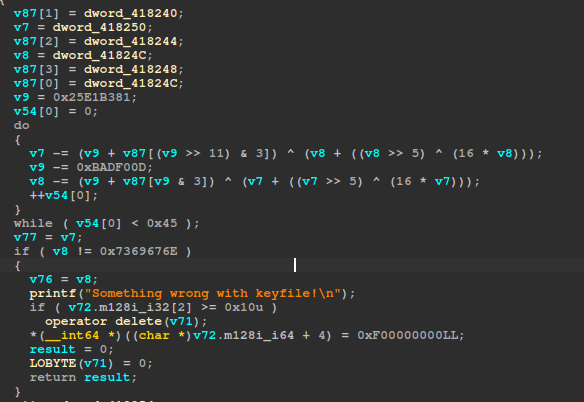
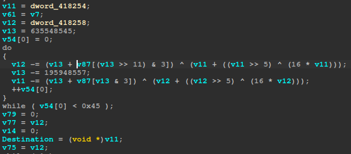
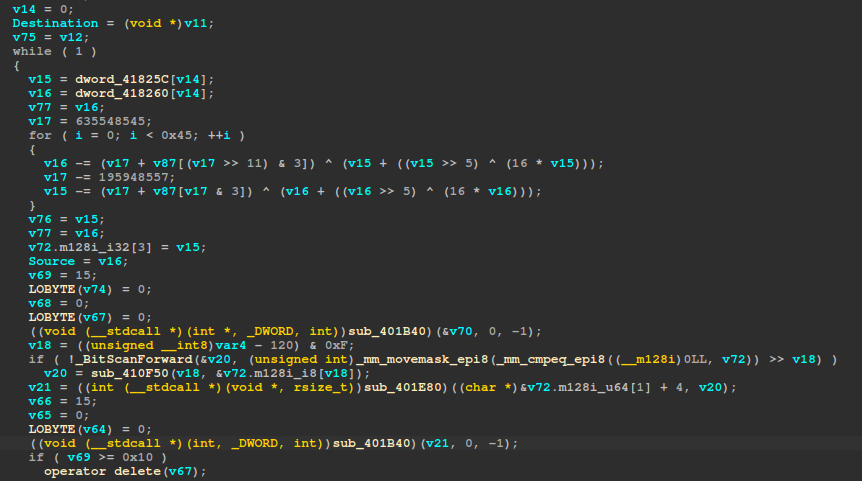
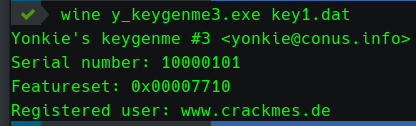
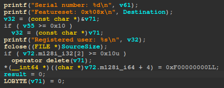
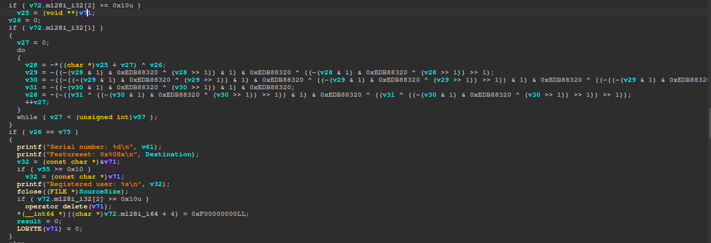

# yonkies_keygenme_3 writeup 及代码复用（编译/链接进代码）的技巧-先知社区

> **来源**: https://xz.aliyun.com/news/18266  
> **文章ID**: 18266

---

```
Coder name: Yonkie
Coded in: C/C++
Difficulty level: 3 - Getting harder
Crack-me URL: https://crackmes.one/crackme/5ab77f6233c5d40ad448c9e6
Platform: Multiplatform (Windows)
```

这题遇到一个不熟悉的算法（其实主要是熟悉的也没几个），XTEA的变型算法。使用PEiD很容易确定存在CRC32算法。0xEDB88320 也是CRC32算法典型的常数，根据这个常数可以很容易确定CRC32算法的位置。

## 一、验证逻辑分析



主函数一开始打开`key file`文件，可以看出，注册文件必须是44个字节，由11个DWORD类型数据组成，读入到了地址`dword_418240`处。



图中`do`循环是一个变型的XTEA解密算法，常数 0x25E1B381， 0xBADF00D，key的选择方式，以及循环次数 0x45，和标准XTEA算法不同。不过仍然要遵循 0x25E1B381 减去 0xBADF00D 循环减 0x45 次，结果为 0。

> ### 补充一个标准的XTEA加密算法：
>
> **Algorithm Description (Simplified):**
>
> The XTEA encryption process involves the following steps:
>
> 1. **Initialization:** The 64-bit plaintext block is divided into two 32-bit words, `V0` and `V1`. The 128-bit key is split into four 32-bit subkeys, `K[0]`, `K[1]`, `K[2]`, and `K[3]`.
> 2. **Rounds:** The core of the algorithm consists of 64 rounds. Each round applies a transformation to `V0` and `V1` based on the round number and the subkeys. A simplified representation of a single round is:

```
sum += delta;
V0 += ((V1 << 4) + K[0]) ^ (V1 + sum) ^ ((V1 >>> 5) + K[1]);
V1 += ((V0 << 4) + K[2]) ^ (V0 + sum) ^ ((V0 >>> 5) + K[3]);
```

> where:

* sum initialized with 0.

* `delta` is a magic constant (0x9E3779B9) used to ensure good diffusion and prevent symmetry.
* `<<` and `>>` represent left and right bit shifts, respectively.
* `^` represents the bitwise XOR operation.

3. **Output:** After 64 rounds, `V0` and `V1` are concatenated to form the 64-bit ciphertext.

实际上不知道XTEA算法，有足够的耐心，也是比较容易写出这个算法的逆算法的，需要明确哪一个是解密，哪一个是加密。64位的密文分割成两个32位，这个先后顺序很容易在加解密的时候搞乱。我从头到尾被搞的稀里糊涂的，反正算法写出来后，运行看看结果，调整一下顺序，总是可以试出来的。

知道是XTEA算法，那么`dword_418240`处读入的就是密钥，但有重排 `key[0] = dword_418240[3]`。图中的 `v7`、`v8` 就是需要解密的密文。

`v7 = dword_418240[4]` 这个没啥问题。`v8 = dword_418240[3]` 这个就比较诡异了。`dword_418240[3]` 是XTEA算法Key的第一部分key[0]。这里同时又是密文的一部分。这实际上要求明文加密后得到的密文，其中一部分和密钥的key[0]相同。这个trick就是本题最有意思的地方，也是写keygen的难点。先不管这些，把验证逻辑捋完。

第一波XTEA解密后`dword_418240[3]`（也就是图中变量`v8`）对应的明文必须是`0x7369676E`，这实际上是字符串`sign`。验证的第一个标识。

`dword_418240[4]`（也就是图中变量`v7`）对应的是啥还不知道，看下图只知道赋值给了变量`v61`。



第二波XTEA解密（见上图）`v11 = dword_418240[5]`和`v12 = dword_418240[6]`。具体用途目前还不明朗，图中知道`v11`赋值给了`Destination`，`v12`最终赋值给了`v75`。



第三波XTEA解密是一个无限循环。从`dword_41825c`开始，每两个DWORD进行一次解密。后面跟着一群C++的字符串操作。这里就需要使用神操作——猜！

当然也不是无根据的瞎猜。题目给了3个key文件作为参考：



上图是`key1.dat`的输出结果，里面的提示字符串给逆向提供了很好的提示。看看输出字符串的位置，就在上面的循环代码下面不远处：



通过比对输出的变量，可以知道第一波XTEA解密`v61 = dword_418240[4]`对应`Serial number`。

第二波XTEA解密出来的`Destination = v11 = dword_418240[5]`对应`Features`。另一个暂时还不知道用处，先别管。对比一下程序的输出，也就只剩下`Registered user`这个选项了。

让我们来捋一捋`key`文件：开头4个DWORD是XTEA算法的KEY；其中 KEY[0] 对应`sign`标志，第五个DWORD对应`Serial number`，第六个DWORD对应`Features`，第七个DWORD对应的暂时不清楚。一共11个DWORD，经过两轮XTEA后，还剩下4个DWORD。4个DWORD一共16个字节，参考程序输出的用户名`www.crackmes.de`这都15个字节了，实际上如果仔细分析用户名的输出，最后还有一个空格，正好16个字节。通过比对`key2.dat`和`key3.dat`的输出，用户名实际上都用空格补足了16个字节。这意味着用户名并不是C字符串，而是固定的16个字节。

根据分析，可以大胆猜测，上面我们看不明白的循环里面的XTEA，应该就是解密用户名了，XTEA一次解密两个DWORD，循环2次。XTEA后面的复杂操作，应该就是字符串组合成完整的用户名。

那么上面第二波XTEA剩下的`v75 = v12 = dword_418240[6]`到底有什么作用呢？



图中可以看出`v75`被用于了与`v26`比较，相等的话输出正确内容。而`v26`是`do`循环计算出来的，根据一开始的扫描和特定的常数，我们知道这是一段CRC32算法。图中`v71`根据输出代码可以知道是用户名无疑了。那么这段CRC32计算的应该就是用户名的CRC32校验值。那么也就确认了`v75 = v12 = dword_418240[6]`就是解密的用户名的CRC32校验值，用来进行比对的。

### 至此，基本确定了`key`文件的结构和各个部分的含义。归纳如下：

|  |  |  |
| --- | --- | --- |
| dword\_418240[0] | XTEA key[1] |  |
| dword\_418240[1] | XTEA key[2] |  |
| dword\_418240[2] | XTEA key[3] |  |
| dword\_418240[3] | XTEA key[0] | 字符串`sign`的密文 |
| dword\_418240[4] |  | Serial Number 的密文 |
| dword\_418240[5] |  | Feature 的密文 |
| dword\_418240[6] |  | 用户名的 CRC32 校验值的密文 |
| dword\_418240[7] |  | 用户名密文 part1 |
| dword\_418240[8] |  | 用户名密文 part2 |
| dword\_418240[9] |  | 用户名密文 part3 |
| dword\_418240[10] |  | 用户名密文 part4 |

### 相应的程序的验证流程如下：

* 读入11个DWORD数据到内存地址`dword_418240`
* 重排XTEA算法的KEY
* 解密`dword_418240[3]`和`dword_418240[4]`

* check `dword_418240[3]` 的明文为字符串`sign`
* `dword_418240[4]`为Serial Number。
* 需要强调的是`dword_418240[3]` 本身是XTEA算法KEY的前32位。KEY的前32位解密出来要等于`sign`，这个限制是本题最大的trick。

* 解密`dword_418240[5]`和`dword_418240[6]`

* `dword_418240[5]`解密后对应Feature。
* `dword_418240[6]`解密后是用户名的CRC32校验值

* 解密`dword_418240[7]`到`dword_418240[10]`
* 计算用户名的CRC32值，并与前面解密的值进行比对。校验成功，完成注册文件解析，输出结果。

## 二、Keygen实现

根据上面的逻辑分析，可以按照以下步骤实现keygen（由于存在trick需要暴力，所以使用C语言）：

### 1. 根据程序中魔改的XTEA，写出相应的加解密函数。

```
DWORD xtea_encrypt(DWORD *key, DWORD *v)
{
    DWORD sum = 0;
    DWORD delta = 0xbadf00d;
    for(int i=0; i<0x45; i++)
    {
        v[1] += (sum + key[sum & 3]) ^ (v[0] + ((v[0] >> 5) ^ (v[0] << 4)));
        sum += delta;
        v[0] += (sum + key[(sum >> 11) & 3]) ^ (v[1] + ((v[1] >> 5) ^ (v[1] << 4)));
    }

    return v[1];	// 加密函数返回 v[1] 是为了暴力的时候方便。
}

void xtea_decrypt(DWORD *key, DWORD *v)
{
    DWORD sum = 0x25E1B381;
    DWORD delta = 0xbadf00d;
    for(int i=0; i<0x45; i++)
    {
        v[0] -= (sum + key[(sum >> 11) & 3]) ^ (v[1] + ((v[1] >> 5) ^ (v[1] << 4)));
        sum -= delta;
        v[1] -= (sum + key[sum & 3]) ^ (v[0] + ((v[0] >> 5) ^ (v[0] << 4)));
    }

    return;
}
```

基本根据IDA的F5插件还原的伪C代码改改就可以。加密过程就是解密过程的逆序。需要注意的是密文和明文的两个DWORD的顺序，这里是相反的。后面应用的时候会搞乱，多尝试交换一下顺序。

### 2. 解决trick，暴力查找一组满足要求的KEY。

第一组加密的是字符串`sign`和`Serial Number`。`Serial Number`是我们可以任意指定的，而`sign`加密后必须等于KEY[0]。由于XTEA算法的加密结果和两个明文DWORD都相关，改变`Serial Number`，就算KEY不变，`sign`的加密结果也会变化。因为`Serial Number`是用户指定，在给定KEY的情况下暴力`Serial Number`去凑`sign`的加密结果等于KEY[0]（很可能无解），是没有意义的。那么只有在给定`sign`和`Serial Number`的情况下，去暴力出一组KEY来满足条件了。

暴力KEY想法很没美好，但问题是XTEA的KEY是128位的，这个看起来暴力查找是一件不可能完成的任务。我最初的想法是固定KEY[1]、KEY[2]、KEY[3]，然后暴力KEY[0]，结果发现基本无解，特别是`KEY[1] = KEY[2] = KEY[3] = 0`的时候。

看了大佬的KEYGEN——随机KEY[0]、KEY[1]、KEY[3]，暴力KEY[2]；如果无解，再随机一下KEY[0]，重新暴力KEY[2]；如此循环直到找到一组解。

深受启发，还能这么玩！！！

个人认为使用大佬的思路，暴力其中任何一个应该都是等价的。我选择随机KEY[1]、KEY[2]、KEY[3]，暴力KEY[0]；无解的话再随机一次KEY[2]，重新暴力KEY[0]；直到找到一组解。

由于我的国产海光x86 CPU可以并行16个线程，所以暴力KEY[0]的时候，直接根据线程号，设置KEY[0]的最高4位，这样可以显著减少一轮中暴力的次数。

```
void* tFunc(void* args)
{
    DWORD key0 = ((DWORD) args) << 28;
    ......
}
```

### 3. CRC32代码复用

解决了最大的trick，后面的步骤相对简单，主要就是解决CRC32的计算问题。可以找一个CRC32的代码编译。国内网络内容也是千奇百怪，曾经逆向过某个软件的hash算法就是CRC32，而且用的是查表法，网上找了几个复制下来，编译后计算结果就是不对。最靠谱的还是复用目标程序里的代码。

```
; nasm -f elf -g -o crc32.o crc32.asm
; gcc -m32 -o keygen keygen.c crc32.o

; make the add function visible to the linker
; section .text
global crc32

arg equ 4

crc32:
    mov ecx, [esp + arg]	; get arg, add manually
    xor eax, eax
    xor edx, edx	; add manually
loc_loop:
    movsx esi,byte [eax+ecx]
    not esi                         
    xor edx,esi                     
    mov edi,edx                     
    shr edi,1                       
    and edx,1                       
    neg edx                         
    and edx,0xEDB88320                
    xor edi,edx                     
    mov edx,edi                     
    shr edx,1                       
    and edi,1                       
    neg edi                         
    and edi,0xEDB88320                
    xor edx,edi                     
    mov esi,edx                     
    shr esi,1                       
    and edx,1                       
    neg edx                         
    and edx,0xEDB88320                
    xor esi,edx                     
    mov edi,esi                     
    shr edi,1                       
    and esi,1                       
    neg esi                         
    and esi,0xEDB88320                
    xor edi,esi                     
    mov edx,edi                     
    shr edx,1                       
    and edi,1                       
    neg edi                         
    and edi,0xEDB88320                
    xor edx,edi                     
    mov esi,edx                     
    shr esi,1                       
    and edx,1                       
    neg edx                         
    and edx,0xEDB88320                
    xor esi,edx                     
    mov edi,esi                     
    shr edi,1                       
    and esi,1                       
    neg esi                         
    and esi,0xEDB88320                
    xor edi,esi                     
    mov edx,edi                     
    shr edx,1                       
    and edi,1                       
    neg edi                         
    and edi,0xEDB88320                
    xor edx,edi                     
    not edx                         
    inc eax                         
    cmp eax, 16                     
    jb loc_loop  
    mov eax, edx	; return value, add manually
    ret				; add manually
```

程序中crc32的代码只涉及寄存器运算，可以直接复制使用。但需要封装成一个函数，加上参数获取、初始化，以及设置返回值等等就可以了。可以使用下面语句编译成`.o`，最终编译进keygen代码中即可。

```
nasm -f elf -g -o crc32.o crc32.asm
```

### 4. 完整的keygen

```
#include <stdio.h>
#include <stdlib.h>
#include <time.h>
#include <pthread.h>
#include <string.h>

// #define DEBUG

typedef unsigned int DWORD;

extern DWORD crc32(char* name);

pthread_mutex_t mutex = PTHREAD_MUTEX_INITIALIZER;
DWORD gKey[4], gSerial, gFound;

DWORD xtea_encrypt(DWORD *key, DWORD *v)
{
    DWORD sum = 0;
    DWORD delta = 0xbadf00d;
    for(int i=0; i<0x45; i++)
    {
        v[1] += (sum + key[sum & 3]) ^ (v[0] + ((v[0] >> 5) ^ (v[0] << 4)));
        sum += delta;
        v[0] += (sum + key[(sum >> 11) & 3]) ^ (v[1] + ((v[1] >> 5) ^ (v[1] << 4)));
    }

    return v[1];
}

void xtea_decrypt(DWORD *key, DWORD *v)
{
    DWORD sum = 0x25E1B381;
    DWORD delta = 0xbadf00d;
    for(int i=0; i<0x45; i++)
    {
        v[0] -= (sum + key[(sum >> 11) & 3]) ^ (v[1] + ((v[1] >> 5) ^ (v[1] << 4)));
        sum -= delta;
        v[1] -= (sum + key[sum & 3]) ^ (v[0] + ((v[0] >> 5) ^ (v[0] << 4)));
    }

    return;
}

void* tFunc(void* args)
{
    DWORD key0 = ((DWORD) args) << 28;
    DWORD key[4], v[2];
    DWORD MAX = 1 << 28;

    memcpy(key, gKey, 16);
    for(int i=0; i<MAX && (! gFound); i++)
    {
        key[0] = key0 + i;
        v[0] = gSerial;
        v[1] = 0x7369676e;      // sign 标识
        if(key[0] == xtea_encrypt(key, v))
        {
            pthread_mutex_lock(&mutex);
            gKey[0] = key[0];
            gFound = 1;
            pthread_mutex_unlock(&mutex);
        }
    }

    // Found a key: 0x4c7c846d, 0x16f5391, 0x14a71016, 0x5303cbda
    printf("Thread %d exiting.
", (DWORD) args);
    return NULL;
}


int main()
{
    DWORD features;
    char name[20];

    printf("Hello, this is the keygen of yonkies_keygenme_3 by snake.
");
    printf("Please input your serial number(decimal): ");
    scanf("%d", &gSerial);
    printf("Please input features you want(hexadecimal): ");
    scanf("%x", &features);
    printf("Please input your name(1-16): ");
    getchar();      // 清除缓存中的'
',不然就直接触发下面的读入了。
    scanf("%[^
]", name);      // %[^
] 表示读取直到换行符为止的所有字符，包括空格。

    int len = strlen(name);
    if(len > 16)
    {
        printf("
Name is too long...
");
        return 1;
    }
    else
    {
        for(int i=len; i<16; i++)
            name[i] = ' ';
    }

#ifdef DEBUG
    printf("%d, %x, %s
", gSerial, features, name);
    goto skipfindkey;
#endif

    // 先找一组符合Serial的key。
    srand(time(NULL));
    gKey[1] = rand();
    gKey[3] = rand();

    while(1)
    {
        pthread_t threads[16];

        gKey[2] = rand();
        gFound = 0;
        for(int i=0; i<16; i++)
        {
            printf("Creating thread %d...
", i);
            int a = pthread_create(&threads[i], NULL, tFunc, (void*) i);
            if(a)
            {
                fprintf(stderr, "Error: pthread_create() failed with code %d
", a);
                exit(2);
            }
        }

        for(int i=0; i<16; i++)
            pthread_join(threads[i], NULL);

        if(gFound)
        {
            printf("Found a key: 0x%x, 0x%x, 0x%x, 0x%x
", gKey[0], gKey[1], gKey[2], gKey[3]);
            break;
        }
    }

skipfindkey:
    // 生成key数据并写入key.dat文件
    DWORD keydata[11], v[2];

#ifdef DEBUG
    gKey[0] = 0x4c7c846d;
    gKey[1] = 0x16f5391;
    gKey[2] = 0x14a71016;
    gKey[3] = 0x5303cbda;
#endif

    keydata[0] = gKey[1];
    keydata[1] = gKey[2];
    keydata[2] = gKey[3];
    keydata[3] = gKey[0];

    // xtea 算法注意加密和解密的时候，我的两个函数 v[0] 和 v[1] 的内容是相反的。
    // 第一组数据：
    // v[0] = Serial number; sign 标识，这个经过Key加密后的值 == Key[0]
    // v[1] = 0x7369676e
    v[0] = gSerial;
    v[1] = 0x7369676e;
    xtea_encrypt(gKey, v);
    keydata[4] = v[0];      // 最佳Serial数据

    // 第二组数据：
    // v[0] = 用户名（补齐空格）的CRC32值
    // v[1] = Features
    v[0] = crc32(name);
    v[1] = features;
    // printf("crc32(name) = %x
", v[0]);
    xtea_encrypt(gKey, v);
    keydata[5] = v[1];
    keydata[6] = v[0];

    // 第三组数据：4个DWORD，一共16个直接的用户名（补齐空格）
    for(int i=0; i<4; i+=2)
    {
        DWORD *p = (DWORD*) name;
        v[1] = *(p+i);
        v[0] = *(p+i+1);
        xtea_encrypt(gKey, v);
        keydata[7+i] = v[1];
        keydata[7+i+1] = v[0];
    }

    FILE *fp = fopen("../key.dat", "wb");
    fwrite(keydata, 4, 11, fp);
    fclose(fp);

    printf("Done!!!
");

    return 0;
}
```

使用以下命令编译链接：

```
gcc -m32 -o keygen keygen.c crc32.o
```

## 三、一些思考

经过多轮的暴力测试，发现算法主要使用`xor`操作，如果KEY或者 v 里面包含大量值为 00 的字节，那么求解的概率非常小。这可能也是题目给的示例key文件中，id值很大的原因。

根据这个原理，随机数和暴力的选择上，可以排除连续字节为00的情形，估计还能快不少。增加在一轮暴力过程中就出结果的概率。

我的海光cpu上，16线程不优化情况下，跑完一轮暴力大约6-7分钟左右。

上一篇`yonkies_crackme2`使用了将复用代码编译为so的方式，因为keygen是用python，所以用so进行中转。

这次keygen是用C写的，复用代码可以直接编译进keygen。

两种复用方式各有特点，可玩性很高。

后面有机会尝试使用`angr`直接加载目标程序，在内存中直接复用的方式。试试能不能跨平台玩一玩。
