# 从零开始复现CVE-2023-20073-先知社区

> **来源**: https://xz.aliyun.com/news/18276  
> **文章ID**: 18276

---

### 从零开始复现CVE-2023-20073

复现环境

物理机：Windows11

宿主机：Ubuntu22.04

#### 漏洞简介

​ `CVE-2023-20073`是 **winmt**师傅挖到的思科的一个漏洞，`Cisco RV340`，`RV340W`，`RV345`和 `RV345P` 四款型号的路由器存在未授权文件上传漏洞，即攻击者可以通过上传文件到`/tmp/upload`目录下配合`upload.cgi`可以完成存储型`xss`攻击，实现篡改登录页面

#### 前言

本人是参考`ZIKH26`师傅，他的博客来进行复现的[从零开始复现CVE-2023-20073 | ZIKH26's Blog](https://zikh26.github.io/posts/848296ab.html?highlight=iot#前言)当然`ZIKH26`记录的非常非常详细，我在这里尽可能的把我遇到的问题进行说明

#### 固件获取

到思科官网去下载对应的固件[Software Download - Cisco Systems](https://software.cisco.com/download/home/286287791/type/282465789/release/1.0.03.29)

#### 固件分离

```
binwalk -Me RV34X-v1.0.03.29-2022-10-17-13-45-34-PM.img 
```

这里在分离固件的时候可能会出现报错，因为思科这个文件系统是`ubi`格式的，`binwalk`需要相关依赖才能进行解压分离

```
#安装解压ubi文件的工具
sudo apt install liblzo2-dev  
sudo pip3 install python-lzo
sudo pip3 install ubi_reader
```

重新解压，但是还是发送了一个报错，原因是`lzop` 没有安装

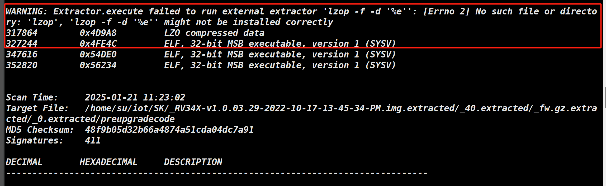

```
sudo apt-get update 
sudo apt-get install lzop
```

再次解压就成功了

当然看见的文件很杂很乱，可以搜索一下看看`bin`在什么地方

```
_RV34X-v1.0.03.29-2022-10-17-13-45-34-PM.img.extracted/_40.extracted/_fw.gz.extracted/_0.extracted/_openwrt-comcerto2000-hgw-rootfs-ubi_nand.img.extracted/ubifs-root/790534924/rootfs/bin
```

那么`rootfs`就是文件系统了，在`/etc/init.d`里面放着很多启动服务以及脚本什么的

当然也可以看见`nginx`服务

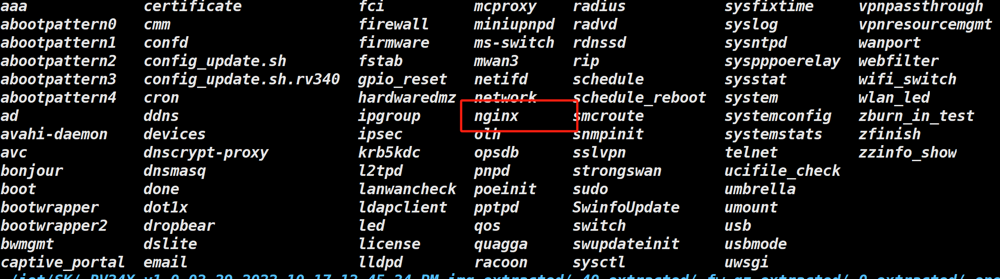

#### 下载准备

那么就可以先把环境搭建起来了，可以看看bin目录下的`busybox` 是什么架构的，以便下载对应的内核，文件系统，以及镜像

```
file ../../bin/busybox 
../../bin/busybox: ELF 32-bit LSB executable, ARM, EABI5 version 1 (SYSV), dynamically linked, interpreter /lib/ld-linux.so.3, for GNU/Linux 2.6.16, stripped
```

可以看见是`32`位小端序`(LSB)ARM`架构的，那么去这里下载相关的文件[Index of /~aurel32/qemu/armhf](https://people.debian.org/~aurel32/qemu/armhf/)也就是下面这3个

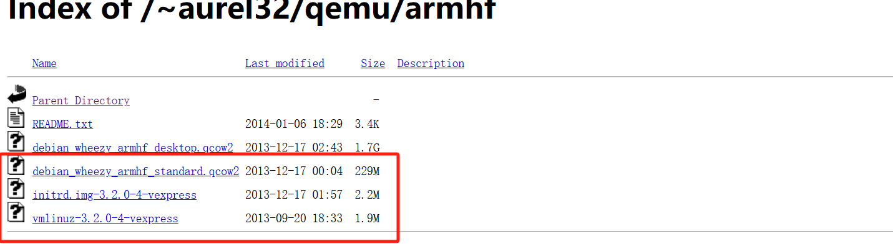

```
wget https://people.debian.org/~aurel32/qemu/armhf/debian_wheezy_armhf_standard.qcow2
wget https://people.debian.org/~aurel32/qemu/armhf/vmlinuz-3.2.0-4-vexpress
wget https://people.debian.org/~aurel32/qemu/armhf/initrd.img-3.2.0-4-vexpress
```

之后在同级目录下写上启动脚本

```
sudo qemu-system-arm -M vexpress-a9 -kernel vmlinuz-3.2.0-4-vexpress \
  -initrd initrd.img-3.2.0-4-vexpress -drive if=sd,file=debian_wheezy_armhf_standard.qcow2 \
  -append "root=/dev/mmcblk0p2" -net nic -net tap,ifname=tap0,script=no,downscript=no \
  -nographic -smp 4

```

#### 网络配置

这里指定了`tap0`网卡来充当桥梁的作用，之前`mips`相关架构指定的`br0`，因为它们的支持不同，因此还需创建一张`tap0`网卡并加入对应的网桥`br0`中

```
sudo ip tuntap add dev tap0 mode tap user $(whoami)
sudo ip link set tap0 up
sudo ip link set tap0 master br0
```

如果没有配置`br0`,那么运行下面这个脚本可以一并控制

```
#!/bin/sh
#sudo ifconfig eth0 down                 # 首先关闭宿主机网卡接口
sudo brctl addbr br0                     # 添加一座名为 br0 的网桥
sudo brctl addif br0 ens33                # 在 br0 中添加一个接口
sudo brctl stp br0 off                   # 如果只有一个网桥，则关闭生成树协议
sudo brctl setfd br0 1                   # 设置 br0 的转发延迟
sudo brctl sethello br0 1                # 设置 br0 的 hello 时间
sudo ifconfig br0 0.0.0.0 promisc up     # 启用 br0 接口
sudo ifconfig ens33 0.0.0.0 promisc up    # 启用网卡接口
sudo dhclient br0                        # 从 dhcp 服务器获得 br0 的 IP 地址
sudo brctl show br0                      # 查看虚拟网桥列表
sudo brctl showstp br0                   # 查看 br0 的各接口信息
sudo tunctl -t tap0 -u root              # 创建一个 tap0 接口，只允许 root 用户访问
sudo brctl addif br0 tap0                # 在虚拟网桥中增加一个 tap0 接口
sudo ifconfig tap0 0.0.0.0 promisc up    # 启用 tap0 接口
sudo brctl showstp br0
```

接下来就可以启动脚本了，如果遇到了`SD card size 25GB`报错，即要指定`2`的次方为`size`，比如指定为`32GB`

```
qemu-img resize debian_wheezy_armhf_standard.qcow2 32G
```

随后启动，几分钟就可以进入登录，默认用户/密码:root/root

如果发现`qemu`虚拟机没有对应的`ip`地址，例如下面这个

```
root@debian-armhf:~# ip a
1: lo: <LOOPBACK,UP,LOWER_UP> mtu 16436 qdisc noqueue state UNKNOWN 
    link/loopback 00:00:00:00:00:00 brd 00:00:00:00:00:00
    inet 127.0.0.1/8 scope host lo
    inet6 ::1/128 scope host 
       valid_lft forever preferred_lft forever
2: eth0: <BROADCAST,MULTICAST,UP,LOWER_UP> mtu 1500 qdisc pfifo_fast state UNKNOWN qlen 1000
    link/ether 52:54:00:12:34:56 brd ff:ff:ff:ff:ff:ff
    inet6 fe80::5054:ff:fe12:3456/64 scope link 
       valid_lft forever preferred_lft forever
```

首先检查`qemu`虚拟机`/etc/network/interfaces`的配置，看看里面的网卡是不是`eth0`

```
# This file describes the network interfaces available on your system
# and how to activate them. For more information, see interfaces(5).

# The loopback network interface
auto lo
iface lo inet loopback

# The primary network interface
allow-hotplug eth0
iface eth0 inet dhcp
```

如果发现不是`eth0`那么首先修改成对应的网卡名称，然后重启qemu，如果是`eth0`并且还没有ip，那么可以检查一下宿主机也是就复现环境里面的`Ubuntu22.04`是否配置好了`br0`，以及`tap0`是否加入到了`br0`中，如果这些都没有问题，那么大概率就是宿主机没有dhcp服务，这个如果想配置下个对应服务，然后启动服务，重启qemu即可，如果不想配置，可以手动分配一个`ip`

```
ip addr add 192.168.102.150/24 dev eth0
ip link set eth0 up
ip route add default via 192.168.102.145
```

这里的网关就是`br0`的`ip`地址

然后就会发现`eth0`成功配置上了`ip`地址，而且和宿主机连通

后来我又发现`DHCP`工作了，导致存在两个`ip`不过不影响

```
1: lo: <LOOPBACK,UP,LOWER_UP> mtu 16436 qdisc noqueue state UNKNOWN 
    link/loopback 00:00:00:00:00:00 brd 00:00:00:00:00:00
    inet 127.0.0.1/8 scope host lo
    inet6 ::1/128 scope host 
       valid_lft forever preferred_lft forever
2: eth0: <BROADCAST,MULTICAST,UP,LOWER_UP> mtu 1500 qdisc pfifo_fast state UNKNOWN qlen 1000
    link/ether 52:54:00:12:34:56 brd ff:ff:ff:ff:ff:ff
    inet 192.168.102.150/24 scope global eth0
    inet 192.168.102.148/24 brd 192.168.102.255 scope global secondary eth0
    inet6 fe80::5054:ff:fe12:3456/64 scope link 
       valid_lft forever preferred_lft forever
```

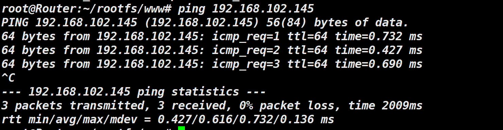

```
ping 192.168.102.150

正在 Ping 192.168.102.150 具有 32 字节的数据:
来自 192.168.102.150 的回复: 字节=32 时间=1ms TTL=64
来自 192.168.102.150 的回复: 字节=32 时间<1ms TTL=64

192.168.102.150 的 Ping 统计信息:
    数据包: 已发送 = 2，已接收 = 2，丢失 = 0 (0% 丢失)，
往返行程的估计时间(以毫秒为单位):
```

网络配置没有问题之后就可以把文件系统通过`ssh`，`scp`传到`qemu`虚拟机上了，记得要压缩之后传，不然可能出现软连接等问题

```
 tar -czvf rootfs.tar.gz rootfs

sudo scp -r rootfs.tar.gz root@192.168.102.150:/root/rootfs.tar.gz 

tar -xzvf rootfs.tar.gz
```

然后通过`chroot`进行隔离，期间挂载 proc和dev 保证`qemu`正常运行,因为`qemu`可能需要访问系统等信息

```
chmod -R 777 rootfs
cd rootfs/
mount --bind /proc proc
mount --bind /dev dev
chroot . /bin/sh
```

#### 启动nginx服务

那么现在就可以启动`nginx`服务了，当然启动不是一帆风顺的，具体可以参考`ZIKH26`师傅的解决办法[从零开始复现CVE-2023-20073 | ZIKH26's Blog](https://zikh26.github.io/posts/848296ab.html?highlight=iot#启动服务-amp-amp-解决报错)，还是非常详细的，这里只把结论放在这里

依次启动

```
/etc/init.d/boot boot
generate_default_cert
/etc/init.d/confd start
/etc/init.d/nginx start
```

一定要保证每个服务都启动起来，然后进行访问

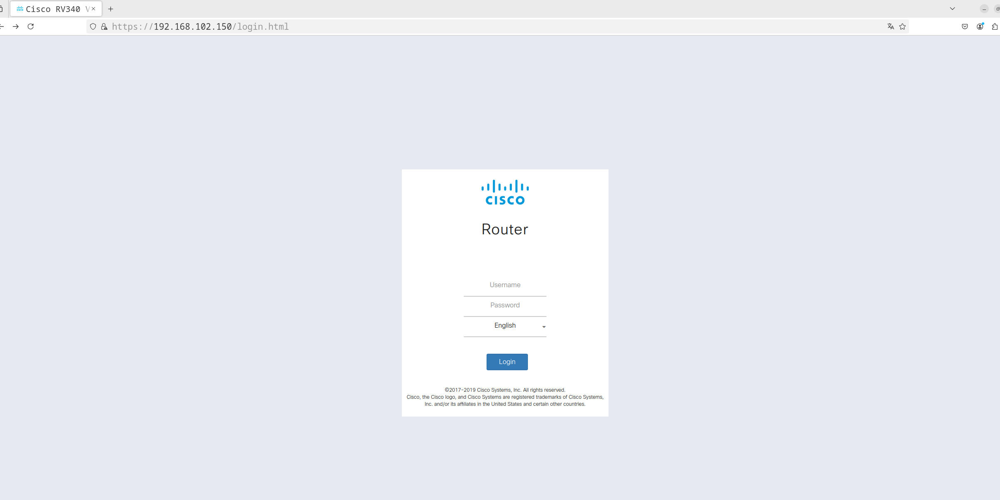

成功启动`nginx`服务，但是随后又发现只能宿主机访问到，而物理机却不行

```
>ping 192.168.102.150

正在 Ping 192.168.102.150 具有 32 字节的数据:
请求超时。
请求超时。
请求超时。

192.168.102.150 的 Ping 统计信息:
    数据包: 已发送 = 3，已接收 = 0，丢失 = 3 (100% 丢失)，
```

发现`ping`都`ping`不通，我猜测是路由的问题，加了一条路由发现还是不行

```
route add 192.168.102.0 MASK 255.255.255.0 192.168.102.145
```

然后考虑防火墙问题，最后发现是宿主机的防火墙不允许从网桥设备 `br0` 流出的网络流量进行转发，配置一下规则

```
do iptables -A FORWARD -i br0 -o br0 -j ACCEPT
```

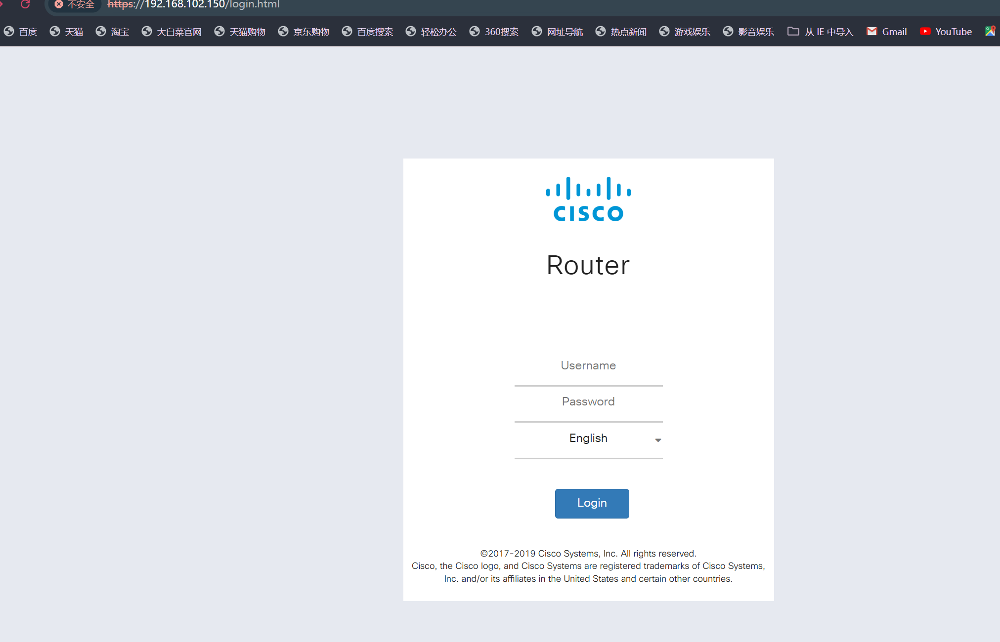

物理机成功访问

#### 漏洞原因分析

首先看一下`nginx`的配置文件 `/etc/nginx/conf.d`

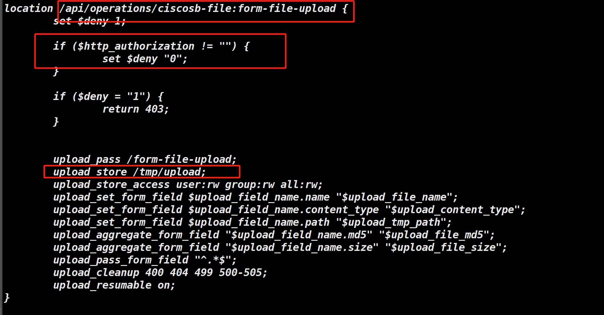

这里发现通过URL `/api/operations/ciscosb-file:form-file-upload`可以进行未授权文件上传，前提是`http_authorization`字段不为空

上传文件到`/tmp/upload`目录下，但是其实是进行检查是否授权了的，只不过在这之前就出现了漏洞

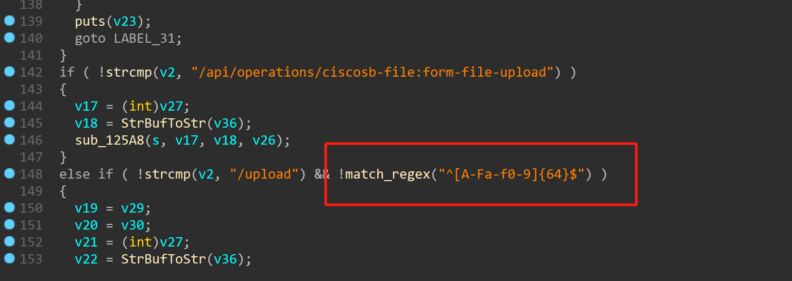

这里有`nginx`配置文件的相关知识 [Nginx upload上传模块(学习笔记十七) - 简书](https://www.jianshu.com/p/e512a7127f2d)

比如下面这些

```
upload_pass 指明后续处理的php地址。文件中的字段将被分离和取代，包含必要的信息处理上传文件。

upload_resumable 是否启动可恢复上传。

upload_store 指定上传文件存放地址(目录)。目录可以散列，在这种情况下，在nginx启动前，所有的子目录必须存在。

upload_state_store 指定保存上传文件可恢复上传的文件状态信息目录。目录可以散列，在这种情况下，在nginx启动前，所有的子目录必须存在。

upload_store_access 上传文件的访问权限，user:r是指用户可读

upload_pass_form_field 从表单原样转到后端的参数，可以正则表达式表示。：

$upload_field_name — 原始文件中的字段的名称

upload_pass_form_field “^submit$|^description$”;

意思是把submit，description这两个字段也原样通过upload_pass传递到后端php处理。如果希望把所有的表单字段都传给后端可以用upload_pass_form_field “^.*$”;

upload_set_form_field 名称和值都可能包含以下特殊变量：

$upload_field_name 表单的name值

$upload_content_type 上传文件的类型

$upload_file_name 客户端上传的原始文件名称

$upload_tmp_path 文件上传后保存在服务端的位置

upload_aggregate_form_field 可以多使用的几个变量,文件接收完毕后生成的并传递到后端

$upload_file_md5 文件的MD5校验值

$upload_file_md5_uc 大写字母表示的MD5校验值

$upload_file_sha1 文件的SHA1校验值

$upload_file_sha1_uc 大写字母表示的SHA1校验值

$upload_file_crc32 16进制表示的文件CRC32值

$upload_file_size 文件大小

$upload_file_number 请求体中的文件序号

这些字段值是在文件成功上传后计算的。

upload_cleanup 如果出现400 404 499 500-505之类的错误，则删除上传的文件

upload_buffer_size 上传缓冲区大小

upload_max_part_header_len 指定头部分最大长度字节。

upload_max_file_size 指定上传文件最大大小，软限制。client_max_body_size硬限制。

upload_limit_rate 上传限速，如果设置为0则表示不限制。

upload_max_output_body_len 超过这个大小，将报403错(Request entity too large)。

upload_tame_arrays 指定文件字段名的方括号是否删除

upload_pass_args 是否转发参数。
```

在配置文件里面指明了后续处理的操作

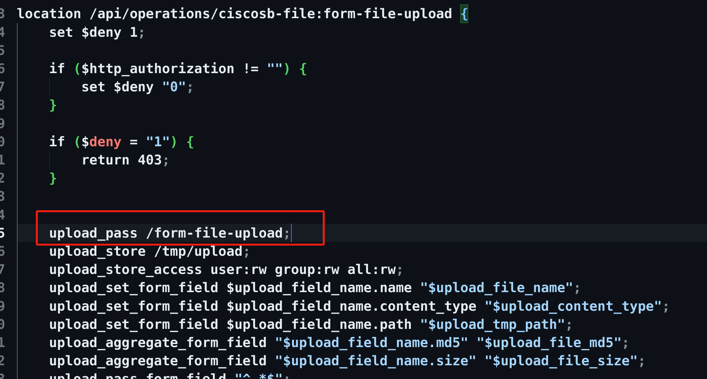

找一下哪个文件存在这个字符串

```
grep -r form-file-upload .
./web.upload.conf:location /form-file-upload {
./web.upload.conf:	upload_pass /form-file-upload;
```

发现`web.upload.conf`里面存在这个字符串，并且会请求`uwsgi_pass 127.0.0.1:9003`转发给`uwsgi`处理

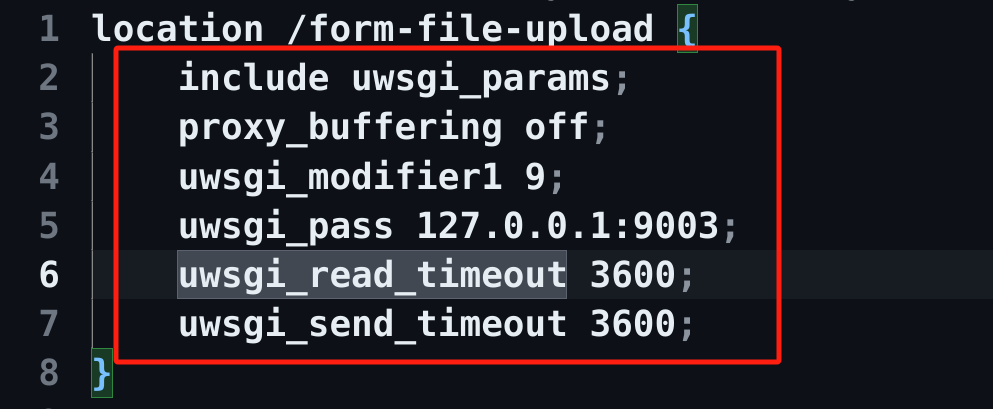

继续如法炮制

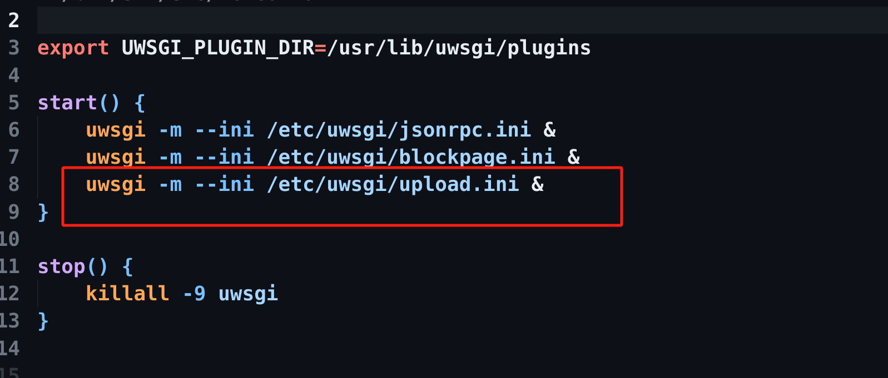


继续找`upload.ini`，发现它最后会调用`/www/cgi-bin/upload.cgi`

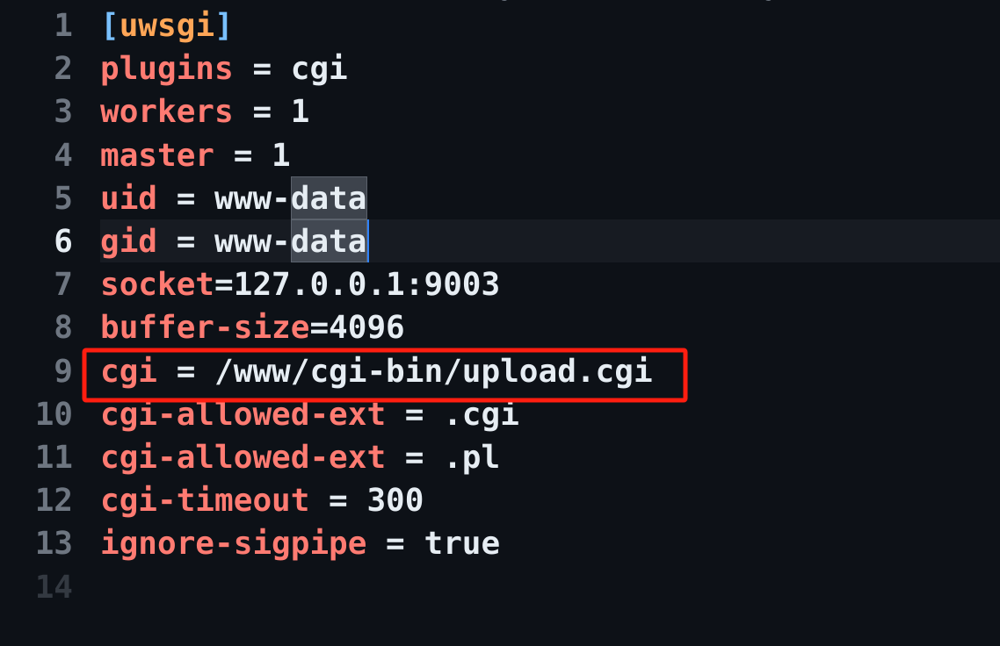

那么去分析一下这个二进制文件

#### 二进制文件逆向分析

去掉了符号表，第一个即是`main`函数

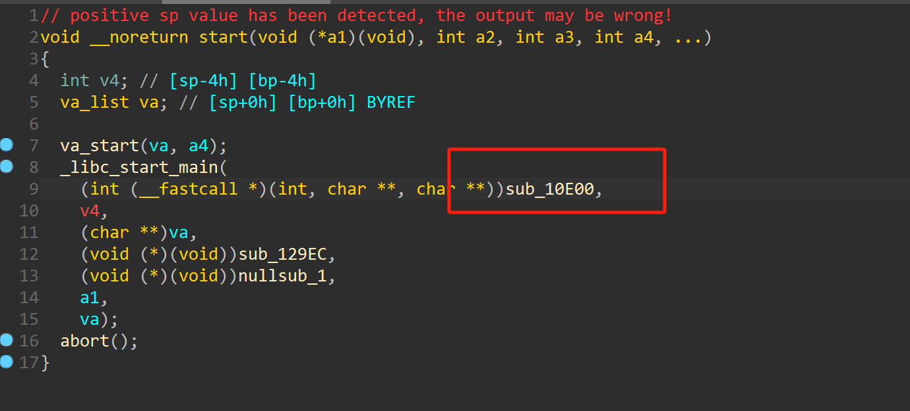

`main`函数会调用上面这个函数，下面就是检查授权了

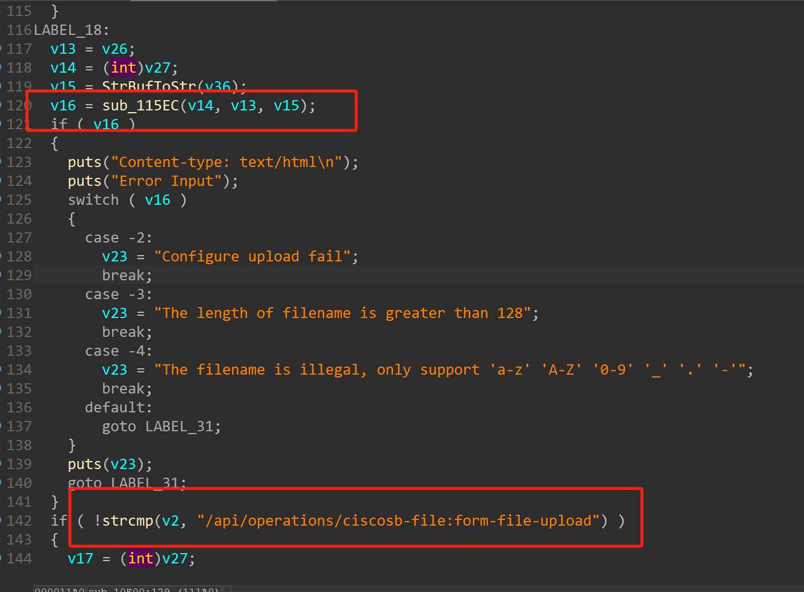

进去这个函数发现，`system`函数会执行`mv -f a2 v8/a3` 这里v8 可以通过`a1`进行控制，`a2`和`a3`也可以进行控制，由于这里的`login.html`，和`index.html`都是软连接到`/tmp/www/`下的，那么控制 `a2`为`/tmp/uplaod/xxx` `a3`为`login.html`，那么就可以实现篡改登录页面

```
drwxrwxr-x 12 su su  4096 10月 17  2022 ./
drwxrwxr-x 19 su su  4096  1月 21 12:47 ../
-rw-rw-r--  1 su su  5008  9月 26  2022 about.html
drwxrwxr-x  2 su su  4096 10月 17  2022 cgi-bin/
drwxrwxr-x  2 su su  4096 10月 17  2022 config/
drwxrwxr-x  2 su su  4096 10月 17  2022 debug/
lrwxrwxrwx  1 su su    14  1月 21 11:27 download -> /tmp/download/
lrwxrwxrwx  1 su su    13  1月 21 11:27 help -> /tmp/www/help
drwxrwxr-x 15 su su  4096 10月 17  2022 htm/
drwxrwxr-x  2 su su  4096 10月 17  2022 i18n/
lrwxrwxrwx  1 su su    19  1月 21 11:27 index.html -> /tmp/www/index.html
-rw-rw-r--  1 su su  3821  9月 26  2022 index.html.default
drwxrwxr-x  2 su su  4096 10月 17  2022 js/
drwxrwxr-x 20 su su  4096 10月 17  2022 lib/
lrwxrwxrwx  1 su su    19  1月 21 11:27 login.html -> /tmp/www/login.html
-rw-rw-r--  1 su su 18231  9月 26  2022 login.html.default
drwxrwxr-x  2 su su  4096  9月 26  2022 model/
drwxrwxr-x  2 su su  4096 10月 17  2022 portal/
drwxrwxr-x  4 su su  4096 10月 17  2022 themes/
```

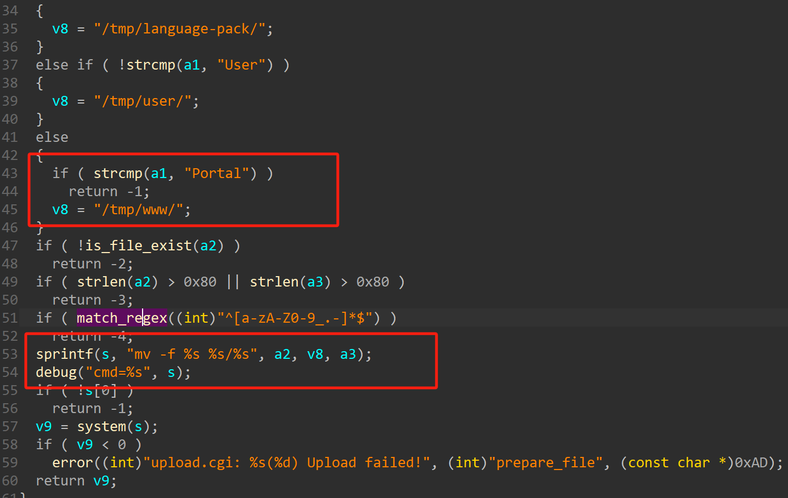

回到前面进行分析一下找一下，`a2`和`a3`，分析出`a2`是`file.path` `a1`是`pathparm`，`a3`是fileparam

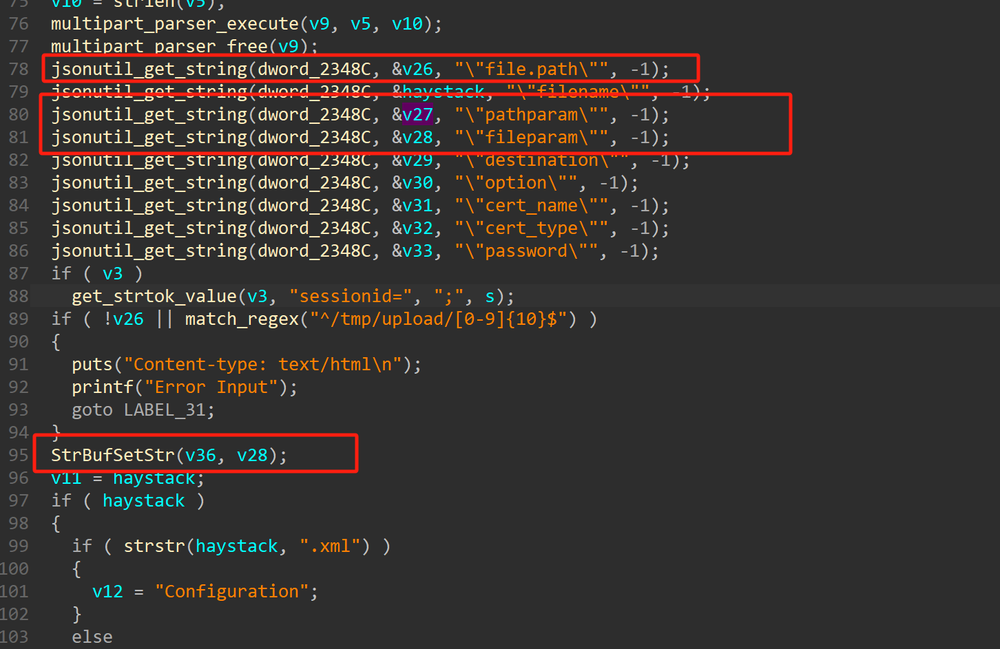

通过上面的分析要想实现更改登录页面需要控制 `v14` 为 `Portal` `v13` 为`/tmp/upload/xxx` `v14`为`login.html`

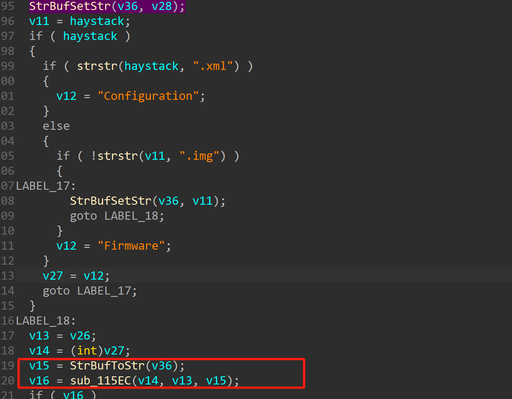

关键就是这些值是如何来的呢，主要是不知道上传到`/tmp/upload`目录下的具体文件名

这里可以通过动态调试来查看，需要下载对应的`gdbserver`[gdb-static-cross/prebuilt/gdbserver-7.7.1-armhf-eabi5-v1-sysv at master · stayliv3/gdb-static-cross](https://github.com/stayliv3/gdb-static-cross/blob/master/prebuilt/gdbserver-7.7.1-armhf-eabi5-v1-sysv)然后使用`scp`将其传过去，这里还有一个问题，就是`upload.cgi`的调用几乎是一瞬间的，要想对其调试就需要做一些东西，这里可以把二进制文件的跳转变成跳转到自身，然后调试的时候改回来即可，这里把第一个跳转指令改成自己的地址，那么当调用`upload.cgi`就会一直卡在这里，把`patch`过的文件也传过去

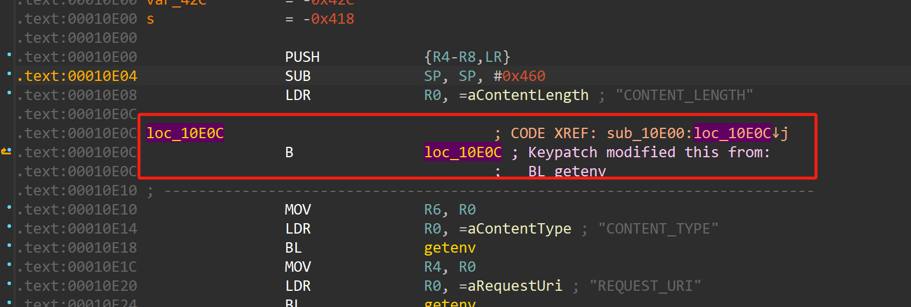

然后通过下面的构造发送请求，注意最开始的前提`Authorization`不能为空

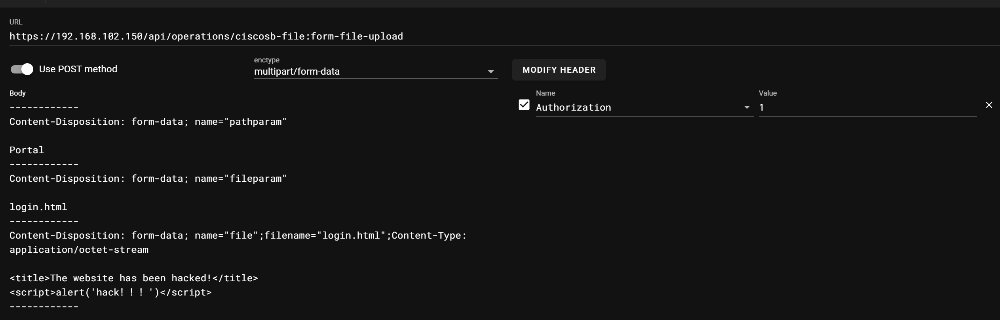

但是会发现`nginx`报错了

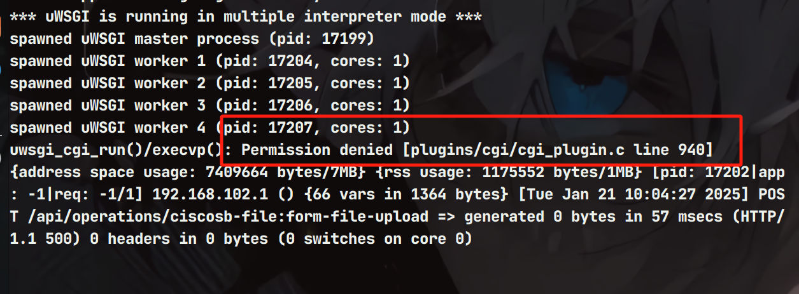

同时`upload.cgi`也没有成功启动

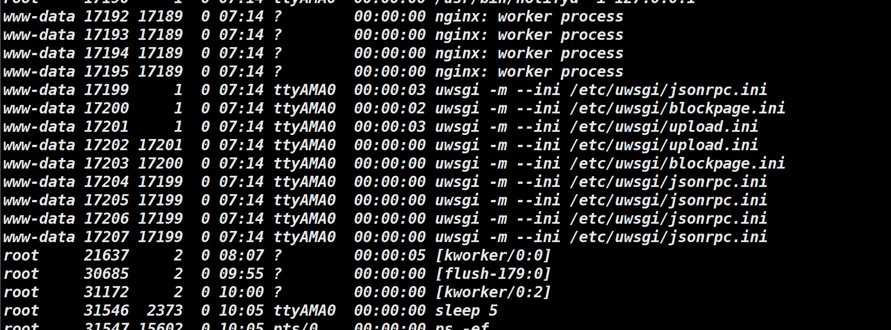

这里原因是因为，执行的用户是`www-data`而不是`root`，导致权限不够，正确做法是把其他用户组的权限设置为7，这里直接为了方便`chmo 777 upload.cgi`


再次执行，发现会一直卡住

并且这次看见了我们想看见的东西

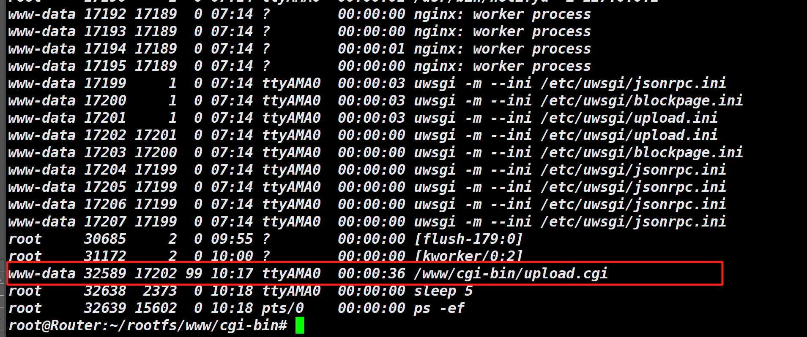

通过`gdbserver`把这个调试信息通过端口发送出去

```
./gdbserver 0.0.0.0:1234 --attach PID
```

```
target remote 192.168.102.150:1234
```

通过宿主机进行调试，发现确实一直处于循环状态

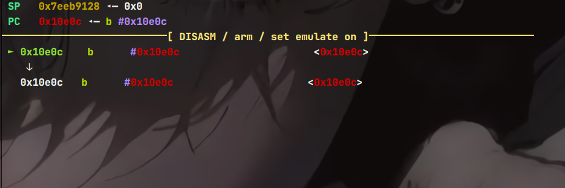

这里进行修改，可以看见原本对应的字节应该是 `0xebffffaa` 注意小端序

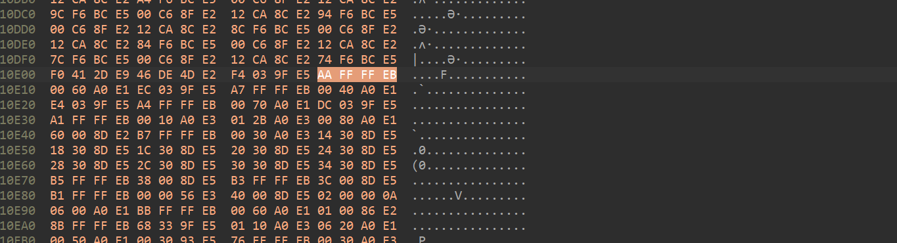

还有一个问题就是调试的时候会突然停止

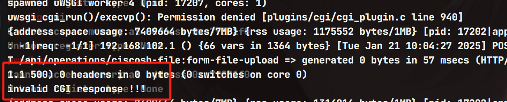

原因是`uwsgi`设置的`timeout`，调试的时候把这个时常调大一点即可

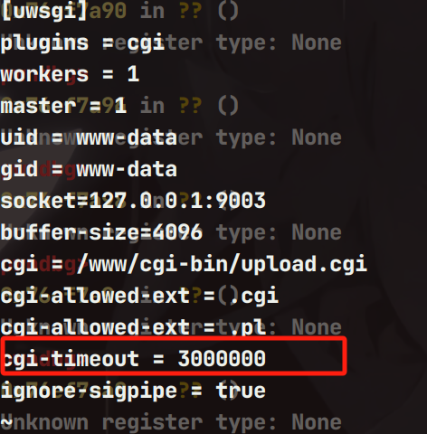

在调试的时候发现上传的路径如下图一样，`/tmp/upload/0000000001`

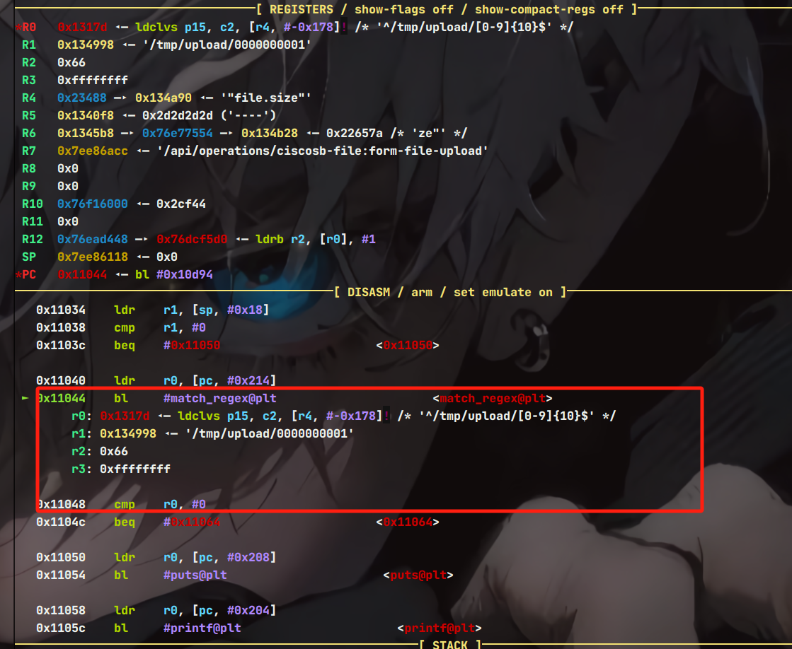

那么`file.path`这个字段就不用构造了


这里发现成功执行 `mv -f /tmp/upload/0000000001 /tmp/www//login.html`

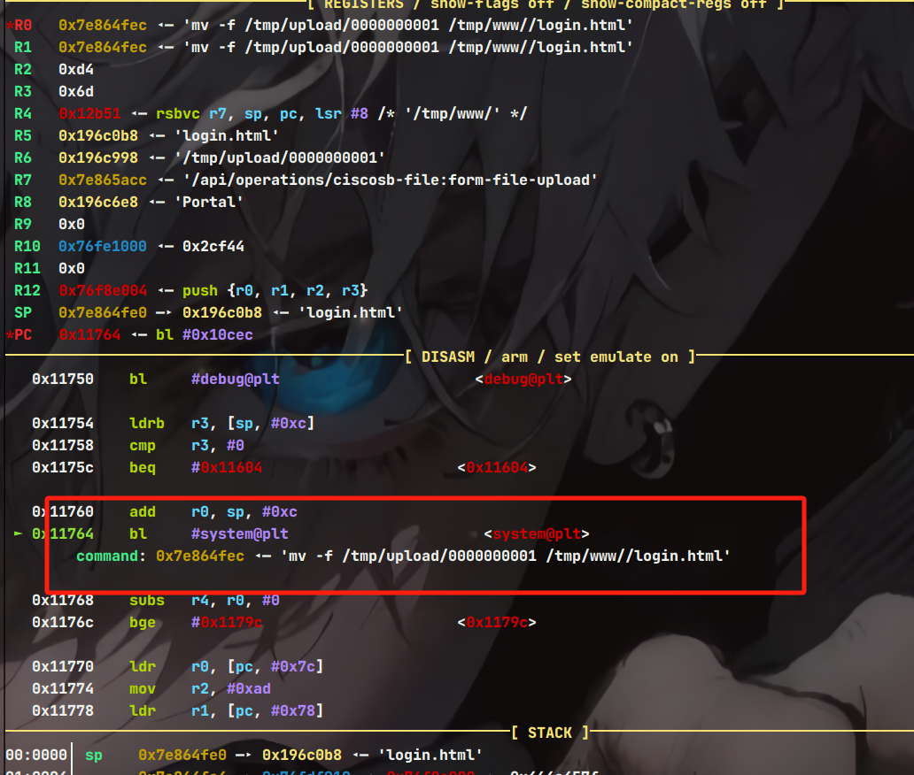

再次访问登录页面

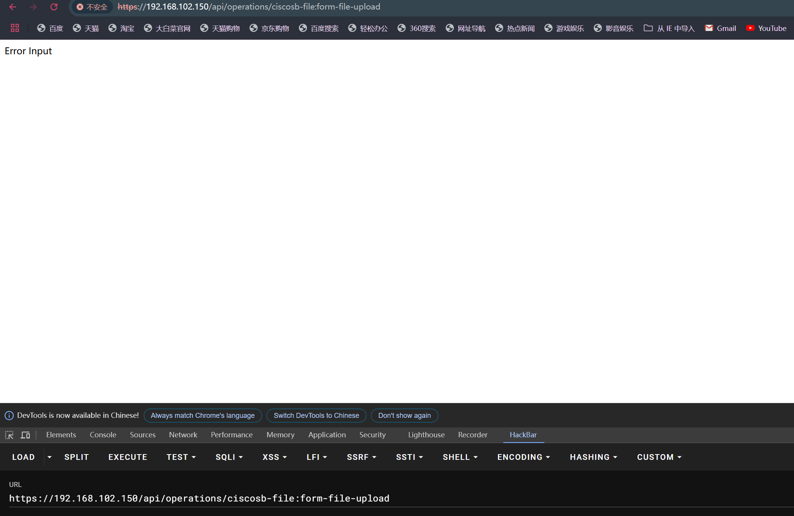

发现攻击成功

重启服务即可恢复正常
