# [论文Review] Text-to-LoRA: Instant Transformer Adaptation 一种根据任务描述生成LoRA模型的hypernetwork-先知社区

> **来源**: https://xz.aliyun.com/news/18295  
> **文章ID**: 18295

---

# **1 前言**

这篇文章是对发表于2025年6月的论文 [Text-to-LoRA: Instant Transformer Adaption](https://arxiv.org/abs/2506.06105) 的解读，本文会详细解释这个基于hypernetwork的 LLM适配方法，并提供一些本人的见解。

Paper link: <https://arxiv.org/pdf/2506.06105>

Code link: <https://github.com/SakanaAI/text-to-lora>

# **2 论文解读**

## **2.1 概述**

该论文提出了一种名为 Text-to-LoRA (T2L) 的超网络（hypernetwork），它能够压缩特定任务的 LoRA，并在推理时，**仅使用目标任务的自然语言描述作为输入，零样本（zero-shot）生成新的 LoRA 适配器**。

## **2.2 背景**

传统上，为大型语言模型（LLM）等模型进行定制化，需要针对每个新应用在特定数据集上进行微调。这种微调方案极大地限制了任务间知识迁移的可能性，而且会带来较大的工程开销。

目前的观察表明，我们可以在保持下游任务性能的同时，训练出原始适配器的有损版本，并且多个 LoRA 可以在推理时组合以用于新任务。

该论文解决了两个主要挑战：

* 如何端到端地训练一个神经网络来压缩许多预训练的 LoRA？
* 如何在测试时，仅根据一个未见任务的自然语言指令，解码出新的特定任务的 LoRA 适配器？

## **2.3 贡献**

该论文的贡献：

* 引入了基于超网络的架构，能够根据文本描述通过单次前向传播生成 LoRA 适配器。T2L 架构可以使用预训练适配器的蒸馏和监督式多任务微调两种方式进行训练。
* 证明了 T2L 能够通过一种有损压缩方式有效地编码数百个 LoRA 适配器。尽管压缩是有损的，T2L 仍保持了针对特定任务微调的 LoRA 适配器的性能。并且，在给定合适的自然语言任务描述时，T2L 在未见过的任务上有很好的泛化能力。

该论文的优势：

* 在多种前沿的指令微调语言模型（Mistral, Llama, Gemma）上实现了任务级的零样本泛化，这和其他相关工作中使用的 T5、BART 等预训练模型有所区别。
* 更简单、更通用的超网络输入要求，T2L 仅需一个任务描述。

## **2.4 Text-to-LoRA**

### **2.4.1 预备知识**

**超网络（Hypernetworks）**: 超网络是一个用于为另一个“基础”网络生成参数的神经网络。给定一个层特定的描述符向量，参数为 θ 的超网络为基础模型的第 l 层（l∈{1,...L}）生成参数，如下所示：。层描述符可以是 **one-hot 向量或学习到的向量**。然后通过在下游任务上进行端到端优化来训练权重 θ。

**LLM 微调**: 我们使用多个微调数据集，对应不同的任务。我们假设每个微调数据集都有一组自然语言*任务描述* ()：。对于单个任务 ti，具有预训练权重（Ψ）的 LLM 的微调目标由下式给出：

对于*多任务*配置，我们训练一个单一的适配器 ΔW 来最小化所有数据集 D 联合的期望损失：

### **2.4.2 训练目标**

使用一个超网络来生成用于任务特定自适应的 LoRA 适配器。假设我们要为任务 ti、目标模块 m 和层索引 l 生成一个 LoRA 适配器，超网络会根据任务描述  生成两个低秩矩阵 A 和 B，如下所示：

其中 f 给出文本描述的向量表示，E 是一个**可学习的嵌入字典**，通过模块类型 m 或层索引 *l* 进行索引。

Text-to-LoRA 可以使用两个不同的目标进行训练：LoRA 重建目标和监督微调目标。

#### **2.4.2.1 重建LoRA 目标** (LoRA Reconstruction)

训练 T2L 最直接的方法是重建预训练的特定任务 LoRA。我们使用自然语言任务描述的embedding作为 T2L 的条件，这使得 T2L 能够为包括未见任务在内的各种任务生成 LoRA 适配器，只要给定相应的任务描述。

给定一个合适的预训练 LoRA 适配器库 Ω，T2L 的重建损失为：

这是在生成的适配器和目标预训练适配器的权重矩阵之上计算的 L1 损失的期望值。

#### **2.4.2.2 监督式微调目标**

T2L 的监督式微调训练目标是：

m 和 l 的值**可以做batch**，这使得 T2L 能够在一次前向传播中为所有模块和层索引生成 ΔW。

使用 SFT 训练 T2L 可以避免对中间目标 LoRA 适配器的需求，并且能够进行端到端训练。一个经过 SFT 训练的 T2L 可以隐式地学习对任务进行聚类，可以提高在零样本场景下的LoRA 路由性能。

### **2.4.3 Text-to-LoRA 架构**

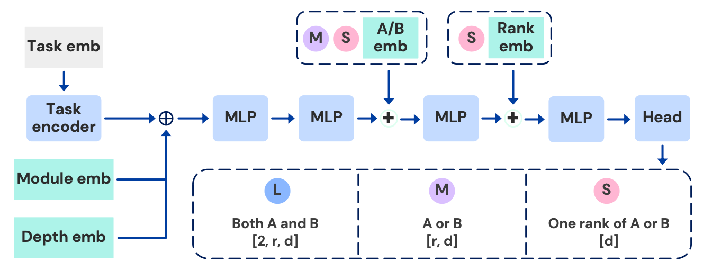

该论文提出了 T2L 的三种变体：***L***, ***M*** 和 ***S***。

T2L 模型由一个**主干网络（backbone）**和一个**输出头（output head）**构成，输出头会根据不同的模型架构变体而变化。

主干网络部分包括一个任务编码器，它接受原始输入并输出一个**层特定的描述符向量**，即 ，以及几个 MLP，其中最后一个 MLP 的输出特征 默认为 512。

输出头是一个线性层，它将最后一个 MLP 的输出映射到特定架构的输出特征。

* **T2L-Large (*****L*****)**: 输出头的结果大小为 ，最后一个线性层会同时输出低秩矩阵 A 和 B。
* **T2L-Medium (*****M*****)**: 输出头的结果大小为 ，输出一个低秩矩阵，具体是 A 还是 B 取决于输入的embedding。
* **T2L-Small (*****S*****)**: 输出头的结果大小为 ，一次只输出低秩矩阵的一行（rank）。

对于 *M* 和 *S* 版本，在 MLP 中间增加了一个低秩矩阵嵌入层。

对于 *S* 版本，在 MLP 中间增加了一个秩嵌入层（rank embedding layer）。

## **2.5 实现细节**

**主干网络架构**

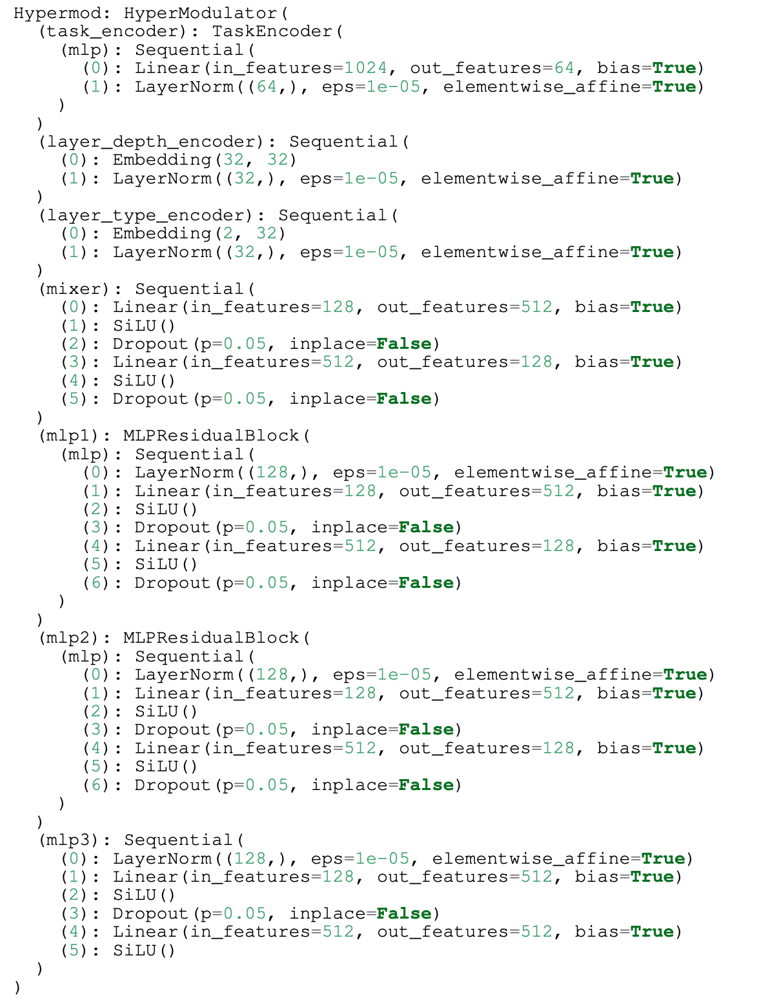

**A/B 和秩嵌入**

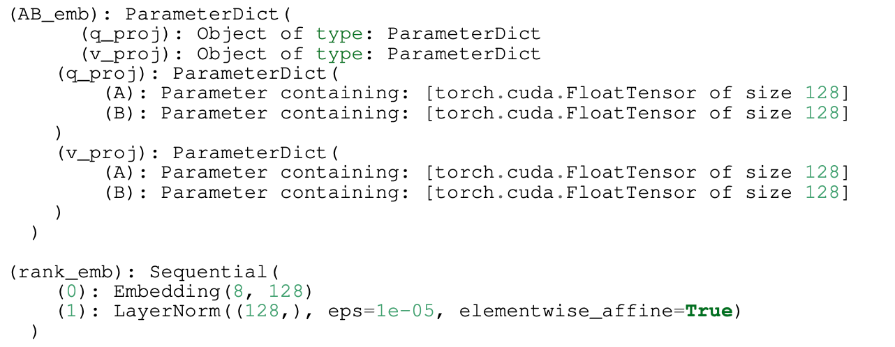

**T2L 的输入：**

* 任务嵌入（one-hot 或可学习向量）+ 模块嵌入（模块类型，一个整数或自然语言句子/单词）+ 层深度嵌入（层索引）
* 例如，输入 `<QA 任务描述>, 1, 1`，代表我想让T2L生成模块类型1的目标适配器的第1层，该目标适配器用来处理QA任务。

注意，模块嵌入和层深度嵌入使用相同的嵌入字典（int ⇒ tensor）。

**T2L 的输出：**

* 不同的架构有不同类型的输出。例如，*S* 架构输出适配器的单层（不进行批处理）或一批适配器层的权重（进行批处理）。

**如何训练 T2L?**

1. 给定一组任务描述嵌入，超网络通过一次或多次前向传播生成 LoRA 适配矩阵 ΔW。
2. 如果使用 SFT 损失，则将适配器加载到基础模型中。
3. 可以通过蒸馏预训练LoRA的方式进行优化，***或者***通过在下游任务上进行多任务监督微调进行优化。

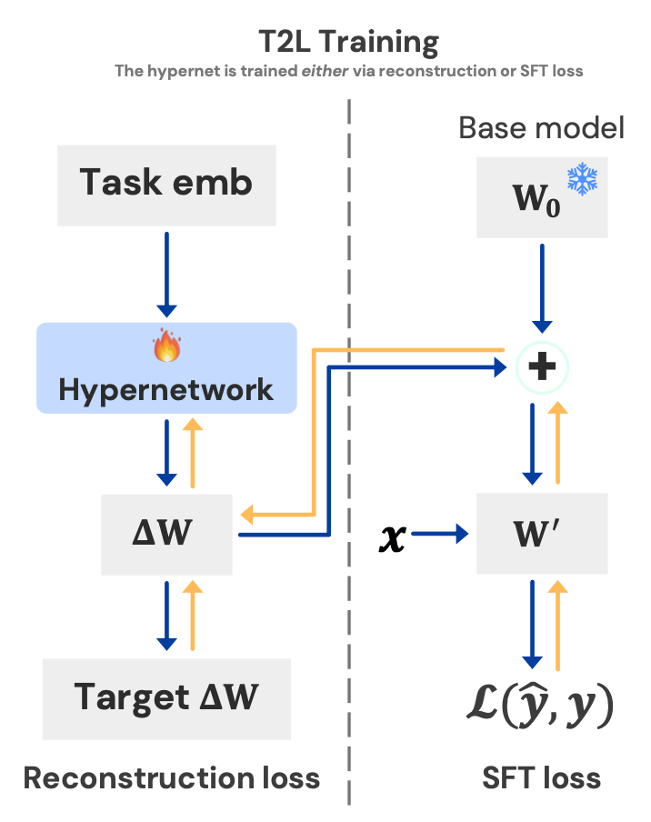

**如何评估 T2L 在下游任务上的性能？**

1. 通过一次前向传播（批处理）生成一个 LoRA 适配器。
2. 将适配器加载到基础模型中。
3. 在下游任务上评估 LoRA 模型。

## **2.6 实验**设计

**基线模型**

作为基线，该论文使用了任务特定的 LoRA、逐元素平均的 LoRA 和多任务 LoRA，以及 [Hyperdecoders](https://arxiv.org/abs/2203.08304)（一个逐序列生成 LoRA 的超网络）。

为了在不进行微调的情况下提升基础模型的性能，该论文利用了少样本上下文学习（few-shot in-context learning）和任务描述前置（在每个查询的开头提供任务描述）的方法。

**训练配置**

该论文在大多数实验中使用 Mistral-7B-Instruct 作为基础 LLM 模型，并使用 Llama-3.1-8B-Instruct 和 Gemma-2-2b-Instruct 以获得更好的演示效果。使用 gte-large-en-v1.5 作为嵌入模型，从自然语言任务描述中提取任务嵌入。

所有 LoRA 适配器的秩（rank）均为8，并且仅针对基础 LLM 中每个自注意力块的查询（query）和值（value）。*L*、*M* 和 *S* 分别有 55M、34M和 5M个可训练参数。

**数据集**

该论文使用 [SNI 数据集](https://huggingface.co/Lots-of-LoRAs) 来训练 LoRA 适配器。总共使用了 500 个 SNI 数据集，训练集与评估集的比例为 479:11。

SNI 数据集遵循[自然指令模式](https://github.com/allenai/natural-instructions?tab=readme-ov-file#task-schema)来构建任务描述。以下是关于 [QA 任务](https://huggingface.co/datasets/Lots-of-LoRAs/task581_socialiqa_question_generation)的一个数据点示例：

```
Definition: In this task, you're given context and an answer. Your task is to generate the question for this answer based on the given context with commonsense reasoning about social situations..

Positive Example 1 -
Input: Context: Tracy didn't go home that evening and resisted Riley's attacks.
Answer: Find somewhere to go
Output: What does Tracy need to do before this?

Positive Example 2 -
Input: Context: Sydney walked past a homeless woman asking for change but did not have any money they could give to her. Sydney felt bad afterwards.
Answer: sympathetic
Output: How would you describe Sydney?

Negative Example 1 -
Input: Context: Tracy's kids wanted ice cream so Aubrey fed the kids ice cream.
Answer: get ice cream
Output: ice cream

Negative Example 2 -
Input: Context: Kai improved Jan's picture and she loved how it came out.
Answer: frame the picture
Output: What will Jan want to do?

Now complete the following example -
Input: Context: Alex changed Addison's life for the better by offering them a good job.
Answer: do their best
Output:
```

```
[
"What will Addison want to do next?"
]
```

论文中使用 GPT-4o-mini 生成任务描述，相比于使用数据集提供的任务描述，用AI生成任务描述的方法训练得到的模型性能更好。

**基准测试**

该论文使用了10个广泛使用的基准，涵盖推理、数学、编码等，包括 Arc-challenge、Arc-easy、BoolQ 等。

例如，[Arc-challenge](https://huggingface.co/datasets/allenai/ai2_arc) 是一个包含7787个真实的小学水平多项选择科学问题的数据集，并且已经划分好了训练-验证-测试集。

### **2.6.1 LoRA 压缩**实验

这个实验旨在研究 T2L 是否能通过重建训练恢复已经训练好的 LoRA 。

将基准任务训练集上训练的任务特定 LoRA 作为基线（称之为*oracles*）。

使用 one-hot 或自然语言任务嵌入在基准特定的 LoRA 上训练 T2L。训练目标是最小化适配器权重的 L1 损失期望：

**评估1**：枚举输入任务嵌入类型（one-hot 或自然语言），在基准数据集上训练和评估 T2L。

下面的结果表明，**T2L 在两种任务嵌入类型下都能完全恢复 oracle 适配器的性能**。

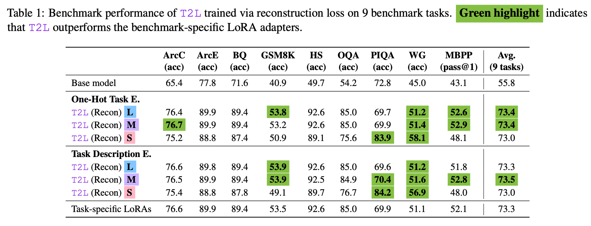

**评估2**：使用one-hot任务描述格式，在SNI 数据集上做训练和评估，改变训练任务的数量。

该论文为每种架构训练了多个 T2L 实例，分别使用 {16, 32, 64, 128, 256, 479} 个训练任务，训练重建的损失会依次增加。

在下面的结果中，我们可以看到，随着训练任务数量的增加，T2L的性能会越来越差（更高的训练误差）。

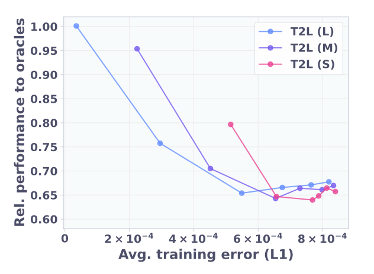

这个结果表明，**T2L 学习到了目标 LoRA 的一种有损压缩**。并且所有 T2L 架构都可以维持约 65% 的 oracle 性能。

### **2.6.2 零样本 LoRA 生成**

在这个实验中，该论文探讨了 T2L 是否能为未见过的任务生成有用的 LoRA 适配器，即评估超网络的泛化能力。

使用的基线包括：

* 无测试时自适应(No test-time adaption)

* 基础模型 (Mistral-7B-Instruct)
* 前置任务描述
* 3-shot ICL
* 多任务 LoRA (在 479 个 SNI 任务上训练得到)
* ...

* 零样本

* Arrow Routing 等

* Oracle

* 在基准任务（未见任务）上训练的任务特定 LoRA。

在 479 个 SNI 数据集上训练 T2L，在基准测试任务上使用 SFT 目标进行测试。对于训练小批量中的每个数据点，以online方式从相应的数据集中随机选择一个任务描述。

评估结果如下：

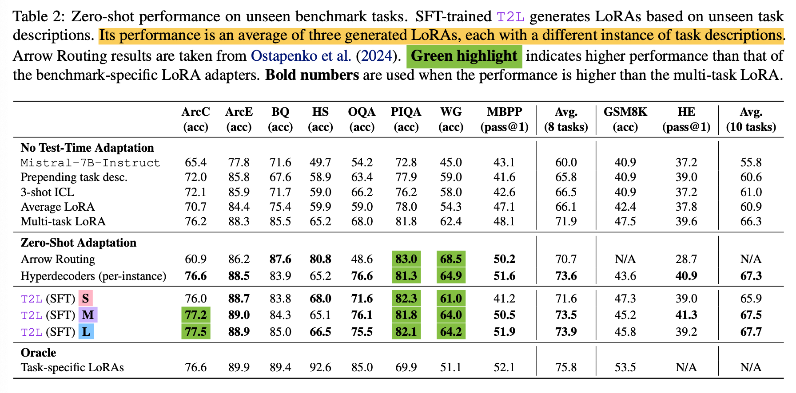

我们可以观察到：

1. 尽管没有额外的微调，多任务 LoRA 适配器在基准测试上表现良好。但任务特定 LoRA 和多任务 LoRA 之间仍然存在性能差距。
2. 经过 SFT 训练的 T2L 确实生成了有用的 LoRA，并且**普遍优于多任务 LoRA 适配器**。
3. 经过 SFT 训练的 T2L **和任务特定LoRA之间仍存在性能差距**，但它在一部分任务上的表现优于 oracle。

## **2.7 发现**

### **2.7.1 发现1**

论文通过改变训练任务的数量来探索 T2L 的可扩展性，并根据所有变体模型的数据集大小按比例增加计算资源。

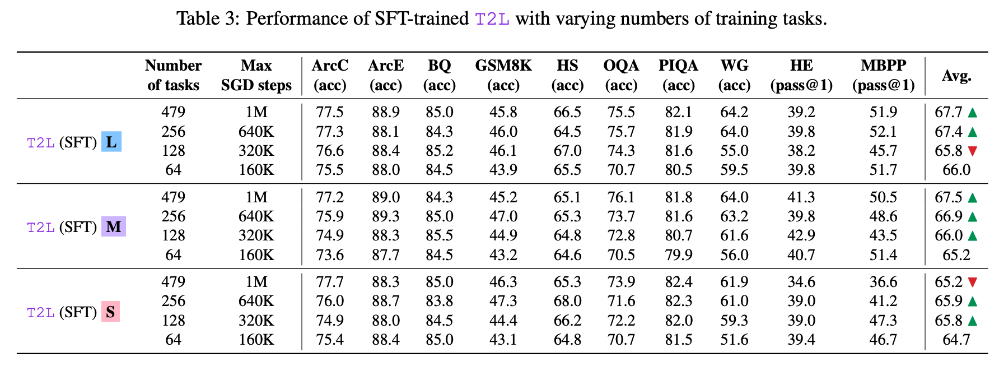

并且，通过在固定计算资源下扩展训练任务数量，论文得到：

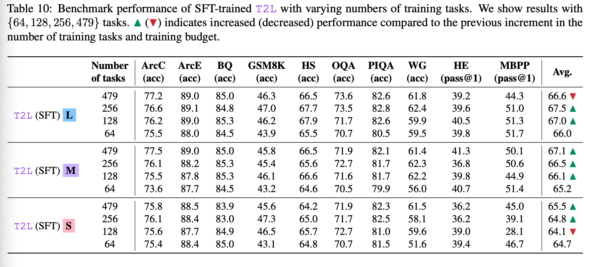

**发现**：根据训练任务的数量来扩展计算资源是至关重要的。

### **2.7.2 发现2**

以下结果显示了使用两种不同嵌入模型的零样本基准性能。

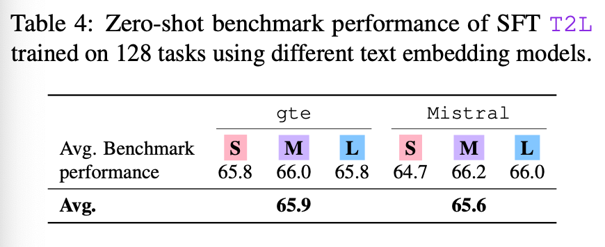

**发现**：T2L 对不同的任务描述嵌入模型具有鲁棒性。

### **2.7.3 发现3**

为了研究任务描述对生成的 LoRA 性能的影响，论文使用了四种类型的描述：

* **Train**：相应任务的训练描述。
* **Eval**：相应任务的未见描述。
* **Random strings**：随机文字字符串。
* **Train (random)**：从其他任务中随机抽样的训练描述。

根据描述与任务之间的一致性，将这四种类型的描述分为两组：一致的（**Train**, **Eval**）和不一致的（**Train(random)** 和 **Random**）。

结果如下：

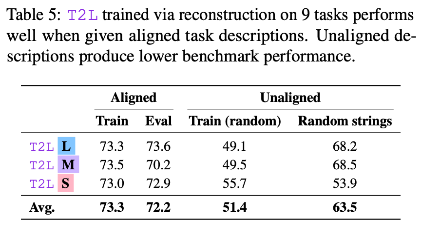

**发现：**

1. 只要任务描述与任务一致，T2L 对任务描述的变化就具有鲁棒性。
2. 如果描述与当前任务不一致，生成的 LoRA 性能会下降。

**启发：** 使用 LLM 来调整描述的一致性可以避免因任务描述与数据集之间不一致的问题而导致T2L 的性能下降。

### **2.7.4 发现4**

论文通过检查 LoRA 适配器在参数空间中的相似性、在基准测试上的性能以及其描述嵌入的相似性来研究它们之间的关联。

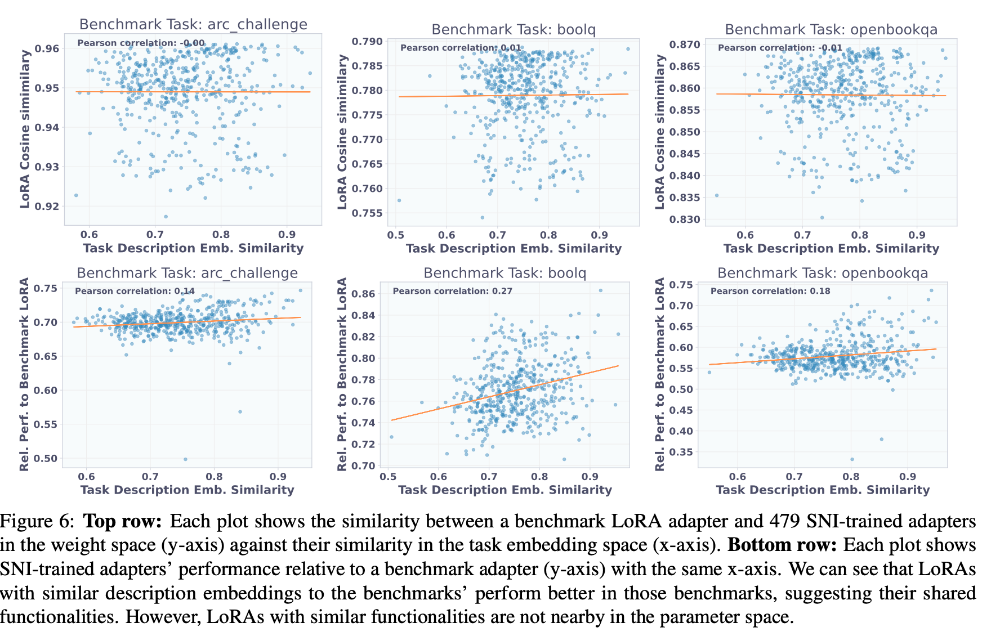

**发现：**

1. 如果适配器的任务描述与基准测试的任务描述相似，那么适配器在基准测试上表现更好。
2. 具有相似任务描述的适配器在参数空间中并不相似。

下图显示了 SNI 适配器与基准特定适配器的相似性：

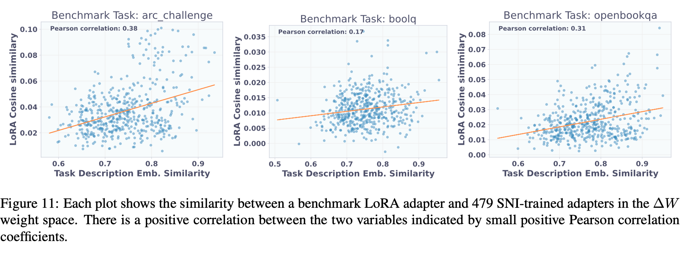

**发现：** 任务嵌入相似性与参数空间中的适配器相似性之间存在正相关关系。

为了更好地理解任务嵌入相似性与适配器相似性之间的关系，论文探测了 SFT T2L，以可视化 T2L 任务编码器的激活（最后一个 MLP 块的输出）。

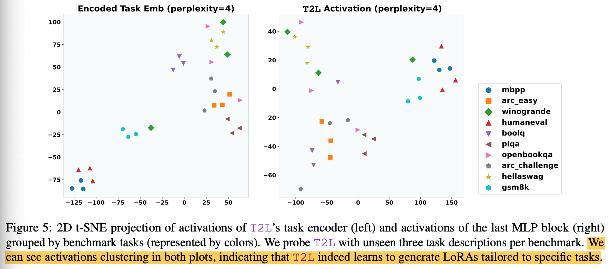

**发现：** 经过 SFT 训练的 T2L 会为语义相似的任务生成相似的适配器。

### **2.7.5 发现5**

论文研究了经过 SFT 训练和经过重建训练的 T2L 在零样本任务中的表现。

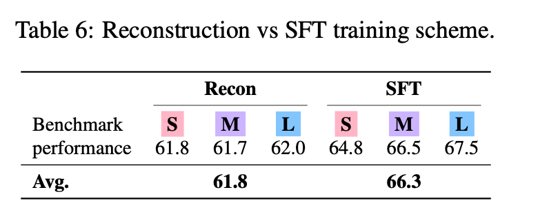

**发现：** 经过 SFT 训练的 T2L 具有更强的泛化能力。

## 2.8 讨论与分析

局限性：

1. 当给T2L 输入低质量的描述时（在现实场景中很常见），可能会导致生成的适配器性能下降。
2. 在零样本任务中，T2L 的表现不如任务特定的LoRA。
3. 论文仅考虑 LoRA 作为超网络的输出空间，可能存在更有效的方法来根据任务描述适配 LLM。

# **3 总结**

总结一下，T2L 是一个超网络，充当一种间接的模型参数初始化器。最值得注意的一点是，**生成过程完全基于自然语言描述，而且是在推理时执行**。可以把它看作一个LoRA 生成器。但T2L也存在一些局限性：

1. T2L的性能对自然语言任务描述的质量和清晰度特别敏感；**措辞不当或任务描述跟数据集不一致**可能导致次优或不正确的LLM适配。
2. T2L在与训练分布完全不同（与SNI数据集完全无关的基准）的任务类型的泛化能力需要进一步研究。
3. 考虑到其零样本性能未能超越任务特定 LoRA，当涉及到特定任务时，训练任务特定 LoRA 仍然是首选。

前景：

1. T2L在零样本任务中的性能优于多任务 LoRA。因此，在需要对任务进行一定泛化（而且是推理时）的多任务场景中，T2L 是多任务 LoRA 的一个有竞争力的替代方案。

​
