# 代码审计-studentmanager-先知社区

> **来源**: https://xz.aliyun.com/news/18296  
> **文章ID**: 18296

---

# 前言

这次是笔者第一次自己未借鉴任何文章审一个独立项目

这次所审的项目比较老，但非常适合像我一样的java审计新手来进行尝试，下面我会仔细写上鄙人这次的审计思路和方法

本次我用的是半黑盒＋半白盒的审计方法

# 环境搭建

项目地址：<https://github.com/ZeroWdd/studentmanager>

> jdk 1.8
>
> mysql 5.5
>
> tomcat 7

我是用navicat来搭建数据库，字符集选择的是utf8，排序规则选择的是utf8\_bin

新建完数据库后将项目中的sql.sql文件导入进去

然后在application.yml文件中将相关信息输入进去

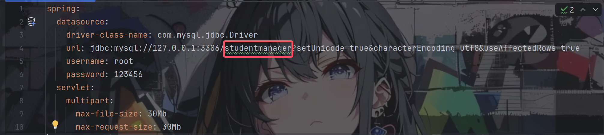

做完这些之后就可以通过StudentmanagerApplication.java启动项目了，默认端口是8080

# 审计

## sql注入

一拿到这个项目的时候，第一件事情就是看pom.xml文件，看有哪些可以利用的依赖以及版本，看用的数据库是哪一种

这里是用mybatis，因此我们就先从审是否存在sql漏洞开始

而mybatis的未做预处理的话所用的危险字符便是`${`，所以我们全局搜索一下，跟sql相关的xml文件中什么都没有，点进去后发现每一个sql语句都进行了预处理，是利用`#{}`进行处理的

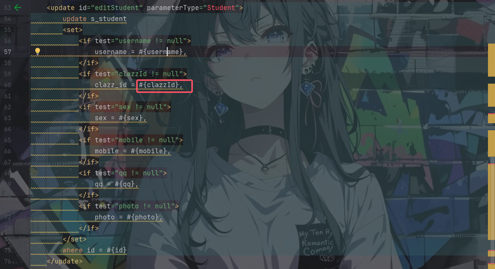

所以根本不存在sql漏洞。。。。

## 审拦截器

这次是一个springmvc项目，所以我的下一步就是审计interceptors文件夹下面的文件，看是否存在一些可以越权，绕过登录的地方

这次该文件夹下面只有一个文件LoginInterceptor.java，具体代码如下：

```
public class LoginInterceptor implements HandlerInterceptor {
    @Override
    public boolean preHandle(HttpServletRequest request, HttpServletResponse response, Object handler) throws IOException {
        Admin user = (Admin)request.getSession().getAttribute(Const.ADMIN);
        Teacher teacher = (Teacher)request.getSession().getAttribute(Const.TEACHER);
        Student student = (Student)request.getSession().getAttribute(Const.STUDENT);
        if(!StringUtils.isEmpty(user) || !StringUtils.isEmpty(teacher) || !StringUtils.isEmpty(student)){
            return true;
        }
        response.sendRedirect(request.getContextPath() + "/system/login");
        return false;
    }
}
```

该函数的作用主要就是进行一个登录检测，看session中是否已经有相关数据，没有的话就强制返回登录界面

查看该文件在哪里用上-SpringmvcConfig.java

```
    public void addInterceptors(InterceptorRegistry registry) {
        registry.addInterceptor(new LoginInterceptor()).addPathPatterns("/**").excludePathPatterns("/","/system/login","/system/checkCode","/easyui/**","/h-ui/**","/upload/**");
    }
```

该函数的主要作用就是拦截除了对excludePathPatterns内的路径外的所有请求进行检验

由于鄙人对拦截器何时开始作用还不是很熟悉，想着既然对`/upload`目录下的所有路径请求都不会进行检测，那么我通过`/upload/../任意路由`是不是就可以进行一个成功的绕过，结果当然是失败的，后面问了下ai才明白在Spring MVC中，**拦截器路径匹配会先进行规范化处理**，会自动将包含 `..`的路径解析为**标准绝对路径**，所以上面会被解析为`/任意路由`后再经过拦截器的路径匹配

那到目前为止这是绕不过去的了，无懈可击，我们先放一旁

## 纯粹的xss

ok，现在先转移视线，去测测每个功能点，主要先从比较可能存在漏洞的点开始，比如文件上传，修改信息等等

我先随便登了个学生账号开始测功能点，找了个可以修改学生信息的点

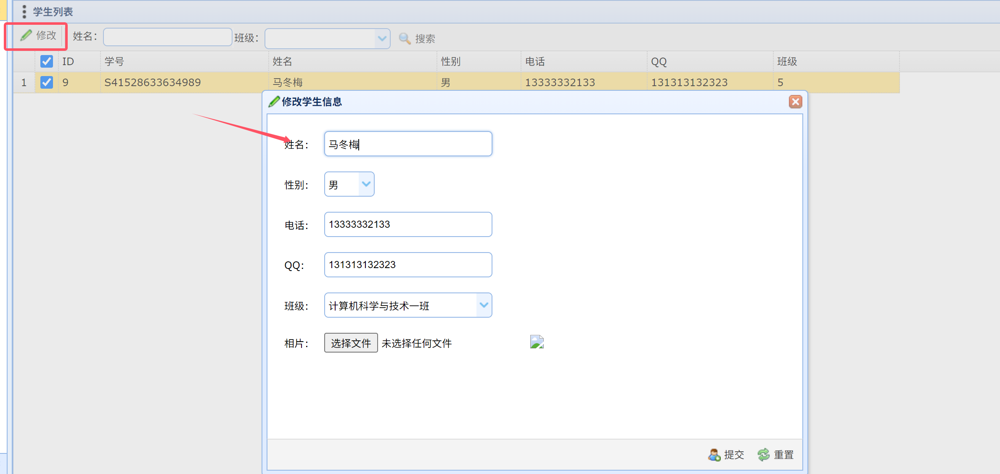

看到输入框就手痒痒，测一手看是否存在xss，除了姓名框外剩下的都有严格的限制，所以对姓名尝试一手：`<script>alert(1)</script>`，点击提交，立即弹出警告框

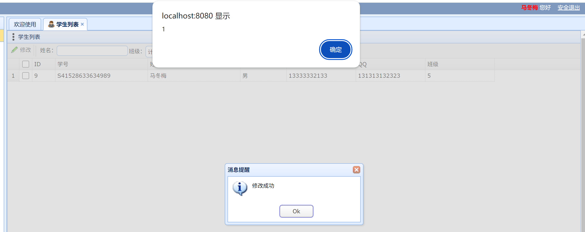

可惜的是查看表的时候发现该条限制了输入字符数，就32个，基本造成不了危害了

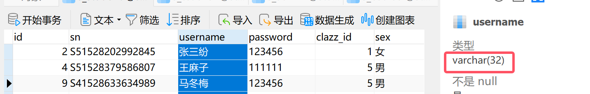

去试验了其他地方点，比如老师的课程管理中的修改课程课程信息的功能点，其中的课程名称也可以实现xss，但是也限制了字符数，无法造成危害，除了弹窗

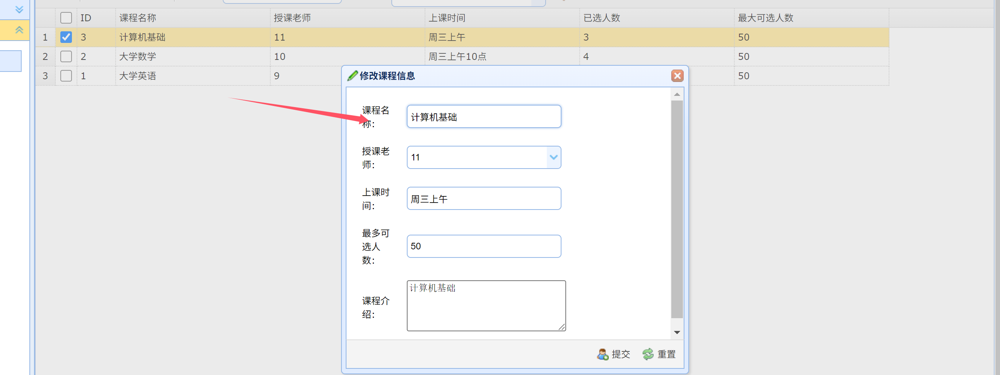

## 任意文件上传

### 通杀存储型xss

回到修改学生信息的那个功能点，我们发现下面有一个上传图片的功能，抓个包，路由是`/student/editStudent`，找到相关的代码，位于src/main/java/com/wdd/studentmanager/controller/StudentController.java中

在看完editStudent方法后，很简单地就发现对上传的文件没有进行任何的检验，上传任意后缀的文件都是可以的，但是会对上传的文件名进行随机化处理，但没有影响

可以上传任意的文件，但是在之前审pom.xml文件的时候我们就知道了这是一个纯粹的springmvc系统，对jsp后缀的文件不会进行任何的处理，所以传不了木马了

但是除了这个外，我们还可以做很多其他的事情，这里我就上传了一个html文件，要验证能够造成危害的话那这里我就是测试能否进行重定向，内容如下：

```
<!DOCTYPE html>
<html>
<body>
    <p>111111111</p>
</body>
<script>window.location.href = "https://www.baidu.com";</script>
</html>
```

上传成功，但直接访问的话却加载失败了，以为又失败了，问了学长后才明白这是因为springmvc本身的特性，那些静态资源都是在编译的时候加载完的，所以只要我们重启一下项目之后再访问便可以

完整的url很容易通过burpsuite获取到

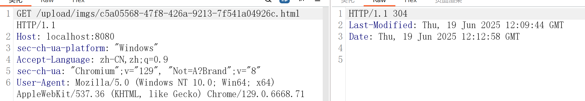

继续访问成功重定向到百度

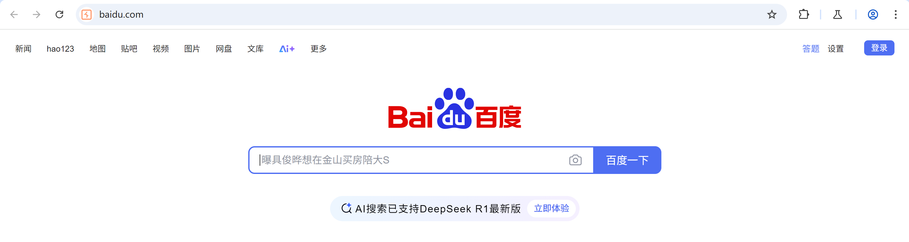

收获一个通杀存储型xss

### csrf

以为对于任意文件上传的利用就到此为止了吗，不不不

由于上面实现了xss，自然而然地就想到了能否实现csrf

于是登录了一个教师账号，而在教师的页面中会自动加载学生列表，点击修改的话会自动加载学生的相片

找了一个添加学生的功能点，路由是/student/addStudent，并且审其相关功能的代码的时候发现也没有对csrf进行一个防御

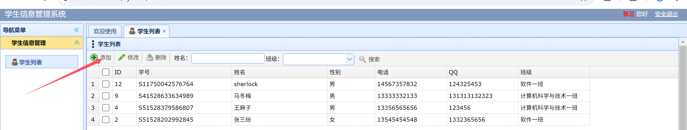

于是我们抓下添加学生的数据包，生成csrf poc

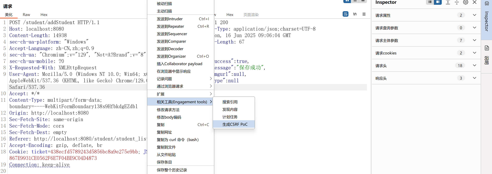

复制完html代码后自己创一个html文件扔进去，然后在任意一个学生账号里面修改信息，将该html文件上传上去

接着我们退出学生账号，登录回教师账号，选中我们自己上面改了的那个学生条目点击修改，打开图片

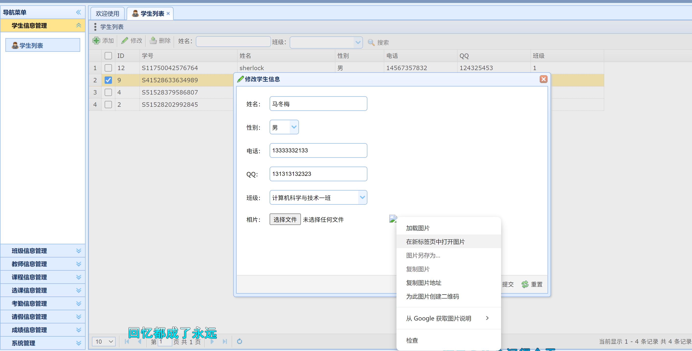

页面如下所示

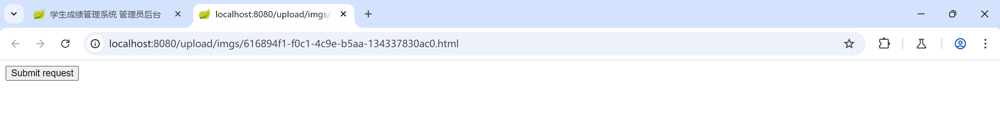

这说明我们已经成功执行了csrf，重新刷新一下页面，就会发现学生列表界面多了一个人出来

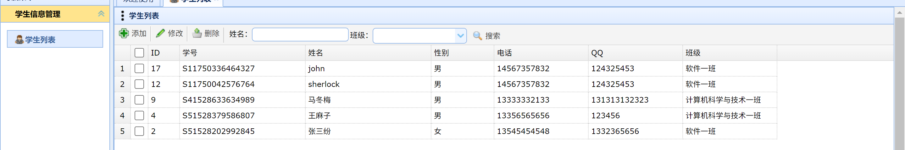

不止是添加学生的功能，经过测试之后删除功能也是可以的，剩下的其他功能就没有继续去测试了，但应该都是可以实现csrf的

同样不仅仅只是教师和学生之间能实现csrf，在管理员和教师之间也可以实现csrf，同样的比如是添加教师功能等等，在这里就不一一列举出来了

收获csrf漏洞

可能会有人疑惑为什么需要打开图片才会实现操作，这是因为在修改页面我们上传的图片是以img标签的形式存在的

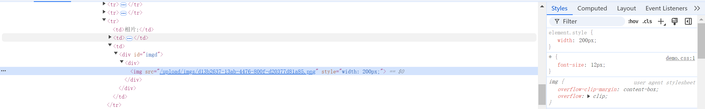

而这样子的话就相当于只是引用了该url，并没有对解析其中的js等，自然就无法直接触发漏洞

## 垂直越权

可是上面的危害都不是很大，就在差不多要心灰意冷的时候，我发现了不同的方法之间有的验证了用户的身份但是有的没有

就比如在StudentController.java中的getStudentList方法

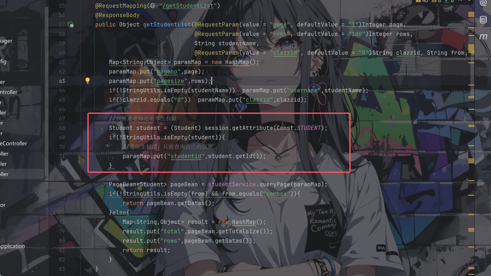

在该方法中有通过session来验证用户是老师还是学生并显示相对应的内容

但是在添加学生这个方法中

```
    @RequestMapping("/addStudent")
    @ResponseBody
    public AjaxResult addStudent(@RequestParam("file") MultipartFile[] files,Student student) throws IOException {

        AjaxResult ajaxResult = new AjaxResult();
        student.setSn(SnGenerateUtil.generateSn(student.getClazzId()));

        // 存放上传图片的文件夹
        File fileDir = UploadUtil.getImgDirFile();
        for(MultipartFile fileImg : files){

            // 拿到文件名
            String extName = fileImg.getOriginalFilename().substring(fileImg.getOriginalFilename().lastIndexOf("."));
            String uuidName = UUID.randomUUID().toString();

            try {
                // 构建真实的文件路径
                File newFile = new File(fileDir.getAbsolutePath() + File.separator +uuidName+ extName);

                // 上传图片到 -》 “绝对路径”
                fileImg.transferTo(newFile);

            } catch (IOException e) {
                e.printStackTrace();
            }
            student.setPhoto(uuidName+extName);
        }
        //保存学生信息到数据库
        try{
            int count = studentService.addStudent(student);
            if(count > 0){
                ajaxResult.setSuccess(true);
                ajaxResult.setMessage("保存成功");
            }else{
                ajaxResult.setSuccess(false);
                ajaxResult.setMessage("保存失败");
            }
        }catch (Exception e){
            e.printStackTrace();
            ajaxResult.setSuccess(false);
            ajaxResult.setMessage("保存失败");
        }

        ajaxResult.setSuccess(true);
        return ajaxResult;
    }
```

我们可以发现全程中没有对用户的身份进行验证，那不就代表这里可能存在越权了吗

于是我们将添加学生的请求进行拦截，将cookie换成任意一个学生账号的

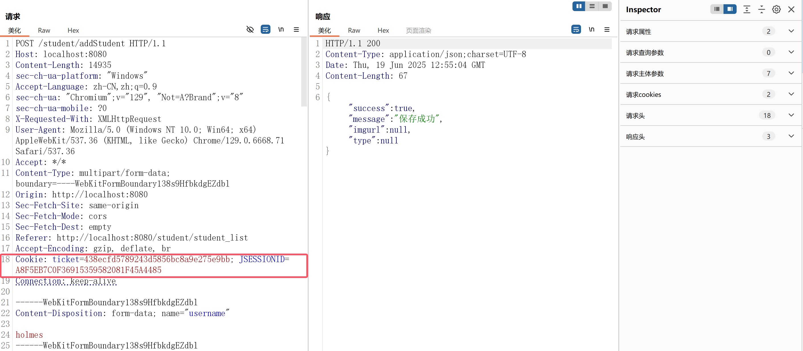

成功添加，刷新一下老师的学生列表页面

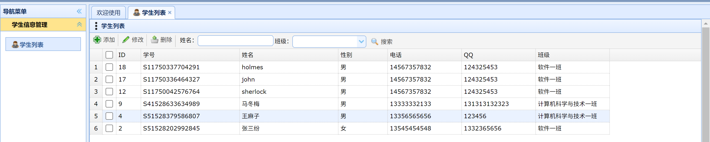

由于上面都是围绕添加学生这个功能点进行讲解，所以这里就再加一个功能点进行测试，经过一定的审计后选的是审核请假条的功能点

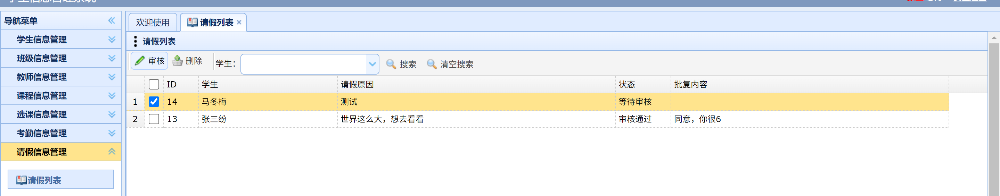

选中审核，点击提交，进行拦截

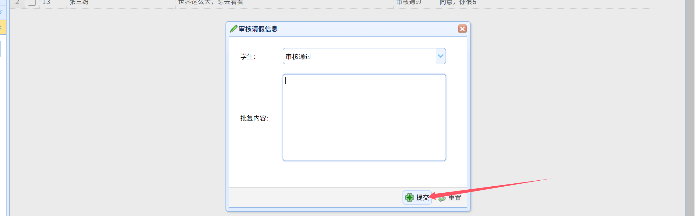

发送到重放器，修改cookie值，发送，却直接302跳转到了登录界面

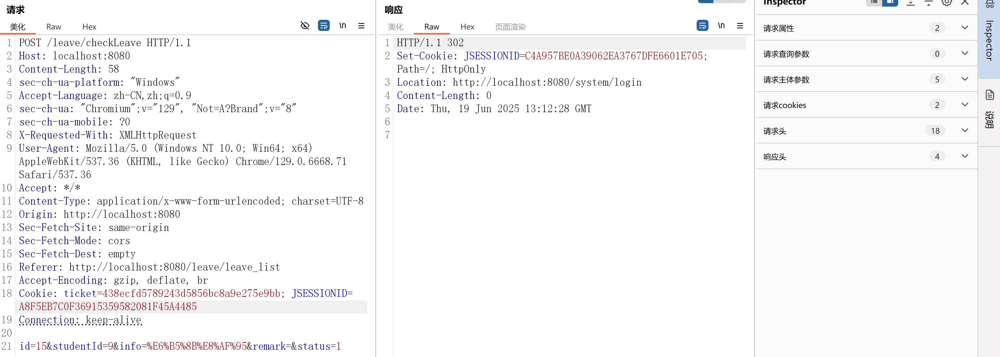

咦，这是怎么回事，一开始我以为问题出在审批的sql语句中有需要教师身份的地方，但由于我们是学生身份所以sql语句执行不成功

在LeaveController.java的checkLeave方法中一直跟到底层的sql语句处

```
    <update id="checkLeave" parameterType="Leave">
        update s_leave set student_id = #{studentId},info = #{info},status = #{status},remark = #{remark} where id = #{id}
    </update>
```

可以发现并不是像我想的那样，那应该就是cookie过期了，位于SystemController.java中的logout方法的代码证明了我的猜想

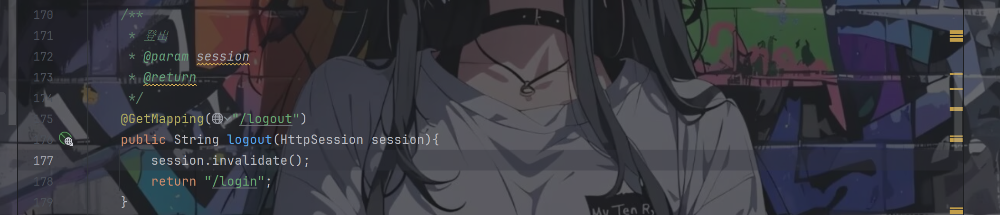

一旦我登出之后cookie便过期了，也就是说在我们进行越权的过程中，学生账号不能退出

重新登录了一个学生账号，再次修改cookie，响应“审批成功”

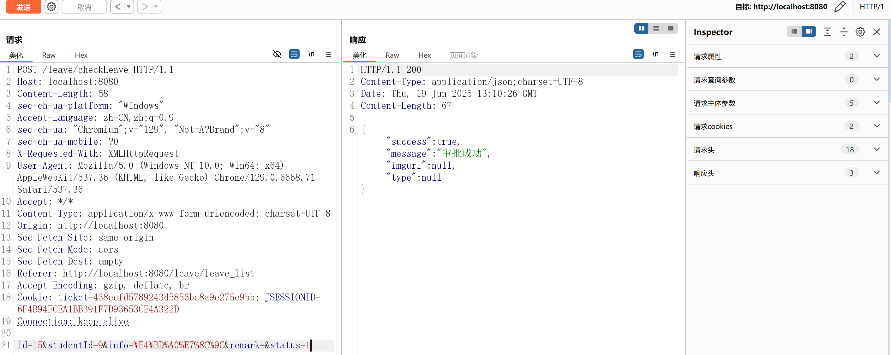

经过测试，除了几个特定的方法之外，剩下的学生与老师间，老师与管理员间都是可以进行垂直越权的

# 总结

总而言之，该项目的审计难度不大，项目结构比较简单清晰，代码逻辑也比较容易理解，并没有封装很多层，所以关键就在于审计的思路

希望我的审计思路能够对读者们有一定的帮助

这个项目的审计到这里就结束了，笔者一共就只挖出了上面几个漏洞，如果还有人挖出了更多的欢迎和笔者进行交流
