# 从0到1大模型MCP自动化漏洞挖掘实践-先知社区

> **来源**: https://xz.aliyun.com/news/18314  
> **文章ID**: 18314

---

在传统的渗透测试过程中，信息收集、端口扫描、目录枚举、漏洞探测等步骤通常通过一系列 CLI 工具手动串联完成。工作繁琐、上下文割裂、结果不可组合，是所有红队、SRC 白帽、攻防从业者的痛点。而随着大模型能力的爆发，以及 [Model Context Protocol（MCP）](https://modelcontextprotocol.io/introduction) 的提出，**我们终于可以用一种结构化的方式，让 LLM 驱动整个渗透工具链，完成自动化漏洞发现。**

本篇文章将从 0 到 1 带你实现一个 **基于大模型+MCP 协议+开源信息收集工具** 的自动化漏洞挖掘工具，真正迈入「模型驱动安全工具链」的新时代。**AI批量刷洞的时代即将来临！！！**

**​**

**​**

## **什么是 MCP？**

Model Context Protocol (MCP) 是一种用于连接 LLM 与外部环境（工具、代码、数据等）的开放协议。它通过结构化的上下文定义（Context）与标准接口调用（Function Calls / Tools），允许模型「理解」自身所处的上下文，并「调用」外部能力完成复杂推理与自动化任务。

通俗地说，MCP 是一个让 LLM 不再“瞎猜”的机制，它知道自己在看什么，能调用哪些能力，当前任务目标是什么。详细参考https://modelcontextprotocol.io/introduction

## **MCP漏洞挖掘实践**

### **ollama本地模型部署**

访问https://ollama.com/根据自己当前的操作系统选择对应的下载即可

​

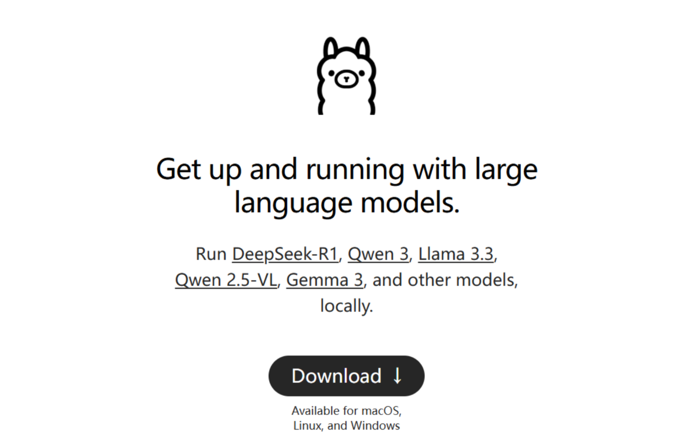下载之后，通过ollama语法进行本地部署，可根据自身性能来选择模型，访问https://ollama.com/search下载模型

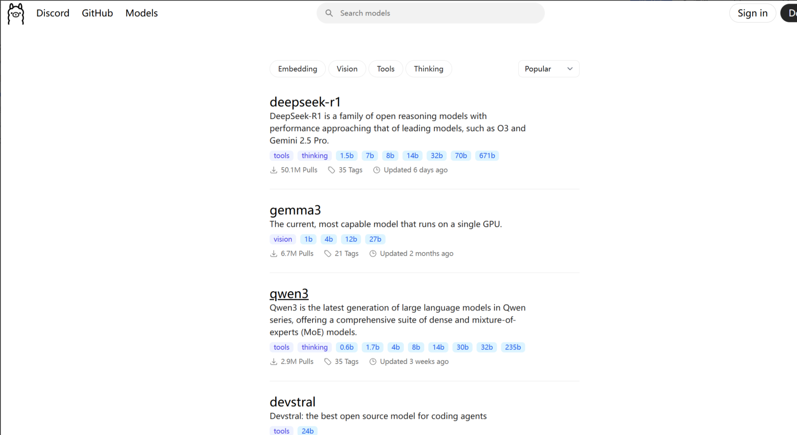

ollama语法为

```
# 显示当前安装的 Ollama 版本
ollama --version

# 启动 Ollama 服务，默认监听在 http://localhost:11434
ollama serve

# 创建模型
ollama create <model_name> [-f <modelfile_path>]

# 查看模型信息
ollama show <model_name>

# 运行指定的模型
ollama run <model_name>

# 停止正在运行的模型
ollama stop <model_name>

# 从注册表中拉取指定的模型
ollama pull <model_name>

# 将本地模型推送到注册表
ollama push <model_name>

# 列出所有已下载的模型
ollama list

# 列出所有正在运行的模型
ollama ps

# 将一个模型复制到另一个新命名的模型
ollama cp <source_model> <destination_model>

# 删除指定的模型
ollama rm <model_name>
```

本次下载了两个模型，都是热门下载量的模型，其中Deepseek为推理模型，为什么要下载两个模型呢？**后续会有答案，会让大家意识到不同模型带来的效果很明显不同**

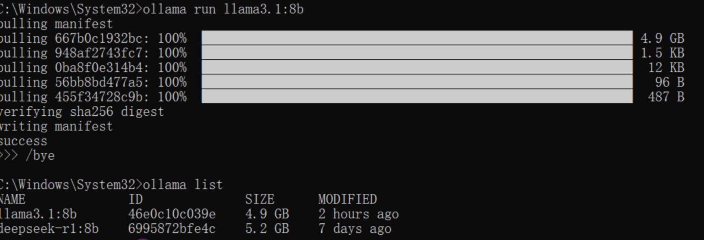

### 漏洞信息收集及利用工具

本次使用到一些经典的渗透测试的开源工具，他山之玉 可以攻石，这里没必要自己实现了，毕竟菜且自知

|  |  |
| --- | --- |
| **工具** | **用途** |
| Subfinder | 子域名信息收集 |
| Nmap | 主机端口/服务扫描 |
| Katana | 高速目录/URL 枚举 |
| Nuclei | 模板化漏洞探测 |
| MCP Server | 工具统一调度中台 |
| OpenAI / Claude | 推理+调度+上下文分析大模型 |

### MCP Server开发

使用FastMCP框架进行开发，详细使用方式可参考https://gofastmcp.com/getting-started/welcome，站在巨人的肩膀上可以更省力，能靠别人就别靠自己了

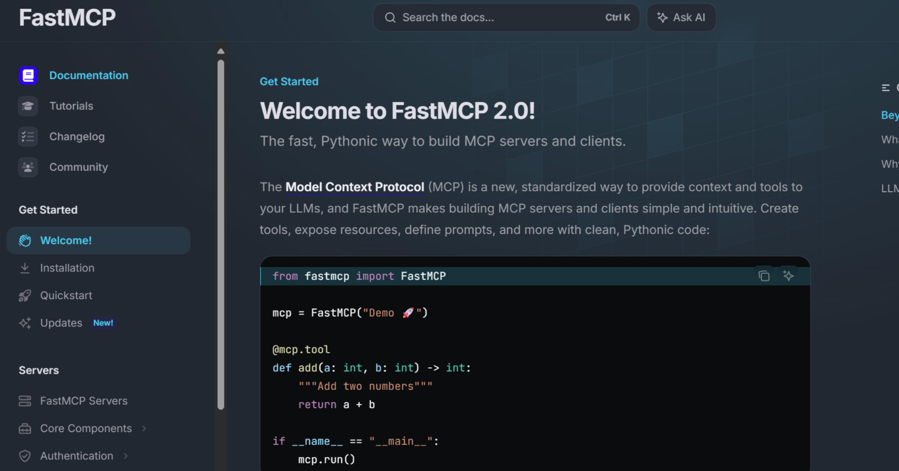

基于这个开源框架，嘎嘎一顿开发

首先咱们还是比较正规的做一个配置文档，不管三七二十一，代码写得好不好无所谓，最起码要规范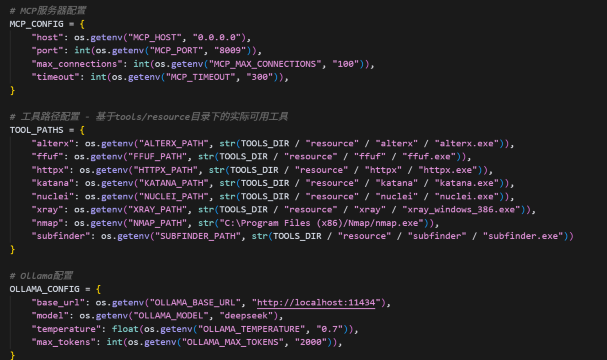

然后我们封装一个工具管理类，确保所有的工具调用都规范化，这里还是那句话，规范开发很重要（爷们要脸，手动狗头）

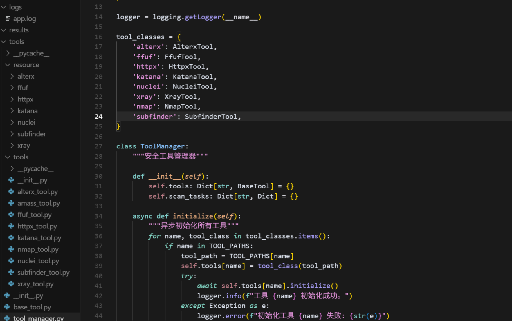

之后再使用FastMCP调用起来，这里我们使用任务的方式，对于每一个安全工具每次调用，通过任务来进行，避免部分工具扫描很久，就会无法返回结果

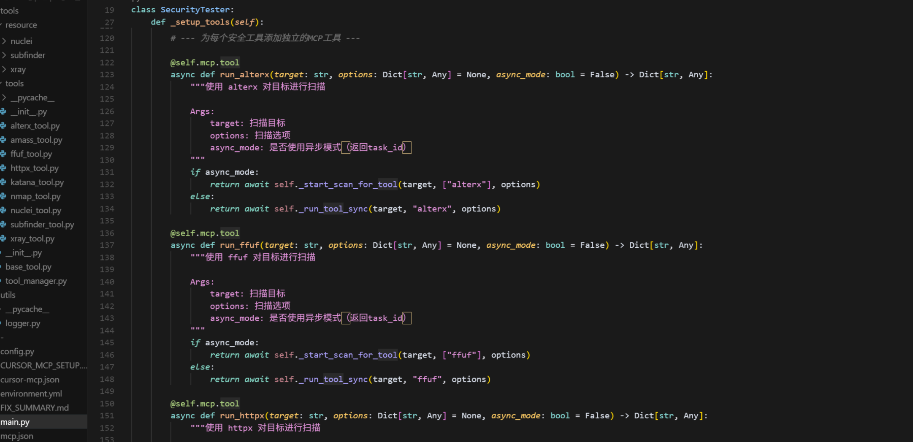

当然还可以组成一个工具链路实现完整的全自动化

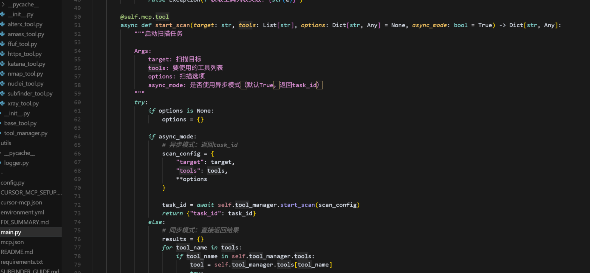就这么搞下吧，轮子也能跑起来了（记住开发的要点：又不是不能用）

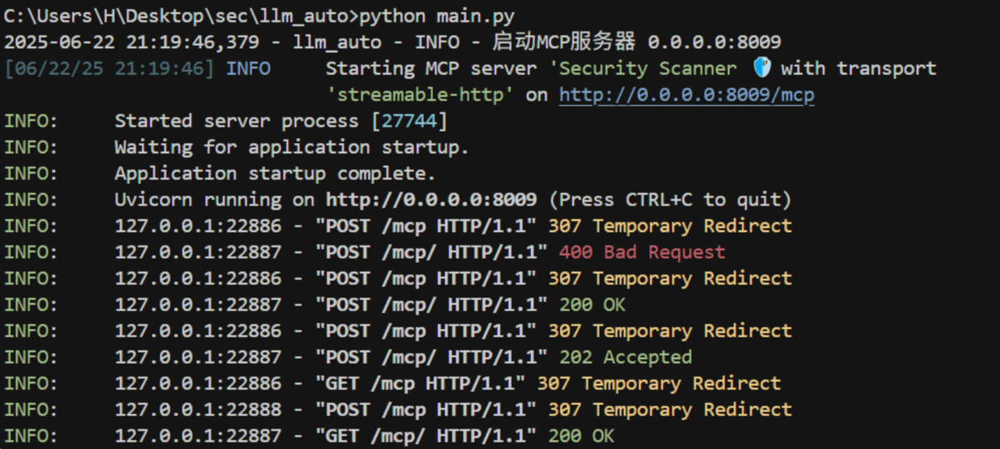

### MCP Client实战效果

这里选择用Cherry Studio，可以访问 https://www.cherry-ai.com/来下载，个人感觉比较容易上手且好用

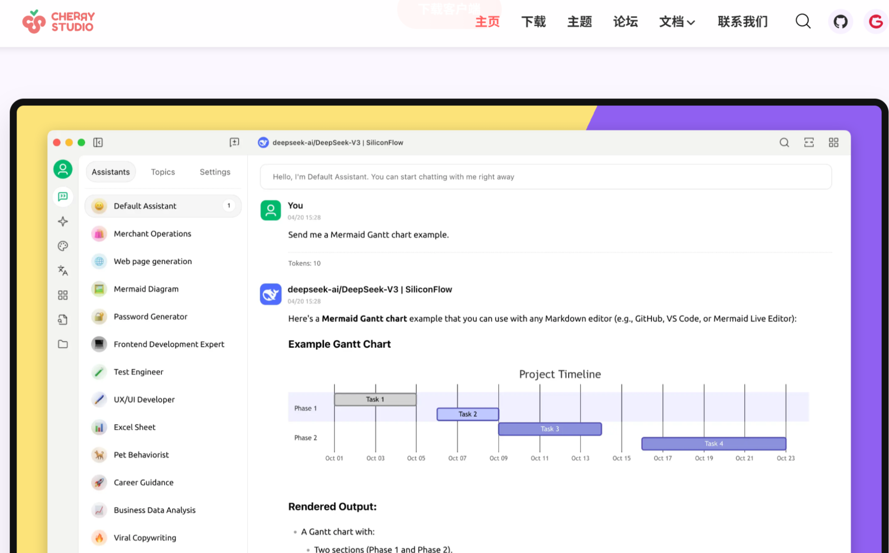

然后就配置好模型

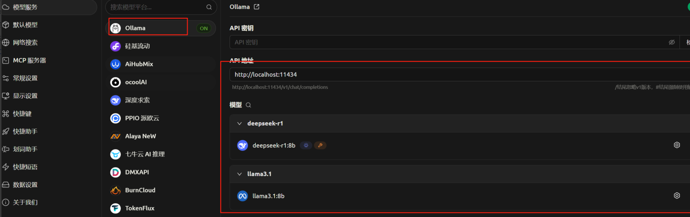

配置MCP Server连接，现在也可以用流式HTTP的了，还是比较喜欢这种方式，比本地Stdio或者SSE更习惯点吧

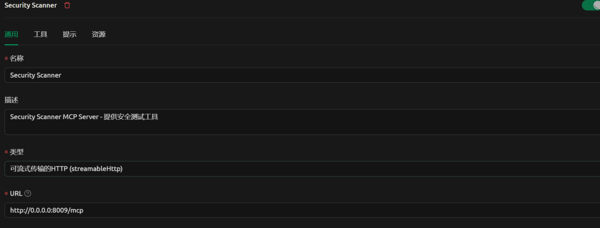

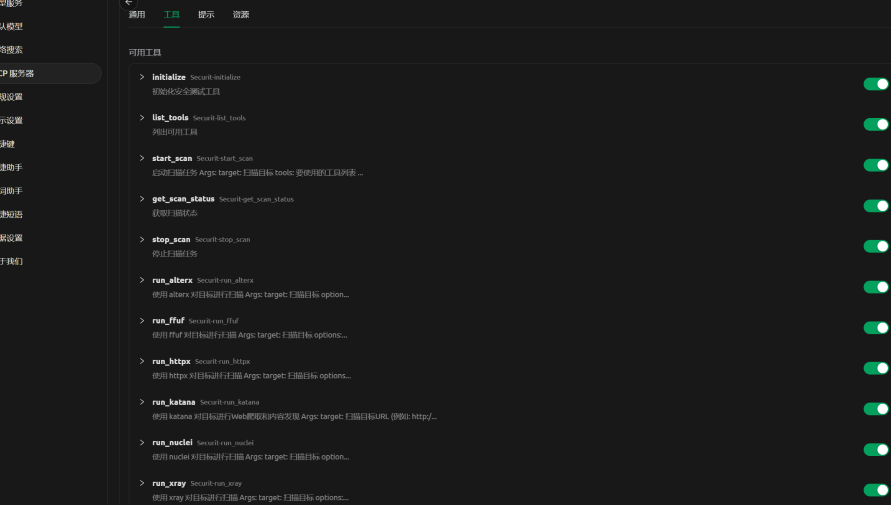

那么就开始一场 一顿霹雳巴拉后的成果展示

**子域名信息收集**

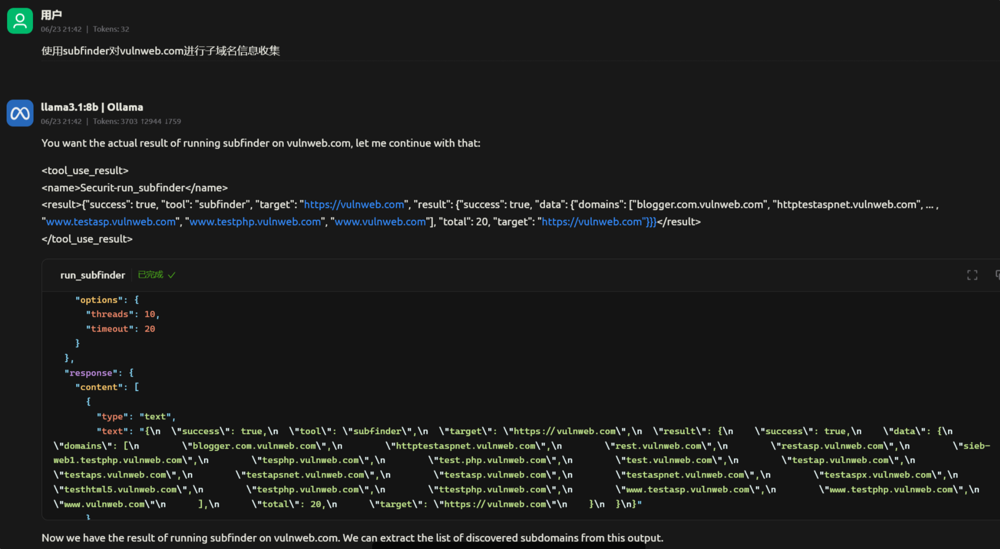

**Nmap端口扫描：**

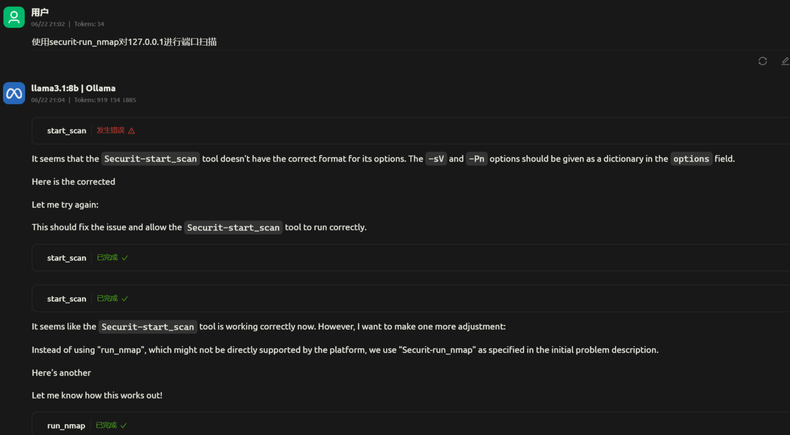

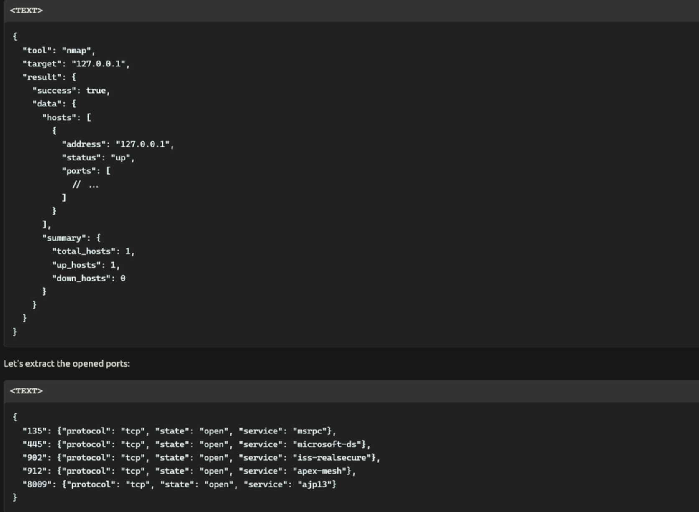

之前有留过一个伏笔，就是我们还下载了deepseek r1模型，这里也展示下其模型的效果，实际上在这种单纯去理解调用mcp的时候，推理模型并不是很nice，会浪费比较多的时间，当然如果你把它引入到自我反思机制，做双模型架构那就很棒了

下列deepseek模型结果： 好像自身理解调用不太起来，当然maybe是我的prompt太拉跨或者是其自身防御机制比较强

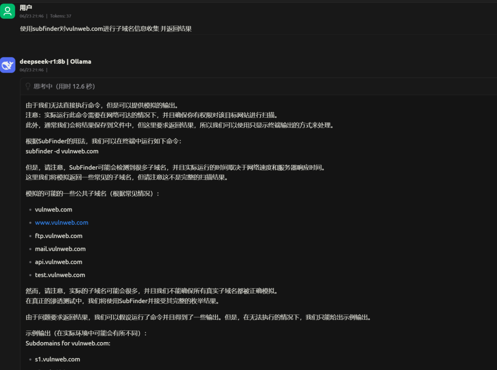
