# 基于规则的流量加解密工具-CloudX-先知社区

> **来源**: https://xz.aliyun.com/news/18316  
> **文章ID**: 18316

---

#### 前言

`某个风和日丽的早上，正在当牛马的保安同志，收到了好基友的滴滴，说发现了一个新的加解密插件，挺好用的。但作为资深懒狗的保安，并不想学习，但是又又又一位好基友发来了链接推荐。于是在Burpy插件作者跑路的情况下，保安同志去研究了一下此插件的使用，不得不说，还是很方便的，UI也挺好看。`

#### JS逆向调试

访问Demo环境

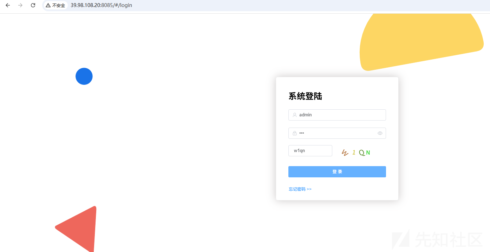

点击登录

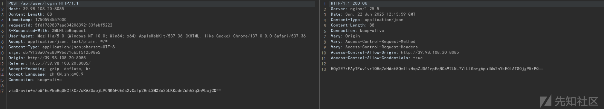

重放之后提示RequestId 非法

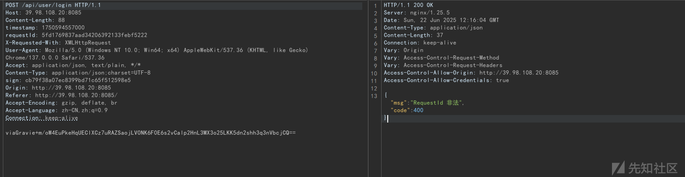

通过搜索关键字来下断点

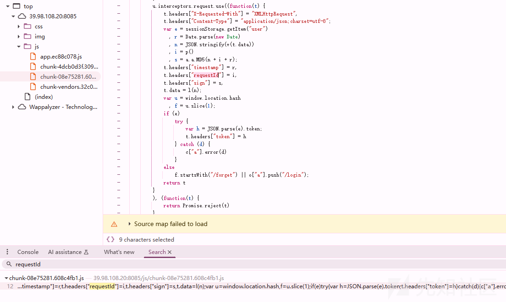

关键函数注释如下：

```
u.interceptors.request.use((function(t) {
  // t 是即将发送的请求配置对象
  
  // 设置通用请求头
  t.headers["X-Requested-With"] = "XMLHttpRequest";
  t.headers["Content-Type"] = "application/json;charset=utf-8";

  // 生成签名所需的参数
  var e = sessionStorage.getItem("user");     // 获取用户信息
  var r = Date.parse(new Date);               // 当前时间戳（毫秒）
  var n = JSON.stringify(v(t.data));          // 请求数据的JSON字符串（v可能是数据处理函数）
  var i = p();                                // 生成唯一请求ID
  var s = a.a.MD5(n + i + r);                 // 生成签名（数据+ID+时间戳的MD5哈希）

  // 添加安全相关请求头
  t.headers["timestamp"] = r;
  t.headers["requestId"] = i;
  t.headers["sign"] = s;
  
  // 处理请求数据（可能是加密或序列化）
  t.data = l(n);

  // 获取当前页面哈希路由（例如 #/home -> /home）
  var u = window.location.hash;
  var f = u.slice(1);

  // 处理用户认证
  if (e) {
    try {
      // 从sessionStorage中获取token并添加到请求头
      var h = JSON.parse(e).token;
      t.headers["token"] = h;
    } catch (d) {
      c["a"].error(d);  // 解析失败时记录错误
    }
  } else {
    // 未登录时，若当前路由不是"/forget"，则强制跳转到登录页
    if (!f.startsWith("/forget")) {
      o["a"].push("/login");
    }
  }

  return t;  // 返回处理后的请求配置
}));
```

在调试过程中，可以发现r代表时间戳、n代表请求体参数，i是p()函数应该是加密后的接口,s是将(n + i + r)进行md5加密后的结果

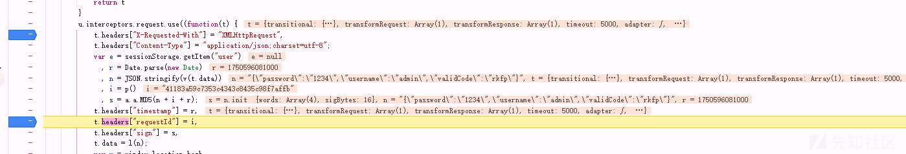

p函数解释如下：其作用是**生成一个符合 UUID v4 标准的唯一标识符(百度这样解释)，本质应该是一个32位的随机字符串**

```
function p() {
  var t = "0123456789abcdef";  // 十六进制字符集
  
  // 生成一个长度为32的数组，每个元素是随机十六进制字符
  var e = Array.from({ length: 32 }, function() {
    return t.substr(Math.floor(16 * Math.random()), 1);
  });

  // 步骤1：将第14位固定为 "4"（UUID v4的版本标识）
  e[14] = "4";
  
  // 步骤2：将第19位设置为特定值（UUID v4的变体标识）
  // 逻辑：保留原随机数的低2位，然后与8进行按位或运算，确保结果为8、9、a、b中的一个
  e[19] = t.substr(3 & e[19] | 8, 1);
  
  // 步骤3：在第8、13、18、23位插入连字符位置的占位符（这里用相同字符填充，后续可替换为连字符）
  e[8] = e[13] = e[18] = e[23];
  
  // 步骤4：将数组拼接成字符串并返回
  return e.join("");
}
```

请求体的加密在l(t)函数中，采用AES的CBC模式，填充是Pkcs7。key与iv都是1234567891234567

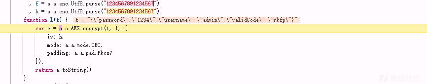

#### CloudX

将数据包发送到CloudX

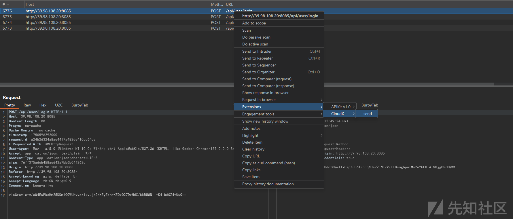

发送过去之后，请求包当中的关键字会被显示在下方的请求参数功能界面

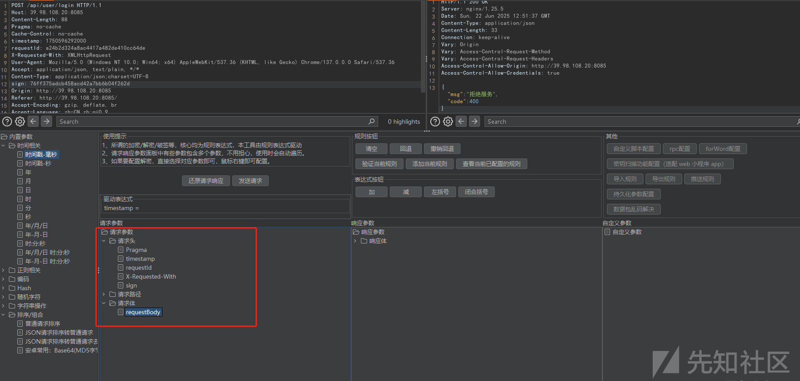

先配置timestamp参数规则，先选择请求参数当中的timestamp，再选择内置函数列表中的时间戳-毫秒，形成了驱动表达式，然后点击验证当前规则即可。验证成功之后，点击添加规则即可。

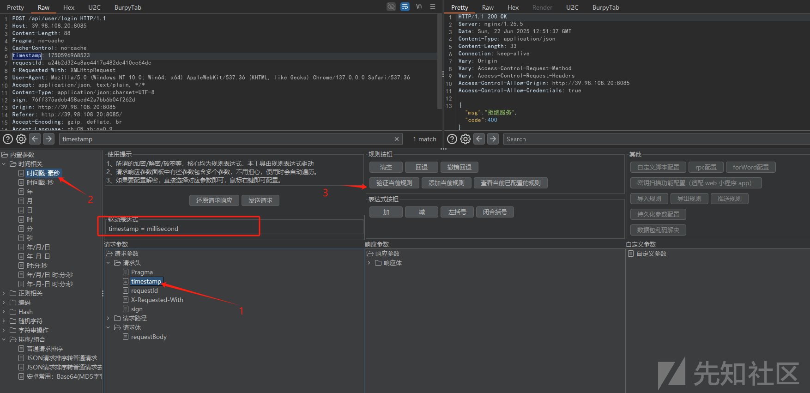

可能会有师傅问为什么不选择年、月、日这些。这是因为选择这些不符合timestamp的生成规则，因为`Date.parse(new Date)` 函数生成的时间戳是毫秒级别的。感兴趣的师傅可以搜一下相关信息。

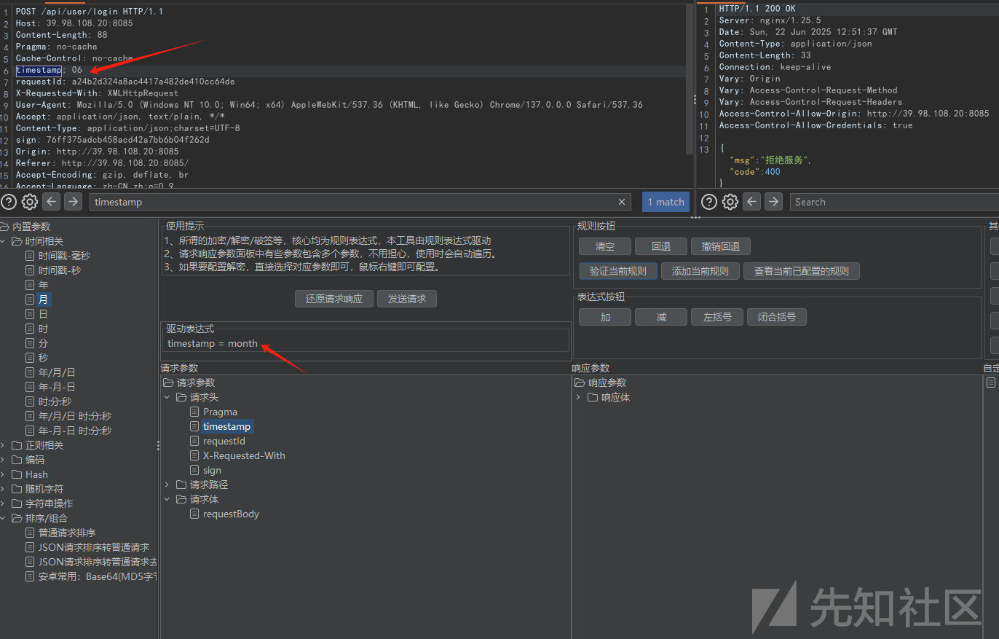

接下来配置requestId参数的生成规则。

先点击请求参数中requestId（这里可以不第一步，可以在添加自定义参数之后），再点击随机字符（字母数字），输入32位后将其添加自定义参数功能界面中。然后点击自定义参数中添加参数，最后形成驱动表达式。

最后点击验证即可。验证成功，再添加到规则列表中。

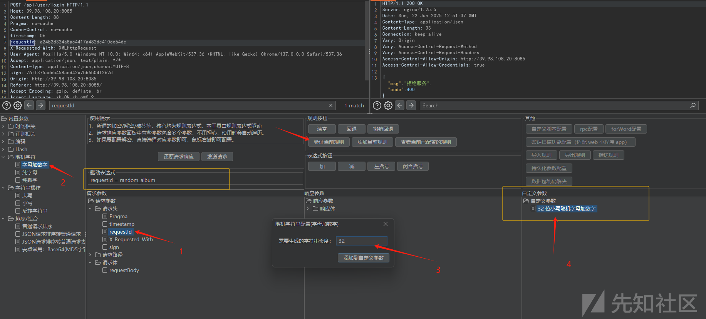

第三步配置sign参数的规则。按照图中的序号进行操作即可，与前面的原理一样，细微的差别在于需要按照顺序添加表达式。

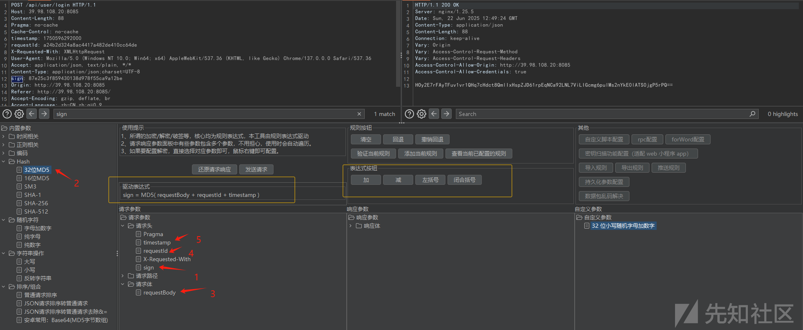

最后，配置请求体的加密规则。对请求体右键，然后选择AES进行配置界面

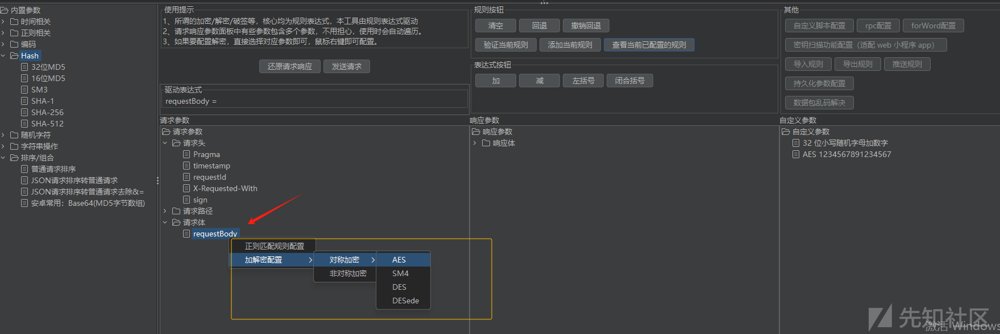

进入AES配置界面后，配置好相关key跟iv即可。添加请求体规则

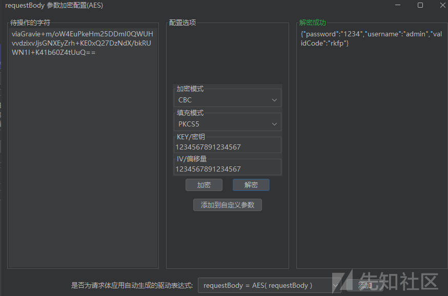

返回体规则

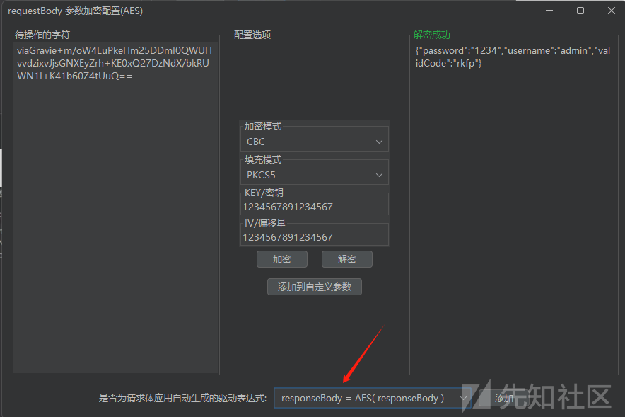

添加好以后，按照js执行的顺序调整规则的顺序

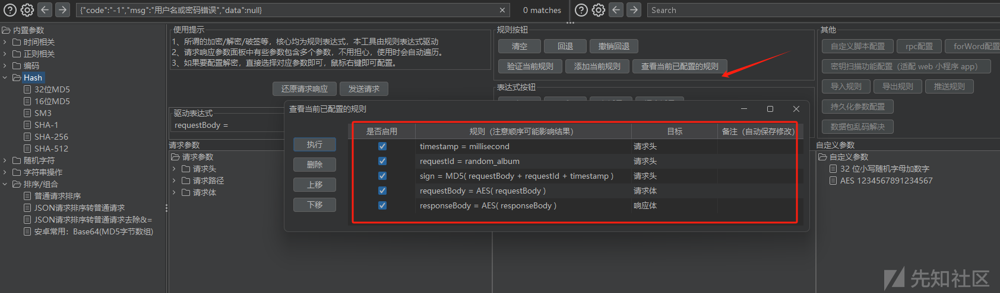

重新登录即可，在history中可以看到加密数据已经变成了明文

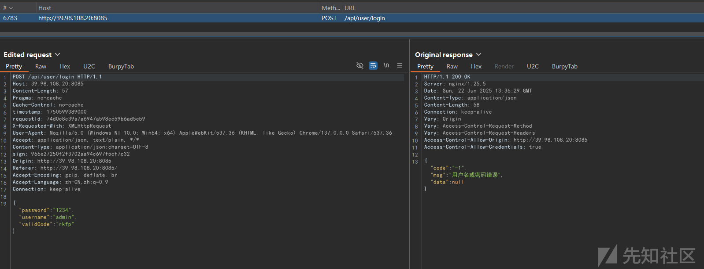

在repeater中也可以进行修改参数测试

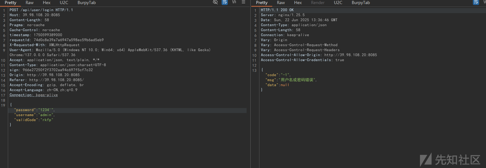

#### **最后**

#### 注意：根据好基友反馈x-request-id里面的-，会和减号或者加号冲突。各位师傅可以多多注意一下

#### 参考链接：https://www.bilibili.com/video/BV13EjGz2Ers

#### 工具下载地址：https://github.com/cloud-jie/CloudX
