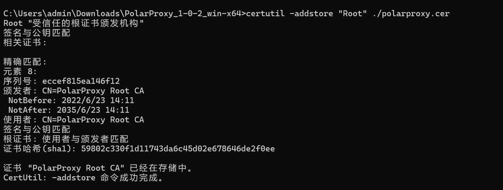
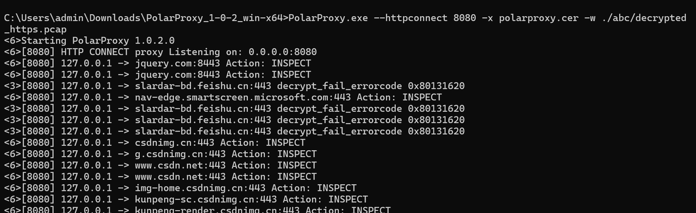
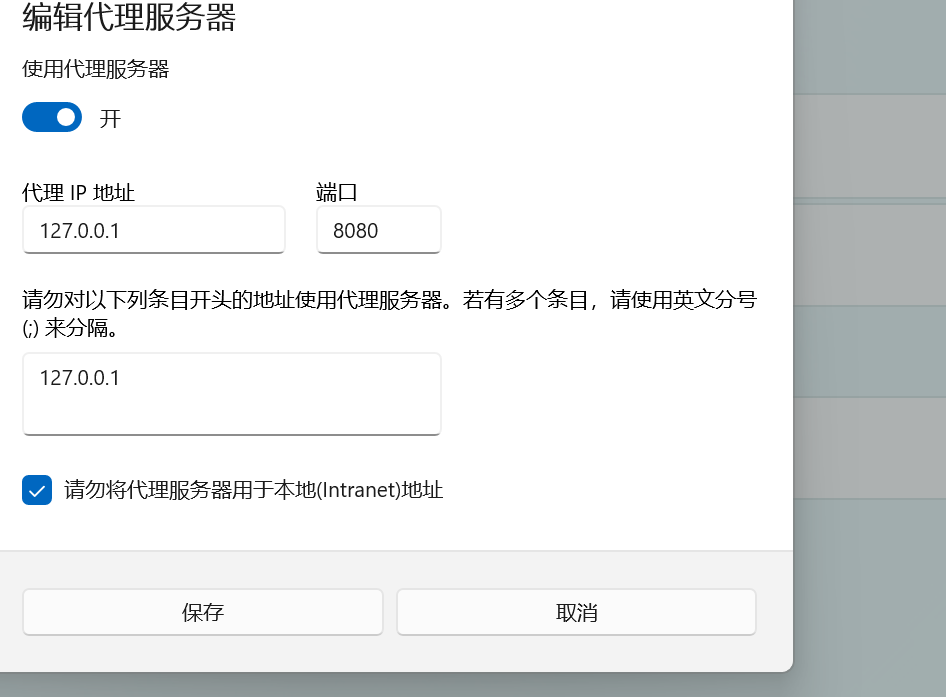
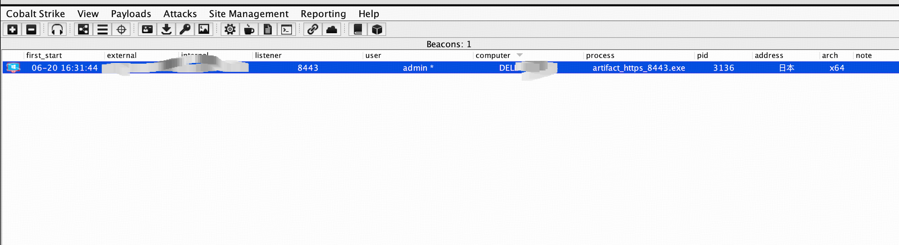
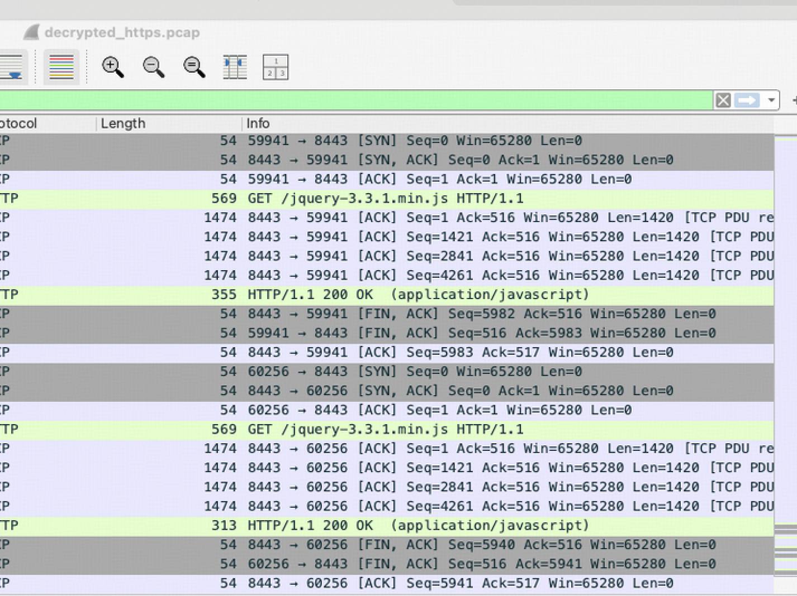
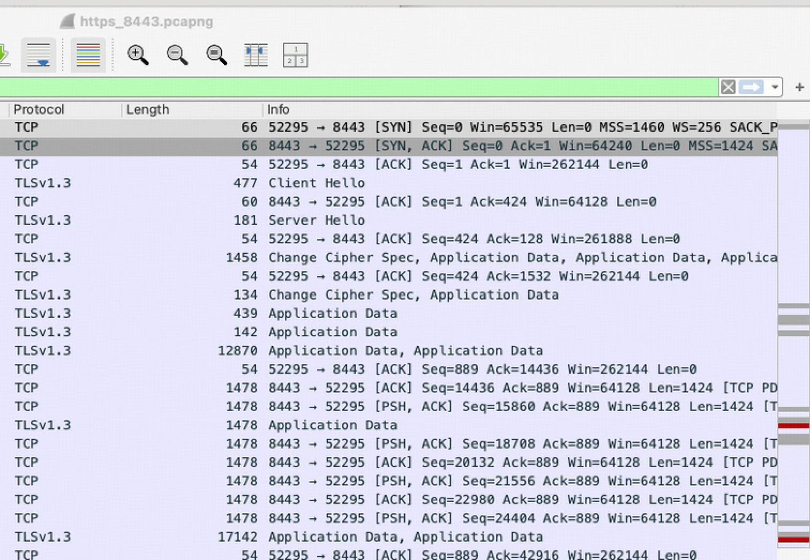
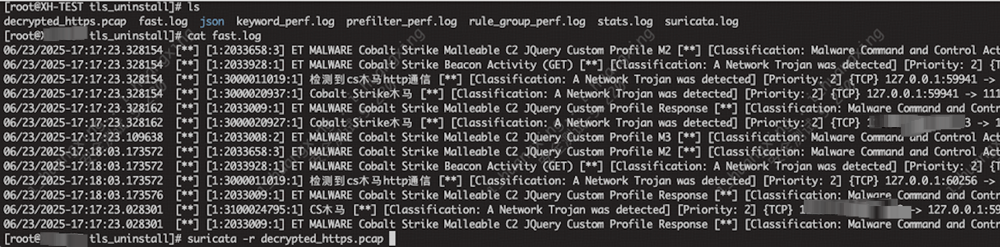
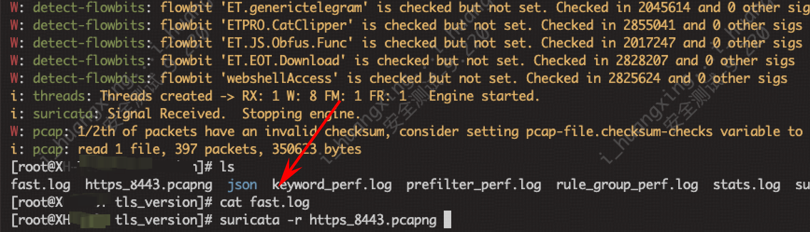

# 利用中间人做tls卸载实现C2检出-先知社区

> **来源**: https://xz.aliyun.com/news/18321  
> **文章ID**: 18321

---

### **实验前置：**

本实验使用基于 Cobalt Strike 4.5 二次开发版本的 cs\_cat 工具生成 HTTPS 加密通信样本。测试过程中，C2 客户端成功上线至服务器，且未做免杀处理，仅为原始样本。网络侧的 NIDS（Suricata）在默认配置下未产生任何告警与检出，表明常规 NIDS 对 TLS 加密下的 C2 通信无法实现有效识别。实验以此为基础，聚焦于流量侧的加密通信解析与检测能力提升。

### **实验整体思路：**

为应对 TLS 加密带来的流量检测盲区，本实验采用中间人方式对 HTTPS 流量进行透明代理与卸载。具体实现过程中，使用 PolarProxy 工具部署于客户端与外部服务器之间，通过 MitM（Man-in-the-Middle）方式对 TLS 通信进行解密，并输出为解密后的 pcap 数据包。随后，基于解密后的流量样本，利用 Suricata 等网络入侵检测系统进行规则匹配与行为分析，验证是否能够成功识别加密通道中的 C2 控制行为。该方案在不依赖客户端特征或主机行为的前提下，提供了一种通用、高效的加密流量检测路径。

### **PolarProxy**

PolarProxy官网：<https://www.netresec.com/?page=PolarProxy>

**PolarProxy** 是一个 TLS 解密中间人（Man-in-the-Middle, MitM）工具，专门设计用于**拦截、解密并分析 HTTPS 流量**。它通常用于 **安全监控**、**威胁检测** 和 **流量分析**。以下是 PolarProxy 的主要特点和功能：

#### 主要功能：

* **TLS 解密：** PolarProxy 可以拦截和解密 TLS/SSL 流量，通常用于分析加密的 HTTP(S) 流量（即 HTTPS）。
* **中间人代理：** 它充当客户端和服务器之间的中间人角色，将加密的流量解密为明文，并转发给分析工具（如 Wireshark、Suricata）。
* **支持的协议：** 支持处理 HTTP、HTTPS、SMTP、IMAP 等协议的加密流量。
* **透明代理：** 支持将流量通过透明代理方式处理，减少配置复杂性。
* **流量输出：** 处理后的流量可以输出为 **PCAP 文件**（Wireshark、tcpdump 可使用），也可以通过 **JSON** 格式输出结构化日志。
* **支持外部集成：** 可与 **Suricata**、**Zeek**、**Wireshark** 等安全监控工具集成进行深入分析。

### **Suricata**

**Suricata** 是一个开源、高性能的 **网络入侵检测系统**（NIDS）、**网络入侵防御系统**（NIPS）、**网络安全监控**（NSM）工具。它可以通过分析网络流量来检测并响应各种网络攻击。

#### 主要功能：

* **流量分析：** Suricata 支持分析各类网络流量，包括 IP 数据包、HTTP 请求、DNS 查询、SMTP 会话等。
* **入侵检测：** Suricata 可以检测各种攻击，如 **SQL 注入**、**XSS**、**DDoS 攻击**、**恶意 C2 流量** 等，基于预定义规则进行匹配。
* **协议解析：** Suricata 支持多种协议的解析，包括 HTTP、HTTPS、DNS、FTP、SMB、SMTP 等。
* **高性能：** Suricata 提供多核并行处理，支持高速流量的实时分析，适用于大规模网络环境。
* **告警与日志：** 当检测到可疑活动时，Suricata 会生成告警并记录相关信息。可以将告警与事件数据输出到 SIEM 系统（如 ELK 堆栈）。
* **多种输出格式：** 支持 **JSON**、**EVE JSON**、**pcap** 等多种格式输出，便于与其他工具（如 SIEM）集成。

#### 优势：

* **高性能：** Suricata 支持多核处理，可以处理高吞吐量的网络流量，适合大规模企业和高流量环境。
* **开源和社区支持：** Suricata 是开源的，拥有强大的社区支持，且定期更新。
* **高度可定制：** 用户可以根据需要编写自定义规则，并支持与其他安全工具（如 Zeek、Elastic Stack）集成。

### 实验步骤：

1. 安装证书

```
certutil -addstore "Root" path\to\polarproxy.cer
```



2. 利用PolarProxy指定证书并进行监听，指定输出pacp文件（这里仅仅为了方便使实验闭环，将代理起在受控终端，并输出为pcap包，企业级的方案应该是自建中间人代理服务器，并将流量输出到suricata服务器或者其他流量解析安全设备，而非输出成pcap）

```
PolarProxy.exe --httpconnect 8080 -x polarproxy.cer -w decrypted_https.pcap
```



3. 设置全局代理，将电脑本机流量代理到PolarProxy监听到8080端口（这里仅实验演示，具体实现可以使用虚拟网卡等方案）



4. 执行beacon并上线cs



5. 结束抓包并查看流量

以下流量是解密后的c2流量包：



这个是未解密正常上线的流量包：



### 解密后C2检测：

1. 再用NIDS规则库里已有的规则做二次验证。

1. 对已经做tls卸载了的有大量告警
2. 未解密的,未产生告警

​

​
