# Tomcat日志文件利用-先知社区

> **来源**: https://xz.aliyun.com/news/18325  
> **文章ID**: 18325

---

# 文件读取到getshell

## 文件读取

该案例来自某次攻防演练

信息收集，通过端口扫描的到某站https://xxxx:60119

访问网站，经典的开局登录框，测试一圈没有弱口令

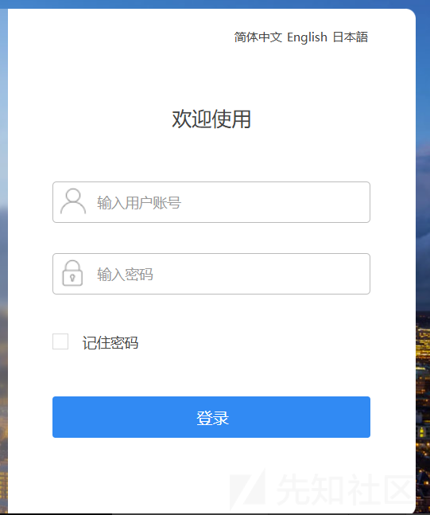

目录扫描，扫到file路径

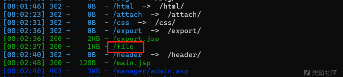

是一个soap wsdl接口

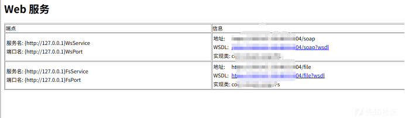

挨个访问，soap?wsdl所有接口都需要token才能使用，使用wsdler插件自动解析

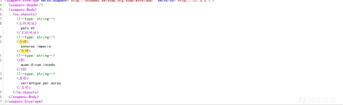

接着访问file?wsdl，不过bp插件在解析时出错。

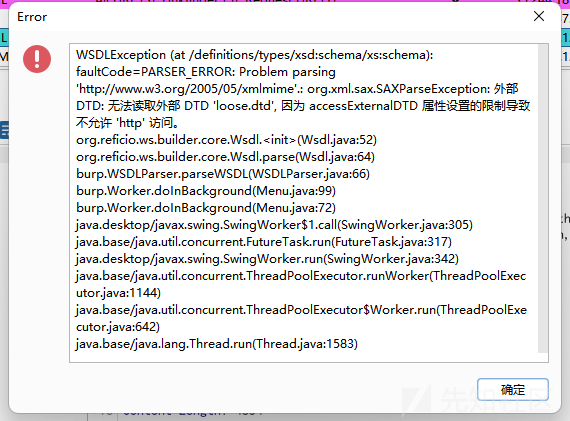

那就只能自己分析了。file?wsdl页面显示了存在的操作方法（看自己怎么称呼）

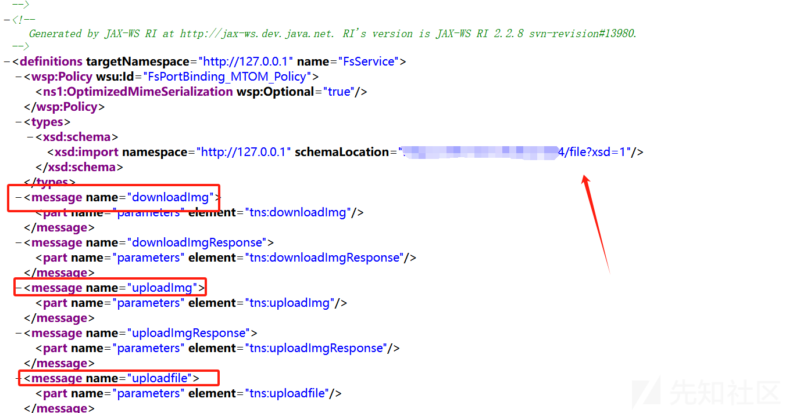

参数在file?xsd=1页面中

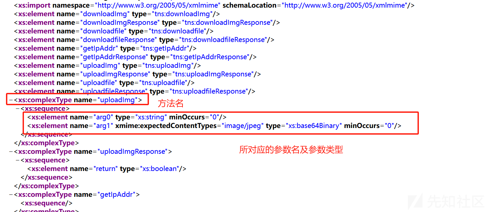

构造请求，读取到文件（读取前面文件上传接口上传文件）

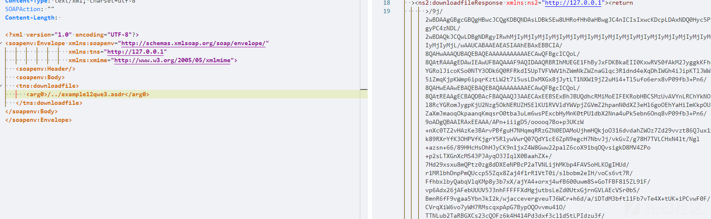

除了文件读取外还有文件上传，分别为上传图片和上传文件接口。上传文件接口需要认证，上传图片不用。

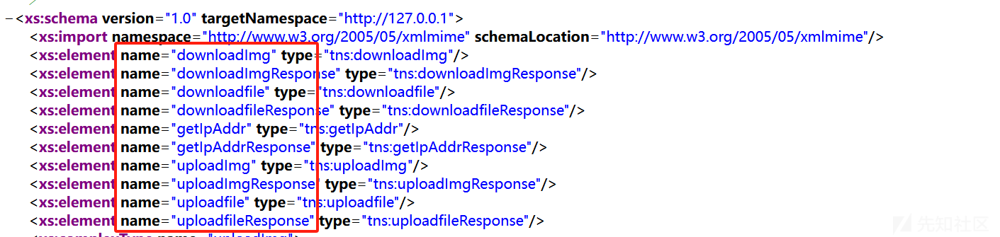

经过测试上传图片存在任意文件上传，并可以跨目录，但是会验证文件内容是不是一个图片。

经过测试使用图片马和将内容写入到图片中都失败，在这里也是卡了很久。

## 供应商源码结构分析

所以这里只剩下利用文件读取做点事情了。刚开始通过读取../../../../WEB-INF/web.xml的方式都不行（这里可能不使用web.xml配置），找到不文件。

系统应该将文件上传路径放到web目录之外去了，所以要知道web目录所在位置。猜了很久一直没有猜出来，通过前面目录扫描出来的一些页面找到该系统的供应商，从供应商下手。

这里我源码获取的方式有：

1. 从供应商获取如gitlab --> 失败
2. 同类型站点 --> 失败
3. github源码，gitee源码，搜索引擎等源码泄露 --> 失败
4. 各种网盘 --> 伪成功

最后通过云盘搜索找到供应商的系统，不是目标系统的源码。

搜索思路：公司名、域名、域名名称（没有.com）、系统名称，通过域名名称（没有.com）找到供应商另外的一套系统

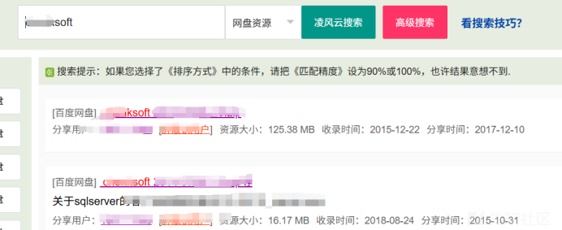

去咸鱼找个vip账号下载。目录结构如下

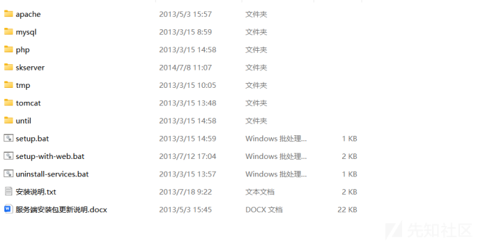

到这里知道系统集成一些了中间件，源码结构信息。这里还可通过源码寻找一些默认账密信息等。

系统为了便捷直接集成了很多中间件部署，客户端部署可以直接开箱即用。知道了目录结构信息，我就直接../../读取中间件的配置信息，我这里尝试读取mysql/my.ini成功读取到了（这里还尝试了如setup.bat这类文件）。

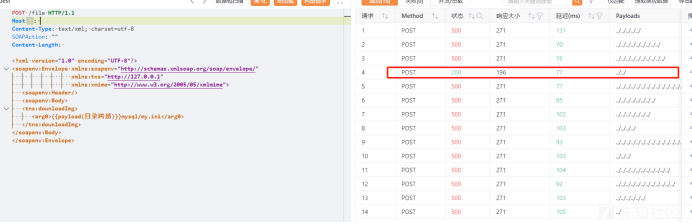

在根据另一套系统的命名结构获取到tomcat所在目录tomcat\RUNNING.txt

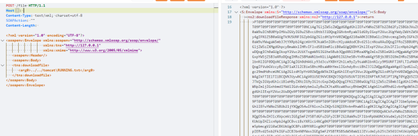

知道了tomcat所在位置，那么下一步就是要查看tomcat部署了那些工程（也就是网站）。读取那个文件呢？conf/server.xml，ai给出答案

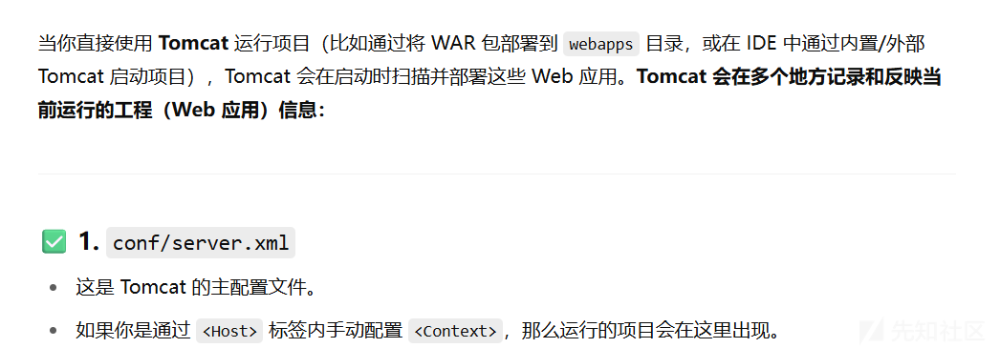

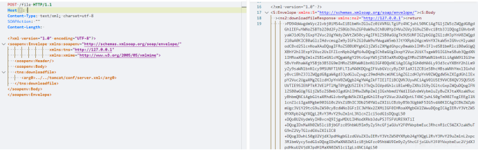

解码后内容如下，部署时修改了默认的webapps目录改为webapp

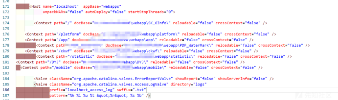

知道了网站部署路径就能愉快的读取配置文件，还有网站文件。但是读取一圈下来发现都没啥用，难蚌啊。配置文件读了，jsp文件读了，核心jar包不知道在哪，一时之间陷入迷茫，差不多放弃了。

## Tomcat日志文件利用

最后想想读一下日志文件吧，日志文件还记录了访问的路径，可能存在未知的文件。tomcat日志文件保存至tomcat所在目录的logs文件夹下，打开本地的tomcat日志所在目录，日志格式如下

localhost\_access\_log.2024-03-22.txt

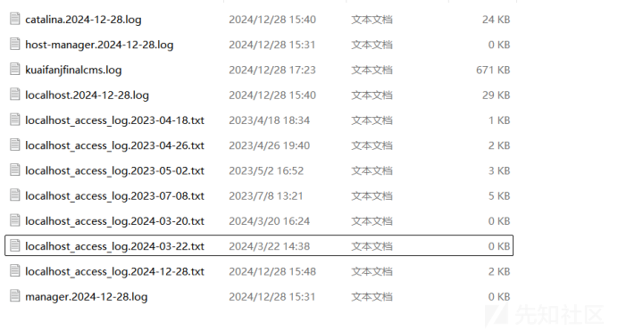

经过漫长筛选，在某天的日志中存在get传递token

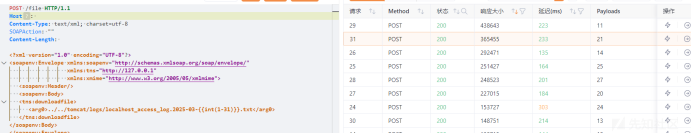

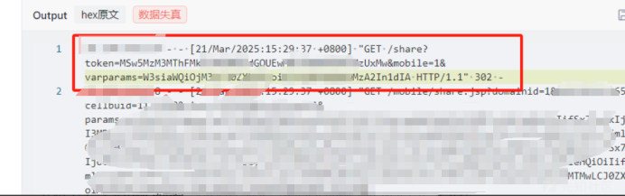

利用该请求直接登录到后台中


到了后台就是经典的任意文件上传了，上传图片修改为jsp后缀看一下解不解析

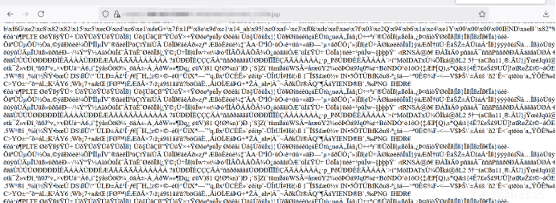

总结：

任意文件读取猜测不到网站路径时，通过供应商部署网站的习惯寻找出路，很多系统都会配置对应的中间件，遇到可以尝试枚举一下setup.bat、mysql/my.ini这类文件。我之前没遇到过在这里花费了较多时间。

# server.xml配置导致根目录映射错误

在上面案例遇到后不久，又遇到类似的情况。先看漏洞发现与利用。

## 目录扫描

在某次众测中，对资产进行目录扫描时发现bin、conf、logs等相关目录。如果没经历上面文件读取漏洞经历我可能会认为其就是普通的目录，不会往tomcat目录文件结构方面想。后面通过读取访问日志发现其他人在扫描时就是认为其为普通目录对bin，conf等目录进行扫描

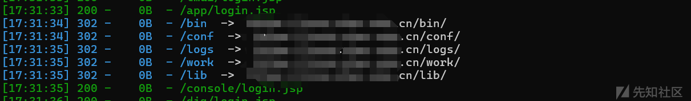

经过上面漏洞利用可知，网站就是因为配置错误导致的web根目录被设置到tomcat目录下。到这里我们依然可以通过读取配置文件，读取日志文件对网站进行漏洞探测。

## 配置文件读取

先读取conf/server.xml获取到tomcat工程的绝对路径。

直接读取403，是因为网站配置文件中对conf等相关路径做了限制，与无法读取WEB-INF/web.xml类是

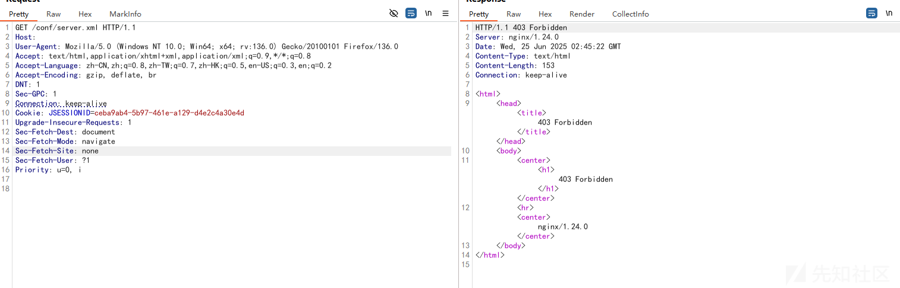

这里可以使用/;/conf/server.xml进行绕过，这样就匹配不上拦截规则了。成功读取到server.xml

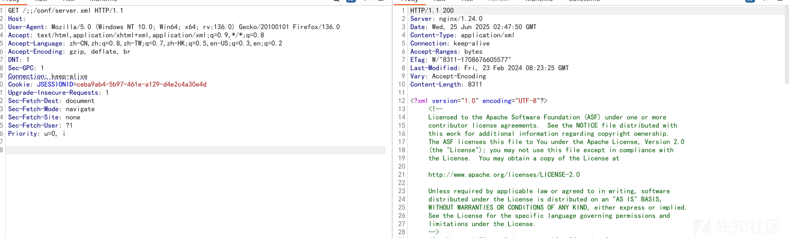

通过查看server.xml，tomcat只部署了一个工程，网站路径指向D://xxx/xxx/tomcat8/webapps-two/zzxxx目录下，而网站根目录在D://xxx/xxx/tomcat8/下

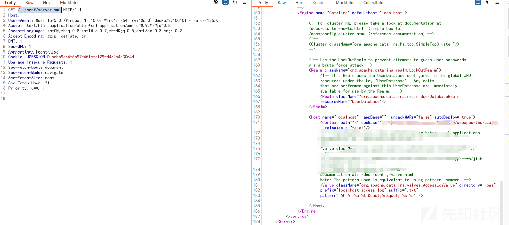

既然知道了工程路径，那么就读取一下配置文件`webapps-two/zzxxx/WEB-INF/web.xml`，可以发现404，意味着网站没有使用web.xml进行配置。

可能大家会有疑惑tomcat部署的网站不都需要web.xml进行配置吗？为什么这里没有使用？

我第一会遇到是也挺疑惑的，后面查询资料与本地测试发现web.xml是可以省略的。

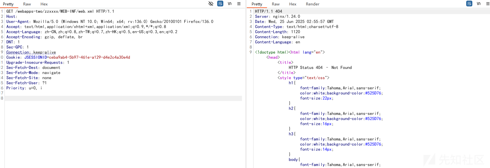

既然没使用web.xml配置，那么肯定会使用其他文件配置吧，不至于在代码硬编码吧？

通过访问网站猜测后端大概里是使用spring且使用了shiro框架。既然使用了spring和shiro那应该有相关配置文件。

下面是一些可能存在的文件（来自于某系统）

```
WEB-INF/classes/application.yml
WEB-INF/classes/ehcache.xml
WEB-INF/classes/log4j.properties
WEB-INF/classes/mybatis-config.xml
WEB-INF/classes/resources.properties
WEB-INF/classes/short-msg-config.properties
WEB-INF/classes/stencilset.json
WEB-INF/classes/voice-msg-config.properties
WEB-INF/classes/wbb-config.properties
WEB-INF/classes/web.properties
WEB-INF/classes/weixin-config-third.properties
WEB-INF/classes/weixin-config.properties
WEB-INF/classes/weixin-error.properties
WEB-INF/classes/spring/ApplicationContext-activiti.xml
WEB-INF/classes/spring/ApplicationContext-cxf.xml
WEB-INF/classes/spring/ApplicationContext-dataSource.xml
WEB-INF/classes/spring/ApplicationContext-main.xml
WEB-INF/classes/spring/ApplicationContext-mvc.xml
WEB-INF/classes/spring/ApplicationContext-redis.xml
WEB-INF/classes/spring/ApplicationContext-schedule.xml
WEB-INF/classes/spring/ApplicationContext-shiro.xml
```

`WEB-INF/classes/application.yml`读取到了内容，知道了鉴权配置、日志配置、文件存储等相关信息，没有shiro key和云相关内容 [流泪] 。

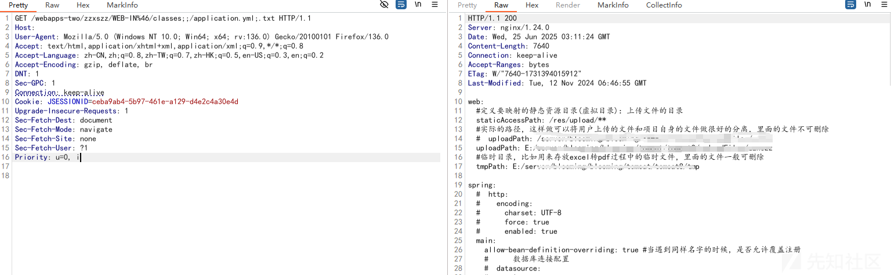

最后看了一下没啥可用的东西，将目光瞄准日志文件。

## 日志文件读取

这里日志文件可以分为tomcat的日志和网站日志（代码实现）。tomcat日志都在logs目录下，经过分析没有可用信息。转向网站自身记录的日志，那么网站自身实现的日志在哪里呢？

还是从application.yml下手，在配置文件中指向了logback-spring.xml

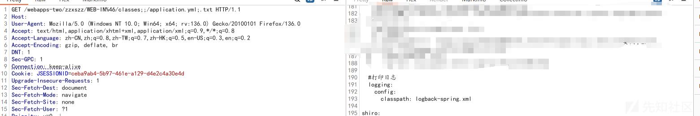

读取logback-spring.xml文件

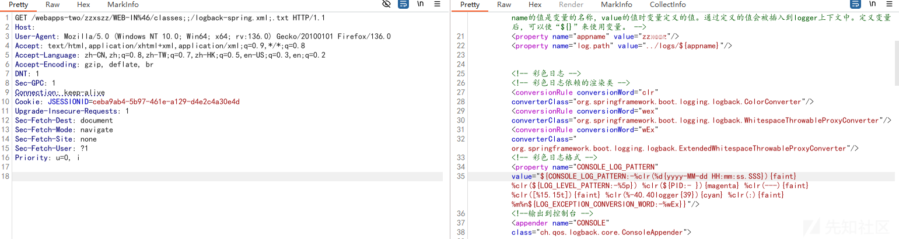

内容过于繁杂，直接丢给ai分析

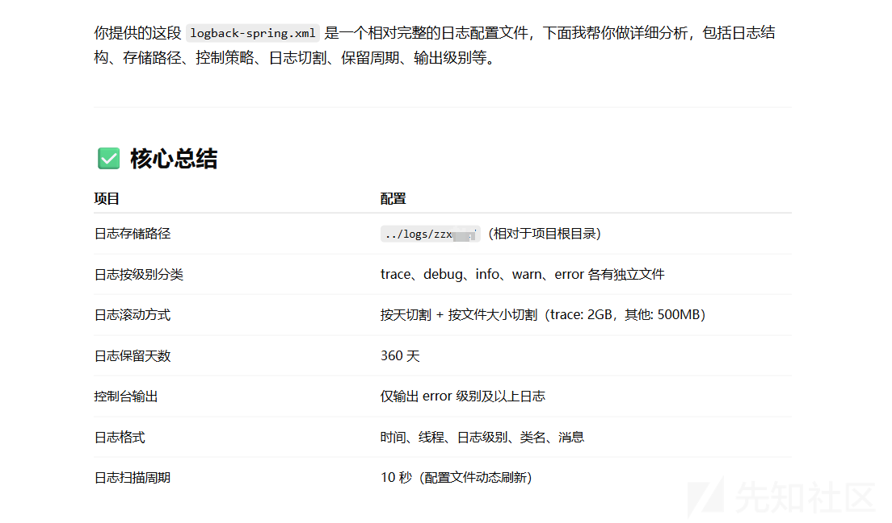

简单说就是日志分为不同的等级，每日会进行归档，当日的日志会在/logs/zzxxxx/log\_level.log中

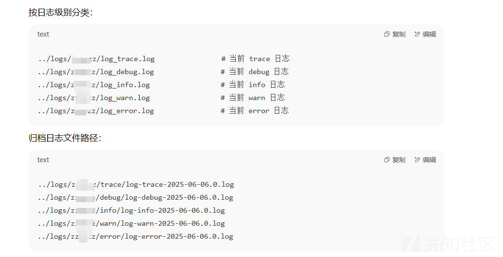

读取warn日志发现了敏感信息，网站配置了不允许读取.log文件，需要使用;.txt绕过

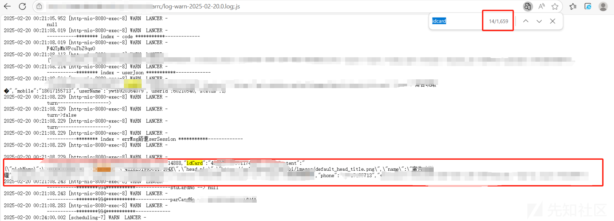

还从日志里面泄露的报错信息（调用栈信息有具体的那个类）读取到网站源码（部分）

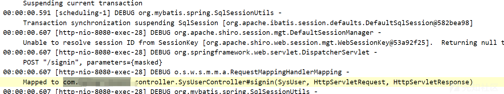

对应的class文件为/WEB-INF/classes/com/xxx/xxx/controller/SysUserController.class

而SysUserController中SysUser为请求路径的一部分/SysUser/index对应SysUserController类中的index方法

根据规则网站还有api开头的路径猜测到其存在ApiController.class文件，在通过类的依赖一步一步找到更多的类，当然也不是所有类都会在classes下

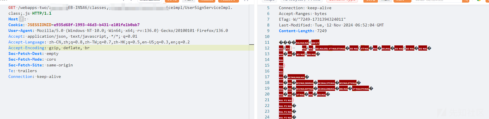

找到个任意文件下载，但是由于网站将文件上传目录设置在其他盘且是win系统，导致该文件读取比较鸡肋

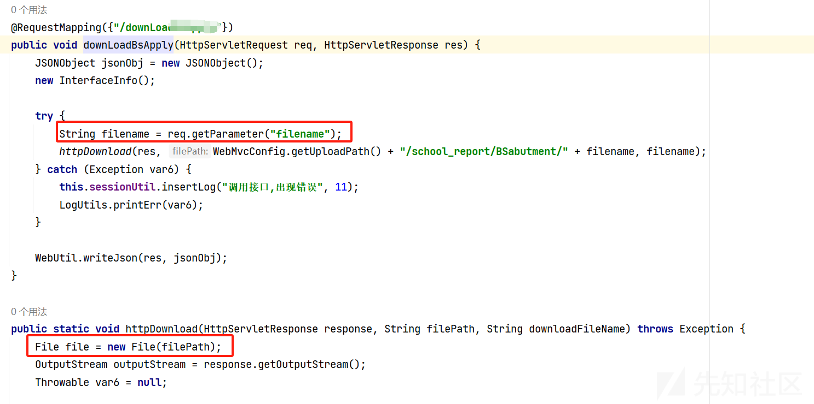

## 漏洞成因

为什么网站会出现tomcat作为网站根目录的这种情况呢？到底是哪里配置出现的问题

经过查询得知问题出现在conf/server.xml文件中，目标系统关键配置如下

```
<Host name="localhost"  appBase=""  unpackWARs="false" autoDeploy="true">
  <Context path="/" docBase="D:/apache-tomcat/tomcat/webapps-two/zzxxxxx" reloadable="false"/>
  <Valve className="org.apache.catalina.valves.AccessLogValve" directory="logs"
    prefix="localhost_access_log" suffix=".txt"
    pattern="%h %l %u %t &quot;%r&quot; %s %b" />

</Host>
```

再对比一下本地的tomcat服务配置文件

```
<Host name="localhost"  appBase="webapps" unpackWARs="true" autoDeploy="true">
  <Context path="/" docBase="D:/apache-tomcat/apache-tomcat-8/webapps-two/tomcat" reloadable="false"/>
  <Valve className="org.apache.catalina.valves.AccessLogValve" directory="logs"
         prefix="localhost_access_log" suffix=".txt"
         pattern="%h %l %u %t &quot;%r&quot; %s %b" />
</Host>
```

差异点在Host配置中，存在漏洞的配置文件中appBase为空

`<Host name="localhost" appBase="" unpackWARs="false" autoDeploy="true">`

`appBase` 是 Tomcat 中 `<Host>` 元素的一个核心属性，它的作用是： 指定当前虚拟主机（Host）部署 Web 应用的物理目录路径（Web 应用的根目录）。

这里没有指定目录的话，取默认`$CATALINA_HOME` 即 **Tomcat 的安装目录**

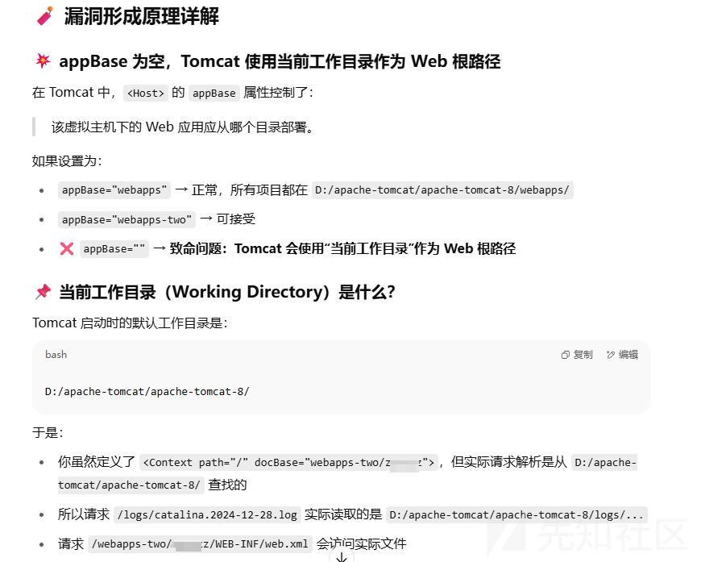

根据AI的回答本地复现一遍，将appBase滞空，启动tomcat，读取成功

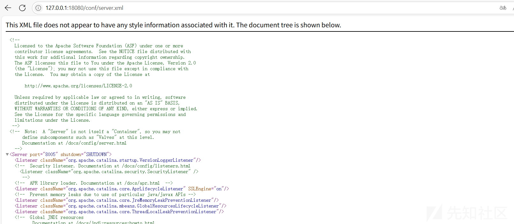

​

总结：

本文主要介绍Tomcat相关文件的利用，当遇到文件读取与路径映射错误相关漏洞时，从配置文件和日志文件入手一步步对该漏洞进行深入利用。

攻击路径科分为配置文件利用与日志文件利用：

* 配置文件文件：读取server.xml --> 读取网站配置文件 --> 读取网站代码 --> 漏洞
* 日志文件：tomcat各类日志分析 --> 信息泄露

以上是个人对tomcat日志文件的相关利用方式，个人水平有限有不对的地方还请各位大佬指出。
