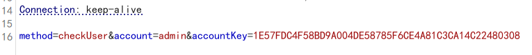
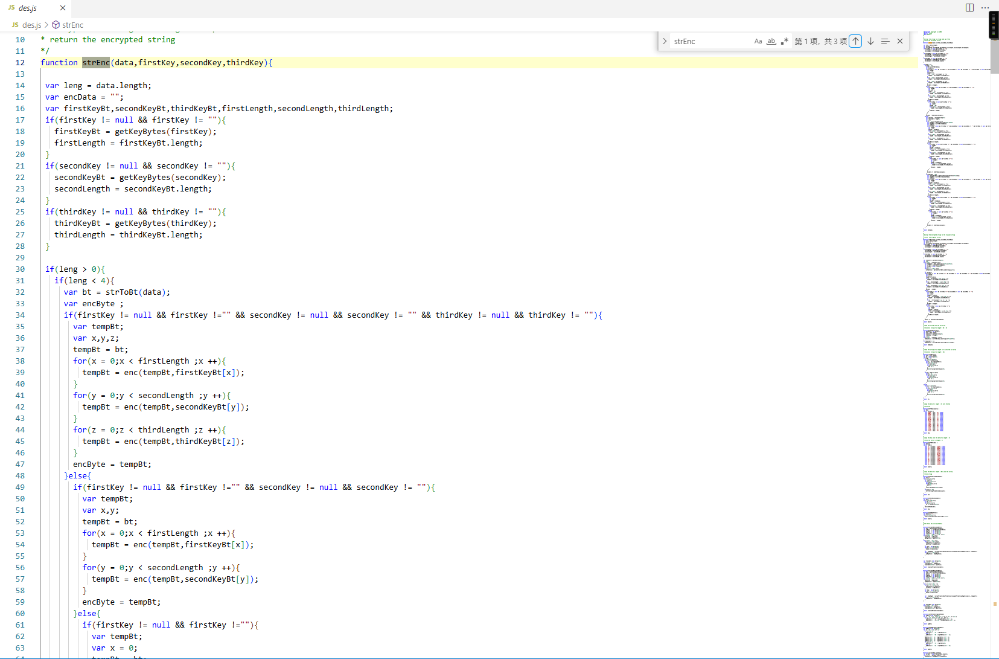
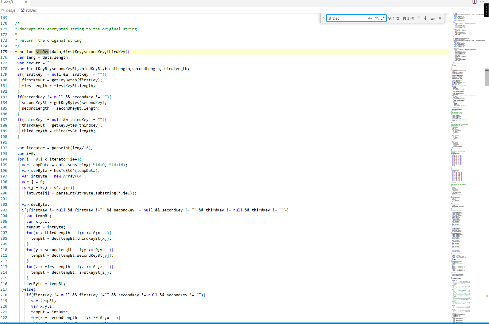
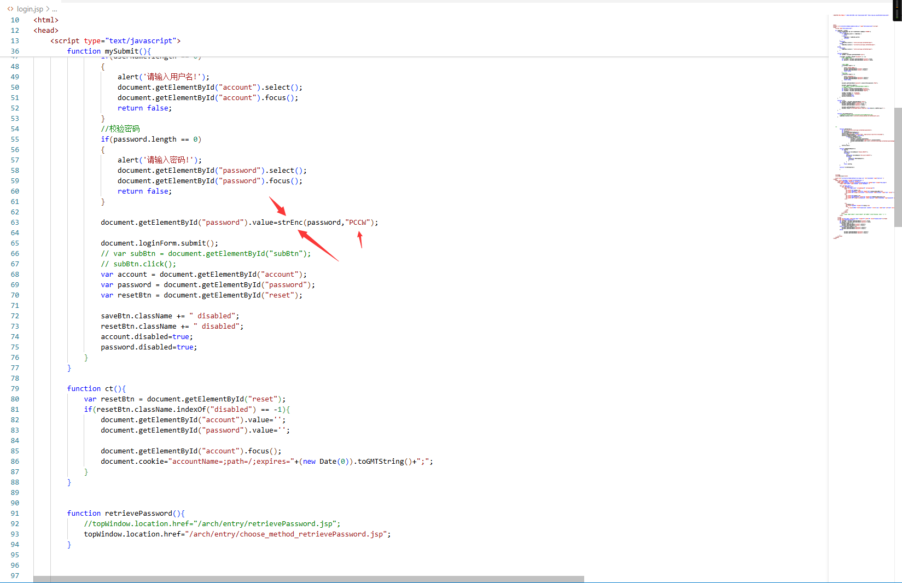
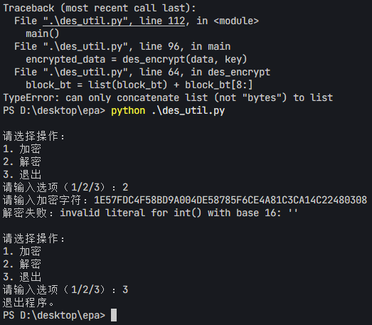
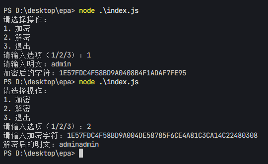

# DES 加密解密实现之旅-先知社区

> **来源**: https://xz.aliyun.com/news/18327  
> **文章ID**: 18327

---

# 1. 概述

本文将记录从某次渗透实战登录遇到的des加密，分析 des.js 和 login.jsp 文件到成功实现加密解密功能的全过程。通过这一过程，不仅深入理解了 DES 加密算法的实现细节，还成功地在 Node.js 环境中实现了与 des.js 一致的加密解密功能。



# 2. 正文

### 2.1 2个文件分析

#### 2.1.1 des.js 文件





des.js 文件包含了一个完整的 DES 加密解密实现，主要函数包括：

* **strEnc**：将字符串加密为十六进制字符串。
* **strDec**：将十六进制字符串解密为原始字符串。
* **enc** **和** **dec**：核心加密和解密函数，实现了 DES 算法的详细步骤，包括初始置换、多轮 Feistel 结构、S 盒置换等。
* **getKeyBytes**：将密钥转换为二进制数组。
* **strToBt** **和** **bt64ToHex**：用于字符串和二进制数据之间的转换。

* **strEnc** **和** **strDec**：这两个函数是加密和解密的入口点，负责处理输入数据和密钥，调用核心加密解密函数。
* **enc** **和** **dec**：实现了 DES 算法的核心逻辑，包括初始置换、16 轮 Feistel 结构、S 盒置换、P 盒置换和最终置换。
* **generateKeys**：生成 DES 算法所需的子密钥。
* **initPermute****、****expandPermute****、****xor****、****sBoxPermute****、****pPermute** **和** **finallyPermute**：这些函数共同完成了 DES 算法中的各种数据变换操作。

#### 2.1.2 login.jsp 文件

login.jsp 文件是一个用户登录页面，其中的关键部分是密码的加密处理：

* 在用户提交登录表单时，调用 des.js 中的 strEnc 函数对密码进行加密。
* 加密后的密码与用户名一起提交到服务器进行验证。

`document.getElementById("password").value=strEnc(password,"PCCW");`



### 2.2 加密解密流程解析

#### 2.2.1 加密流程

1. 用户输入明文密码。
2. strEnc 函数将密码分割成长度为 4 字节的数据块。
3. 每个数据块调用 enc 函数进行加密。
4. 加密后的二进制数据转换为十六进制字符串。
5. 十六进制字符串作为加密结果输出。

#### 2.2.2 解密流程

1. 输入加密后的十六进制字符串。
2. 将十六进制字符串转换为二进制数据。
3. 每个数据块调用 dec 函数进行解密。
4. 解密后的二进制数据转换为原始字符串。
5. 输出原始明文字符串。

### 2.3 加密解密本地实现

既然加密解密都分析了，那么现在来编写脚本，开始我使用python来实现，但是我发现一个问题我手写加AI都是难以还原des.js中的加密解密流程(数据转换和边界实现很麻烦)，ps有大佬师傅可以挑战使用python来实现这个加密解密(文件见附件！)，我写的一直抛出`TypeError: can only concatenate list (not "bytes") to list`错误(ai也问了还是没有解决)，而且还解密和加密实现都有问题，求大佬指教！！！



后来一想为什么不直接使用des.js直接引入使用即可，通过调用 des.js 中的 strEnc 和 strDec 函数，就可以实现加密和解密功能。

在 des.js 文件的末尾添加以下代码，以便调用 strEnc 和 strDec 函数：

```
module.exports = {
  strEnc: strEnc,
  strDec: strDec
};
```

创建一个 index.js 文件，来实现加密和解密功能。

```
// 引入readline模块实现命令行交互
const readline = require('readline');
// 导入自定义DES加密模块
const des = require('./des.js');


// 创建readline接口实例
const rl = readline.createInterface({
  input: process.stdin,  // 输入
  output: process.stdout // 输出
});


// 入口函数
function main() {
  // 交互菜单
rl.question('请选择操作：
1. 加密
2. 解密
3. 退出
请输入选项（1/2/3）：', (choice) => {
    if (choice === '1') {
      rl.question('请输入明文：', (data) => {
        // 使用DES算法加密，固定密钥"PCCW"
    const encryptedData = des.strEnc(data, "PCCW");
        console.log(`加密后的字符：${encryptedData}`);
        rl.close();
      });
    } else if (choice === '2') {
      rl.question('请输入加密字符：', (data) => {
        // 使用DES算法解密，login.jsp中固定密钥"PCCW"
    const decryptedData = des.strDec(data, "PCCW");
        console.log(`解密后的明文：${decryptedData}`);
        rl.close();
      });
    } else if (choice === '3') {
      console.log('退出程序。');
      rl.close();
    } else {
      console.log('无效的选项，请重新输入。');
      main();
    }
  });
}


main();
```



# 3. 总结

分析了 des.js 中的关键函数，包括 strEnc、strDec、enc、dec 等，详细解释了 DES 算法的实现细节，如[初始置换](https://zhuanlan.zhihu.com/p/133516777)、[多轮 Feistel 结构](https://blog.csdn.net/2303_80022567/article/details/148382391#:~:text=Feistel%E7%BD%91%E7%BB%9C%E5%8A%A0%E5%AF%86%E7%AE%97%E6%B3%95%E6%91%98%E8%A6%81Feistel%E7%BD%91%E7%BB%9C%E6%98%AF%E4%B8%80%E7%A7%8D%E5%AF%B9%E7%A7%B0%E5%8A%A0%E5%AF%86%E7%BB%93%E6%9E%84%EF%BC%8C%E9%87%87%E7%94%A8%E5%A4%9A%E8%BD%AE%E8%BF%AD%E4%BB%A3%E5%92%8C%E5%B7%A6%E5%8F%B3%E6%95%B0%E6%8D%AE%E4%BA%A4%E5%8F%89%E5%A4%84%E7%90%86%E7%9A%84%E8%AE%BE%E8%AE%A1%EF%BC%8C%E6%A0%B8%E5%BF%83%E7%89%B9%E7%82%B9%E6%98%AF%E5%8A%A0%E8%A7%A3%E5%AF%86%E8%BF%87%E7%A8%8B%E5%AF%B9%E7%A7%B0%E3%80%81%E5%AE%9E%E7%8E%B0%E7%AE%80%E5%8D%95%EF%BC%8C%E5%B9%B6%E5%85%B7%E5%A4%87%E9%9B%AA%E5%B4%A9%E6%95%88%E5%BA%94%E3%80%82%20%E5%85%B6%E5%B7%A5%E4%BD%9C%E5%8E%9F%E7%90%86%E6%98%AF%E5%B0%86%E6%98%8E%E6%96%87%E5%88%86%E4%B8%BA%E5%B7%A6%E5%8F%B3%E4%B8%A4%E9%83%A8%E5%88%86%EF%BC%8C%E6%AF%8F%E8%BD%AE%E9%80%9A%E8%BF%87%E8%BD%AE%E5%87%BD%E6%95%B0%E5%A4%84%E7%90%86%E5%8F%B3%E5%8D%8A%E9%83%A8%E5%88%86%E5%B9%B6%E4%B8%8E%E5%B7%A6%E5%8D%8A%E9%83%A8%E5%88%86%E5%BC%82%E6%88%96%EF%BC%8C%E6%9C%80%E7%BB%88%E8%BE%93%E5%87%BA%E5%AF%86%E6%96%87%E3%80%82,%E5%85%B8%E5%9E%8B%E5%AE%9E%E7%8E%B0%E5%8C%85%E6%8B%ACDES%E7%AD%89%E7%AE%97%E6%B3%95%EF%BC%8C%E4%B8%BB%E8%A6%81%E4%BC%98%E5%8A%BF%E5%9C%A8%E4%BA%8E%E8%BD%AE%E5%87%BD%E6%95%B0%E6%97%A0%E9%9C%80%E5%8F%AF%E9%80%86%EF%BC%8C%E5%AE%89%E5%85%A8%E6%80%A7%E4%BE%9D%E8%B5%96%E4%BA%8E%E8%B6%B3%E5%A4%9F%E5%A4%9A%E7%9A%84%E8%BD%AE%E6%95%B0%E5%92%8C%E8%BD%AE%E5%87%BD%E6%95%B0%E8%B4%A8%E9%87%8F%E3%80%82%20%E5%8A%A0%E5%AF%86%E6%B5%81%E7%A8%8B%E9%80%9A%E8%BF%87%E5%AD%90%E5%AF%86%E9%92%A5%E9%A1%BA%E5%BA%8F%E5%A4%84%E7%90%86%EF%BC%8C%E8%A7%A3%E5%AF%86%E6%97%B6%E5%8F%AA%E9%9C%80%E5%8F%8D%E5%90%91%E4%BD%BF%E7%94%A8%E7%9B%B8%E5%90%8C%E5%AD%90%E5%AF%86%E9%92%A5%E3%80%82)、[S 盒置换](https://blog.csdn.net/bcbobo21cn/article/details/108115023#:~:text=S%E7%9B%92%E4%BD%9C%E4%B8%BA%E5%AF%B9%E7%A7%B0%E5%AF%86%E9%92%A5%E7%AE%97%E6%B3%95%E4%B8%AD%E7%9A%84%E5%9F%BA%E6%9C%AC%E7%BD%AE%E6%8D%A2%E7%BB%93%E6%9E%84%EF%BC%8C%E5%9C%A8DES%E7%AE%97%E6%B3%95%E4%B8%AD%E8%B5%B7%E5%88%B0%E5%85%B3%E9%94%AE%E7%9A%84%E9%9D%9E%E7%BA%BF%E6%80%A7%E5%8F%98%E6%8D%A2%E4%BD%9C%E7%94%A8%E3%80%82%20%E5%AE%83%E5%B0%8648%E6%AF%94%E7%89%B9%E8%BE%93%E5%85%A5%E5%8E%8B%E7%BC%A9%E4%B8%BA32%E6%AF%94%E7%89%B9%E8%BE%93%E5%87%BA%EF%BC%8C%E9%80%9A%E8%BF%878%E4%B8%AA%E4%B8%8D%E5%90%8C%E7%9A%84S%E7%9B%92%E8%BF%9B%E8%A1%8C%E8%BD%AC%E6%8D%A2%EF%BC%8C%E6%AF%8F%E4%B8%AA%E7%9B%92%E6%9C%896%E4%BD%8D%E8%BE%93%E5%85%A5%E5%92%8C4%E4%BD%8D%E8%BE%93%E5%87%BA%E3%80%82%20S%E7%9B%92%E7%9A%84%E8%AE%BE%E8%AE%A1%E6%98%AF%E9%9D%9E%E7%BA%BF%E6%80%A7%E7%9A%84%EF%BC%8C%E6%8F%90%E4%BE%9B%E9%A2%9D%E5%A4%96%E7%9A%84%E5%AE%89%E5%85%A8%E6%80%A7%E3%80%82%20%E6%91%98%E8%A6%81%E7%94%9F%E6%88%90%E4%BA%8E%20C%E7%9F%A5%E9%81%93%20%EF%BC%8C%E7%94%B1,DeepSeek-R1%20%E6%BB%A1%E8%A1%80%E7%89%88%E6%94%AF%E6%8C%81%EF%BC%8C%20%E5%89%8D%E5%BE%80%E4%BD%93%E9%AA%8C%20%3E%20%E5%9C%A8%E5%AF%86%E7%A0%81%E5%AD%A6%E4%B8%AD%EF%BC%8CS%E7%9B%92%20%28Substitution-box%29%E6%98%AF%E5%AF%B9%E7%A7%B0%E5%AF%86%E9%92%A5%E7%AE%97%E6%B3%95%E6%89%A7%E8%A1%8C%E7%BD%AE%E6%8D%A2%E8%AE%A1%E7%AE%97%E7%9A%84%E5%9F%BA%E6%9C%AC%E7%BB%93%E6%9E%84%E3%80%82)等。通过这些分析，不仅理解了算法的原理，还掌握了其在实际渗透测试中的实现方法。通过本次逆向破解加密的过程，不仅加深了对 DES 算法的理解，也积累了在不同编程环境中实现相同功能的经验。希望本文的记录能够为其他实现des加密解密提供一些启示和帮助。
