# Mysql注入中锁机制的应用-先知社区

> **来源**: https://xz.aliyun.com/news/18343  
> **文章ID**: 18343

---

## **前言**

在sql注入的延时注入中，常见的函数有sleep()直接延时、BENCHMARK()通过让数据库进行大量的计算而达到延时的效果、笛卡尔积、正则匹配等，但还有一个常常被忽略的函数，也就是Mysql中的锁机制。虽然早些年就已经出现过相关的技术文章，但是他的应用却几乎见不到，也没有看到有文章对他的机制和运用进行深入讲解，而且该函数也常常被waf忽略导致延时。

## **Mysql****锁机制介绍**

### **函数介绍**

GET\_LOCK() 是 MySQL 提供的一个用户级锁函数，用于在应用层实现跨会话的锁机制。以下是该函数的解析：

`GET_LOCK(str lock_name, int timeout)`

**参数：**

lock\_name（字符串）：锁名称（最大64字符，区分大小写）

timeout（整数）：等待超时时间（秒），0表示立即返回，负数表示无限等待（MySQL 5.7.5+）

**返回值：**

1：成功获取锁

0：获取锁超时（其他会话持有锁且未在指定时间内释放）

NULL：发生错误（如参数无效、内存不足等）

`RELEASE_LOCK(str)`

用于解开锁，str表示要解开的锁名

**返回值：**

1：成功释放，当前会话持有锁并成功释放

0：释放失败，当前会话不持有该锁

NULL：错误或锁不存在， 锁名称从未被获取

**示例：**

通过返回值1判断成功获取名为1的锁

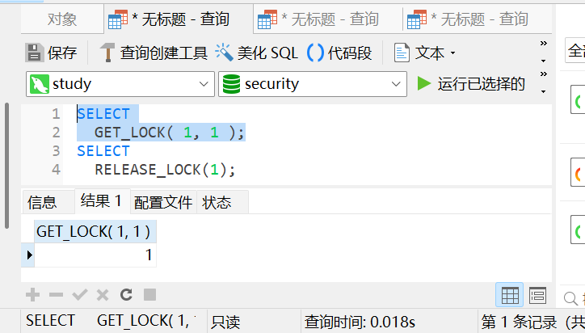

通过返回值1判断成功释放名为1的锁

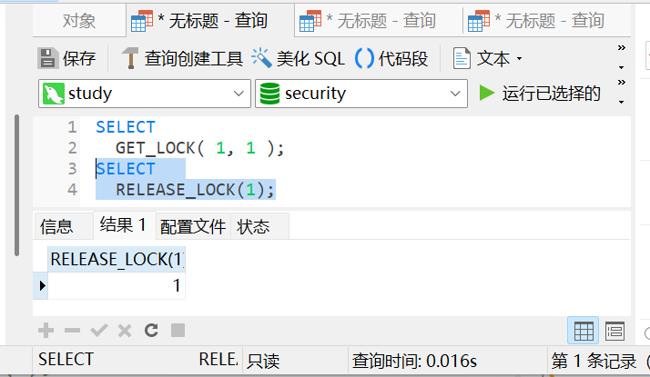

再次释放时，则为Null（锁不存在）

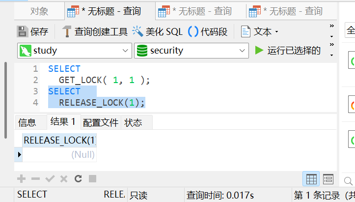

### **核心特性**

**命名锁机制：**

基于字符串名称的锁，不同锁名互不影响，例如：

`GET_LOCK('test1', 10)`

`GET_LOCK('test2', 10)`

他们直接由于锁名不同，所以互不影响

​

**会话级作用域：**

当一个会话成功获取了某个命名锁后，其他会话在尝试获取相同名称的锁时将会被阻塞，直到锁被释放或超时。

而在同一个会话内部，即使多次请求相同的锁，也不会造成阻塞，会直接返回成功，因为该会话已经持有该锁。

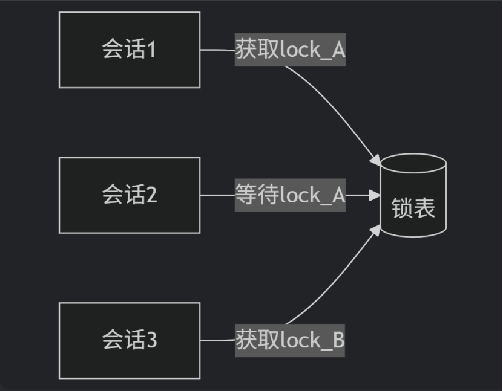

**示例：**

会话1先通过GET\_LOCK()函数获取了名为1的锁，返回结果为1表示获取成功

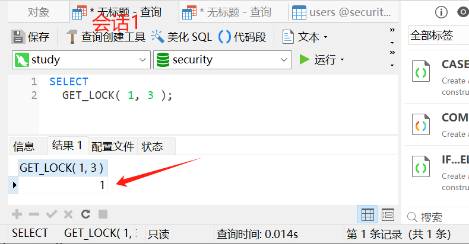

会话2再次通过GET\_LOCK()函数获取名为1的锁，但是名为1的锁以及被会话1占有，所以会话2直到超时5秒，结果为0表示获取失败

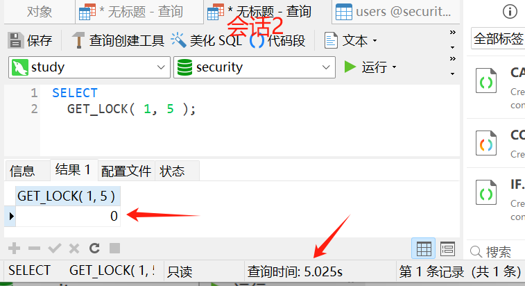

**锁释放规则：**

显式释放：`RELEASE_LOCK('lock_name')`

隐式释放：会话终止（连接关闭）

时效释放：受wait\_timeout 参数控制

不会随事务结束自动释放（与InnoDB行锁不同）

​

`SHOW VARIABLES LIKE 'wait_timeout';`

可以查看会话超时时间（秒），这里是2分钟

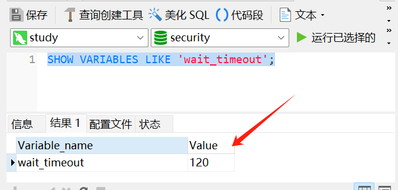

`SET SESSION wait_timeout = 600;`

可以通过该函数来设置wait\_timeout参数

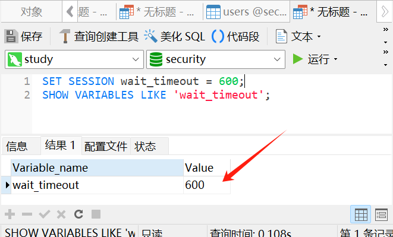

通过网上搜索发现wait\_timeout参数的默认值是8小时，但是我的数据库默认就是2分钟，也没有看到官方的具体说明，可能是受到Mysql版本的影响。

## **Web****各类布局中的利用**

### **利用条件**

刚刚讲完了Mysql锁的机制，那么要使用GET\_LOCK()函数成功让目标数据库发现延迟，就需要具备以下两个条件：

1. 需要不同会话（只有不同会话的锁竞争才会导致延时）
2. 获取锁的会话具备长时效应（既会话或锁不被马上释放）

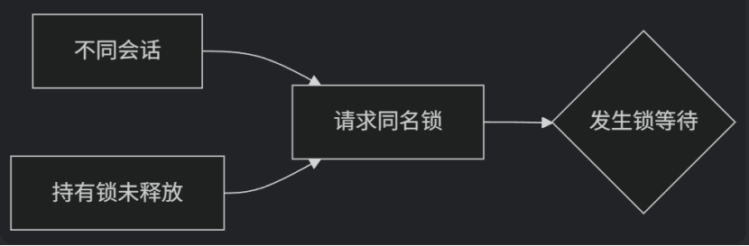

### **短会话模式**

**模式简介：**

每个HTTP请求都新建数据库连接，请求完成后立即关闭连接。无连接复用。

**使用规模：**

极少，主要存在于遗留系统或极低流量场景

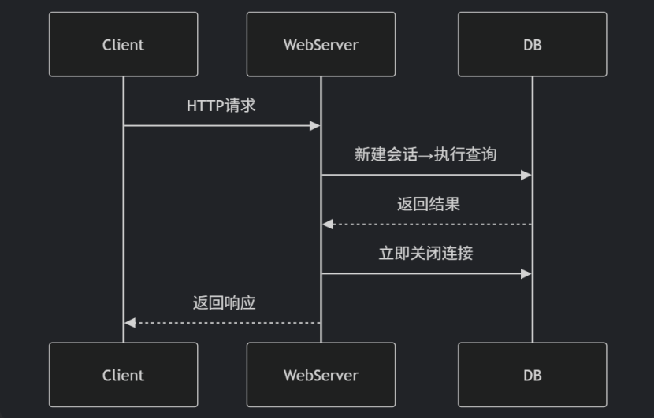

**利用可行性：**

这种情况下，大概率是无法造成锁等待，虽然每次用户的请求满足条件1：需要不同会话。但是无法满足条件2：获取锁的会话具备长时效应。也就是说当A会话获取完锁a，B会话还没来得及等待锁a，A会话就已经结束了，就自动释放锁，就无法达到锁等待的效果。

举一个最简单的例子，phpstudy中搭建的靶场sqli-labs就是如此（短会话模式）

这里拦截后大量发包，在一次性并发。

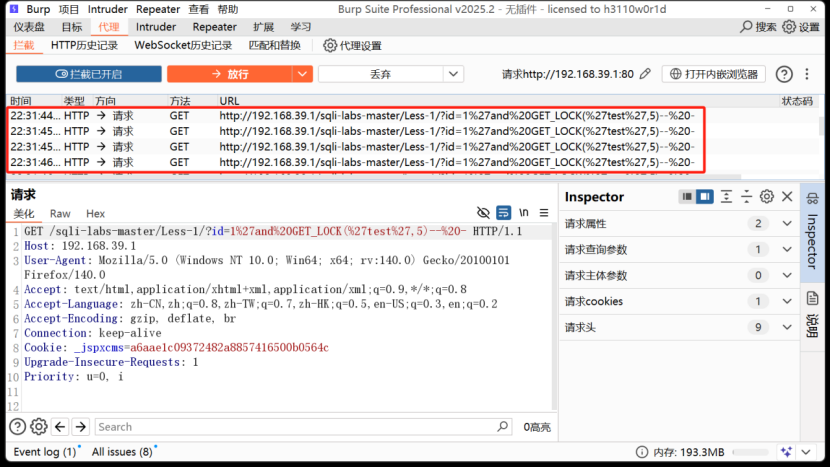

通过数据库监听工具可以看到，当数据库还没来得及因为其他会话的锁造成等待，其他会话的锁就已经结束并关闭连接，自动释放锁了。所以不满足条件2：获取锁的会话具备长时效应。

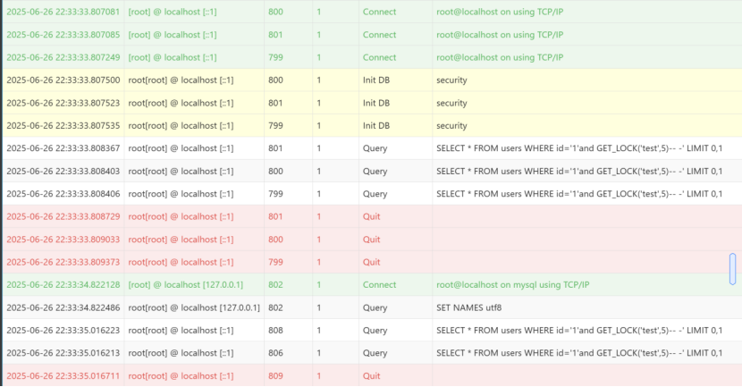

### **长会话模式**

**模式简介：**

整个Web应用使用单个持久数据库连接，所有用户请求共享此连接。

**使用规模：**

较少，特定场景：金融交易系统、小型嵌入式应用，一些较老的cms也存在此情况

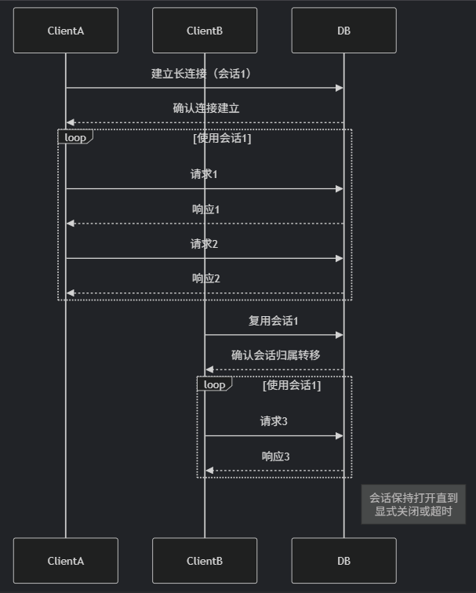

**利用可行性：**

所有用户操作在同一个会话中，但条件1需要不同会话才会产生锁等待，所以不会发生锁等待，也就不能造成延时的效果

​

这里以MRCMS-3.1.2版本为例，他就是长会话模式

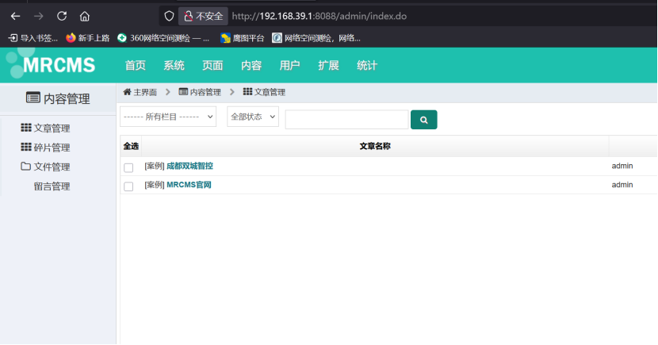

通过数据库监听工具可以看到，无论进行多少次数据库操作他的thread\_id一直都为994，尽管切换登录，替换用户凭证，ip等都还是thread\_id为994且没有断开连接，那么就不满足条件1：需要不同会话（只有不同会话的锁竞争才会导致延时），也就不会导致锁等待，就不会造成延时的效果。

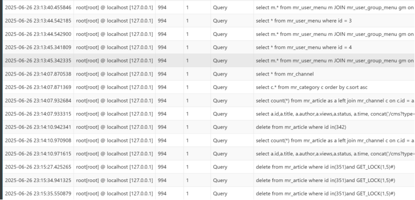

### **连接池模式**

**模式简介：**

预先创建连接池（如20个连接）

每个HTTP请求从池中借用连接，用完归还

物理连接复用，逻辑会话隔离，既每个会话重复的从连接池中使用连接

**使用规模：**

主流，现代Web应用常出现，Spring Boot(HikariCP), Django, Laravel等默认使用

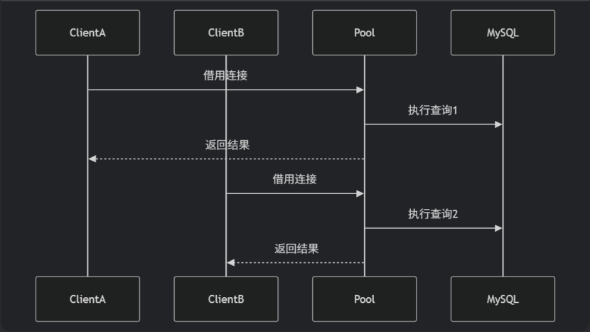

**利用可行性：**

锁绑定物理连接，不自动释放

用户A获取锁 → 未释放 → 连接1归还但不自动释放 → 用户B使用连接2 → 锁冲突

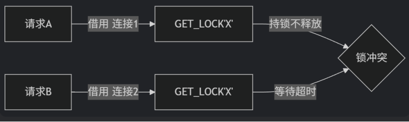

**利用方法：**

那么只要我们通过大量的请求，就一定会从Pool中请求到两个不同的物理连接，这样利用GET\_LOCK函数就能达到延时的效果

### **用户级长连接（绑定会话）**

**模式简介：**

每个用户分配专属数据库连接，在整个会话期间保持打开（既长连接）。

**使用规模：**

较少，实时系统：在线协作工具、交易平台

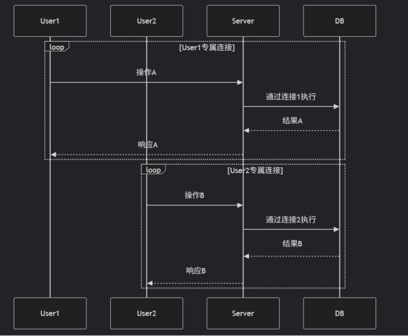

**利用可行性：**

用户A在会话1持有锁

用户B在会话2请求同名锁 → 满足条件1（不同会话）+条件2（锁未释放）

**利用方法：**

只要不同用户的凭证去请求同一个锁，比如GET\_LOCK(1,5)那么就会发生锁等待，造成延时效果

### **IP/****客户端级连接**

**模式简介：**

与上一个用户级长连接极其相似，只不过按客户端IP分配固定连接，同IP的多个用户共享连接。

**使用规模：**

极少，特殊场景：游戏服务器、定制网关

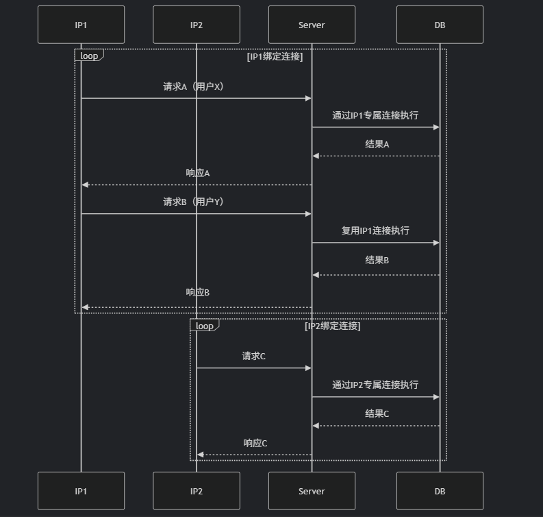

**利用可行性：**

IP组内：同会话无冲突（如IP1用户A和用户B无锁等待）

IP组间：不同会话有冲突（如IP1用户 vs IP2用户）

**利用方法：**

和用户级长连接（绑定会话）类似，只是需要ip不同

### **多****Web****共用数据库**

**模式简介：**

现在常见的web部署方式为站库分离，且多站共用一个库，多个独立应用（如微服务）共享同一数据库，各自使用连接池。

**使用规模：**

常见，微服务架构，现代云原生应用常见模式

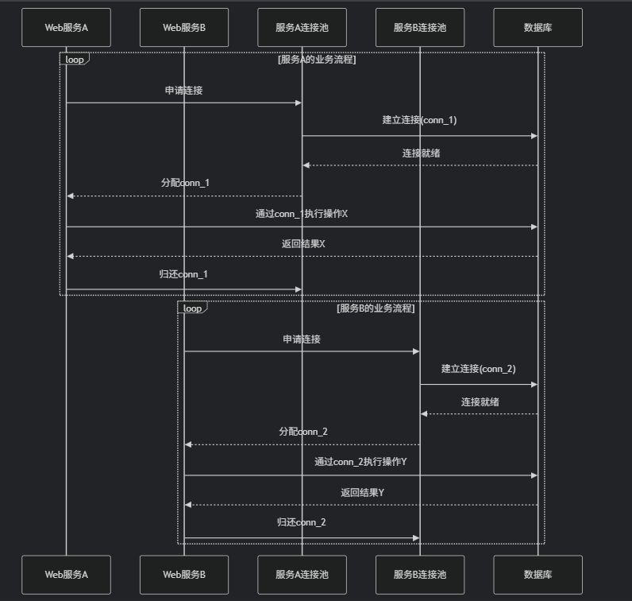

**利用可行性：**

多web共享同一连接池：那么原理与连接池模式相同

多web使用独立连接池：不同连接池=不同会话，原理与连接池模式相同

多web不使用连接池+全是短会话：无法产生，与短连接原理相同

多web不使用连接池+全是长会话：无法产生，与长连接原理相同

多web不使用连接池+长会话+短会话：不同web的连接也就会产生不同的会话，满足条件1：需要不同会话；长会话满足条件2：获取锁的会话具备长时效应。

**利用方法：**

多web不使用连接池+长会话+短会话：先对长会话的web进行注入来获取锁，再通过短会话web注入来达到锁等待，造成延时效果。

## **雷池****waf****延时实战**

### **雷池****waf****配置**

这里均采用默认配置

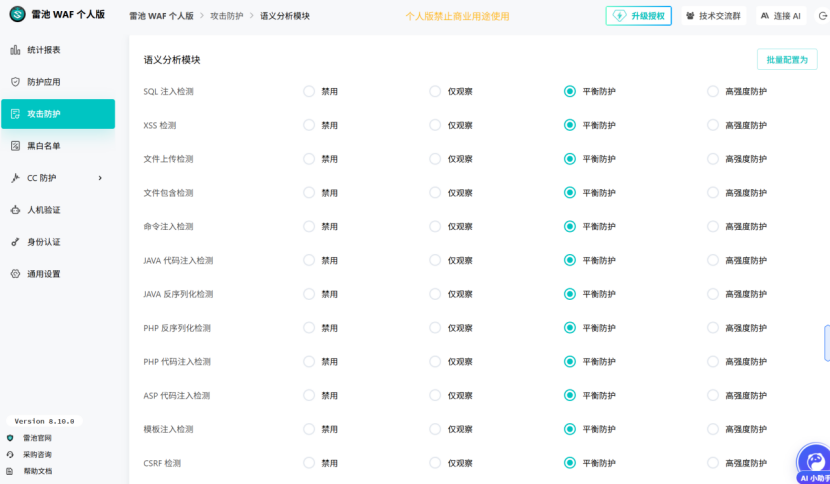

### **常规延时手段**

Sleep延时被拦截

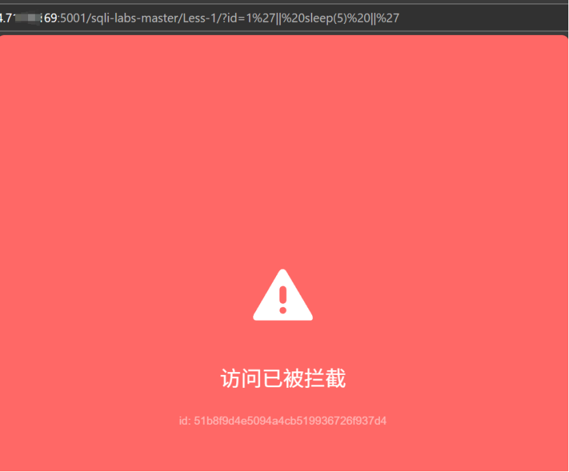

BENCHMARK函数被拦截

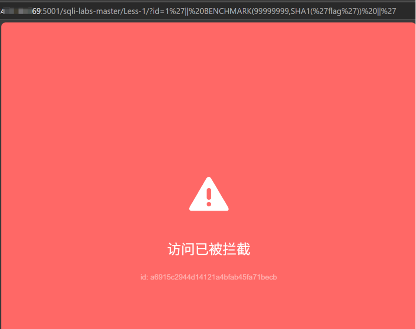

可以看到常规的延时手法都直接拦截了，那么接下来使用我们刚刚讲解的锁机制来延时

​

### **锁函数造成延时**

这里采用两个web共用一个数据库的形式，一个是phpstudy中搭建的靶场sqli-labs短会话模式，另一个是MRCMS-3.1.2长会话模式，那么两者构成的就是多Web共用数据库模式。

​

多web不使用连接池+长会话+短会话：

先对长会话的web进行注入来获取锁，再通过短会话web注入来达到锁等待，造成延时效果。

先使用MRCMS-3.1.2的漏洞接口注入来获取锁：

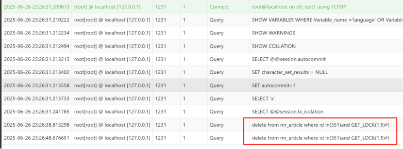

然后在sqli-labs中直接注入

`?id=1%27||%20GET_LOCK(1,5)%20||%27`

成功造成延时效果，且不触发雷池waf拦截

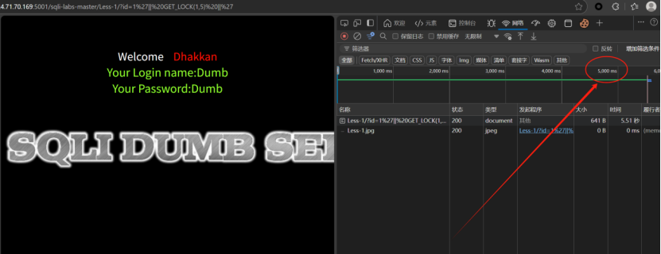

接着嵌套if语句，依旧成功造成延时，且不触发雷池waf拦截

`?id=1%27||%20if(1,GET_LOCK(1,5),1)%20||%27`

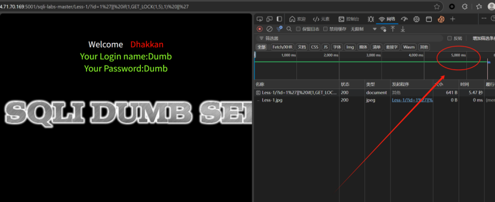

通过数据库监听工具看到时间部分确实造成了延时，以及长会话和短会话共用数据库连接导致的不同会话造成了锁等待，最终产生延时效果

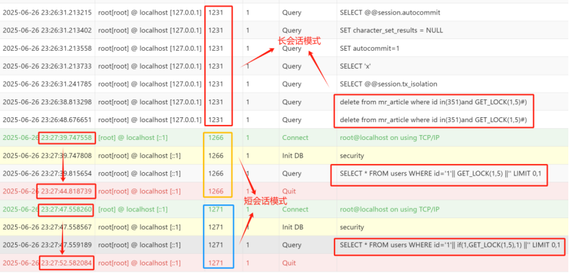

到雷池waf后台可以看到锁函数实际上是检测到了，但在默认配置下不拦截，只拦截了底部的两条比较常见的延时函数。

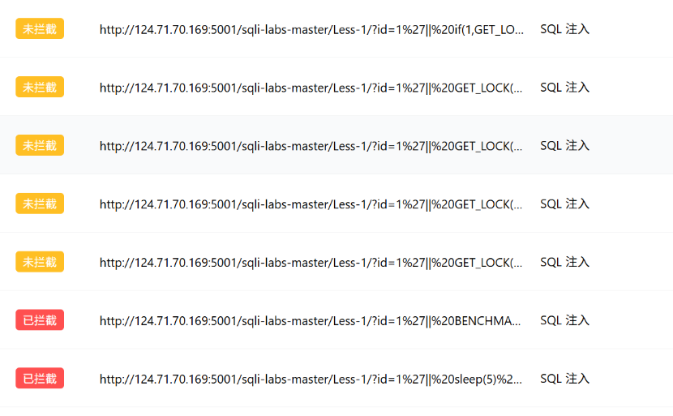

## 总结

利用锁机制的优势就是不易被waf检测（在写文章的时候似乎写入其他延时payload会导致出错无法预览，而锁机制的延时payload则可以正常预览，这也算是不易被检测的一种），既然大名鼎鼎的雷池waf都能成功延时，那么市面上大多数的waf应该也一样。

那么接下来的注入方法就由各位师父大显神通了，这里就不再做太多的赘述。
