# yonkies_keygenme_4 代码混淆-先知社区

> **来源**: https://xz.aliyun.com/news/18344  
> **文章ID**: 18344

---

```
Coder name: Yonkie
Coded in: C/C++
Difficulty level: 4 - Needs special knowledge
Crack-me URL: https://crackmes.one/crackme/5ab77f6233c5d40ad448c9e4
Platform: Windows
```

这是一道代码混淆的题。Dennis Yurichev的开源大作《Reverse Engineering for Beginners》里介绍代码混淆技术的时候提到“made a little attempt to hack Tiny C compiler's codegenerator”。这道题就是这个魔改的 C 编译器，编译出来的。  
读者可以在 <https://yurichev.com/blog/58/> 这个地址找到介绍和示例。示例代码展示的代码混淆技术，主要是：

1. 常数替换成一系列的算术求值值令
2. 插入大量随机指令，将少量有效代码淹没在大量无效指令中  
   ==针对这种混淆技术，其实人工分析只需要抓住关键“字段/数据”（比如函数参数）在内存/寄存器之间流动的方向，进行追踪，就可以较快的识别出正确的代码逻辑。==  
   这题是一个比较好的学习理解代码混淆技术逆向工程的基础题。  
   当然就这个题目而言，在示例代码所用的混淆技术上，还有三种混淆技术（或者说技巧更确切一些），本质上可以归为控制流混淆：
3. call指令等效替换
4. 函数 ret 指令的替换
5. 无效跳转指令（永恒跳转和永恒不跳转）

控制流混淆可以干扰IDA等静态分析工具对代码块的识别，不能自动生成函数。特别是无效跳转指令，跳转地址会破坏顺序分析的某个指令边界，给静态分析工具造成困扰。  
随机干扰指令会静态分析工具对栈分配或寻址的分析，阻碍生成更高级别的伪代码。

### 一、验证逻辑分析

经过混淆的程序，要分析其逻辑，首先要去混淆。由于混淆存在多个模式，需要一一识别，一层一层去混淆。好比剥茧抽丝。下面来看看这个程序在IDA里长啥样。

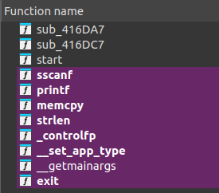

IDA的自动分析只分析出很少的东西，没有分析出`main`函数。`start`函数是程序的入口点。Tiny C 编译器很简单，看看`start`函数：

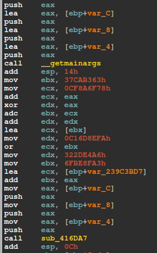

`main`函数有统一标准：argc、argv、env 三个参数。可以看到`sub_416DA7`正好三个参数，前面还有`__getmainargs`的调用。可以直接将此函数修改为`main`。IDA会自动更新参数。

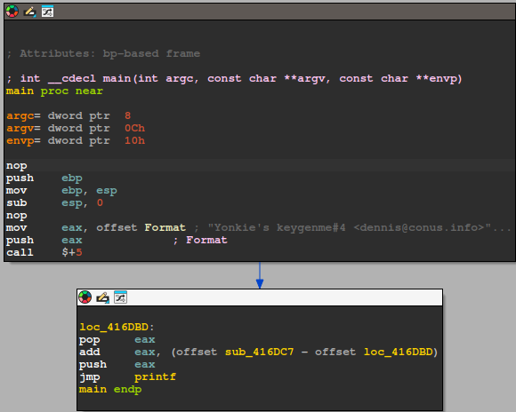

这个`main`函数似乎有点不对，这么短，也没有`ret`。这就是控制流混淆后IDA自动分析出错。来看一下`TEXT View`模式下的情况：

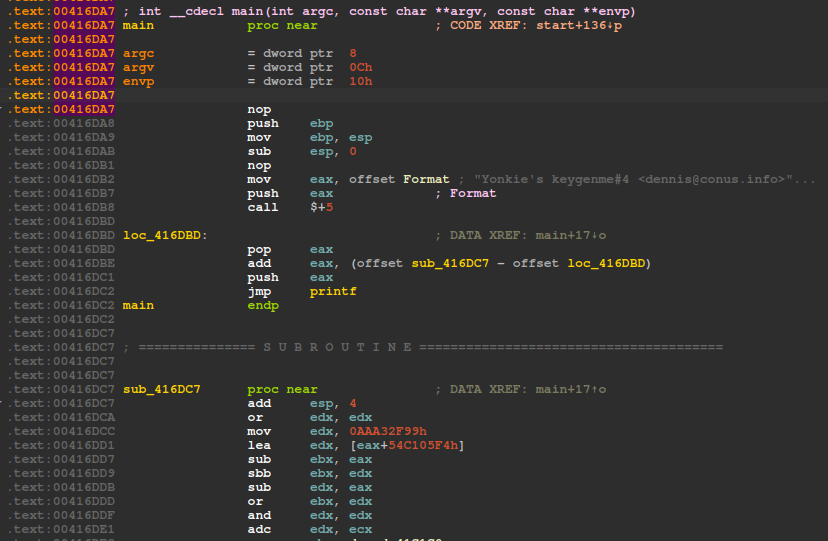

可以清晰看到IDA分析的`mian endp`后面还是有很长的代码的。

#### 1、函数调用混淆

图中似乎是对`call printf`指令替换混淆技巧。

`call $+5`这个指令通常在恶意软件里面用来获取当前`EIP`的值。

其原理是`$`表示当前指令的地址，这里就是`call`指令的地址`0x416DB8`。执行`call $+5`指令时，会将其下一条指令`pop eax`的地址`0x416DBD`压栈（作为函数调用的返回地址），而`call $+5`指令的长度正好是5个字节，下一条指令的地址就等于`$+5`，这也是`call`指令跳转到的目标地址。通过这个操作当前`EIP`值就保存在了栈顶。

后面对`eax`的操作，相当于修改函数的返回地址：0x416DBD + 0x0A = 0x416DC7，然后跳转到`printf`。

`0x416DC7`处`add esp, 4`，根据C调用规范，就是`printf`调用结束后的堆栈清理。这里只有一个参数，所以+4。

这个从`0x416DB8`到`0x416DC7`之间的代码，实际上就是`call printf`指令的混淆模式。分析后续代码可以发现，程序里对函数的调用，基本都采用了这种混淆模式。

* 去混淆：只需要分析混淆代码的二进制模式，替换成`call xxx`形式的二进制代码就可以。

先来看看混淆代码的二进制情况：

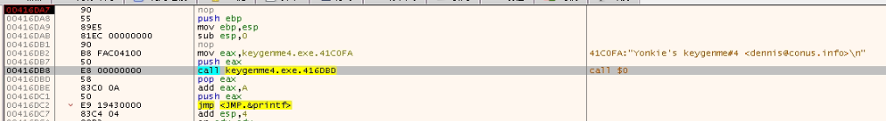

可以看到混淆代码的模式：10个字节（0x0A）都是一模一样的`\xE8\x00\x00\x00\x00\x58\x83\xC0\x0A\x50`。

​ \* 只需要把这10个字节都`NOP（\x90）`掉。

​ \* 然后把接下来的一个字节`jmp（\xE9）`改成`call（\xE8）`

直接上IDA脚本

```
#include <idc.idc>

static cmpmem(addr1, addr2, size)
{
    auto i;
    for(i=0; i<size; i++)
    {
        //msg("first = %x, second = %x
", byte(addr1+i), (ord(addr2[i]) & 0xff));
        if(byte(addr1 + i) != (ord(addr2[i]) & 0xff))
            return 1;
    }
    return 0;
}

static patch_bytes(dst, src, size)
{
    auto i;
    for(i=0; i<size; i++)
    {
        patch_byte(dst++, ord(src[i]) & 0xff);
    }   
}

static main()
{
    auto search_bytes = "\xE8\x00\x00\x00\x00\x58\x83\xC0\x0A\x50\xE9";
    auto replace_bytes = "\x90\x90\x90\x90\x90\x90\x90\x90\x90\x90\xE8";
    
    auto start_ea = MinEA();
    auto end_ea = MaxEA();
    msg("start = %x, end = %x
", start_ea, end_ea);
    
    auto total = 0;
    auto ea;
    for(ea=start_ea; ea<=end_ea; ea++)
    {
        if(cmpmem(ea, search_bytes, 11) == 0)
        {
            msg("%x
", ea);
            patch_bytes(ea, replace_bytes, 11);
            total++;
            ea = ea + 10;
        }
    }
    msg("total = %d
", total);
}
```

patch后的函数调用长这样：

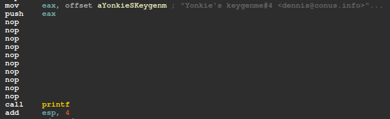

#### 2、函数返回指令的混淆

由于有着明确的`printf`函数的字符串，跟踪错误提示字符串分支，可以发现`main`函数没有`ret`指令，导致IDA无法判断函数结尾。

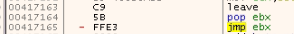

`leave`指令一般都是后面紧跟`ret（\xC3）`指令。这里`ret（\xC3）`被替换成了3个字节的`pop ebx; jmp ebx`。

手动修改此处后，IDA还是不能`create function`，查看后`main`函数里面还有多块没有识别为代码的数据块。此处应该还藏着某种混淆方式。

#### 3、无意义`jnz`混淆

由于IDA等反编译工具在分析指令流时，对于基本块（basic code block）都是顺序分析的。用`jnz`等条件跳转指令，指令一个破坏顺序分析指令边界的地址，就能让反编译工具产生错误。而条件跳转指令的跳转条件可以永远为真或者永远为假。

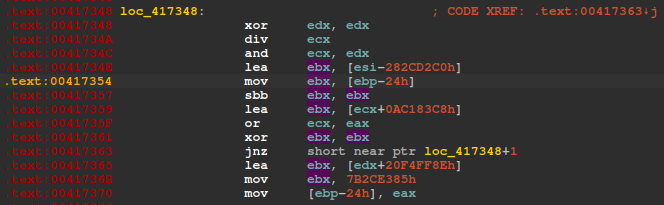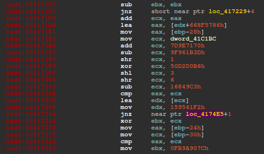

这两张图可以看出，`xor ebx, ebx; jnz`和`sub ebx, ebx; jnz`这两个条件跳转是永远不会执行的。放这里就是干扰IDA的分析的，可以看到`0x417214`处的真实跳转指令就分析断档了，正确的跳转基本块应该从`0x4174E6`开始分析。

经过多处类似无效`jnz`指令的分析，可以总结出若干模式。直接上IDC脚本（连同上一个函数返回混淆的模式一并处理）：

```
#include <idc.idc>

static main()
{
    // get .code segment start and end address.
    auto start = get_segm_start(0x416DA7);
    auto end = get_segm_end(0x416DA7);

    // 函数返回混淆的patch
    // 0:  c9                      leave
    // 1:  5b                      pop    ebx
    // 2:  ff e3                   jmp    ebx
    auto func_ret = 0xe3ff5bc9; 	// "\xC9\x5B\xFF\xE3";
    auto func_ret_patch = 0xc39090c9;	// "\xC9\x90\x90\xC3";	// leave; nop; nop; ret;
    auto ea;
    auto total = 0;
    
    for(ea=start; ea<end-3; ea++)
    {
        if(dword(ea) == func_ret)
        {
            patch_dword(ea, func_ret_patch);
            msg("%x func ret found and patched.
", ea);
            ea = ea + 3;
            total++;
        }
    }
    msg("func ret total found and patched: %d
", total);
    
    // jnz 跳转的混淆patch，这个导致ida不能定义函数
    // 0:  29 c0                   sub    eax,eax
    // 2:  29 db                   sub    ebx,ebx
    // 4:  29 c9                   sub    ecx,ecx
    // 6:  29 d2                   sub    edx,edx
    // 8:  31 c0                   xor    eax,eax
    // a:  31 db                   xor    ebx,ebx
    // c:  31 c9                   xor    ecx,ecx
    // e:  31 d2                   xor    edx,edx
    
    // 0:  75 ff                   jne    1 <_main+0x1>
    total = 0;
    for(ea=start; ea<end-3; ea++)
    {
        auto patten = get_bytes(ea, 3, 0);
        if(patten == 0)
            break;
        auto a = ord(patten[0]) & 0xFF;
        auto b = ord(patten[1]) & 0xFF;
        auto c = ord(patten[2]) & 0xFF;
        if((a == 0x29 || a == 0x31) && c == 0x75)
        {
            if(b == 0xc0 || b == 0xdb || b == 0xc9 || b == 0xd2)
            {
                patch_dword(ea, 0x90909090);
                msg("%x invalid jnz found and patched.
", ea);
                ea = ea + 3;
                total++;
            }
        }
    }
    msg("invalid jnz total found and patched: %d
", total);
}
```

应用以上两个脚本处理三种容易识别的混淆模式后，IDA可以手动定义函数了。虽然存在大量`junk code`的干扰，但字符串没有加密，控制流已经恢复，`main`函数的整体逻辑已经可以看清楚了。

#### 4、常数混淆和`junk codes`

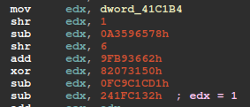

程序的关键常数，比如循环的初始值等，都使用了上图的方式隐藏起来了。虽然源头都是从一个`0x41C1B4`附近的初始数据块中取出数据进行计算。但计算方法多样，很难识别一个统一模式。还存在类似的无用代码干扰。不知道计算出来的结果，是不是真的是有效的，实际代码会用到。

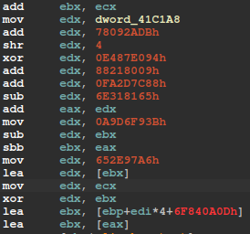

`junk codes`会出现一些比较大的数据，让IDA的栈分析失效。

对于这两种混淆方式，目前的水平没有好的自动化方式处理。只能硬着头皮看代码了。

好在`junk codes`的写入地址都是寄存器，不往内存写入。紧跟参数和关键内存的读写，就可以找到原始的代码流程了。

#### 5、汇总

经过针对1、2、3混淆模式的脚本处理，IDA可以手动`Create Function`。优先观察函数的输出（不观察函数的输出，跟进`get_key`系列函数，就会绕在里面浪费大量时间），以及上层函数的代码逻辑，可以得到下图的函数列表：

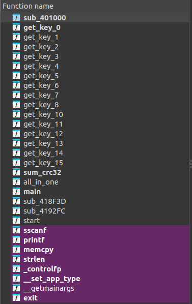

基本的程序逻辑其实很简单：

（1）输入的字符串序列号（128个字符）转成对应的DWORD数组（16个）：

```
def hex_str_to_dwords(hex_str):
    # 将16进制字符串转换为DWORD列表
    return [int(hex_str[i:i+8], 16) for i in range(0, len(hex_str), 8)]
```

（2）16个`get_key`函数获取对应的16个DWORD解密密钥

```
    keys = [
    0x10D88067, 0xBC16D3D5, 0xE7039A64, 0x39EC8A6D,
    0xFF09B4BF, 0xF828DB76, 0x8BE40C8E, 0xF7AA583E,
    0x60858E23, 0xE487F5A3, 0x39A57B89, 0xB006573E,
    0x79609807, 0x620AD108, 0x5CD86398, 0x6CA94B51]
```

（3）解密逻辑：

```
def xor_decrypt(encrypted_dwords, key_dwords):
    # 对每个DWORD进行异或解密
    data = []
    extra = 0
    for i in range(len(encrypted_dwords)):
        data.append(encrypted_dwords[i] ^ key_dwords[i] ^ extra)
        extra = encrypted_dwords[i];
    return data
```

（4）校验：

```
    # 实际只用到了三个字段
    print("sn=%x, feature=%x, expiration=%x" % (data[8], data[9], data[10]))
    # CRC32校验
    print("%x %x" % (calculate_crc32(data[:-1]), data[15]))
```

### 二、keygen实现

算法其实挺简单的，直接可逆，比`yonkie`的前面两题简单很多。需要注意的是DWORD生成字符串的字节顺序，这个在`C`代码中无所谓，但用`python`写的话，需要注意一下。给一个`C`代码的`keygen`吧：

```
#include <stdio.h>

typedef unsigned int DWORD;
// extern DWORD crc32(unsigned char *name);

struct {
    char name[32];
    DWORD sn;
    DWORD featureset;
    DWORD expiration;
    char pad[16];
    DWORD crc32;
} license;

DWORD sum_crc32(unsigned char* data, int size)
{
    DWORD crc = 0;
    for(int i=0; i<size; i++)
    {
        crc = data[i] ^ 0xFFFFFFFF ^ crc;
        for(int j=8; j>0; j--)
        {
            if(crc & 1)
                crc = (crc >> 1) ^ 0xEDB88320;
            else
                crc >>= 1;
        }
        crc ^= 0xFFFFFFFF;
    }

    return crc;
}

void encrypt_xor(DWORD* data)
{
    DWORD keys[] = {0x10D88067, 0xBC16D3D5, 0xE7039A64, 0x39EC8A6D, \
                    0xFF09B4BF, 0xF828DB76, 0x8BE40C8E, 0xF7AA583E, \
                    0x60858E23, 0xE487F5A3, 0x39A57B89, 0xB006573E, \
                    0x79609807, 0x620AD108, 0x5CD86398, 0x6CA94B51};
    DWORD extra = 0;
    for(int i=0; i<16; i++)
    {
        data[i] = data[i] ^ keys[i] ^ extra;
        extra = data[i];
    }
    
    return;
}

int main()
{
    printf("Hello, this is the keygen of yonkies_keygenme_4 by snake.
");
    printf("Please input your name(1-31): ");
    scanf("%[^
]", license.name); 
    printf("Please input your serial number(hexadecimal): ");
    scanf("%x", &license.sn);
    printf("Please input featureset you want(hexadecimal): ");
    scanf("%x", &license.featureset);
    printf("Please input expiration you want(hexadecimal): ");
    scanf("%x", &license.expiration);

    license.crc32 = sum_crc32((unsigned char*) &license);
    encrypt_xor((DWORD*) &license);

    for(int i=0; i<16; i++)
        printf("%08X", *(((DWORD*) &license) + i));

    printf("
");
    return 0;
}
```

这段代码中`sum_crc32`的算法是还原自题目本身。

当尝试使用`yonkies_keygen_me_3`里面的`CRC32`算法时，发现怎么算都不对。经过比对才发现，问题出现在单字节扩展成DWORD的时候是不是带符号扩展。

```
; yonkies keygen me 3
movsx esi,byte [eax+ecx]

; yonkies keygen me 4
.text:00415493 01C                 movzx   ecx, byte ptr [eax]
```

###
